# Módulo 4 - Estilo de Capas (Styling Layers)

**Autor:** Ketty, Ben Hur

## Introducción pedagógica

Este módulo está diseñado para enseñarle cómo cambiar la apariencia visual de un mapa seleccionando los símbolos apropiados, los colores del mapa y aplicando los efectos apropiados. Al final del módulo, debe conocer conceptos como simbología de mapas y estilos de mapas. Además, aprenderá las siguientes habilidades;

*   Estilo de Capas
*   simbología básica de ráster y vector y cómo aplicarlos a una capa
*   modos fusión y efectos de dibujo
*   usar expresiones para ejecutar una operación espacial

## Herramientas y recursos necesarios

*   Computadora de trabajo
*   conexión a Internet
*   QGIS 3.16 o posterior
*   Capa de la Provincia de Sanata Fe, Argentina (dentro del modulo4_santafe.gpkg )
*   Hospitales de Santa Fe (dentro del modulo4_santafe.gpkg )
*   Capa de Alta Resolución de Asentamientos de Santa Fe

## Prerrequisitos

*   Conocimientos básicos de cómo operar una computadora
*   Comprensión de todos los módulos anteriores

## Recursos adicionales

*   Simbología QGIS: [https://docs.qgis.org/3.16/en/docs/training_manual/basic_map/symbology.html](https://translate.google.com/website?sl=en&tl=es&u=https://docs.qgis.org/3.16/en/docs/training_manual/basic_map/symbology.html)
*   Repositorio para compartir estilos: [https://www.gislounge.com/qgis-style-sharing-repository/](https://translate.google.com/website?sl=en&tl=es&u=https://www.gislounge.com/qgis-style-sharing-repository/)
*   Estilos: [https://plugins.qgis.org/styles/](https://translate.google.com/website?sl=en&tl=es&u=https://plugins.qgis.org/styles/)
*   Centro de estilo: [https://style-hub.github.io/](https://translate.google.com/website?sl=en&tl=es&u=https://style-hub.github.io/)
*   Sombreado en QGIS - [https://bnhr.xyz/2019/02/08/mapping-icebergs-in-qgis.html](https://translate.google.com/website?sl=en&tl=es&u=https://bnhr.xyz/2019/02/08/mapping-icebergs-in-qgis.html)
*   Mapeo de Icebergs en QGIS - [https://bnhr.xyz/2019/02/08/mapping-icebergs-in-qgis.html](https://translate.google.com/website?sl=en&tl=es&u=https://bnhr.xyz/2019/02/08/mapping-icebergs-in-qgis.html)

## Introducción temática

Comencemos con un ejemplo:

Imaginemos que se encuentra en una ciudad nueva, tal vez como turista, por placer o por negocios. La ciudad tiene una variedad de lugares de visita obligada que incluyen museos, cafés, playas, monumentos, tiendas culturales y mercados. A continuación, se le entrega un mapa de papel de la ciudad que le muestra las ubicaciones de todos los lugares que debe visitar en esa ciudad. Los puntos turísticos están todos marcados con puntos rojos. En su opinión, ¿este mapa facilitaría su recorrido por la nueva ciudad? No lo creo.

Por eso siempre es importante hacer un "Mapa que muestre diferentes símbolos y colores". Lo que ve en su mapa después de aplicar conceptos de estilo es una representación visual dinámica de los datos con los que está trabajando.

### Paneles, pestañas y tipos de renderizado importantes

#### **Panel de Estilo de Capas**

Este panel es de alguna manera un acceso directo a algunas de las características del diálogo de propiedades de la capa. De hecho, le ofrece una forma rápida y práctica de definir el renderizado y el comportamiento de una capa, y de visualizar sus efectos sin abrir el diálogo de propiedades de la capa.

Además de evitarle lidiar con el diálogo modal y de bloqueo de las propiedades de la capa, también le evita abarrotar la pantalla con cuadros de diálogo de features dado que incrusta la mayoría de ellos (selector de color, propiedades de efectos, edición de reglas, sustitución de etiquetas ...): p. , al hacer clic en los botones de color dentro del panel Estilo de Capas, el diálogo del selector de color se abre dentro del propio panel en lugar de como un diálogo separado.

En una lista desplegable de capas actuales en el Panel de Capa, seleccione un elemento y:

*   establezca su simbología, transparencia e histograma en el caso de una capa ráster. Estas opciones son las mismas disponibles en el cuadro de diálogo Propiedades de ráster   ([https://docs.qgis.org/3.16/en/docs/user_manual/working_with_raster/raster_properties.html#raster-properties-dialog](https://translate.google.com/website?sl=en&tl=es&u=https://docs.qgis.org/3.16/en/docs/user_manual/working_with_raster/raster_properties.html%23raster-properties-dialog)).
    *   Acceda al diálogo de propiedades de ráster haciendo doble clic en Capa Raster ‣General
*   establecer su simbología y etiquetas. Estas opciones son las mismas disponibles en el diálogo de propiedades vectoriales ([https://docs.qgis.org/3.16/en/docs/user_manual/working_with_vector/vector_properties.html#vector-properties-dialog](https://translate.google.com/website?sl=en&tl=es&u=https://docs.qgis.org/3.16/en/docs/user_manual/working_with_vector/vector_properties.html%23vector-properties-dialog)).
    *   Acceda al diálogo de propiedades vectoriales haciendo doble clic en la capa vectorial‣ general
*   siga todo el historial de cambios que aplicó al estilo de capa en el proyecto actual; por lo tanto, puede cancelar o restaurar a cualquier estado seleccionándolo en la lista y haciendo clic en Aplicar.

Otra característica poderosa de este panel es la casilla Verificación de actualización en vivo. Marque esta casilla y sus cambios se procesarán automáticamente en el lienzo del mapa a medida que avanza. Ya no es necesario hacer clic en el botón Aplicar.

Para activar el panel, haga clic en **Ver ‣ Paneles**, luego seleccione Estilo de Capas.

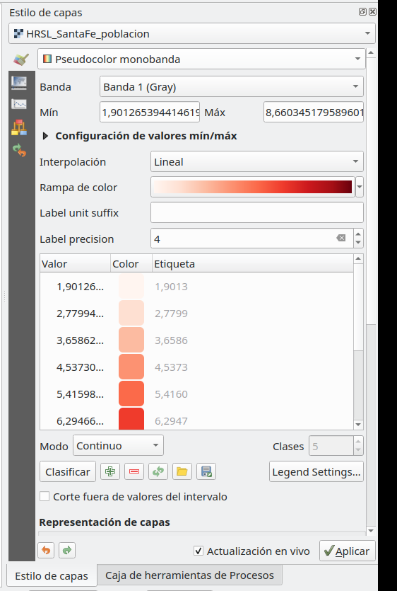

Figura 4.1: Panel Estilo de Capas

#### **Pestaña Simbología en Propiedades de la Capa**

Para acceder a la pestaña Simbología, haga doble clic en la capa para abrir **Propiedades de la Capa-‣ Simbología**

Aquí, puede especificar la configuración de renderización de la banda, como el tipo de renderización, la banda, los valores máximos/de mezcla, la renderización del color y el remuestreo. En las capturas de pantalla a continuación, puede ver las pestañas de simbología para datasets vectoriales y ráster, respectivamente;

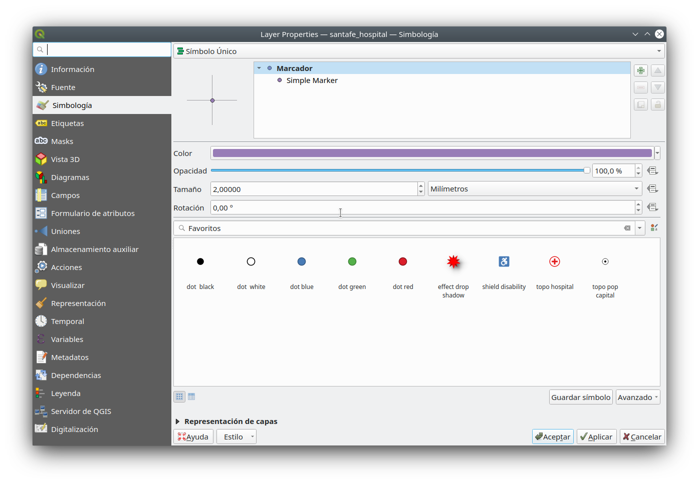

Figura 4.2: Pestaña Simbología para datos vectoriales y ráster, respectivamente

#### **Renderización de ráster: renderización de bandas**

QGIS ofrece cuatro tipos de renderizado diferentes. La elección del renderizador depende del tipo de datos. El tipo de renderizado predeterminado es Color gris de banda única. Tendrá que cambiarlo al tipo apropiado según el tipo de datos.

*   Color multibanda ([https://docs.qgis.org/3.16/en/docs/user_manual/working_with_raster/raster_properties.html#multiband-color](https://translate.google.com/website?sl=en&tl=es&u=https://docs.qgis.org/3.16/en/docs/user_manual/working_with_raster/raster_properties.html%23multiband-color)) - si el archivo viene con varias bandas (por ejemplo, una imagen de satélite con varias bandas).
*   Valores paletizados / únicos ([https://docs.qgis.org/3.16/en/docs/user_manual/working_with_raster/raster_properties.html#paletted](https://ejx443527mp5pavdnqqog23gcy--github-com.translate.goog/school-of-data/GIS-curriculum/blob/main/philippines/module4)) - para archivos de banda única que vienen con una paleta indexada (por ejemplo, un mapa topográfico digital) o para uso general de paletas para renderizar capas ráster.
*   Gris de banda única ([https://docs.qgis.org/3.16/en/docs/user_manual/working_with_raster/raster_properties.html#singleband-gray](https://translate.google.com/website?sl=en&tl=es&u=https://docs.qgis.org/3.16/en/docs/user_manual/working_with_raster/raster_properties.html%23singleband-gray)) - (una banda de) la imagen se mostrará en gris. QGIS elegirá este renderizador si el archivo no es multibanda ni paletizado (por ejemplo, un mapa en relieve sombreado).
*   Pseudocolor de banda única ([https://docs.qgis.org/3.16/en/docs/user_manual/working_with_raster/raster_properties.html#label-colormaptab](https://translate.google.com/website?sl=en&tl=es&u=https://docs.qgis.org/3.16/en/docs/user_manual/working_with_raster/raster_properties.html%23label-colormaptab)): este renderizador se puede utilizar para archivos con una paleta continua o un mapa de color (por ejemplo, un mapa de elevación).
*   Sombreado [(https://docs.qgis.org/3.16/en/docs/user_manual/working_with_raster/raster_properties.html#hillshade-renderer](https://translate.google.com/website?sl=en&tl=es&u=https://docs.qgis.org/3.16/en/docs/user_manual/working_with_raster/raster_properties.html%23hillshade-renderer)) - Crea sombreado a partir de una banda.

#### **Renderización vectorial**

Cuando carga capas de datos espaciales en QGIS Desktop, se les aplica un estilo con una renderización aleatoria de símbolo único. Para cambiar esto, haga clic en **Capa‣Propiedades‣Estilo**.

Hay varias opciones de renderización disponibles en el menú de la esquina superior izquierda:

*   Símbolo único: esta es la renderización predeterminada en la que se aplica un símbolo a todas las entidades de una capa.
*   Categorizado: le permite elegir un campo de atributo categórico para diseñar la capa. Elija el campo y haga clic en Classify (Clasificar) y QGIS aplicará un símbolo diferente a cada valor único en el campo. También puede utilizar el botón Set column expression (establecer expresión de columna) para mejorar el estilo con una expresión SQL.
*   Graduado: le permite clasificar los datos por un atributo de campo numérico en categorías discretas. Puede especificar los parámetros de la clasificación (tipo de clasificación y número de clases) y puede utilizar el botón Set column expression para mejorar el estilo con una expresión SQL.
*   Basado en reglas: use esto para crear un estilo personalizado basado en reglas. Las reglas se basarán en expresiones SQL.
*   Desplazamiento de puntos: si tiene una capade puntos con puntos apilados, esta opción se puede usar para desplazar los puntos para que todos sean visibles.
*   Polígonos invertidos: este es un nuevo renderizador que permite convertir un polígono de entidades en una máscara. Por ejemplo, un polígono de límites de ciudad usado con este renderizador se convertiría en una máscara alrededor de la ciudad. También permite el uso de renderizadores y expresiones SQL categorizados, graduados y basados en reglas.

## Contenido Principal

### Fase 1: Simbología básica de ráster y vector

La simbología de datos vectoriales puede variar según la transparencia, el color, la rotación y el tamaño.

#### **Contenido**

*   Propiedades de la Capa y Simbología
*   Tipos de renderizado vectorial
*   Tipos de renderizado ráster (renderizado de bandas)

#### **Ejemplo 1: renderizado vectorial**

1. Para demostrar este ejemplo, usaremos dos conjuntos de datos de ejemplo; 1. Hospitales y 2. Límite administrativo de la provincia de Santa Fe
2. Agregue las dos capas vectoriales en qgis; Haga clic en el botón Agregar capa vectorial  o use el panel del navegador.
3. Así es como se renderizan por defecto. Notarás que tenemos un polígono y una capa de puntos. El siguiente paso es cambiar la simbología de cada uno de ellos. Los colores de relleno pueden no ser los mismos, pero eso no es un problema porque QGIS selecciona colores al azar para diferentes instancias de la aplicación.

Figura 4.3: Render predeterminado

4. Haga doble clic en la capa vectorial poligonal, que también es la capa límite administrativa de la provincia de Santa Fe, Argentina
5. Seleccione la pestaña Simbología en el menú que aparece
6. Cambie el color de relleno a relleno transparente. Sugerencia: haga clic en la flecha desplegable debajo de Color de relleno
7. El resultado debería ser el siguiente. Puede notar que la opción sin relleno no tiene color

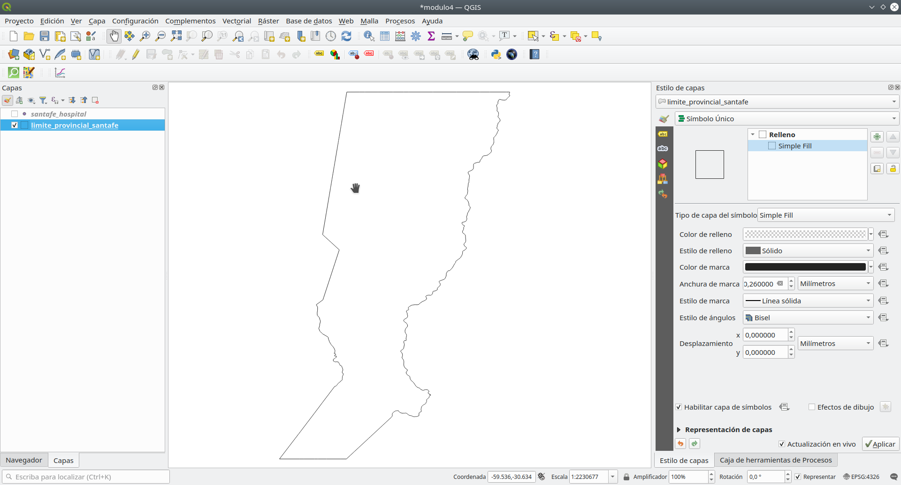

Figura 4.4: Sin renderizado de relleno para el polígono

8. El siguiente paso es simbolizar la capa de puntos que también es la capa de Hospitales
9. Haga doble clic en la capa Hospitales para abrir el diálogo Propiedades de la Capa. Cambie el tipo de renderizado de Símbolo único a Categorizado, seleccione el valor como operator:type. El valor representa el campo de interés. Especifique la rampa de símbolo y color. Luego haga clic en clasificar.

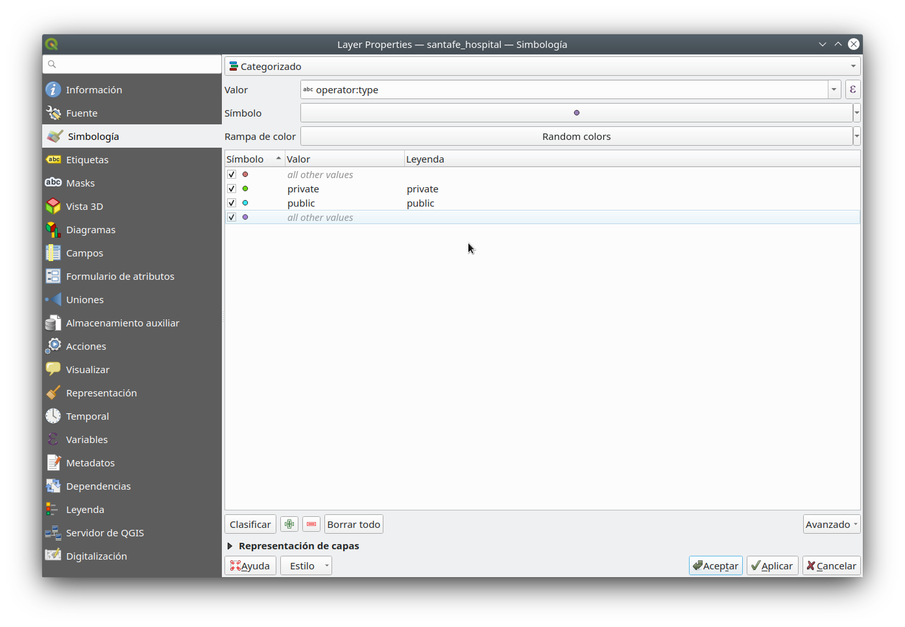

Figura 4.5: Diálogo Propiedades de la Capa

10. El mapa resultante debe verse como se muestra a continuación

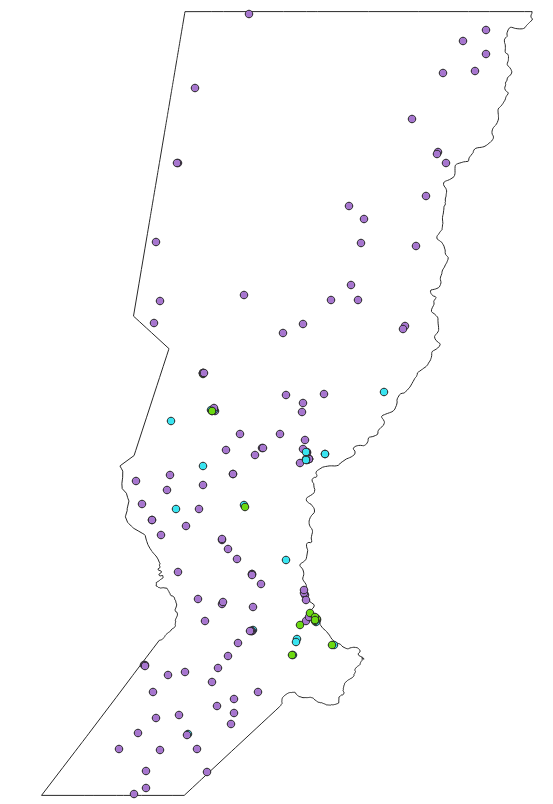

Figura 4.6: Renderizado vectorial final

11. Recuerde organizar las capas en el Panel de Capas de tal manera que la capa de polígono esté debajo de la capa de puntos. Esto hace que la capa de puntos sea visible.

#### **Ejemplo 2: renderizado ráster**

1. Haga doble clic en la capa ráster que también es la capa de densidad de población. Esto también significa que es un conjunto de datos normalizado y, por lo tanto, se puede visualizar como un mapa de coropletas.
2. Seleccione la pestaña Simbología en el menú que aparece
3. Cambie el modo de Estilo a 'Pseudocolor monobanda'

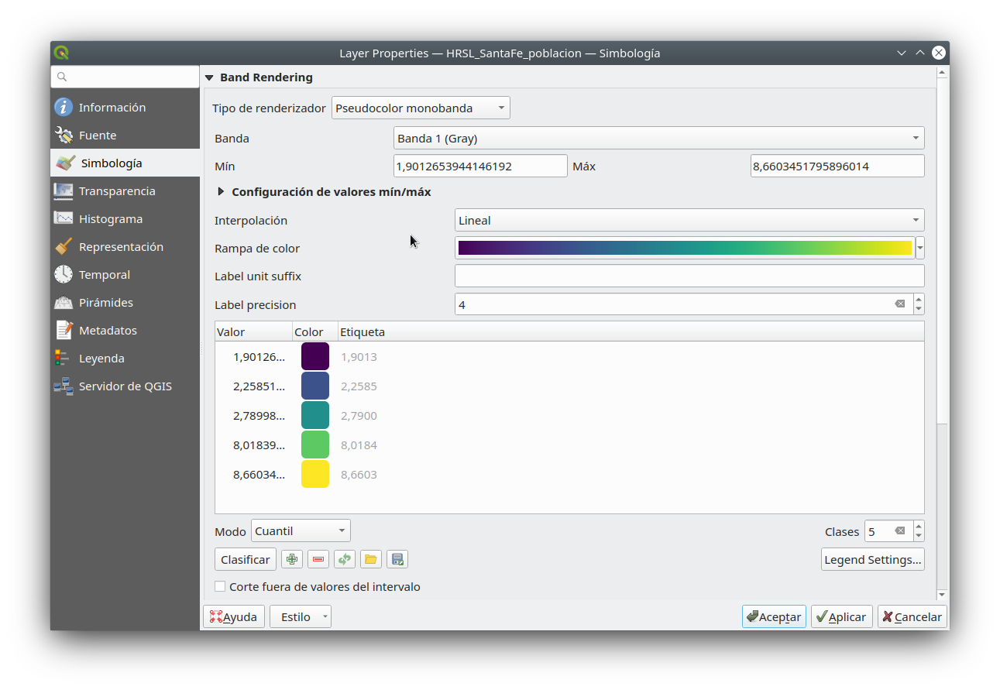

Figura 4.7: Menú Simbología

4. Especifique la interpolación, la rampa de color y el modo. Haga clic en Classify. El resultado es un mapa de coropletas que muestra la densidad de población en la provincia de Santa Fe, Argentina.

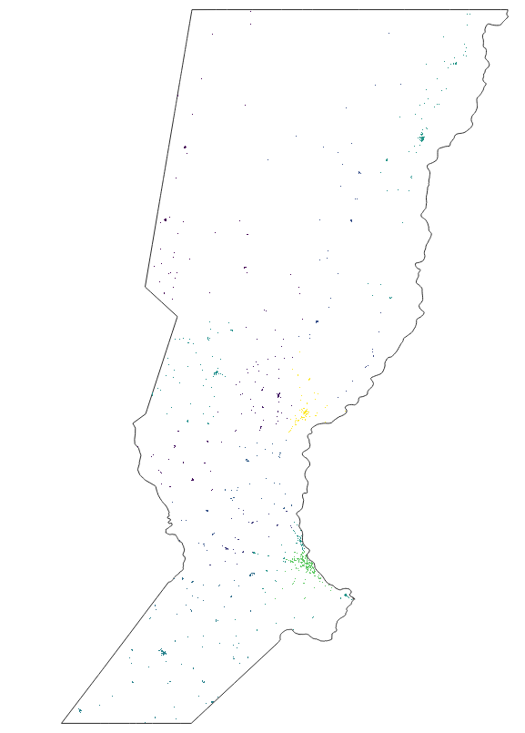

Figura 4.8: Densidad de población de la provincia de Santa Fe, Argentina

5. Acerca la imagen para ver el nuevo mapa con más detalle.

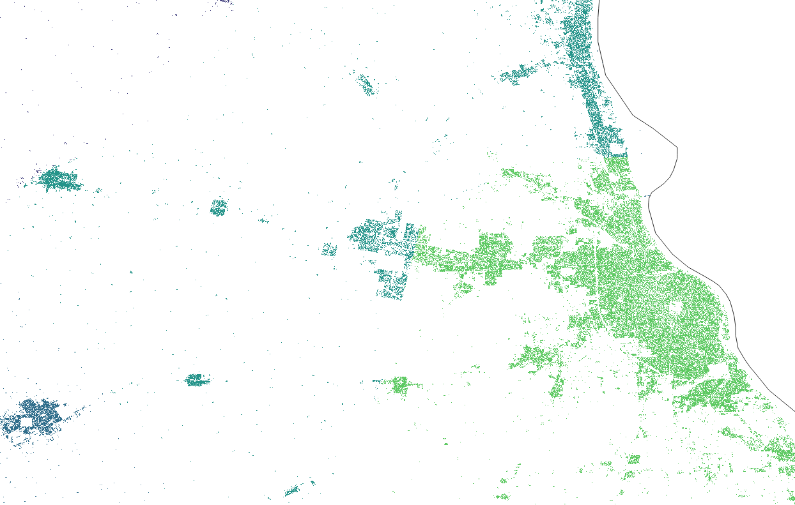

Figura 4.9: Mapa ampliado

6. Alternativamente, use el panel Estilo de Capas.

#### **Preguntas de prueba**

1. ¿Qué es Simbología de Capa?
2. ¿Cuáles de los siguientes tipos de renderización son aplicables a datos vectoriales?
3. ¿Cuáles son los tipos de renderizado ráster?

#### **Respuestas al cuestionario**

1. 
    1. elemento gráfico representado como marcador, trazo o relleno 
    2. un puntero a los datos originales 
    3. un repositorio de diferentes esquemas de color
2. 
    4. renderizador de símbolo único 
    5. sin renderizador de símbolos 
    6. renderizador categorizado 
    7. renderizador graduado 
    8. símbolo proporcional
    9. símbolo proporcional 
    10. renderizador de clúster de puntos
3. 
    11. pseudocolor de banda única 
    12. gris de banda única 
    13. paletizado
    14. color multibanda

### Fase 2: Modo de fusión y efectos de dibujo

#### Contenido

*   Alterar las estructuras de los símbolos
*   Modificar los efectos de dibujo y el modo de fusión
*   Visualización impactante de datos

#### Tutorial

1. Después de cargar las dos capas en QGIS, el canvas se verá como se muestra a continuación. Notarás que ambas capas tienen un estilo sencillo. Este tutorial explicará cómo modificar los efectos de dibujo y el modo de fusión para una mejor visualización.

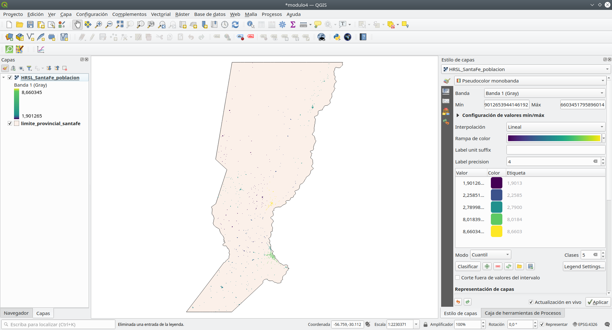

Figura 4.10: El espacio de trabajo inicial esperado

2. Abra la ventana Propiedades de la Capa, luego haga clic en el elemento de menú Simbología para la capa de límites administrativos. Consejo: haz esto haciendo doble clic en la capa o usa el panel de Estilo de Capas. Habilite el panel haciendo clic en: **Ver ‣ Paneles ‣ Estilo de Capas**

En la parte inferior del menú Simbología, hay una casilla de verificación para Draw Effects (Efectos de Dibujo). Habilitemos eso y luego hagamos clic en el botón customize effects (personalizar efectos)  a su derecha:

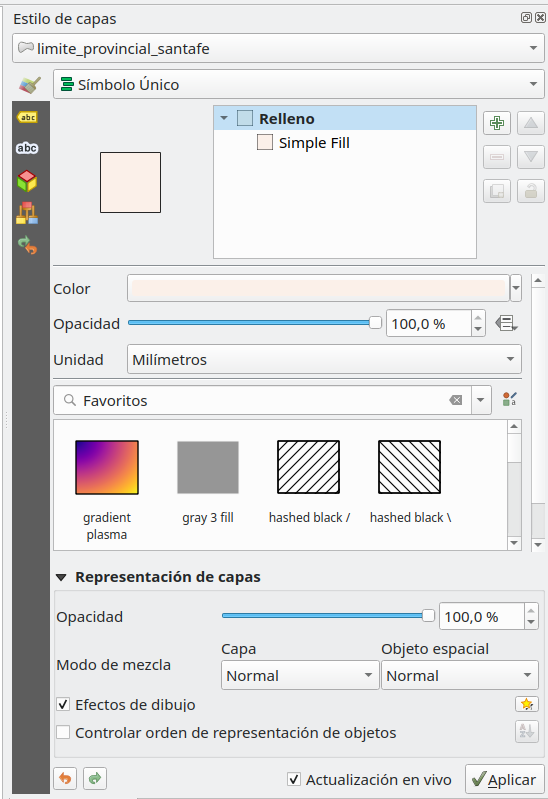

Figura 4.11: Ventana Propiedades de la Capa y menú Simbología

3. Se abre un nuevo cuadro de diálogo Effects Properties

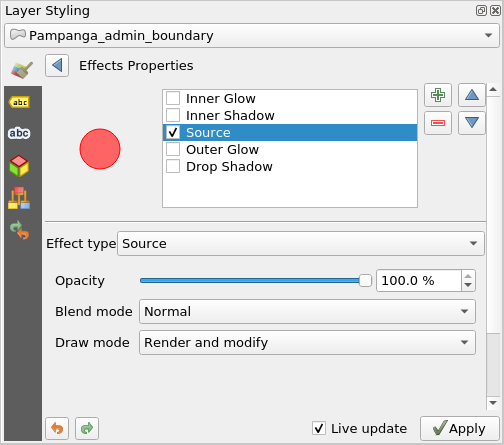

Figura 4.12: Diálogo Effects Properties

4. Puede ver que actualmente el único efecto enumerado es un efecto Source (de fuente). Este no es particularmente interesante: todo lo que hace es dibujar la capa original sin cambios. Cambie esto a un efecto de Blur (Desenfoque) haciendo clic en el cuadro combinado Effect Type (Tipo de efecto) y seleccionando Blur (Desenfocar). A continuación, puede jugar con los parámetros de desenfoque.

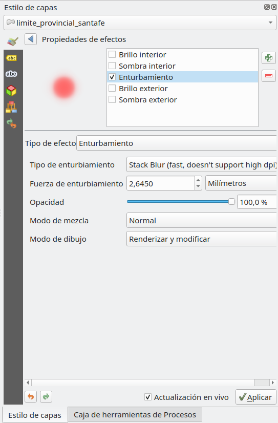

Figura 4.13: Seleccione el tipo de efecto como Blur

5. Aplique la configuración ahora, verá que la capa de polígono ahora está borroso. ¡Ahora estamos llegando a alguna parte!

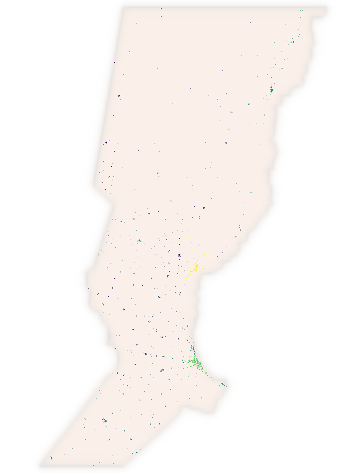

Figura 4.14: Capa borrosa

6. Usando el cuadro de diálogo Effects Properties nuevamente. Probemos algo un poco más avanzado. En lugar de un solo efecto, es posible encadenar varios efectos para crear diferentes resultados. Hagamos una sombra paralela tradicional agregando **Drop shadow** (sombra exterior) debajo del efecto **Source**.

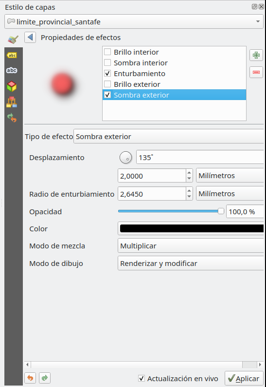

Figura 4.15: Diálogo Effects Properties

7. Los efectos se dibujan de arriba hacia abajo, por lo que la sombra paralela aparecerá debajo de los polígonos de source.

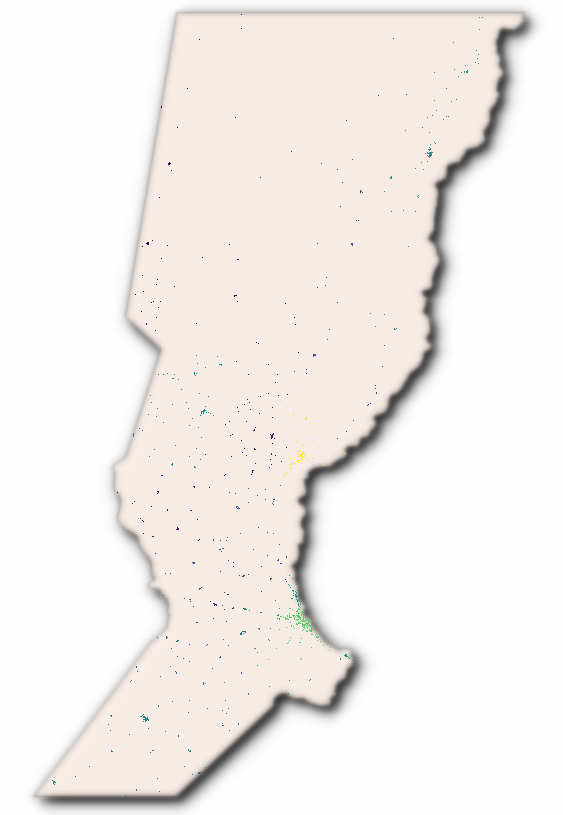

Figura 4.16: Efecto de sombra paralela

8. Puedes apilar tantos efectos como quieras. Por ejemplo, un resplandor interior sobre un efecto de source, con una sombra debajo de todo. ¡Pruébalo!

En general, recuerde que los efectos se pueden aplicar a una capa completo o a las capas de símbolo individuales para las entidades dentro de una capa. Básicamente, ¡las posibilidades son casi infinitas! Los complementos de Python también pueden extender esto aún más implementando efectos adicionales.

Para obtener más ejemplos sobre lo que puede hacer con modo de fusión y los efectos de dibujo en QGIS, puede consultar:
*   Sombreado en QGIS - [https://bnhr.xyz/2019/02/08/mapping-icebergs-in-qgis.html](https://translate.google.com/website?sl=en&tl=es&u=https://bnhr.xyz/2019/02/08/mapping-icebergs-in-qgis.html)
*   Mapeo de Icebergs en QGIS - [https://bnhr.xyz/2019/02/08/mapping-icebergs-in-qgis.html](https://translate.google.com/website?sl=en&tl=es&u=https://bnhr.xyz/2019/02/08/mapping-icebergs-in-qgis.html)

### Fase 3: Overrides (anulaciones) definidas por datos y generadores de geometría

#### Contenido

*   Ejecutar una operación espacial dentro de Simbología de Capa

#### **Tutorial**

Un generador de geometría es un tipo de capa de símbolo que le permite usar código para crear nuevas geometrías a partir de entidades existentes y usar las nuevas geometrías "generadas" como símbolos que, a su vez, pueden tener estilos aplicados. Esta es una característica poderosa que se explica mejor con un ejemplo.

Puede utilizar la simbología del generador de geometría con todos los tipos de capas (puntos, líneas y polígonos). El símbolo resultante depende directamente del tipo de capa.

Muy brevemente, la simbología del generador de geometría le permite ejecutar algunas operaciones espaciales dentro de la simbología misma. Por ejemplo, puede ejecutar una operación espacial de centroide real en una capa de polígono sin crear una capa de puntos.

Además, tiene todas las opciones de estilo para cambiar la apariencia del símbolo resultante. Aquí hay un tutorial de ejemplo;

1. Haga doble clic en la capa de límite administrativo
2. Haga clic en Relleno simple y cambie el tipo de capa de Símbolo a Generador de geometría. Antes de comenzar a escribir la consulta espacial, elija el tipo de geometría en output. En este ejemplo vamos a crear centroides para cada entidad, así que cambiaremos el tipo de geometría a Point / Multipoint (Punto / Multipunto).

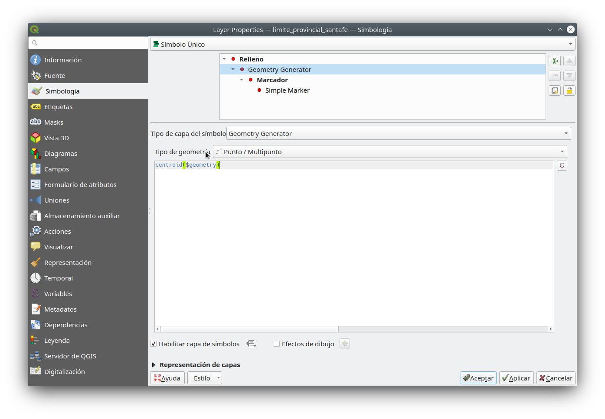

Figura 4.17: Operación centroide en la capa límite administrativo

3. Cuando haga clic en Aceptar, verá que el límite de la capa administrativo se representa como una capa de puntos. Acabamos de ejecutar una operación espacial dentro de la simbología de la capa.

Figura 4.18: Capa de puntos

4. Tenga en cuenta que una forma alternativa y más sencilla de escribir consultas espaciales es utilizar el "Expressions dialogue" (diálogo Expresiones). Haga clic en el botón  de expresiones para abrir el cuadro de diálogo "Expression string builder" (Generador de cadenas de expresión). Aquí tendrá acceso a una amplia referencia de funciones. Puede buscar una función por nombre. Por ejemplo, escriba centroid (centroide) en la barra de búsqueda.
5. Con la simbología del generador de geometría realmente puede ir más allá de la simbología normal.
6. Si desea ir más allá, escriba una consulta espacial para calcular una zona de amortiguación alrededor de la capa de punto, línea o polígono.

#### **Preguntas de evaluación**

1. N/A

#### **Respuestas al cuestionario**

1. N/A