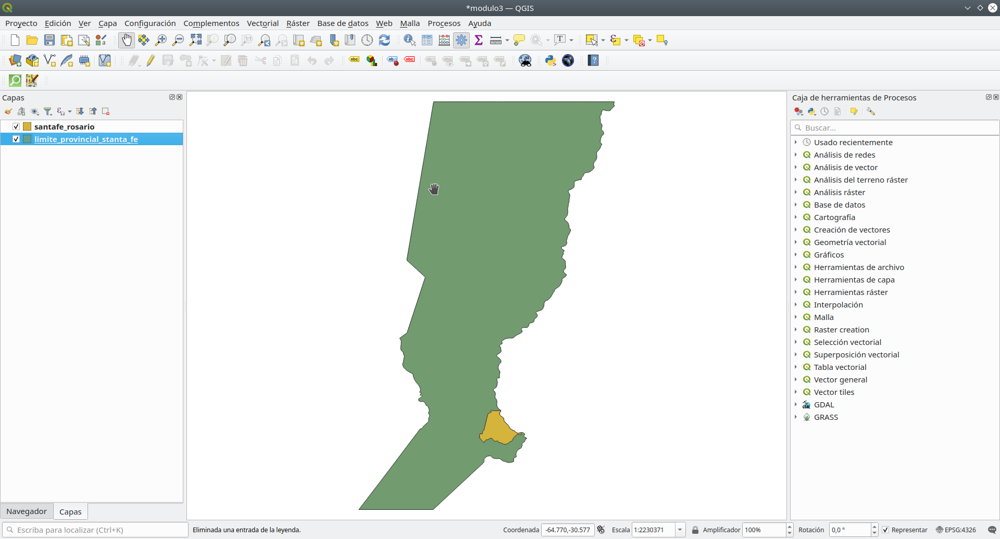
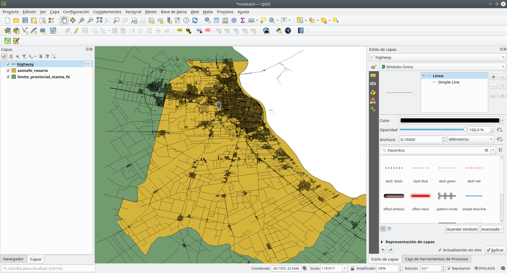
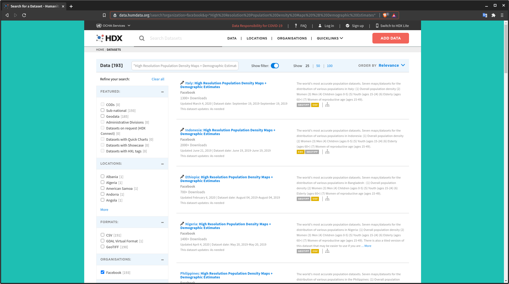
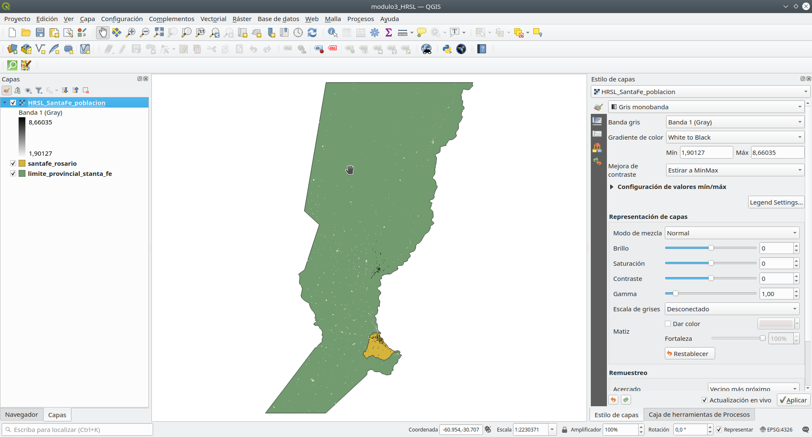
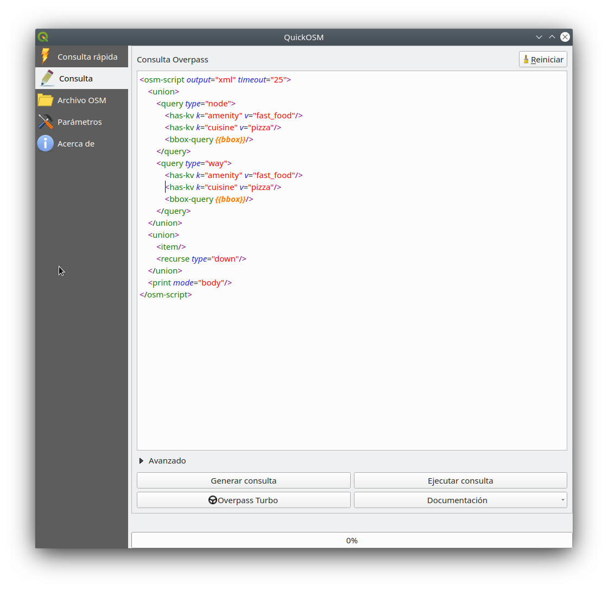
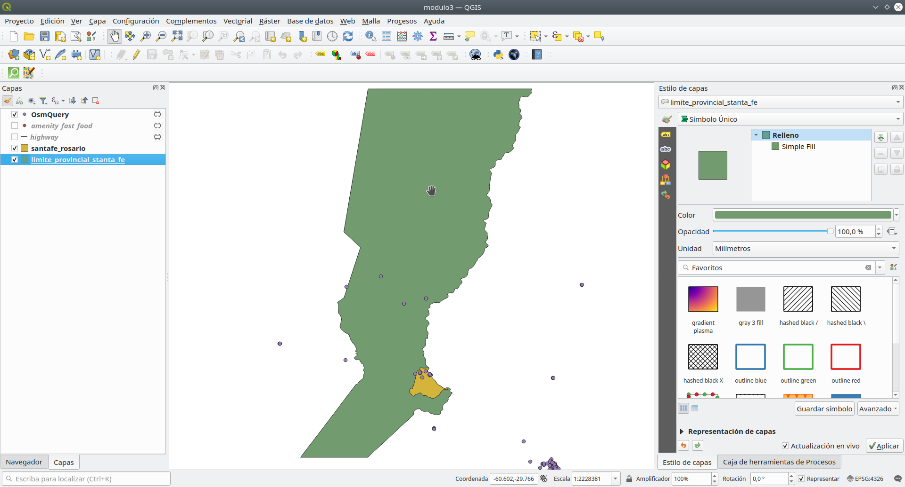

# Módulo 3 - OpenStreetMap y la Capa de Alta Resolución de Asentamientos 

**Autor**: Ben

**Traductora**: Malena

## Introducción Pedagógica

Este módulo introducirá OpenStreetMap (OSM) y la Capa de Alta Resolución de Asentamientos (HRSL).  Al final de este módulo, estarás familiarizado con

*   Los principios de OpenStreetMap
*   Los datos de OpenStreetMap y casos de uso
*   Los datos de  Capa de Alta Resolución de Asentamientos y casos de uso

También deberías poder

*   Cargar datos OSM como vectores y teselas en QGIS
*   Cargar el ráster HRSL en QGIS

## Herramientas y recursos necesarios

Las herramientas y los recursos necesarios para este módulo son:

*   computadora de trabajo
*   conexión a Internet
*   QGIS 3.16 instalado en la computadora 	([https://qgis.org/en/site/forusers/download.html](https://qgis.org/en/site/forusers/download.html))

## Prerrequisitos

*   Conocimientos básicos sobre cómo operar una computadora 
*   Familiaridad con los formatos de datos espaciales, la interfaz de QGIS y cómo cargar capas (haber completado los Módulos 0, 1 y 2)

## Recursos Adicionales

* Facebook - Capa de Alta Resolución de Asentamientos - [https://research.fb.com/downloads/high-resolution-settlement-capa-hrsl/](https://research.fb.com/downloads/high-resolution-settlement-layer-hrsl/)
* CEISIN - Capa de Alta Resolución de Asentamientos - [https://ciesin.columbia.edu/data/hrsl/](https://ciesin.columbia.edu/data/hrsl/)
* Manual de Usuario Overpass API - [https://dev.overpass-api.de/overpass-doc/en/](https://dev.overpass-api.de/overpass-doc/en/)
* HDX HRSL - [https://data.humdata.org/search?organization=facebook&q=%22High%20Resolution%20Population%20Density%20Maps%20%2B%20Demographic%20Estimates%22](https://data.humdata.org/search?organization=facebook&q=%22High%20Resolution%20Population%20Density%20Maps%20%2B%20Demographic%20Estimates%22)

## Introducción Temática

Los mapas se han vuelto omnipresentes en nuestra vida diaria. Podemos simplemente levantar nuestros teléfonos y abrir aplicaciones que utilizan mapas y datos de ubicación. Hay aplicaciones que usamos para orientarnos y ubicarnos, para navegar y llegar de un lugar a otro, los mapas se muestran cuando pedimos comida a nuestro servicio de delivery favorito, etc. Los mapas se han convertido en una parte integral de nuestras actividades diarias que tendemos a olvidar que hay lugares en el mundo que aún no están cartografiados o no se encuentran en los mapas digitales que usamos.

### Desglose de los conceptos	

La ubicuidad de los mapas en nuestras vidas es un subproducto de la gran cantidad de datos espaciales y de ubicación que estamos recopilando. Las oportunidades y el potencial para crear algo bueno a partir de los datos geoespaciales disponibles para nosotros son excepcionales, pero esto solo será posible si estos conjuntos de datos geoespaciales son gratuitos y abiertos.

## Contenido Principal

### Título de la Fase 1: datos en OpenStreetMap (OSM)

#### **¿Qué es OpenStreetMap (OSM)?**

OpenStreetMap (OSM) ([https://www.openstreetmap.org/](https://www.openstreetmap.org/)) es un mapa gratuito y editable de todo el mundo creado por voluntarios de todo el mundo y publicado con una licencia de contenido abierto. Es un proyecto que crea y distribuye datos geográficos gratuitos para el mundo - un mapa del mundo por la gente y para la gente. Si falta algo en OSM, puedes agregarlo. Si algo está mal en OSM, puedes corregirlo. OSM es un bien común digital que amplifica enormemente el valor de la información que se le agrega.

Figura 1. OpenStreetMap

Para obtener más información sobre por qué existe OpenStreetMap y su importancia, consulta: [https://wiki.openstreetmap.org/wiki/ES:Preguntas_frecuentes#.C2.BFPor_qu.C3.A9_OpenStreetMap.3F](https://wiki.openstreetmap.org/wiki/ES:Preguntas_frecuentes#.C2.BFPor_qu.C3.A9_OpenStreetMap.3F) 

También puedes leer: [https://wiki.openstreetmap.org/wiki/ES:Acerca_de_OpenStreetMap](https://wiki.openstreetmap.org/wiki/ES:Acerca_de_OpenStreetMap)

Según OpenStreetMap, “son datos abiertos, con licencia de Open Data Commons Open Database License (ODbL) [(https://opendatacommons.org/licenses/odbl/](https://opendatacommons.org/licenses/odbl/)) por la Fundación OpenStreetMap (OSMF) ([https://osmfoundation.org/](https://osmfoundation.org/)) ” y “cualquiera es libre de copiar, distribuir, transmitir y adaptar nuestros datos, siempre que dé crédito a OpenStreetMap y sus colaboradores. Si modificas o te basas en nuestros datos, puedes distribuir el resultado solo bajo la misma licencia". Al crear un mapa que utiliza datos de OSM, es necesario que acredites "©contribuyentes de OpenStreetMap". Puedes leer más sobre los derechos de autor y la licencia de OpenStreetMap aquí: [https://www.openstreetmap.org/copyright](https://www.openstreetmap.org/copyright)

#### **¿Dónde se usa OpenStreetMap?**

Uno de los valores fundamentales de OpenStreetMap es la capacidad de recopilar, editar y compartir datos de mapas que se pueden utilizar para muchos propósitos diferentes. Esa es la libertad que ofrece el ObDL. Debido a que OpenStreetMap permite a los usuarios utilizar sus datos con muy pocas restricciones, existe una amplia variedad de aplicaciones, servicios y casos de uso que fueron creados o se pueden crear con OpenStreetMap. OpenStreetMap se utiliza para crear mapas, servicios de enrutamiento, educación e incluso con fines humanitarios y de promoción.

De hecho, existe HOT o el Equipo Humanitario de OpenStreetMap ([https://www.hotosm.org/](https://www.hotosm.org/)) que es un equipo internacional dedicado a la acción humanitaria y el desarrollo comunitario a través del mapeo abierto.

OpenStreetMap también es una parte crucial de algunas comunidades de mapeo activista como MapBeks ([https://wiki.openstreetmap.org/wiki/MapBeks](https://wiki.openstreetmap.org/wiki/MapBeks)), una comunidad de mapeo LGBT en línea, con sede en Filipinas, que aboga por la inclusión de la diversidad y la representación centrada específicamente para lesbianas, gays, bisexuales, transgénero, queer, intersexuales, etc. (LGBTQI +) en OpenStreetMap; y Mental Health AWHEREness ([https://mentalhealthawhereness.com/](https://mentalhealthawhereness.com/)): una plataforma en línea organizada por voluntarios y un mapa que muestra la ubicación de las instalaciones y servicios de salud mental que ofrecen ayuda a las personas sobre su salud mental en Filipinas.

Una lista de los servicios basados en OpenStreetMap puede hallarse en [https://wiki.openstreetmap.org/wiki/List_of_OSM-based_services](https://wiki.openstreetmap.org/wiki/List_of_OSM-based_services).

#### **¿Cómo puede utilizarse OpenStreetMap en QGIS?

Los datos OSM se pueden usar en QGIS de varias formas. El primero es mediante el uso de capas de teselas derivadas de OSM como mapas base. De hecho, QGIS viene con una conexión a  capas de teselas de OpenStreetMap por defecto. Puedes encontrar esta capa llamada "OpenStreetMap" en la lista XYZ Tiles en el Navegador.

Puedes agregar otras teselas derivadas de OSM en QGIS, como los que se encuentran en la lista de proveedores de folletos ([https://leaflet-extras.github.io/leaflet-providers/preview/](https://leaflet-extras.github.io/leaflet-providers/preview/)). Las teselas derivadas de OSM brindan a los usuarios acceso libre y abierto a un mapa base actualizado, ya que estos generalmente se actualizan regularmente para que coincidan con el estado actual (por ejemplo, características) de OSM.

También puedes cargar las características de OSM como datos vectoriales en QGIS. Esto se puede hacer descargando datos OSM de sitios como GEOFABRIK

([https://www.geofabrik.de/data/download.html](https://www.geofabrik.de/data/download.html)). 

Los datos de las características de OSM también se pueden cargar directamente en QGIS usando el complemento QuickOSM. Este aprovecha el API Overpass ([https://wiki.openstreetmap.org/wiki/ES:API_de_Overpasshttps://wiki.openstreetmap.org/wiki/Overpass_API](https://wiki.openstreetmap.org/wiki/ES:API_de_Overpass)) que permite a los usuarios seleccionar rápidamente un subconjunto de datos de OSM mediante queries (consultas). Esto es posible porque las funciones en OSM ([https://wiki.openstreetmap.org/wiki/Mapfeatures](https://wiki.openstreetmap.org/wiki/Mapfeatures)) se etiquetan mediante un sistema de etiquetado gratuito ([https://wiki.openstreetmap.org/wiki/Tags](https://wiki.openstreetmap.org/wiki/Tags)) que permite que el mapa incluya un número ilimitado de atributos que describen cada característica. Luego, estas etiquetas se pueden usar para consultar ciertas características en función de sus atributos / etiquetas.

Por lo general, la comunidad OSM y las comunidades locales acuerdan ciertas combinaciones de claves y valores adecuadas para las etiquetas más utilizadas, las cuales actúan como un estándar informal. Esto asegura que los usuarios de datos puedan esperar coherencia al etiquetar las características comunes como carreteras, edificios, etc. Sin embargo. los usuarios siempre pueden crear nuevas etiquetas para mejorar el estilo del mapa o respaldar análisis que se basan en atributos o etiquetas de las características  no mapeadas previamente.

#### **Ejercicio 1: carga de datos OSM en QGIS usando el complemento QuickOSM

Para este ejercicio, cargaremos los datos de la red de carreteras y las ubicaciones de las cadenas de comida rápida de OSM que se pueden encontrar en la provincia de Santa Fe, Argentina utilizando el complemento QuickOSM.

QuickOSM funciona consultando las etiquetas (claves y valores) de las funciones en OSM. Para obtener más información sobre cómo usar la clave / valor en QuickOSM, ve a:

[https://wiki.openstreetmap.org/wiki/Mapfeatures](https://wiki.openstreetmap.org/wiki/Mapfeatures).

1. Carga las capas vectoriales limite_provincial_stanta_fe y santafe_rosario que se encuentran en el geopackage santafe_limites.

Figura 2. Las capas de Santa Fe cargadas en QGIS

2. Asegúrate de que el complemento QuickOSM esté instalado y activado. Debería aparecer  en el Menú en **Vectorial -> QuickOSM**. Si no aparece, instálalo y actívalo con el cuadro de diálogo Manage and Install Complementos.
3. Abre el complemento QuickOSM (**Vector -> QuickOSM -> QuickOSM**). Debería abrirse un cuadro de diálogo con cinco pestañas:
    1. Consulta Rápida

        * Permite al usuario crear y ejecutar una consulta simple con una combinación clave-valor para cargar un subconjunto de datos de las características de OSM que cumpla con los requisitos de la consulta.

    2. Consulta
        * Permite a los usuarios hacer queries complejas usando la API Overpass.
        * Está conectada a la aplicación web Overpass Turbo. 
        
    3. OSM File:
        * Permite al usuario cargar los datos de los archivos OSM (por ejemplo, .pbf).

    4. Parameters (Parámetros):
        * Permite al usuario seleccionar la API Overpass para usar.

    5. About (Sobre):
        * Muestra información sobre el complemento.

Figura 3. Complemento QuickOSM

4. Carga todas las carreteras dentro de la extensión de la capa santafe_rosario
    6. Clave: carretera
    7. Valor: <en blanco>  (significa TODOS)
    8. Extensión de la Capa: santafe_rosario
    9. Avanzado:
        7. Seleccionar: Nodo, Vía, Líneas, Multilinestrings

Figura 4. Carga todas las carreteras en la extensión de la capa santafe_rosario

5. Haz clic en Ejecutar Consulta. Básicamente, lo que le estamos diciendo a QuickOSM es que todas las funciones de línea o multilínea se etiqueten con una clave de carretera y se carguen en QGIS. Cuando el complemento termine de cargar la capa, su mapa debería verse como a continuación:

Figura 5. Datos de carreteras cargados desde OSM

6. Tenga en cuenta que las capas cargados por QuickOSM son temporales. Debe guardarlos como archivos o hacerlos persistentes si necesita usarlos más adelante.
7. Si desea ver la versión de la consulta Overpass de su Consulta rápida, haga clic en mostrar Consulta y se abrirá en la pestaña Consulta. Luego, puede editar su consulta para hacerla más compleja.

Figura 6. La versión Overpass de la Consulta rápida para cargar carreteras

8. Ahora carguemos todas las locaciones de restaurantes de comida rápida en la capa santafe_limites. Abre el complemento QuickOSM complemento y coloca los siguientes parámetros en la pestaña Consulta rápida:

    * Clave: amenity
    * Valor: fast_food
    * Extensión de Capa: santafe_limites
    * Avanzado:
        * Seleccionar: Nodo, Puntos

 tagged as fast_food in the santafe_rosario layer extent")

Figura 7: Cargar servicios (puntos) etiquetados como fast_food en la extensión de la capa santafe_limites

9. El output debería verse así:

Figura 8: Locaciones de Comida Rápida cargados desde OSM

10. Observe que incluso se cargan los datos fuera de los polígonos. Esto se debe a que estamos usando la extensión de la capa como nuestro cuadro delimitador. Si solo necesitamos las entidades dentro del polígono, podemos seleccionar o recortar estas entidades. El proceso de cómo hacer esto se discutirá en módulos futuros.

#### Preguntas de evaluación**

1. Verdadero o Falso:

    1. Una característica en OpenStreetMap sólo puede tener una etiqueta o atributo.
    2. Solo puedes agregar puntos en OpenStreetMap.
    3. OpenStreetMap sólo puede usarse como un mapa online. 

### Título de la Fase 2: Los datos de la Capa de Alta Resolución de Asentamientos (HRSL) 

#### **¿Qué es la Capa de Alta Resolución de Asentamientos (HRSL)?**

Según Facebook y el Centro para la Red Internacional de Información sobre Ciencias de la Tierra (CIESIN) de la Universidad de Columbia, el "Capa de Alta Resolución de Asentamientos (Capa de asentamiento de alta resolución) proporciona estimaciones de la distribución de la población humana a una resolución de 1 segundo de arco (aproximadamente 30 m)".

Se han desarrollado cuadrículas de población para 140 países y se puede acceder a ellas desde Humanitarian Data Exchange

([https://data.humdata.org/search?organization=facebook&q=%22High%20Resolution%20Population%20Density%20Maps%20%2B%20Demographic%20Estimates%22](https://data.humdata.org/search?organization=facebook&q=%22High%20Resolution%20Population%20Density%20Maps%20%2B%20Demographic%20Estimates%22)). 

Las estimaciones de población se basan en datos del censo e imágenes de satélite de alta resolución (0,5) de DigitalGlobe. Los asentamientos y las estructuras construidas por humanos se identifican en las imágenes aplicando técnicas de visión por computadora. Estas ubicaciones se utilizan luego como un proxy de los lugares donde vive la gente. Posteriormente, CIESIN utilizó la asignación proporcional para distribuir los datos de población de los datos del censo a las extensiones de asentamiento.

Para la iteración actual de la HRSL, se encuentran disponibles siete mapas / conjuntos de datos para la distribución de varias poblaciones:

1. Densidad de población general
2. Mujeres 
3. Hombres
4. Niños (edades 0-5) 
5. Juventud (edades 15-24) 
6. Ancianos (edades 60+) 
7. Mujeres en edad reproductiva (edades 15-49)

Figura 9: Datos HRSL en HDX

#### **Casos de uso de HRSL**

Las cuadrículas de población proporcionan información precisa y de alta resolución tanto sobre la delimitación de asentamientos en áreas urbanas y rurales como sobre el número de personas que viven en ellas. Esta información es útil para muchas áreas de investigación, como respuesta humanitaria y ante desastres, planificación y desarrollo de infraestructura.

Para leer más sobre HSRL, puedes ir a:

Cómo trabajar con datos de densidad de población de Facebook -

[http://www.statsmapsnpix.com/2021/01/how-to-work-with-facebook-population.html](http://www.statsmapsnpix.com/2021/01/how-to-work-with-facebook-population.html)

Población abierta y desafíos abiertos - [https://engineering.fb.com/2016/11/15/core-data/open-population-datasets-and-open-challenges/](https://engineering.fb.com/2016/11/15/core-data/open-population-datasets-and-open-challenges/)

Conectando el mundo con mejores mapas - [https://engineering.fb.com/2016/02/21/core-data/connecting-the-world-with-better-maps/](https://engineering.fb.com/2016/02/21/core-data/connecting-the-world-with-better-maps/)

Mapeando la población mundial de a un edificio por vez - [https://arxiv.org/abs/1712.05839](https://arxiv.org/abs/1712.05839)

#### **Ejercicio 2: Cargando los datos HRSL data en QGIS**

Los datos HRSL encontrados en HDX vienen en formato GeoTIFF (raster) y CSV (vector). Los CSV son ubicaciones puntuales con los valores de población correspondientes. Para este ejercicio, ya se preparó un subconjunto de los datos de su país, pero siempre puedes descargar el dataset completo o incluso otros para probar.

1. Carga el archivo ráster **HRSL_SantaFe_poblacion** en QGIS.

Figura 10: El HRSL para Santa Fe, Argentina

2. Revisa las propiedades de la capa.
3. También puedes editar la simbología y el estilo del ráster (los veremos más adelante)  

#### Preguntas de evaluación**

1. ¿Qué conjuntos de datos fueron usados para obtener la ubicación de asentamientos y  asignar la población a estos asentamientos?
2. ¿Cómo obtuvo el HRSL la ubicación de asentamientos?
3. ¿Cómo se asignó la población de un área a los asentamientos?

### Si quieres ir más lejos:  

#### **Usa la API Overpass para crear una Consulta en OSM**

La API Overpass ([https://wiki.openstreetmap.org/wiki/Overpass_API](https://wiki.openstreetmap.org/wiki/Overpass_API)), anteriormente conocida como OSM Server Side Scripting, o OSM3S antes de 2011, es una API de solo lectura que ofrece partes seleccionadas personalizadas de los datos del mapa de OSM. A diferencia de la API principal, que está optimizada para la edición, la API Overpass está optimizada para que los consumidores de datos obtengan un pequeño subconjunto de los aproximadamente 10 millones de elementos en OpenStreetMap. Estos subconjuntos se pueden seleccionar por criterios de búsqueda como ubicación, tipo de objetos, propiedades de etiqueta, proximidad o combinaciones de ellos. La API Overpass sirve como backend para otros servicios basados en OSM como el complemento QuickOSM.

El uso de una consulta Overpass le permite crear una selección de las características más complejas en QuickOSM. Por ejemplo, volvamos a cargar todas las comidas rápidas dentro de la extensión de limite_provincial_stanta_fe pero esta vez solo obtengamos las ramas de Jollibee. Si observa la tabla de atributos de la capa de comida rápida, notará que tiene el campo **nombre**. Los campos en la tabla de atributos de datos cargados desde OSM corresponden a las claves de etiqueta, por lo que si queremos seleccionar todas las Pizzerías, necesitamos agregar un filtro que seleccione una característica si tiene un **clave:valor** de **cuisine: pizza**. Este filtro puede agregarse fácilmente con una API Overpass.

1. Abre el complemento QuickOSM y coloca los parámetros que utilizamos para la consulta de comida rápida.

Consulta rápida para cargar todos los servicios etiquetados como comida rápida

2. Haz clic en mostrar consulta.

Overpass para cargar todos los servicios etiquetados como comida rápida

3. Edita la consulta y agrega la línea **<has-kv k="cuisine" v="pizza"/>** luego de cada línea que diga <has-kv k="amenity" v="fast_food"/>.

Consulta Overpass para cargar todos los servicios etiquetados como comida rápida cuyo nombre es Jollibee

4. Haz clic en Ejecutar consulta. Esto debería cargar solo los servicios etiquetados como fast_food con el nombre Jollibee. El nombre de la capa será OsmConsulta.

Servicios etiquetados como comida rápida de Pizza cargados desde OSM

5. Pruébalo con otras cadenas de comida rápida.

También puedes probar y crear queries Overpass en Overpass turbo ([https://wiki.openstreetmap.org/wiki/Overpass_turbo](https://wiki.openstreetmap.org/wiki/Overpass_turbo)) que es una herramienta de minado de datos basada en la web para OpenStreetMap.

### Para practicar tus nuevas habilidades, intenta…

#### **Cargar más características de OSM usando el complemento QuickOSM**

1. Intenta cargar otras características (puntos, líneas, polígonos) como hospitales, escuelas, etc. utilizando el complemento QuickOSM.

### Tips 

Si no puedes encontrar la función que deseas o necesitas en OpenStreetMap, siempre puedes agregar o editar funciones en el mapa. ¡Regístrate en [https://www.openstreetmap.org](https://www.openstreetmap.org)/ y comienza a contribuir!
