

<h1>
الوحدة 10 - البرامج المساعدة أو ملحقات QGIS
</h2>

المؤلفين: Codrina, Ben Hur    

<h2>
مقدمة تعليمية
</h2>

ستسلط هذه الوحدة الضوء على بعض البرامج المساعدة الأكثر إثارة للاهتمام والتي نأمل أن تكون مفيدة، والتي قام المجتمع الدولي لـQGIS بتطويرها وإتاحتها للجميع لاستخدامها. 

<h4>
واكتساب المهارات التالية:
</h4>

*   كيفية البحث عن برامج مساعدة جديدة وتثبيتها
*   كيفية التبديل بين مختلف مستودعات البرامج المساعدة
*   كيفية قراءة وثائق البرنامج المساعد وما الذي يجب أن تبحث عنه.
*   تفاصيل عن بعض وظائف البرامج المساعدة الأكثر شيوعًا.

<h2>
الأدوات والموارد المطلوبة لهذه الوحدة هي:
</h2>

*   تم إعداد هذه الوحدة باستخدام [QGIS الإصدار 3.16 - هانوفر](https://qgis.org/en/site/forusers/download.html)

<h2>
المؤهلات المطلوبة
</h2>

*   المعرفة الأساسية لتشغيل حاسوب
*   فهم جيّد لجميع الوحدات، حيث أن البرامج المساعدة التي سنقدمها تنطبق على المفاهيم/ العناصر المختلفة التي تم شرحها في هذا المنهج، مثل المتجهات والنقطية وجداول السّمات وقواعد رسم الخرائط وغيرها.

<h2>
مقدمة موضوعية
</h2>

<h3>
المرحلة 1: مقدمة في عقلية البرنامج المساعد
</h3>

تتمثل إحدى مزايا المجتمع "مفتوح المصدر"، للمطورين والمستخدمين على حدٍ سواء،  في السرعة المذهلة التي تحدث بها التطورات والتحسينات، والطريقة التي تنطلق بها الأفكار الجديدة وبعد ذلك كيفية وضعها موضع التنفيذ.

كما ذكرنا في الوحدة 1، تم تصميم QGIS مع هندسة "البرنامج المساعد". هذا ما يسمح بتخصيصه بسهولة لاحتياجات المستخدم عن طريق إضافة ملحقات خارجية. في الواقع، QGIS هو مزيج من البرامج المساعدة الأساسية (core) والخارجية (external). تشكل البرامج المساعدة الأساسية الهيكل الرئيسي كما يوحي اسمها، ويتم صيانتها بواسطة فريق تطوير QGIS ويتم تضمينها دائمًا في التثبيت، مثل البرنامج المساعد للمعالجة (Processing core plugin) أو إحصائيات المنطقة (Zonal Statistics) أو مدير البرنامج المساعد (Plugin Manager). مع مرور الوقت و بحسب أهميّة بعض الملحقات تم نقلها من كونها خارجية إلى أساسية.

بالطبع، نظرًا لمبادئ المصدر المفتوح، إلى جانب الوثائق المفيدة والمفصلة والعديد من قنوات الاتصال والأحداث المخصصة المتاحة، يمكن للمرء أن يتعلم كيفية إنشاء برنامجه المساعد لتلبية متطلباته الخاصة. وهذا ما يعتبر "برنامج مساعد" خارجي. يمكنك العثور على جميع الوثائق اللازمة  على <a href="https://plugins.qgis.org/">صفحة الويب</a> المخصصة. تتم كتابة معظم البرامج المساعدة بلغة Python، ولكن يمكن أيضًا كتابتها بلغة ++C .

في المرحلة الأولى، سنستكشف الإعدادات الأساسية للبرامج المساعدة في QGIS. مثلاً، كيفية البحث عن البرنامج المساعد لحل متطلب معين، وكيفية تفسير الوثائق المرتبطة به وكيفية إبلاغ المطوّر في حال مواجهة أية مشاكل.

<h4>
مدير البرنامج المساعد (The Plugin manager)
</h4>

يقدم QGIS برنامجاً مساعداً أساسيًا للسماح للمستخدمين بإدارة البرامج المساعدة الخارجية وتثبيتها وتحديثها وإلغاء تثبيتها. الوظيفة بديهية، وتوفر وصولاً كاملاً إلى مستودع البرامج المساعدة الرسمي العام.

يجب التأكيد على أن البرامج المساعدة الخارجية - سواء كانت رسمية أو تجريبية - هي عمل للمطورين أو المؤسسات الفردية ولا تتحمل مؤسسة QGIS أي مسؤولية عنها. ومع ذلك، هناك بعض القواعد التي يجب على المطورين الذين يرغبون في مشاركة عملهم عبر المستودع الرسمي الالتزام بها، بالإضافة إلى سلسلة من التوصيات للقبول السريع. تتضمن المتطلبات عناصر مثل الترخيص المتوافق، والحد الأدنى من الوثائق، وتحديد واضح للتبعيات وغيرها. تتضمن التوصيات التحقق مما إذا كان البرنامج المساعد لا يكرر الوظائف الحالية وضمان الشكل الجيد لمستودع المصدر وأن يكون متوافقاً مع جميع الأنظمة الأساسية (Windows و Linux و macOS) والعديد من الأنظمة الأخرى.

البرامج المساعدة التجريبية (التي تم تصنيفها على هذا النحو في مدير البرنامج المساعد) هي برامج مساعدة في مراحل مبكرة من التطوير، وليست مناسبة للاستخدام التشغيلي. تعتبر بمثابة اختبار "إثبات المفهوم أو proof of concept" ولا يُنصح المستخدمون بتثبيتها إلا إذا كانوا يعتزمون استخدامها لأغراض الاختبار.

بالطبع، من أجل رؤية البرامج المساعدة التجريبية، يجب على المستخدم السماح بها، وبالتالي في إعدادات مدير البرنامج المساعد، قم بتحديد الخيار "إظهار البرامج المساعدة التجريبية أيضًا " (Figure 10.2.a). هناك أيضًا إمكانية لإظهار البرامج المساعدة المهملة. ولكن لا ينصح بالأخيرة لأنه لم يعد يتم صيانتها.

يتم تمييز النوعين جيدًا في Plugin Manager (انظر  Figures 1 and 2.b).

Figure 10.1 - البرامج المساعدة الرسمية في دير البرامج المساعدة 

Figure 10.2.a - إظهار البرامج المساعدة التجريبية

Figure 10.2.b -  البرامج المساعدة التجريبية في مدير البرامج المساعدة  

هناك جانب آخر جدير بالذكر وهو أن البرنامج المساعد "المدير" هو وظيفة متعددة الاستخدامات تسمح للمطورين بإضافة مستودعات خاصة بهم (Figure 10.3).

Figure 10.3 - QGIS أضف مستودع البرنامج المساعد الخاص إلى  

هذا مفيد، على سبيل المثال، إذا كانت هناك حاجة داخل مؤسستك لمزيد من البرامج المساعدة، ولكنها لا تتوافق مع متطلبات QGIS للاستضافة العامة في المستودع الرسمي الخاص بهم. يتوفر مورد مفيد حول كيفية إعداد مستودع البرامج المساعدة الخاص بك من <a href="https://gis-ops.com/qgis-3-plugin-tutorial-set-up-a-plugin-repository-explained/">GIS OPS</a>.

تتمثل الطريقة الأبسط في إعداد حزمة مضغوطة تحتوي على برنامج مساعد ويمكن مشاركتها عبر الطرق التقليدية. ولكن لا يتم تشجيع هذه الطريقة.

بصرف النظر عن الإعدادات، ربما لاحظ المرء أن هناك العديد من علامات التبويب الأخرى على الجانب الأيسر، بأسماء تشرح نفسها بنفسها: الكل، مثبت، غير مثبت، جديد، غير صالح، تثبيت من ZIP، وكما ذكرنا، الإعدادات.

بعد تحديد أنواع البرامج المساعدة التي سيتم إدراجها في "مديرك"، يمكن للمرء التبديل إلى علامة التبويب "الكل" ودعنا نتحقق من كيفية ظهور البرنامج مساعد في مدير البرامج المساعدة. لأغراض التوضيح، ابحث في البرنامج المساعد Cartographic Line Generalization.

كما لاحظت، يحتوي برنامج Plugin Manager على شريط بحث متاح حيث يمكن للمرء كتابة كلمة رئيسية واحدة أو أكثر مناسبة لمتطلبات معينة. في حالتنا، الكلمة الرئيسية هي "رسم الخرائط / رسم الخرائط - cartographic/cartography".

Figure 10.4 -  البحث عن برنامج مساعد محدد في مدير البرامج الساعدة 

كما يمكن ملاحظته، يوجد على الجانب الأيمن نافذة تعرض مجموعة من عناصر التوثيق. ستلاحظ أن هذه المعايير موحدة ويجب أن يكون لكل برنامج مساعد نفس المعلومات المتاحة بنفس الطريقة.

عرض البيانات الوصفية لكل برنامج مساعد هو كما يلي:

1. اسم البرنامج المساعد والعنوان الفرعي الذي يوضح إمكاناته؛
2. قسم الوصف - اعتمادًا على المطور، يمكن أن يكون هذا القسم أكثر أو أقل تفصيلاً؛
3. عدد التنزيلات وعدد النجوم التي تلقاها البرنامج المساعد من المجتمع؛
4. الكلمات الدلالية (tag words) التي اختارها المطور؛
5. سلسلة من الروابط المهمة جدًا: صفحة الويب الخاصة بالبرنامج المساعد و ** bug tracker ** ومستودع الشفرة
6. اسم المطور (المطورون)، وكذلك المنظمة التابعة. في بعض الأحيان، يتم أيضًا سرد اسم المشروع الذي تم تطوير البرنامج المساعد فيه؛
7. رقم الإصدار، مع ذكر ثابت (_stable_) أو تجريبي (_experimental_)، حسب الحالة؛
8. الرسم التخطيطي للبرنامج المساعد.

في Figure 10.5، تم تحديد جميع عناصر البيانات الوصفية المذكورة.

Figure 10.5 -توثيق البرنامج المساعد 

على الجانب الأيمن السفلي، يتوفر زر تثبيت البرنامج المساعد. من خلال تنشيطه، سيتم تثبيت البرنامج المساعد المختار على QGIS الخاص بك وستتم إضافة رسم تخطيطي أو قائمة جديدة إلى واجهة QGIS.

من المهم الإشارة إلى أنه عادةً، نظرًا لمحدودية المساحة، فإن الوصف المتاح في Plugin Manager ليس شاملاً. لذلك، لفهم ما إذا كان البرنامج المساعد المختار يلبي المتطلبات بشكل أفضل، يجب على المرء الانتقال إلى الصفحة الرئيسية. في حالتنا، نلاحظ أن الصفحة الرئيسية متطابقة مع مستودع الكود - على Gitlab، لكن هذا ليس هو الحال دائمًا (انظر إلى Figure 10.6).

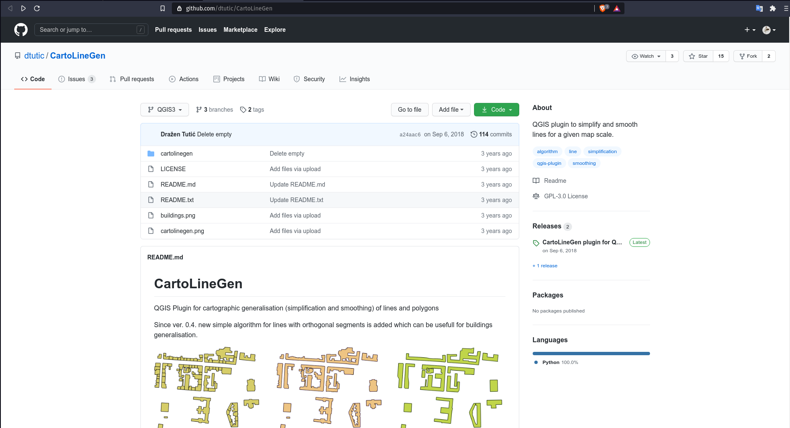

الصفحة الرئيسية للبرنامج المساعد المحدد - Figure 10.6.a  

بيانات وصفية مفصلة على الصفحة الرئيسية للبرنامج المساعد- Figure 10.6.b

هناك جانب آخر مهم للغاية يجب تسليط الضوء عليه فيما يتعلق بتوثيق البرنامج المساعد وهو إشارة الويب لمتتبع الأخطاء (bug tracker). نظام تعقب الأخطاء هو تطبيق برمجي يتتبع جميع مشكلات البرامج التي تم الإبلاغ عنها (ويعرف أيضًا باسم الأخطاء - bugs). في حالتنا، يتم دعم أداة تعقب الأخطاء من خلال مستودع الكود المخصص Github (انظر إلى figure 7).

Figure 10.10.7-  QGIS لبرنامج مساعد ما في Github نظام تتبع الأخطاء في 

تفصيل كيفية الإبلاغ عن مشكلة برمجية على Github يتجاوز نطاق هذه الوحدة، ولكن من المهم إبراز بعض الجوانب. أولاً، النظام الإيكولوجي مفتوح المصدر - سواء كان للجغرافيا المكانية أم لا - يعمل بشكل أفضل عندما تكون جميع الأطراف المعنية نشطة في جانبها، أي حيث يقوم المطورين بالبرمجة والمستخدمين بالإختبار والإبلاغ عن المشكلات التي تمت مواجهتها. إذا أجرى المرء بحثًا سريعًا على متتبعات الأخطاء المختلفة لـ QGIS أو GRASS أو أي حل آخر مفتوح المصدر، فسوف يلاحظ نشاطًا كثيفاً. وهذا شيء جيد، فهو يظهر أن المجتمع حي، وأن التفاعل بين المطورين والمستخدمين يعمل بشكل طبيعي. ثانيًا، قبل فتح أي تقرير خطأ عبر العديد من القنوات المختلفة، تأكد من أنك قد بحثت جيدًا عبر الإنترنت عن حل لمشكلتك. وإلاَ، فإنَك تخاطر بالتعرض للازدراء لعدم قضاء الوقت المطلوب في أداء واجبك المنزلي.

<h4>
أسئلة الاختبار
</h4>

هل تحتاج إلى الاسم  الكامل للبرنامج المساعد من أجل العثور عليه في Plugin Manager؟
*   لا ، كلمة أساسية كافية.
*   نعم.

هل البرامج المساعدة الرسمية والتجريبية متوفرة في نفس المستودع؟
*   نعم، طالما تم تحديد الخيار "إظهار المكونات الإضافية التجريبية" في مدير البرنامج المساعد.
*   لا ، للتجربة هناك مستودعات أخرى.

قم بتسمية 2 أو 3 أجزاء من المعلومات يمكن للمستخدم العثور عليها في وثائق البرنامج المساعد:
*   العنوان والوصف، عدد التنزيلات، الصفحة الرئيسية، روابط مستودع الكود، اسم المطور، وصف موجز.

<h3>
المرحلة الثانية: بعض ملحقات QGIS الرائعة
</h3>

يمكن تصنيف البرامج المساعدة إلى فئات متعددة، اعتمادًا على ما يعتبره المرء ذا أهمية. في ما يلي، نحدد تصنيفين:

*   بحسب مستوى أو مرحلة التطور:
    *   رسمي - يعتبر البرنامج المساعد مستقرًا وموثّقًا بشكل جيد ويمكن استخدامه في الإنتاج
    *   تجريبي - البرنامج المساعد في مرحلة التطوير المبكرة، ويوصى به فقط لأغراض الاختبار
    *   مهمل - لم يعد يتم الاحتفاظ بالبرنامج المساعد، أي لن يتم تحديثه إلى الإصدارات الأحدث، وقد لا يرد المطور على الإبلاغ عن الأخطاء، تم استخدامه فقط في حالة عدم وجود طريقة أخرى لحل المشكلة المطروحة
*   حسب نوع الفئة:
    *   المتجه
    *   النقطية
    *   الويب 
    *   قاعدة البيانات
    *   رسم الخرائط

وتجدر الإشارة إلى أن بعض البرامج المساعدة الخارجية تعمل مثل الجسور التي تسمح بالوصول من خلال QGIS إلى قواعد البيانات الخارجية والسحابات والخدمات وفي هذه الحالة يمكن أن تكون هناك حاجة إلى عناصر إضافية - مثل حساب مدفوع للخدمة الخارجية أو السحابة أو مفتاح واجهة برمجة التطبيقات (API key). مثال لتوضيح ذلك هو البرنامج المساعد Planet Explorer من Planet Inc. (انظر figure 8).

Figure 10.10.8 - بكامل طاقته QGIS مثال على ملحق يتطلب اشتراكًا خارجيًا حتى يعمل في   

على الرغم من عدم ذكر ذلك في الوصف، فإن الانتقال إلى الصفحة الرئيسية للبرنامج المساعد يكشف عن متطلبات تشغيله: "اشتراك Planet أو نسخة تجريبية للوصول إلى صور Planet وتنزيلها. ليس لديك اشتراك؟ اتصل <a href="https://www.planet.com/contact/">بفريقنا</a> لمعرفة المزيد ".

في الصفحات التالية، سوف نحدد ونقدم أمثلة مختصرة لبعض البرامج المساعدة التي نعتبرها مفيدة. يرجى أن تضع في اعتبارك أن هذه قائمة مختصرة لعالم البرامج المساعدة الشامل، لذلك لا تتردد في استكشاف ما بعده.

<h4>
اكتشاف - Discovery 
</h4>

Figure 10.9.a - The Discovery plugin

Discovery هو ملحق مفيد للغاية يسمح لك بالبحث عن النص المخزن في سمات المتجهات الخاصة بك. يتصل الملحق إما بقاعدة بيانات PostgreSQL / PostGIS أو MS SQL Server أو ملف geopackage ويبحث عن نص في الأعمدة المشار إليها. يسمح بالإكمال التلقائي كما أنه يدعم "الدعم المرن القائم على التعبير" للمقاييس.

لاختباره، سنستخدم ملف geopackage أعدته مؤسسة تبادل البيانات الإنسانية والمتاح <a href="https://data.humdata.org/dataset/hotosm_phl_north_populated_places">للتحميل</a>. إنه ملف متجه يحتوي على الأماكن المأهولة بالسكان من الفلبين، جنبًا إلى جنب مع الأسماء وعدد الأشخاص. تم تنزيل البيانات الأولية من OpenStreetMap.

بعد استخدام Plugin Manager، لتثبيت Discovery، يجب أن يكون هناك شريط أدوات جديد مرئيًا على QGIS الخاص بك. لنقم بإعداد المعايير: نوع مصدر البيانات: Geopackage، الاسم: الفلبين (Philippines)، اختر الملف وفقًا لذلك وستكون الطبقة أماكن مأهولة (Populated Places)، عمود البحث: الاسم (name). سنطلب أيضًا معلومات إضافية ليتم عرضها في شريط البحث: is_in والسكان (population). في حالتنا، إذا كان هناك المزيد من القرى التي تحمل نفس الاسم ولكن في مقاطعات مختلفة، فسنكون قادرين على التفريق بينها. يجب أن يبدو إعداد الاكتشاف كما في Figure 10.9.b.

Figure 10.9.b- Discovery  تعيين معايير البرنامج المساعد 

انقر فوق "موافق" ودعنا نبحث عن "San Roque" في شريط البحث (انظر Figure 10.9.c).

 استخدام "Discovery " للبحث السريع في سمات طبقات المتجه - Figure 10.9.c 

في مثالنا، يمكننا أن نرى أن هناك العديد من الأماكن المأهولة في سان روكي بالفلبين، عند اختيار إدخال واحد من هذه القائمة سيقوم QGIS بتكبيره (انظر إلى Figure 10.9.d).

التركيز و تسليط الضوء على الشكل الهندسي للعنصر الذي تم تحديده في شريط البحث - Figure 10.9.d

يوفر الملحق إمكانية العثور على المتجهات عن طريق البحث عن النص المقترن بفلاتر متنوعة، مثل المربع المحيط أو استعلامات SQL المتنوعة.

للحصول على وصف تفصيلي لقدرات البرنامج المساعد، بالإضافة إلى برنامج تعليمي أكثر شمولاً، تحقق من <a href="https://www.lutraconsulting.co.uk/projects/discovery/">صفحة الويب</a> الخاصة بالبرنامج المساعد Discovery.

<h4>
مقسم المضلع - <strong>Polygon Divider</strong>
</h4>

ملحق مقسم المضلع - Figure 10.10.a 

Polygon Divider هو ملحق QGIS آخر مفيد يساعد المستخدم في تقسيمه إلى عدد من المضلعات "المربعة" ذات الحجم المحدد وطبقة متجه من نوع المضلع.

يمكن أن تكون هذه الأداة مفيدة للعديد من التطبيقات مثل تقسيم الأراضي، وأخذ العينات البيئية، وما إلى ذلك.

دعونا نستخدم هذه الأداة في مجموعة بيانات مقاطعة بامبانجا في الفلبين ونرى النتائج التي نحصل عليها.

باستخدام Plugin Manager ، قم بتثبيت Polygon Divider. بعد الانتهاء، سيظهر رسم تخطيطي جديد على شريط أدوات QGIS وستفتح نافذة جديدة (انظر إلى Figure 10.10.b).

Figure 10.10.b -Polygon Divider نافذة البرنامج المساعد 

اختر طبقة مضلع مقاطعة Pampanga كطبقة إدخال، واحفظ ملف الإخراج كـ Pampanga_polygonDivider، اختر 1000000 (بمعنى أن جميع الأقسام ستحتوي على حوالي 100 هكتار)، اختر "من اليسار إلى اليمين" كتوجه القَطِع tolerance = 1. يجب أن تبدو النتيجة كما في Figure 10. 10.c.

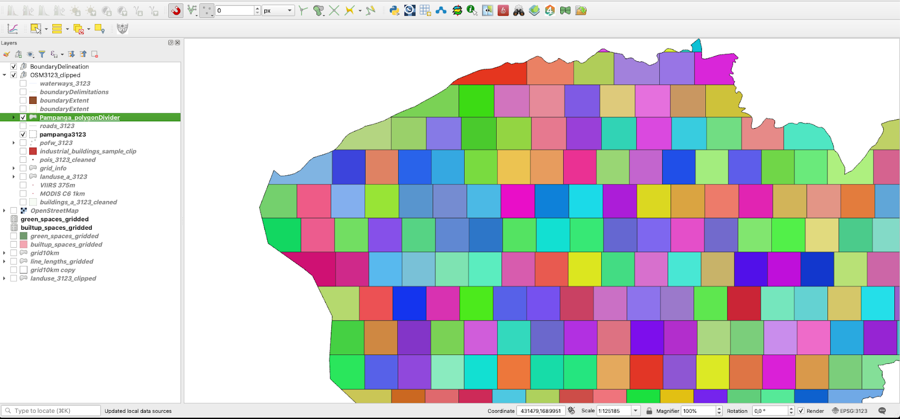

نتيجة تشغيل الملحق Polygon Divider على طبقة متجه مقاطعة بامبانجا  - Figure 10.10.c

للحصول على وصف تفصيلي لقدرات الملحق، بالإضافة إلى برنامج تعليمي أكثر شمولاً، تحقق من <a href="https://github.com/jonnyhuck/RFCL-PolygonDivider">صفحة ويب</a> Polygon Divider.

<h4>
تحميل الكل - Load Them All 
</h4>

Figure 10.11.a -  Load Them All البرنامج المساعد 

يعد هذا ملحقاً مفيدًا عندما يكون لديك طبقات متعددة (متجهات ونقطية) تحتاج إلى تحميلها في QGIS. يسمح لك البرنامج المساعد بتحميل الكل تلقائيًا، مرة واحدة، ولكن الميزة الكبيرة هي أنه يوفر لك العديد من المرشحات، مثل الأبجدية الرقمية (بالاسم)، والبيانات المعدلة، والمربع المحيط (الإحداثيات المدرجة يدويًا) ، ونوع الهندسة و اخرين.

لاختباره، سنقوم بتحميل الملفات من <a href="https://drive.google.com/file/d/1jBDxvNHForY5dQ6EOO6m0HXDTwEC791T/view?usp=sharing">هنا</a> (مثال على مقاطعة بامبانجا، يمكنك تجربته على ملفات مصر من الوحدة 8 بنفسك). بالنسبة للمتجه، سنختار ملفات الأشكال التي تمت معالجتها قبل التاريخ المحدد، وبالنسبة إلى البيانات النقطية، سنختار مرشحًا أبجديًا رقميًا - يجب أن يبدأ اسم البيانات النقطية المحملة بـ LandCover ( انظر إلى figure 11.b).

إعداد معايير البرنامج المساعد Load them All (المتجهات والنقطية) -Figure 10.11.b

تمثل المعايير المحددة أعلاه مثالًا يعتمد على البنية المتاحة. يمكنك تغييره كما تراه مناسبًا بناءً على ملفاتك الموجودة على جهاز الكمبيوتر الخاص بك.

لاحظ أنه بعد الانتهاء يتم عرض نتائج تشغيل البرنامج المساعد Load them All بالمعايير المذكورة أعلاه في figure 11.c (المتجهات) و figure 11.d (النقطية).

Figure 10.11c - Load them All plugin تحميل متجهات متعددة باستخدام

Figure 10.11.d - ”Load them All” تحميل العديد من البيانات النقطية باستخدام البرنامج المساعد      

للحصول على وصف تفصيلي لقدرات البرنامج المساعد، بالإضافة إلى برنامج تعليمي أكثر شمولاً ، تحقق من <a href="https://github.com/gacarrillor/loadthemall">صفحة ويب</a> "تحميل الكل".

<h4>
التتبع النقطي - <strong>Raster tracer</strong>
</h4>

Figure 10.12.a -  Raster tracer البرنامج المساعد

يمكن أن يكون Raster Tracer ملحقاً مفيدًا للغاية عندما يقوم أحدهم مرة واحدة بالرقمنة عبر خريطة، بمعنى آخر لاستخراج البيانات في شكل متجهات. يتم إجراء هذا النشاط عادةً على الخرائط الطبوغرافية القديمة الممسوحة ضوئيًا والتي نريد استخراج معلومات متنوعة منها لتخزينها ومعالجتها وتصورها في نظام معلوماتي. وخير مثال على ذلك هو الرقمنة التي تم إجراؤها على الخرائط الطبوغرافية لاستخراج الخطوط الكنتورية لبناء نموذج ثلاثي الأبعاد للتضاريس في نظام المعلومات الجغرافية.

على الرغم من ظهور نماذج التضاريس الرقمية التي تم الحصول عليها من صور الأقمار الصناعية اليوم، قد لا تكون هذه مشكلة بعد الآن، إلا أن الرقمنة لا تزال مستخدمة على نطاق واسع. الاستخدام الأبرز هو استخراج المعلومات من الخرائط القديمة. تقدم لنا الخرائط التاريخية نافذة على الماضي، قبل أن يكون لدينا أقمار صناعية لمراقبة غاباتنا وتغيرات الغطاء الأرضي. نظرًا لأن وثائق رسم الخرائط كانت في الأصل على الورق، حتى تتمكن من استخدام المعلومات مع التكنولوجيا الحديثة، يجب على المرء رقمنتها.

باستخدام Plugins Manager، ابحث ثم ثبّت Raster Tracer. يضيف هذا الملحق إلى QGIS قدرة شبه تلقائية لتتبع الميزات الخطية لخريطة البيانات النقطية الأساسية، من خلال النقر على نقاط انعطافها على الخريطة النقطية. بمجرد التثبيت، يجب أن يظهر رسم تخطيطي جديد في شريط الأدوات الخاص بك.

من أجل استخدامها، نحتاج إلى طبقتين على الأقل - واحدة هي الطبقة النقطية والأخرى هي طبقة المتجه التي ستلتقط البيانات. لقد حددنا لمقاطعة بامبانجا خريطة طبوغرافية، 1: 50k على الموقع الرسمي للهيئة الوطنية لمعلومات الخرائط والموارد. لسوء الحظ، على الرغم من أنها وفرت الوصول إلى الخريطة، إلا أنها لم يتم تحديد موقعها الجغرافي. لأغراض التوضيح، سنستمر دون تصحيح هذه المشكلة، ومع ذلك  يرجى الإنتباه! قبل رقمنة المتجهات من خريطة نقطية، من الضروري أن يتم تحديد الموقع الجغرافي بشكل صحيح وإلاّ فإن العمل - الذي يستغرق وقتًا طويلاً - سيكون عديم الفائدة.

ومع ذلك، قم بإحضار الخريطة الطبوغرافية لمدينة Layer -> Add layer -> Add raster layer) Angeles).

بعد ذلك، سننشئ طبقة متجهية متعددة السلاسل حيث سيتم تخزين جميع الكائنات الخطية التي نستخرجها من الخريطة الطبوغرافية (Layer -> Create Layer -> New GeoPackage layer). قم بإنشاء متجه متعدد الخطوط واحفظه تحت الاسم tracer_lines. اختر إسقاط EPSG: 3123 - الإسقاط الرسمي للمنطقة. ابدأ وضع التحرير عليه (Right click - Toggle editing).

انقر فوق الرسم التخطيطي لـ RasterTracer وقم بإعداد المعايير، كما في Figure 10.12.b. اختر لون خطوط الكنتور باستخدام منتقي الألوان الذي سيتم فتحه عند النقر فوق خيار تتبع اللون.

Figure 10.12.b -  RasterTracer إعداد معايير

الآن، كل ما تبقى هو البدء في الرقمنة. بعد أن أصبح المتجه النقطي الخاص بك قابل للتحرير و البرنامج المساعد تم تنشيطه مرة أخرى عليه، انقر فوق نقاط انعطاف خط الكنتور الذي سنستخرجه (انظر Figure 10.12.c).

النقرعلى نقاط الانعطاف لرسم الخط باستخدام Figure 10.12.c - RasterTracer 

يعرض Figure 10.12.d النتيجة.

Figure 10.12.d - خط مرسوم شبه آلي باتباع اللون المحدد

<h4>
Active Fire - الحرائق النشطة
</h4>

Figure 10.13.a -  Active Fire البرنامج المساعد 

ومع ذلك، فإن الملحقات ليست مصممة فقط للعمل مع البيانات التي لديك، ولكنها مصممة أيضًا لجلب مجموعات بيانات QGIS التي تنتجها مؤسسات أو وكالات أو منظمات أخرى أو أي شخص يشاركها من خلال خدمات معيارية لرسم خرائط الويب.

أحد الأمثلة الجيدة هو البرنامج المساعد Active Fire. وقد تم تطوير هذا الملحق للسماح لمستخدمي QGIS بسرعة وبشكل حدسي ودون أي جهد لعرض الحرائق في آخر 24 ساعة في أي منطقة ذات اهتمام. يتم إنتاج منتجات مكافحة الحرائق بواسطة وكالة ناسا وإتاحتها مجانًا لأي شخص. تأتي البيانات الأولية من قمرين صناعيين: مقياس طيف التصوير المتوسط ​​الدقة (<a href="https://modis.gsfc.nasa.gov/">MODIS</a>) (<a href="https://earthdata.nasa.gov/earth-observation-data/near-real-time/firms/c6-mcd14dl">MCD14DL</a>) ومجموعة مقياس الإشعاع المرئي للتصوير بالأشعة تحت الحمراء (<a href="https://www.jpss.noaa.gov/viirs.html">VIIRS</a>) 375 مترًا (<a href="https://earthdata.nasa.gov/earth-observation-data/near-real-time/firms/v1-vnp14imgt">VNP14IMGTDL_NRT</a> و <a href="https://earthdata.nasa.gov/earth-observation-data/near-real-time/firms/vj114imgtdl-nrt">VJ114IMGTDL_NRT</a>) لآخر 24.

للعثور عليه، افتح Plugin Manager واكتب fire. بعد التثبيت سيظهر رسم تخطيطي أحمر جديد في شريط أدوات QGIS الخاص بك. عند النقر فوقه، تظهر نافذة جديدة حيث تتيح لك تحديد المستشعر الذي تريد تحديد بكسلات النار منه في آخر 24 ساعة (انظر إلى Figure 10.13.b).

Figure 10.13.b -  Active Fire باستخدام البرنامج المساعد QGIS في NASA تحميل منتجات حرائق

يحسب الملحق أيضًا عدد وحدات بكسل الحرائق المسجلة.

Figure 10.14.a - Active Fire البرنامج المساعد   

هذا ملحق يسمح للمستخدم بتصدير مشروع QGIS الخاص به بسرعة إلى ** خريطة الويب **.

خريطة الويب هي عرض تفاعلي للمعلومات الجغرافية التي يمكن فتحها في المستعرضات أو الأجهزة أو في عارضات خرائط سطح المكتب. نتفاعل يوميًا مع مثل هذه التمثيلات، فقط فكر في OpenStreetMap و Google Maps و Waze و Pokemon Go.

يمنح هذا الملحق إمكانية إعداد وتصدير خريطة بشكل سريع جدًا يمكن أن ينتهي بها الأمر على الإنترنت، عبر تقنيات الويب الخاصة بـ <a href="https://openlayers.org/">OpenLayer3</a> أو <a href="https://leafletjs.com/">Leaflet</a>. يبذل Qgis2web قصارى جهده لتفسير مشروع QGIS ولتصدير HTML و Javascript و CSS لإنشاء خريطة ويب أقرب ما يمكن إلى مشروع QGIS.

بعد تثبيت الملحق qgis2web، يظهر رمز جديد لشريط أدوات QGIS، كما هو موضح في Plugin Manager. سيؤدي النقر فوقه إلى فتح نافذة، مثل تلك الموجودة في Figure 10.14.b.

Figure 10.14.b - اختيار ما ستظهر خريطتك في المتصفح

الواجهة سهلة الاستخدام، ولكن انتبه لأنه كلما كانت مجموعات البيانات أثقل، ستستغرق وقتًا أطول للتحضير والتصدير. بعد اختيار مكان التصدير، انقر فوق زر التصدير للانتهاء ( figure 14.c).

يقوم QGIS2web بإعداد الملفات والمجلدات الضرورية لتقنية الويب Figure 10.14.c - OpenLayer 3

يحتوي المجلد الذي تم تصديره على عدة ملفات، اعتمادًا على تقنية تعيين الويب التي تم تحديدها - Leaflet أو Openlayers3. في حالة OpenLayer3، يحتوي المجلد المختار للتصدير على الملفات والمجلدات التالية: <code>images, index.html layers, resources, styles, webfonts</code>. انقر نقرًا مزدوجًا على ملف index.html وستفتح خريطتك المصدرة في متصفحك، حيث يمكنك تبديل الطبقات التي تريد رؤيتها ( Figure 10.14.d).

Figure 10.14.d -  في متصفحك index.html فتح ملف    

كما لاحظت، يفتح المتصفح هذه الخريطة من مجلدك المحلي (حيث طلبت من qgis2web التصدير).

يعد هذا الملحق QGIS أداة رائعة لمساعدتك في إعداد خرائطك للويب.

للحصول على وصف تفصيلي لقدرات البرنامج المساعد، بالإضافة إلى برنامج تعليمي أكثر شمولاً، تحقق من <a href="https://github.com/tomchadwin/qgis2web">صفحة الويب</a> qgis2web.

<h4>
DataPlotly
</h4>

Figure 10.14.a - DataPlotly ملحق

تم تطوير ملحق DataPlotly خصيصًا لدعم تصورات نوع الرسم التفاعلي لبيانات المتجه المحملة في QGIS. يعتمد هذا البرنامج المساعد على مكتبة Python المسماة Plotly، وهي قوية جدًا مما يوفر إمكانية إنشاء العديد من الرسوم البيانية التفاعلية وجودة النشر: المخططات الخطية، والمخططات المبعثرة، والمخططات المساحية، والمخططات الشريطية، وأشرطة الخطأ، ومخططات الصندوق، والرسوم البيانية، وخرائط الحرارة و الحبكات الفرعية والمحاور المتعددة والمخططات القطبية والمخططات الفقاعية. يتوفر مزيد من المعلومات حول مكتبة py المحددة على <a href="https://plotly.com/python/">الموقع الرسمي</a>.

قم بتثبيت البرنامج المساعد باستخدام Plugin Manager وتحميل بعض طبقات المتجهات ليتم عرضها:

*   Waterways_3123 : line type;
*   Populated places : point type;

دعنا نعدّ مخططًا تفاعليًا يوضح عدد الأنهار مقابل القنوات مقابل مقاطع المجاري المائية الموجودة في مجموعة البيانات الخاصة بنا.

من خلال النقر على الرسم التخطيطي المحدد، ستفتح نافذة جديدة، انظر الى  Figure 10.15.b.

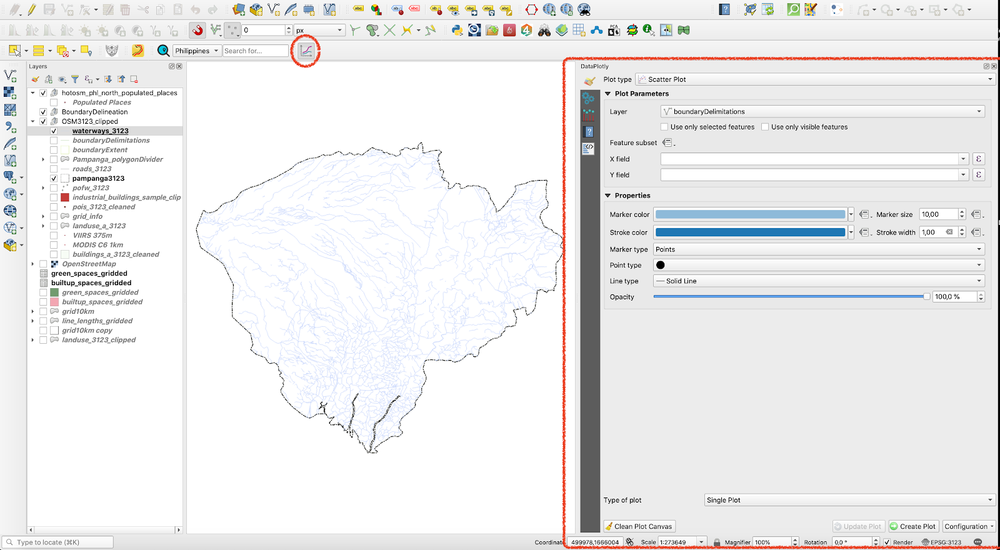

Figure 10.15.b - DataPlotly نافذة / لوحة

بعد ذلك، قم بإعداد المعايير، كما في Figure 10.15.c.

Figure 10.15.c - إعداد معايير الرسم البياني الدائري الذي يمثل أنواع خطوط المياه

اختر waterways_3123 كطبقة متجه لاستخراج البيانات المرسومة، وحقل التجميع - fclass ، Y - length. إذا كان الطول بحاجة إلى أن يتم حسابه، فانتقل إلى جدول البيانات لطبقة المتجه واكتب <code>(<strong>round</strong>(<strong>$length</strong>)</code> فى field calculator . لمزيد من التفاصيل، راجع الوحدة رقم 8. بعد ذلك، حدد "single plot" من نوع الرسم البياني وانقر على Create plot button، في الجانب الأيمن السفلي. يجب أن تبدو النتيجة كما في Figure 10.15.d.

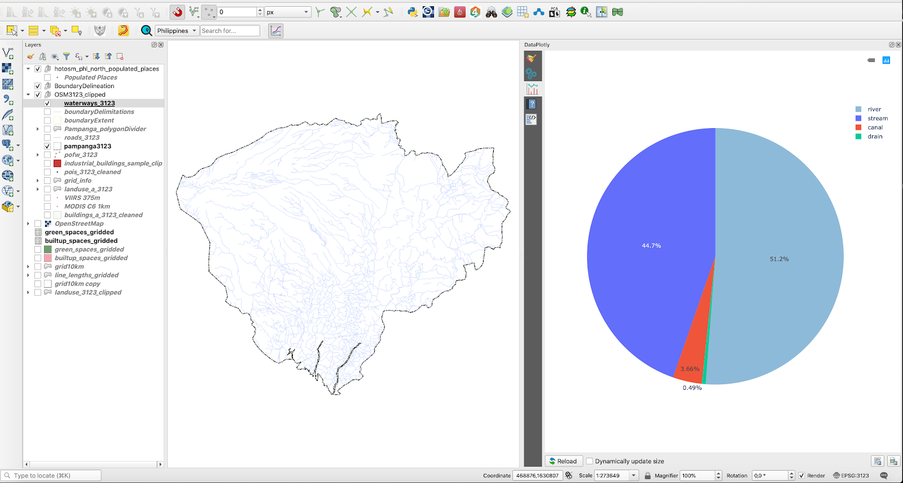

Figure 10.15.d - المخطط الدائري لأنواع الممرات المائية حسب الطول 

عند التمرير بالماوس فوق كل مقطع في المخطط الدائري، تظهر نافذة منبثقة تعرض الاسم (مأخوذ من عمود fclass) ومجموع الأطوال والنسبة المئوية من الإجمالي.

إحدى الوظائف المهمة لـ DataPlotly هي الاتصال بخريطة خريطة QGIS. لفهم ذلك، انقر فوق أحد أقسام المخطط الدائري. يجب أن ترى أنه يتم تحديد بعض الميزات تلقائيًا في لوحة الخريطة الخاصة بك ( Figure 10.15.e).

Figure 10.15.e -  DataPlotly و QGIS اختبار الاتصال التفاعلي بيت لوحة خريطة 

هذا يعني أيضًا أنه يمكنك تحديث الرسم بشكل تفاعلي، على سبيل المثال، إظهار الميزات المحددة فقط. للاختبار، حدد جزءًا فقط من الممرات المائية في لوحة الخريطة الخاصة بك، ثم انتقل إلى DataPlotly، اذهب إلى علامة التبويب الأولى وفي معايير الرسم، حدد خيار "الميزات المحددة فقط" (Figure 10.15.f).

Figure 10.15.f - قم بتحديث الرسم البياني بشكل تفاعلي لإظهار الميزات المحددة فقط

بعد ذلك، انقر فوق الزر Update plot في أسفل الجانب الأيمن من نافذة DataPlotly. يجب أن تبدو النتائج تقريبًا كما في Figure 10.15.g (تقريبًا فقط، لأن اختيارك غالبًا ربما يختلف عن ذلك الموضح في Figure 10.15.g).

Figure 10.15.g - تحديث الرسم البياني لإظهار الميزات المحددة فقط على لوحة الخريطة

علاوة على ذلك، يوفر DataPlotly للمستخدم وظيفة تصدير - إما في ملف .pdf أو ملف .html. الأزرار المقابلة موجودة في الجانب الأيمن المنخفض جدًا من نافذة DataPlotly، انظر إلى Figure 10.15.h.

Figure 10.15.h -  Data Ploty قدرات التصدير في 

يسمح التصدير كملف HTML للمستخدم بإعداد مجموعة متنوعة من مخططات البيانات الجاهزة للنشر على الويب (Figure 10.15.i).

Figure 10.15. i - DataPlotly الذي تم تصديره بواسطة HTML استخدام متصفح لفتح ملف

البرنامج المساعد موثق جيدًا أيضًا، حيث يقدمون للمستخدمين "قائمة مساعدة" لكل نوع من أنواع الرسوم البيانية. يمكنك الوصول إليه بالنقر فوق علامة التبويب الرابعة في DataPlotly (انظر إلى Figure 10.15.j).

 قائمة المساعدة لكل نوع رسم بياني، يمكن الوصول إليها من خلال نافذة البرنامج المساعد - Figure 10.15.j 

نظرًا للارتباط التفاعلي المباشر مع مجموعات البيانات المحملة بواسطة QGIS، يمكن أيضًا استخدام التعبيرات عند تحضير رسم بياني ما. لاختبار هذه الإمكانية، سننشئ قاعدة رسم بياني (plot base) على طبقة متجه الأماكن المأهولة (Populated places). قم بتعيين المعايير التالية: النوع: مخطط الشريط - bar plot، الطبقة: الأماكن المأهولة - populated places، الحقل X: is_in ، Y_field - افتح حاسبة الحقل وأدخل <code>"population" <strong>is</strong> <strong>not</strong> null"</code> (انظر إلى Figure 10.15.k  و Figure 10.15.l).

Figure 10.15.k - المحددة من أجل تطبيق تعبير لتصفية ما سيعرضه المخطط QGIS استنادًا إلى سمات طبقة DataPlotly فتح محرر المجال في

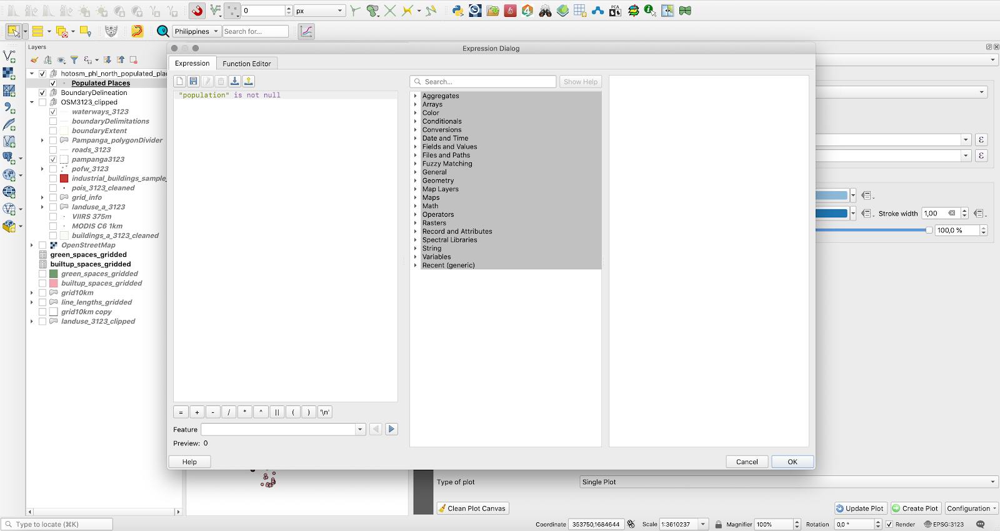

Figure 10.15.l - إدراج تعبير في حاسبة الحقل

يجب أن تبدو النتيجة في Figure 10.15.m.

Figure 10.15.m - للتصفية حسب التعبير DataPlotly نتيجة   

إذا أردنا تفسير هذا الرسم البياني أو المخطط، فهذا يوضح لنا أنه من بين جميع المقاطعات التي تم فيها تسجيل الأماكن المأهولة بالسكان، تختلف خاصية السكان عن 0 في 4 مناطق فقط، ألامينوس ، سوال ، بانجاسيان وباجاك. يمكن للمرء بسهولة اختبار هذا الاستنتاج من خلال النظر في جدول السمات.

يوفر DataPlotly أيضًا للمستخدم إمكانية إنشاء مخططات فرعية، مما يعني أنه يمكن عرض العديد من الرسومات البيانية في لوحة عرض واحدة.

لاختبار هذه الوظيفة، سوف نستخدم طبقة متجه Populated places. لدينا السمات التالية ذات الأهمية: <strong><code>place </code></strong>= نوع المكان (المدينة ، البلدة ، القرية ، إلخ. ، <strong><code>is_in</code></strong> = اسم المقاطعة التي تنتمي إليها (إذا كانت معروفة) ، <strong><code>population </code></strong>= (عدد السكان) و <code>name </code> = اسم مكان (إذا كان معروفًا). سندمج في نفس لوحة عرض، مخططتي بيانات: أحدهما يوضح لنا عدد الأماكن المأهولة التي تقع في كل فئة من فئات <strong><code>place</code></strong>، والثاني، كيف يتم تقسيم السكان على أنواع الأماكن الأربعة.

Figure 10.15.n - إعداد المعاييرللمخطط الأول - أنواع المستوطنات بأرقامها

Figure 10.15.o - إعداد معايير المخطط الثاني - أنواع المستوطنات حسب أعداد السكان

Figure 10.15.p - المخططات الفرعية على التوالي

للحصول على وصف تفصيلي لقدرات البرنامج المساعد، جنبًا إلى جنب مع برنامج تعليمي أكثر شمولاً، تحقق من <a href="https://github.com/ghtmtt/DataPlotly">صفحة الويب</a> DataPlotly.

<h4>
QuickMapServices / OpenLayers plugin
</h4>

Figure 10.16.a - QuickMapServices plugin;

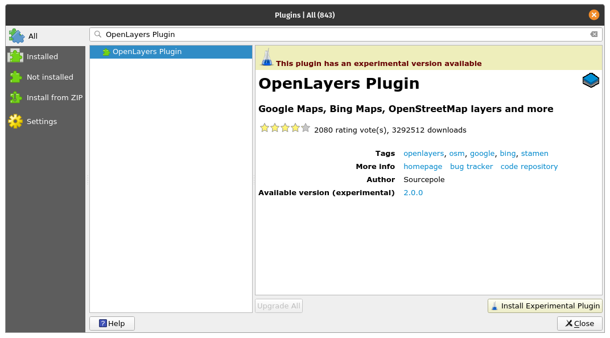

Figure 10.16.b  - OpenLayers plugin

هذان الملحقان مفيدان بشكل استثنائي عندما يحتاج المستخدم إلى إضافة خرائط الأساس (basemaps) إلى مشروع QGIS الخاص به. على سبيل المثال، يريد المرء أن يرى في السياق موضع طبقة متجه جديدة تم تلقيها، أو ربما فقط لإعداد تمثيل خرائطي أكثر جاذبية لتقريرٍ ما. تسمح QuickMapServices للمستخدم بتحميل طبقات خريطة الأساس من مصادر مختلفة مثل OpenStreetMap أو NASA أو Bing أو خرائط Google إلى سطح المكتب الخاص به بنقرتين فقط.

قم بتثبيت كلا الملحقين باستخدام Plugin Manager. في هذه الحالة، ستلاحظ أنهما سيظهران تحت علامة تبويب الويب (انظر إلى figure 16.b).

Figure 10.16.b - QuickMapServices و OpenLayers موقع الملحقات

للإستفادة من هذين الملحقين ما عليك سوى النقر فوق الطبقة التي تريد إحضارها في لوحة الخريطة الخاصة بك وسيقوم الملحق بكل العمل. إنّ استخدام هذا البرنامج المساعد يتطلب اتصالاً جيدًا بالإنترنت، لأنه يستخدم البيانات التي يقدمها مقدّموه من خلال خدمات خرائط الويب الموحدة.

يعرض Figure 10.16.c نموذج بيانات OSM الإنسانية الذي تم إحضاره كخريطة أساس لمقاطعة بامبانجا في الفلبين.

Figure 10.16.c -OpenLayers استخدام البرنامج المساعد 

يوضح Figure 10.16.d المحاذاة المثالية لخريطة الأساس التي تم تحميلها في لوحة خريطة QGIS باستخدام البرنامج المساعد OpenLayers. على الرغم من أن الطبقتين ليستا في نفس الإسقاط، فإن QGIS يسمح بالإسقاط أثناء العمل، لذلك يكون التراكب ممكنًا.

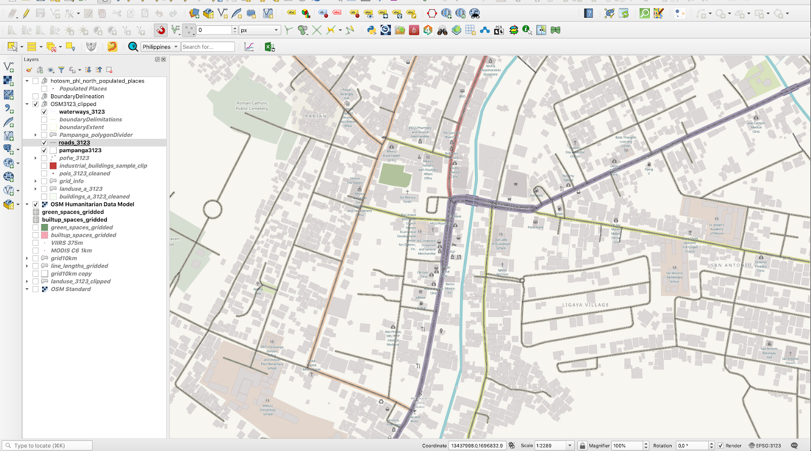

Figure 10.16.d - الإنسانية OSM بيانات المتجه المحملة (الطرق) متراكبة على نموذج بيانات 

للحصول على وصف مفصل لقدرات الملحقين المذكورين أعلاه، جنبًا إلى جنب مع برنامج تعليمي أكثر شمولاً، تحقق من صفحة الويب الخاصة بكل منهما: <a href="https://nextgis.com/blog/quickmapservices/">QuickMapServices </a>و <a href="https://github.com/sourcepole/qgis-openlayers-plugin">OpenLayer Plugin</a>.

<h4>
Table2Style
</h4>

Figure 10.17.a -Table2 Style  البرنامج المساعد 

يعد هذا البرنامج المساعد مفيدًا في المواقف التي توجد فيها قيم محددة للبكسل داخل طبقة نقطية تتوافق تمامًا مع لون معين. في هذا المنهج، واجهنا مثل هذا المثال، عند العمل مع بيانات الغطاء الأرضي (انظر إلى Figure 10.17.b).

Figure 10.17.b - تمثيل المواقف التي تتوافق فيها قيم البكسل مع لون دقيق و محدد

يقدم موفّرهذا المنتج أيضًا قيم البكسل والألوان المرتبطة استنادًا إلى صور القمر الصناعي:

<table>
  <tr>
   <td>
<strong>القيمة</strong>

   </td>
   <td>
<strong>لون </strong>

   </td>
   <td>
<strong>وصف</strong>

   </td>
  </tr>
  <tr>
   <td>
0

   </td>
   <td>
#282828	

   </td>
   <td>
مجهول. ليس هناك بيانات كافية من الأقمار الصناعية.

   </td>
  </tr>
  <tr>
   <td>
20

   </td>
   <td>#FFBB22
   </td>
   <td>
الشجيرات. نباتات خشبية معمرة ذات سيقان ثابتة وخشبية وبدون ساق رئيسي محدد يقل ارتفاعها عن 5 أمتار. يمكن أن تكون أوراق الشجيرة إما دائمة الخضرة أو نفضية.

   </td>
  </tr>
  <tr>
   <td>
30

   </td>
   <td>#FFFF4C
   </td>
   <td>
نباتات عشبية. نباتات بدون ساق أو براعم ثابتة فوق الأرض وتفتقر إلى بنية ثابتة محددة. غطاء الأشجار والشجيرات أقل من 10٪.

   </td>
  </tr>
  <tr>
   <td>
40

   </td>
   <td>#F096FF
   </td>
   <td>
النباتات / الزراعة المدارة. الأراضي المغطاة بالمحاصيل المؤقتة تليها فترة الحصاد وفترة التربة الجرداء (على سبيل المثال، أنظمة المحاصيل الفردية والمتعددة). لاحظ أنه سيتم تصنيف المحاصيل الخشبية المعمرة على أنها نوع الغطاء الأرضي المناسب للغابات أو الشجيرة.

   </td>
  </tr>
  <tr>
   <td>
50

   </td>
   <td>#FA0000
   </td>
   <td>
حضري / مبني. الأرض مغطاة بالمباني والمنشآت الأخرى من صنع الإنسان.

   </td>
  </tr>
  <tr>
   <td>
60

   </td>
   <td>#B4B4B4
   </td>
   <td>
الغطاء النباتي العاري / المتناثر. الأراضي ذات التربة المكشوفة أو الرمل أو الصخور ولا تحتوي على أكثر من 10٪ غطاء نباتي خلال أي وقت من السنة.

   </td>
  </tr>
  <tr>
   <td>
70

   </td>
   <td>#F0F0F0
   </td>
   <td>
الثلج والجليد. الأراضي تحت الجليد أو الغطاء الجليدي على مدار العام.

   </td>
  </tr>
  <tr>
   <td>
80

   </td>
   <td>#0032C8
   </td>
   <td>
المسطحات المائية الدائمة. البحيرات والخزانات والأنهار. يمكن أن تكون إما مسطحات مائية عذبة أو مالحة.

   </td>
  </tr>
  <tr>
   <td>
90

   </td>
   <td>#0096A0
   </td>
   <td>
الأراضي الرطبة العشبية. الأراضي التي تحتوي على خليط دائم من الماء والنباتات العشبية أو الخشبية. يمكن أن يتواجد الغطاء النباتي إما في المياه المالحة أو قليلة الملوحة أو العذبة.

   </td>
  </tr>
  <tr>
   <td>
100

   </td>
   <td>#FAE6A0
   </td>
   <td>
الطحلب والحزاز.

   </td>
  </tr>
  <tr>
   <td>
111

   </td>
   <td>#58481F
   </td>
   <td>
غابة مغلقة، أوراق إبرة دائمة الخضرة. مظلة الشجرة> 70٪ ، تظل جميع أشجار أوراق الإبر تقريبًا خضراء طوال العام. المظلة لا تخلو أبدًا من أوراق الشجر الخضراء.

   </td>
  </tr>
  <tr>
   <td>
112

   </td>
   <td>#009900
   </td>
   <td>
غابة مغلقة، دائمة الخضرة عريضة الأوراق. مظلة الشجرة> 70٪ ، وتبقى جميع الأشجار عريضة الأوراق تقريبًا خضراء على مدار السنة. المظلة لا تخلو أبدًا من أوراق الشجر الخضراء.

   </td>
  </tr>
  <tr>
   <td>
113

   </td>
   <td>#70663E
   </td>
   <td>
غابة مغلقة، ورقة إبرة نفضية. مظلة الشجرة> 70٪ ، تتكون من مجتمعات موسمية لأوراق الشجر مع دورة سنوية من فترات وجود الأوراق وعدمها.

   </td>
  </tr>
  <tr>
   <td>
114

   </td>
   <td>#00CC00
   </td>
   <td>
غابة مغلقة ، أوراق عريضة نفضية. مظلة شجرة > 70٪ ، تتكون من مجتمعات موسمية من الأشجار عريضة الأوراق مع دورة سنوية من فترات وجود الأوراق وعدمها

   </td>
  </tr>
  <tr>
   <td>
115

   </td>
   <td>#4E751F
   </td>
   <td>
غابة مغلقة ، مختلطة.

   </td>
  </tr>
  <tr>
   <td>
116

   </td>
   <td>#007800
   </td>
   <td>
مجموعة مغلقة، لا تتطابق مع أي من التعريفات الأخرى.

   </td>
  </tr>
  <tr>
   <td>
121

   </td>
   <td>#666000
   </td>
   <td>
غابة مفتوحة، ورقة إبرة دائمة الخضرة. الطبقة العلوية - الأشجار 15-70٪ والطبقة الثانية - مختلطة من الشجيرات والأراضي العشبية، وتبقى جميع أشجار أوراق الإبر تقريبًا خضراء طوال العام. المظلة لا تخلو أبدًا من أوراق الشجر الخضراء.

   </td>
  </tr>
  <tr>
   <td>
122

   </td>
   <td>#8DB400
   </td>
   <td>
غابة مفتوحة، أوراق عريضة دائمة الخضرة. الطبقة العليا - الأشجار 15-70٪ والطبقة الثانية - مختلطة من الشجيرات والأراضي العشبية، وتبقى جميع الأشجار عريضة الأوراق تقريبًا خضراء على مدار السنة. المظلة لا تخلو أبدًا من أوراق الشجر الخضراء.

   </td>
  </tr>
  <tr>
   <td>
123

   </td>
   <td>#8D7400
   </td>
   <td>
غابة مفتوحة، ورقة إبرة نفضية. الطبقة العلوية - الأشجار 15-70٪ والطبقة الثانية - مختلطة من الشجيرات والأراضي العشبية، وتتكون من مجتمعات شجر الإبرة الموسمية مع دورة سنوية من أوراق الشجر وفترات الأوراق.

   </td>
  </tr>
  <tr>
   <td>
124

   </td>
   <td>#A0DC00
   </td>
   <td>
غابة مفتوحة ، عريضة الأوراق. الطبقة العلوية- الأشجار 15-70٪ والطبقة الثانية- مختلطة من الشجيرات والأراضي العشبية، وتتكون من مجتمعات موسمية من الأشجار عريضة الأوراق مع دورة سنوية من أوراق الشجر وفترات الأوراق.

   </td>
  </tr>
  <tr>
   <td>
125

   </td>
   <td>#929900
   </td>
   <td>
غابة مفتوحة ، مختلطة.

   </td>
  </tr>
  <tr>
   <td>
126

   </td>
   <td>#648C00
   </td>
   <td>
غابة مفتوحة، لا تتطابق مع أي من التعريفات الأخرى.

   </td>
  </tr>
  <tr>
   <td>
200

   </td>
   <td>#000080
   </td>
   <td>
المحيطات والبحار. يمكن أن تكون إما مسطحات مائية عذبة أو مالحة.

   </td>
  </tr>
</table>

عندما يتم تحميل مجموعة بيانات جديدة - نقطية أو متجهة - ، يقوم QGIS بتعيين تمثيل مرئي لها بشكل عشوائي. يجب على المستخدم تحديد الألوان والمخططات المناسبة للتمثيلات. لمزيد من المعلومات حول تصميم الطبقات، انتقل إلى الوحدة النمطية 4.

لاختبار البرنامج المساعد table2style، سنستخدم مجموعة البيانات النقطية LandCover2019. عن طريق تحميل البيانات النقطية في QGIS، يجب أن يكون لديك نتيجة مماثلة لتلك الموجودة في Figure 10.17.c.

Figure 10.17.c -بتعيين الألوان لقيم البكسل بشكل عشوائي QGIS يقوم  

وفقًا لمزوّد البيانات، نعلم أنه لكل قيمة بكسل لون مخصص بوضوح وفي مجال الغطاء الأرضي، تمثل هذه الألوان بالفعل اصطلاحات، تمامًا كما هو الحال في رسم الخرائط الكلاسيكي. يتم تمثيل الغابات بنوع معين من الأخضر، والمراعي بنوع آخر، ويتم تصوير المحيط بنوع مختلف من اللون الأزرق عن المياه السطحية الداخلية وما إلى ذلك. أسوأ الحالات هي تعيين كل هذه الألوان يدويًا لقيمها الخاصة. ومع ذلك، فإن المكون الإضافي table2style يحل هذه المشكلة تلقائيًا، في غضون ثوانٍ.

انتقل إلى مدير البرنامج المساعد وقم بتثبيت البرنامج المساعد table2style. سيظهر رمز جديد على شريط الأدوات الخاص بك. افتحه بالنقر المزدوج عليه. يجب أن تظهر نافذة إعداد، كما في Figure 10.17.d.

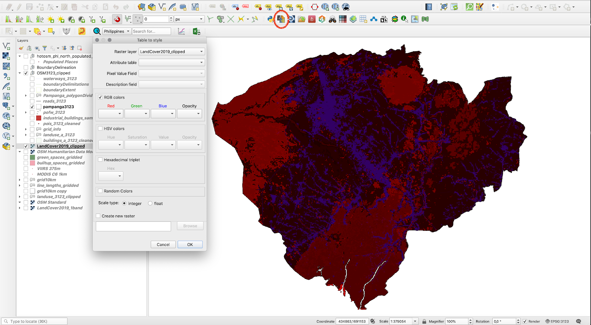

Figure 10.17.d - Table2style نافذة

يتطلب الملحق معيارين - طبقة نقطية وجدول بيانات بقيم البكسل وتسمية الوصف ورموز الألوان في أحد الأنظمة الثلاثة: RGB أو HSV أو Hex. وفقًا لجدولنا أعلاه، لدينا Hex codes للألوان المخصصة. وبالتالي، قم بتحميل الجدول في QGIS (<code>Layer -> Add layer -> Add delimited text layer</code>. بالطبع، ليس لها هندسة. يجب أن يبدو جدول قيم LandCover كما في Figure 10.17.e.

Figure 10.17.e - جدول السمات مع قيم البكسل وأكواد الألوان ووصف الغطاء الأرضي

الآن، دعونا نلقي نظرة على مجموعة البيانات النقطية. يعمل table2style فقط على خطوط نقطية ذات نطاق واحد، لأنه اتصال واحد إلى واحد: قيمة البكسل - رمز اللون. إذا توفر المزيد من النطاقات، بناءً على نافذة إعداد الملحق، فلن يعرف أي واحد يختار. ومع ذلك، عند التحقق من خصائص طبقة LandCover2019، نلاحظ وجود 3 نطاقات (Properties - Information - scroll down to Bands). نظرًا لأننا نحتاج فقط إلى النطاق 1 (التصنيف المنفصل - discrete classification)، سنستخدم الآلة الحاسبة النقطية لاستخراجه ((Raster -> Raster calculator) وإدراجه في حقل التعبير فقط "LandCover2019_1band@1" - احفظ النتيجة). لمزيد من التفاصيل حول كيفية العمل مع البيانات النقطية، راجع الوحدة 9.

الآن، لدينا كل ما نحتاجه لاختبار البرنامج المساعد. قم بإعداد المعايير كما في Figure 10.17.f.

Figure 10.17.f -لمجموعة بيانات الغطاء الأرضي table2 style  إعداد معايير البرنامج المساعد 

يجب أن تبدو النتيجة في Figure 10.17.g

Figure 10.17.g -  table2style مجموعة بيانات نقطية مصممة تلقائيًا باستخدام البرنامج المساعد 

للحصول على وصف تفصيلي لقدرات البرنامج المساعد، جنبًا إلى جنب مع برنامج تعليمي أكثر شمولاً، تحقق من <a href="https://github.com/ptarroso/table2style">صفحة ويب</a> البرنامج المساعد Table2Style.

<h4>
ORS Tools
</h4>

Figure 10.18.a - ORS Tools البرنامج المساعد

بالنسبة لآخر ملحق تم تقديمه، قمنا بإعداد واحد لنوضح لك القدرات المذهلة للعالم المترابط لبيانات وأدوات وخدمات نظم المعلومات الجغرافية. لقد رأينا سابقًا أن هناك برامج مساعدة يمكن أن تساعدنا في تحميل بيانات QGIS الخاصة بنا من مزودين آخرين دون أي متاعب تتعلق بتنزيلها وتخزينها ومعرفة كيفية فتحها (البرنامج المساعد OpenLayers & Active Fire). ومع ذلك، تم تصميم الملحق ORS Tools لتوفير الوصول إلى خدمة توجيه خارجية - openrouteservice.org، استنادًا إلى OpenStreetMap.

التوجيه (Routing) هو عملية تحديد مسار لحركة المرور في شبكة أو بين أو عبر نقاط محددة متعددة.

تشتمل مجموعة الأدوات على عمليات حسابية للتوجيه ومتساوي الزمان (Isochrones) وعمليات حسابية للمصفوفة، إما تفاعلية في لوحة الخريطة أو من ملفات نقطية داخل إطار عمل المعالجة.

باستخدام Plugin Manager، قم بتثبيت البرنامج المساعد ORS Tools. سيظهر رسم تخطيطي جديد على شريط الأدوات الخاص بك. انقر نقرًا مزدوجًا للفتح (انظر Figure 10.18.b).

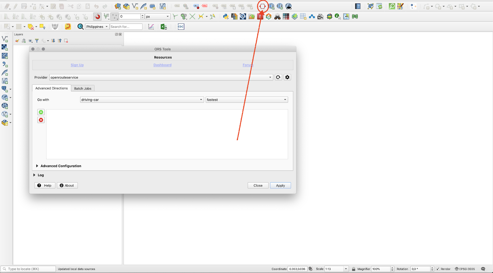

Figure 10.18.b - ORS Tools فتح نافذة

كما ذكرنا سابقاً، يستخدم هذا البرنامج المساعد قاعدة بيانات خارجية - OpenStreetMap - وخوارزميات خارجية يتم تجميعها في الخدمة - openrouteservice. لكي نتمكن من الاتصال بهذه الخدمة الخارجية، سنحتاج إلى إنشاء حساب على صفحة الويب الخاصة بهم ونطلب ** مفتاح API. **

مفتاح API هو معرف فريد يُستخدم لمصادقة مستخدم أو مطوّر أو برنامج استدعاء على واجهة برمجة تطبيقات محددة. واجهة برمجة التطبيقات (API) هي بمثابة بوابة إلى الأجزاء الداخلية من البرنامج ووصول برمجي إلى عملياته وخوارزمياته. وبالتالي، لاستخدام Openrouteservice من خلال QGIS، سنطلب مفتاحًا.

تابع الخطوات التالية:

1. انقر فوق الزر Sign Up في نافذة أدوات ORS كما في Figure 10.18.c.

Figure 10.18.c - Sign in زرّ

2. قم بإنشاء حساب مجاني على موقع الويب على موقع openrouteservice الذي تم فتحه.

Figure 10.18.d - OpenRouteService  صفحة الحساب على 

3. بعد إنشاء الحساب، ستتلقى رسالة بريد إلكتروني تخبرك بأنك حصلت للتو على وصول مجاني.

Figure 10.18.e - openrouteservice البريد إلكتروني الذي سيتم استلامه من 

4. قم بتسجيل الدخول إلى حسابك الذي تم إنشاؤه حديثًا واطلب رمزًا مميزًا.

Figure 10.18.f - openrouteservice طلب رمز

5. بعد إنشاء الرمز المميز الخاص بك، انقر فوق السلسلة الأبجدية الرقمية الطويلة أسفل مفتاح الاسم. ستظهر رسالة تخبرك بأنه تم نسخها.
6. ارجع إلى QGIS وأدخل مفتاح API المنسوخ.

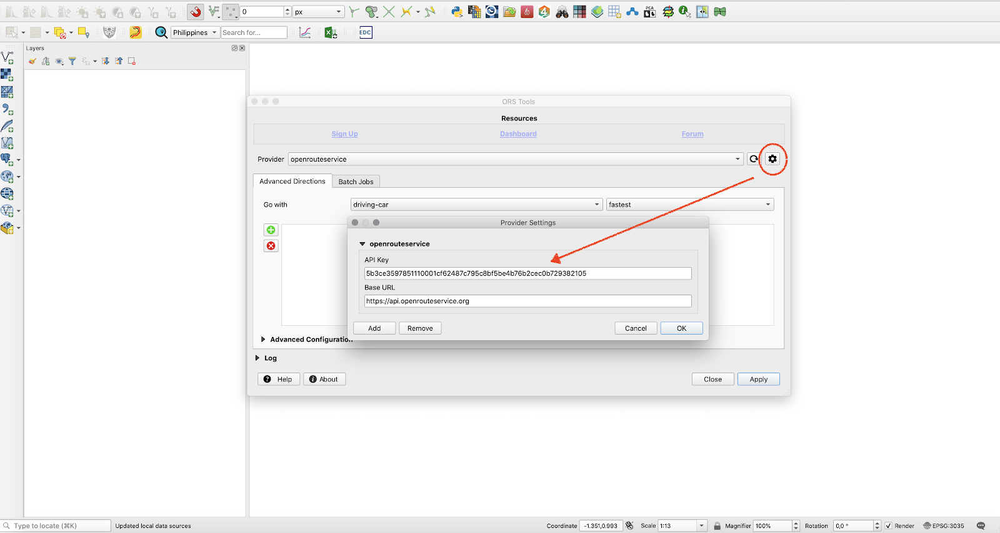

Figure 10.18.g - QGIS الخاص بك في openrouteserviceAP أدخل مفتاح   

في هذه المرحلة، يجب أن يكون QGIS الخاص بك جاهزًا لحساب المسارات باستخدام openrouteservice و OpenStreetMap. لاختبار قدراته الأساسية، قم بتحميل طبقات بناء بامبانجا في QGIS. تأكد من أنك تعمل في EPSG 3857 أو EPSG: 4326. بعد تحميل الطبقة، ابدأ في إدخال نقاط التوجيه. افتح أدوات ORS، واضغط على الزر الأخضر + (Figure 10.10.18h).

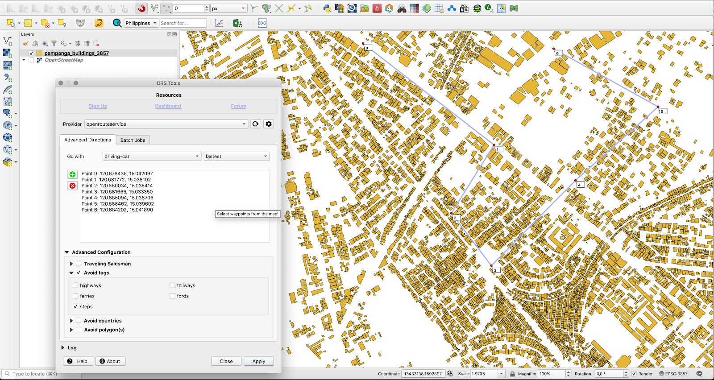

Figure 10.18.h - ORS إدخال نقاط التوجيه باستخدام أدوات 

اختر خوارزمية توجيه "بائع متجول" وانقر فوق تطبيق. بعد لحظات قليلة، سيتم إنشاء طبقة متجه جديدة: Routes_ORS.

Figure 10.18.i - ORS نتيجة تشغيل أدوات 

عند فتح OpenStreetMap، سنلاحظ أن أدوات ORS قد حاولت إنشاء طريق للمس جميع النقاط المعطاة من خلال النقر على الخريطة. الرجاء الإنتباه جيدا إلى أن QGIS كان يحتوي على طبقة واحدة تم تحميلها وهي طبقة "البناء"،ثمّ تم حساب طبقة جديدة وإضافتها تلقائيًا إلى لوحة خريطتك!

تعتمد نتائج أدوات ORS بشكل كبير على جودة قواعد البيانات المستخدمة، في هذه الحالة - خريطة الشارع المفتوح.

يحتوي الملحق، بالإضافة إلى openroutingservice، على المزيد ولكننا نتركك لتكتشف ذلك في رحلة GIS الخاصة بك.

<h4>
أسئلة الاختبار
</h4>

1. هل يمكن تشغيل ملحقات QGIS خارج منصة QGIS؟
    1. لا
    2. نعم
2. من أجل استخدام ملحقات QGIS ، يحتاج المرء إلى تعلم كيفية البرمجة.
    3. لا
    4. نعم
3. يوصى بشدة بتثبيت جميع المكونات الإضافية من خلال Plugin Manager، حتى لو كان من الممكن تثبيتها عن طريق تنزيل ملف zip ووضعه في مجلد QGIS الصحيح.
    5. لا.
    6. نعم.

