<div dir="rtl">
<h1>
الوحدة 2 - الطّبقات في QGIS
</h1>

المؤلف: بن هور- Ben Hur, Ali Rebaie, Samah Hijazi


<h2>
مقدمة تعليمية
</h2>

ستعلمك هذه الوحدة المفاهيم الأساسية للطبقات في QGIS وكيفية تحميلها. في نهاية هذه الوحدة ، مع نهاية هذه الوحدة، يجب أن يكون المتعلم قد اكتسب المفاهيم التالية:

*   مصادر البيانات المختلفة وصيغ الملفّات التي يمكن تحميلها في QGIS
*   الطرق المختلفة لتحميل البيانات في QGIS
*   بعض صيغ ملفات البيانات الشائعة

كما يجب أن يكون المتعلّم أيضًا قادراً على:

*   تحميل الطّبقات (المتّجهات والنقطيّة) باستخدام الـ Browser Panel والـ Data Source Manager 
*   ربط QGIS بالخدمات عن بعد
*   العمل مع الطّبقات المؤقّتة والافتراضية
*   تثبيت بعض الملحقات التي ستكون مسؤولة عن تحميل بعض مجموعات البيانات في QGIS
*   إظهار خصائص الطّبقة مثل معلومات البيانات الوصفية metadata information
*   حفظ وتصدير الطّبقات


<h2>
الأدوات والموارد المطلوبة
</h2>

الأدوات والموارد المطلوبة لهذه الوحدة هي:

*    حاسوب
*   اتصال بالإنترنت
*   QGIS 3.16 مثبت على الحاسوب ([https://qgis.org/en/site/forusers/download.html](https://qgis.org/en/site/forusers/download.html))


<h2>
المؤهلات المطلوبة
</h2>

*   المعرفة الأساسية لتشغيل حاسوب
*   الإلمام بصيَغ البيانات المكانية وواجهة QGIS (استكمال الوحدتين 0 و 1)


<h2>
مصادر إضافية
</h2>

*   دليل مستخدم QGIS
    * [https://docs.qgis.org/3.16/en/docs/user_manual/](https://docs.qgis.org/3.16/en/docs/user_manual/)

*   دليل تدريب QGIS
    * [https://docs.qgis.org/3.16/en/docs/training_manual/index.html](https://docs.qgis.org/3.16/en/docs/training_manual/index.html)


<h2>
مقدمة موضوعية
</h2>


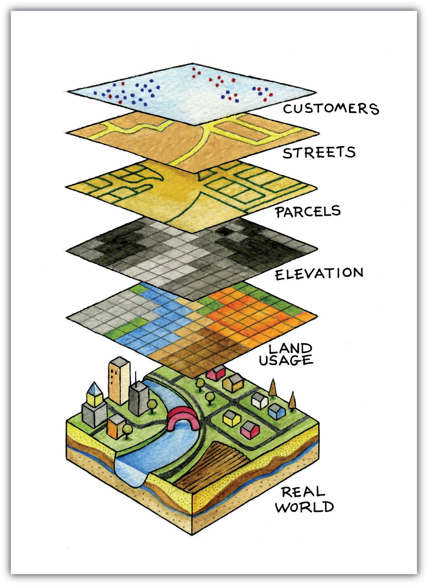

Figure 1.وضع معلومات على خريطة يحتوي على طبقات وأنواع بيانات مختلفة ([https://saylordotorg.github.io/text_essentials-of-geographic-information-systems/s11-02-multiple-layer-analysis.html](https://saylordotorg.github.io/text_essentials-of-geographic-information-systems/s11-02-multiple-layer-analysis.html))


لقد تعلمنا من الوحدات السّابقة أن نماذج البيانات المكانية مثل المتجهات والنقطية هي نماذج لأجسام وظواهر العالم الحقيقي، وفي حين أنّه من المقبول تمامًا أن نستخدم طبقة واحدة لتمثيل شيئًا واحدًا (مثل الارتفاع ودرجة الحرارة والمواقع المنزلية وتقسيم المناطق ، إلخ)، فإنّه من ناحية الممارسة العملية إذا أردنا إجراء تحليل مفيد أو إنشاء نموذج يعكس العالم الحقيقي بشكل جيد، فسنحتاج إلى استخدام العديد من البيانات والطبقات معًا. يعدّ تراكب الخرائط المتعددة المواضيع لنفس المنطقة من خلال وضعها فوق بعضها البعض أحد أقدم تقنيات التحليل الجغرافي وأكثرها شيوعًا.


<h2>
تفصيل المفاهيم
</h2>

تعطينا الصورة أعلاه مثالًا بسيطًا وملموسًا على ذلك. تخيل أنك مستشاراً لـ GIS وقد تمّ تكليفك بإيجاد أفضل موقع لمطعم جديد (مثل Jollibee أو ماكدونالدز). للقيام بذلك، ستحتاج إلى جمع المعلومات ذات الصلة التي من شأنها أن تساعدك على اتخاذ القرار. قد تشمل هذه المعلومات معلوماتٍ عن شوارع المدينة، وقطع الأراضي، والموقع وتوزّع العملاء المحتملين، وتضاريس المنطقة، واستخدام الأراضي، وما إلى ذلك.

ويمكن أن تأتي مجموعات البيانات هذه بأنواع وأشكال مختلفة. يمكن أن يكون بعضها ملفات متجهة بينما يمكن أن يكون البعض الآخر نقطية. يمكن أن يعتمد بعضها على نفس النظام المرجعي للإحداثيات بينما يمكن أن يعتمد البعض الآخر على أنظمة مرجعية مختلفة. يمكن أن يكون بعضها عبارة عن ملفات محلية في جهاز الكمبيوتر الخاص بك بينما لا يمكن تحميل البعض الآخر إلا عبر الإنترنت. بسبب هذه الاحتمالات العديدة المتعلقة بنوع البيانات التي قد تحتاجها لتحليلك المكاني، فإنّ نظام المعلومات الجغرافية  الجيّد يجب أن يكون قادراً على التعامل مع مجموعة متنوعة من مصادر البيانات وإدارتها.


<h2>
المحتوى الرّئيسى
</h2>

<h3>
عنوان المرحلة 1: أنواع البيانات وصِيغ الملفات ولوحة المتصفّح Browser Panel ولوحة الطبقات Layers Panel
</h3>

<h4><strong>
أنواع البيانات الشائعة وصِيغ الملفات
</strong></h4>

بصرف النظر عن نماذج البيانات المكانية (النقطية والمتجهات) التي تمت مناقشتها في الوحدة الأولى، فإن الإلمام بصِيغ الملفات الجغرافية ومزاياها وعيوبها مهم أيضًا لأي شخص يقوم بالتحليل المكاني.

عادةً ما يتعرف معظم الأشخاص الجدد على GIS على البيانات المكانية عبر ملفات الأشكال shapefiles. لا يتخطى معظم الأشخاص هذا مطلقًا ويستخدمون ملف الشكل ليعني جميع أنواع وأشكال بيانات المتجه. هذا مشابه لكيفية بدء استخدام علامة تجارية معينة مثل Coca Cola كمصطلح عام للمشروبات الغازية. هذا ليس أمراً خاطئاً بالضرورة ولكنّه مؤسف لأن ملفات الأشكال ليست سوى واحدة من الأنواع العديدة لتنسيق بيانات المتجه. في الواقع، في بعض الحالات، إنّ تنسيقات متجهات أخرى مثل geopackage و geojson و topojson و flatgeobuf. على الرغم من أن تنسيق ملف الشكل واسِع الانْتِشار، إلّا أنّ له بعض القيود المهمة مثل:

*   إنه ليس ملفًا واحدًا فقط. يتكون في الحقيقة ملف الأشكال من عدة ملفات، ثلاثة منها إلزامية: shp ، .shx ، .dbf. جميع الملفات الأخرى تسمى ملفات جانبية sidecar files.
*   يبلغ حد الحجم 2 جيجا بايت لكل ملف على حدة.
*   أسماء الحقول محددة بـ 10 أحرف.
*   أعمدة السّمات محددة بـ 255 عمودًا.
*   لا يوجد دعم لبعض أنواع البيانات مثل الوقت.
*   لا يتم تخزين الطوبولوجيا بشكل صريح.

صِيغ البيانات الأخرى مثل GeoPackage و GeoJSON و TopoJSON و flatgeobuff تعالج قيود ملفات الأشكال المذكورة أعلاه. في الواقع، تَحوّل QGIS و GRASS GIS إلى GeoPackage كصيغة ملف متجه افتراضي عند استيراد أو تصدير الطبقات وعلى الرغم من أن GeoPackage عليه أيضًا بعض القيود، كونه صيغةً مفتوحةً تمامًا، يسمح للمجتمع بالمساعدة في تشكيل مستقبل الصيغة.

إذا لم نستخدم ملفات الأشكال، فماذا يجب أن نستخدم؟

لا مشكلة في استخدام ملفات الأشكال خاصةً إذا كانت تناسب حالة الاستخدام الخاصة بك. إذا لم تكن بحاجة إلى مجموعة بيانات تتجاوز 2GB، إذا كنت موافقًا على وجود حد أقصى من 10 أحرف لأسماء الحقول الخاصة بك؛ أو إذا كنت تعمل مع عدد صغير من الملفات محليًا، فإن ملف الشكل جيد تمامًا.

في المقابل، إذا كنت تريد تجميع مشروع QGIS الخاص بك مع جميع طبقاته (المتجهات والنقطية) والتصميم والنماذج؛ أو إذا كنت ترغب في مشاركة أنواع متعددة من الطبقات والبيانات المكانية في ملف واحد، فيمكنك التفكير بـ GeoPackage. تعدّ حزم GeoPackages و GeoJSONs ملائمة للعمل على الويب ويمكن استخدامها مباشرة بواسطة مكتبات خرائط الويب مثل Mapbox و Leaflet.

يمكنك قراءة المزيد على هذا الرّابط: [https://bnhr.xyz/2018/12/12/i-choose-geopackage.html](https://bnhr.xyz/2018/12/12/i-choose-geopackage.html)

بالإضافة فإنّ أي صيغة يمكن تمثيلها على هيئة شبكة بكسل أو خلايا يتم قراءتها بواسطة QGIS كبيانات نقطية. يتضمن ذلك صيغ الصور مثل PNG .png و JPEG .jpg. ومن الجدير بالذّكر أنّه على الرغم من أنه يمكن قراءة جميع صيغ ملفات الصور على أنها نقطية، إلّا أنّها ليست جميعها ذات مرجع جغرافي أو تحتوي على معلومات جغرافية مكانية تتيح لنا تحديد موقعها بشكل صحيح على الأرض. في مثل هذه الحالات، يمكننا استخدام ما يُعرف بملف العالم ([https://en.wikipedia.org/wiki/World_file](https://en.wikipedia.org/wiki/World_file)). ملف العالم هو ملف بيانات منفصل و يتضمن نصّ عادي plaintext، ويحمل نفس اسم الملف النقطي الذي ينتمي إليه والذي يضاف إلى صيغته الحرف w الذي المضاف إلى النهاية. على سبيل المثال، سيتم تسمية الملف العالمي الخاص بـ world.png باسم world.pngw أو world.pgw.

تحتوي بعض صيغ ملفات الصور على معلومات ومراجع جغرافية صريحة ولا تحتاج إلى ملف عالمي. بعض الأمثلة هي GeoTIFFs .tif أو tiff وصيغة ملف ERDAS Imagine .img.

لمزيد من المعلومات حول تنسيقات الملفات ، يمكنك أيضًا زيارة الرابط التالي: [https://saylordotorg.github.io/text_essentials-of-geographic-information-systems/s09-03-file-formats.html](https://saylordotorg.github.io/text_essentials-of-geographic-information-systems/s09-03-file-formats.html)

يمكن أن تأتي البيانات الجغرافية المكانية أيضًا على شكل قواعد بيانات جغرافية مكانية. ويمكن أن تكون هذه قواعد بيانات على مستوى المؤسسة مثل Postgres المجانية والمفتوحة المصدر مع امتداد [https://postgis.net](https://postgis.net) PostGIS  أو ArcSDE الخاص بـ ESRI. توجد أيضًا قواعد بيانات جغرافية للملفات يمكنها تخزين أنواع مختلفة من البيانات بداخلها (مثل المتجهات والنقطية). بعض الأمثلة هي OGC GeoPackage المجانية والمفتوحة المصدر .gpkg [https://www.geopackage.org](https://www.geopackage.org) وتنسيق قاعدة البيانات الجغرافية للملف الخاص بها بواسطة (ESRI (.gdb.


<h4><strong>
أنواع مصادر البيانات
</strong></h4>

تتمثل إحدى أقوى ميزات QGIS في قدرته على الاتصال وتحميل واستخدام البيانات المكانية وغير المكانية المختلفة من مجموعة متنوعة من المصادر. حيث يمكن لـ QGIS فتح:

*   الملفات النقطية والمتجهة المحلية
*   قواعد البيانات المحلية
*   الملفات وقواعد البيانات على الإنترنت عبر معرّف المورد الموحّد (uniform resource identifier URI) أو مـُحدّد موقع الموارد المُوحّد (URL uniform resource locator)
*   خدمات الويب (OSGeo web services and ArcGIS web services) وخدمات التجانب ومداخل البيانات مثل GeoNode و أكثر من ذلك بكثير..

يمكن لـ QGIS أيضًا الإتّصال وتحميل البيانات من خدمات مثل بيانات SRTM التابعة لوكالة NASA وصور Planet و SentinelHub و Google Earth Engine و OpenStreetMap من خلال قوّة الملحقات.

وهذا ما يجعل QGIS جزءًا لا يتجزأ من أي بنية تحتية للبيانات المكانية أو تسلسل سير العمل.


<h4><strong>
تحميل الطبقات في QGIS
</strong></h4>

هناك عدة طرق لتحميل الطبقات في QGIS. وتشمل التالي:

*   قم بسحب وإسقاط الطبقة (Drag-and-drop) في لوحة خريطة QGIS أو لوحة الطبقة. قد تكون هذه هي أسهل طريقة لتحميل طبقة في QGIS ولكنها ليست الطريقة الموصى بها. وذلك بسبب بعض المشاكل الت قد تحدث عند استخدام هذا الأسلوب مثل مشاكل تحميل بيانات جدولية غير مكانية أو ملفات CSV.
*   استخدام لوحة المتصفّح Browser Panel.
*   باستخدام مدير مصدر البيانات Data Source Manager.
*   استخدام شريط أدوات مدير مصدر البيانات Data Source Manager toolbar وشريط أدوات إدارة الطبقات Manage Layers toolbar.

ملاحظة: عند تحميل الطبقات، قد تختلف الألوان الافتراضية لطبقاتك عن الألوان الافتراضية المعروضة في هذه الوحدة.


<h4><strong>
لوحة المتصفّح - The Browser Panel
</strong></h4>

تعرض لوحة المتصفح شجرة الملفّات التي تتضمن ملفات ومجلدات جهاز الكمبيوتر الخاص بك بالإضافة إلى الاتصالات بقواعد البيانات وخوادم الويب. بشكل أساسي، يتم تثبيت لوحة المتصفح على الجانب الأيسر من واجهة مستخدم QGIS مع لوحة الطبقات.

تَعرض لوحة المتصفح الكثير من الوظائف للاتصال والتحميل وإظهار المعلومات حول الطبقات. يمكنك أيضًا إنشاء روابط إلى الأدلّة directories المفضلة لديك والإشارات المرجعية المكانية Spatial Bookmarks من لوحة المتصفح.

لمعرفة المزيد حول هذه اللوحة، يمكنك الذهاب إلى:

[https://docs.qgis.org/3.16/en/docs/user_manual/introduction/browser.html](https://docs.qgis.org/3.16/en/docs/user_manual/introduction/browser.html)


<h4><strong>
التمرين 01.1: لوحة المتصفّح
</strong></h4>

1. افتح QGIS.
2. تحقق من جزء المتصفح (Figure 2). إذا لم تتمكن من العثور على لوحة المتصفح، فيمكنك جعلها مرئية ضمن عرض -> اللوحات -> لوحة المتصفح في شريط القائمة View -> Panels -> Browser Panel.


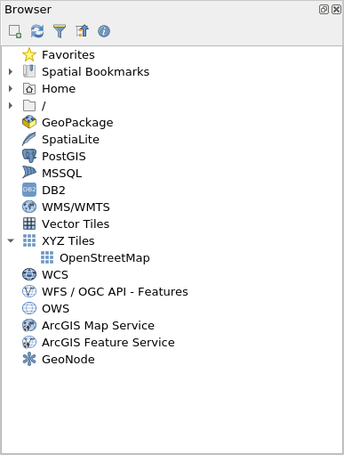

Figure 2. لوحة المتصفّح

3. لاحظ كيف يمكن توسيع محركات الأقراص والمجلدات لإظهار المجلدات الفرعية الموجودة بداخلها.
4. حدد موقع الوحدة 2 - الطبقات في مجلد QGIS (اFigure 3) في شجرة الملفات (لاحظ مكان حفظ الملف أو تنزيله). يجب أن تكون قادرًا على رؤية البيانات الضرورية لهذا المصنّف. في المثال الخاص بي أدناه، قمت بربط المجلد المذكور أعلاه كأحد الـFavorites حتى أتمكن من الانتقال إليه بسهولة من لوحة المتصفح. يمكنك إضافة دليل مفضل إلى "لوحة المتصفح" بالنقر بزر الماوس الأيمن فوق "Favorites" وإضافة الدليل.
5. افحص الملفات الموجودة داخل المجلد (Figure 3). هناك العديد منها. من شجرة الملف نفسها، يمكننا بالفعل الحصول على فكرة عن الملفات والطبقات التي يمكننا تحميلها في QGIS. تشير الرموز الموجودة على يسار الأسماء إلى ما إذا كانت البيانات متجهًا  أم نقطية  أم قاعدة بيانات
 أم بيانات جدولية بسيطة 

    
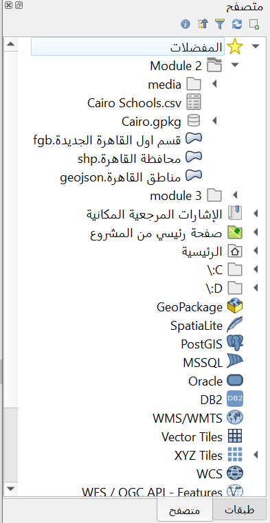

Figure 3. ملفات الوحدة في لوحة المتصفح

6. يوجد 5 ملفات ضمن مجلد البيانات:

    1. حزمة Cairo.gpkg التي تحتوي على متّجه (مستشفيات القاهرة) وملف نقطي (SRTM.tif) ؛
    2. ملف GeoJSON تحت اسم  مناطق القاهرة.geojson
    3. ملف flatgeobuf  تحت اسم  قسم أول القاهرة الجديدة.fgb 
    4. ملف  شكل shapefile تحت اسم محافظة القاهرة.shp 
    5. ملف قيم مفصولة بفواصل (comma-separated value CSV) تحت اسم Cairo Schools.csv.

7. انقر بزر الماوس الأيمن فوق محافظة القاهرة.shp وانقر فوق خصائص الطبقة (Figure 4). هذا يفتح نافذة خصائص الطبقة (Figure 5). لاحظ المعلومات الواردة في النافذة. ما هي هندسة الطبقة؟ ما هو معيار الـ   CRS المستخدم؟ كم عدد الميزات الموجودة في الطبقة؟


Figure 4.فحص خصائص الطبقة


Figure 5. خصائص الطبقة من لوحة المتصفّح

8. بصرف النظر عن توفير البيانات الوصفية  metadata على الطبقات، يمكنك أيضًا معاينة الشكل الهندسي والسمات للطبقة في نافذة خصائص الطبقة.
9. يمكنك تحميل الطبقه من لوحة المتصفح عن طريق:

    1. النقر المزدوج فوق الطبقة
    2. النقر بزر الماوس الأيمن فوق الطبقة -> إضافة طبقة إلى المشروع ـ layer -> Add Layer to Project
    3. سحب الطبقة إلى لوحة الخريطة

10. حاول تحميل طبقات قسم أول القاهرة الجديدة و مناطق القاهرة و محافظة القاهرة باستخدام أي من الطرق المذكورة أعلاه.


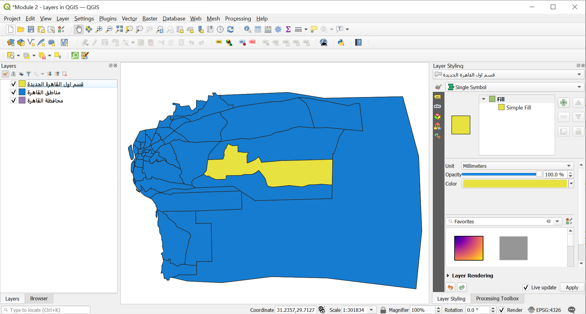

Figure 6. QGIS طبقات المتجه المحملة في 


<h4><strong>
لوحة الطبقات - The Layers Panel
</strong></h4>

تعرض لوحة الطبقات جميع الطبقات الحالية في المشروع. تساعد في إدارة رؤيتهم وترتيبهم ويمكن استخدامها لإظهار خصائص الطبقة. يمكن تنشيط لوحة الطبقات من عرض -> لوحات -> لوحة الطبقات (View -> Panels -> Layers Panel) أو باستخدام الاختصار <strong>CTRL+1</strong>. ويسمى أيضًا وسيلة إيضاح الخريطة Map Legend. إذا قمت بتحميل جميع المتجهات من التمرين السابق، فيجب أن تظهر لوحة الطبقات كما يلي:


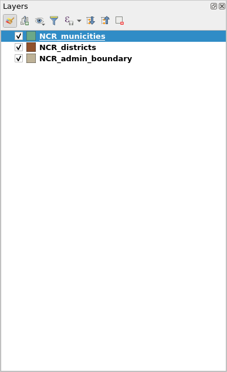

Figure 7. لوحة الطبقات

يمكن التحكم في رؤية الطبقة عن طريق اختيار أو إلغاء اختيار المربع الموجود على يسار اسم الطبقة. من خلال سحب الطبقات لأعلى أو لأسفل في لوحة الطبقات، يمكن تغيير ترتيبها (Z-ordering). على غرار برامج معالجة الصور مثل GIMP أو Photoshop، يتم رسم الطبقات المدرجة بالقرب من الجزء العلوي فوق الطبقات المدرجة في الأسفل. لذلك إذا أظهرت طبقتان نفس المنطقة، فسيتم رسم الطبقة الأعلى في لوحة الطبقات فوق الطبقة السفلية وهذا قد يجعل الطبقة السفلية  غير مرئية في لوحة الخريطة. هذا جدير بالملاحظة لأنه يمكن أن تكون هناك حالات نعتقد فيها أن طبقة ما لم تظهر في QGIS بينما هي في الواقع مغطاة أو مخفية بطبقة فوقها.

ملاحظة: يمكن تجاوز ترتيب الطبقات على شكل حرف Z في لوحة الطبقات Layers Panel بواسطة لوحة ترتيب الطبقات Layer Order Panel.

تتيح لوحة الطبقات أيضًا للمستخدم إعادة تسمية الطبقات وإزالتها، وفلترة رؤية الطبقة، وإنشاء وإدارة مجموعات الطبقات وطرق عرض الخريطة.

يمكن أيضًا فتح جدول السّمات لطبقة المتّجه من لوحة الطبقات عن طريق النقر بزر الماوس الأيمن على الطبقة -> فتح جدول البيانات right-clicking on the layer -> Open attribute table.

لمعرفة المزيد حول لوحة الطبقات ، يمكنك الذهاب إلى الرابط التالي:[https://docs.qgis.org/3.16/en/docs/user_manual/introduction/general_tools.html#layers-panel](https://docs.qgis.org/3.16/en/docs/user_manual/introduction/general_tools.html#layers-panel)


<h4><strong>
خصائص الطبقة
</strong></h4>

سيؤدي النقر بزر الماوس الأيمن فوق طبقةٍ ما في لوحة الطبقات واختيار خصائص الطبقة إلى فتح مربع حوار خصائص الطبقة.


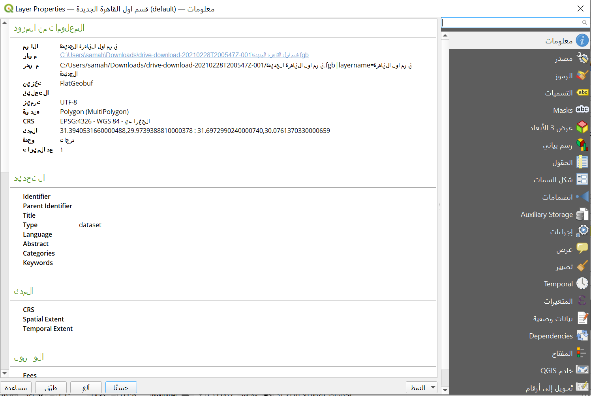

Figure 8. مربع حوار خصائص الطبقة

هناك العديد من علامات التبويب في مربع حوار خصائص الطبقة التي تسمح للمستخدم برؤية المعلومات وحتى تحرير / تعديل الخصائص المتعلقة بالطبقة.

تعرض "علامة تبويب المعلومات" المعلومات والبيانات الوصفيّة الملخّصة القابلة للقراءة فقط على الطبقة الحالية، بما في ذلك:

*   مزود البيانات
*   البيانات الوصفية المملوءة metadata
*   الهندسة أو حقول المعلومات

تعرض علامة تبويب المصدر Source tab الإعدادات العامة لطبقة المتّجه.

تسمح علامات التبويب مثل الرموز Symbology والتسميات Labels والأقنعة Masks والعرض ثلاثي الأبعاد 3D View للمستخدم بتعديل ترميز ونمط الطبقة.

تسمح علامات التبويب الأخرى للمستخدمين بإجراء عمليات الصلات مع الطبقة (الإنضمام - Join)، والحصول على معلومات حول حقول السمات (Fields) ، وإضافة نماذج مخصصة لإضافة بيانات جديدة (نماذج السمات Attribute Forms) ، وغير ذلك الكثير.

علامة تبويب أخرى جديرة بالذكر هي علامة تبويب البيانات الوصفية Metadata tab التي توفّر للمستخدم القدرة على إنشاء وتعديل تقرير البيانات الوصفية على الطبقة. يتضمن هذا معلومات عن:

*   تحديد البيانات: الإسناد الأساسي لمجموعة البيانات (الأصل، المعرّف، العنوان، الملخّص، اللغة ...) ؛
*   الفئات التي تنتمي إليها البيانات مثل فئات ISO والفئات المخصصة؛
*   كلمات أساسية لاسترداد البيانات والمفاهيم المرتبطة بها باتباع مفردات معيارية؛
*   الوصول إلى مجموعة البيانات (التراخيص والحقوق والرسوم والقيود) ؛
*   مدى مجموعة البيانات، إما المكانية (CRS ، مدى الخريطة ، الارتفاعات) أو الزمانية ؛
*   معلومات الاتصال بمالك (مالكي) مجموعة البيانات؛
*   روابط لمصادر إضافية ومعلومات ذات صلة؛ 
*   تاريخ مجموعة البيانات.

يتم توفير ملخص للمعلومات المعبأة في علامة التبويب التحقق من الصحة Validation tab ويساعد في تحديد المشكلات المحتملة المتعلقة بنموذج البيانات الوصفية. حاليًا، يتم حفظ البيانات الوصفيّة في ملف المشروع ولكن يمكن أيضًا حفظها في ملف .qmd منفصل جنبًا إلى جنب مع الطبقات القائمة على الملف أو في قاعدة بيانات .sqlite محلية للطبقات البعيدة remote layers.

لمعرفة المزيد حول خصائص طبقة المتجهات ، يمكنك الذهاب إلى الرابط التالي: [https://docs.qgis.org/3.16/en/docs/user_manual/working_with_vector/vector_properties.html](https://docs.qgis.org/3.16/en/docs/user_manual/working_with_vector/vector_properties.html) 

لمعرفة المزيد حول خصائص الطبقة النقطية ، يمكنك الذهاب إلى الرابط التالي: [https://docs.qgis.org/3.16/en/docs/user_manual/working_with_raster/raster_properties.html](https://docs.qgis.org/3.16/en/docs/user_manual/working_with_raster/raster_properties.html)


<h4><strong>
البيانات الوصفية الجغرافية المكانية - Geospatial Metadata
</strong></h4>

البيانات الوصفية هي ببساطة بيانات حول البيانات. تجيب على أسئلة من وماذا ومتى وأين وكيف حول مجموعة البيانات وتأتي في جميع الأشكال والأحجام. لأغراض نظم المعلومات الجغرافية، عادةً ما نهتم بالبيانات الوصفية الجغرافية المكانية. تمّ وصف البيانات الوصفية الجغرافية المكانية من قبل لجنة البيانات الجغرافية الفيدرالية الأمريكية (U.S. Federal Geographic Data Committee FGDC ) على النحو التالي:

" إنّه ملف معلومات، يتم تقديمه عادةً كمستند XML، ويلتقط الخصائص الأساسية لمصدر بيانات أو معلومات. إنّه يمثل من وماذا ومتى وأين ولماذا وكيف عن المورد. عادةً ما توثّق البيانات الوصفية الجغرافية المكانية البيانات الرقمية الجغرافية مثل ملفات نظام المعلومات الجغرافية (GIS) وقواعد البيانات الجغرافية المكانية وصور الأرض، ولكن يمكن استخدامها أيضًا لتوثيق الموارد الجغرافية المكانية بما في ذلك كتالوجات البيانات وتطبيقات الخرائط ونماذج البيانات والمواقع الإلكترونية ذات الصلة. تتضمن سجلات البيانات الوصفية عناصر فهرس المكتبة الأساسية مثل بيانات العنوان والملخص والنشر؛ وتتضمن أيضاً العناصر الجغرافية مثل النطاق الجغرافي ومعلومات الإسقاط؛ وعناصر قاعدة البيانات مثل تعريفات تسمية السمات وقيم نطاق السمة. "

تكمن أهمية البيانات الوصفية في أنّها لا تعزز الشفافية فحسب، بل تسهّل أيضًا مشاركة البيانات والمعلومات. هذا ما يجعل إضافة البيانات الوصفية إلى مجموعات البيانات الخاصة بنا أمراً مهمّاً دائمًا. عند إضافة البيانات الوصفية، من المهم أيضاً اتباع المعايير( التي يتم الترويج لها على نطاق واسع، والمقبولة، والقواعد والممارسات المتبعة) بحيث تكون البيانات الوصفية التي نقوم بإنشائها قابلة للتشغيل البيني. أحد هذه المعايير هو ISO 19115: 2014 "المعلومات الجغرافية - البيانات الوصفية" من ISO / TC 211. 

[https://www.iso.org/obp/ui/#iso:std:iso:19115:-1:ed-](https://www.iso.org/obp/ui/#iso:std:iso:19115:-1:ed- 1: v1: ar)


<h4><strong>
التمرين 01.2: إضافة البيانات الوصفية
</strong></h4>

1. افتح خصائص الطبقة لطبقة محافظة القاهرة
2. تحقق من المعلومات الموضحة في علامة التبويب المعلومات وانظر إلى المعلومات المعروضة. هل هي كاملة؟ هل يمكننا إضافة المزيد من المعلومات؟


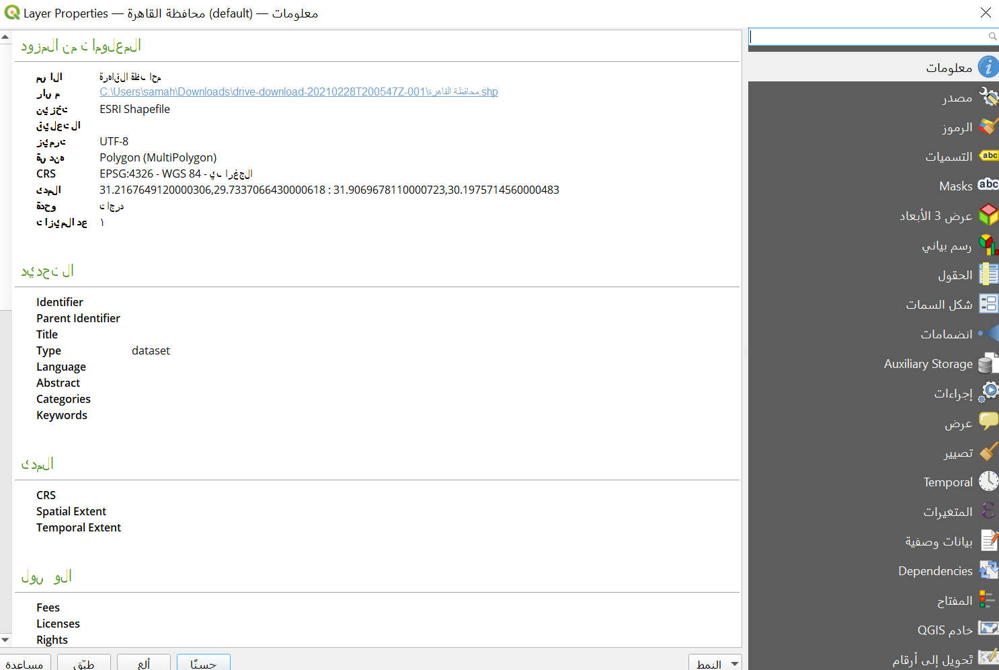

Figure 9. خصائص المعلومات لطبقة محافظة القاهرة 


3. انتقل إلى علامة التبويب البيانات الوصفية وحاول إضافة المزيد من المعلومات حول الطبقة مثل المدى وفئة البيانات والترخيص وما إلى ذلك. انقر فوق "موافق" عند الانتهاء.


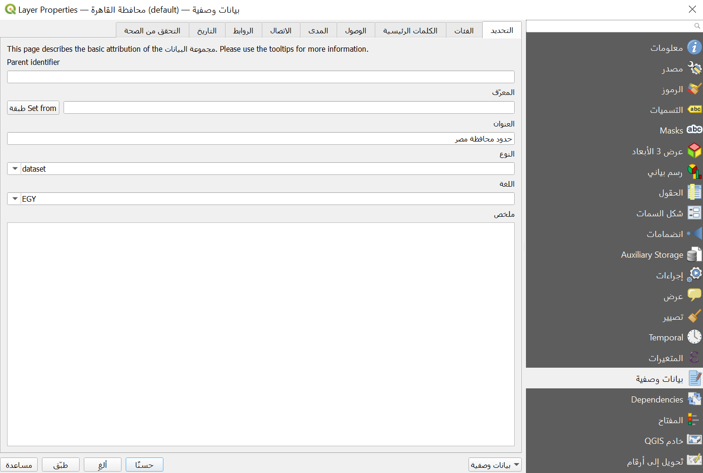

Figure 10. تعديل بعض البيانات الوصفية

4. انتقل إلى علامة التبويب المعلومات مرة أخرى ولاحظ ما إذا كان أي شيء قد تغير.


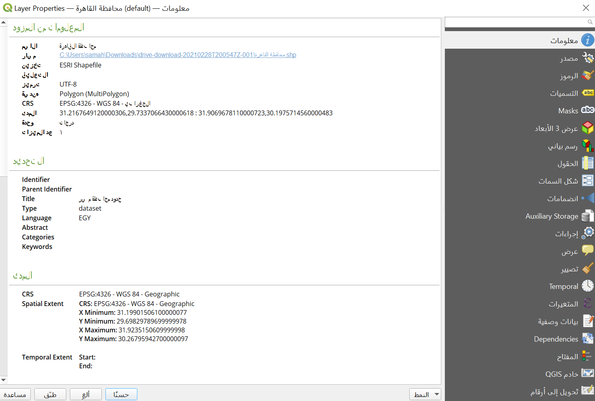

Figure 11. علامة تبويب المعلومات بعد تحرير بعض البيانات الوصفية


<h4><strong>
أسئلة الاختبار
</strong></h4>


1. صح أم خطأ:
    1. جميع ملفات المتجهات هي ملفات أشكال.
    2. عند التقديم على Map Canvas، فإن الطبقة الأعلى في لوحة Layers ستغطي دائمًا أو تظهر أعلى من الطبقة الأدنى في لوحة الطبقات.
    3. يمكنك التحقق من معلومات البيانات الوصفية حول طبقة ما من لوحة الطبقات ولوحة المتصفح.


<h3>
عنوان المرحلة 2: مدير مصدر البيانات Data Source Manager والاتصال بالخدمات عن بعد Connecting to Remote Services
</h3>

<h4><strong>
مدير مصدر البيانات
</strong></h4>

إذا كنت لا تريد استخدام لوحة المتصفح لتحميل الطبقات، فيمكنك استخدام مدير مصدر البيانات.

تم تقديم مدير مصدر البيانات مع إصدار QGIS 3. إنه "متجر شامل" لإضافة وتحميل طبقات من مصادر بيانات مختلفة في QGIS. قبل تقديمه مع إصدار QGIS 3، كانت هناك نوافذ منفصلة لتحميل مصادر البيانات المختلفة (أي، واحدة للنقطية، وواحدة للمتجهات ، وما إلى ذلك). يمكن الوصول إليه عبر Layers -> Data Source Manager أو CTRL + L.


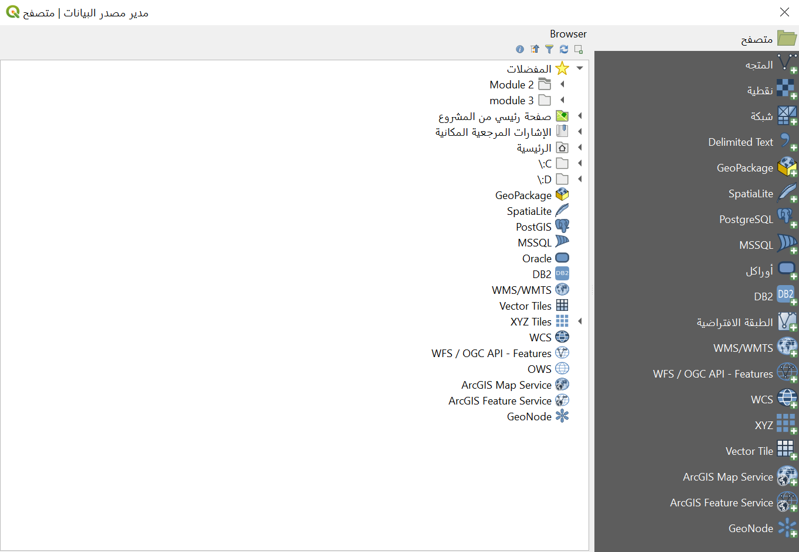

Figure 12. مدير مصدر البيانات

<h4><strong>
التمرين 02.1: مدير مصدر البيانات
</strong></h4>

1. افتح مدير مصدر البيانات (Figure 12). يحتوي على علامات تبويب على الجانب الأيسر تتعلق بنوع مصدر البيانات الذي تريد تحميله أو الاتصال به. على غرار المتصفح، يمكنك تحميل عدة أنواع من البيانات وتوصيلها من مدير مصدر البيانات.
2. تحميل المتجه

    1. لتحميل المتجهات ، انتقل إلى علامة التبويب Vector. يمكن تحميل الملفات والملفات الموجودة داخل الدليل وقاعدة البيانات وحتى الملفات البعيدة عبر بروتوكول مثل HTTP والسحابة وما إلى ذلك.
    2. لنقم بتحميل ملف المتجه (مستشفيات القاهرة) الموجود داخل حزمة geopackage Cairo هذه الطبقة هي طبقة نقطية لمواقع مستشفيات القاهرة.
        1. نوع المصدر: ملف
        2. المصدر: حدد حزمة geopackage Cairo باستخدام الزر 
        3. انقر فوق إضافة
        4. إذا كان هناك أكثر من ملف متجه واحد داخل حزمة geopackage، سيطلب منك QGIS تحديد الملفات المراد تحميلها


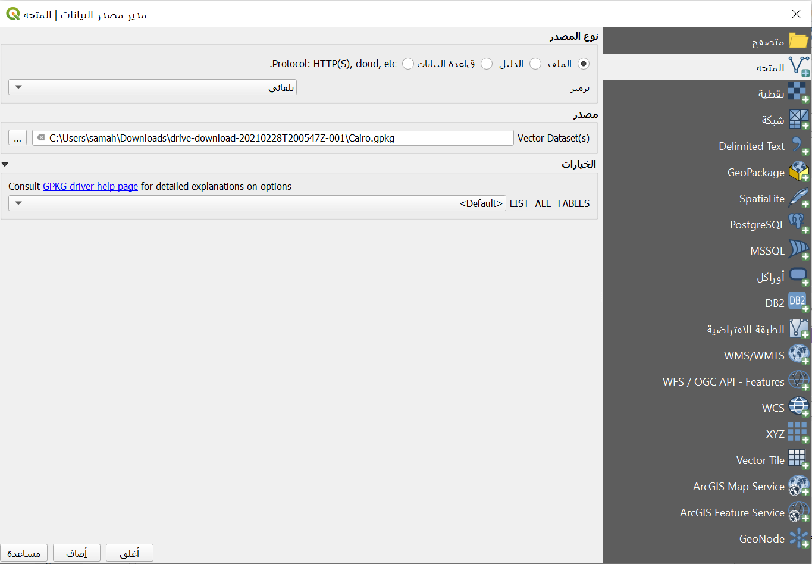

Figure 13. GeoPackage تحميل متجه داخل 

3. تحميل البيانات النقطية
    1. لتحميل البيانات النقطية، انتقل إلى علامة التبويب النقطية. يمكن تحميل الملفات والملفات البعيدة عبر بروتوكول مثل HTTP والسحابة وما إلى ذلك. هناك خطوط نقطية (SRTM) داخل حزمة geopackage Cairo. هذه البيانات النقطية هي نموذج ارتفاع رقمي لمنطقة القاهرة. لتحميله:
        1. نوع المصدر: ملف
        2. المصدر: حدد حدد حزمة geopackage Cairo باستخدام الزر 
        3. انقر فوق إضافة
        4. إذا كان هناك أكثر من ملف نقطي داخل حزمة geopackage، فسوف يطلب منك QGIS تحديد الملفات المراد تحميلها


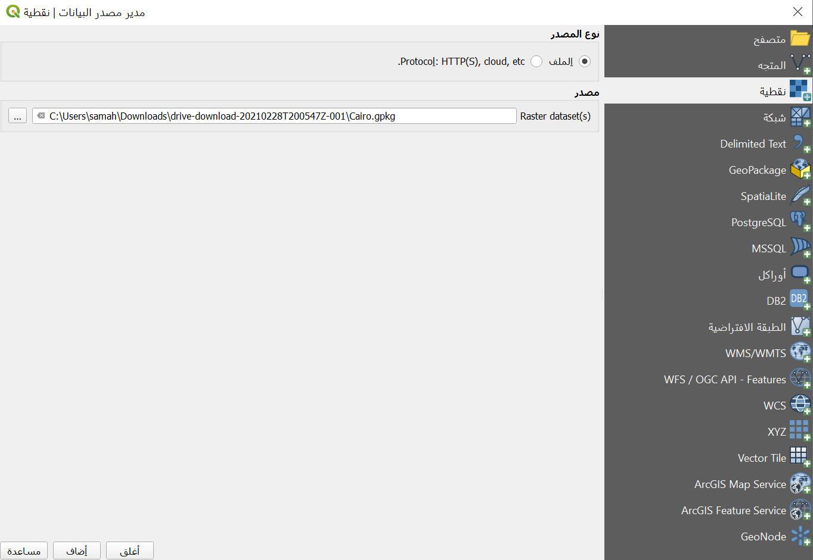

Figure 14.GeoPackage تحميل البيانات النقطية داخل 

4. تحميل CSV وملفات نصية محددة أخرى
    1. إلى جانب المتجهات والنقطية، هناك ملف شائع آخر يستخدمه أفراد نظم المعلومات الجغرافية هو ملف CSV وجداول البيانات. لحسن الحظ، من السهل نسبيًا تحميل هذه الملفات في QGIS.
    2. يمكن تحميل ملفات CSV وغيرها من الملفات النصية المحدّدة عبر علامة التبويب نص محدد Delimited Text tab في مدير مصدر البيانات، وإضافتها من لوحة المتصفح، وحتى سحبها إلى لوحة الخريطة. ومع ذلك ، يجب مراعاة بعض الأشياء إذا كان ملف CSV لديك يحتوي على معلومات هندسية (مثل مواقع النقاط). القاعدة العامة هي:
        1. استخدم مدير مصدر البيانات لتحميل ملفات CSV سواء كانت تحتوي على معلومات هندسية أم لا.
        2. إذا كان سيتم تحميل ملفات CSV عبر لوحة المتصفح أو عن طريق السحب، فتأكد من وجود ملف CSVT مطابق للاحتفاظ بأنواع حقول البيانات.
        3. إذا واجهت مشاكل في حفظ أنواع البيانات لنصوصك المحددة (على وجه التحديد ملفات CSV) ، فيمكنك استخدام ما يسمى ملف CSVT. يمكنك قراءة المزيد حول تحميل ملفات CSV في QGIS على الرابط التالي: [https://bnhr.xyz/2018/08/07/specifying-csv-data-types-using-a-csvt-file.html](https://bnhr.xyz/2018/08/07/specifying-csv-data-types-using-a-csvt-file.html)

    3. يمكن تحميل ملفات CSV وجداول البيانات في QGIS مع أو بدون معلومات مكانية أو هندسية. عندما يتم تحميلها بالمعلومات المكانية، يتم التعامل معها على أنها بيانات متجهة. عندما يتم تحميلها بدون معلومات مكانية ، يتم التعامل معها على أنها بيانات جدولية عادية.
    4. يوجد ملف CSV في مجلد البيانات باسم Cairo Schools.csv والذي يحتوي على مواقع نقاط المدارس في القاهرة. لتحميله:
        1. انتقل إلى علامة التبويب نص محدد
        2. اسم الملف: حدد Cairo Schools CSV باستخدام الزر  
        3. صيغة الملف: CSV
        4. خيارات السجلات والحقول: احتفظ بها افتراضيًا
        5. تعريف الهندسة:
            * إحداثيات النقطة
            * المجال X: خط الطول
            * المجال Y: خط العرض
            * الهندسة CRS: EPSG: 4326 - WGS 84
        6. إعدادات الطبقة: تحقق من ملف المراقبة Watch file واستخدم الفهرس المكاني  spatial index
            * عند تحديد ملف المراقبة، تنعكس تحديثات ملف CSV المحلي تلقائيًا في الطبقة المحملة في QGIS.
            * أضف استخدام الفهرس المكاني كفهرس مكاني للطبقة المحملة مما يجعل معالجة المتجهات أسرع.


Figure 15. تحميل ملف CSV

بمجرد تحميل جميع الطبقات في التدريبات السابقة، يجب أن تبدو لوحة الطبقات كما يلي:


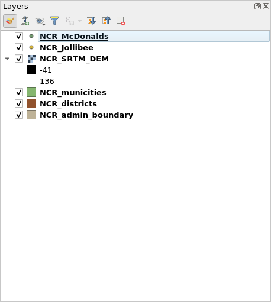

Figure 16. لوحة الطبقات عند تحميل جميع الطبقات

يجب أن تبدو لوحة الخريطة كما يلي:


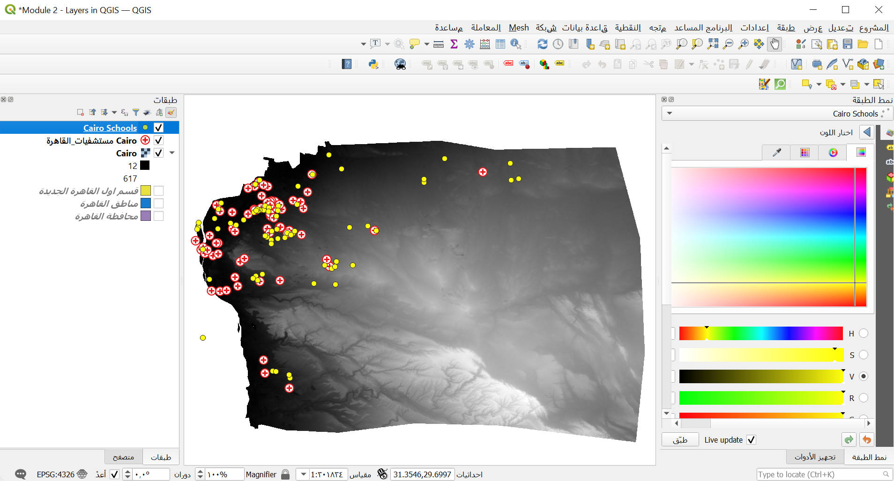

Figure 17.  مع تحميل جميع الطبقات QGIS واجهة 

يمكنك إعادة ترتيب الطبقات في لوحة الطبقة كما تريد.


<h4><strong>
ربط QGIS بالخدمات عن بعد
</strong></h4>

بصرف النظر عن ملفات المتجهات والنقطية، يمكن لـ QGIS أيضًا الاتصال بالخدمات البعيدة مثل خوادم التجانب tile servicers وخدمات الويب OGC مثل (WMS و WFS) وحتى ESRI ArcGIS Web Services. يمكن إنشاء هذا الاتصال من لوحة المتصفح أو مدير مصدر البيانات.


<h4><strong>
التمرين 02.2: مدير مصدر البيانات
</strong></h4>

عادةً ما يتم استخدام مربعات XYZ كخرائط أساس ويتم استخدامها ليس فقط في التطبيقات المكتبية، ولكن بشكل أكثر شيوعًا في تطبيقات الويب.

للاتصال بخادم البلاط tile server:

1. انتقل إلى لوحة المتصفح
2. انقر بزر الماوس الأيمن فوق XYZ Tiles -> New Connection
3. يضاف ما يلي:

```
    الاسم: ESRI World Imagery
    عنوان: https://server.arcgisonline.com/ArcGIS/rest/services/World_Imagery/MapServer/tile/{z}/{y}/{x}
```
4. انقر فوق موافق.


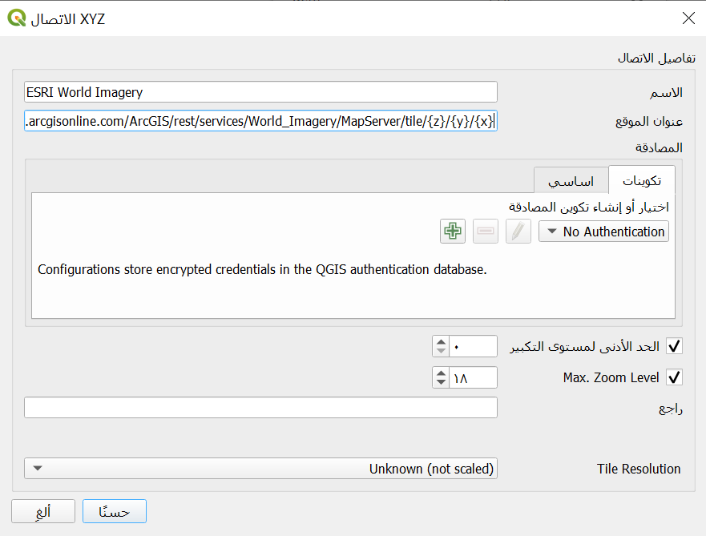

Figure 18. QGIS في XYZ  إضافة اتصال في

5. يجب أن يضيف هذا عنصر ESRI World Imagery ضمن XYZ Tiles في لوحة المتصفح.


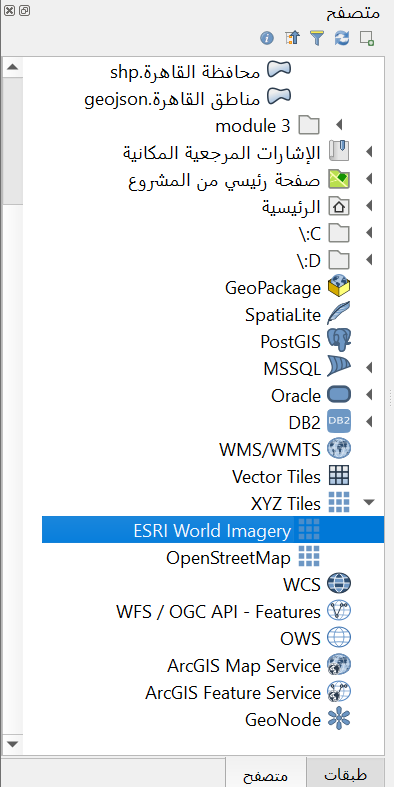

Figure 19.إلى لوحة المتصفح ESRI World Imagery Tile تمت إضافة خادم 

6. يمكنك تحميل طبقة البلاط XYZ كما تفعل مع أي طبقة أخرى من لوحة المتصفح.


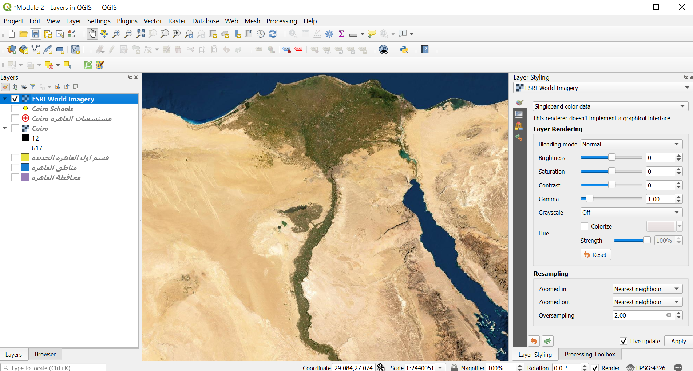

Figure 20.QGIS في PGP تحميل طبقة خريطة الأساس 

<h4><strong>
المكافأة رقم 1:
</strong></h4>

 إذا كنت ترغب في إضافة العديد من خرائط الأساس ضمن XYZ Tiles في لوحة المتصفح، فيمكنك اتباع التعليمات الواردة في هذا المنشور: [https://bnhr.xyz/2018/10/07/basemaps-in-qgis.html](https://bnhr.xyz/2018/10/07/basemaps-in-qgis.html)


<h4><strong>
المكافأة رقم 2:
</strong></h4>

يمكنك إضافة عناوين URL لخوادم البلاط الموجودة في موقع الويب Leaflet Providers على هيئة مربعات XYZ في لوحة المتصفح [https://leaflet-extras.github.io/leaflet-providers/preview](https://leaflet-extras.github.io/leaflet-providers/preview) .


<h4><strong>
التمرين 02.3: التوصيل بـ WMS / WMTS و WFS
</strong></h4>

WMS أو Web Map Service عبارة عن اتحاد جغرافي مكاني مفتوح (OGC consortium) ([https://www.ogc.org](https://www.ogc.org)). وهو معيار خدمة ويب للشكوى لخدمة الصور (المربعات النقطية) عبر الإنترنت. عندما يتم تقديم البيانات عبر WMS، لا يمكن للمستخدم تحرير المعلومات الموجودة تحتها مباشرة ولا تصميمها.

ولكن في الوقت نفسه، تعد WFS أو Web Feature Services خدمة ويب أخرى متوافقة مع OGC لخدمة الميزات (المتجهات) عبر الإنترنت. عندما يتم تقديم البيانات عبر WFS، يكون للمستخدم حق الوصول إلى السمات الأساسية والهندسة، مما يسمح له بتصميم الطبقة وتعديلها واستخدامها لتحليل المتجهات.

للاتصال بـ WMS:


1. انتقل إلى لوحة المتصفح
2. انقر بزر الماوس الأيمن فوق WMS/WMTS -> New Connection
3. يضاف ما يلي:

```
    الاسم: [CDATA[ WMS ]]
    URL: https://gistmaps.itos.uga.edu/arcgis/services/COD_External/EGY_AR/MapServer/WmsServer
```

4. انقر على زر إضافة


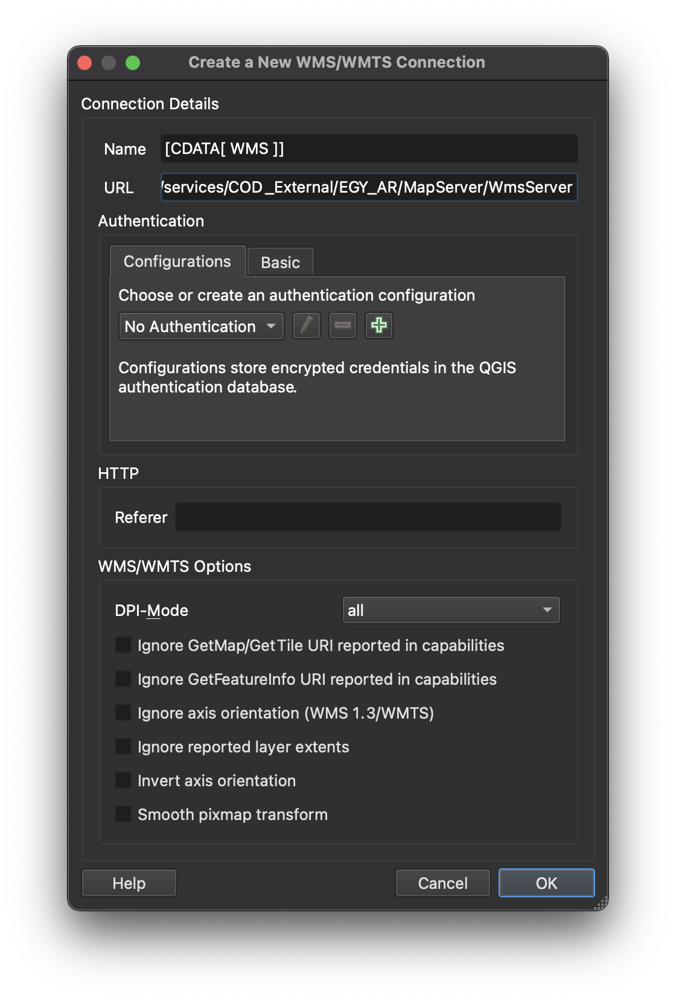

Figure 21.جديد WMS / WMTS إنشاء اتصال 

5. يجب أن يضيف هذا عنصر"[CDATA[ WMS ]]" ضمن اتصالات WMS / WMTS و OWS في لوحة المستعرض.


![The [CDATA[ WMS ]] WMS added in the Browser Panel](media/wms-2.png "The [CDATA[ WMS ]] WMS added in the Browser Panel")

Figure 22.في لوحة المستعرض WMS "[CDATA[ WMS ]]”إضافة عنصر 

6. يمكنك تحميل طبقات WMS كما تفعل مع أي طبقة أخرى من لوحة المتصفح.


![[CDATA[ WMS ]] layer map from WMS loaded in QGIS](media/wms-3.png "[CDATA[ WMS ]] layer map from WMS loaded in QGIS")

Figure 23.  QGIS التي تم تحميلها WMS خريطة مخاطر الفيضانات من  

7. يتّبع الاتصال بـ WFS نفس الخطوات.


<h4><strong>
أسئلة الاختبار
</strong></h4>

1. صح أم خطأ:
    1. يمكنك فقط تحميل الملفات المحلية في QGIS


<h3>
عنوان المرحلة 3: تصدير الطبقات والطبقات في الذاكرة (المؤقتة) والطبقات الافتراضية
</h3>

<h4><strong>
تصدير طبقات من QGIS
</strong></h4>

يعد تصدير الطبقات (أو حفظ الطبقات في ملفات) أمرًا سهلاً في QGIS. ما عليك سوى النقر بزر الماوس الأيمن فوق الطبقة -> تصدير layer -> Export لعرض خيارات التصدير للطبقة.


Figure 24. QGIS تصدير طبقة من 

*   Save Features As ... يسمح لك بحفظ الطبقة النقطية أو المتجهية.
    *   عندما يكون الـ filter نشطًا على طبقة المتجه، يتم تصدير المعالم التي تمت تصفيتها فقط (تلك التي تظهر على لوحة الخريطة).
*    Save Selected Features As... هو خيار للطبقات المتجهة يسمح لك فقط بحفظ الميزات المحددة حاليًا.
*   Save as Layer Definition File… ينشئ ملف QLR (راجع الوحدة 1 ، تنسيقات ملف QGIS) للطبقة
*   Save as QGIS Layer Style File… يحفظ ملف QML (راجع الوحدة 1 ، تنسيقات ملف QGIS) للطبقة


عند تصدير طبقة، يمنحك QGIS الخيار لتحديد صيغة ملف الإخراج والحقول المراد تضمينها (إذا كان ملفًا متجهًا) والنظام المرجعي لإحداثيات الإخراج وخيارات أخرى. هذا يعني أنه يمكنك تنفيذ إسقاط إحداثي عن طريق تصدير طبقة.


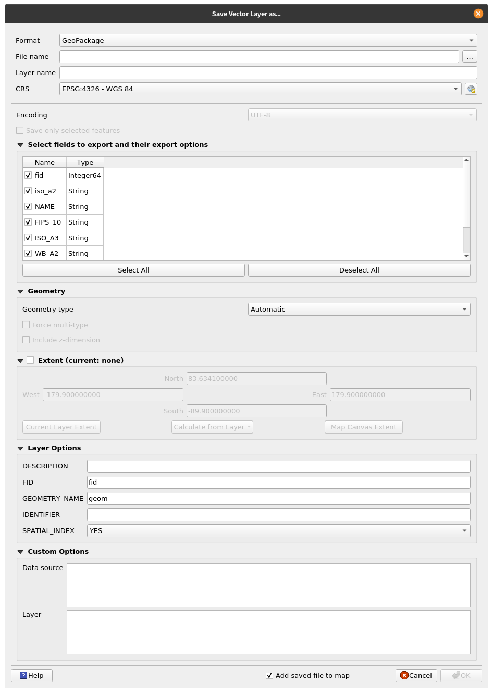

Figure 25. Save Vector Layer مربع حوار

للمزيد من المعلومات حول كيفية حفظ طبقة من ملف موجود، يمكنك زيارة الرابط التالي: [https://docs.qgis.org/3.16/en/docs/user_manual/managing_data_source/create_layers.html#save-layer-from-an-existing-file](https://docs.qgis.org/3.16/en/docs/user_manual/managing_data_source/create_layers.html#save-layer-from-an-existing-file)


<h4><strong>
الطبقات في الذاكرة
</strong></h4>

في بعض الأحيان، لا نحتاج أو نرغب في حفظ الطبقات التي نستخدمها فعليًا في تحليلنا في أجهزة الكمبيوتر الخاصة بنا ، خاصةً إذا كانت مؤقتة فقط.

هذا ما يفهمه QGIS  لذلك فهو يسمح للمستخدمين بإنشاء طبقات مؤقتة. يمكن استخدام هذه الطبقات بشكل مشابه لطبقات المتجه العادية ولكن لا يلزم حفظها بشكل دائم في ملف في محركات أقراص التخزين لدينا لأن QGIS يخزنها في الذاكرة أو الـ RAM. تظهر الطبقات المؤقتة في لوحة الطبقات مع هذه الأيقونة  .

يتم تخزين مخرجات خوارزميات المعالجة كطبقات مؤقتة بشكل افتراضي.

الجانب السلبي للطبقات المؤقتة هو أن QGIS "تنسى" هذه "الطبقات في الذاكرة" عند إغلاقها. لتصحيح ذلك، يمكننا استخدام الملحق Memory Layer Saver للسماح لطبقاتنا المؤقتة بأن تكون ثابتة. عند حفظ مشروع QGIS الذي يستخدم طبقات مؤقتة، من الجيد تشغيل / تنشيط الملحق Memory Layer Saver أولاً. لإستخدام الملحق Memory Layer Saver، ما عليك سوى الانتقال إلى Plugins -> Memory Layer Saver قبل حفظ مشروع QGIS وإغلاقه. في المرة التالية التي تقوم فيها بفتح مشروع QGIS الخاص بك، يجب أن تكون الطبقات المؤقتة (أو الطبقات في الذاكرة) موجودة.

بالطبع يمكنك أيضًا جعل الطبقة المؤقتة دائمة عن طريق تصدير الطبقة إلى ملف. سيؤدي النقر فوق الرمز  إلى فتح مربع حوار طبقة التصدير تلقائيًا.


<h4><strong>
الطبقات الإفتراضية Virtual Layers
</strong></h4>

الطبقة الافتراضية هي نوع خاص من طبقات المتجهات التي يتم إنشاؤها خلال العمل كنتيجة لاستعلام أو بيانات من طبقة أخرى.

على سبيل المثال، يمكننا إنشاء طبقة افتراضية تنشئ مخزنًا  مؤقتًا buffer حول طبقة ميزات أخرى. عند إضافة أي ميزة جديدة إلى طبقة مصدر الميزات، سيتم تحديث الطبقة الافتراضية وفقًا لذلك.

حاليًا، يبدو أن الطبقات الافتراضية لا تعمل مع طبقات المصدر في الذاكرة.

الطبقات الافتراضية ديناميكية. هذا يعني أنّه عند تحديث الطبقة الأساسية أو طبقة المصدر، يتم تحديث الطبقة الافتراضية أيضًا. يمكن أن يوفر ذلك مساحة ويقلل من تكرار البيانات نظرًا لأن بيانات الطبقة الافتراضية ستحصل ببساطة على البيانات من الطبقة الأساسية دون الحاجة إلى حفظ أي شيء على القرص الخاص بك على الرغم من أنه قد يكون هناك بعض التراجع في الأداء في حالة استخدام استعلامات أو عمليات معقدة لتحديد الطبقة الافتراضية.

تُستخدم التركيبات المشابهة لـ SQL لتحديد الطبقة الافتراضية.

تعتمد الطبقات الافتراضية على طبقات أخرى، لذا من المهم ألا يتم نقل الطبقات الأساسية أو إعادة تسميتها.

عند تحديث الطبقة الأساسية، يجب أيضاً تحديث عرض الخريطة عن طريق تحريكها أو تكبيرها لإظهار تحديث الطبقة الافتراضية.


<h4><strong>
أسئلة الاختبار
</strong></h4>

1. صح أم خطأ:
    1. عند تصدير طبقة متجه، يمكنك تحديد الصّيغة التي سيتم حفظها فيها.
    2. دائمًا ما يتم نسيان الطبقات المؤقتة من قبل QGIS عند إغلاقه.
    3. عندما يتم تحديث الطبقة الأساسية لطبقة افتراضية، يتم تحديث الطبقة الافتراضية تلقائيًا على لوحة الخريطة دون الحاجة إلى تدخّل المستخدم.


<h3>
إذا كنت تريد أن تعرف المزيد:
</h3>


<h4><strong>
قم بتثبيت بعض الملحقات التي تعمل كمصدر للبيانات
</strong></h4>

تُوفّر بعض الملحقات وظيفة تحميل البيانات في QGIS. ويتضمن ذلك بيانات المتجه، وصور الأقمار الصناعية، والملفات النقطية، وخرائط الأساس، وما إلى ذلك. حاول تثبيت الملحقات التالية واكتشف نوع البيانات التي يتم تحميلها في QGIS:

*   QuickOSM ([https://plugins.qgis.org/plugins/QuickOSM/](https://plugins.qgis.org/plugins/QuickOSM/))
*   SRTM-Downloader ([https://plugins.qgis.org/plugins/SRTM-Downloader/](https://plugins.qgis.org/plugins/SRTM-Downloader/))
*   QuickMapServices ([https://plugins.qgis.org/plugins/quick_map_services/](https://plugins.qgis.org/plugins/quick_map_services/))


ملاحظة: تتطلب بعض هذه الملحقات تسجيل الدخول للحصول على حساب مع مقدّم البيانات.


<h4><strong>
الإتصال بـ GeoNode Instances  
</strong></h4>

GeoNode هو نظام إدارة محتوى جغرافي مفتوح المصدر تم إنشاؤه باستخدام مكدس FOSS4G ناضج يتضمن PostGIS و GeoServer و MapStore وما إلى ذلك. يمكنك التفكير في GeoNode كبوابة بيانات جغرافية مكانية. ويمكنك بسهولة توصيل QGIS Instance GeoNode عبر موصل GeoNode في لوحة المتصفح أو مدير مصدر البيانات. ([https://geonode.org/](https://geonode.org)) 


1. انتقل إلى لوحة المتصفّح Browser Panel
2. انقر بزرّ الماوس الأيمن فوق GeoNode -> اتصال جديد GeoNode -> New Connection
3. يضاف ما يلي:

```
    الأسم: UNESCO IHP-WINS  
    العنوان : URL: [http://ihp-wins.unesco.org](http://ihp-wins.unesco.org/)

```


يمكنك معرفة المزيد حول توصيل QGIS بالخدمات البعيدة على: [https://bnhr.xyz/2018/10/12/connecting-qgis-to-remote-services.html](https://bnhr.xyz/2018/10/12/connecting-qgis-to-remote-services.html)


<h4><strong>
تمرين / برنامج تعليمي حول الطبقات الافتراضية
</strong></h4>

1. افتح QGIS.
2. قم بتحميل صورة قمر صناعي أو خريطة أساس قمر صناعي عبر مربعات XYZ أو QuickMapServices plugin (مثل Google Satellite).
3. قم بإنشاء طبقة geopackage جديدة باستخدام  في شريط أدوات مدير مصدر البيانات. قم بتسميتها Trees، أضف حقول نصف قطر (عدد صحيح) وأنواع (نص) ، واستخدم CRS مُسقط (مثل EPSG: 3857)


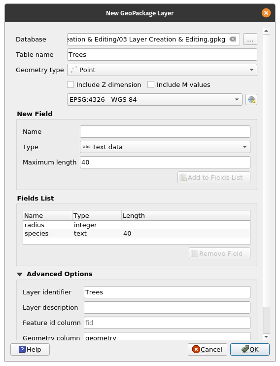

إذا طُلبَ منك أن الملف موجود بالفعل، حدد إضافة طبقة جديدة.


4. قم بتبديل التعديل على Trees بالنقر بزر الماوس الأيمن فوقه -> تبديل التعديل  right-clicking on it -> Toggle editing  أو النقر على   في شريط أدوات التحويل الرقمي Digitizing Toolbar.
5. حدد منطقة على صورة القمر الصناعي بحيث تتضمّن الأشجار.
6. مع تشغيل التعديل، قم بتمكين إضافة نقاط إلى طبقة الأشجار بالنقر فوق  (CTRL + .).
7. قم برقمنة الأشجار الفردية عن طريق النقر فوق موقعها وإضافة معلومات السمات. قم بتطبيق هذا  على أربعة أشجار. في هذا التمرين، يمكنك فقط تخمين المعلومات.


8. بعد إضافة النقاط، لا تنس حفظ تعديلاتك عن طريق نقر  على شريط أدوات التحويل الرقمي قبل إيقاف تشغيل التعديل.


 added]")

9. أضف طبقة افتراضية بالنقر فوق  في شريط أدوات مدير مصدر البيانات.
10. اضبط اسم الطبقة لـ Tree Canopy. قم باستيراد الأشجار. أضف الاستعلام التالي: 

```
select fid, buffer(geometry, radius), species from Trees
```

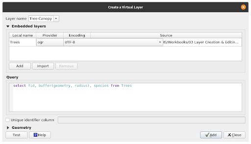

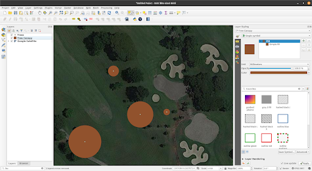

أضف نقطة جديدة ثم قم بتحديث عرض الخريطة (عن طريق تكبير أو تحريك لوحة الخريطة) لرؤية التحديث في الطبقة الافتراضية. ماذا لاحظت؟


<h3>
للتدرب على مهاراتك الجديدة ، جرّب الأشياء التالية:
</h3>

<h4><strong>
تحميل البيانات النقطية والمتجهات الموجودة على الإنترنت
</strong></h4>

بصرف النظر عن الملفات الثنائية المحلية local binary files (المتجهات والنقطية) ، يمكن لـ QGIS أيضًا تحميل المتجهات والنقطية الموجودة على الإنترنت. استخدم مدير مصدر البيانات لتحميل البيانات من عنوان URL التالي:

[https://raw.githubusercontent.com/benhur07b/stomp-covid19-data/master/spatial/stompcovidph_regions.geojson](https://raw.githubusercontent.com/benhur07b/stomp-covid19-data/master/spatial/stompcovidph_regions.geojson)


<h4><strong>
تحميل جداول بيانات في QGIS باستخدام الملحق Spreadsheet Layers
</strong></h4>

قم بتثبيت ملحق Spreadsheet Layers وحاول تحميل جدول بيانات في QGIS. يقبل البرنامج المساعد صيغ

*    Open Document Standard .ods
*    ملفات Microsoft Excel .xls ، .xlsx.

يمكنك قراءة المزيد هنا: [https://bnhr.xyz/2018/07/27/plugin-fridays-spreadsheet-layers-plugin.html](https://bnhr.xyz/2018/07/27/plugin-fridays-spreadsheet-layers-plugin.html)


<h4><strong>
نصائح
</strong></h4>

إذا احتجت في أي وقت إلى طبقة خريطة العالم، فحاول كتابة العالم world في شريط الإحداثيات Coordinate bar في شريط الحالة Status bar. ماذا يحدث؟ هذه مجرد واحدة من المفاجآت الموجود في QGIS عند كتابة كلمات معينة في شريط الإحداثيات.

</div>
