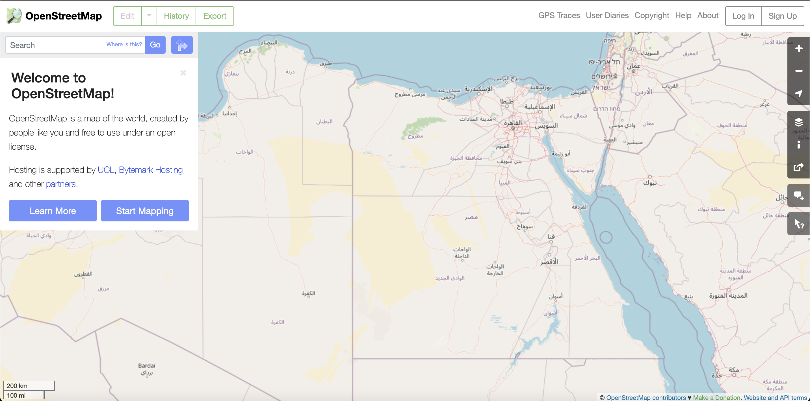
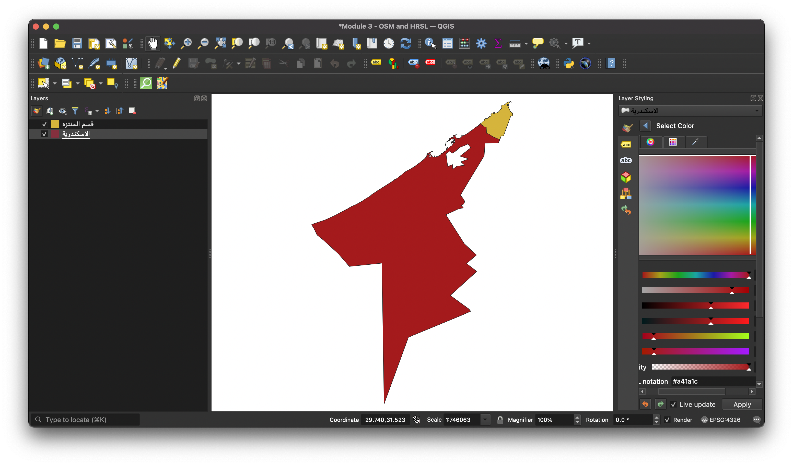
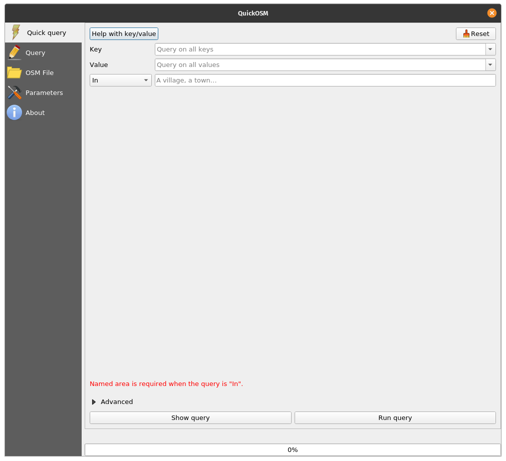
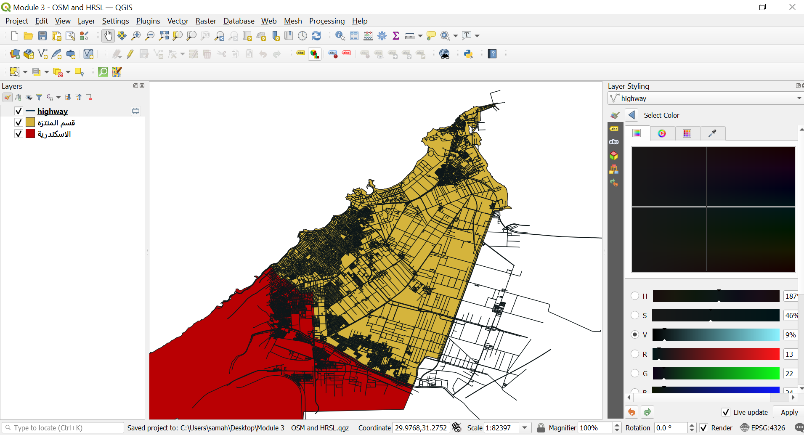
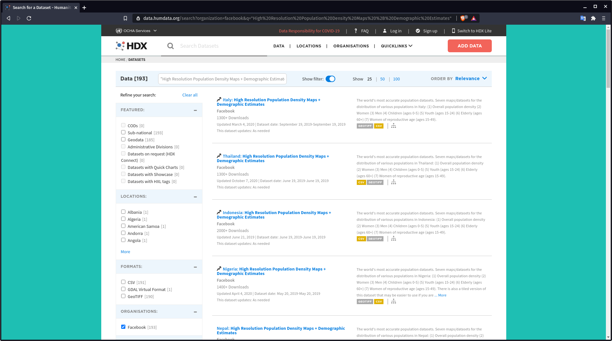
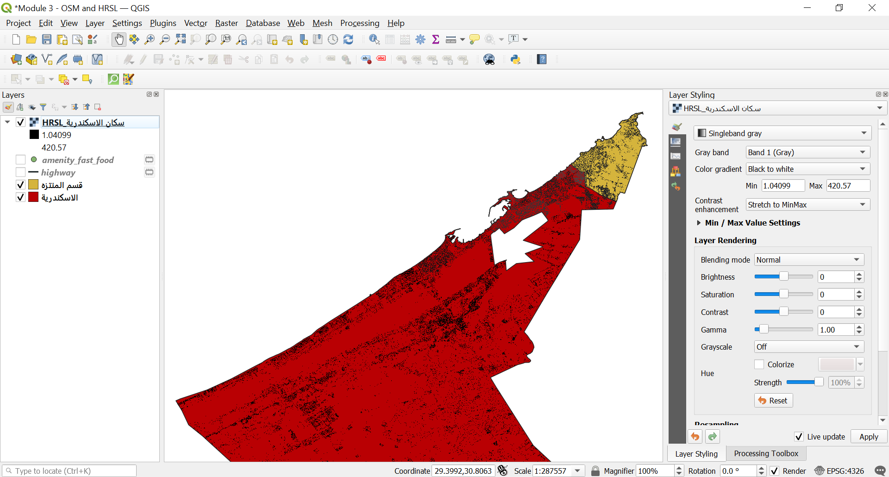
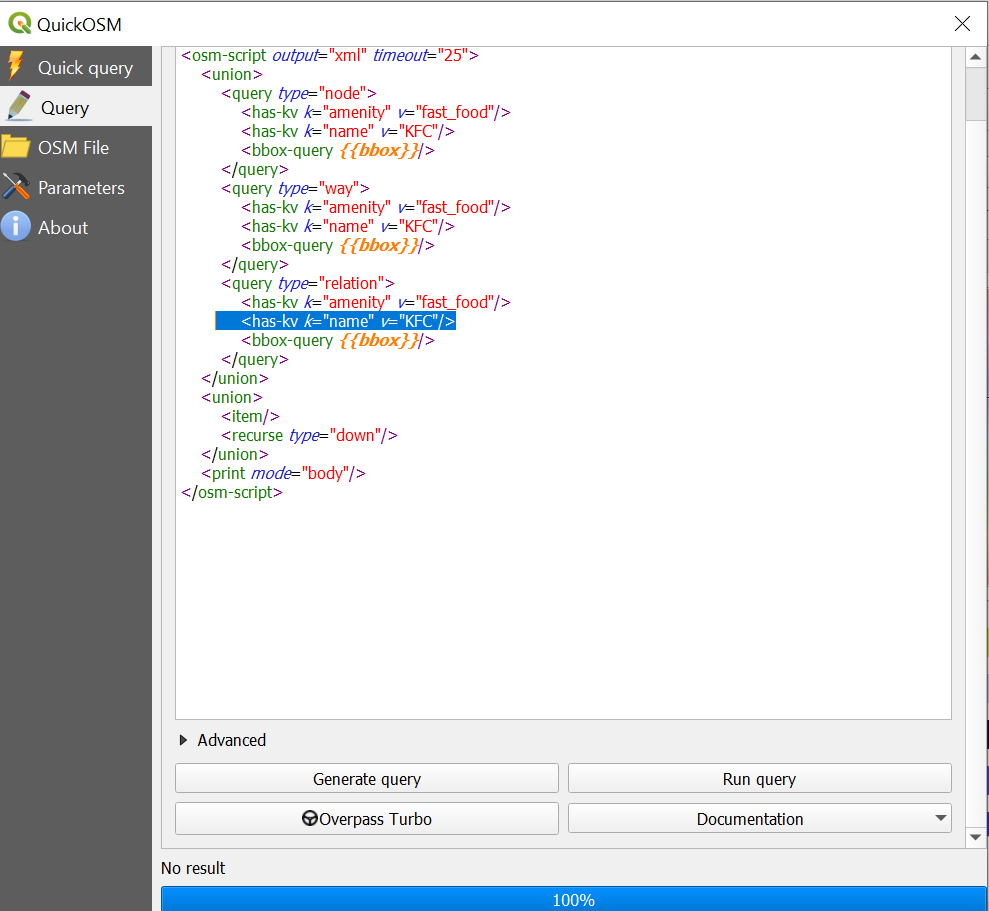
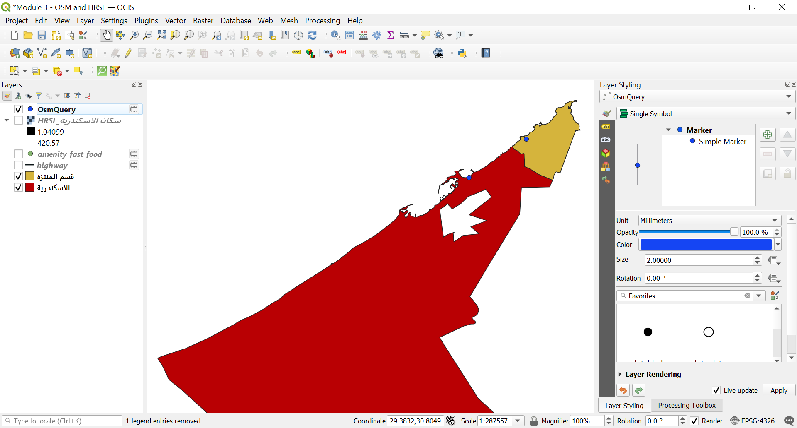

<h1>
الوحدة 3 - خريطة الشارع المفتوحة وطبقة التسوية عالية الدقة
</h1>

المؤلف: بن هور- Ben Hur

<h2>
مقدمة تعليمية
</h2>

ستقدم هذه الوحدة خريطة الشارع المفتوحة (OpenStreetMap OSM) وطبقة التسوية عالية الدقة (HRSL High Resolution Settlement Layer). مع نهاية هذه الوحدة، يجب أن يكون المتعلم قد اكتسب المفاهيم التالية:

*   مبادئ خريطة الشارع المفتوحة 
*   بيانات خريطة الشارع المفتوحة وحالات الاستخدام
*   بيانات طبقة التسوية عالية الدقة وحالات الاستخدام

يجب أيضاً أن يكون المتعلم قد اكتسب المفاهيم التالية:

*   تحميل بيانات OSM كنواقل وبلاط في QGIS
*   تحميل البيانات النقطية HRSL في QGIS

<h2>
الأدوات والموارد المطلوبة
</h2>

الأدوات والموارد المطلوبة لهذه الوحدة هي:

*    حاسوب
*   اتصال بالإنترنت
*   QGIS 3.16 مثبّت على الحاسوب ([https://qgis.org/en/site/forusers/download.html](https://qgis.org/en/site/forusers/download.html))
*   طبقات المتّجه الاسكندرية و قسم المنتزه (داخل [module3.gpkg](https://drive.google.com/file/d/1TNofhPLBmck2k77E-0drfrlRy8dAKZ8X/view?usp=sharing)). يجدر الاشارة ان ملف الاسكندرية يضم الحدود الادارية.

<h2>
مصادر إضافية
</h2>

*    المشروع التعاوني لإنشاء خريطة مجانية قابلة للتعديل للعالم خريطة الشارع المفتوحة [https://www.openstreetmap.org](https://www.openstreetmap.org/)
*    ويكي خريطة الشارع المفتوحة [https://wiki.openstreetmap.org/](https://wiki.openstreetmap.org/)
*   دليل مستخدم [https://dev.overpass-api.de/overpass-doc/en/](https://dev.overpass-api.de/overpass-doc/en/) Overpass API  
*   فيسبوك - طبقة تسوية عالية الدقة -  [High Resolution Settlement Layer (HRSL)](https://research.fb.com/downloads/high-resolution-settlement-layer-hrsl/)
*   CEISIN - طبقة التسوية عالية الدقة - [https://ciesin.columbia.edu/data/hrsl/](https://ciesin.columbia.edu/data/hrsl/)
*   تبادل البيانات الإنسانية HDX - طبقة التسوية عالية الدقة - [Humanitarian Data Exchange](https://data.humdata.org/search?organization=facebook&q=%22High%20Resolution%20Population%20Density%20Maps%20%2B%20Demographic%20Estimates%22)

<h2>
مقدمة موضوعية
</h2>

أصبحت الخرائط موجودة في كل مكان في حياتنا اليومية. يمكننا فقط سحب هواتفنا وفتح التطبيقات التي تستخدم الخرائط وبيانات الموقع. هناك تطبيقات نستخدمها لتوجيه أنفسنا وتحديد مواقعنا، للتنقل والانتقال من مكان إلى آخر، وتظهر الخرائط حتّى عندما نطلب الطعام من خدمة التوصيل المفضلة لدينا، وما إلى ذلك. فقد أصبحت الخرائط جزءًا لا يتجزأ من أنشطتنا اليومية لدرجة أننا نميل إلى نسيان أن هناك أماكن في العالم لا تزال غير محددة أو غير موجودة في الخرائط الرقمية التي نستخدمها.

<h2>
تفصيل المفاهيم
</h2>

إن انتشار الخرائط في كل مكان في حياتنا هو نتيجة ثانوية للكم الهائل من المواقع والبيانات المكانية التي نجمعها. إن الفرص والإمكانات لإنشاء شيء جيد من البيانات الجغرافية المكانية المتاحة لنا رائعة ولكن هذا لن يكون ممكنًا إلا إذا كانت مجموعات البيانات الجغرافية المكانية مجانية ومفتوحة المصدر.

<h2>
المحتوى الرّئيسى
</h2>

<h3>
عنوان المرحلة 1: بيانات خريطة الشارع المفتوحة ((OpenStreetMap (OSM)
</h3>

<h4><strong>
ما هي خريطة الشارع المفتوحة ؟
</strong></h4>

خريطة الشارع المفتوحة OpenStreetMap (OSM) <a href="https://www.openstreetmap.org">https://www.openstreetmap.org</a> هي خريطة مجانية قابلة للتحرير للعالم بأسره، تم إنشاؤها من قبل متطوعين من جميع أنحاء العالم وتم إصدارها بترخيص محتوى مفتوح. فهي مشروع ينشئ ويوزع بيانات جغرافية مجانية للعالم - خريطة للعالم من قبل الناس وللناس. إذا لاحظت أنّ شيئاً ما مفقود في OSM، فأنت حرّ في إضافته. وإذا وجدت خطأ ما في OSM، فأنت حرّ في تصحيحه. OSM هي سلعة رقمية مشتركة تقوم بتضخيم قيمة المعلومات المضافة إليها بشكل كبير.

Figure 1. OpenStreetMap خريطة الشارع المفتوحة

للمزيد من المعلومات حول سبب وجود OpenStreetMap وأهميتها ، يمكنك زيارة الرابط التالي: <a href="https://wiki.openstreetmap.org/wiki/FAQ#Why_OpenStreetMap.3F">https://wiki.openstreetmap.org/wiki/FAQ#Why_OpenStreetMap.3F</a>

يمكنك أيضًا زيارة الرابط التالي: <a href="https://wiki.openstreetmap.org/wiki/About_OpenStreetMap">https://wiki.openstreetmap.org/wiki/About_OpenStreetMap</a>

وفقًا لـ OpenStreetMap، فهي "بيانات مفتوحة ، ومرخصة بموجب ترخيص Open Data Commons Open Database ODbL)  (<a href="https://opendatacommons.org/licenses/odbl">https://opendatacommons.org/licenses/odbl</a>) وذلك من قِبل مؤسسة (OpenStreetMap <a href="https://osmfoundation.org/">OSMF</a>) 

ووفقاً لهذا الترخيص فقد تمّ التصريح "أنّك" حرّ في نسخ بياناتنا وتوزيعها ونقلها وتكييفها، طالما أنك تنسب حساب OpenStreetMap والمساهمين فيه. إذا قمت بتغيير بياناتنا أو البناء عليها، فلا يجوز لك توزيع النتيجة إلا بموجب الترخيص نفسه". عند إنشاء خريطة تستخدم بيانات OSM، يجب أن تنسب "© OpenStreetMap المساهمون". يمكنك قراءة المزيد حول حقوق الطبع والنشر وخريطة OpenStreetMap هنا: <a href="https://www.openstreetmap.org/copyright">https://www.openstreetmap.org/copyright</a>

<h4><strong>
أين يتم استخدام OpenStreetMap؟
</strong></h4>

تتمثل إحدى أهم خصائص OpenStreetMap الأساسية في القدرة على جمع بيانات الخرائط وتحريرها ومشاركتها واستخدامها للعديد من الأغراض المختلفة. هذه هي الحرية التي يوفرها <a href="https://opendatacommons.org/licenses/odbl">ObDL</a>. نظرًا لأن OpenStreetMap تسمح للمستخدمين باستخدام بياناتها مع قيود قليلة جدًا، فهناك مجموعة متنوعة من التطبيقات والخدمات وحالات الاستخدام التي تم إنشاؤها أو بناؤها أو يمكن إنشاؤها باستخدام OpenStreetMap. يتم استخدام OpenStreetMap لإنشاء الخرائط وخدمات التوجيه والتعليم وحتى الأغراض الإنسانية.

في الواقع ، يوجد <a href="https://www.hotosm.org">HOT</a> أو فريق OpenStreetMap الإنساني وهو فريق دولي مكرّس للعمل الإنساني وتنمية المجتمع من خلال رسم الخرائط المفتوحة.

يمكن العثور على قائمة بالخدمات المستندة إلى OpenStreetMap على <a href="https://wiki.openstreetmap.org/wiki/List_of_OSM-based_services">https://wiki.openstreetmap.org/wiki/List_of_OSM-based_services</a>.

<h4><strong>
كيف يمكن استخدام OpenStreetMap في QGIS؟
</strong></h4>

يمكن استخدام بيانات OSM في QGIS بعدة طرق. الطريقة الأولى هي استخدام طبقات البلاط المشتقة من OSM كخرائط أساس. في الواقع، لدى QGIS اتصال بطبقة بلاط OpenStreetMap افتراضيًا. يمكنك العثور على هذه الطبقة المسماة "OpenStreetMap" ضمن قائمة XYZ Tiles في لوحة المتصفّح.

يمكنك إضافة مربعات أخرى مشتقة من OSM في QGIS مثل تلك الموجودة في قائمة مزودي النشرات Leaflet Providers list <a href="https://leaflet-extras.github.io/leaflet-providers/preview">https://leaflet-extras.github.io/leaflet-providers/preview</a>. توفر المربعات المشتقة من OSM للمستخدمين وصولاً مجانيًا ومفتوحًا إلى خريطة أساس محدّثة نظرًا لأن هذه المربعات يتم تحديثها بانتظام لتتوافق مع الحالة الحالية (مثل الميزات) لـ OSM.

يمكنك أيضًا تحميل الميزات من OSM كبيانات متّجه في QGIS وذلك عن طريق تنزيل بيانات OSM من مواقع مثل GEOFABRIK <a href="https://www.geofabrik.de/data/download.html">https://www.geofabrik.de/data/download.html</a>.

يمكن أيضًا تحميل بيانات إحدى ميزات OSM مباشرة في QGIS باستخدام البرنامج المساعد أو ملحق QuickOSM. يقوم هذا الملحق بالإستفادة من واجهة برمجة تطبيقات Overpass التي تتيح للمستخدمين تحديد مجموعة جزئية من بيانات OSM بسرعة وذلك باستخدام الاستعلامات <a href="https://wiki.openstreetmap.org/wiki/Overpass_API)">https://wiki.openstreetmap.org/wiki/Overpass_API</a>. وقد أصبح هذا ممكنًا لأن الميزات الموجودة في OSM <a href="https://wiki.openstreetmap.org/wiki/Mapfeatures">https://wiki.openstreetmap.org/wiki/Mapfeatures</a> يتم تمييزها باستخدام نظام وضع علامات مجاني free tagging system <a href="https://wiki.openstreetmap.org/wiki/Tags">https://wiki.openstreetmap.org/wiki/Tags</a> يسمح للخريطة بأن تتضمن عددًا غير محدود من السّمات لوصف كل ميزة. يمكن بعد ذلك استخدام هذه العلامات للاستعلام عن ميزات معينة بناءً على سماتها / علاماتها.

قد جرت العادة أن يقوم مجتمع OSM والمجتمعات المحليّة بالإتفاق على مجموعة مفاتيح وتركيبات قيم معينة مناسبة للعلامات الأكثر استخدامًا والتي تعمل كمعيار غير رسمي. وهذا يضمن لمستخدمي البيانات الاتساق في وضع العلامات للعناصر الأكثر شيوعاً مثل الطرقات والمباني وما إلى ذلك. ومع ذلك. يمكن للمستخدمين دائمًا إنشاء علامات جديدة لتحسين نمط الخريطة أو دعم التحليلات التي تعتمد على سمات أو علامات الميزات التي لم يتم تعيينها مسبقًا.

<h4><strong>
التمرين 1: تحميل بيانات OSM في QGIS باستخدام ملحق QuickOSM 
</strong></h4>

في هذا التمرين، سنقوم بتحميل بيانات شبكة الطّرق ومواقع سلاسل الوجبات السريعة من OSM التي يمكن العثور عليها في مقاطعة  الاسكندرية باستخدام البرنامج المساعد QuickOSM.

يعمل QuickOSM عن طريق الاستعلام عن العلامات (المفاتيح والقيم) للميزات في OSM. للمزيد من المعلومات حول كيفية استخدام المفتاح / القيمة في QuickOSM، يمكنك زيارة الرّابط التالي: <a href="https://wiki.openstreetmap.org/wiki/Mapfeatures">https://wiki.openstreetmap.org/wiki/Mapfeatures</a>.

1. قم بتحميل طبقات المتّجه الاسكندرية و قسم المنتزه الموجودة داخل الحزمة الجيولوجية للوحدة 3.

Figure 2.QGIS تحميل طبقات     

2. تأكد من تثبيت البرنامج المساعد QuickOSM وتنشيطه. يجب أن يظهر تحت **Vector ‣ QuickOSM** في شريط القائمة. إذا لم يكن كذلك، فقم بتثبيت الملحق وتنشيطه أولاً باستخدام مربع حوار إدارة الملحقات وتثبيتها.
3. افتح الملحق QuickOSM عبر الذّهاب إلى **Vector ‣ QuickOSM ‣ QuickOSM**. يجب أن يتم فتح مربع حوار بخمس علامات تبويب:

    1. استعلام سريع - Quick Query
        *   يسمح للمستخدم بإنشاء وتشغيل استعلام بسيط مع تركيبة مفتاح-قيمة واحدة لتحميل مجموعة جزئية من بيانات ميزة OSM والتي تلبي متطلبات الاستعلام.

    2. استعلام - Query 
        *   يسمح للمستخدم بتشغيل استعلامات معقدة باستخدام واجهة برمجة تطبيق API Overpass.
        *   يتضمن رابط لتطبيق الويب Overpass Turbo.

    3. ملف OSM:
        *   يسمح للمستخدم بتحميل البيانات من ملفات OSM الأولية (مثل .pbf).

    4. المعايير - Parameters:
        *   يسمح للمستخدم بتحديد واجهة برمجة تطبيق Overpass التي ستستخدم.

    5. حول - About:
        *   يظهر معلومات حول البرنامج المساعد أو الملحق.

Figure 3. QuickOSM ملحق

4. قم بتحميل جميع الطرق السريعة في نطاق طبقة قسم المنتزه.

*   Key - المفتاح: الطريق السريع
*   Value - القيمة: &lt;فارغة> (فارغ يعني الكل)
*   Layer Extent - مدى الطبقة : قسم المنتزه
*   Advanced - متقدم: 
    *   تحقق من العقدة Node، الطريقة Way، العلاقة Relation، الخطوط Lines، والـ Multiline strings  

Figure 4. قم بتحميل جميع الطرق السريعة في نطاق طبقة قسم المنتزه  

5. انقر على تشغيل الاستعلام. بموجب هذا الإستعلام نحن نطلب من QuickOSM الحصول على جميع الميزات الخطية all line أو المتعددة السلاسل multilinestring التي تم وضع علامة عليها باستخدام مفتاح الطريق السريع وتحميله في QGIS. عند انتهاء ملحق QuickOSM من تحميل الطبقة، يجب أن تبدو خريطتك كما يلي:

Figure 5.OSM بيانات الطريق السريع المحمّلة من 

6. لاحظ أن الطبقات التي تم تحميلها بواسطة QuickOSM هي طبقات مؤقتة. يجب عليك حفظها كملفات أو جعلها ثابتة إذا كنت بحاجة إلى استخدامها لاحقًا.
7. إذا كنت ترغب في رؤية إصدار استعلام تجاوز Overpass query من الاستعلام السريع الخاص بك، فانقر فوق إظهار الاستعلام Show query وسيفتح الاستعلام في علامة التبويب الاستعلام. يمكنك بعد ذلك تحرير استعلامك لجعله أكثر تعقيدًا.

Figure 6. الخاص بالاستعلام السريع لتحميل الطرق السريعة Overpass إصدار استعلام 

8. الآن، سنقوم بتحميل جميع مواقع مطاعم الوجبات السريعة في نطاق طبقة الاسكندرية. افتح الملحق QuickOSM وضع المعلّمات (tags) التالية في علامة تبويب الاستعلام السريع:

    6. Key - المفتاح: الراحة
    7. Value - القيمة: طعام سريع
    8. Layer Extent - مدى الطبقة: الاسكندرية
    9. Advanced - متقدم:
        *   تحقق من العقدة Node والطريقة Way والعلاقة Relation والنقاط Points

 tagged as fast_food in the Colombo_admin_boundary layer extent")

Figure 7: تحميل وسائل الراحة (النقاط) التي تم وضع علامة عليها على أنها طعام سريع في نطاق طبقة الاسكندرية 

9. يجب أن يبدو الناتج كما يلي:

Figure 8:OSM مواقع الوجبات السريعة المحملة من 

10. لاحظ أنه يتم تحميل حتى البيانات الموجودة خارج المضلّعات. هذا لأننا نستخدم مدى الطبقة كمربع إحاطة. إذا احتجنا فقط إلى الميزات الموجودة داخل المضلّع، فيمكننا تحديد هذه الميزات أو قصّها. ستتم مناقشة عملية كيفية القيام بذلك في الوحدات النمطية المستقبلية.

<h4><strong>
أسئلة الاختبار
</strong></h4>

1. صح أم خطأ:
    1. يمكن أن تحتوي الميزة في OpenStreetMap على علامة أو سمة واحدة فقط
    2. يمكنك فقط إضافة نقاط في OpenStreetMap
    3. لا يمكن استخدام OpenStreetMap إلا كخريطة على الإنترنت.

<h3>
عنوان المرحلة 2: بيانات طبقة التسوية عالية الدقة (HRSL)
</h3>

<h4><strong>
ما هي طبقة التسوية عالية الدقة (HRSL)؟
</strong></h4>

وفقًا لفيسبوك ولمركز شبكة معلومات علوم الأرض الدولية (CIESIN) في جامعة كولومبيا، توفّر طبقة التسوية عالية الدقة (HRSL) تقديرات لتوزيع السكان بدقة تبلغ ثانية قوسية (1 arc-second) (حوالي 30 مترًا)".

لقد تم تطوير شبكات السكان لـ 140 دولة ويمكن الوصول إليها من خلال تبادل البيانات الإنسانية Humanitarian Data Exchange (<a href="https://data.humdata.org/search?organization=facebook&q=%22High%20Resolution%20Population%20Density%20Maps%20%2B%20Demographic%20Estimates%22">https://data.humdata.org/search?organization=facebook&q=%22High%20Resolution%20Population%20Density%20Maps%20%2B%20Demographic%20Estimates%22</a>).

تستند التقديرات السكانية إلى بيانات التعداد وصور القمر الصناعي عالية الدقة (0.5) من DigitalGlobe. يتم تحديد المستوطنات والهياكل التي بناها الإنسان في الصّور من خلال تطبيق تقنيات الرؤية الحاسوبية computer vision techniques. ثم يتم استخدام هذه المواقع كبديل للأماكن التي يعيش فيها الناس. بعد ذلك، استخدم مركز شبكة معلومات علوم الأرض الدولي التخصيص النسبي لتوزيع بيانات السكان من بيانات التعداد إلى نطاقات المستوطنات.

في الدّورة الحالية لـ HRSL، تتوفر سبع خرائط / مجموعات بيانات لتوزيع المجموعات السكانية مختلفة:

1. الكثافة السكانية الإجمالية
2. النساء
3. الرجال
4. الأطفال (0-5)
5. الشباب (15-24)
6. كبار السن (60 سنة و ما فوق)
7. النساء في سن الإنجاب (15-49 سنة)

Figure 9:  HDX  على تبادل البيانات الإنسانية HRSL بيانات    

<h4><strong>
حالات استخدام HRSL
</strong></h4>

توفر الشبكات السكانية معلومات عالية الاستبانة والدقّة حول ترسيم المستوطنات في المناطق الحضرية والريفية وكذلك عدد الأشخاص الذين يعيشون فيها. هذه المعلومات مفيدة للعديد من مجالات البحث مثل الكوارث والاستجابة الإنسانية والتخطيط وتطوير البنية التحتية.

لقراءة المزيد عن HSRL ، يمكنك زيارة:

*   كيفية العمل مع بيانات الكثافة السكانية على Facebook - [http://www.statsmapsnpix.com/2021/01/how-to-work-with-facebook-population.html](http://www.statsmapsnpix.com/2021/01/how-to-work-with-facebook-population.html)
*    عَدَد السُّكان المفتوح والتحديات المفتوحة - [https://engineering.fb.com/2016/11/15/core-data/open-population-datasets-and-open-challenges/](https://engineering.fb.com/2016/11/15/core-data/open-population-datasets-and-open-challenges/)
*   ربط العالم مع بعضه البعض بخرائط أفضل - [https://engineering.fb.com/2016/02/21/core-data/connecting-the-world-with-better-maps/](https://engineering.fb.com/2016/02/21/core-data/connecting-the-world-with-better-maps/)
*   رسم خرائط لسكان العالم مبنى واحدًا في كل مرة - [https://arxiv.org/abs/1712.05839](https://arxiv.org/abs/1712.05839)

<h4><strong>
التمرين 2: تحميل بيانات HRSL في QGIS 
</strong></h4>

تأتي بيانات HRSL الموجودة على HDX بصيغة GeoTIFF (نقطي) و CSV (متّجه). CSV هي مواقع نقطية مع قيم السكان المرتبطة بها. بالنسبة لهذا التمرين، قد تم بالفعل إعداد مجموعة جزئية من البيانات الخاصة ببلدك ولكن يمكنك دائمًا تنزيل مجموعة البيانات الكاملة أو حتى مجموعات بيانات أخرى لتجربتها.

1. قم بتحميل ملف البيانات النقطية HRSL_سكان الاسكندرية.tif في QGIS.

Figure 10: في الإسكندرية ، مصر HRSL الـ         

2. تحقق من خصائص الطبقة.
3. يمكنك أيضًا تعديل رموز وأسلوب البيانات النقطية (ستتم مناقشتها في وحدة مستقبلية)

<h4><strong>
أسئلة الاختبار
</strong></h4>

1. ما هي مجموعات البيانات التي تم استخدامها للحصول على مواقع المستوطنات وتخصيص السكان لهذه المستوطنات؟
2. كيف حصل HRSL على مواقع المستوطنات؟
3. كيف تم تخصيص السكان في منطقة ما للمستوطنات؟

<h3>
إذا كنت تريد أن تعرف المزيد:
</h3>

<h4><strong>
استخدام Overpass API لإنشاء استعلام في OSM
</strong></h4>

الـ  <a href="https://wiki.openstreetmap.org/wiki/Overpass_API">Overpass API</a>، المعروفة سابقًا باسم OSM Server Side Scripting ، أو OSM3S قبل عام 2011، هي واجهة برمجة تطبيقات للقراءة فقط تقدم أجزاء مخصصة ومحددة من بيانات خريطة OSM. على عكس واجهة برمجة التطبيقات الرئيسية التي تم تحسينها للتحرير، فقد تم تحسين Overpass API لمساعدة مستهلكي البيانات للحصول على مجموعة جزئية صغيرة من حوالي 10 ملايين عنصر في OpenStreetMap. يمكن تحديد هذه المجموعات الجزئية من خلال معايير البحث مثل الموقع أو نوع العناصر أو خصائص العلامات أو التقارب أو مجموعات منها. تعمل واجهة برمجة تطبيقات Overpass كخلفية للخدمات الأخرى المستندة إلى OSM مثل QuickOSM plugin.

يتيح لك استخدام استعلام Overpass إنشاء تحديد ميزات أكثر تعقيدًا في QuickOSM. على سبيل المثال، لنقم بتحميل جميع الوجبات السريعة مرة أخرى داخل نطاق الاسكندرية ولكن هذه المرة دعنا نحصل على فروع KFC. إذا نظرت إلى جدول البيانات الخاص بطبقة الوجبات السريعة، ستلاحظ أنها تحتوي على حقل ** name **. تتوافق الحقول الموجودة في جدول السّمات للبيانات المحمّلة من OSM مع مفاتيح العلامات، لذلك إذا أردنا تحديد جميع فروع KFC للوجبات السريعة، فنحن بحاجة إلى إضافة عامل تصفية يقوم بتحديد ميزة ما إذا كانت تحتوي على "مفتاح: قيمة" المرتبطة باسم: KFC. يمكن إضافة هذا الـ filter بسهولة في واجهة برمجة تطبيقات Overpass.

1. افتح البرنامج المساعد QuickOSM وأدخل المعلّمات التي استخدمناها للاستعلام عن جميع الأطعمة السريعة.

استعلام سريع لتحميل جميع وسائل الراحة تم وضع علامة عليها كوجبات سريعة

2. انقر فوق إظهار الاستعلام.

Overpass لتحميل جميع وسائل الراحة تم وضع علامة عليها كوجبات سريعة

3. قم بتحرير الاستعلام وإضافة السطر التالي

&lt;has-kv k="name" v="KFC"/>

بعد كل سطر &lt;" /has-kv k = "amenity" v = "fast_food>.

استعلام Overpass لتحميل جميع وسائل الراحة التي تم وضع علامة عليها كوجبات سريعة واسمها KFC

4. انقر فوق تشغيل الاستعلام. يجب أن يؤدي هذا إلى تحميل وسائل الراحة التي تم وضع علامة عليها على أنها وجبات 
 سريعة بالاسم KFC. سيكون اسم الطبقة هو OsmQuery.

وسائل الراحة التي تم وضع علامة عليها كوجبات سريعة تحمل اسم KFC من OSM

5. جربه مع سلسلات الوجبات السريعة الأخرى.

يمكنك أيضًا اختبار وإنشاء استعلامات Overpass في Overpass turbo <a href="https://wiki.openstreetmap.org/wiki/Overpass_turbo">https://wiki.openstreetmap.org/wiki/Overpass_turbo</a> وهي أداة للتنقيب عن البيانات data mining tool على شبكة الإنترنت لـ OpenStreetMap.

<h3>
للتدرب على مهاراتك الجديدة ، جرّب الأشياء التالية:
</h3>

<h4><strong>
قم بتحميل المزيد من الميزات من OSM باستخدام الملحق QuickOSM
</strong></h4>

حاول تحميل ميزات أخرى (نقاط وخطوط ومضلعات) مثل المستشفيات والمدارس وما إلى ذلك باستخدام المكون الإضافي QuickOSM.

<h4><strong>
نصائح
</strong></h4>

إذا لم تتمكن من العثور على العنصر الذي تريده أو تحتاجه في OpenStreetMap، فيمكنك دائمًا إضافة أو تعديل الميزات على الخريطة نفسها. اشترك على <a href="https://www.openstreetmap.org">https://www.openstreetmap.org</a> وابدأ في المساهمة!

