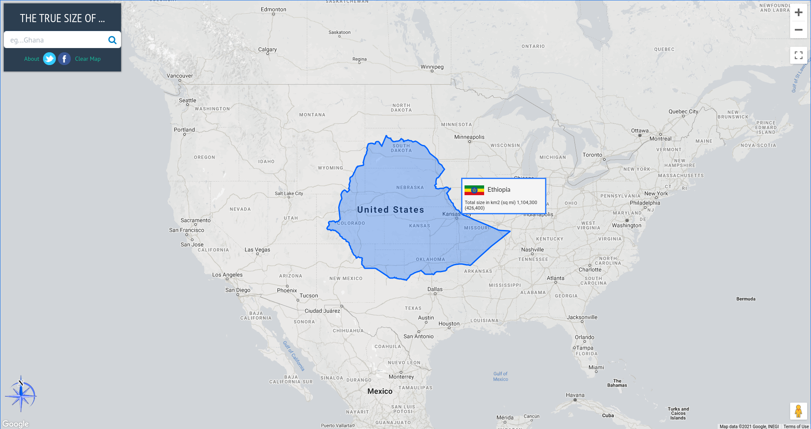
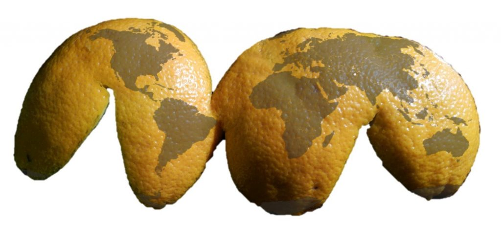
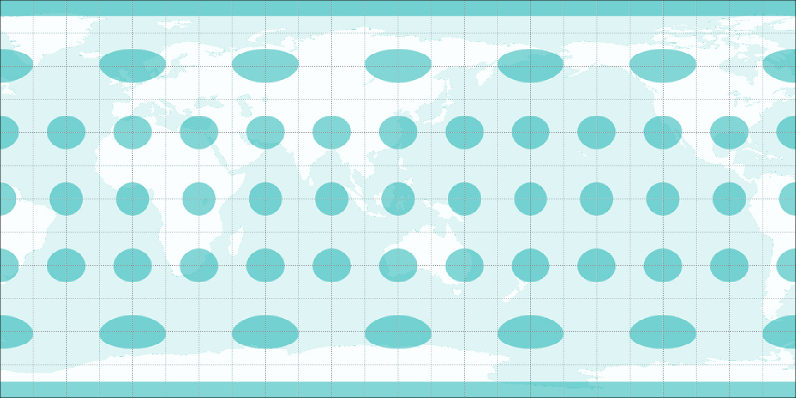
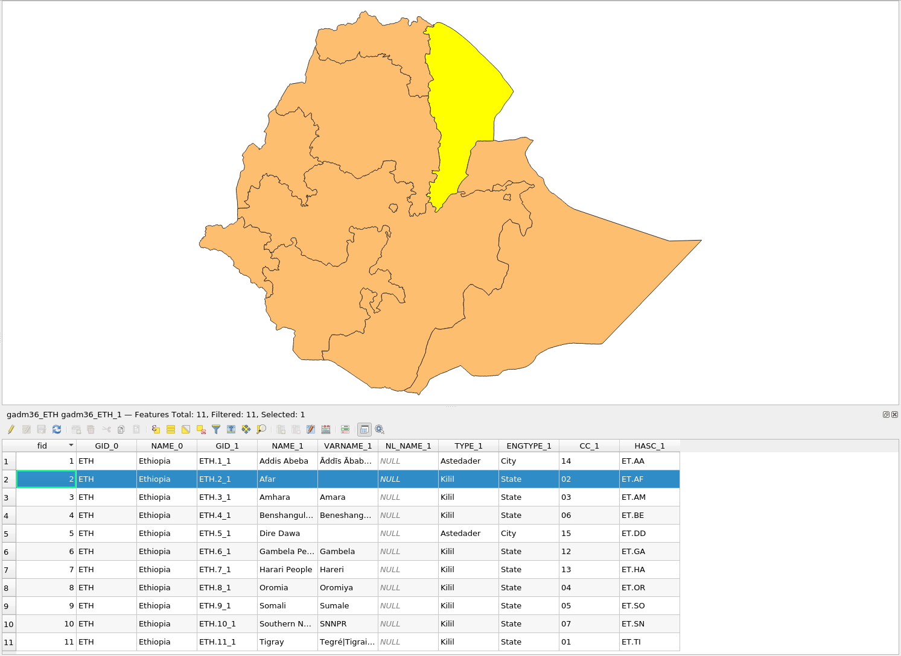

# ሞጁል 0 - ለ GIS ጽንሰ ሀሳቦች ቀላል መግቢያ

**ፀሃፊ፡-**: ቤን ሁር

## ትምህርታዊ መግቢያ

ይህ ሞጁል ከጂኦግራፊያዊ የመረጃ ስርአቶች (GIS) ጋር ለመስራት አስፈላጊ ስለሆኑ ጂኦግራፊያዊ ጽንሰ ሀሳቦች ቀላል መግቢያ ሆኖ ያገለግላል። በዚህ ሞጁል መጨረሻ፣ አንባቢዎች የሚከተሉትን ጽንሰ ሀሳቦች መረዳት አለባቸው:

*   የካርታ ትወራዎች
*   የመጋጠሚያ ማጣቀሻ ስርአቶች
*   የቦታ አቀማመጥ ውሂብ ቅርጸቶች (ምሳሌ ቬክተሮች እና ራስተሮች)
*   የ GIS ክፍሎች እና ባህርያት
*   የ GIS ጥቅሞች
*   የ GIS ምሳሌዎች እና ሌሎች የጂኦስፓሻል መተግበሪያዎች

በተጨማሪም ይህ ሞጁል የFree and Open Source Software (FOSS) እና የFree and Open Source Software for Geospatial (FOSS4G) መተግበሪያዎችን ቁልፍ ጽንሰ ሀሳቦች ያስተዋውቃል።

## የሚያስፈልጉ መሳሪያዎች እና ገብአቶች

ለዚህ ሞጁል የሚያስፈልጉ መሳሪያዎች እና ግብአቶች:-

*   የሚሰራ ኮምፒተር
*   የበይነመረብ ግንኙነት

## ቅድመ ሁኔታዎች

*   የኮምፒተር አጠቃቀም መሰረታዊ እውቀት

## ተጨማሪ ግብአቶች

* የGIS ረጋ ያለ መግቢያ ፡- [https://docs.qgis.org/3.16/en/docs/gentle_gis_introduction/index.html](https://docs.qgis.org/3.16/en/docs/gentle_gis_introduction/index.html)
*  QGIS የተጠቃሚ መመሪያ ፡- [https://docs.qgis.org/3.16/en/docs/user_manual/](https://docs.qgis.org/3.16/en/docs/user_manual/)
* QGIS የስልጠና መመሪያ ፡- [https://docs.qgis.org/3.16/en/docs/training_manual/index.html](https://docs.qgis.org/3.16/en/docs/training_manual/index.html)
* QGIS ድረገጽ ፡- [https://qgis.org/en/site/](https://qgis.org/en/site/)
* OSGeo ድረገጽ ፡- [https://www.osgeo.org/](https://www.osgeo.org/)
* OSGeoLive ድረገጽ ፡- [https://live.osgeo.org/en/index.html](https://live.osgeo.org/en/index.html)
* ነጻ ሶፍትዌር ምንድን ነው? ፡- [https://www.gnu.org/philosophy/free-sw.en.html](https://www.gnu.org/philosophy/free-sw.en.html)
* የክፍት ምንጭ ትርጉም ፡- [https://opensource.org/osd](https://opensource.org/osd)

## የጭብጥ መግቢያ

እስኪ በምሳሌ እንጀምር:-

“ሁሉም ካርታዎች ይዋሻሉ።” የሚለውን ሀረግ ሰምተው ይሆናል ወይም “በህይወትዎ ሁሉ የሚያውቁት የነበረው የዓለም ካርታ ስህተት ነው!” የሚለውን የማህበራዊ ሚዲያ ልጥፍ አይተዋል። በእውነቱ ካርታዎች እርስዎን ለመዋሸት አውቀው መርጠው ሳይሆን ካርታዎች ሙሉ እውነታውን ማሳየት ስለማይችሉ ነው። አንዱ ምሳሌ የሀገራት አንጻራዊ መጠኖች ናቸው።

የ([https://thetruesize.com/](https://thetruesize.com/)) እውነተኛ መጠን ጥሩ የድረገጽ ቦታ ማሳያ መተግበሪያ ሲሆን ብዙ ጊዜ በምንጠቀምባቸው ካርታዎች በአንዱ (የMercator ትወራን የሚጠቀመው) የሀገራት አንጻራዊ መጠኖች እንዴት የተዛባ እንደሆነ ያሳያል። በዚህ ሞጁል ውስጥ በደንብ ስለምንማረው የቦታ አቀማመጥ ውሂብ አይነቶች የተወሰኑ ምሳሌዎችን ያሳያል። የእርስዎን ሀገር መጠን ከሌሎች ጋር ለማወዳደር የድረገጽ መተግበሪያውን ለመጠቀም ይሞክሩ።

## የጽንሰ ሀሳቦች ትንታኔ

ለምንድነው ይሄ ዋና ጉዳይ የሆነው? በዚህ ሞጁል ውስጥ እንደሚማሩት የመሬትን 3-ስፍረታዊ ቅርጽ በዝርግ ወረቀት ላይ ለመግለጽ ከባድ ነው። ይህን ለማድረግ በመሬት ሶስት-ስፍረታዊ ገጽ ላይ ያሉ ነጥቦችን ወደ ዝርግ ገጽ ለመተወር ካርቶግራፈሮች የካርታ ትወራ የሚባለውን ይጠቀማሉ። ነገር ግን ይህንን በማድረግ መዛባት ተፈጥሯል። ይህ መዛባት ካርታ ላይ ነገሮች ላይ በቅርጽ፣ መጠን፣ አቅጣጫ እና ርቀቶች ላይ ሊሆን ይችላል። ሁሉም ካርታዎች ቢያንስ ከእነዚህ መዛባቶች አንዱ ይኖራቸዋል። በዚህ መዛባት ምክንያት፣ ካርታዎች ስለመሬት ሙሉ እውነታን ማሳየት አይችሉም።

እኛ በምንጠቀመው የድረገጽ መተግበሪያ መጠኑን የማይለውጠው ከጀርባ ያለው ካርታ (ግራጫ የሆነው) የራስተር ውሂብ ምሳሌ ነው። የራስተር ውሂብ ከፎቶግራፎች ጋር በተመሳሳይ ፒክሰልን መሰረት ያደረጉ የዓለም ውክልናዎች ናቸው። ይህ በእንዲህ እንዳለ ማንቀሳቀስ የምንችላቸው የሀገራት ቅርጾች የቬክተር ውሂብ ምሳሌ ናቸው። የቬክተር ውሂብ ከራስተር በተቃራኒ ነጥቦች፣ መስመሮች እና ባለብዙ ጎን ቅርጾች የመሳሰሉ ልዩ ነገሮችን በመጠቀም ዓለምን ይወካላሉ።

## ዋና ይዘት

### የደረጃ 1 ርዕስ:- ካርታዎች እና መጋጠሚያዎች

ዛሬ ሰዎች መሬትን ሲያስቡ በህዋ ላይ የሚንሳፈፍ ሰማያዊ፣ አረንጓዴ፣ ነጭ እና ቡናማ ክብ ክምር አድርገው ያስላሉ። መሬትን ለመመሰል ባህላዊው መንገድ ሉል የሆነው በዚህ ምክንያት ነው።
<table>
  <tr>
   <td>
        
         ምስል 0.1.፡- ብሉ ማርብል (The Blue Marble)  (<a href="https://commons.wikimedia.org/wiki/Earth#/media/File:The_Blue_Marble.jpg">https://commons.wikimedia.org/wiki/Earth#/media/File:The_Blue_Marble.jpg</a>)
   </td>
   <td>
          
        ምስል 0.2.፡- de l'Isle ሉል (1765)  (<a href="https://commons.wikimedia.org/wiki/Globe#/media/File:3quarter_globe.jpg">https://commons.wikimedia.org/wiki/Globe#/media/File:3quarter_globe.jpg</a>)
   </td>
  </tr>
</table>

ነገር ግን ሉል የመሬትን አብዛኛው ባህርያት መያዝ ቢችልም ሁለት ችግሮች አሉት፦

*   ሉሎች የማይመቹ እና ይዞ ለመንቀሳቀስ የሚያስቸግሩ ናቸው።
*   ሉሎችን መጠቀም የሚቻለው በትንሽ ልኬቶች (ምሳሌ፦ የሀገራትን መገኛ፣ የከተማዎችን አንጻራዊ አቀማመጥ ለመፈለግ፣ ወዘተ…) ብቻ ነው። ትልቅ ልኬቶች እና ደቃቅ ዝርዝሮችን ለሚፈልጉ ተግባራት (ምሳሌ፦ የከተማ አሰሳ) ጥቅም የላቸውም።

እዚህ ጋር ካርታዎች ይመጣሉ። ካርታዎች እነዚህ የሉልን ሁለት ችግሮች መሬትን በዝርግ ገጽ በመወከል ያስተካክላሉ። ይህንን በማድረግ ካርታዎች ተንቀሳቃሽ እና ለብዙ ጥቅሞች ተስማሚ ሆነዋል። ይህንን ካልን፣ ካርታዎችም የራሳቸው ችግር አላቸው። ባላ ሶስት-ስፍረታዊ ነገርን (ሉል) ወደ ሁለት-ስፍረታዊ (ካርታ) በመቀየር ሂደት ውስጥ፣ አንድ ካርታ የመሬትን የተለያዩ ባህርያት (ምሳሌ፦ ቅርጾች፣ ስፋቶች፣ አቅጣጫዎች) አሟልቶ ለመያዝ የማይቻል ስለሆነ መዛባቶች ይኖራሉ።

#### የካርታ ትወራዎች

የካርታ ትወራ ካርታን ለመፍጠር የመሬትን (ወይም የሉል) ገጽ ወደ ጠፍጣፋ ለመቀየር ጥቅም ላይ ይውላል። ይህ የመለወጥ ሂደት መዛባትን ያመጣል።

መሬትን እንደ ቡርትካን ማሰብ ይችላሉ። ቆዳውን ከላጡት፣ ዘርግተው ማስቀመጥ ይችላሉ ነገር ግን ፍጹማዊ ጠፍጣፋ ማድረግ አይችሉም። ሁልጊዜ የሚከተሉት ጉዳዮች ያጋጥምዎታል:-

*   **መሸለት (Shearing)** - ቆዳውን (ወይም ገጹን) በአንድ ወይም በሌላ አቅጣጫ መለጠጥ
*   **መቅደድ (Tearing)** - ቆዳውን (ወይም ገጹን) መቅደድ ወይም መለያየት
*   **መጭመቅ (Compressing)** - ቆዳውን (ወይም ገጹን) ማሳጠር ወይም ማሳነስ

በእነዚህ ጉዳዮች ምክንያት፣ ሁሉም ካርታ በሚከተሉት አንድ ወይም ብዙ ባህርያት ውስጥ መዛባት ይኖረዋል:

*   **ቅርጽ**
*   **ስፋት**
*   **ርቀት**
*   **አቅጣጫ**

ጊዜ አይደለም። እንደ አማራጭ ለሁሉም ባህርያት መዛባቶች የሚመጣጠኑበት እና የሚቀነሱበትን ማመዛዘን ይችላሉ። ይህ በራሳቸው በባህርያቱ ተፈጥሮ ምክንያት ነው።

ቅርጽ እና ስፋት የመሳሰሉ ዋና ባህርያት ተናጠል ናቸው እና በአንድ ጊዜ ሁለቱንም መጠበቅ አይቻልም። ይህ በእንዲህ እንዳለ ርቅት እና አቅጣጫ የመሳሰሉ ጥቃቅን ባህርያት በካርታው ሁሉም ቦታ ላይ ትክክል ሊሆኑ አይችሉም።

የምንጠቀመውን የካርታ ትወራ ስንመርጥ የካርታውን አላማ ከግምት ውስጥ ማስገባት አስፈላጊ ነው። ለምሳሌ ስፋትን መሰረት ያደረገ ትንተና መስራት ከፈለጉ ስፋትን የሚጠብቅ የካርታ ትወራ መጠቀም የተሻለ ነው።

ብዙ አይነት የካርታ ትወራዎች ክፍፍል አሉ። የመጀመሪያው **የሚጠብቁትን ባህሪ/ያት** መሰረት በማድረግ ነው።

*   **ኮንፎርማል (Conformal)** ወይም **ኦርቶሞርፊክ (Orthomorphic)** የካርታ ትወራዎች ቅርጽን ወይም የማእዘን ተመሳሳይነትን የሚጠብቁ ናቸው። እነዚህ ብዙ ጊዜ ለአሰሳ ወይም ለአየር ሁኔታ ትንበያ አላማዎች ጥቅም ላይ የሚውሉ ናቸው። ቅርጾች ይጠበቃሉ ነገር ግን ስፋቶች ይዛባሉ። ስፋቱ ትልቅ ሲሆን፣ መዛባቱም ትልቅ ይሆናል።
*   **እኩል-ስፋት (Equal-area)** ወይም **ኦውታሊክ (Authalic)** የካርታ ትወራዎች ደግሞ ካርታ ላይ ያሉ ነገሮችን ክፋይ ወይም አንጻራዊ ስፋቶች የሚጠብቁ ናቸው። በዚህ የካርታ ትወራ አይነት በካርታ የሚቀመጠው ስፋት ትልቅ ሲሆን በጣም ትክክል ይሆናል።
*   **እኩል-ርቀት (Equidistant)** የካርታ ትወራዎች ካርታው ላይ ካሉ አንድ ወይም ሁለት ነጥቦች የሚነሱ መስመሮችን ርቀት ይጠብቃል ወይም በአንድ ወይም ሁለት መስመሮች ላይ ትክክለኛ ልኬት ያላቸው ናቸው።
*   **አዚሙታል (Azimuthal)** የካርታ ትወራዎች ካርታው ላይ ካሉ አንድ ወይም ሁለት ነጥቦች አቅጣጫ ይጠብቃል። እነዚህ በወደቦች መካከል የአውሮፕላን እና የመርከቦችን የጉዞ መስመር በካርታ ለማስቀመጥ ይጠቅማሉ።

አንድ የካርታ ትወራ ከአንድ በላይ ባህሪን መጠበቅ ይችላል (ምሳሌ፦ ካርታው ላይ ካሉ አንድ ወይም ሁለት ነጥቦች አቅጣጫ እና ርቀቶችን የሚጠብቁ አዚሙታል እኩል-ርቀት የሆኑ ትወራዎች) ነገር ግን ከታች ባለው ሰንጠረዥ እንደሚታየው ሁሉንም መጠበቅ አይቻልም።

<table>
  <tr>
   <td>
   </td>
   <td><strong>ኮንፎርማል</strong>
   </td>
   <td><strong>እኩል-ስፋት</strong>
   </td>
   <td><strong>እኩል-ርቀት</strong>
   </td>
   <td><strong>አዚሙታል</strong>
   </td>
  </tr>
  <tr>
   <td>

<strong>ኮንፎርማል</strong>

   </td>
   <td>-
   </td>
   <td>አይ
   </td>
   <td>አይ
   </td>
   <td>አዎ
   </td>
  </tr>
  <tr>
   <td>

<strong>እኩል-ስፋት</strong>

   </td>
   <td>አይ
   </td>
   <td>-
   </td>
   <td>አይ
   </td>
   <td>አዎ
   </td>
  </tr>
  <tr>
   <td>

<strong>እኩል-ርቀት</strong>

   </td>
   <td>አይ
   </td>
   <td>አይ
   </td>
   <td>-
   </td>
   <td>አዎ
   </td>
  </tr>
  <tr>
   <td>

<strong>አዚሙታል</strong>

   </td>
   <td>አዎ
   </td>
   <td>አዎ
   </td>
   <td>አዎ
   </td>
   <td>-
   </td>
  </tr>
</table>

ሰንጠረዥ:- ሁለት ባህርያት በአንድ ጊዜ በአንድ ካርታ መጠበቅ ይችላሉ?

የካርታን ባህርያት የማይጠብቅ ነገር ግን ካርታ ውስጥ ያሉ ሁሉንም መዛባቶች ለመቀነስ የሚሞክር ሌላ የካርታ ትወራዎች አለ። እነዚህ **ማመጣጠን (Compromise)** ወይም **አነስተኛ ስህተት (Minimum Error)** የካርታ ትወራዎች (ቅርጽ ወይም ስፋት የማይጠብቁ ካርታዎች አፊላክቲክ (Aphylactic)) ይባላሉ።

መዛባትን ለማሳየት እና ለመመልከት አንዱ መንገድ **ቲሶትስ ኢንዲካትሪክስ (Tissot’s indicatrix)** የሚባለውን በመጠቀም ነው። ይህ አመልካች አካባቢያዊ መዛባቶችን ክቦችን በመጠቀም እንዲሁም እነዚህ ክቦች ካርታው ላይ እንዴት እንደሚለወጡ በማሳየት ይገልጻል።

ምስል 0.3.፡- ኮንፎርማል የካርታ ትወራ ከራሱ ቲሶትስ ኢንዲካትሪክስ ጋር። ክቦች በካርታው ሁሉም ቦታ ላይ ክቦች ናቸው፡፡ ነገር ግን ክቦቹ ከምድር ወገብ ወደ ዋልታዎች ሲንቀሳቀሱ ስፋታቸው ይጨምራል።

ምስል 0.4.፡- እኩል-ስፋት የካርታ ትወራ ከቲሶትስ ኢንዲካትሪክስ ጋር። ክቦች የእንቁላል ቅርጽ ያላቸው ይሆናሉ፡፡ ነገር ግን ስፋታቸው ተመሳሳይ ነው።

ምስል 0.5.፡- እኩል-ርቀት የካርታ ትወራዎች ከቲሶትስ ኢንዲካትሪክስ ጋር። የክቦቹ ከፍታዎች እኩል እንደሆኑ ያስተውሉ ይህም ማለት በሚሪዲያኖች ላይ ያሉት ልኬቶች/ርቀቶች ይጠበቃሉ ማለት ነው።

ምስል 0.6.፡- አዚሙታል እኩል-ርቀት ትወራዎች ከቲሶትስ ኢንዲካትሪክስ ጋር። ሁሉም ክቦች ወደ ካርታው ማእከል እንደሚጠቁሙ እና የክቦቹ ከፍታ እኩል እንደሆነ ያስተውሉ።

የካርታ ትወራዎችን ለመከፋፈል ሌላኛው መንገድ ካርታውን ለመፍጠር ጥቅም ላይ በዋለው **መሰራት የሚችል ገጽ (developable surface)** ነው። አንድ ገጽ መሰራት የሚችል ነው የሚባለው መዛባቶች ሳይኖሩ ጠፍጣፋ መደረግ ሲቻል ነው። ብዙ ጊዜ ጥቅም ላይ የሚውሉት ገጾች:- ሲሊንደሮች (ምስል 0.7)፣ ኮኖች (ምስል 0.8) እና ጠፍጣፋ ገጾች (ምስል 0.9) ናቸው።

ምስል 0.7.፡- ሲሊንደሪካል ትወራዎች በሚሪዲያኖች መካከል ያለው ርቀት እኩል ሆኖ በዘጠና ዲግሪ የሚገናኙ ሚሪዲያኖች (ኬክሮስ) እና ትይዩ መስመሮች (ኬንትሮስ) አሏቸው።

ምስል 0.8.፡- ኮኒክ ትወራዎች ደግሞ ዋልታዎች ላይ ወዳለ አንድ ነጥብ የሚሄድ ቀጥ ያሉ ሚሪዲያኖች አሏቸው። ትይዩ መስመሮቹ ቅንፍ ናቸው።

ምስል 0.9.፡- ፕላናር ትወራዎች (ብዙ ጊዜ በአዚሙታል ትወራዎች ጥቅም ላይ የሚውሉት) ከኮኒክ ትወራዎች ጋር በተመሳሳይ ቀጥ ያሉ ሚሪዲያኖች አሏቸው ነገር ግን ትይዩ መስመሮቹ ቅንፍ ከመሆን ይልቅ ክቦች ናቸው።

ሉልን ወደ ካርታ ለመቀየር የሚጠቅሙ ለመቁጠር የሚያዳግቱ ሌሎች መሰራት የሚችሉ ገጾች አሉ። በሲዶ-ሲሊንደሪካል እና ሲዶ-ኮኒክ ትወራዎች ላይ እንዳሉት የተለመዱ ገጾች ልዩነት ሊኖር ይችላል ወይም አይኮሳሄድሮንን (ባለ 20 ገጽ ፖሊሄድሮን) እንደሚጠቀመው ዲማክሲዮን ካርታ ወይም ኦክታሄድሮንን (ባለ 8 ገጽ ፖሊሄድሮን) እንደሚጠቀመው የካሂል-ኪይስ ትወራ ልዩ እና በሙሉ የሚለያዩ ሊሆኑ ይችላሉ።

የካርታ ትወራ **በገጽታ (aspect)** (ምስል 0.10) መሰረት ወይም እንዴት መሰራት የሚችለው ገጽታ ሉል ላይ እንደሚቀመጥ መሰረት በማድረግ ሊከፋፈል ይችላል፦ መደበኛ አግድም ወይም ሰያፍ።

ምስል 0.10.፡- የካርታ ትወራ ገጽታዎች

#### የመጋጠሚያ ማጣቀሻ ስርአቶች (Coordinate Reference Systems)

**የመጋጠሚያ ማጣቀሻ ስርአት (CRS)** መጋጠሚያዎችን በመጠቀም በመሬት ገጽ ላይ የአንድን ነገር ቦታ ለመለየት ይጠቅማል። ለሁለት ሊከፈሉ ይችላሉ፦

*   **ጂኦግራፊያዊ የመጋጠሚያ ማጣቀሻ ስርአቶች (Geographic Coordinate Reference Systems)** uቦታን ለመጥቀስ የኬንትሮስ እና ኬክሮስ ዲግሪዎችን ይጠቀማሉ።
*   **የተተወረ የመጋጠሚያ ማጣቀሻ ስርአቶች (Projected Coordinate Reference Systems)** የምስራቃዊ እና ሰሜናዊ መስመራዊ አሀዶችን (ምሳሌ፦ ሜትሮች፣ ጫማዎች እና ኪሎ ሜትሮች) እንደ መጋጠሚያ ይጠቀማሉ።

የመጋጠሚያ ማጣቀሻ ስርአቶች እውቀት አስፈላጊ ነው ምክንያቱም ሁለት ካርታዎች (ወይም ሽፋኖች) ተመሳሳይ አካባቢ ቢያሳዩም እንኳን የሚጠቀሙት CRS የተለያየ ከሆነ ካርታዎቹ ላይ ያሉት የቦታዎቹ መጋጠሚያዎች ይለያያሉ።

**ይህን ምሳሌ ውሰዱ:-**  ካርታ A እና ካርታ B ተመሳሳይ ቦታ እና መጠን ያሳያሉ። በመሰረቱ ተመሳሳይ ካርታ ናቸው። ብቸኛው ልዩነት የሚጠቀሙት የመጋጠሚያ ማጣቀሻ ስርአት ነው። ካርታ A CRS Xን ይጠቀማል እና ካርታ B ደግሞ CRS Yን ይጠቀማል። ወደ መጋጠሚያ ነጥብ 1 ሄድን እንበል ይህ ካርታ A ላይ (10, 10) ይገኛል። መጋጠሚያ (10,10)ን ካርታ B ላይ ስንመለከት ካርታ B የተለየ CRS ስለሚጠቀም ነጥብ 1 በቦታው ላይገኝ ይችላል። ወይም የጋራ ማጣቀሻ በመጠቀም እርስ በእርስ ቢደርቧቸው በሁለቱ ካርታዎች ላይ ያሉት ባህርያት አይገጣጠሙም። በማንኛውም GIS ላይ የመጋጠሚያ ማጣቀሻ ስርአቶች እውቀት አስፈላጊ ነው።

ከ QGIS 3.X በፊት QGIS “OTF” ወይም “On-The-Fly Transformation” የሚባለውን የማስጀመር አማራጭ ነበረው። ይህ የተለየ CRS ያላቸው ሽፋኖች በካርታው ሸራ ላይ በተመሳሳይ CRS እንደሆኑ ያክል እንዲተወሩ ያደርጋል። ከQGIS 3.X ወዲህ ይህ አማራጭ የ QGIS ነባሪ ባህሪ ነው። QGIS ስራዎችን ለማካሄድ አውቶማቲክ በሆነ መንገድ ይሰራል። ይህ በጣም አስፈላጊ ነው ምክንያቱም ሽፋኖቹ በተመሳሳይ CRS ውስጥ ከሌሉ የቦታ መጠይቆች ውጤቶች እና እንደ የቦታ ውህዶች፣ ክሊፖች፣ ወዘተ… ያሉ ውጤቶች ሊቀንሱ ይችላሉ።

አንዳንድ የመጋጠሚያ ማጣቀሻ ስርዓቶች በEPSG ኮድ እንደተጠቀሱ ልብ ሊሉ ይችላሉ። ይህ ኮድ የሚያመለክተው በEPSG ጂኦዴቲክ ፓራሜትር ውሂብ ስብስብ ውስጥ ያለውን የCRS ኮድ ነው ይህም የጂኦዴቲክ ማጣቀሻዎች፣ የቦታ ማጣቀሻ ስርዓቶች፣ የምድር ኤሊፕስዮዶች፣ የመጋጠሚያ ለውጦች እና የተያያዙ የመለኪያ አሃዶች መዝገብ ነው። አብዛኛው GIS QGISን ጨምሮ የማጣቀሻ ስርዓቶችን ግምቶችን ለመለየት እና በእነዚህ ስርዓቶች መካከል ለውጦችን ለማከናወን የEPSG ኮድን ይመለከታል።

የተለመዱ የEPSG ኮዶች የሚከተሉትን ያካትታሉ፦

*   **EPSG:4326**  ፡- WGS 84 ኬክሮስ/ኬንትሮስ መጋጠሚያ ስርዓት በዓለም አቀፍ አቀማመጥ ስርዓት (Global Positioning System/GPS) እና በሌሎችም ጥቅም ላይ ይውላል።
*   **EPSG:3857**  ፡- የድር መርኬተር ትወራ እንደ OpenStreetMap እና የጉግል ካርታዎች በመሳሰሉ ድር ላይ በተመሰረቱ ብዙ የካርታ መሣሪያዎች ለእይታ ጥቅም ላይ ውሏል።
*   **EPSG:32636-32638** ፡- WGS 84 / ዓለም አቀፋዊ የአግድም መርኬተር (Universal Transverse Mercator/UTM) ዞኖች ከ 36N እስከ 38N። የ UTM ዞን ኢትዮጵያን ይሸፍናል
*   **EPSG:4201** - Adindan

#### **የፈተና ጥያቄዎች**

1. ለሚከተሉት የአጠቃቀም ጉዳዮች ምን ዓይነት የካርታ ትወራ የተሻለ ነው?
    1. የአጠቃላይ ዓላማ ካርታ ደስ የሚል መስሎ ሊታይ የሚገባው -- ***ስምምነት***
    2. በተለያዩ አካባቢዎች መካከል የአንድ-አሀድ አካባቢ ትንታኔን የሚያሳይ ካርታ -- ***እኩል-ስፋት ወይም አውታሊክ***
    3. ከተለያዩ አካባቢዎች የ10 ኪ.ሜ ቋት ዞን ንፅፅር የሚያሳይ ካርታ -- ***እኩል-ርቀት***

2. ለሚከተሉት የአጠቃቀም ጉዳዮች ምን ዓይነት (ጂኦግራፊያዊ ወይም የተተወረ) የመጋጠሚያ ማጣቀሻ ሥርዓት ጥሩ መጠቀሚያ የሆነው የቱ ነው?
    1. GPSን በመጠቀም የነጥቦችን መገኛ ማሳየት -- ***ጂኦግራፊያዊ የመጋጠሚያ ማጣቀሻ ስርዓት***
    2. በሁለት ነጥቦች መካከል ያለውን ርቀት ማስላት -- ***የተተወረ የመጋጠሚያ ማጣቀሻ ስርአት*** 

3. እውነት ወይም ሐሐሰትሰት - የሚከተሉትን የካርታ ባህሪዎች በአንድ ካርታ ውስጥ በአንድ ላይ ማቆየት ይቻላል::
    1. ስፋት እና ቅርፅ -- ******
    2. ርቀት እና አቅጣጫ -- ***እውነት***

### ደረጃ 2 ርዕስ:- የቦታ ውሂብ ዓይነቶች

በመሠረቱ የጂኦግራፊያዊ የመረጃ ስርዓት (GIS) በእውነተኛ ዓለም ያሉ ነገሮችን፣ መረጃዎችን እና እንደመሬት ድንበሮች፣ ወንዞች፣ መንገዶች፣ ሙቀት፣ ወዘተ… ያሉ ክስተቶችን መቅረጽ መቻል አለበት። በቦታ ውሂብ ሞዴሎች በኩል ይህንን ያደርጋል።

የቦታ ውሂብ ሞዴሎች በሁለት ተቀዳሚ አካላት የተዋቀሩ ሲሆኑ ሲደመሩ የሞዴል እውነታ ናቸው። እነዚህ አካላት፦

*   **የቦታ ገጽታዎች (ወይም ጂኦሜትሪ)**
*   **ባህሪዎች**

ሁለት ዋና የቦታ ውሂብ ሞዴሎች አሉ፦ **ራስተር** እና **ቬክተር።** ምንም እንኳን ማንኛውም የገሃዱ ዓለም ነገር በሁለቱም የውሂብ ሞዴሎች ሊወከል ቢችልም፣ አንድ የውሂብ ሞዴል የተወሰኑ የገሃዱ ዓለም  ነገሮችን ከሌላው በተሻለ መልኩ ለመወከል የተሻለ ነው።

#### የራስተር ውሂብ

የሙቀት መጨመርን የመሳሰሉ ቀጣይ እና ተከታታይ ክስተቶችን ለመወከል የራስተር ውሂብ በተሻለ ጥቅም ላይ ይውላል።

ራስተር እያንዳንዱ ሴል ወይም ፒክስል ጂኦግራፊያዊ አካባቢን በሚወክልበት በሴሎች ወይም ፒክስሎች አምዶች እና ረድፎች የተዋቀረ በእውነተኛ ዓለም ዕቃዎች ላይ የተመሠረተ ሴል-ተኮር ወይም ፒክሰል-ተኮር ነው (ፎቶግራፍ ወይም ምስል ያስቡ)። የሴል ዋጋ በተጠቀሰው ጂኦግራፊያዊ አካባቢ ውስጥ የአንድ አይነታ ዋጋን ይወክላል። የስፋቱ መጠን በራስተር የቦታ ጥራት ላይ የተመሰረተ ነው።

ራስተሮችን በሂሳብ አሠራሮች (ራስተር አልጀብራ) በኩል ማዋሃድ ስለሚችሉ ራስተሮች ለጣቢያ ተስማሚነት ሞዴሊንግ በጣም ጠቃሚ ናቸው።

ምስል 0.12.፡- ራስተር እኩል መጠን ያላቸውን ፒክሰሎች በረድፎች እና አምዶች ውስጥ ያቀፈ ነው።

ራስተር ፒክስል በአንድ ጊዜ አንድ እሴት ብቻ ሊይዝ ይችላል። ስለዚህ፣ ራስተር አንድን ነገር ወይም ክስተት በአንድ ጊዜ ብቻ ሞዴል ሊያደርግ ይችላል።

#### የቬክተር ውሂብ

የተለያዩ ነገሮችን ወይም አካላትን ለመወከል የቬክተር ውሂብ በተሻለ ጥቅም ላይ ይውላል።

የቬክተር ውሂብ መጀመሪያ በሦስት ዋና ዓይነቶች ይመጣል፦ ነጥብ፣ መስመር እና ፖሊጎን። ከራስተሮች የበለጠ ነጥቦችን፣ መስመሮችን እና ባለብዙ ጎኖችን በጥሩ ሁኔታ የተገለጹ መጋጠሚያዎችን በመጠቀም የተቀረጹ በመሆናቸው ከራስተር ይልቅ ትክክለኛ ናቸው፡፡ ስለሆነም ከራስተሮች ይልቅ የተለያዩ ነገሮችን በመወከል የተሻሉ ያደርጋቸዋል።

ትክክለኛ ርዝመቶች፣ አካባቢዎች እና ርቀቶች ሲያስፈልጉ ቬክተሮች በተለምዶ ጥቅም ላይ ይውላሉ። እንዲሁም የአውታረ መረብ ትንታኔን ሲያካሂዱ ጠቃሚ ናቸው (ለምሳሌ ከአንድ መንገድ ወደ ሌላው መንገድ ለመሄድ በጣም አጭር የሆነውን የመንገድ አቅጣጫ መፈለግ)።

ምስል 0.13.፡- ቬክተር ባህሪያትን ከተዛማጅ ባህሪያቸው ጋር አካቶ የያዘ ነው።

ከራስተር ፒክሴሎች ጋር ሲነፃፀር የቬክተር ባህሪ በአንድ ጊዜ ከአንድ በላይ እሴቶችን ሊይዝ ይችላል። እነዚህ እሴቶች በባህሪው ሰንጠረዥ ውስጥ እንደ አምድ ይቀመጣሉ። እያንዳንዱ ገጽታ በሌላ በኩል እንደ ረድፍ ይቀመጣል።

#### የፈተና ጥያቄዎች

1. የሚከተሉትን ነገሮች/ክስተቶች በተሻለ መልኩ መወከል ሚችለው ምን ዓይነት የውሂብ ዓይነት ነው፦
    1. መንገዶች
    2. ቤቶች
    3. የህዝብ ብዛት
    4. የጎርፍ አደጋ

### ደረጃ 3 ርዕስ: ጂኦግራፊያዊ የመረጃ ስርዓት (GIS)

ጂኦግራፊያዊ እና የቦታ መረጃ በ21ኛው ክፍለ ዘመን በሁሉም የመገኛ ደረጃዎች በሁሉም ቦታ ይገኛል። በረጅም ጊዜ ውስጥ ብዙ ጥሬ ውሂቦችን በትላልቅ አካባቢዎች ለመያዝ የሚያስችሉ ሳተላይቶች፣ አውሮፕላኖች እና የንግድ ድሮኖችም አሉን። በስልኮቻችን እና በመሳሪያዎቻችን ላይ ያሉ እንደ GPS እና ሌሎች መተግበሪያዎች የመሳሰሉ የአካባቢ መረጃዎችን የሚሰበስቡ እና የሚለቅሙ ዳሳሾችም አሉ።

ባለን ይህ ሁሉ መረጃ እንዴት በአግባቡ ማስተዳደር ፣ መተንተን እና እነሱን ማቅረብ እንዳለብን ማወቅ አስፈላጊ ነው። የጂኦግራፊያዊ የመረጃ ስርዓቶች ወይም በብዛት GIS በመባል የሚታወቁት እዚህ ጋር ይመጣሉ።

GIS ከጂኦግራፊያዊ (ወይም ከቦታ አቀማመጥ) መረጃ እና ከሚዛመደው የባህሪ (ቦታ-አልባ) መረጃ ጋር አብሮ ለመስራት የሚያስችለን መሳሪያ/ማዕቀፍ/ስርዓት ነው። በተለይም GIS የሚከተሉትን ማድረግ መቻል አለበት፦

* የቦታ አቀማመጥ **ውሂቦችን መሰብሰብ፣ ማከማቸት፣ ማረም** ወይም በአጠቃላይ **መቆጣጠር**።
* የቦታ ክፍሉን (ውሂቡ የሚገኝበትን) ወይም ባህሪው (የውሂቡን እሴት) በመጠቀም ውሂቡን **መተንተን**።
* ውሂቦችን እና ትንታኔዎችን በካርታዎች፣ በሠንጠረዦች፣ በእቅዶች እና በሌሎች እይታዎች አማካኝነት ትርጉም ያለው መረጃ **ማቅረብ**።

GIS የካርታ ስራ ብቻ አይደለም። ምንም እንኳን ካርታ መስራት በጣም አስፈላጊ እና በተለምዶ ከሚታወቁት የGIS ገጽታዎች አንዱ ቢሆንም አሁንም ከብዙዎቹ ክፍሎች እና ባህሪዎች ውስጥ አንዱ ነው። ዘመናዊውን የGIS ማዕቀፍ በሚከተለው የተዋቀረ ሆኖ ልንመለከተው እንችላለን፦

*   **ውሂብ** ፡- ይህ የመገኛ አካባቢ መረጃ ሊኖራቸውም ላይኖራቸውም የሚችለውን በGIS ጥቅም ላይ የሚውሉ የመረጃ ቅንጣቢዎችን ያመለክታል (ለምሳሌ የመደብር ስሞች እና የመደብር ሥፍራዎች)።
*   **ቴክኖሎጂ**  ፡- ይህ የGIS የሃርድዌር እና የሶፍትዌር አካላት የጂኦስፓሻል ሥራ ለመስራት የሚያገለግሉ የሶፍትዌር አፕሊኬሽኖች ያላቸው ማሽኖች፣ መሣሪያዎች እና ኮምፒውተሮችን ያጠቃልላል።
*   **ዘዴዎች እና ትንተና** ፡- እነዚህ ሁለቱንም የቦታ እና የቦታ ያልሆኑ (አይነታ) ጥያቄዎች እና ስሌቶች እንዲያከናውን የሚያስችለውን በGIS ውስጥ ያለውን የሳይንስ እና የሂሳብ ትምህርትን ያመልክታሉ።
*   **ምስላዊ** ፡- ምንም እንኳን ከዘዴዎች እና ትንታኔዎች ጋር ተመሳሳይ ቢሆንም ምስላዊ እይታ እንደ አንድ የተለየ አካል ተደርጎ ሊወሰድ ይችላል ምክንያቱም እነዚህ በተለይም GIS በግራፊክ መንገድ ውሂብን የሚወክልበትን መንገድ ያመለክታሉ። እነዚህ ካርታዎችን ብቻ አያጠቃልሉም ምንም እንኳን የተለመደ ጉዳይ ቢሆንም ግን ደግሞ ሰንጠረዦችን፣ ገበታዎችን፣ ግራፎችን ወዘተ… ያጠቃልላሉ።
*   **ሰዎች** ፡- እነዚህ በGIS አጠቃቀም፣ አሰራር፣ ማስተማር እና ጥገና ውስጥ የሚሳተፉ ሰዎች እና/ወይም ቡድኖች ናቸው።

ሁሉም የዘመናዊ GIS ማዕቀፍ ክፍሎች ከውሂብ እስከ ሰዎች ድረስ ስኬታማነቱን ለማረጋገጥ ወሳኝ ናቸው።

#### የፈተና ጥያቄዎች

1.እውነት ወይም ሃሰት:-
    1. GIS ለጂኦስፓሻል ውሂብ ብቻ ሊያገለግል ይችላል - ***ሃሰት***
    2. GIS ሲጠቀሙ ካርታ ሁልጊዜ ውጤቱ ነው- ***ሃሰት***
    3. GISን መማር ከባድ እና ውድ ነው - ***ሃሰት***

### ደረጃ 4 ርዕስ (ተጨማሪ): ለጂኦስፓሻል ነፃ እና ክፍት ምንጭ ሶፍትዌር (FOSS4G)

QGIS ለጂኦስፓሻል (FOSS4G) መተግበሪያ የነፃ እና ክፍት ምንጭ ሶፍትዌር አንድ ምሳሌ ነው። ሌሎች የFOSS4G ምሳሌዎች GRASS፣ PostGIS፣ GeoServer፣ GeoNode ወዘተ… ናቸው። እነዚህ የFOSS4G መተግበሪያዎች አስተማማኝ ስለሆኑ ብቻ ሳይሆን ነፃ እና ክፍት ምንጭ በመሆናቸው ዝቅተኛ የመግቢያ መሰናክል ስላላቸው እና ለማንኛውም ፍላጎት በጣም የተስተካከሉ ስለሆኑ ለመስራት በጣም ጥሩ መሣሪያዎች ናቸው። ለእያንዳንዱ ፍላጎትዎ እና ለእያንዳንዱ የጂኦግራፊያዊ ክምችት የተለያዩ ነፃ እና ክፍት ምንጭ የጂኦስፓሻል መተግበሪያዎችን ማግኘት ይችላሉ።

 applications stack")

ምስል 0.14፡- የክፍት ምንጭ ጂኦስፓሻል (ወይም FOSS4G) ክምችት ናሙና (ከሲሞን ኒትዝ ([https://twitter.com/si_nitz?lang=en](https://twitter.com/si_nitz?lang=en)))

#### ነፃ ሶፍትዌር

*ነፃ ነፃነት እንደማለት እንጂ ነጻ ምግብ ማለት አይደለም።*

ነፃ ሶፍትዌር አራቱን መሰረታዊ የነፃ ሶፍትዌሮች ነፃነትን የሚያከብር ሶፍትዌር ነው፤ እነሱም፦

1. ፕሮግራሙን ለማንኛውም ዓላማ እንደፈለጉ ለማካሄድ ነፃነት ያለው(ነፃነት0)።
2. ፕሮግራሙ እንዴት እንደሚሰራ ለማጥናት እና እርስዎም እንደፈለጉት ቀይረው የእርስዎን ስራ እንዲያከናውን የማድረግ ነፃነት (ነፃነት 1)። ወደ ምንጭ ኮድ መድረስ ለዚህ ቅድመ ሁኔታው ነው።
3. ሌሎችን መርዳት እንዲችሉ ቅጂዎችን እንደገና የማሰራጨት ነፃነት (ነፃነት 2)።
4. የእርስዎን የተሻሻሉ ስሪቶች ቅጂዎች ለሌሎች የማሰራጨት ነፃነት (ነፃነት 3)። ይህንን በማድረግ መላው ማህበረሰብ ከእርስዎ ለውጦች ተጠቃሚ እንዲሆኑ እድል መስጠት ይችላሉ። ወደ ምንጭ ኮድ መድረስ ለዚህ ቅድመ ሁኔታው ነው።

#### ክፍት ምንጭ

የክፍት ምንጭ ሶፍትዌሮች ሶፍትዌሩን እንደገና ከምንጩ ኮድ ክፍት መዳረሻ ጋር ከሮያሊቲ ነፃ አጠቃቀም እና እንደገና መጠቀምን የሚሰጥ ፍቃድ ያላቸው ናቸው። በድንጋጌው መሰረት እነዚህ የክፍት ምንጭ ፍቃዶች በክፍት ምንጭ መነሻነት በተደነገገው መሠረት የክፍት ምንጭ ፍቺን የሚያሟሉ ናቸው። ክፍት ምንጭ ለሶፍትዌሩ እና ለመነሻ ኮድ ነፃ መዳረሻን ብቻ ሳይሆን ተጨማሪ ወጪዎችን ሳይጨምር ሶፍትዌሩን እንደገና ለማሰራጨት የሚያስችል ዋስትናን ይሰጣል።

በክፍት ምንጭ ሶፍትዌሮች ክፍት ባህሪ ምክንያት ሁሉም ሰው ማሻሻያዎችን ለማዘመን፣ ለመጨመር፣ ለማሻሻል እና ለማህበረሰቡ ለማካፈል ነፃ የሆነበት ትልቅ የሶፍትዌር አሰራር ሞዴል ነው።

#### OSGeo

ብዙ ክፍት ምንጭ የጂኦሳይካል መተግበሪያዎች እዚያ አሉ እና አንዳንድ ጊዜ በጣም አስቸጋሪው ክፍል ከእነዚህ መተግበሪያዎች ጋር የት እና እንዴት እንደሚጀመር ማወቅ ነው። ምስጋና ይድረሰውና፣ ክፍት ምንጭ ጂኦስፓሻል ፋውንዴሽን (Open Source Geospatial Foundation/OSGeo)([https://www.osgeo.org/](https://www.osgeo.org/)) ክፍት የሆነ የጂኦሳይቲካል ቴክኖሎጂን በዓለም አቀፍ ደረጃ ለመቀበል እና የእነዚህን ቴክኖሎጂዎች እድገት ለመደገፍ ለማገዝ እዚያ አለ።

#### የፈተና ጥያቄዎች

አይመለከትም

### ከዚህ በላይ መሄድ ከፈለጉ፦

የFOSS4G መተግበሪያዎችን በፍጥነት ለመጠቀም ከፈለጉ OSGeoLiveን መሞከር ይችላሉ (https://live.osgeo.org/en/index.html ) ይህም የሊኑክስ ስርጭት (የአሰራር ስርአት) በQGIS፣ GRASS እና በሌሎች የFOSS4G መተግበሪያዎች ተጭኖ የሚመጣ ነው።

### አዲሱን ችሎታዎን ለመለማመድ ይሞክሩ…

አይመለከትም

### ጠቃሚ ምክሮች

አይመለከትም

