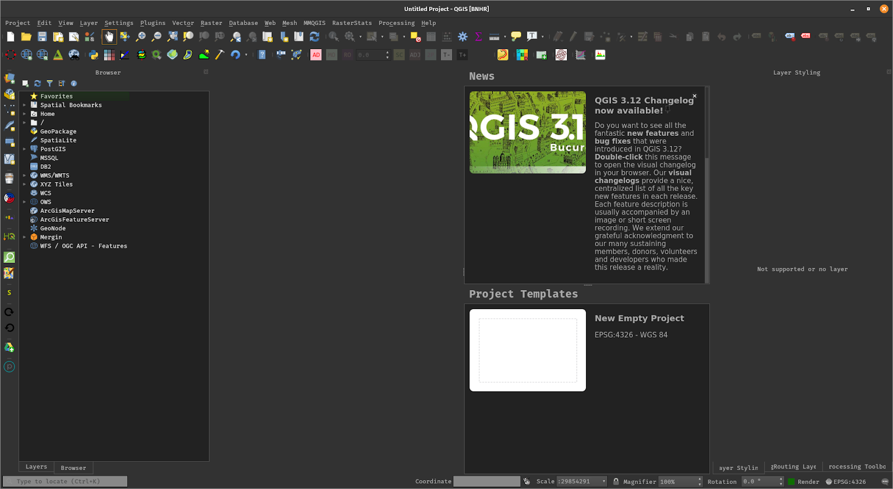
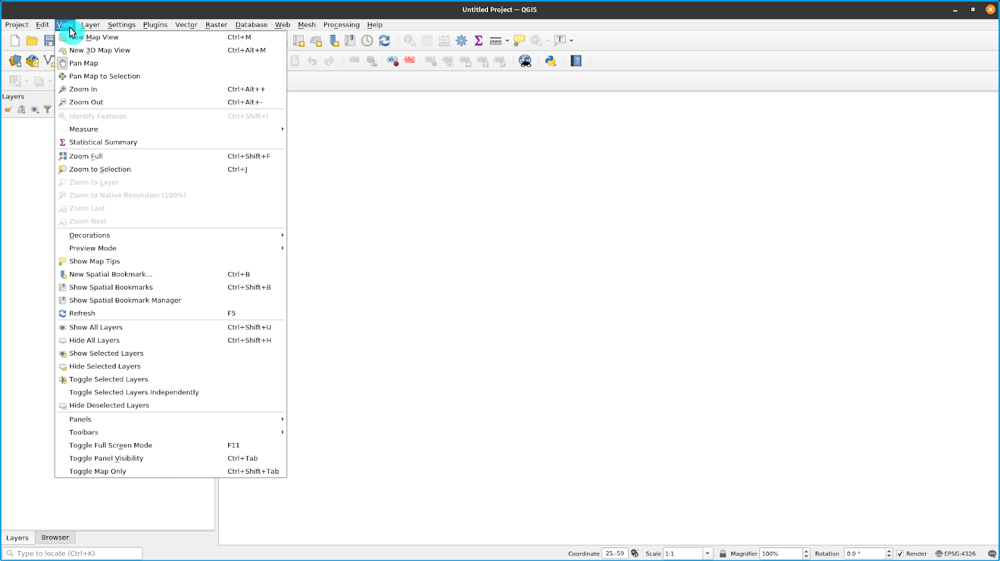
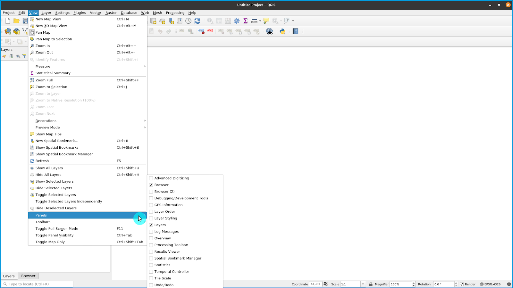
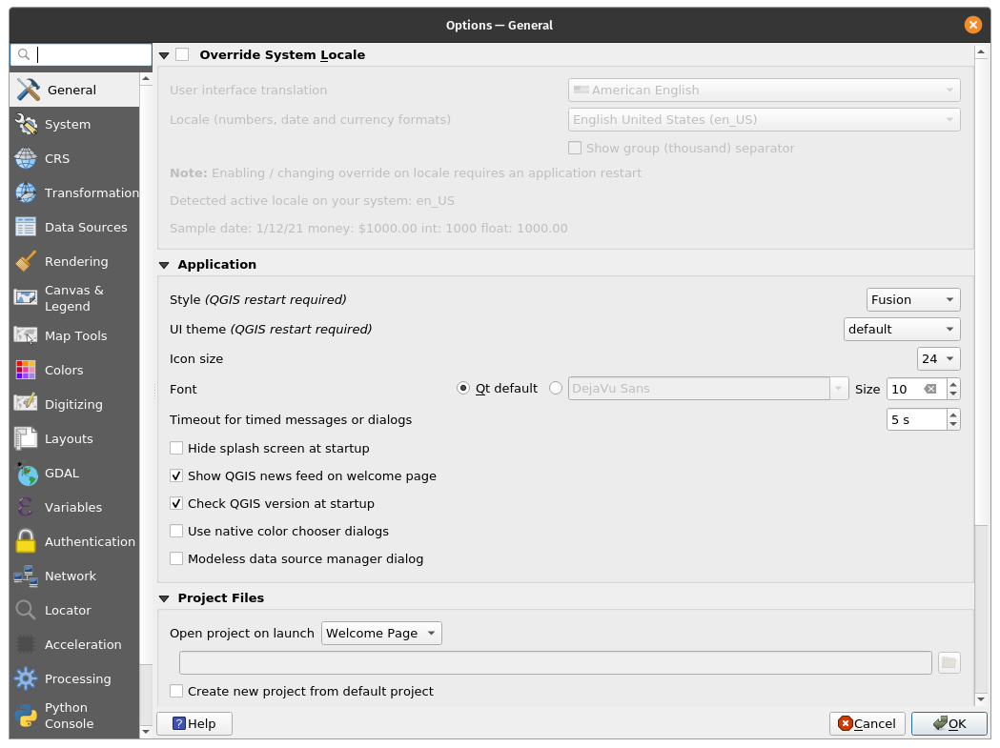
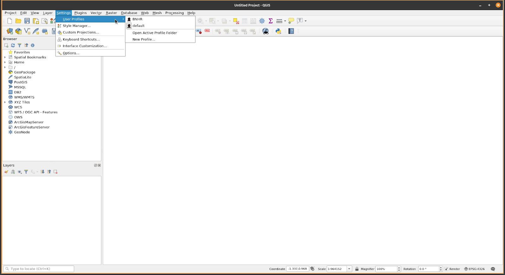
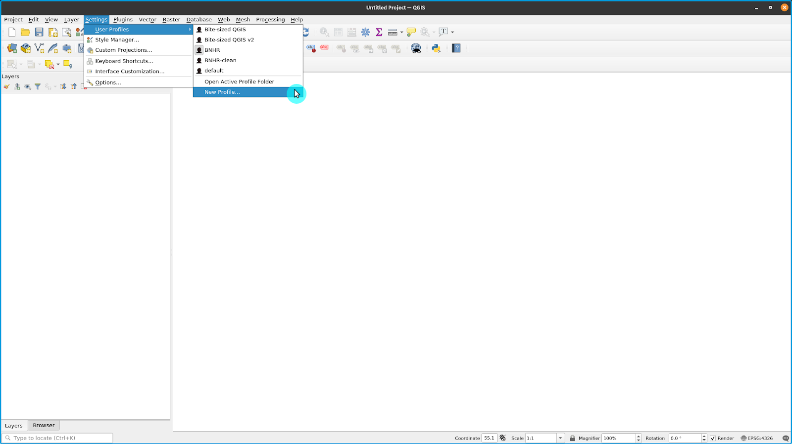
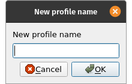

# ሞጁል 1. የQGIS መግቢያ

**ፀሃፊ፡-**: ቤን ሁር

## ትምህርታዊ መግቢያ

ይህ ሞጁል ለQGIS እንደመግቢያ በመሆን ያገለግላል። በዚህ ሞጁል መጨረሻ ላይ ተማሪዎች የሚከተሉትን ያውቃሉ-

*   QGIS ምንድን ነው
*   የQGIS በይነ ገጽ
*   የQGIS ቅንብሮች
*   የQGIS ተሰኪዎች

እንዲሁም የሚከተሉትን መማር መቻል አለባቸው፤

*   QGIS ን እንዴት መጫን እና መክፈት ይቻላል
*   የQGIS በይነ-ገጽ ጭብጥ የተለያዩ ክፍሎች እና ገጽታዎች
*   የበይነ-ገጹን አቀራረብ እና ጭብጥ እንዴት ማስተካከል ይቻላል
*   የተለያዩ የQGIS ቅንጅቶች ፡እንዴት መለወጥ ይቸላል እንዲሁም እንዴት QGIS ላይ ተጽዕኖ ያመጣሉ
*   የተጠቃሚ መገለጫዎች ምንድን ናቸው እንዴትስ እንጠቀምባቸዋለን
*   ተሰኪዎች ምንድን ናቸው እንዴትስ መጫን እንችላለን

ይህ ሞጁል ጥቂት የQGIS ልዩነቶች ምን እንደሆኑ እና ከሌሎቹ የ GIS ለምሣሌ ከQGIS ማህደር አይነቶች የተለየ የሚያደርገው እና የራሱ የሆነው ገጽታ ምን እንደሆነ ለማብራራት ይሞክራል

## አስፈላጊ መሣሪያዎች እና መርጃዎች 

ለዚህ ሞጁል የሚያስፈልጉ መሳሪያዎች እና መርጃዎች:

*   የሚሰራ ኮምፒውተር
*   የበይነመረብ ግንኙነት
*   በኮምፒተር ውስጥ የተጫነ QGIS 3.16 ([https://qgis.org/en/site/forusers/download.html](https://qgis.org/en/site/forusers/download.html))

## ቅድመ ሁኔታዎች 

*   ኮምፒውተርን የመጠቀም መሰረታዊ እውቀት

## ተጨማሪ መርጃዎች

* QGIS የተጠቃሚ መመሪያ - [https://docs.qgis.org/3.16/en/docs/user_manual/](https://docs.qgis.org/3.16/en/docs/user_manual/)
* QGIS የስልጠና መመሪያ - [https://docs.qgis.org/3.16/en/docs/training_manual/index.html](https://docs.qgis.org/3.16/en/docs/training_manual/index.html)

## የጭብጥ መግቢያ

ከዚህ በታች ያለው ካርታ ([https://flic.kr/p/2jFfGJP](https://flic.kr/p/2jFfGJP)) በቪንሰንት ቫንጎህ የ “Starry Starry Night” ቅጥ በአንድሬስ ፌሊፔ ላንቼሮስ ሳንቼዝ የተሰራውን በኮሎምቢያ የምትገኘውን የቦጎታን ከተማ የተወሰነ ክፍል ያሣያል።

ይህ የሚቀጥለው ካርታ ([https://flic.kr/p/2jAsphv](https://flic.kr/p/2jAsphv)) በ ፋጅር አሊም የተሰራውን ከ1851 እስከ 2020 ከNOAA የተገኘውን የዓውሎነፋስ ዱካን ያመለክታል።

ይህ የሚቀጥለው ካርታ  ([https://flic.kr/p/FA9TiR](https://flic.kr/p/FA9TiR)) በሄንሪክ ሊናኡ ሺናይደር የተሰራ የኬርጉሊን ደሴት ካርታ ነው።

የመጨረሻው ([https://flic.kr/p/2kqVzsg](https://flic.kr/p/2kqVzsg)) በቤን ሁር ፒንቶር ፊሊፒንስ ውስጥ በ UAAP የወንዶች ቅርጫት ኳስ ውድድር ክፍል 81 ላይ ያለው የሜዳ ግብ ሙከራዎች እና በአንድ ሙከራ የሚቆጠሩ ነጥቦች ነው።

እነዚህ ካርታዎች በሙሉ የጋራ የሆነ ምን አላቸው ? እደኛ ሁሉም የተሰሩት QGISን በመጠቀም ነው።

## የጽንሰ ሃሳቦቹ ማብራሪያ

ከላይ የተመለከቱት ካርታዎች በሙሉ ([https://qgis.org/en/site/](https://qgis.org/en/site/)) ነጻ እና ክፍት ምንጭ የጂኦግራፊያዊ መረጃ ስርአት በሆነው በQGIS የተፈጠሩ ናቸው። QGISን ለሁሉም አይነት የቦታ ውሂብ (በመጨረሻው ምሳሌ እንዳለው የቅርጫት ኳስ ውሂብ አይነት) መጠቀም ይቻላል እና ከመሬት ጋር ለተያያዘ ጂኦስፓሻል ውሂብ ብቻ አይደለም።

ሰዎች ከላይ እንዳሉት ምሳሌዎች ድንቅ እና አስገራሚ ካርታዎችን መስራት ይችላሉ ምክንያቱም QGIS ነጻ፣ ክፍት ምንጭ እና ሀይለኛ የውሂብ ቁጥጥር፣ ትንተና እና ገለጻ ችሎታዎች ያለው ነው።

## ዋና ይዘት 

### ደረጃ 1 ርዕስ: የQGIS እና የQGIS በይነ-ገጽ መግቢያ 

#### QGIS ምንድን ነው

**QGIS**, 2.X ከመውጣቱ በፊት Quantum GIS ተብሎ የሚታወቀው በሳል፣ ለብዙ ነገሮች መጠቀም የሚቻል መድረክ፣ ነጻ እና ክፍት ምንጭ የጂኦስፓሻል መረጃ ስርአት (GIS) ነው።

ለድርጅት ዝግጁ የሆነ GIS ሲሆን ይህ የቦታ እና የቦታ ያልሆነ ውሂብን የመሰብሰቢያ፣ የማስቀመጫ፣ የመተንተኛ፣ የማቅረቢያ እና የመቆጣጠሪያ ባህርያት አሉት። ከሌሎች የጂኦስፓሻል ቴክኖሎጂዎች ጋር በጥሩ ሁኔታ ይስማማል እንዲሁም ለማንኛውም የ FOSS4G (ለጂኦስፓሻል ነጻ እና ክፍት ምንጭ ሶፍትዌር) ክምችት ዋና ክፍል ሆኖ ያገለግላል።

ለብዙ ነገሮች መጠቀም የሚቻል መድረክ በመሆኑ፣ QGIS በ GNU/Linux፣ macOS፣ Windows፣ እና Android ላይ ራሱ ይሰራል።

#### የፈጠራ ኡደት እና ስሪቶች

የQGIS ፈጠራ እና አዲስ ስሪት የጊዜ እቅድን/መመሪያን ይከተላል ([https://www.qgis.org/en/site/getinvolved/development/roadmap.html](https://www.qgis.org/en/site/getinvolved/development/roadmap.html)).

የQGIS አዲስ ስሪት በሶስት ቁጥሮች ይገለጻል። ለምሣሌ፡ QGIS 3.16.4

*   X ዋንኛውን ስሪት ያመለክታል በዚህ መሰረት፡QGIS 3
*   Yየተለቀቀውን ስሪት ያመለክታል በዚህ መሰረት ስሪት 16 ተለቋል ጎዶሎ ቁጥሮች በአዲስ ስራ ስሪቶች ስለተያዙ የፈጠራ ስሪቶች ሁልጊዜ ሙሉ ቁጥሮች ናቸው።
*   Z የስሪቱ የፈጠራ ነጥብን (PR) ያሳያል። ለ 3.16.4፣ ይህ ማለት የ 3.16 ስሪት 4ኛ የፈጠራ ነጥብ ነው ማለት ነው።

ተጠቃሚዎች መጫን የሚችሏቸው የQGIS ሶስት ዋና ቅርንጫፎች አሉ። እነዚህ **የረጅም ጊዜ ፈጠራ (LTR)** ቅርንጫፍ፣ **የቅርብ ጊዜ ፈጠራ (LR)** ቅርንጫፍ እና **የስሪት (የምሽት)** ቅርንጫፍ ናቸው።

*   የሚቀጥለው LTR እስኪለቀቅ ድረስ የተስተካከለ እና የሳንካ ጥገናዎችን ስለሚቀበል **የረጅም ጊዜ ፈጠራ (LTR)** በዚያ መንገድ ተሰየመ። አሁን ባለው ሁኔታ አንድ(1) ዓመት ማለት ነው። ከፌብሯሪ 2021 ጀምሮ፣ አሁን ያለው LTR 3.16.4.ነው። ይህ በፌብሯሪ 2022 በQGIS 3.22.4 እንዲተካ መርሃግብር ተይዞለታል።
*   **የቅርብ ጊዜ ልቀት (LR)** በጣም የቅርብ ጊዜ ወይም የቅርብ ጊዜ ባህሪያትን የያዘውን የQGIS ልቀትን ስሪት ያመለክታል። አዲስ LR በየአራት (4) ወሩ ይወጣል። ለምሳሌ፦ አዲስ 3.18 LR በዚህ ፌብሯሪ 2021 ተለቋል። ቀጣዩ LR (3.20) ከጁን 2021 ጀምሮ ከ4 ወራት በኋላ ይለቀቃል። በአሁኑ ጊዜ እያንዳንዱ 3ኛ LR ቀጣዩ LTR ይሆናል። ለምሳሌ፦ LTR በዚህ ፌብሯሪ 2021 የ3.16 ፈጠራ ነው። 3ኛው LR ከ3.16 3.22 ነው ስለዚህ የሚቀጥለው LTR በ3.22 የፈጠራ ስሪት ላይ የተመሠረተ ይሆናል።
*   **ስሪት/ማታ ማታ** በጣም የቅርብ ጊዜውን የQGIS ምንጭ ኮድ መሠረት ያደረገ ነው ነገር ግን የQGIS ምንጭ ኮድን ለመፈተሽ፣ ለማረም ወይም ለመርዳት ከፈለጉ ጠቃሚ ነው፤ ግን መሞከር ከፈለጉ፣ ማረም ፣ ወይም የ QGIS አሰራር ላይ ያግዙ።

ስለዚህ የትኛውን ስሪት መጠቀም አለብዎት? እሱ ይወሰናል። ረዘም ላለ ጊዜ የሚቆይ ስሪት ከፈለጉ እና እንደ ተለቀቁ አዲስ ባህሪያትን የግድ የማይፈልጉ ከሆነ የLTR ስሪት ለእርስዎ ሊሆን ይችላል። በጣም የቅርብ ጊዜዎቹ ባህሪዎች እንዲኖሩዎት ከፈለጉ እና በየጥቂት ወራቶች ማሻሻልን ለማከናወን ግድ የሌሎት ከሆነ፣ የLR ስሪት ለእርስዎ አሪፍ ሊሆን ይችላል። አንዳንድ ጊዜ የስራ ወይም የማታ ስሪቶችን ማየትም ጥሩ ነው፤ በተለይም በQGIS ውስጥ ስለ መጪዎቹ ባህሪዎች ጉጉት ካለዎት።

ለበለጠ መረጃ፦ [https://bnhr.xyz/2020/10/26/about-qgis-versions-release-cycle-english.html](https://bnhr.xyz/2020/10/26/about-qgis-versions-release-cycle-english.html) ን ይጎብኙ

#### በዱር ውስጥ የQGIS ካርታዎች ምሳሌዎች

ምስል 1.1. :- የQGIS ካርታ ማሳያ

በQGIS ለተፈጠሩ ተጨማሪ ካርታዎች፦ [https://www.flickr.com/groups/2244553@N22/pool/with/50355460063/](https://www.flickr.com/groups/2244553@N22/pool/with/50355460063/) ን ይጎብኙ

#### QGISን መጫን 

QGIS ብዙ የሚያስተናግድ መድረክ ሲሆን በLinux፣ Windows፣ እና macOS ላይ ይሠራል። ክፍት ምንጭ መሆንዎ QGISን በ [https://github.com/qgis/QGIS/](https://github.com/qgis/QGIS/) ላይ ከሚገኘው ምንጭ ኮድ መስራትና እና መጫን ይችላሉ።

ጫኚዎች እና የመጫኛ መመሪያዎች እንዲሁ በ [https://qgis.org/en/site/forusers/download.html](https://qgis.org/en/site/forusers/download.html) or [https://qgis.org/en/site/forusers/alldownloads.html](https://qgis.org/en/site/forusers/alldownloads.html) ላይ ይገኛሉ።

**ለ Linux (ወይም GNU/Linux)፣** QGIS ብዙውን ጊዜ ከእርስዎ የስርጭት ጥቅል ሥራ አስኪያጅ ጋር ይገኛል። ለ Debian/Ubuntu ተጠቃሚዎች፣ QGIS ለLR፣ ለLTR እና ለስራ ቅርንጫፎች ማከማቻዎች እንዲሁም ከ ubuntugis-nonstable PPA የመጡ ጥገኛዎች ያላቸው የQGIS ስሪቶች አሉት። QGIS እንዲሁ እንደ Flatpak package ወይም በ Conda ውስጥ እንዳለው ይገኛል።

**ለ Windows፣** ተጠቃሚዎች በOSGeo4W አውታረ መረብ ጫኚ ወይም በገለልተኛ ጫኚዎች መካከል መምረጥ ይችላሉ። ለ LTR እና ለ LR ስሪት አንድ ራሱን የቻለ ጫኝ አለ።

ገለልተኛ ጫኚዎችን ለመጫን በጣም ቀላሉ እና ለጀማሪዎች የሚመከሩ ናቸው። በርካታ የQGIS ስሪቶች በአንድ ጊዜ በኮምፒተርዎ ውስጥ ሊጫኑ ይችላሉ። ይህ ማለት ሁለቱም የQGIS 3.16 እና 3.18 ስሪቶች ሊጫኑ ይችላሉ ማለት ነው።

የ OSGeo4W አውታረ መረብ ጫኝ ከተለየ ጫኚዎች ይልቅ ትንሽ የላቀ እና ውስብስብ ነው ነገር ግን የQGIS ስሪትዎን በቦታው ውስጥ የማዘመን እና የማሻሻል ችሎታ ይሰጥዎታል ይህም ማለት አንደ አዲስ መጫን ከፈለጉ የቆየውን ስሪት ማጥፋት አያስፈልግዎትም ማለት ነው ።

በአንዳንድ ሁኔታዎች QGIS ን ለመጫን የአስተዳዳሪ መብቶች ያስፈልጉዎታል ስለዚህ ተጠቃሚው የአስተዳዳሪ መብቶች በማይኖርበት ኮምፒተር ላይ የሚጭኑ ከሆነ የ IT ወይም የቢሮ አስተዳዳሪዎ QGIS ን እንዲጭን መጠየቅ ያስፈልግዎታል።

በ Windows ውስጥ መጫኑም ከQGIS ጋር ከGRASS (ሌላ ነፃ እና ክፍት ምንጭ GIS) ጋር አብሮት ይመጣል።

ልብ ይበሉ QGIS ለ [Windows32 ቢት ድጋፍን በቀስታ ያስወግዳል](https://blog.qgis.org/2020/10/15/phasing-out-32-bit-support-in-qgis/) ስለሆነም QGIS ን 64 ቢት ኦፐሬቲንግ ሲስተም በሚሰራ ኮምፒተር ላይ መጫን የተሻለ ነው።

**ለmacOS፣** ለmacOS High Sierra (10.13) እና ለአዳዲስ ይፋ የተደረጉ ሁሉም-በአንድ-የተፈረሙ ጫኚዎች አሉ። QGIS በmacOS ካታሊና (10.15) የደህንነት ህጎች እንደአስፈላጊነቱ ገና አልተለወጠም። በመጀመሪያ ጅምር ላይ እባክዎ በQGIS መተግበሪያ አዶ ላይ በቀኝ ጠቅ ያድርጉ፣ የአማራጭ ቁልፍን ይያዙ፣ ከዚያ ክፈት የሚለውን ይምረጡ።

#### የQGIS በይነገጽ ክፍሎች

QGISን ከጫኑ በኋላ በኮምፒተርዎ ውስጥ እንደማንኛውም ፕሮግራም ማሄድ ወይም መክፈት ይችላሉ። QGIS ን ሲከፍቱ ከዚህ በታች የሆነ ነገር ከሚመስለው ነባሪው የተጠቃሚ በይነገጽ (UI) ጋር ሰላምታ ይሰጡዎታል።

ምስል 1.2.:- በአዲስ ጭነት ላይ የ“QGIS” በይነገጽ

የQGIS ተጠቃሚ በይነ ገጽ ስድስት ዋና ክፍሎች አሉ -- የማውጫ አሞሌ፣ የካርታ ሸራ፣ የእሳሪያ አሞሌዎች፣ ፓናሎች፣ የሁኔታ ሞሌ እና ቦታ አመልካች።

የ UI ማእከል ላይ የካርታው ሸራ አለ። ፓነሎች እና የመሳሪያ አሞሌዎች በእነዚህ ሸራዎች ዙሪያ ሊቀመጡ ይችላሉ። ፓነሎች ባለብዙ ትር ፓነል ለመፍጠር በአንድ ላይ ሊሆኑ ይችላሉ። ፓይተን በይነ ገጽ፣ ተሰኪ መስኮቶች፣ ወዘተ የመሳሰሉ ሌሎች የ UI ክፍሎች አሉ።

**የማውጫ አሞሌ** - የማውጫ አሞሌ ቀላል ቅደም ተከተል ያለው ሲሆን ለQGIS ስራዎች እና ትእዛዞች ተደራሽነት ይሰጣል። ብዙ ጊዜ UI ላይ ይገኛል።

**የካርታ ሸራ** - የካርታ ሸራ QGIS ውስጥ የተጫኑት ንብርብሮች የሚታዩበት ነው። በተጠቃሚው የተፈጠሩ ማጣሪያዎች፣ መምረጫዎች፣ እና ምልክቶች የሚንጸባረቁበት ነው። በማንኛውም ሰአት ከአንድ በላይ የካርታ ሸራ ሊኖር ይችላል፣ ተጠቃሚው የካርታ ሸራውን ማቅረብ፣ ማንቀሳቀስ፣ ማሽከርከር ሁሉ ይችላል። የካራታ ሸራ የ 3D ውሂብ ሁሉ ሊያሳይ ይችላል።

**የመሳሪያ አሞሌዎች** - የመሳሪያ አሞሌዎች የመጫን-እና-ማስጀመሪያ ቁልፎችን ያሳያሉ። ለ QGIS ትእዛዞች፣ ባህሪያት፣ ተሰኪዎች፣ ወዘተ ቀላል ተደራሽነት እንዲኖር ያስችላሉ። በካርታ ሸራው ዙሪያ ሊንቀሳቀሱ እና ሊቀመጡ ይችላሉ። የመሳሪያ አሞሌዎች ዝርዝር በመሳሪያ **አሞሌዎች‣ እይታ** ስር ከማውጫ አሞሌ ሊገኙ፣ ስራ ሊጀምሩ እና ሊጠፉ ይችላሉ። የመሳሪያ አሞሌዎች ምሳሌዎች Attributes Toolbar እና Digitizing Toolbar ናቸው።

**ፓነሎች** - ፓነሎች ከመሳሪያ አሞሌዎች ጋር ተመሳሳይ ናቸው ነገር ግን በቁልፎች ፋንታ፣ ለውስብስብ ስራዎች እና ባህሪያት በይነ ገጽ ያቀርባሉ። የንብርብር ፓነል እና አሳሽ ፓነል ምሳሌዎች ናቸው። ከመሳሪያ አሞሌዎች ጋር በተመሳሳይ፣ በካርታ ሸራዎች ዙሪያ ሊንቀሳቀሱ እና ሊቀመጡ ይችላሉ። የፓነሎች ዝርዝር **በፓነሎች‣ እይታ** ስር ከማውጫ አሞሌ ሊገኙ፣ ስራ ሊጀምሩ እና ሊጠፉ ይችላሉ።

**የሁኔታ አሞሌ** - የሁኔታ አሞሌ ብዙ ጊዜ ከUI በታች የሚገኝ ሲሆን CRS፣ ልኬት፣ ማሳወቂያ፣ ወዘተ… የመሳሰሉ ጠቃሚ መረጃዎችን ያሳያል።

**አመልካች አሞሌ** - አመልካች አሞሌ በQGIS በይነ ገጽ በታችኛው የግራ ጥግ ላይ ይገኛል። ተጠቃሚዎች በቀላሉ ንብርብሮችን፣ መስኮችን፣ ስልተ ቀመሮች፣ እና QGIS ውስጥ ያሉ ሌሎች ነገሮችን እንድናገኝ ያስችላል። ይህ ከQGIS በጣም ሀይለኛ ባህሪያት መካከል አንዱ ነው።

ምስል 1.3.፡- የQGIS በይነገጽ ክፍሎች

የQGIS አንዱ ደስ የሚለው ነገር ለተጠቃሚዎቹ የሚሰጠው መስተካከል መቻሉ ነው። ይህ መስተካከል መቻል ከተጠቃሚ በይነ ገጽ ይጀምራል። የተወሰኑ ቅንብሮችን በማስተካከል እና የተወሰኑ የበይነ ገጽ ክፍሎችን በማንቀሳቀስ፣ ከታች ያለውን የሚመስል QGIS ሊኖርዎት ይችላል፦

ምስል 1.4. የተወሰነ ማስተካከያ የተደረገለት የQGIS በይነ ገጽ

#### ቱቶሪያል/መልመጃ 1: የQGIS በይነ ገጽን እይታ እና አቀራረብ መቀየር

1. QGISን ክፈት
2. ይመልከቱ የሚለውን ማውጫ ተጫን

3. ይመልከቱ የሚለውን ማውጫ ተጫን

4. የመሣሪያ አሞሌዎችን ማውጫ ተመልከት

5. በተጠቃሚው በይነ ገጽ ማሳየት የሚፈልጉትን የመሳሪያ አሞሌዎች እና ፓነሎች ይምረጡ። ከጠቃሚ ፓነሎቹ መካከል Layer Styling እና Processing Toolbox ይካተታሉ።
6. የመሳሪያ አሞሌዎች እና ፓነሎችን ለእርስዎ ስሜት ወደሚሰጥዎት ቦታዎች ያንቀሳቅሱ

**የQGIS በይነገጽን እንደገና ማቀናበር**

እይታዎን ወደ ነባር ቅንብሮች ለመቀየር፣ ወደ ሚከተለው ይሂዱ **፦ ቅንብሮች ‣ አማራጮች ‣ የስርአት ትር ‣ ቅንብሮች ‣ እንደገና ያቀናብሩ** ቁልፍ እና QGIS ን እንደገና ያስጀምሩ

#### የፈተና ጥያቄዎች 

1. እውነት ወይም ሃሰት፦
    1. ብዙ አይነት የካርታ ሸራዎች ሊኖርዎት ይችላል -- ***እውነት***
    2. ፓነሎች እና የመሳሪያ አሞሌዎችን ማሳየት ወይም መደበቅ ይችላሉ -- ***እውነት***
    3. ፓነሎችን በካርታ ሸራው በግራ ወይም በቀኝ ጎን ብቻ ማስቀመጥ ይችላሉ -- ***ሐሰት (ፓነሎችን ከካርታ ሸራው ከላይ ወይም ከታች ማስቀመጥ ይችላሉ)***

### ደረጃ 2 ርእስ፡ የQGIS ተሰኪዎች

የQGISን የመስራት አቅም በተሰኪዎች የመጨመር፣ የመፍጠር እና የማራዘም ችሎታ ከሀይለኛ ባህሪያቱ መካከል አንዱ ነው።

ከQGIS 3.16.3 ጀምሮ፣ ተጠቃሚዎች ማውረድ እና ማሻሻል እንዲችሉ ከ700 በላይ ተሰኪዎች አሉ። እነዚህ ተሰኪዎች በስራቸው ከውስብስብ እስከ ተራ ይመደባሉ።

የQGIS ተሰኪዎች እንደሚከተለው ሊከፋፈሉ ይችላሉ፦

*   **ዋና ተሰኪዎች** - የእርስዎ አይነት QGIS ላይ የተሰራ፣ አለመጫን አይቻልም፣
*   **የውጪ ተሰኪዎች** - ከውጪ ሪፓዚተሪ (ምሳሌ፦ የQGIS ህጋዊ የተሰኪ ሪፓዚተሪ) ወይም ከምንጭ ኮድ በመውሰድ በእጅ የተጫነ።

ተሰኪዎች በሶስት (3) መንገድ ሊጫኑ ይችላሉ፦

1. በቁጥጥር እና መጫኛ መገናኛ በኩል (**ተሰኪዎች ‣ ተሰኪዎችን ይቆጣጠሩ እና ይጫኑ**)
2. ተሰኪዎችን ይቆጣጠሩ እና ይጫኑ መገናኛ ውስጥ ካለው ** ከ ZIP ይጫኑ** ትር ስር ከሚገኘው ZIP መጫን።
3. በQGIS ገጽታዎ የተሰኪዎች ማህደር ውስጥ የምንጭ ኮዱን በእጅ መጨመር። ይህ ማህደር ብዙ ጊዜ የሚገኘው፦ 
    1. **Linux**: .local/share/QGIS/QGIS3/profiles/default/python/plugins
    2. **Mac OS X**: Library/Application/Support/QGIS/QGIS3/profiles/default/python/plugins
    3. **Windows**: **C:\\Users<User>\AppData\Roaming\QGIS\QGIS3\profiles\default\python\plugins

ምስል 1.5. ተሰኪዎችን ይቆጣጠሩ እና ይጫኑ መገናኛ መጠቀም መቻል

**ተሰኪዎችን ይቆጣጠሩ እና ይጫኑ መገናኛ**

ለእርስዎ የQGIS ስሪት የሚገኙትን ተሰኪዎች ለመውሰድ ተሰኪዎችን ይቆጣጠሩ እና ይጫኑ መገናኛ ከQGIS ህጋዊ የተሰኪ ሪፓዚተሪ (ወይም በቅንብሮች ትር ውስጥ ከሚያመለክቱት ማንኛውም ሪፖዚተሪ) ጋር ይገናኛል። አምስት(5) ትር አለው፡

*   **ሁሉም ትር** – የእርስዎ ማሽን ላይ የተጫኑትን ጨምሮ ለእርስዎ QGIS ስሪት የሚገኙትን ሁሉንም ተሰኪዎች ያሳያል።
*   **የተጫነ ትር** – ማሽንዎ ላይ የተጫኑትን ተሰኪዎች ብቻ ያሳያል።
*   **ያልተጫነ ትር** – ማሽንዎ ላይ ያልተጫኑትን ተሰኪዎች ያሳያል።
*   **ከ ZIP ይጫኑ** – ከZIP ማህደር ወስደው ተሰኪዎችን እንዲጭኑ ያስችልዎታል።
*   **የቅንብሮች ትር** – መቼ የተሰኪዎች አዲስ መረጃዎችን ማየት እንዳለብዎት፣ የሙከራ እና ርካሽ ተሰኪዎችን ማካተት ወይም አለማካተት፣ ወይም ተሰኪዎች የሚወሰዱበትን ሪፓዚተሪ መጨመር/መለወጥ የሚችሉበትን አማራጭ ይሰጥዎታል።

እርስዎ የሚፈልጉት ተሰኪዎች የሙከራ ወይም ርካሽ ተብለው ምልክት ከተደረገባቸው፣ ከቅንብሮች ት**ር የሙከራ ተሰኪዎችን አሳይ እና ርካሽ ተሰኪዎችን አሳይ** የሚሉትን ማረጋገጥ አለብዎት።

**የፍለጋ ትር** እርስዎ ግንኙነት ካልዎት የተሰኪ ሪፓዚተሪ/ዎች ውስጥ የሚገኙ ተሰኪዎችን ለመፈለግ ያስችልዎታል።

ምስል 1.6.:- የቁጥጥር እና መጫኛ መገናኛ

#### ቱቶሪያል/መልመጃ 2፦ የQGIS ተሰኪን መጫን

1.**ከተሰኪዎች ተሰኪዎችን ይቆጣጠሩ እና ይጫኑ መገናኛን** ይክፈቱ‣ ከማውጫ አሞሌ **ተሰኪዎችን ይቆጣጠሩ እና ይጫኑ።** ይህ ተሰኪዎችን ይቆጣጠሩ እና ይጫኑ የሚለውን መገናኛ ይከፍታል።

2. የሚከተሉትን ተሰኪዎች **በሁሉም ትር** ውስጥ በመፈለግ ይጫኑ እና የተሰኪዎችን ይቆጣጠሩ እና ይጫኑ መገናኛ የታችኛው የቀኝ ጥግ ላይ **ተሰኪ ይጫኑ** የሚለውን ይጫኑ።
   - የማስታወሻ ንብርብር አስቀማጭ

   - ፈጣንOSM

3. ተሰኪዎች በስኬታማ መንገድ እንደተጫኑ አረጋግጥ። የማስታወሻ ንብርብር አስቀማጭ ተሰኪ በማውጫ ትር ውስጥ ያለው **በተሰኪዎች‣ የማስታወሻ ንብርብር አስቀማጭ** ላይ መኖር አለበት የ ፈጣንOSM ተሰኪ ደግሞ ከማውጫ ትሩ ውስጥ **ከቬክተር ‣ ፈጣንOSM** መኖር አለበት።

#### የፈተና ጥያቄዎች

1. እውነት ወይም ሐሰት
    1. ዋነኛ ተሰኪዎችን ማስወገድ ወይም አለመጫን ትችላለህ – **ሐሰት** 
    2. በህጋዊ የQGIS ተሰኪ ሪፓዚተሪ ውስጥ የሌሉ ተሰኪዎችን መጨምር ይችላሉ – **እውነት**

### ደረጃ 3. ርዕስ  የQGIS ቅንጅቶች

**የሲስተም እና የፕሮጀክት ቅንጅቶች**

የQGIS ቅንብሮች የተጠቃሚ ገጽታ፣ ቅጥዖች፣ የመጋጠሚያ ማጣቀሻ ስርአቶች፣ የቁልፍ ሰሌዳ አቋራጮችም የተጠቃሚ በይነ ገጽ፣ ነባር ቀለሞች፣ ወዘተ… የመሳሰሉ ስለQGIS ያሉ የተለያዩ ነገሮችን እንዲያርሙ እና እንዲቆጣጠሩ ያስችልዎታል። የስርአቱ ቅንጅቶች **በቅንጅቶች** ማውጫ ስር ሊገኝ ይችላል እንዲሁም በፕሮጀክቱ ቅንብሮች እስካልተሰረዙ ድረስ በQGIS ጥቅም ላይ የሚውሉ ነባር ቅንጅቶች ናቸው። የፕሮጀክት ቅንብሮች **ፕሮጀክት ‣ ባህሪያት** ላይ ሊገኙ ይችላሉ እንዲሁም የወቅታዊውን ፕሮጀክት ቅንጅቶች እና ባህሪያት ይሳያሉ። እነዚህ እሴቶች የስርአቱን ነባሮች ያስወግዳሉ።

ምስል 1.7:-  የሲስተም ቅንጅቶች

ምስል 1.8 የፕሮጀክት ቅንጅቶች

**የQGISን ጭብጥ መቀየር**

የQGIS ን ገጽታ እና ስሜት **በቅንብሮች ‣ አማራጮች ‣ አጠቃላይ** ትር ስር መለወጥ ይችላሉ።

ከሶስት ጭብጦች መካከል መምረጥ ይችላሉ -- ነባር፣ የግራጫ ውህድ እና የምሻት ካርታ ዝግጅት። የአዶዎችን መጠን፣ QGIS የሚጠቀመውን የአጻጻፍ ዘይቤ፣ እና ሌሎች የስርአቱ ነባሮችን መለወጥ ይችላሉ።

ምስል 1.9. አጠቃላይ የQGIS ቅንጅቶች

QGIS ውስጥ ላሉ የተወሰኑ ቅንብሮች፣ ተግባራዊ እንዲሆኑ መተግበሪያውን እንደገና ማስጀመር ሊያስፈልግዎት ይችላል።

**የተጠቃሚ መገለጫዎች**

QGIS 3.X በQGIS የተጠቃሚ መገለጫዎችን ጽንሰ ሀሳብ አስተዋውቋል።

የተጠቃሚ መገለጫ ለተጫኑ ተሰኪዎች፣ ለሚሰሩ የመሳሪያ አሞሌዎች፣ ለተጠቃሚ በይነገጽ ማስተካከያ፣ እና ለሌሎች ቅንብሮች የቅንብሮች ስብስብ ነው። QGIS ከነባር የተጠቃሚ መገለጫ ጋር ነባር ተብሎ ተሰይሞ ይመጣል። የተጠቃሚ መገለጫዎች ለልዩ ትንተናዎች (ምሳሌ፦ ለውሀ ሀብት አስተዳደር፣ ውሂብን ዲጂታላይዝ ለማድረግ፣ ለካርቶግራፊ፣ ወዘተ የተጠቃሚ መገለጫ)፣ ለልዩ እቃዎች ወይም ለደንበኞች ራሱ ተጠቃሚዎች የተለያዩ ቅንብሮችን እንዲፈጥሩ ያስችላል።

የተጠቃሚ መገለጫዎች በሚከተሉት ስር ከማውጫ አሞሌው ሊፈጥዕሩ እና ሊገኙ ይችላሉ፦ **ቅንጅቶች ‣የተጠቃሚ መገለጫዎች::**

የሚሰራው የተጠቃሚ መገለጫ በርእስ አሞሌው ውስጥ [የተጠቃሚ መገለጫ] ተብሎ ይታያሉ።

ምስል 1.10. :  የተጠቃሚ መገለጫዎችን ማግኘት

የተጠቃሚ መገለጫዎች ኮምፒውተርዎ ላይ በዳይሬክተሪ ይቀመጣሉ ይህም የሚከተሉትን በመንካት ይገኛል **ቅንብሮች ‣ የተጠቃሚ መገለጫዎች ‣ የሚሰራ መገለጫ ማህደርን ክፈት።**

#### ቱቶሪያል/መልመጃ 03: የተጠቃሚ መገለጫዎችን መፍጠር  

1. ወደ **ቅንጅቶች** ይሂዱ **‣የተጠቃሚ መገለጫዎች‣አዲስ መገለጫዎች** 

2. ለአዲሱ የተጠቃሚ መገለጫዎ ስም ይስጡ።

3. ከአዲስ የተጠቃሚ መገለጫዎ ጋር አዲስ የQGIS መስኮት መከፈት አለበት። የመገለጫ ስምዎ የQGIS ርእስ አሞሌ ውስጥ መታየቱን ያስተውሉ።

4. በአዲሱ የተጠቃሚ መገለጫ ውስጥ ማንኛውንም የተለየ ነገር አስተውለዋል? የድሮውን መገለጫ እና አዲስ የፈጠሩትን መገለጫ የተጠቃሚ በይነ ገጽ፣ ተሰኪዎች እና ቅንብሮችን ይመልከቱ።

#### የፈተና ጥያቄዎች

1. እውነት ወይም ሐሰት
    1. በአንድ QGIS ላይ የአንድ ተጠቃሚ መገለጫ ብቻ ነው ሊኖርህ የሚችለው።--**ሐሰት (ከአንድ በላይ የተጠቃሚ መገለጫ ሊኖርህ ይችላል)**
    2. የስርአቱን አሰራር እና ባህሪያት ልትቀይረው አትችልም።--**ሐሰት**

### ደረጃ 4 ርዕስ (ተጨማሪ): የQGIS ማህደር ቅርጸቶች 

#### የQGIS ፕሮጀክት ማህደር (QGS/QGZ)

የQGIS ፕሮጀክቶች QGIS ናቸው ለ ArcMap .mxd ማህደሮች እንደሆኑት ማለት ነው። ማህደሮች ወይ **QGS (.qgs)** ወይም **QGZ (.qgz)** ሆነው ይመጣሉ። በሁለቱ መካከል ያለው ዋና ልዩነት የ QGZ ቅርጸት የ QGS ማህደር እና የ QGD ማህደር የሚይዝ የታመቀ (zip) መዝገብ ነው። የ QGS ቅርጸት የ XML ቅርጸት ሲሆን የQGIS ፕሮጀክቶችን ለማከማቸት ይጠቅማል። የ QGD ማህደር የqgis ፕሮጀክት የተያያዘ የ sqlite የመረጃ ቋት ሲሆን ለፕሮጀክቱ ተጨማሪ ውሂብን ይይዛል። ተጨማሪ ውሂቦች ከሌሉ፣ QGD ፋይል ባዶ ይሆናል።

የQGIS ፕሮጀክት ማህደር የQGIS ፕሮጀክትን ለማስቀመጥ የሚያስፈልጉትን ሁሉንም ነገሮች ይይዛል፤ የሚከተሉትን ያካትታል፦

*   የፕሮጀክቱ ርዕስ
*   የውጥን ሥራ CRS
*   የንብርብር ቅጥልትሎሽ
*   ቅንጥብ ቅንብሮች
*   rግንኙነቶች
*   የካርታው ሸራ መጠን
*   የፕሮጀክቶች ማሣያ
*   አፈ ታሪክ
*   የካርታ እይታ ማስቀመጫዎች (2D እና 3D)
*   ከያዙት የውሂብ ስብስቦች (የውሂብ ምንጮች) እና መጠን፣ SRS፣ መቀለቀሎች፣ ቅጦች፣ ሰጪዎች፣ ውህድ ሞድ፣ ብርሀን አስተላላፊነት እና ሌሎች ነገሮችንም የሚያካትቱ የንብርብር ባህርያትን የያዘ ንብርብር ከሊንክ ጋር።
*   የፕሮጀክቱ ባህሪያት

የQGIS ፕሮጀክት ማህደሮች GeoPackage ወይም የ PostGIS የመረጃ ቋት ውስጥ ሊቀመጡ ይችላሉ። የፕሮጀክቱን ማህደር ከቅጥ ማህደር እና ተመሳሳይ ንብርብሮች ጋር በአንድ GeoPackage ማስቀመጥ የ QGIS ፕሮጀክቶችን ለማጋራት ቀላል ያደርገዋል።

#### የQGIS ንብርብር ፍቺ (QLR)

የQGIS ንብርብር ፍቺ ማህደር **(QLR)** የ XML ማህደር ሲሆን ለንብርብሩ ካለው የQGIS ቅጥ መረጃ በተጨማሪ ወደ ንብርብር ውሂብ ምንጭ ጠቋሚን ይይዛል። በአሁኑ ሰአት፣ QLR ማህደር ከነጠላ ንብርብር ጋር ብቻ ይዛመዳል።

የዚህ ማህደር የአጠቃቀም ሁኔታ እንደሚከተለው ቀላል ነው፦ የውሂብ ምንጩን ለመክፈት ነጠላ ማህደር እንዲኖር እና ሁሉንም ተያያዥ የቅጥ መረጃ ለማምጣት ቀላል ነው። QLR ማህደሮች ዋናውን የውሂብ ምንጭ ለመክፈት ቀላል በሆነ ማህደር ውስጥ ለመሽፈን ያስችላሉ።

የ QLR አጠቃቀም ምሳሌ ከ PostGIS የመረጃ ቋት ንብርብርን ለመክፈት ነው። ከመረጃ ቋቱ ጋር ከመገናኘት፣ ንብርብር ከመፈለግ፣ እና ማጣሪያ ከማድረግ ይልቅ፣ ከሚዛመደው ቅጥ እና ማጣሪያ ጋር የ PostGIS ን ንብርብር ለማስተካከል የሚጠቁመውን የ .qlr ማህደር መክፈት ይችላሉ።

#### QGIS የቅጥ ማህደር (QML)

**QML** የንብርብር ቅጦችን ለማስቀመጥ የሚሆን የ XML ቅርጸት ነው። QML ማህደር (.qml) QGIS ን እንዴት የወደፊት ጂኦሜትሪዎችን እንደሚሰጥ የሚነግሩ ሁሉንም መረጃዎች የያዘ ሲሆን የምልክት ፍቺዎችን፣መጠን እና አዙሪቶችን፣ ስያሜ፣ ብርሀን አስተላላፊነት፣ የውህድ ሞዴሎች እና ሌሎች ብዙዎችን ያካትታል።

.qml ማህደር ከሚዛመደው የውሂብ ምንጭ ጋር ተመሳሳይ ስም ሊኖረው ይገባል። እንደ ውሂብ ምንጩ በተመሳሳይ ዳይሬክተሪ ወይም ማህደር ውስጥ ሲገኝ፣ የውሂብ ምንጩን መጫን በራሱ .qml ማህደር ውስጥ እንደተገለጸው የራሱን ቅጥ ይጭናል።

ለምሳሌ፣ regions.geojson የተባለ GeoJSON እና regions.qml የተባለ QML ማህደሩ ቢኖርዎት፣ QGIS ውስጥ regions.geojson ን መጫን በ regions.qml ውስጥ በተጫነው ንብርብር ውስጥ የተገለጹ ቅጦችን ተግባራዊ ያደርጋል።

GeoPackages (.gpkg) ን በሚጠቀሙበት ሰዓት፣ የ .qml ማህደር ብዙ ጊዜ አያስፈልግህም ምክንያቱም የንብርብሩን ገጽታ በቀጥታ ከ geopackage ማግኘት ትችላለህ።

### ይበልጥ ማወቅ ከፈለጉ፡

የራስዎን የQGISተሰኪዎችን መፍጠር ሊሞክሩ ይችላሉ። ማድረግ የምትፈልገውን ለያከናውንልህ የሚችል ተሰኪ ከሌለ ለራስህ አንድ መፍጠር ትችላለህ።

**የተሰኪ ገንቢ** ለ QGIS ተሰኪ ፈጠራ እንደመጀመሪያ የሚያገለግል ንድግ የሚፈጥር ተሰኪ ሲሆን ስለዚህ ከመጀመሪያ ጀምሮ እንደአዲስ መፍጠር አይጠበቅብዎትም። ተሰኪዎችን ተቆጣጠር እና ጫን የተግባቦት ገጽ ማውረድ ትችላለህ።

ልክነው ፣ ሁልጊዜ ተሰኪዎችን ከመጀመሪያ ጀምሮ መፍጠር ትችላለህ። የራስህን ተሰኪ ለመፍጠር ከፈለግክ፣ የQGISን ህጋዊ ሰነዶች ተመልከት (https://documentation.qgis.org/)። ለማህደሮች ተሰኪዎች፣ የ PyQGIS ማዳበሪያ ፈጣን ማጣቀሻ መጽሐፍን ማጣቀስ መልካም ሃሣብ ነው (https://docs.qgis.org/3.16/en/docs/pyqgis_developer_cookbook/)።

ለበለጠ መረጃ፣ https://bnhr.xyz/2018/10/08/qgis-plugins-3.0.html ይመልከቱ።

### አዲሱን ክህሎትዎትን ለመለማመድ ይህንን ይሞክሩ…. 

*   ምርጫህን ይስማማ ዘንድ የQGIS ተጠቃሚ በይነ ገጽን ጭብጥ ወይም ሁኔታ ለውጥ።
*   ሌሎች የQGIS ተሰኪዎችን ይጫኑ።
* ሌሎች የQGIS ቅንጅቶችን ይለውጡ።
    *   ምቹ የሆኑ የስርዓት ማስተባበሪያ ይፍጠሩ።
    *   የብጁ ስፕላሽ ገጽ ይፍጠሩ (https://bnhr.xyz/2020/09/05/custom-splash-screen-qgis.html)

### ጠቃሚ ምክሮች  

አይገኝም
