# Modul 10 - QGIS-Erweiterungen / -Plugins

**Autor**: Codrina

## Pädagogische Einführung

In diesem Modul werden einige der interessantesten und hoffentlich nützlichen Erweiterungen vorgestellt, die von der internationalen QGIS-Gemeinschaft entwickelt und für jedermann zur Verfügung gestellt wurden. Wir werden dabei den Begriff Plugin und Erweiterung austauschbar benutzen - Die deutsche QGIS-Oberfläche nutzt hauptsächlich den Begriff Erweiterungen, da viele der Erweiterungen aber nicht lokalisiert sind, tauchen sie häufig auch unter dem internationalen Namen - Plugins - auf.
Am Ende des Moduls sollten Sie wissen:

* Wie man ein neues Plugin sucht und installiert
* Wie man zwischen den verschiedenen Plugin-Repositories wechselt 
* Wie man eine Plugin-Dokumentation liest und worauf man achten muss.

## Erforderliche Tools und Ressourcen

* Dieses Modul wurde mit [QGIS Version 3.16.1 - Hannover](https://qgis.org/en/site/forusers/download.html) erstellt.

## Voraussetzungen: 

* Grundkenntnisse in der Bedienung eines Computers
* Ein solides Verständnis aller Module, da die Plugins, die wir vorstellen werden, sich auf verschiedene Begriffe/Elemente beziehen, die Sie im Laufe dieses Curriculums kennengelernt haben, wie z.B. Vektoren, Raster, Attributtabellen und viele andere. 

## Hauptinhalt 

### Teil 1: Einführung in den Plugin-Gedanken

Einer der vielen Vorteile der Open-Source-Gemeinschaft - sowohl für Entwickler:innen als auch für Anwender:innen - ist die unglaubliche Geschwindigkeit, mit der Entwicklungen und Verbesserungen stattfinden, die Art und Weise, wie neue Ideen aufkommen und dann in die Praxis umgesetzt werden. 

Wie Sie in Modul 1 gesehen haben, ist QGIS mit einer "Plugin"-Architektur konzipiert, die es erlaubt, es durch Hinzufügen externer Plugins leicht an die eigenen Bedürfnisse anzupassen. In QGIS Unterscheidet man zwischen **Kern-** und **externen Plugins**. Die Kern-Plugins - wie der Name schon sagt - bilden die Hauptstruktur, sie werden vom QGIS-Entwicklungsteam gewartet und sind immer in der Installation enthalten. Beispiele sind die  wie z.B. das Processing-Kern-Plugin, die Zonale Statistik oder der Plugin-Manager. Im Laufe der Zeit sind verschiedene externe Plugins aufgrund ihrer Relevanz in Richtung des Kerns gewandert. 

Natürlich kann man angesichts der Open-Source-Prinzipien, gepaart mit den großartigen und sehr detaillierten Dokumentationen, die zur Verfügung stehen, und den vielen Kommunikationskanälen und speziellen Veranstaltungen lernen, wie man ein Plugin baut, das den eigenen Anforderungen entspricht. Und das ist ein **externes Plugin**. Auf der dedizierten [Webseite](https://plugins.qgis.org/) finden Sie die gesamte notwendige Dokumentation. Die meisten externen Plugins sind in Python geschrieben, aber sie können auch in C++ geschrieben werden. 

In dieser ersten Phase werden wir uns mit der Einrichtung von QGIS-Plugins beschäftigen - wie man nach einem Plugin sucht, um eine bestimmte Anforderung zu lösen, die man vielleicht hat, wie man dessen Dokumentation interpretiert und wie man dem Entwicklungsteam meldet, wenn man auf ein Problem gestoßen ist. 

### Die Erweiterungsverwaltung

QGIS bietet ein Kern-Plugin, mit dem externe Plugins verwaltet, installiert, aktualisiert und deinstalliert werden können. Die Funktionalität ist intuitiv und bietet vollen Zugriff auf das offizielle öffentliche Plugin-Repository. 

Es muss betont werden, dass die externen Plugins - seien sie offiziell oder experimentell - die Arbeit einzelner Entwickler:innen oder Organisationen sind und die QGIS-Organisation keine Verantwortung für sie übernimmt. Davon abgesehen gibt es einige Regeln, die Entwickler:innen, die ihre Arbeit über das offizielle Repository zur Verfügung stellen wollen, einhalten müssen, sowie eine Reihe von Empfehlungen für eine schnelle Akzeptanz. Zu den Anforderungen gehören Elemente wie eine kompatible Lizenz, minimale Dokumentation, klare Identifizierung von Abhängigkeiten und andere. Zu den Empfehlungen gehört die Überprüfung, ob das Plugin keine bestehende Funktionalität dupliziert, eine gute Struktur des Quellcode-Repositorys, Kompatibilität mit allen Plattformen (Windows, Linux, macOS) und viele andere.  

Experimentelle Plugins - die im Plugin-Manager als solche gekennzeichnet sind - sind Plugins, die sich in einem frühen Entwicklungsstadium befinden, also nicht für den operativen Einsatz geeignet sind. Sie gelten als "Proof of Concept"-Tests und es wird nicht empfohlen, sie zu installieren, es sei denn, man möchte sie zu Testzwecken verwenden. 

Um die experimentellen Plugins zu sehen, muss dies Funktionalität explizit eingeschaltet werden. Dies können Sie tun, indem Sie in den Einstellungen des Plugin-Managers die Option `Auch experimentelle Erweiterungen anzeigen` auswählen (Abbildung 10.2a). Es gibt auch die Möglichkeit, die veralteten Plugins aufzulisten. Diese werden nicht empfohlen, da sie nicht mehr gepflegt werden. 

Die beiden Typen werden im Plugin-Manager gut unterschieden (siehe Abbildungen 10.1 und 10.2b). 

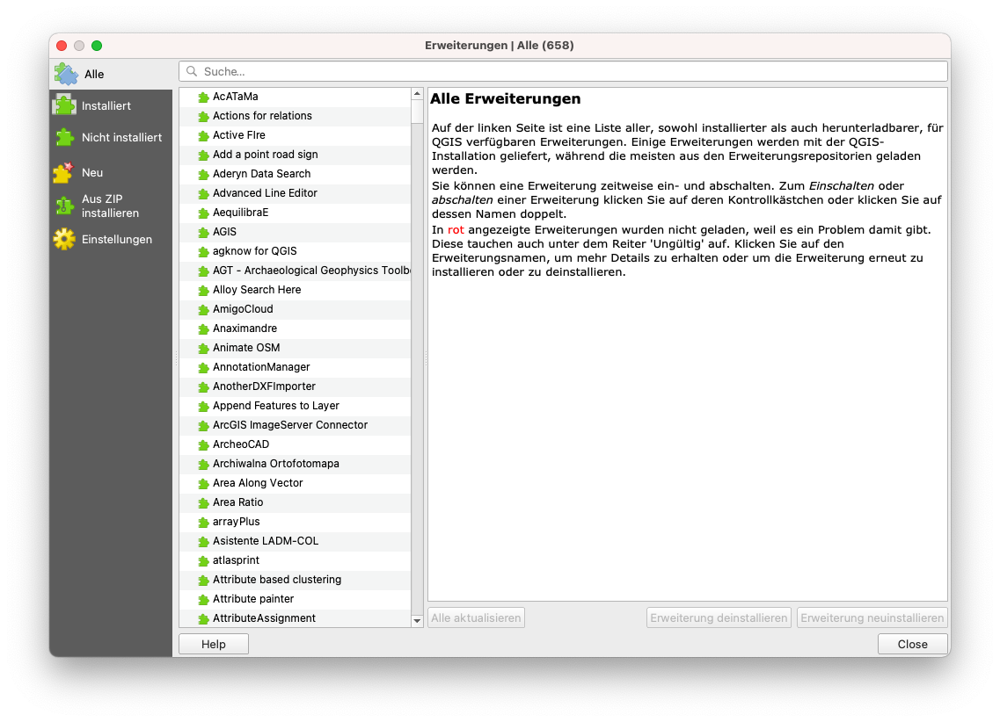

Abbildung 10.1 - Alle Erweiterungen

Abbildung 10.2a - Anzeige experimenteller Plugins

Abbildung 10.2b - Eine Erweiterung mit experimenteller Version

Ein weiterer erwähnenswerter Aspekt ist, dass die Erweiterungsverwaltung eine recht vielseitige Funktionalität hat, die es Entwickler:innen erlaubt, ihre privaten Repositories hinzuzufügen (siehe Abbildung 10.3). 

Abbildung 10.3 - Hinzufügen eines privaten Plugin-Repositorys zu QGIS

Das ist nützlich, wenn z.B. innerhalb Ihrer Organisation ein Bedarf an weiteren Erweiterungen besteht, die aber nicht den Anforderungen von QGIS für das öffentliche Hosting in ihrem offiziellen Repository entsprechen.  Eine nützliche Ressource, wie Sie Ihr eigenes Plugin-Repository einrichten können, finden Sie auf [GIS OPS (englischsprachig)](https://gis-ops.com/qgis-3-plugin-tutorial-set-up-a-plugin-repository-explained/). 

Die einfachere Methode besteht darin, ein Zip-Paket vorzubereiten, das eine Erweiterung enthält und das auf herkömmliche Weise weitergegeben werden kann. Diese Methode ist jedoch nicht zu empfehlen. 

Nachdem Sie entschieden haben, welche Arten von Erweiterungen in Ihrem Manager aufgelistet werden sollen, können Sie auf die Registerkarte `Alle` wechseln und genauer betrachten, wie eine Erweiterung im Plugin Manager erscheint. Suchen Sie zu Demonstrationszwecken das Plugin `Cartographic Line Generalization`.  

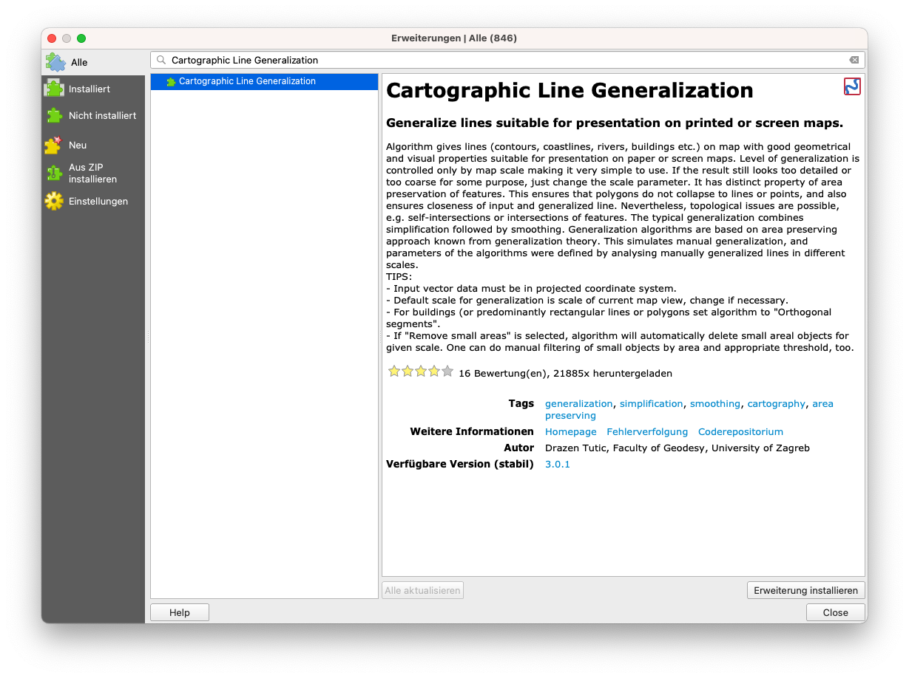

Abbildung 10.4 - Suche nach einer bestimmten Erweiterung im Plugin-Manager

Wie Sie sehen können, befindet sich auf der rechten Seite ein Fenster, das eine Reihe von Informationen anzeigt. Diese Informationen folgen für alle Erweiterungen dem gleichen Schema:

1. Name der Erweiterung und Untertitel
2. Abschnitt "Beschreibung" - je nach Erweiterung kann dieser Abschnitt mehr oder weniger detailliert sein
3. Die Anzahl der Downloads und wie viele Sterne die Erweiterung von der Community erhalten hat
4. Eine Reihe an Tags, die die Erweiterung kategorisieren
5. Eine Reihe von wichtigen Links: die Webseite der Erweiterung, der **Bug-Tracker** und das Coderepositorium
6. Der Name des/der Entwickler:in, sowie der angeschlossenen Organisation. Manchmal wird auch der Name des Projekts, in dem die Erweiterung entwickelt wurde, aufgeführt
7. Die Versionsnummer mit dem Hinweis _stabil_ oder _experimentell_, je nach Fall 
8. Das Logo der Erweiterung

Über den Button `Erweiterung installieren` können Sie die Erweiterung hinzufügen. Sie taucht dann meist als neuer Button in der QGIS-Oberfläche auf. 

Aus Platzgründen ist die Beschreibung im Plugin-Manager meist recht kurz. Mehr Details zur Funktionalität des Plugins findet man üblicherweise auf der verlinkten Homepage. In unserem Fall stellen wir fest, dass die Homepage mit dem Coderepositorium identisch ist - auf Github, aber das ist nicht immer der Fall (siehe Abbildung 10.6). 

Abbildung 10.6a - Homepage des ausgewählten Plugins

Abbildung 10.6b - Detaillierte Metadaten auf der Plugin-Homepage

Ein weiterer sehr wichtiger Aspekt, der bei der Dokumentation eines Plugins hervorzuheben ist, ist die Web-Anzeige des **Bug-Trackers** bzw der **Fehlerverfolgung**. Ein Bug-Tracker-System ist eine Software-Anwendung, die alle gemeldeten Software-Probleme (_Bugs_) aufzeichnet. In unserem Fall wird der Bug Tracker durch das dedizierte Coderepositorium Github unterstützt (siehe Abbildung 10.7).

Figure 10.7 - Bug tracking system in Github for a QGIS plugin

Es würde den Rahmen dieses Moduls sprengen, im Detail darauf einzugehen, wie man ein Software-Problem auf Github meldet, aber es ist wichtig, ein paar Aspekte hervorzuheben. Erstens funktioniert das Open-Source-Ökosystem - sei es für Geodaten oder nicht - am besten, wenn alle Beteiligten ihren Teil aktiv beitragen, d.h. Entwickler:innen programmieren und Benutzer:innen testen und melden identifizierte Probleme zurück. Wenn man einen Blick auf die  Bug-Tracker für [QGIS](https://github.com/qgis/QGIS/issues) oder [GRASS](https://github.com/OSGeo/grass/issues) oder andere Open-Source-Lösungen wirft, wird man intensive Aktivität feststellen. Und das ist gut so, zeigt es doch, dass die Community lebendig ist, dass die Interaktion zwischen Entwickler:innen und Anwender:innen normal funktioniert. Um den Entwicklungsteams Arbeit abzunehmen, gehört es zum guten Ton, dass Sie - bevor sie einen neuen Bug melden - erst die bestehenden Bugs durchsuchen, um Duplikate zu vermeiden.

#### **Quizfragen**

1. Benötigen Sie den vollständigen Namen der Erweiterung, um sie in der Erweiterungsverwaltung zu finden? 
    * _Nein, ein Stichwort reicht aus_
    * Ja
2. Sind sowohl die offiziellen als auch die experimentellen Erweiterungen im gleichen Repository verfügbar?
    * _Ja, sofern die Option 'Auch experimentelle Erweiterungen anzeigen' im Plugin-Manager ausgewählt ist._
    * Nein, für experimentelle gibt es andere Repositories. 
3. Nennen Sie 2 oder 3 Informationen, die in der Dokumentation einer Erweiterung zu finden sind: 
    * Titel & Beschreibung, Anzahl der Downloads, Homepage, Links zum Code-Repository, Name des/der Entwickler:in, eine Kurzbeschreibung

### Teil 2: Einige nützliche QGIS-Erweiterungen **

Erweiterungen können auf unterschiedliche Arten klassifiziert werden. Im Folgenden identifizieren wir zwei Möglichkeiten:

* Nach dem Stand der Entwicklung: 
    * Offiziell - die Erweiterung wird als stabil angesehen, ist gut dokumentiert und kann in einem professionellen Kontext verwendet werden
    * Experimentell - die Erweiterung befindet sich in einem frühen Entwicklungsstadium, sie wird nur zu Testzwecken empfohlen
    * Veraltet - die Erweiterung wird nicht mehr weiterentwickelt, d.h. sie wird nicht mehr auf neue Versionen aktualisiert, das Entwicklungsteam antwortet möglicherweise nicht mehr auf Fehlerberichte. Diese Erweiterungen sollten nur verwendet werden, wenn es keine andere Möglichkeit gibt, das Problem zu lösen.
* Nach Kategorie-Typ: 
    * Vektor
    * Raster
    * Web
    * Datenbank
    * Kartographie

Einige externe Erweiterungen erlauben den Zugriff durch QGIS auf externe Datenbanken, Cloudspeicher und Dienste. In diesem Fall kann es zu zusätzlichen Voraussetzungen kommen - z.B. ein bezahltes Konto für den externen Dienst oder den Cloudspeicher oder ein API-Schlüssel. Ein Beispiel zur Veranschaulichung ist die Erweiterung Planet Explorer von Planet Inc. (siehe Abbildung 10.8).

Abbildung 10.8 - Beispiel für eine Erweiterung, die ein externes Abonnement benötigt, damit sie in QGIS in vollem Umfang funktioniert

Obwohl in der Beschreibung kein Hinweis darauf zu finden ist, offenbart ein Blick auf die Homepage der Erweiterung die Voraussetzungen, damit sie funktioniert: "Planet subscription or trial for accessing and downloading Planet imagery. Don't have a subscription? Contact our [team](https://www.planet.com/contact/) to learn more"

In den folgenden Abschnitten werden wir einige Erweiterungen, die unserer Meinung nach nützlich sein könnten, identifizieren und mit kurzen Beispielen versehen. Dies ist natürlich nur eine kurze Liste aus dem umfangreichen Universum der Erweiterungen, zögern Sie nicht, darüber hinaus zu gehen. 

#### **Discoverz**

Abbildung 10.9a - Die Erweiterung "Discovery"

Discovery ist eine sehr nützliche Erweiterung, mit der Sie in den Attributen Ihrer Vektordaten nach Text suchen können. Die Erweiterung verbindet sich entweder mit einer PostgreSQL/PostGIS-Datenbank, MS SQL Server oder einem Geopackage und sucht nach Text in den angegebenen Spalten.

Um es zu testen, werden wir eine Geopackage-Datei verwenden, die vom Humanitarian Data Exchange vorbereitet wurde und zum [Download](https://data.humdata.org/dataset/hotosm_phl_north_populated_places) zur Verfügung steht. Es handelt sich um eine Vektordatei, die die besiedelten Orte von den Philippinen enthält, zusammen mit Namen und Anzahl der Menschen. Die Rohdaten wurden von OpenStreetMap heruntergeladen. 

Nachdem Sie die Erweiterungsverwaltung benutzt haben, um Discovery zu installieren, sollte eine neue Symbolleiste in Ihrem QGIS sichtbar sein. Lassen Sie uns die Parameter einrichten: Datenquellentyp: Geopackage, Name: Philippines, wählen Sie die Datei entsprechend aus und der Layer wird Populated Places sein, die Suchspalte: name. Wir werden auch zusätzliche Informationen anfordern, die in der Suchleiste angezeigt werden sollen: is_in und population. Dadurch werden wir in der Lage sein, mehrere Dörfer mit demselben Namen zu unterscheiden, wenn diese in unterschiedlichen Provinzen liegen Ihr Discovery-Setup sollte wie in Abbildung 10.9b aussehen. 

Abbildung 10.9b - Einstellen der Erweiterung "Discovery"

Klicken Sie auf OK und lassen Sie uns in der Suchleiste nach "San Roque" suchen (siehe Abbildung 10.9c). 

Abbildung 10.9c - Verwenden der Suche zum schnellen Durchsuchen der Attribute der Vektor-Layer.  

In unserem Beispiel können wir sehen, dass es viele Orte in San Roque auf den Philippinen gibt. Wählen Sie einen Eintrag in dieser Liste aus und QGIS zoomt ihn heran (siehe Abbildung 10.9d).

Abbildung 10.9d - Heranzoomen auf die Geometrie des ausgewählten Elements in der Suchleiste.  

Die Erweiterung bietet die Möglichkeit, Vektoren per Textsuche gekoppelt mit verschiedenen Filtern, wie z. B. einer Bounding Box, oder verschiedenen SQL-Abfragen zu finden. 

Eine ausführliche Beschreibung der Fähigkeiten des Plugins sowie ein umfassenderes Tutorial finden Sie auf der [offiziellen Website (englischsprachig)](https://www.lutraconsulting.co.uk/projects/discovery/). 

#### **Polygon Divider**

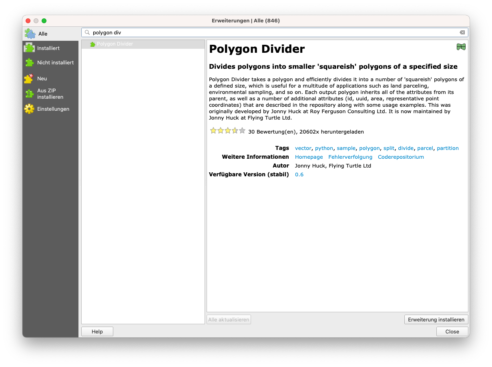

Abbildung 10.10a - Die Erweiterung Polygon Divider

Polygon Divider ist eine weitere nützliche Erweiterung von QGIS, die es ermöglicht, einen Vektor-Layer vom Typ Polygon effizient in eine Anzahl von "quadratischen" Polygonen einer definierten Größe zu unterteilen.  

Dieses Werkzeug kann für eine Vielzahl von Anwendungen nützlich sein, z.B. für die Parzellierung von Grundstücken, für Umweltproben und so weiter.

Lassen Sie uns dieses Werkzeug auf unsere Region Mittelsachsen anwenden und sehen, welche Ergebnisse wir erhalten. 

Installieren Sie mit der Erweiterungsverwaltung den Polygon Divider. Nach der Fertigstellung erscheint ein neues Piktogramm in Ihrer QGIS-Symbolleiste und ein neues Fenster öffnet sich (siehe Abbildung 10.10b). 

Abbildung 10.10b - Fenster der Erweiterung "Polygon Divider

Wählen Sie als Eingabe-Layer den Polygon-Layer Mittelsachsen, speichern Sie die Ausgabedatei als Mittelsachsen_polygone, wählen Sie 1000000 (d.h. alle Teilungen werden etwa 100 Hektar groß sein), wählen Sie als Schnittrichtung links nach rechts und die Toleranz 1. Das Ergebnis sollte wie in Abbildung 10.10c aussehen. 

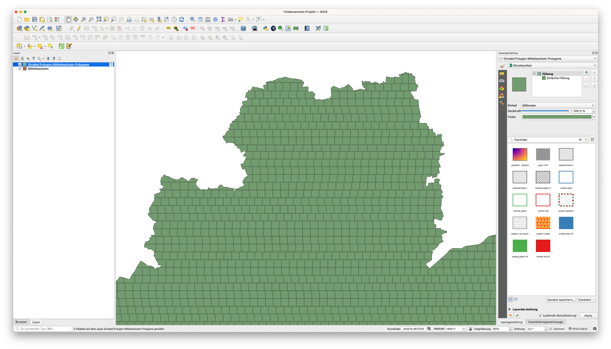

Abbildung 10.10c - Ergebnis der Ausführung der Erweiterung Polygon Divider auf dem Vektorlayer Mittelsachsen

Eine ausführliche Beschreibung der Fähigkeiten der Erweiterung sowie eine umfassendere Anleitung finden Sie auf der Polygon Divider [Website (englischsprachig)](https://github.com/jonnyhuck/RFCL-PolygonDivider). 

#### Load Them All

Abbildung 10.11a - Die Erweiterung "Load Them All"

Dies ist eine nützliche Erweiterung, wenn Sie mehrere Layer (Vektoren und Raster) haben, die Sie in QGIS laden müssen. Die Erweiterung erlaubt es Ihnen, automatisch alle auf einmal zu laden, aber der große Vorteil ist, dass es Ihnen eine Vielzahl von Filtern zur Verfügung stellt, wie z.B. alphanumerisch (nach Namen), Änderungsdatum, Bounding Box (von Hand eingefügte Koordinaten), Art der Geometrie usw. 

Um es zu testen, werden wir Dateien aus dem vorherigen Modul 8 laden. Unter den Vektordaten werden wir die Shapefiles auswählen, die vor einem ausgewählten Datum bearbeitet wurden, bei den Raterdaten werden wir einen alphanumerischen Filter wählen - der Name des geladenen Rasters sollte mit LandCover beginnen (siehe Abbildung 10.11_b). Die Screenshots beziehen sich hier auf die Version dieses Trainings, die für die Philippinen erstellt wurde - Sie können natürlich analog für die deutschen Daten vorgehen.

Bild 10.11b - Einstellen der Parameter für die Erweiterung Load Them All (Vektoren und Raster)

Die oben angegebenen Parameter stellen ein Beispiel auf der Grundlage der verfügbaren Struktur dar. Sie können sie nach eigenem Ermessen auf der Grundlage Ihrer Dateien auf Ihrem Computer ändern. 

Beachten Sie, dass nach Abschluss der 

Die Ergebnisse der Ausführung der Erweiterung Load Them All mit den oben genannten Parametern sind in Abbildung 10.11c (Vektoren) und 10.11d (Raster) dargestellt. 

Abbildung 10.11c - Verwendung der Erweiterung Load Them All zum Laden mehrerer Vektoren

Bild 10.11d - Erweiterung "Load Them All" zum Laden mehrerer Raster

Eine ausführliche Beschreibung der Funktionen der Erweiterungen sowie eine umfassendere Anleitung finden Sie auf der Seite Load the All [Website (englischsprachig)](https://github.com/gacarrillor/loadthemall). 

#### Raster Tracer

Bild 10.12a - Die Erweiterung Raster tracer

Der Raster Tracer kann eine sehr nützliche Erweiterung sein, wenn Sie Vektordaten aus einer nicht maschinenlesbaren Karte extrahieren wollen. Diese Tätigkeit wird in der Regel an gescannten älteren topographischen Karten durchgeführt, aus denen wir verschiedene Informationen extrahieren wollen, um sie in einem Informationssystem zu speichern, zu verarbeiten und zu visualisieren. Ein gutes Beispiel ist die Digitalisierung von topografischen Karten, um Höhenlinien zu extrahieren und in einem GIS ein 3D-Modell des Reliefs zu erstellen. 

Obwohl dies heute, mit dem Aufkommen digitaler Geländemodelle, die aus Satellitenbildern gewonnen werden, kein Thema mehr ist, wird die Digitalisierung immer noch ausgiebig genutzt. Die prominenteste Anwendung ist die Extraktion von Informationen aus alten Karten. Historische Karten bieten uns einen Einblick in die Zeit, bevor wir Satelliten hatten, um unsere Wälder und Landbedeckungsveränderungen zu überwachen. Da diese kartografischen Dokumente ursprünglich auf Papier waren, muss man, um die Informationen mit moderner Technologie nutzen zu können, digitalisieren.

Suchen Sie mit Hilfe der Erweiterungsverwaltung den Raster Tracer und installieren Sie ihn. Diese Erweiterung fügt QGIS eine halbautomatische Fähigkeit hinzu, Linienmerkmale der zugrundeliegenden Rasterkarte zu verfolgen, indem man auf ihre Wendepunkte auf der Rasterkarte klickt. Nach der Installation sollte ein neues Piktogramm in Ihrer Symbolleiste erscheinen. 

Um die Erweiterung verwenden zu können, benötigen wir mindestens 2 Layer - einen Raster-Layer und einen Vektor-Layer, der die Daten erfasst. Wir haben hier beispielhaft eine topographische Karte von den Philippinen, 1:50k auf der offiziellen Website der National Mapping and Resources Information Authority gefunden. Leider ist die [Karte](http://www.namria.gov.ph/3131-IIIAngelesCity.html) nicht georeferenziert. Zu Demonstrationszwecken machen wir weiter, ohne dieses Problem zu beheben, aber bitte beachten Sie: Vor der Digitalisierung von Vektoren aus einer Rasterkarte ist es entscheidend, dass diese korrekt georeferenziert ist. Andernfalls ist die - durchaus zeitaufwendige - Arbeit nutzlos. 

Bringen Sie also die topographische Karte von Angeles City ein (`Layer - Layer hinzufügen - Rasterlayer hinzufügen...`). 

Als nächstes erstellen wir einen MultiString-Vektor-Layer, in dem alle Linienobjekte, die wir aus der topographischen Karte extrahieren, gespeichert werden (Layer - Layer erstellen - Neuer GeoPackage Layer..). Erstellen Sie einen MultiLine-Vektor und speichern Sie ihn unter dem Namen tracer_lines. Wählen Sie die Projektion EPSG: 3123 - die offizielle Projektion der Region. Starten Sie den Bearbeitungsmodus darauf (`Rechtsklick - Bearbeitungsstatus umschalten`). 

Klicken Sie auf das Piktogramm RasterTracer und stellen Sie die Parameter ein, wie in Abbildung 10.12b. Wählen Sie die Farbe der Konturlinien mit Hilfe des Farbwählers, der sich beim Anklicken der Option Trace color öffnet. 

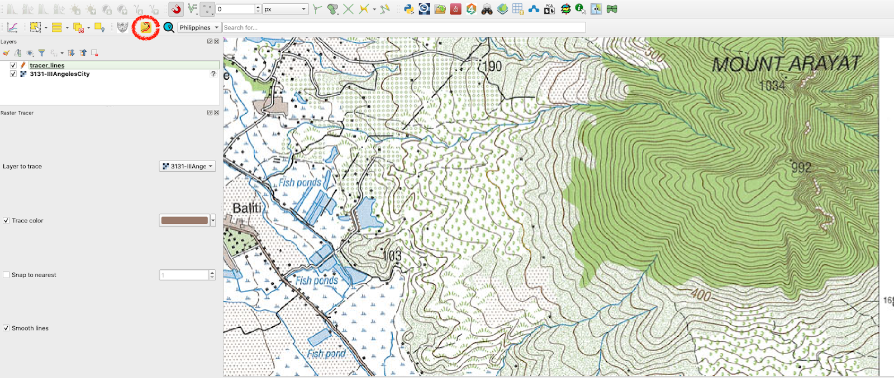

Abbildung 10.12b - Einstellen der RasterTracer-Parameter

Jetzt müssen Sie nur noch mit dem Digitalisieren beginnen. Nachdem Sie sich vergewissert haben, dass Ihr Vektorraster bearbeitbar ist und die Erweiterung durch erneutes Anklicken aktiviert ist, klicken Sie auf die Wendepunkte der Konturlinie, die wir extrahieren wollen (siehe Abbildung 10.112c). 

Abbildung 10.12c - Klicken auf die Wendepunkte zum Zeichnen der Linie mit RasterTracer

Abbildung 10.12d zeigt das Ergebnis. 

Abbildung 10.12d - Halbautomatisch gezeichnete Linie durch Folgen der angegebenen Farbe. 

#### Active Fire

Abbildung 10.13a - Die Erweiterung "Active Fire"

Erweiterungen sind nicht nur dafür gedacht, mit Daten zu arbeiten, die Sie selbst haben, sondern auch, um Datensätze einzubinden, die von anderen Institutionen oder Personen produziert und über standardisierte Web-Mapping-Dienste zur Verfügung gestellt werden.

Ein gutes Beispiel ist die Erweiterung Active Fire. Dieses wurde entwickelt, um QGIS-Benutzer:innen die Möglichkeit zu geben, schnell, intuitiv und ohne jeglichen Aufwand Brände der letzten 24 Stunden in einer beliebigen Region von Interesse anzuzeigen. Die Feuerdaten werden von der NASA produziert und für jede:n frei verfügbar gemacht. Die Rohdaten stammen von 2 Satelliten: dem Moderate Resolution Imaging Spectroradiometer ([MODIS](https://modis.gsfc.nasa.gov/)) ([MCD14DL](https://earthdata.nasa.gov/earth-observation-data/near-real-time/firms/c6-mcd14dl)) und der Visible Infrared Imaging Radiometer Suite ([VIIRS](https://www.jpss.noaa.gov/viirs.html)) 375 m ([VNP14IMGTDL_NRT](https://earthdata.nasa.gov/earth-observation-data/near-real-time/firms/v1-vnp14imgt) und [VJ114IMGTDL_NRT](https://earthdata.nasa.gov/earth-observation-data/near-real-time/firms/vj114imgtdl-nrt)). 

Um sie zu finden, öffnen Sie die Erweiterungsverwaltung und schreiben Sie fire. Nach der Installation erscheint ein neues rotes Piktogramm in Ihrer QGIS-Symbolleiste. Wenn Sie darauf klicken, erscheint ein neues Fenster, in dem Sie auswählen können, von welchem Sensor Sie die Feuerpixel in den letzten 24 Stunden ermittelt haben wollen (siehe Abbildung 10.13b).

Abbildung 10.13b - Verwendung der Erweiterung Active Fire zum Laden von NASA-Feuerprodukten in QGIS 

Die Erweiterung berechnet auch die Anzahl der registrierten Feuerpixel. 

#### qgis2web

Abbildung 10.14a - Das qgis2web Plugin

Bei qgis2web handelt es sich um eine Erweiterung, mit der Benutzer:innen QGIS-Projekte als **Webkarte** exportieren können. 

Eine Webkarte ist eine interaktive Darstellung von geografischen Informationen, die in Browsern geöffnet werden kann. Wir interagieren täglich mit solchen Darstellungen, man denke nur an OpenStreetMap, Google Maps, Waze, etc. 

Dieses Plugin ermöglicht uns, sehr schnell eine Karte vorzubereiten und zu exportieren, die im Internet veröffentlicht werde kann. Dies funktioniert über die Web-Technologien von [OpenLayer3](https://openlayers.org/) oder [Leaflet](https://leafletjs.com/). Qgis2web tut sein Bestes, um ein QGIS-Projekt zu interpretieren und HTML, Javascript und CSS zu exportieren, um eine Webkarte zu erstellen, die so nah wie möglich am QGIS-Projekt ist.

Nach der Installation des qgis2web-Plugins erscheint ein neues Icon in der QGIS-Symbolleiste, wie es auch im Plugin-Manager abgebildet ist. Wenn Sie darauf klicken, öffnet sich ein Fenster, wie in Abbildung 10.14b.

Abbildung 10.14b - Auswählen, was Ihre Karte im Browser zeigen soll. 

Die Benutzeroberfläche ist intuitiv, aber bedenken Sie, je größer die Datensätze sind, desto länger dauert die Vorbereitung und der Export. Nachdem Sie ausgewählt haben, wohin exportiert werden soll, klicken Sie auf den Button "Export", um den Vorgang abzuschließen (siehe Abbildung 10.14c).

Der exportierte Ordner enthält mehrere Dateien, je nachdem, welche WebMapping-Technologie gewählt wurde - Leaflet oder Openlayers3. Ein Doppelklick auf die Datei index.html öffnet die exportierte Karte in Ihrem Browser (siehe Abbildung 10.14d). 

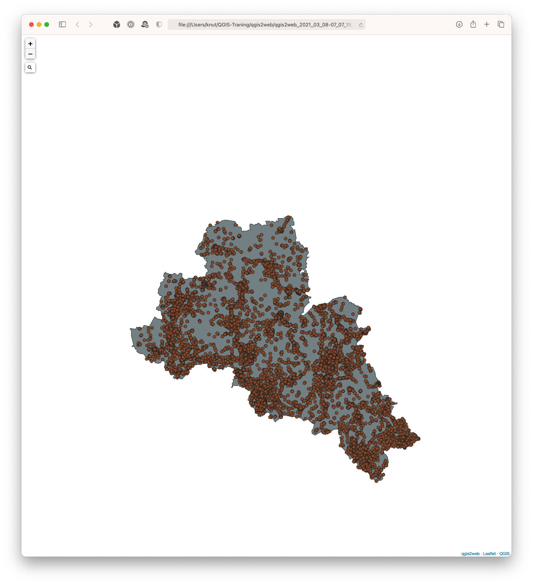

Abbildung 10.14d - Öffnen der Datei index.html in Ihrem Browser 

Eine detaillierte Beschreibung der Fähigkeiten des Plugins, zusammen mit einem umfassenderen Tutorial, finden Sie auf der qgis2web [Website (englischsprachig)](https://github.com/tomchadwin/qgis2web). 

#### DataPlotly

#### DatenPlotly

Abbildung 10.14a - Das DataPlotly-Plugin

Das DataPlotly-Plugin wurde speziell entwickelt, um interaktive Graphen der geladenen Vektordaten in QGIS zu unterstützen. Das Plugin basiert auf einer Python-Bibliothek namens Plotly, die sehr leistungsfähig ist und die Möglichkeit bietet, eine Vielzahl von interaktiven Diagrammen zu erstellen: Liniendiagramme, Streudiagramme, Flächendiagramme, Balkendiagramme, Fehlerbalken, Boxplots, Histogramme, Heatmaps, Subplots, mehrere Achsen, Polardiagramme und Blasendiagramme. Weitere Informationen zu dieser speziellen py-Bibliothek finden Sie auf der offiziellen [Website](https://plotly.com/python/). 

Installieren Sie das Plugin über den Plugin-Manager und laden Sie einige Vektorlayer zur Visualisierung. In den Screenshots werden wir uns wieder auf das Beispiel von den Philippinen beziehen, Sie können aber auch hier wieder analog für Mittelsachsen vorgehen (nutzen Sie dafür die Daten aus Modul 8). Laden Sie zwei unterschiedliche Layer: 

* Wasserstraßen (Linien);
* Besiedelte Orte (Punkte);

Lassen Sie uns ein interaktives Diagramm vorbereiten, das zeigt, wie viele Flüsse vs. Kanäle vs. Bäche vs. Abwasserkanäle wir in unserem Datensatz haben.

Wenn Sie auf das jeweilige Piktogramm klicken, öffnet sich ein neues Fenster, siehe Abbildung 10.24. 

Abbildung 10.15b - DataPlotly-Fenster/Panel.

Als nächstes stellen Sie die Parameter ein, wie in Abbildung 10.15c. 

Abbildung 10.15c - Einrichten der Parameter für das Kreisdiagramm, das die Arten von Wasserstraßen darstellt

Wählen Sie den Wasserwege-Vektorlayer, aus dem die geplotteten Daten extrahiert werden sollen, Grouping field - fclass, Y-field - length. Um sicherzustellen, dass alle Segmente eine Länge haben, gehen Sie in die Attributtabelle des Vektorlayers und erstellen Sie mit dem Feldrechner eine neue Spalte mit der Formel `round($length)` wie Sie es auch schon in Modul 8 gelernt haben.  Wählen Sie anschließend beim Plot-Typ 'Singe Plot' und klicken Sie unten rechts auf die Schaltfläche 'Create Plot'. Ihr Ergebnis sollte wie in Abbildung 10.15d aussehen. 

Abbildung 10.15d - Kreisdiagramm der Wasserstraßenarten nach Länge.

Wenn Sie mit der Maus über jedes Kreisdiagrammsegment fahren, erscheint ein Popup-Fenster, das den Namen (aus der Spalte fclass), die Summe der Längen und den prozentualen Anteil an der Gesamtsumme anzeigt. 

Eine wichtige Funktionalität von DataPlotly ist die Verbindung mit der QGIS Kartenansicht. Klicken Sie auf einen der Abschnitte des Kreisdiagramms und Sie sollten sehen, dass einige Features **automatisch** in der Kartenansicht ausgewählt werden (siehe Abbildung 10.15e). 

Abbildung 10.15e - Hervorhebung von Daten in DataPlotly und der Kartenansicht

Das bedeutet auch, dass Sie Ihren Plot interaktiv aktualisieren können, um z. B. nur die ausgewählten Features anzuzeigen. Um das zu testen, markieren Sie nur einen Teil der Wasserstraßen in Ihrer Kartenansicht, dann gehen Sie in DataPlotly auf den ersten Reiter und setzen bei den Plot-Parametern ein Häkchen bei der Option 'only selected features' (siehe Abbildung 10.15f). 

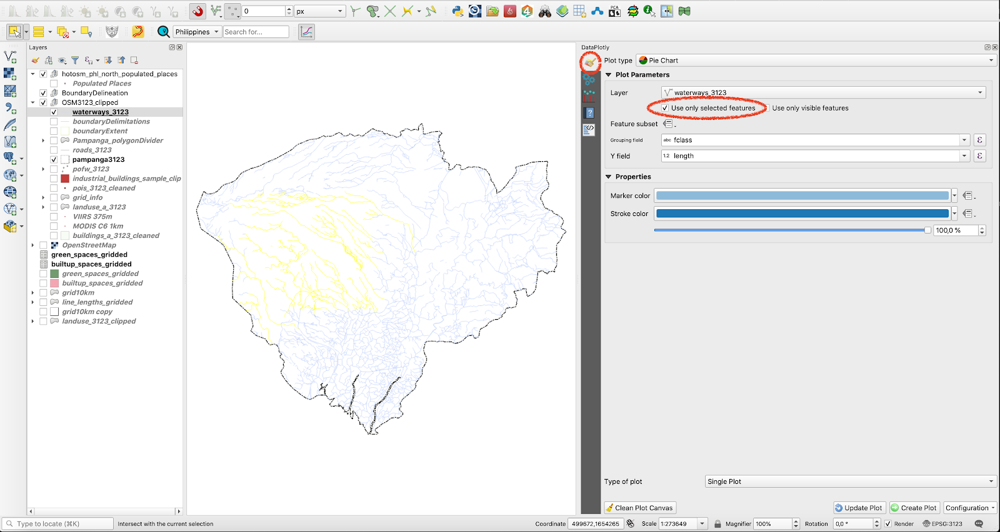

Abbildung 10.15f - Interaktives Aktualisieren des Plots, um nur ausgewählte Features anzuzeigen.   

Klicken Sie anschließend auf die Schaltfläche "Update plot". Das Ergebnis sollte ungefähr so aussehen wie in Abbildung 10.29. 

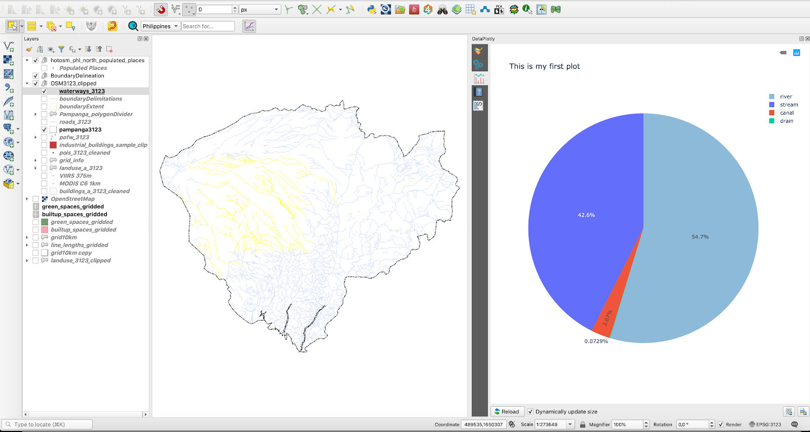

Abbildung 10.15g - Aktualisieren Sie den Plot, um nur die ausgewählten Features auf der Kartenleinwand anzuzeigen. 

Darüber hinaus bietet DataPlotly eine Exportfunktion - entweder in eine .pdf-Datei oder in eine .html-Datei. Die entsprechenden Schaltflächen befinden sich am unteren, rechten Rand des DataPlotly-Fensters, siehe Abbildung 10.15h. 

Abbildung 10.15h - Exportmöglichkeiten von DataPlotly

Der Export als HTML-Datei ermöglicht es, eine Vielzahl von Datenplots für die Veröffentlichung im Internet vorzubereiten (siehe Abbildung 10.15i).

Abbildung 10.15i - Verwendung eines Browsers zum Öffnen der von DataPlotly exportierten HTML-Datei.  

Das Plugin ist auch sehr gut dokumentiert und es gibt ein Hilfemenü für jeden Plot-Typ. Sie können darauf zugreifen, indem Sie auf den vierten Reiter in DataPlotly klicken (siehe Abbildung 10.15j).

Abbildung 10.15j - Hilfemenü für jeden Plot-Typ, das über das Plugin-Fenster zugänglich ist. 

Durch die direkte, interaktive Verknüpfung mit den in QGIS geladenen Datensätzen können beim Erstellen eines Plots auch Ausdrücke verwendet werden. Um diese Fähigkeit zu testen, werden wir einen Plot auf Basis des Vektorlayers "Besiedelte Orte" erstellen. Stellen Sie die folgenden Parameter ein: Typ: Balkenplot, Layer: Besiedelte Orte, X_Feld: is_in, Y_Feld - öffnen Sie den Feldrechner und fügen Sie `"Bevölkerung" ist nicht null ` ein (siehe Abbildung 10.15k und Abbildung 10.15l). 

Abbildung 10.15k - Öffnen des Feldeditors in DataPlotly basierend auf Attributen des ausgewählten QGIS-Layers, um einen Ausdruck zur Filterung dessen, was der Plot anzeigen wird, anzuwenden

Abbildung 10.15l - Einfügen eines Ausdrucks in den Feldrechner 

Das Ergebnis sollte wie in Abbildung 10.35 aussehen. . 

Abbildung 10.15m - DataPlotly-Ergebnis der Filterung nach Ausdruck

Wenn wir diesen Plot interpretieren sollen, zeigt er uns, dass unter allen Provinzen, in denen besiedelte Orte registriert wurden, das Attribut Bevölkerung nur in 3 Regionen überhaupt gesetzt ist: Alaminos, Sual, und Bagac. Man kann diese Schlussfolgerung leicht testen, indem man in die Attributtabelle schaut.

DataPlotly bietet auch die Möglichkeit, Subplots zu erstellen, was bedeutet, dass mehrere Plots in einer einzigen Abbildung dargestellt werden können. 

Um diese Funktionalität zu testen, werden wir den Vektorlayer "Besiedelte Orte" verwenden. Wir haben die folgenden Attribute von Interesse: `place` = Typ des Ortes (Stadt, Dorf, etc.), `is_in` = Name der nächstgrößeren Verwaltungseinheit, zu der er gehört (falls bekannt), `population` = (Bevölkerungszahl) und `name` = der Name des Ortes. Wir werden in der gleichen Abbildung zwei Datendiagramme integrieren: eines, um uns zu zeigen, wie viele der besiedelten Orte in jede Kategorie von `place` fallen und das zweite, wie sich die Bevölkerung auf die 4 Arten von `place` aufteilt.

Abbildung 10.15n - Einstellen der Parameter für die erste Darstellung - Siedlungstypen nach ihrer Anzahl

Abb. 10.15o - Einstellen der Parameter für das zweite Diagramm - Siedlungstypen nach Einwohnerzahlen.

Abbildung 10.15p - Subplots in einer Reihe

Eine ausführliche Beschreibung der Möglichkeiten des Plugins sowie ein umfassenderes Tutorial finden Sie auf der DataPlotly [Website (englischsprachig)](https://github.com/ghtmtt/DataPlotly). 

#### QuickMapServices / OpenLayers 

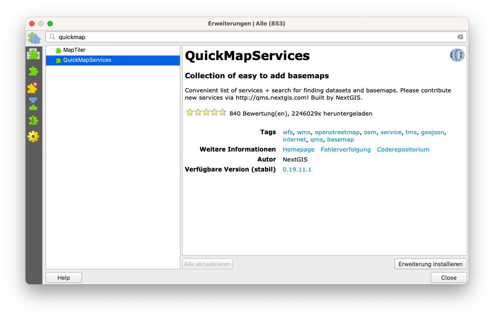

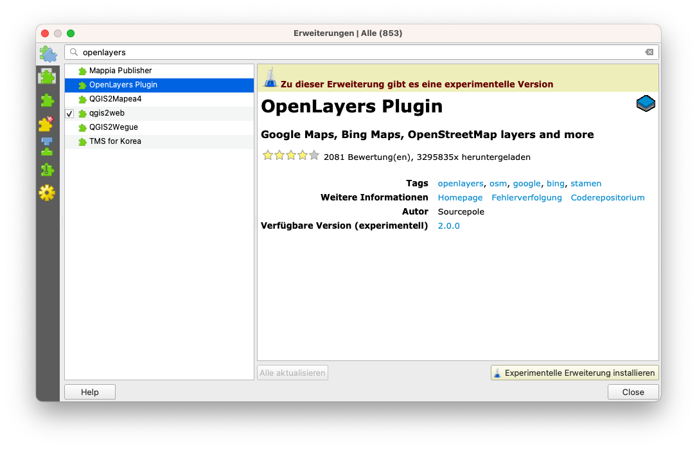

Abbildung 10.16a - QuickMapServices-Erweiterung; 10.16b - OpenLayers-Erweiterung

Diese beiden Erweiterungen sind außerordentlich nützlich, wenn Sie Basiskarten zu Ihrem QGIS-Projekt hinzufügen möchten. So ein Basislayer hilft zum Beispiel, um die korrekte Positionierung eines neu Vektorlayers zu überprüfen. QuickMapServices erlabut es uns, mit nur 2 Klicks Basiskarten-Layer von verschiedenen Anbietern, wie OpenStreetMap, NASA, Bing oder Google Maps, in seinen Desktop-Client zu laden. 

Installieren Sie beide Erweiterungen über die Erweiterungsverwaltung. Die Erweiterungen erscheinen dann im Menü unter "Web" (siehe Abbildung 10.16b). 

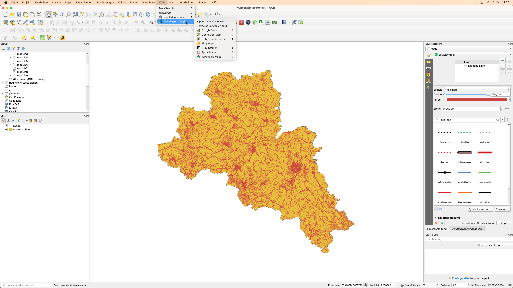

Abbildung 10.16b - Menüs der Erweiterungen QuickMapServices und OpenLayers.

Die Verwendung dieser Plugins ist ziemlich einfach: Sie klicken einfach auf den Layer, den Sie in Ihre Kartenansicht bringen möchten, und die Erweiterung macht den Rest.

Abbildung 10.16c zeigt die Stamen Toner Karte als Basiskarte für einige der in Modul 8 und 9 verwendeten Daten aus Mittelsachsen.

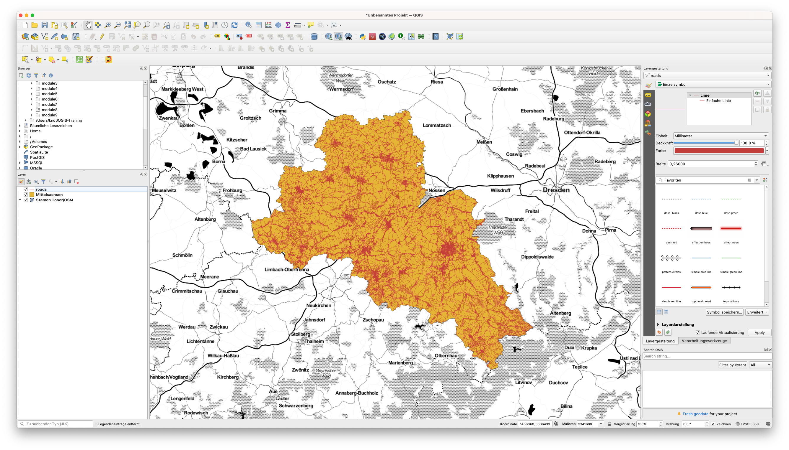

Abbildung 10.16c - Verwendung der OpenLayers-Erweiterung. 

Abbildung 10.16d zeigt die perfekte Ausrichtung der in die QGIS Kartenansicht geladenen Basiskarte unter Verwendung der OpenLayers Erweiterung. Obwohl die 2 Layer nicht in der gleichen Projektion sind, erlaubt QGIS eine Projektion on-the-fly, so dass eine Überlagerung möglich ist. Hier sehen wir auch, dass die Stamen Toner Karte eine relativ reduzierte Ansicht nutzt und viele der kleineren Straßen in der Darstellung auslässt.

Abbildung 10.16d - Geladene Vektordaten (Straßen), überlagert mit einer Stamen Basiskarte 

Eine detaillierte Beschreibung der Fähigkeiten der Erweiterungen sowie ein umfassenderes Tutorial finden Sie auf deren (englischsprachigen) Webseite: [QuickMapServices](https://nextgis.com/blog/quickmapservices/) und [OpenLayer Plugin](https://github.com/sourcepole/qgis-openlayers-plugin). 

#### Table to Style

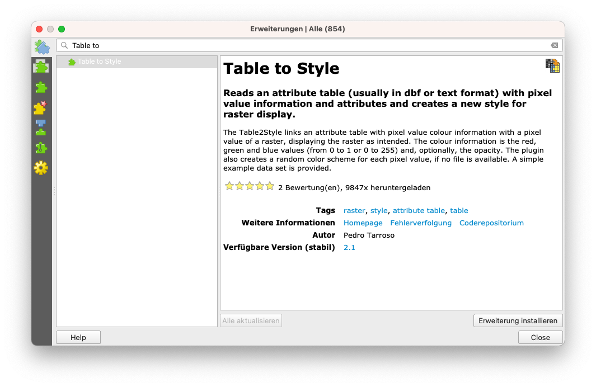

Abbildung 10.17a - Das Table to Style-Plugin

Dieses Plugin ist nützlich für Situationen, in denen Sie einen Rasterdatensatz haben, in dem bestimmte Pixelwerte zur Kategorisierung von Daten genutzt werden. Wir kennen das aus dem Modul 9 in dem wir mit den Landbedeckungsdaten gearbeitet haben (siehe Abbildung 10.17b). 

Abbildung 10.17b - Beispielhafte Situationen, in denen Pixelwerte einen Wert kategorisieren 

Vom Anbieter dieses Produkts, das auf Satellitenbildern basiert, werden auch die Pixelwerte und die zugehörigen Farben zur Verfügung gestellt: 

<table>
  <tr>
   <td><strong>Value</strong>
   </td>
   <td><strong>Color</strong>
   </td>
   <td><strong>Description</strong>
   </td>
  </tr>
  <tr>
   <td>0
   </td>
   <td>#282828
   </td>
   <td>Unknown. No or not enough satellite data available.
   </td>
  </tr>
  <tr>
   <td>20
   </td>
   <td>#FFBB22
   </td>
   <td>Shrubs. Woody perennial plants with persistent and woody stems and without any defined main stem being less than 5 m tall. The shrub foliage can be either evergreen or deciduous.
   </td>
  </tr>
  <tr>
   <td>30
   </td>
   <td>#FFFF4C
   </td>
   <td>Herbaceous vegetation. Plants without persistent stem or shoots above ground and lacking definite firm structure. Tree and shrub cover is less than 10 %.
   </td>
  </tr>
  <tr>
   <td>40
   </td>
   <td>#F096FF
   </td>
   <td>Cultivated and managed vegetation / agriculture. Lands covered with temporary crops followed by harvest and a bare soil period (e.g., single and multiple cropping systems). Note that perennial woody crops will be classified as the appropriate forest or shrub land cover type.
   </td>
  </tr>
  <tr>
   <td>50
   </td>
   <td>#FA0000
   </td>
   <td>Urban / built up. Land covered by buildings and other man-made structures.
   </td>
  </tr>
  <tr>
   <td>60
   </td>
   <td>#B4B4B4
   </td>
   <td>Bare / sparse vegetation. Lands with exposed soil, sand, or rocks and never has more than 10 % vegetated cover during any time of the year.
   </td>
  </tr>
  <tr>
   <td>70
   </td>
   <td>#F0F0F0
   </td>
   <td>Snow and ice. Lands under snow or ice cover throughout the year.
   </td>
  </tr>
  <tr>
   <td>80
   </td>
   <td>#0032C8
   </td>
   <td>Permanent water bodies. Lakes, reservoirs, and rivers. Can be either fresh or salt-water bodies.
   </td>
  </tr>
  <tr>
   <td>90
   </td>
   <td>#0096A0
   </td>
   <td>Herbaceous wetland. Lands with a permanent mixture of water and herbaceous or woody vegetation. The vegetation can be present in either salt, brackish, or fresh water.
   </td>
  </tr>
  <tr>
   <td>100
   </td>
   <td>#FAE6A0
   </td>
   <td>Moss and lichen.
   </td>
  </tr>
  <tr>
   <td>111
   </td>
   <td>#58481F
   </td>
   <td>Closed forest, evergreen needle leaf. Tree canopy >70 %, almost all needle leaf trees remain green all year. Canopy is never without green foliage.
   </td>
  </tr>
  <tr>
   <td>112
   </td>
   <td>#009900
   </td>
   <td>Closed forest, evergreen broad leaf. Tree canopy >70 %, almost all broadleaf trees remain green year round. Canopy is never without green foliage.
   </td>
  </tr>
  <tr>
   <td>113
   </td>
   <td>#70663E
   </td>
   <td>Closed forest, deciduous needle leaf. Tree canopy >70 %, consists of seasonal needle leaf tree communities with an annual cycle of leaf-on and leaf-off periods.
   </td>
  </tr>
  <tr>
   <td>114
   </td>
   <td>#00CC00
   </td>
   <td>Closed forest, deciduous broad leaf. Tree canopy >70 %, consists of seasonal broadleaf tree communities with an annual cycle of leaf-on and leaf-off periods.
   </td>
  </tr>
  <tr>
   <td>115
   </td>
   <td>#4E751F
   </td>
   <td>Closed forest, mixed.
   </td>
  </tr>
  <tr>
   <td>116
   </td>
   <td>#007800
   </td>
   <td>Closed forest, not matching any of the other definitions.
   </td>
  </tr>
  <tr>
   <td>121
   </td>
   <td>#666000
   </td>
   <td>Open forest, evergreen needle leaf. Top layer- trees 15-70 % and second layer- mixed of shrubs and grassland, almost all needle leaf trees remain green all year. Canopy is never without green foliage.
   </td>
  </tr>
  <tr>
   <td>122
   </td>
   <td>#8DB400
   </td>
   <td>Open forest, evergreen broad leaf. Top layer- trees 15-70 % and second layer- mixed of shrubs and grassland, almost all broadleaf trees remain green year round. Canopy is never without green foliage.
   </td>
  </tr>
  <tr>
   <td>123
   </td>
   <td>#8D7400
   </td>
   <td>Open forest, deciduous needle leaf. Top layer- trees 15-70 % and second layer- mixed of shrubs and grassland, consists of seasonal needle leaf tree communities with an annual cycle of leaf-on and leaf-off periods.
   </td>
  </tr>
  <tr>
   <td>124
   </td>
   <td>#A0DC00
   </td>
   <td>Open forest, deciduous broadleaf. Top layer- trees 15-70 % and second layer- mixed of shrubs and grassland, consists of seasonal broadleaf tree communities with an annual cycle of leaf-on and leaf-off periods.
   </td>
  </tr>
  <tr>
   <td>125
   </td>
   <td>#929900
   </td>
   <td>Open forest, mixed.
   </td>
  </tr>
  <tr>
   <td>126
   </td>
   <td>#648C00
   </td>
   <td>Open forest, not matching any of the other definitions.
   </td>
  </tr>
  <tr>
   <td>200
   </td>
   <td>#000080
   </td>
   <td>Oceans, seas. Can be either fresh or salt-water bodies.
   </td>
  </tr>
</table>

Wenn ein neuer Datensatz - Raster oder Vektor - geladen wird, weist QGIS ihm eine zufällige visuelle Darstellung zu. Es liegt an den Benutzer:innen, geeignete Farben und Stylisierungen der Daten zu definieren. Weitere Informationen zum Styling von Layern finden Sie in Modul 4. 

Um das Table to Style Plugin zu testen, verwenden wir den Rasterdatensatz LandCover2019, der auch in Modul Nr. 9 verwendet wird. Wenn Sie das Raster in QGIS laden, sollten Sie eine ähnliche Darstellung wie in Abbildung 10.17c erhalten.

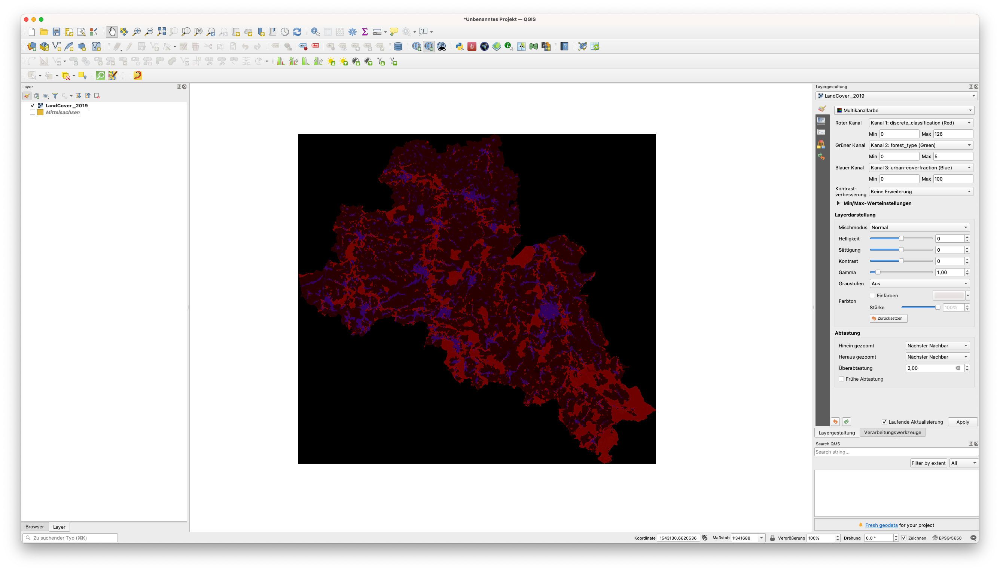

Abbildung 10.17c - QGIS ordnet den Pixelwerten zufällig Farben zu

Vom Datenanbieter wissen wir, dass es für jeden Pixelwert eine eindeutig zugewiesene Farbe gibt und im Bereich Landbedeckung stellen diese Farben bereits Konventionen dar, genau wie in der klassischen Kartographie. Wälder werden mit einer bestimmten Art von Grün dargestellt, Weiden mit einer anderen, Meer wird mit einer anderen Art von Blau dargestellt als Binnengewässer und so weiter. Im schlimmsten Fall müsste man alle diese Farben manuell zuordnen. Das Table to Style Plugin löst dieses Problem jedoch automatisch und in Sekundenschnelle. 

Gehen Sie in die Erweiterungsverwaltung und installieren Sie das Table to Style Plugin. Es erscheint ein neues Symbol in Ihrer Symbolleiste. Wenn Sie es öffnen, sollte ein Einstellungsfenster erscheinen, wie in Abbildung 10.17d. 

Abbildung 10.17d - Table2style-Fenster

Das Plugin benötigt 2 Parameter - eine Rasterebene und eine Attributtabelle mit Pixelwerten, Beschriftung und Farbcodes in einem der drei Systeme: RGB, HSV oder Hex. In unserer Tabelle oben haben wir Hex-Codes für die zugeordneten Farben. Laden Sie die CSV-Datei wie gewohnt als Layer - die Daten haben dabei natürlich keine Geometrie. Die Tabelle der LandCover-Werte sollte wie in Abbildung 10.17e aussehen. 

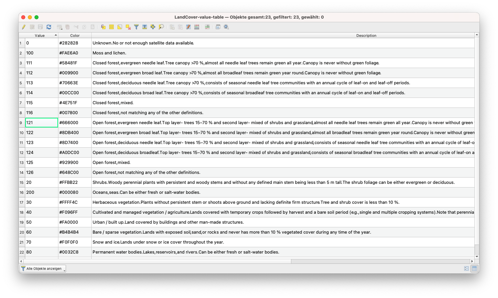

Bild 10.17e - Attributtabelle mit Pixelwerten, Farbcodes und Beschreibung für Land Cover

Werfen wir nun einen Blick auf den Rasterdatensatz. Die Table to Style Erweiterung funktioniert nur bei einem 1-Band-Raster, da es sich um eine 1 zu 1 Verbindung handelt: Pixelwert - Farbcode. Wenn mehr Kanäle vorhanden wären, wüsste nicht, welches es wählen sollte. Wenn wir jedoch die Eigenschaften der Ebene LandCover2019 überprüfen, stellen wir fest, dass es 3 Kanäle gibt (`Eigenschaften - Informationen - nach unten zu Bänder scrollen`). Da wir nur Kanal 1 - discrete_classification - benötigen, werden wir den Raster Calculator verwenden, um es zu extrahieren. Fügen Sie dort im Ausdrucksfeld nur "LandCover2019@1" ein. Weitere Details zur Arbeit mit Rastern finden Sie in Modul 9. 

Jetzt haben wir alles, was wir brauchen, um das Plugin zu testen. Stellen Sie die Parameter wie in Abbildung 10.17f ein. 

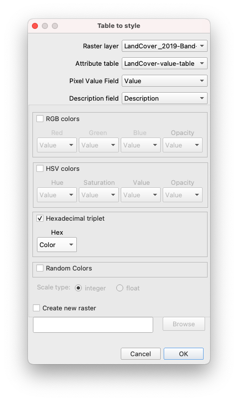

Abbildung 10.17f - Einstellen der Parameter des Table to Style Plugins für den Datensatz LandCover_2019-Band-1

Das Ergebnis sollte wie in Abbildung 10.17g aussehen. 

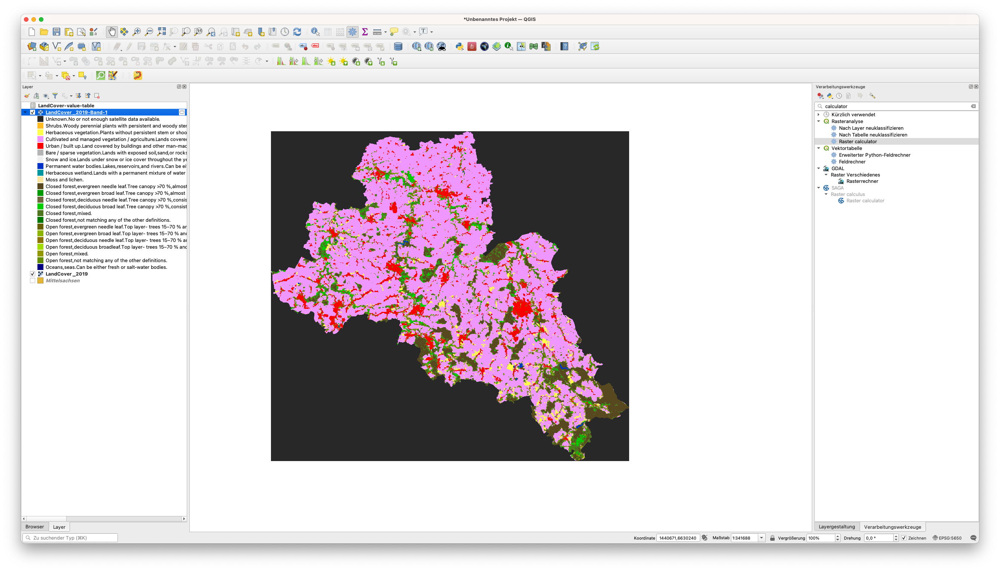

Abbildung 10.17g - Automatisch gestylter Rasterdatensatz mit Table to Style -Plugin

Eine ausführliche Beschreibung der Fähigkeiten des Plugins sowie ein umfassenderes Tutorial finden Sie auf der Webseite des Plugins Table 2 Style. 

#### ORS Tool

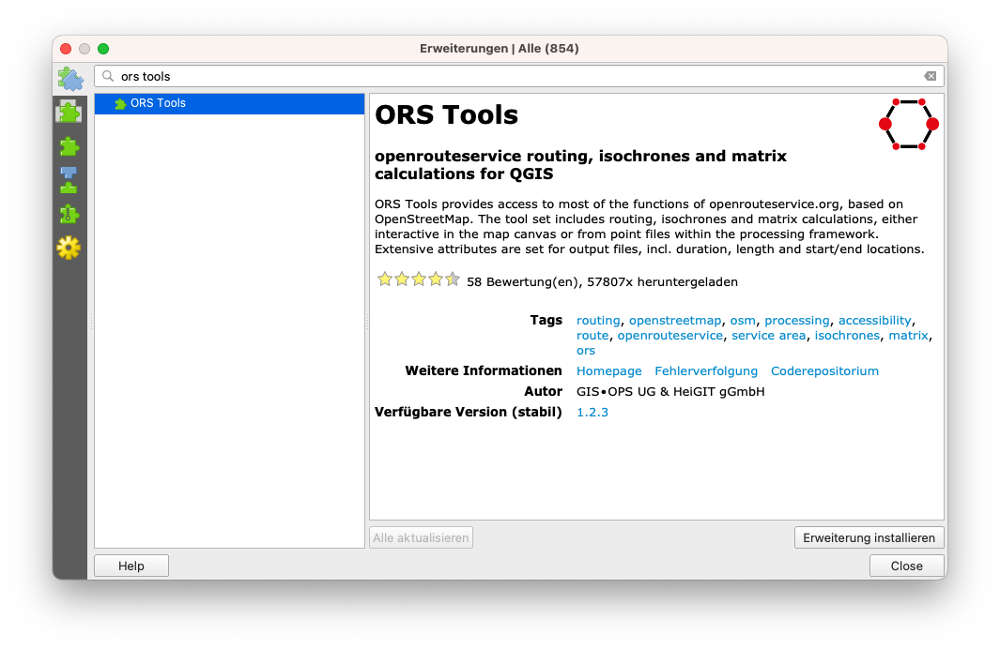

Bild 10.48a - Das ORS Tools-Plugin

In unserer letzten Erweiterungen wollen wir Ihnen die Möglichkeiten der vernetzten Welt der GIS-Daten, -Tools und -Dienste zu zeigen. Wir haben bereits gesehen, dass es Erweiterungen gibt, die uns dabei helfen können, unsere QGIS-Daten von anderen Anbietern zu laden, ohne dass wir sie mühsam herunterladen, speichern und öffnen müssen (OpenLayers-Plugin , Active Fire). Die Erweiterung ORS Tools wurde jedoch entwickelt, um den Zugriff auf einen externen Routing-Dienst zu ermöglichen - den openrouteservice.org, der auf OpenStreetMap basiert. 

**Routing** ist der Prozess der Auswahl eines Pfades für den Verkehr in einem Netzwerk oder zwischen oder über mehrere ausgewählte Punkte. 

Die Erweiterung ermöglicht Routing, Isochronen und Matrixberechnungen, entweder interaktiv in der Kartenansicht oder aus Punktdateien innerhalb des Verarbeitungsrahmens. 

Installieren Sie mit der Erweiterungsverwaltung das Plugin "ORS Tools". Ein neues Piktogramm erscheint in Ihrer Werkzeugleiste. Doppelklicken Sie darauf, um es zu öffnen (siehe Abbildung 10.18b). 

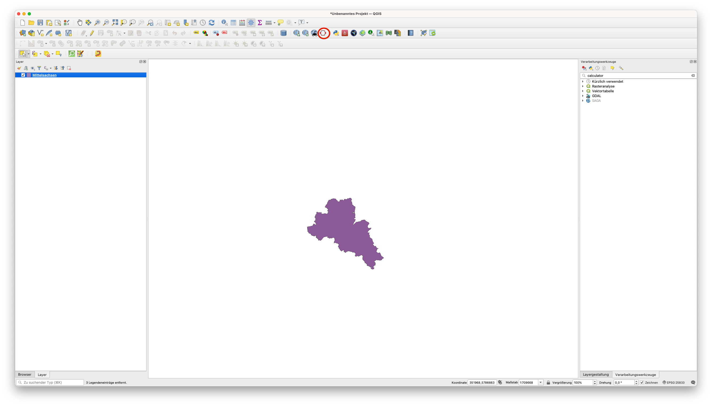

Abbildung 10.18b - Fenster "ORS Tools" öffnen. 

Wie bereits erwähnt, verwendet diese Erweiterung eine externe Datenbank - OpenStreetMap - und externe Algorithmen, die in einen Dienst - openrouteservice - angeboten werden. Um eine Verbindung zu diesem externen Dienst herstellen zu können, müssen wir ein Konto auf deren Webseite erstellen und einen **API-Key anfordern**.

Ein API-Schlüssel/API-Key/API-Token ist eine eindeutige Kennung, die zur Authentifizierung gegenüber einer API verwendet wird. Die API ist wie Zugang zum Innenleben einer Software, ein programmatischer Zugang zu deren Prozessen und Algorithmen. Um also den openrouteservice durch QGIS zu nutzen, werden wir nach einem _Schlüssel_ fragen. 

Fahren Sie mit den folgenden Schritten fort: 

1. Klicken Sie auf die Schaltfläche Sign Up im Fenster ORS Tools (Abbildung 10.49). 

Bild 10.18c - Schaltfläche "Sign in"

2. Legen Sie auf der geöffneten openrouteservice-Website ein kostenloses Konto an. 

Bild 10.18d - Openrouteservice-Kontoseite 

3. Nach dem Anlegen des Kontos erhalten Sie eine E-Mail, die Sie über den soeben erhaltenen kostenlosen Zugang informiert. 

Abbildung 10.18e - E-Mail von openrouteservice erhalten

4. Melden Sie sich an Ihrem neu erstellten Konto an und fordern Sie ein Token an. 

Bild 10.18f - openrouteservice-Token anfordern

5. Nachdem Ihr Token erstellt wurde, klicken Sie auf die lange alphanumerische Zeichenfolge unterhalb des Namensschlüssels. Es erscheint eine Meldung, dass es kopiert wurde. 
6. Kehren Sie zu QGIS zurück und fügen Sie den kopierten API-Schlüssel ein.

Abbildung 10.18g - Einfügen des openrouteserviceAPI-Schlüssels in Ihr QGIS

An diesem Punkt sollte Ihr QGIS bereit sein, Routen mit openrouteservice und OpenStreetMap zu berechnen. Um die grundlegenden Fähigkeiten zu testen, laden Sie den Layer der Gebäude aus Mittelsachsen. Stellen Sie sicher, dass Sie in EPSG:3857 arbeiten - hierfür kann es nötig sein, dass Sie den Gebäudelayer voerst in das KBS EPSG:5650 reporojizieren. Nachdem Sie den Layer geladen haben, beginnen Sie mit dem Einfügen der Routingpunkte. Öffnen Sie die ORS-Tools, und drücken Sie die grüne + Taste (siehe Abbildung 10.18h). 

Bild 10.18h - Einfügen der Routingpunkte mit den ORS-Tools. 

Wählen Sie den Routing-Algorithmus Traveling Salesman und klicken Sie auf Anwenden. Nach wenigen Augenblicken ist ein neuer Vektor-Layer erstellt worden: Routes_ORS. 

Abbildung 10.18i - Ergebnis der Ausführung der ORS Tools. 

Abbildung 10.18j - Die berechnete Route, mit eine OpenStreetMap Hintergrundkarte

Die Ergebnisse der ORS-Tools hängen stark von der Qualität der verwendeten Datenbanken ab, in diesem Fall - der OpenStreetMap. 

Die Erweiterung, wie auch der openroutingservice, hat noch mehr zu bieten, aber wir überlassen es Ihnen, das auf Ihrer GIS-Reise zu entdecken. 

#### **Quizfragen**

1. Können QGIS-Erweiterungen außerhalb der QGIS-Plattform betrieben werden? 
* _Nein_
* Ja
2. Um eine QGIS Erweiterung zu benutzen, muss man programmieren lernen.
* _Nein_
* Ja
3. Es wird empfohlen, dass alle Erweiterungen über die Erweiterungsverwaltung installiert werden, auch wenn sie durch Herunterladen der Zip-Datei und Ablegen im richtigen QGIS-Ordner installiert werden könnten. 
* Nein
* _Ja_