# Modul 2 - Ebenen in QGIS

**Autor**: Ben Hur
**Übersetzung**: Knut Hühne

## Pädagogische Einführung

In diesem Modul lernen Sie die grundlegenden Konzepte von Layern in QGIS und wie man sie lädt. Am Ende dieses Moduls sollten die Lernenden vertraut sein mit:

* den verschiedenen Datenquellen und Dateiformaten, die in QGIS geladen werden können
* den verschiedenen Arten, wie Daten in QGIS geladen werden können
* einigen gängige Datenformaten

Sie sollten außerdem in der Lage sein:

* Layer (sowohl Vektoren als auch Raster) mit Hilfe des Browser-Panels und des Datenquellen-Managers zu laden
* QGIS mit entfernten Diensten zu verbinden
* mit temporären und virtuellen Layern zu arbeiten
* Erweiterungen zu installieren, um andere Datensätze in QGIS laden
* Ebeneneigenschaften wie Metadateninformationen anzeigen
* Layer speichern und exportieren


## Erforderliche Werkzeuge und Ressourcen

Die benötigten Werkzeuge und Ressourcen für dieses Modul sind:

* Computer
* Internetverbindung
* QGIS 3.16 auf dem Computer installiert ([https://qgis.org/de/site/forusers/download.html](https://qgis.org/de/site/forusers/download.html))


## Voraussetzungen

* Grundkenntnisse in der Bedienung eines Computers
* Vertrautheit mit räumlichen Datenformaten und der QGIS-Oberfläche (Abschluss der Module 0 und 1)


## Zusätzliche Ressourcen

* QGIS Benutzerhandbuch - [https://docs.qgis.org/3.16/de/docs/user_manual/](https://docs.qgis.org/3.16/de/docs/user_manual/)
* QGIS Schulungshandbuch - [https://docs.qgis.org/3.16/de/docs/training_manual/index.html](https://docs.qgis.org/3.16/de/docs/training_manual/index.html)
* Basiskarten in QGIS (englischsprachig) - [https://bnhr.xyz/2018/10/07/basemaps-in-qgis.html](https://bnhr.xyz/2018/10/07/basemaps-in-qgis.html)
* Verbindung von QGIS mit Remote Services (englischsprachig) - [https://bnhr.xyz/2018/10/12/connecting-qgis-to-remote-services.html](https://bnhr.xyz/2018/10/12/connecting-qgis-to-remote-services.html)
* Spreadsheet Layers Plugin  (englischsprachig)- [https://bnhr.xyz/2018/07/27/plugin-fridays-spreadsheet-layers-plugin.html](https://bnhr.xyz/2018/07/27/plugin-fridays-spreadsheet-layers-plugin.html)


## Thematische Einführung


Abbildung 2.1. Ein Karten-Overlay mit verschiedenen Layern und Datentypen ([https://saylordotorg.github.io/text_essentials-of-geographic-information-systems/s11-02-multiple-layer-analysis.html](https://saylordotorg.github.io/text_essentials-of-geographic-information-systems/s11-02-multiple-layer-analysis.html))

Wir haben in den vorangegangenen Modulen gelernt, dass räumliche Datenmodelle wie Vektoren und Raster eine Modellierung von Objekten und Phänomenen der realen Welt sind.
Um in der Praxis nützliche Analysen durchzuführen, reicht es nicht, einen einzelnen Layer zu benutzen. Wir müssen häufig mehrerer Datensätze (z.B. Höhe, Temperatur, Bevölkerungsverteilung, Zoneneinteilungs usw). miteinander kombinieren. Das Übereinanderlegen mehrerer thematischer Karten desselben Gebiets ist eine der ältesten und gängigsten geografischen Analysetechniken.


## Aufschlüsselung der Konzepte

Das Bild oben gibt uns ein einfaches und konkretes Beispiel dafür. Stellen Sie sich vor, Sie wären ein:e GIS-Berater:in mit der Aufgabe, den besten Standort für ein neues Franchise-Restaurant (z. B. Starbucks oder McDonalds) zu finden. Dazu müssten Sie die relevanten Informationen sammeln, die Ihnen bei der Entscheidung helfen würden. Dies könnten Informationen über die Straßen der Stadt, die Grundstücke, die Lage und Verteilung möglicher Kunden, die Topographie des Gebiets, die Landnutzung usw. sind.

Diese Datensätze können in verschiedenen Typen und Formaten vorliegen. Einige können Vektordateien sein, während andere Raster sein können. Einige können im gleichen Koordinatenreferenzsystem sein, während andere in verschiedenen Koordinatenreferenzsystemen vorliegen können. Einige können lokale Dateien sein, die sich auf Ihrem Computer befinden, während andere nur über das Internet geladen werden können. Aufgrund der vielen Möglichkeiten, welche Art von Daten Sie für Ihre räumliche Analyse benötigen, sollte ein gutes GIS in der Lage sein, eine Vielzahl von Datenquellen zu verarbeiten und zu verwalten.

## Main content

### Phase 1 title: Data Types, File Formats, the Browser Panel, and the Layers Panel

#### **Gängige Datentypen und Dateiformate**

Abgesehen von den räumlichen Datenmodellen (Raster und Vektoren), die im ersten Modul besprochen wurden, ist die Vertrautheit mit räumlichen Dateiformaten und ihren Vor- und Nachteilen ebenfalls wichtig für jeden, der räumliche Analysen durchführt.

Die meisten GIS-Neulinge werden in der Regel über Shapefiles an räumliche Daten herangeführt. Die meisten Leute wachsen nie darüber hinaus und verwenden Shapefile für alle Arten und Formen von Vektordaten. Dies ist vergleichbar damit, wie eine bestimmte Marke wie Coca Cola als allgemeiner Begriff für Softdrinks verwendet wird. Das ist nicht unbedingt falsch, aber eher unglücklich, da Shapefiles nur eine der vielen Arten von Vektordatenformaten sind. Tatsächlich gibt es auch viele andere Vektorformate wie z.B. geopackage, geojson, topojson, und flatgeobuf. Das Shapefile-Format ist zwar allgegenwärtig, hat aber einige wesentliche Einschränkungen, wie z. B.:

* Es ist nicht nur 1 Datei. Ein Shapefile besteht eigentlich aus mehreren Dateien, von denen 3 obligatorisch sind: .shp, .shx, .dbf. Alle anderen Dateien werden Sidecar-Dateien genannt.
* Die Größe jeder einzelnen Datei ist auf 2 GB begrenzt.
* Feldnamen sind auf 10 Zeichen begrenzt.
* Attributspalten sind auf 255 Spalten begrenzt.
* Einige Datentypen, wie z. B. Zeit, werden nicht unterstützt.
* Es speichert nicht explizit die Topologie.

Andere Datenformate wie GeoPackage, GeoJSON, TopoJSON und flatgeobuff beheben diese Einschränkungen von Shapefiles. Tatsächlich sind QGIS und GRASS GIS auf GeoPackage als Standard-Vektordateiformat umgestiegen, wenn es um den Import oder Export von Layern geht. Obwohl GeoPackage auch einige Einschränkungen hat, erlaubt es der Gemeinschaft, die Zukunft des Formats mitzugestalten, da es ein völlig offenes Format ist.

Wenn also nicht Shapefiles, was sollten Sie dann verwenden?

Es ist nichts falsch daran, Shapefiles zu verwenden, vor allem, wenn es zu Ihrem Anwendungsfall passt. Wenn Sie keinen Datensatz benötigen, der über 2 GB hinausgeht, wenn Sie mit einer Begrenzung der Feldnamen auf 10 Zeichen einverstanden sind oder wenn Sie lokal mit einer kleinen Anzahl von Dateien arbeiten, ist ein Shapefile völlig in Ordnung.

Wenn Sie jedoch Ihr QGIS-Projekt mit allen Layern (Vektoren, Raster), Styling und Modellen zusammenpacken wollen; oder wenn Sie mehrere Typen von Layern und räumlichen Daten in einer einzigen Datei gemeinsam nutzen wollen, ist ein GeoPackage einen Blick wert. GeoPackages und GeoJSONs sind auch web-freundlich und können direkt von Web-Mapping-Bibliotheken wie Mapbox und Leaflet verwendet werden.

Mehr dazu können Sie unter dem folgenden englischsprachigen Link lesen: [https://bnhr.xyz/2018/12/12/i-choose-geopackage.html](https://bnhr.xyz/2018/12/12/i-choose-geopackage.html)

In der Zwischenzeit kann jedes Format, das als Gitter aus Pixeln oder Zellen dargestellt werden kann, von QGIS als Rasterdaten gelesen werden. Dazu gehören Bildformate wie PNG (.png) und JPEG (.jpg). Es ist erwähnenswert, dass, obwohl alle Bilddateiformate als Raster gelesen werden können, nicht alle von ihnen georeferenziert sind oder geospatiale Informationen enthalten, die es uns erlauben, sie richtig auf der Erde zu lokalisieren. Für solche Fälle können wir eine so genannte Weltdatei ([https://en.wikipedia.org/wiki/World_file](https://en.wikipedia.org/wiki/World_file)) verwenden. . Eine Weltdatei ist eine separate Klartext-Datendatei, deren Name derselbe ist wie der der Rasterdatei, zu der sie gehört, und an deren Dateierweiterung der Buchstabe w angehängt ist. Die Weltdatei für **world.png** wird beispielsweise **world.pngw **oder **world.pgw** genannt.

Einige Bilddateiformate enthalten explizite Georeferenzierung und Informationen und benötigen keine Weltdatei. Einige Beispiele sind GeoTIFFs (.tif oder tiff) und das ERDAS Imagine-Dateiformat (.img).

Für weitere Informationen über Dateiformate können Sie auch nachsehen: [https://saylordotorg.github.io/text_essentials-of-geographic-information-systems/s09-03-file-formats.html](https://saylordotorg.github.io/text_essentials-of-geographic-information-systems/s09-03-file-formats.html)

Geodaten können auch in Form von Geodatenbanken vorliegen. Dies können Datenbanken auf Unternehmensebene sein, wie das freie und quelloffene Postgres mit PostGIS-Erweiterung ([https://postgis.net/](https://postgis.net/)) oder das proprietäre ArcSDE von ESRI. Es gibt auch Dateigeodatenbanken, in denen verschiedene Datentypen (z. B. Vektoren und Raster) gespeichert werden können. Einige Beispiele sind das freie und offene OGC GeoPackage (.gpkg) ([https://www.geopackage.org/](https://www.geopackage.org/)) und das proprietäre File Geodatabase Format von ESRI (.gdb).


#### **Arten von Datenquellen**

Eine der leistungsfähigsten Funktionen von QGIS ist die Fähigkeit, verschiedene räumliche und nicht-räumliche Daten aus unterschiedlichen Quellen zu verbinden, zu laden und zu verwenden. QGIS kann folgende Formate öffnen:

* lokale Raster- und Vektordateien
* lokale Datenbanken
* Dateien und Datenbanken im Internet über deren Uniform Resource Identifier (URI) oder Uniform Resource Locator (URL),
* Webservices (OSGeo Webservices und ArcGIS Webservices), Kacheldienste und Datenportale wie GeoNode
* und viele mehr...

QGIS kann außerdem durch Erweiterungen auch Daten von Diensten wie NASAs SRTM, Planet Imagery, SentinelHub, Google Earth Engine und OpenStreetMap laden.

Dies macht QGIS zu einer integralen Komponente für jede Geodateninfrastruktur und jeden Arbeitsablauf.


#### **Laden von Layern in QGIS**

Es gibt mehrere Möglichkeiten, Layer in QGIS zu laden. Diese beinhalten:

1. **Drag-and-drop** des Layers in die QGIS Kartenansicht oder das Layer Panel. Dies ist zwar der einfachste Weg, einen Layer in QGIS zu laden, aber nicht die empfohlene Vorgehensweise, da es bei dieser Methode Probleme gibt, z.B. beim Laden von nicht-räumlichen tabellarischen Daten wie CSVs.
2. Verwendung des **Browser Panels**.
3. Verwendung des **Datenquellen-Managers**.
4. Verwenden der Symbolleiste **Datenquellenverwaltung** und der Symbolleiste **Ebenen verwalten**.

**HINWEIS:** **Beim Laden von Ebenen können die Standardfarben Ihrer Ebenen von den in diesem Modul gezeigten Standardfarben abweichen.**


#### **Das Browser-Bedienfeld**

Das **Browser-Bedienfeld** zeigt einen Dateibaum an, der die Dateien und Ordner Ihres Computers sowie Verbindungen zu Datenbanken und Webservern anzeigt. Standardmäßig ist es an der linken Seite der QGIS-Benutzeroberfläche zusammen mit dem Layer-Bedienfeld angedockt.

Das Browser-Panel bietet eine Vielzahl von Funktionen zum Verbinden, Laden und Anzeigen von Informationen über Layer. Sie können im Browserbedienfeld auch Verbindungen zu Favoritenverzeichnissen und räumlichen Lesezeichen erstellen.

Um mehr über das Browser-Bedienfeld zu erfahren, gehen Sie zu: [https://docs.qgis.org/3.16/de/docs/user_manual/introduction/browser.html](https://docs.qgis.org/3.16/de/docs/user_manual/introduction/browser.html)

#### **Übung 01.1: Das Browser-Panel**

1. Öffnen Sie QGIS.
2. Prüfen Sie das Browser-Fenster (Abbildung 2.2). Wenn Sie das Browser-Panel nicht finden können, können Sie es unter **Ansicht ‣ Panels ‣ Browser Panel** in der Menüleiste sichtbar machen.

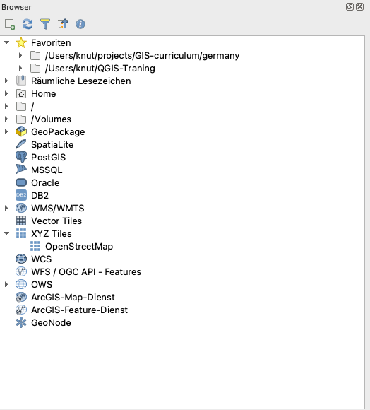

Abbildung 2.2. Das Browser-Panel

3. Beachten Sie, wie die Laufwerke und Ordner aufgeklappt werden können, um die Unterordner darin anzuzeigen.
4. Suchen Sie den Ordner **Module 2 - Layers in QGIS** (Abbildung 2.3) im Dateibaum (beachten Sie, wo Sie die Datei gespeichert oder heruntergeladen haben). Sie sollten die notwendigen Daten für diese Arbeitsmappe sehen können. In meinem Beispiel auf der rechten Seite habe ich den oben genannten Ordner als einen meiner Favoriten verknüpft, so dass ich vom Browser-Panel aus leicht dorthin wechseln kann. Sie können ein Favoritenverzeichnis zum Browser-Panel hinzufügen, indem Sie mit der rechten Maustaste auf Favoriten klicken und das Verzeichnis hinzufügen.
5. Überprüfen Sie die Dateien im Ordner (Abbildung 2.3). Es gibt mehrere von ihnen. Aus dem Dateibaum selbst können wir bereits eine Vorstellung von den Dateien und Layern gewinnen, die wir in QGIS laden können. Die Icons links neben den Namen zeigen an, ob es sich um einen Vektor 
, ein Raster , eine Datenbank , oder einfache tabellarische Daten .


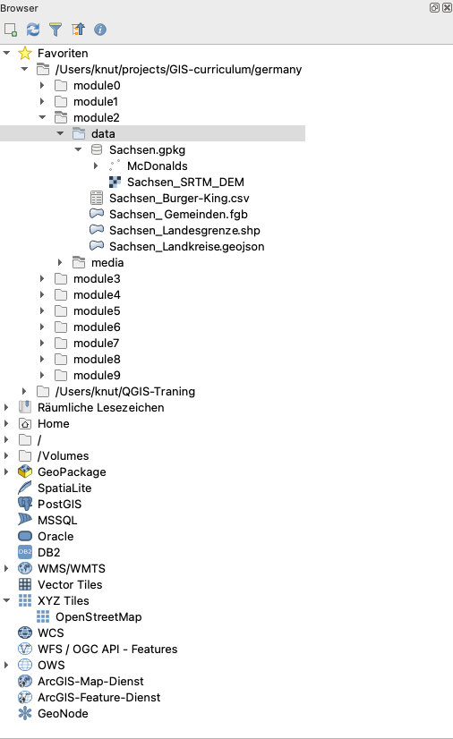

Abbildung 2.3. Die Moduldateien im Browser-Panel

6. Es befinden sich 5 Dateien unter dem Ordner data:

    1. ein GeoPackage (Philippines_NCR.gpkg), das eine Vektor- (NCR_Jollibee) und eine Rasterdatei (NCR_SRTM_DEM) enthält;
    2. ein GeoJSON (NCR_districts.geojson);
    3. eine Flatgeobuf-Datei (NCR_municities.fgb);
    4. ein Shapefile (NCR_admin_boundary.shp); und
    5. eine Datei mit kommagetrennten Werten (CSV) (NCR_McDonalds.csv).

7. Klicken Sie mit der rechten Maustaste auf NCR_admin_boundary.shp und klicken Sie auf Ebeneneigenschaften (Abbildung 2.4). Dadurch wird das Fenster mit den Ebeneneigenschaften geöffnet (Abbildung 2.5). Beachten Sie die Informationen, die im Fenster angezeigt werden. Wie ist die Geometrie des Layers? Welches CRS wird verwendet? Wie viele Features befinden sich auf dem Layer?


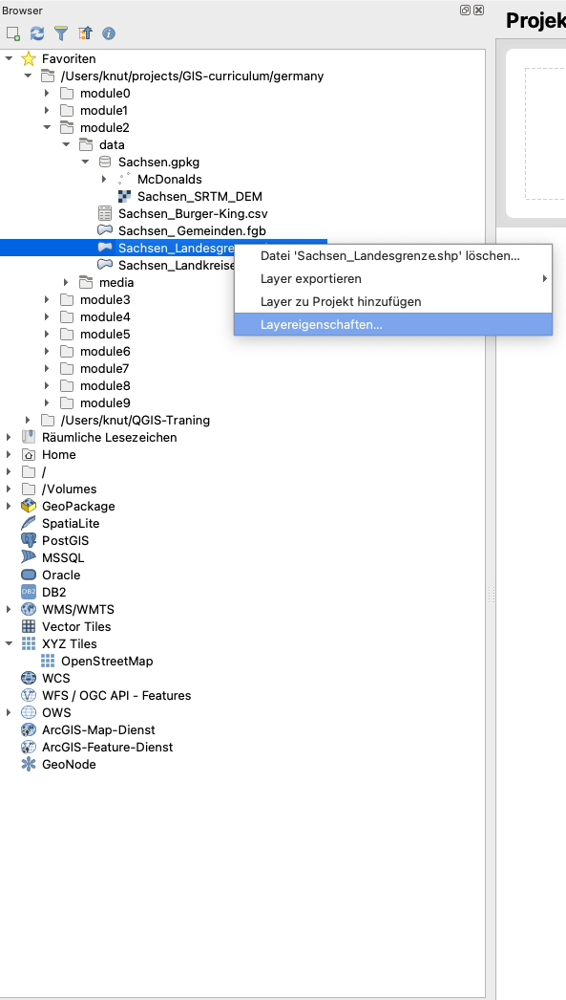

Abbildung 2.4.Checking Layer Properties


Abbildung 2.5. Layer-Eigenschaften aus dem Browser-Panel


8. Neben der Bereitstellung von Metadaten zu den Layern können Sie im Layer-Eigenschaften-Fenster auch eine Vorschau der Geometrie und der Attribute des Layers anzeigen.
9. Sie können eine Ebene aus dem Browser-Bedienfeld laden, indem Sie:

    1. **Doppelklick auf den Layer**
    2. **Rechtsklick auf den Layer ‣ Layer zum Projekt hinzufügen**.
    3. **Layer auf die Kartenansicht ziehen**.

10. Versuchen Sie, die Layer **NCR_admin_boundary**, **NCR_districts** und **NCR_municities** mit einer der oben genannten Methoden zu laden.

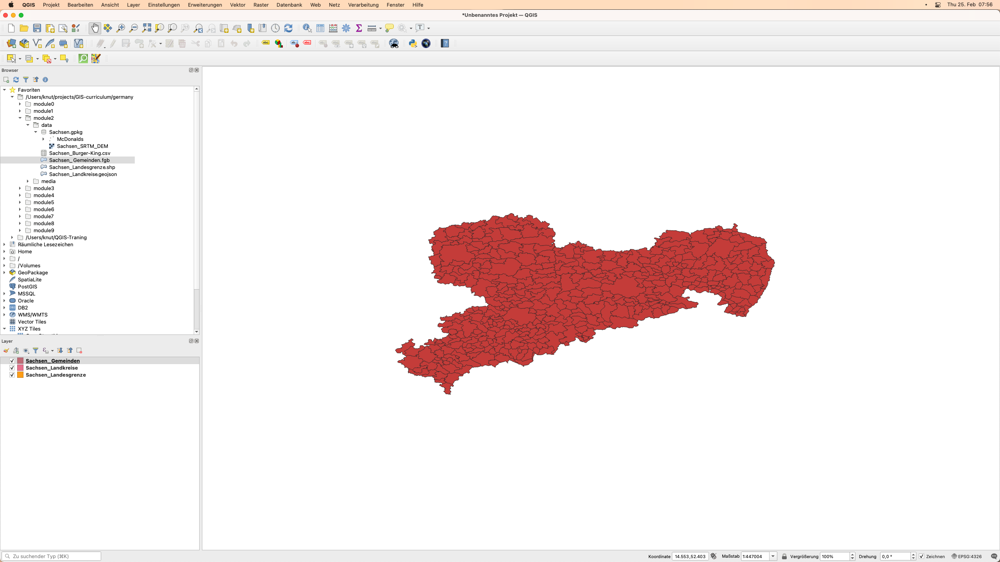

Abbildung 2.6. Die in QGIS geladenen Vektorlayer


#### **Das Layer-Bedienfeld**

Im Layer-Bedienfeld werden alle aktuellen Layer im Projekt aufgelistet. Er hilft bei der Verwaltung ihrer Sichtbarkeit und Reihenfolge und kann verwendet werden, um die Ebeneneigenschaften anzuzeigen. Das Layer-Bedienfeld kann über **Ansicht ‣ Bedienfelder ‣ Layer** oder über die Tastenkombination **CTRL+1** aktiviert werden. Es wird auch als Kartenlegende bezeichnet. Wenn Sie alle Vektoren aus der vorherigen Übung geladen haben, sollte Ihr Ebenenbedienfeld wie unten dargestellt aussehen:


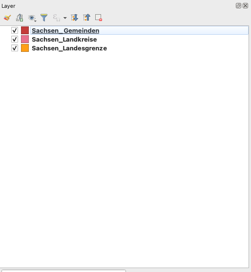

Abbildung 2.7. Das Layer-Bedienfeld

Die Sichtbarkeit eines Layers kann durch Aktivieren oder Deaktivieren des Kästchens links neben dem Layernamen gesteuert werden. Indem Sie die Layer im Ebenen-Bedienfeld nach oben oder unten ziehen, können Sie ihre Z-Reihenfolge ändern. Ähnlich wie bei Bildbearbeitungsprogrammen wie GIMP oder Photoshop werden die ganz oben aufgeführten Layer über die weiter unten aufgeführten Layer gezogen. Wenn also zwei Ebenen denselben Bereich zeigen, wird die Ebene, die im Ebenenbedienfeld weiter oben steht, über die darunter liegende Ebene gezeichnet und macht die darunter liegende Ebene möglicherweise nicht in der Kartenansicht sichtbar. Dies ist wichtig zu wissen, denn es kann vorkommen, dass ein Layer in QGIS nicht angezeigt wird, obwohl er in Wirklichkeit von einem darüber liegenden Layer verdeckt wird.

**HINWEIS:** Die Z-Reihenfolge der Ebenen im Ebenenbedienfeld kann durch das **Ebenenreihenfolge-Panel** außer Kraft gesetzt werden.

Das Ebenenbedienfeld ermöglicht auch das Umbenennen und Entfernen von Ebenen, das Filtern der Ebenensichtbarkeit, das Erstellen und Verwalten von Ebenengruppen und Kartenansichten.

Die Attributtabelle eines Vektorlayers kann auch aus dem Ebenenbedienfeld heraus geöffnet werden, indem Sie **mit der rechten Maustaste auf den Layer klicken ‣ Attributtabelle öffnen**.

Weitere Informationen über das Ebenenbedienfeld finden Sie unter: [https://docs.qgis.org/3.16/en/docs/user_manual/introduction/general_tools.html#layers-panel](https://docs.qgis.org/3.16/en/docs/user_manual/introduction/general_tools.html#layers-panel)


#### **Ebeneneigenschaften**

Wenn Sie mit der rechten Maustaste auf eine Ebene im Ebenenbedienfeld klicken und "Ebeneneigenschaften" wählen, wird der Dialog "Ebeneneigenschaften" geöffnet.


Abbildung 2.8. Das Dialogfeld "Ebeneneigenschaften

Im Dialogfeld "Ebeneneigenschaften" gibt es mehrere Registerkarten, auf denen der Benutzer Informationen anzeigen und sogar Eigenschaften der Ebene bearbeiten/verändern kann.

Die Registerkarte "Information" zeigt eine schreibgeschützte Darstellung der zusammengefassten Informationen und Metadaten zur aktuellen Ebene, einschließlich

* Datenanbieter
* gefüllte Metadaten
* Geometrie- oder Feldinformationen

Die Registerkarte Quelle zeigt allgemeine Einstellungen für eine Vektorebene.

Über Registerkarten wie Symbologie, Beschriftungen, Masken und 3D-Ansicht kann der Benutzer die Symbologie und den Stil des Layers ändern.

Andere Registerkarten ermöglichen es dem Benutzer, Verknüpfungen mit dem Layer durchzuführen (Join), Informationen über die Attributfelder zu erhalten (Fields), benutzerdefinierte Formulare zum Hinzufügen neuer Daten hinzuzufügen (Attribute Forms) und vieles mehr.

Eine weitere erwähnenswerte Registerkarte ist die Registerkarte "Metadaten", die dem Benutzer die Möglichkeit bietet, einen Metadatenbericht über den Layer zu erstellen und zu bearbeiten. Dieser enthält Informationen über:

* Datenidentifikation: grundlegende Zuordnung des Datensatzes (Elternteil, Bezeichner, Titel, Zusammenfassung, Sprache...);
* Kategorien, zu denen die Daten gehören, z. B. ISO-Kategorien und benutzerdefinierte Kategorien;
* Schlüsselwörter zum Auffinden der Daten und zugehöriger Konzepte nach einem standardbasierten Vokabular;
* Zugriff auf den Datensatz (Lizenzen, Rechte, Gebühren und Beschränkungen);
* Umfang des Datensatzes, entweder räumlich (CRS, Kartenausdehnung, Höhen) oder zeitlich;
* Kontakt des/der Eigentümer(s) des Datensatzes;
* Links zu ergänzenden Ressourcen und verwandten Informationen; und
* Historie des Datensatzes.

Eine Zusammenfassung der ausgefüllten Informationen wird auf der Registerkarte "Validierung" bereitgestellt und hilft dabei, potenzielle Probleme im Zusammenhang mit dem Metadatenformular zu identifizieren. Derzeit werden die Metadaten in der Projektdatei gespeichert, sie können aber auch in einer separaten .qmd-Datei neben den dateibasierten Layern oder in einer lokalen .sqlite-Datenbank für Remote-Layer gespeichert werden.

Weitere Informationen zu den Eigenschaften von Vektorebenen finden Sie unter: [https://docs.qgis.org/3.16/en/docs/user_manual/working_with_vector/vector_properties.html](https://docs.qgis.org/3.16/en/docs/user_manual/working_with_vector/vector_properties.html)

Weitere Informationen zu den Eigenschaften von Rasterebenen finden Sie unter: [https://docs.qgis.org/3.16/en/docs/user_manual/working_with_raster/raster_properties.html](https://docs.qgis.org/3.16/en/docs/user_manual/working_with_raster/raster_properties.html)

**HINWEIS:** Die Z-Reihenfolge von Layern im Layer-Bedienfeld kann durch das **Layerreihenfolge Bedienfeld** außer Kraft gesetzt werden.

Das Layer-Bedienfeld ermöglicht auch das Umbenennen und Entfernen von Layern, das Filtern der Sichtbarkeit von Layern, sowie Erstellen und Verwalten von Layergruppen und Kartenansichten.

Die Attributtabelle eines Vektorlayers kann auch aus dem Layer-Panel heraus geöffnet werden, indem Sie **mit der rechten Maustaste auf den Layer klicken ‣ Attributtabelle öffnen**.

Weitere Informationen über das Layer-Bedienfeld finden Sie unter: [https://docs.qgis.org/3.16/de/docs/user_manual/introduction/general_tools.html#layers-panel](https://docs.qgis.org/3.16/de/docs/user_manual/introduction/general_tools.html#layers-panel)


#### **Layer-Eigenschaften**

Wenn Sie mit der rechten Maustaste auf eine Ebene im Ebenen-Bedienfeld klicken und "Eigenschaften" wählen, wird der Dialog "Layer-Eigenschaften" geöffnet.


Abbildung 2.8. Das Dialogfeld "Layereigenschaften

Im Dialogfeld "Layereigenschaften" gibt es mehrere Registerkarten, auf denen Informationen angezeigt und Eigenschaften des Layers bearbeiten/verändern werden können.

Die Registerkarte "Information" zeigt eine schreibgeschützte Darstellung der zusammengefassten Informationen und Metadaten des aktuellen Layers, darunter:

* Datenanbieter
* gefüllte Metadaten
* Geometrie- oder Feldinformationen

Die Registerkarte Quelle zeigt allgemeine Einstellungen für einen Vektorlayer.

Unter den Registerkarten wie "Symbolisierung", "Beschriftungen", "Masken" und "3D-Ansicht" können Symbologie und der Stil des Layers geändert werden.

Andere Registerkarten ermöglichen es, Verknüpfungen mit dem Layer durchzuführen (Verkünpfungen), Informationen über die Attributfelder zu erhalten (Felder), benutzerdefinierte Formulare zum Hinzufügen neuer Daten hinzuzufügen (Attributformular) und vieles mehr.

Eine weitere erwähnenswerte Registerkarte ist die Registerkarte "Metadaten", die dem/der Benutzer:in die Möglichkeit bietet, einen Metadatenbericht über den Layer zu erstellen und zu bearbeiten. Dieser enthält Informationen über:

* Datenidentifikation: grundlegende Zuordnung des Datensatzes (Elternkennung, Kennung, Titel, Zusammenfassung, Sprache...);
* Kategorien, zu denen die Daten gehören, wie z. B. ISO-Kategorien und benutzerdefinierte Kategorien;
* Schlüsselworte zum Auffinden der Daten und zugehöriger Konzepte nach einem standardbasierten Vokabular;
* Zugriff auf den Datensatz (Lizenzen, Rechte, Gebühren und Beschränkungen);
* Umfang des Datensatzes, entweder räumlich (CRS, Kartenausdehnung, Höhen) oder zeitlich;
* Kontakt des/der Eigentümer:in des Datensatzes;
* Links zu ergänzenden Ressourcen und verwandten Informationen; und
* Historie des Datensatzes.

Eine Zusammenfassung der ausgefüllten Informationen wird auf der Registerkarte "Validierung" bereitgestellt und hilft dabei, potenzielle Probleme im Zusammenhang mit dem Metadaten zu identifizieren. Derzeit werden Metadaten in der Projektdatei gespeichert, sie können aber auch in einer separaten .qmd-Datei neben den dateibasierten Layern oder in einer lokalen .sqlite-Datenbank für entfernte Layer gespeichert werden.

Weitere Informationen zu den Eigenschaften von Vektorlayern finden Sie unter: [https://docs.qgis.org/3.16/de/docs/user_manual/working_with_vector/vector_properties.html](https://docs.qgis.org/3.16/de/docs/user_manual/working_with_vector/vector_properties.html)

Weitere Informationen zu den Eigenschaften von Rasterlayern finden Sie unter: [https://docs.qgis.org/3.16/de/docs/user_manual/working_with_raster/raster_properties.html](https://docs.qgis.org/3.16/de/docs/user_manual/working_with_raster/raster_properties.html)


#### **Geospatiale Metadaten**

Metadaten sind Daten über Daten. Sie beantworten das Wer, Was, Wann, Wo und Wie des Datensatzes und kommen in allen Formen und Größen vor. Für GIS-Zwecke befassen wir uns in der Regel mit georäumlichen Metadaten. Geografische Metadaten werden vom U.S. Federal Geographic Data Committee (FGDC) beschrieben als:

_"eine Datei mit Informationen, in der Regel als XML-Dokument, das die grundlegenden Eigenschaften einer Daten- oder Informationsressource erfasst. Sie stellen das Wer, Was, Wann, Wo, Warum und Wie der Ressource dar. Geodaten-Metadaten dokumentieren in der Regel geografische digitale Daten wie GIS-Dateien (Geographic Information System), Geodatenbanken und Erdbilder, können aber auch zur Dokumentation von Georessourcen wie Datenkatalogen, Mapping-Anwendungen, Datenmodellen und zugehörigen Websites verwendet werden. Metadatensätze umfassen zentrale Bibliothekselemente wie Titel, Zusammenfassung und Publikationsdaten, geografische Elemente wie geografische Ausdehnung und Projektionsinformationen sowie Datenbankelemente wie Attribut-Label-Definitionen und Attribut-Domänenwerte."_

Die Bedeutung von Metadaten liegt darin, dass sie nicht nur die Transparenz fördern, sondern auch den Austausch von Daten und Informationen erleichtern. Aus diesem Grund ist es wichtig, unseren Datensätzen immer Metadaten hinzuzufügen. Beim Hinzufügen von Metadaten ist es ebenso wichtig, Standards zu befolgen, damit die von uns erstellten Metadaten interoperabel sind. Ein solcher Standard ist die ISO 19115:2014 "Geographic Information -- Metadata" von ISO/TC 211 ([https://www.iso.org/obp/ui/#iso:std:iso:19115:-1:ed-1:v1:en](https://www.iso.org/obp/ui/#iso:std:iso:19115:-1:ed-1:v1:en)) (englischsprachig).


#### **Übung 01.2: Hinzufügen von Metadaten**

1. Öffnen Sie die Layer-Eigenschaften des Layers "NCR_admin_boundary".
2. Prüfen Sie die Angaben auf der Registerkarte Information und schauen Sie sich die angezeigten Informationen an. Sind sie vollständig? Können wir weitere Informationen hinzufügen?


Abbildung 2.9. Informationseigenschaften des NCR_admin_boundary Layers

3. Wechseln Sie zur Registerkarte "Metadaten" und versuchen Sie, weitere Informationen über den Layer hinzuzufügen, wie z. B. den Umfang, die Datenkategorie, die Lizenz usw. Klicken Sie auf OK, wenn Sie fertig sind.

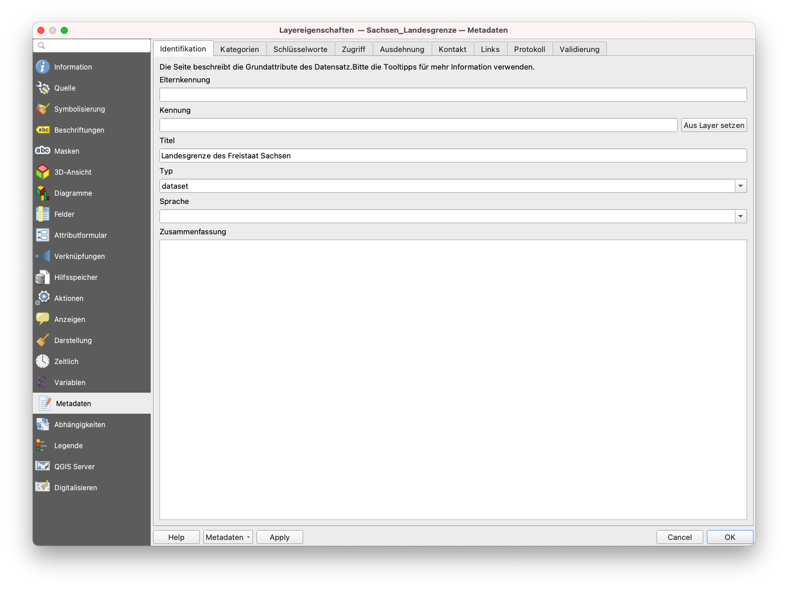

Abbildung 2.10. Bearbeiten einiger Metadaten

4. Wechseln Sie erneut zur Registerkarte "Information" und prüfen Sie, ob sich etwas geändert hat.

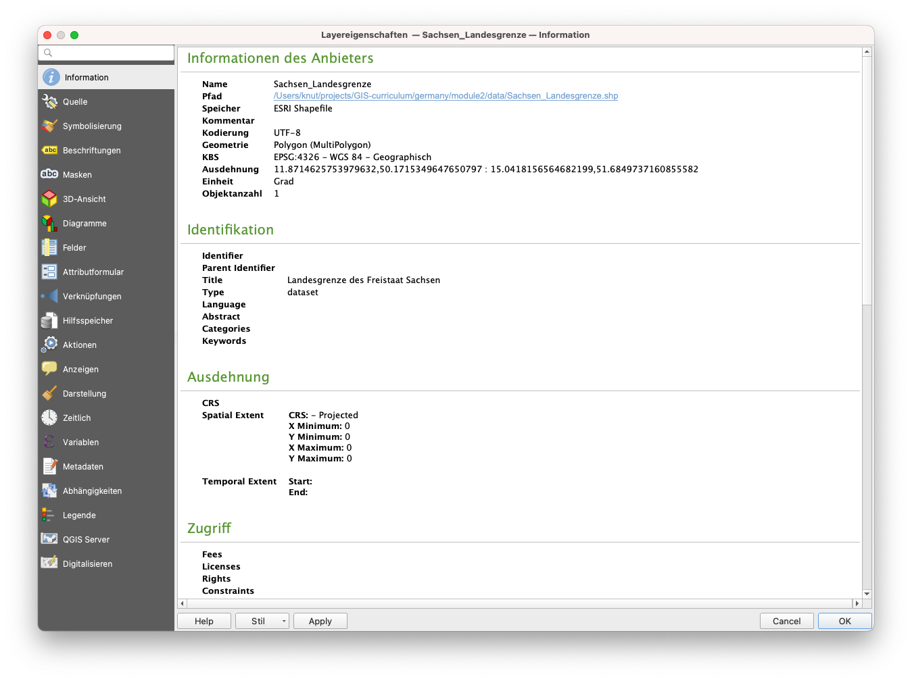

Abbildung 2.11. Die Registerkarte "Information" nach dem Bearbeiten einiger Metadaten


#### Quizfragen

1. Richtig oder Falsch:

    1. Alle Vektordateien sind Shapefiles. -- ***Falsch (ein Shapefile ist ein Dateiformat einer Vektordatei. Andere Vektordatendateiformate sind geopackage, geojson und flatgeobuf)***
    2. Beim Rendern auf der Kartenansicht überdeckt ein Layer, der im Ebenenbedienfeld höher ist, immer einen Layer, der im Ebenenbedienfeld niedriger ist, oder erscheint darüber. -- ***Falsch (wenn aktiviert, überschreibt die Anordnung im Layerreihenfolge-Bedienfeld die Anordnung im Layer-Bedienfeld)***
    3. Sie können Metadaten-Informationen zu einem Layer im Layer-Bedienfeld und im Browser-Bedienfeld überprüfen. -- ***Richtig***


### Phase 2 Titel: Der Datenquellen-Manager und die Verbindung zu Remote-Diensten

#### **Die Datenquellenverwaltung**

Wenn Sie das Browser-Bedienfeld nicht zum Laden von Layern verwenden möchten, können Sie auch die **Datenquellenverwaltung** verwenden.

Die **Datenquellenverwaltung** wurde mit der Veröffentlichung von QGIS 3 eingeführt und ist ein "One-Stop-Shop" für das Hinzufügen und Laden von Layern aus verschiedenen Datenquellen in QGIS. Vor ihrer Einführung gab es separate Fenster zum Laden verschiedener Datenquellen (z.B. eines für Raster, eines für Vektoren, etc.). Es kann über **Layers ‣ Datenquellenvwarltung** oder **CTRL + L** erreicht werden.


Abbildung 2.12. Die Datenquellenvwarltung


#### **Übung 02.1: Die Datenquellenverwaltung**

1. Öffnen Sie die **Datenquellenverwaltung**. Sie enthält auf der linken Seite Registerkarten, die sich auf die Art der Datenquelle beziehen, die Sie laden oder mit der Sie eine Verbindung herstellen möchten. Ähnlich wie im Browser können Sie auch in der Datenquellenverwaltung verschiedene Arten von Daten laden und verbinden.
2. **Laden von Vektordaten**

    1. Um Vektordaten zu laden, gehen Sie auf die Registerkarte "Vektor". Es können Dateien, Dateien innerhalb eines Verzeichnisses, eine Datenbank und sogar Remote-Dateien über ein Protokoll wie HTTP, Cloud usw. geladen werden.
    2. Lassen Sie uns die Vektordatei (NCR_Jollibee) laden, die sich im Geopaket Philippines_NCR befindet. Dieser Layer ist ein Punkt-Layer mit den Standorten des Schnellrestaurants Jollibee in der NCR.

        1. Quelle Typ: Datei
        2. Quelle: Wählen Sie das Geopaket Philippines_NCR über die Schaltfläche 
        3. Klicken Sie auf Hinzufügen
        4. Wenn mehr als eine Vektordatei im Geopaket enthalten ist, fragt QGIS Sie, welche geladen werden soll.

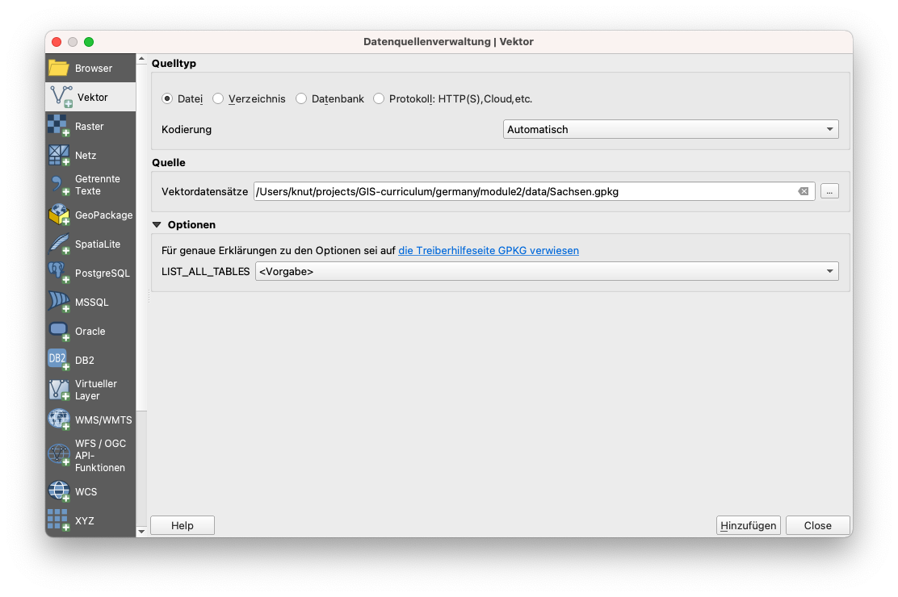

Abbildung 2.13. Laden von Vektordaten aus ein GeoPackage

3. **Laden von Rasterdaten**

    1. Um Rasterdaten zu laden, gehen Sie auf die Registerkarte "Raster". Es können Dateien und Remote-Dateien über ein Protokoll wie HTTP, Cloud, etc. geladen werden. Es gibt ein Raster (NCR_SRTM_DEM) innerhalb des Geopakets Philippines_NCR. Dieses Raster ist ein digitales Höhenmodell der NCR-Region. So laden Sie es:

        1. Quellentyp: Datei
        2. Quelle: Wählen Sie das Geopaket Philippines_NCR über die Schaltfläche 
        3. Klicken Sie auf Hinzufügen
        4. Wenn mehr als eine Rasterdatei im Geopaket enthalten ist, fragt QGIS Sie, welche geladen werden soll

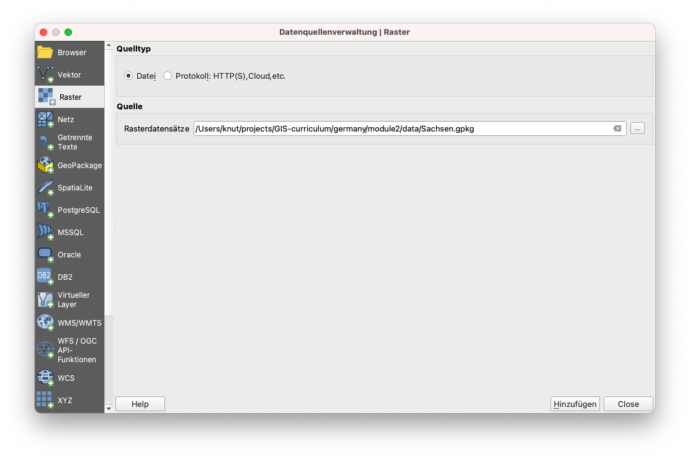

Abbildung 2.14. Laden von Rasterdaten aus einem GeoPackage

4. **Laden von CSV- und anders separierten Textdateien**

    1. Neben Vektoren und Rastern sind CSVs und Tabellenkalkulationen eine weitere häufig verwendete Datei für GIS-Anwender:innen. Glücklicherweise ist es relativ einfach, diese Dateien in QGIS zu laden.
    2. CSVs und anders separierte Textdateien können über die Registerkarte "Getrennte Texte" in der Datenquellenverwaltung geladen werden, sie können aus dem Browser-Bedienfeld hinzugefügt werden und sogar einfach in die Kartenansicht gezogen werden. Es sollten jedoch einige Dinge beachtet werden, wenn die vorliegende CSV-Datei Geometrieinformationen (d. h. Punktpositionen) enthält. Als Faustregel gilt Folgendes:

        1. Verwenden Sie die Datenquellenverwaltung zum Laden von CSV-Dateien, unabhängig davon, ob sie Geometrieinformationen enthalten oder nicht.
        2. Wenn CSVs über das Browser-Bedienfeld oder durch Ziehen geladen werden, stellen Sie sicher, dass eine entsprechende CSVT-Datei vorhanden ist, damit die Felddatentypen erhalten bleiben.
        3. Wenn Sie Probleme mit der Erhaltung der Datentypen für Ihre CSVs haben, können Sie eine so genannte CSVT-Datei verwenden.  Sie können mehr über das Laden von CSVs in QGIS unter folgendem englischsprachigen Link lesen:  [https://bnhr.xyz/2018/08/07/specifying-csv-data-types-using-a-csvt-file.html ](https://bnhr.xyz/2018/08/07/specifying-csv-data-types-using-a-csvt-file.html)

    3. CSVs und Tabellenkalkulationen können in QGIS mit oder ohne räumliche oder geometrische Informationen geladen werden. Wenn sie mit räumlichen Informationen geladen werden, werden sie als Vektordaten behandelt. Wenn sie ohne geladen werden, werden sie als normale tabellarische Daten behandelt.
    4. Im Datenordner befindet sich eine CSV-Datei mit dem Namen NCR_McDonalds.csv, die Punktstandorte von McDonald's-Filialen in NCR enthält. Um sie zu laden:

        1. Wechseln Sie auf die Registerkarte "Getrennte Texte"
        2. Dateiname: Wählen Sie die NCR_McDonalds CSV über die Schaltfläche 
        3. Dateiformat: CSV
        4. Datensatz- und Feldoptionen: Standard beibehalten
        5. Geometriedefinition:

            * Punktkoordinaten
            * X-Feld: Längengrad
            * Y-Feld: Breitengrad
            * Geometrie CRS: EPSG: 4326 - WGS 84

        6. Layer-Einstellungen: Wählen sie Datei überwachen und Räumlichen Index benutzen aus

            * Wenn "Datei überwachen" aktiviert ist, werden Aktualisierungen der lokalen CSV-Datei automatisch in den in QGIS geladenen Layer übernommen.
            * "Räumlichen Index benutzen" fügt dem geladenen Layer einen räumlichen Index hinzu, was die Vektorverarbeitung beschleunigt.


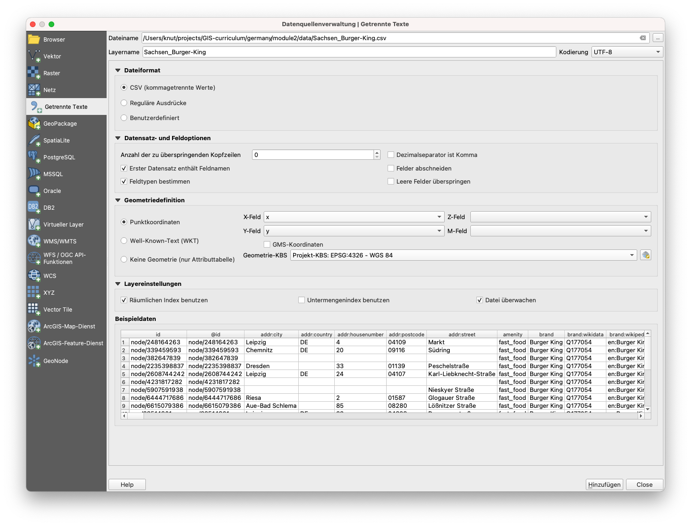

Abbildung 2.15. Laden einer CSV-Datei

Wenn alle Layer aus den vorangegangenen Übungen geladen sind, sollte das Layer-Bedienfeld in etwa wie folgt aussehen:

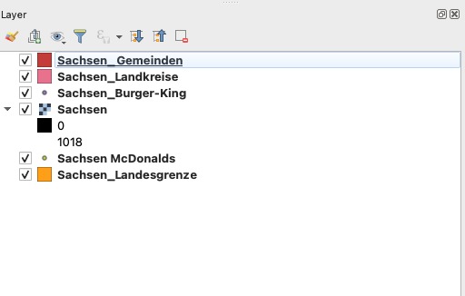

Abbildung 2.16. Layer-Bedienfeld mit allen geladenen Layern


Die Kartenansicht sollte in etwa so aussehen:

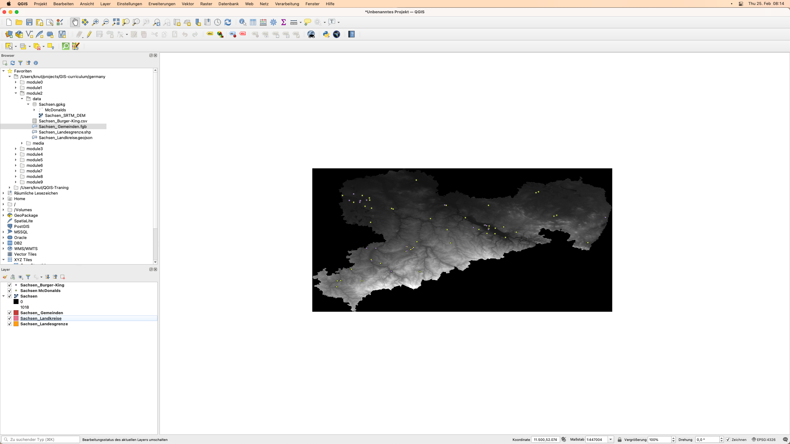

Abbildung 2.17. QGIS-Oberfläche mit allen geladenen Layern


Sie können die Layer im Layer-Bedienfeld beliebig neu anordnen.


#### **Verbinden von QGIS mit Remote Services**

Neben Vektor- und Rasterdateien kann sich QGIS auch mit entfernten Diensten wie Kachelservices, OGC Web Services (WMS, WFS) und sogar ESRI ArcGIS Web Services verbinden. Diese Verbindung kann über das Browser-Panel oder die Datenquellenverwaltung hergestellt werden.


#### **Übung 02.2: Verbinden mit XYZ-Kacheln**

XYZ-Kacheln werden in der Regel als Basiskarten verwendet und kommen nicht nur in Desktop-Anwendungen, sondern auch in Web-Anwendungen zum Einsatz.

So stellen Sie eine Verbindung zu einem Kachelserver her:

1. Wechseln Sie zum **Browser-Bedienfeld**.
2. **Klicken Sie mit der rechten Maustaste auf XYZ-Kacheln ‣ Neue Verbindung**.
3. Fügen Sie Folgendes hinzu:

```
    Name: PGP-Basemap
    URL: https://basemapserver.geoportal.gov.ph/tiles/v2/PGP/{z}/{x}/{y}.png
```
4. Klicken Sie auf OK.


Abbildung 2.18. Hinzufügen einer XYZ-Verbindung in QGIS

5. Dies sollte ein PGP Basemap Element unter XYZ Kacheln im Browser Panel hinzufügen.

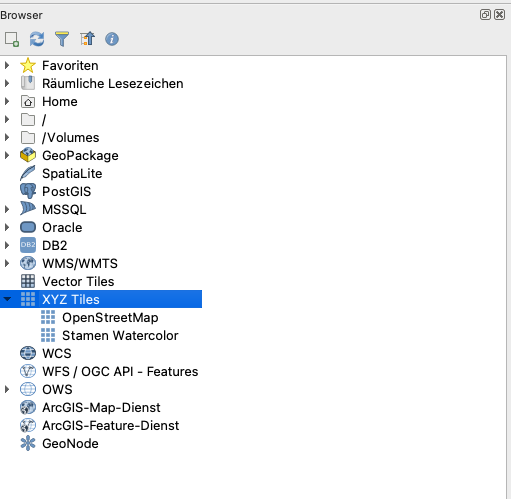

Abbildung 2.19. PGP-Basemap-Kachelserver dem Browser-Bedienfeld hinzugefügt

6. Sie können den XYZ-Kachellayer wie jeden anderen Layer aus dem Browser-Bedienfeld laden.


Abbildung 2.20. PGP Basemap Layer in QGIS geladen

7. Versuchen Sie auch, den ESRI World Imagery Layer hinzuzufügen.

```
    Name: ESRI World Imagery
    URL: https://server.arcgisonline.com/ArcGIS/rest/services/World_Imagery/MapServer/tile/{z}/{y}/{x}
```

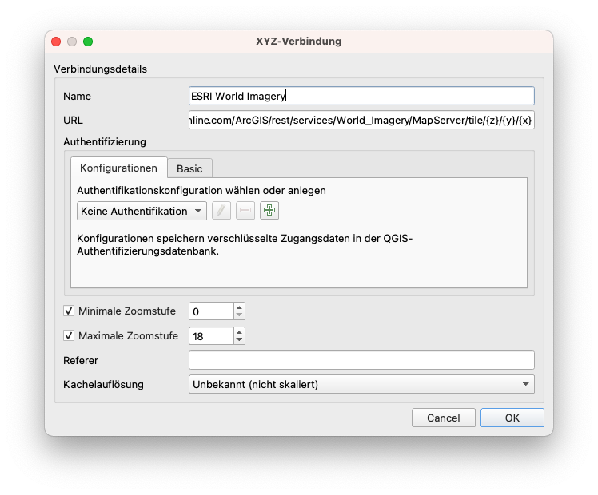


**BONUS:** Wenn Sie mehrere Grundkarten unter XYZ-Kacheln im Bedienfeld des Browsers hinzufügen möchten, können Sie die Anweisungen in diesem englischsprachigen Beitrag befolgen: [https://bnhr.xyz/2018/10/07/basemaps-in-qgis.html](https://bnhr.xyz/2018/10/07/basemaps-in-qgis.html)

**BONUS #2:** Sie können die URLs der Tileserver, die Sie auf der Website der Leaflet-Provider ([https://leaflet-extras.github.io/leaflet-providers/preview/](https://leaflet-extras.github.io/leaflet-providers/preview/)) finden, als XYZ-Kacheln im Bedienfeld hinzufügen.


#### **Übung 02.3: Verbinden mit WMS/WMTS und WFS**

WMS oder Web Map Service ist ein vom Open Geospatial Consortium (OGC) ([https://www.ogc.org/](https://www.ogc.org/)) definierter Webservice-Standard zur Bereitstellung von Bildern (Rasterkacheln) über das Internet. Wenn Daten über WMS bereitgestellt werden, kann der/die Benutzer:in die darunter liegenden Informationen weder direkt bearbeiten noch eine eigene Darstellung für sie wählen.

WFS oder Web Feature Services ist ein weiterer OGC-konformer Webdienst für die Bereitstellung von Features (Vektoren) über das Internet. Wenn Daten über WFS bereitgestellt werden, hat der/die Benutzer:in Zugriff auf die darunter liegenden Attribute und die Geometrie, so dass er/sie den Layer gestalten, bearbeiten und für die Vektoranalyse verwenden kann.

So stellen Sie eine Verbindung zu einem WFS her:

1. Rufen Sie das **Browserbedienfeld** auf
2. **Rechtsklick auf WMS/WMTS ‣ Neue Verbindung**
3. Fügen Sie Folgendes hinzu:
```
Name: LiPAD 100-jährige Hochwassergefahr
URL: https://api.mapbox.com/styles/v1/osmph/cjqrynb300m522sper0emmgs6/wmts?access_token=sk.eyJ1Ijoib3NtcGgiLCJhIjoiY2pxbjF6czN2MGllbTQ4bXVuOW44ZDlpbSJ9.pUqHal3xOR1yZUaM6LbLkg
```
4. Klicken Sie auf Hinzufügen

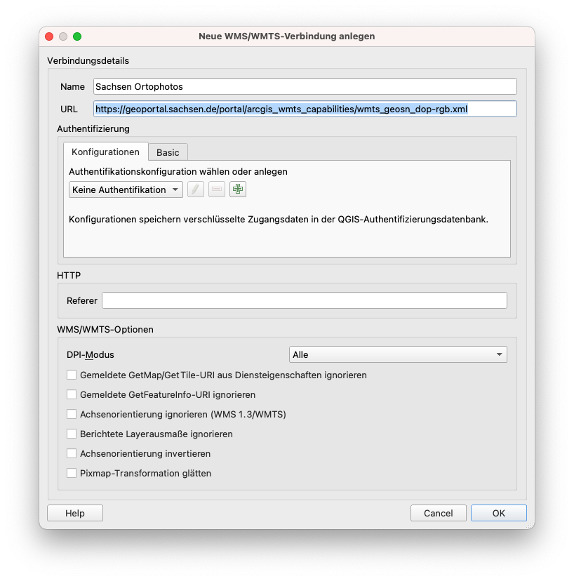

Abbildung 2.21. Erstellen einer neuen WMS/WMTS Verbindung

5. Dies sollte ein LiPAD 100-jähriges Hochwasserrisiko Element unter den WMS/WMTS und OWS Verbindungen im Bedienfeld des Browsers hinzufügen.


Abbildung 2.22. Das LiPAD 100-jährliche Hochwassergefahren WMS im Bedienfeld des Browsers hinzugefügt

6. Sie können die WMS-Layer wie jeden anderen Layer aus dem Bedienfeld des Browsers laden.


Abbildung 2.23. Hochwassergefahrenkarte aus WMS in QGIS geladen

7. Das Verbinden mit WFS erfolgt auf die gleiche Weise.


#### **Quizfragen**

1. Richtig oder Falsch:

    1. Sie können in QGIS nur lokale Dateien laden -- ***Falsch (Sie können auch entfernte Dateien laden, z.B. solche, die online gespeichert sind oder von Webservices bereitgestellt werden)***


### Phase 3: Exportieren von Layern, Layern im Speicher (temporär) und virtuellen Layern

#### **Exportieren von Layern aus QGIS**

Das Exportieren von Layern (oder das Speichern von Layern in Dateien) ist in QGIS ganz einfach. Klicken Sie einfach **mit der rechten Maustaste auf den Layer ‣ Exportieren**, um die Exportoptionen für den Layer anzuzeigen.

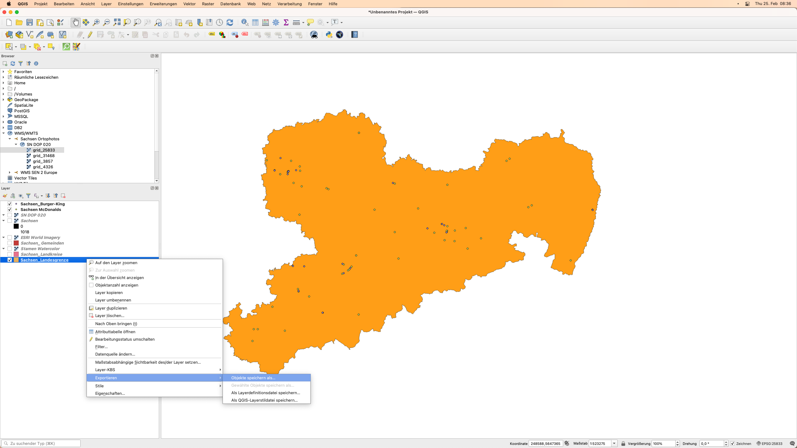

Abbildung 2.24. Exportieren eines Layers aus QGIS

* Mit **Objekt speichern als...** können Sie den Raster- oder Vektorlayer speichern.

    * Wenn ein **Filter** auf dem Vektor-Layer aktiv ist, werden nur die gefilterten Features (die auf der Kartenansicht erscheinen) exportiert.

* **Gewählte Objekte speichern als...** ist eine Option für Vektorlayer, mit der Sie nur die aktuell ausgewählten Features speichern können.
* **Als Layerdefinitionsdatei speichern...** erzeugt eine QLR-Datei (siehe Modul 1, QGIS-Dateiformate) für den Layer
* **Als QGIS-Layerstildatei speichern...** speichert eine QML-Datei (siehe Modul 1, QGIS-Dateiformate) für den Layer

Wenn Sie einen Layer exportieren, gibt Ihnen QGIS die Möglichkeit, das Format der Ausgabedatei, die einzuschließenden Felder (falls es sich um eine Vektordatei handelt), das Ausgabekoordinaten-Referenzsystem und andere Optionen zu wählen. Das bedeutet, dass Sie durch den Export eines Layers eine Koordinatenprojektion durchführen können.


Abbildung 2.25. Dialogfeld Vekorlayer speichern

Weitere Informationen über das Speichern eines Layers aus einer bestehenden Datei finden Sie unter: [https://docs.qgis.org/3.16/de/docs/user_manual/managing_data_source/create_layers.html#save-layer-from-an-existing-file](https://docs.qgis.org/3.16/de/docs/user_manual/managing_data_source/create_layers.html#save-layer-from-an-existing-file)


#### **Layer im Speicher**

Manchmal müssen oder wollen wir die Layer, die wir in unserer Analyse verwenden, nicht physisch in unserem Computer speichern, besonders wenn sie nur temporär sind.

QGIS versteht dies und erlaubt es dem Benutzer, **temporäre** Layer zu erstellen. Diese Layer können ähnlich wie reguläre Vektorlayer verwendet werden, müssen aber nicht dauerhaft in einer Datei in unseren Speicherlaufwerken gespeichert werden, da QGIS sie im Speicher oder RAM ablegt. Temporäre Layer werden im Layer-Bedienfeld mit diesem Symbol angezeigt .

Die Ausgaben von Verarbeitungsalgorithmen werden standardmäßig als temporäre Layer gespeichert.

Der Nachteil von temporären Layern ist, dass QGIS diese "**Layer im Speicher**" "vergisst", wenn es geschlossen wird. Um hier Abhilfe zu schaffen, können wir das **Memory Layer Saver Plugin** verwenden, um unsere temporären Layer persistent zu machen. Wenn Sie ein QGIS-Projekt speichern, das temporäre Layer verwendet, ist es eine gute Praxis, zuerst das Plugin "Memory Layer Saver" zu starten/aktivieren. Um das Plugin "Memory Layer Saver" zu verwenden, gehen Sie einfach zu **Plugins ‣ Memory Layer Saver**, bevor Sie Ihr QGIS-Projekt speichern und schließen. Wenn Sie Ihr QGIS-Projekt das nächste Mal öffnen, sollten die temporären Layer (oder Layer im Speicher) noch vorhanden sein.

Natürlich können Sie den temporären Layer auch einfach dauerhaft machen, indem Sie den Layer in eine Datei exportieren. Ein Klick auf das Symbol  öffnet automatisch einen Dialog zum Exportieren von Layern.


#### **Virtuelle Layer**

Ein virtueller Layer ist ein spezieller Typ eines Vektor-Layers, der "on the fly" als Ergebnis einer Abfrage oder von Daten eines anderen Layers erstellt wird.

Zum Beispiel kann ein virtueller Layer erstellt werden, der einen Puffer um einen anderen Feature-Layer bildet. Wann immer ein neues Feature zum Quell-Feature-Layer hinzugefügt wird, wird der virtuelle Layer entsprechend aktualisiert.

Derzeit scheinen virtuelle Layer nicht mit Quell-Layern im Speicher zu funktionieren.

Virtuelle Layer sind dynamisch. Das heißt, wenn der Basis-/Quell-Layer aktualisiert wird, wird auch der virtuelle Layer aktualisiert. Dies kann Speicherplatz sparen und die Datenduplizierung reduzieren, da die Daten der virtuellen Layer einfach von der Basisebene abgerufen werden, ohne dass etwas auf der Festplatte gespeichert werden muss, obwohl es zu einem gewissen Performance-Overhead kommen kann, wenn komplexe Abfragen oder Operationen zur Definition des virtuellen Layers verwendet werden.

Zur Definition des virtuellen Layers werden SQL-ähnliche Konstrukte verwendet.

Virtuelle Layer sind von anderen Layern abhängig, daher ist es wichtig, dass die Basislayer nicht verschoben oder umbenannt werden.

Wenn der Basislayer aktualisiert wird, müssen Sie die Kartenanzeige durch Schwenken oder Zoomen der Karte aktualisieren, um die Aktualisierung der virtuellen Ebene anzuzeigen.


#### **Quizfragen**

1. Richtig oder Falsch:

    1. Beim Exportieren eines Vektor-Layers können Sie das Format auswählen, in dem er gespeichert werden soll. -- ***Richtig***
    2. Temporäre Layer werden von QGIS immer vergessen, wenn es geschlossen wird. -- ***Falsch (sie können mit Hilfe des Plugins Memory Layer Saver persistent gemacht werden)***
    3. Wenn der Basis-Layer für einen virtuellen Layer aktualisiert wird, wird der virtuelle Layer automatisch auf der Kartenansicht aktualisiert, ohne dass eine Benutzereingabe erforderlich ist. -- ***Falsch (der/die Benutzer:in muss die Kartenansicht entweder durch Schwenken oder Zoomen aktualisieren, bevor die Aktualisierung der virtuellen Layer auf der Kartenansicht angezeigt wird)***


### Wenn Sie Lust auf mehr haben:


#### **Installieren Sie einige Erweiterungen, die als Datenquellen dienen**

Einige Erweiterungen bieten die Funktionalität, Daten in QGIS zu laden. Dazu gehören Vektordaten, Satellitenbilder, Rasterdateien, Basiskarten, etc. Versuchen Sie, die folgenden Erweiterungen zu installieren und finden Sie heraus, welche Art von Daten sie in QGIS laden:

* QuickOSM ([https://plugins.qgis.org/plugins/QuickOSM/](https://plugins.qgis.org/plugins/QuickOSM/))
* SRTM-Downloader ([https://plugins.qgis.org/plugins/SRTM-Downloader/](https://plugins.qgis.org/plugins/SRTM-Downloader/))
* QuickMapServices ([https://plugins.qgis.org/plugins/quick_map_services/](https://plugins.qgis.org/plugins/quick_map_services/))

P.S. Für einige dieser Erweiterungen müssen Sie ein Konto beim Datenanbieter einrichten.


#### **Verbindung zu GeoNode-Instanzen**

GeoNode ([https://geonode.org/](https://geonode.org/)) ist ein Open-Source Geospatial Content Management System, das mit einem ausgereiften FOSS4G-Stack aufgebaut ist, der PostGIS, GeoServer, MapStore, etc. enthält. Sie können sich GeoNode als ein Geodatenportal vorstellen. Sie können QGIS einfach mit einer GeoNode-Instanz über den GeoNode-Konnektor im Bedienfeld des Browsers oder in der Datenquellenverwaltung verbinden.

1. Gehen Sie zum **Browser Bedienfeld**
2. Klicken Sie mit der rechten Maustaste auf **GeoNode ‣ Neue Verbindung**.
3. Fügen Sie Folgendes hinzu:
```
Name: UNESCO IHP-WINS
URL: [http://ihp-wins.unesco.org/](http://ihp-wins.unesco.org/)
```


Mehr über die Verbindung von QGIS mit entfernten Diensten erfahren Sie unter: [https://bnhr.xyz/2018/10/12/connecting-qgis-to-remote-services.html](https://bnhr.xyz/2018/10/12/connecting-qgis-to-remote-services.html) (englischsprachig)


#### **Übung/Tutorial zu virtuellen Layern**

1. Öffnen Sie QGIS.
2. Laden Sie ein Satellitenbild oder eine Satellitenbasiskarte über XYZ-Kacheln oder QuickMapServices-Erweiterungen (z.B. Google Satellite).
3. Erstellen Sie einen neuen GeoPackage-Layer mit  in der Werkzeugleiste des Datenquellen-Managers. Nennen Sie es Bäume, fügen Sie einen Radius (Integer) und ein Artenfeld (Text) hinzu und verwenden Sie ein projiziertes CRS (z.B. EPSG:3857)


Wenn Sie gefragt werden, ob die Datei bereits existiert, wählen Sie "Neuen Layer hinzufügen".


4. Schalten Sie die Bearbeitung von Bäume ein, indem Sie mit der rechten Maustaste darauf klicken ‣ Bearbeitungsstatus umschalten oder klicken Sie auf  in der Digitalisierungs-Symbolleiste.
5. Wählen Sie einen Bereich auf dem Satellitenbild aus, der Bäume enthält.
6. Aktivieren Sie bei eingeschalteter Bearbeitung das Hinzufügen von Punkten zum Layer "Bäume", indem Sie auf  klicken (CTRL + .).
7. Digitalisieren Sie einzelne Bäume, indem Sie auf deren Standort klicken und die Attributinformationen hinzufügen. Tun Sie dies für 4 Bäume. Für diese Übung können Sie die Informationen einfach erraten.

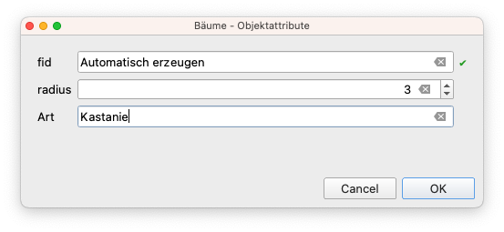

8. Vergessen Sie nach dem Hinzufügen der Punkte nicht, Ihre Bearbeitungen zu speichern, indem Sie auf  in der Symbolleiste "Digitalisieren" klicken, bevor Sie die Bearbeitung ausschalten.

 hinzugefügt")

9. Fügen Sie einen virtuellen Layer hinzu, indem Sie auf 
 in der Symbolleiste des Datenquellen-Managers.
10. Setzen Sie den Layer-Namen auf Baumkronen. Bäume importieren. Fügen Sie die folgende Abfrage hinzu:
```
select fid, buffer(geometry, radius), species from Trees
```

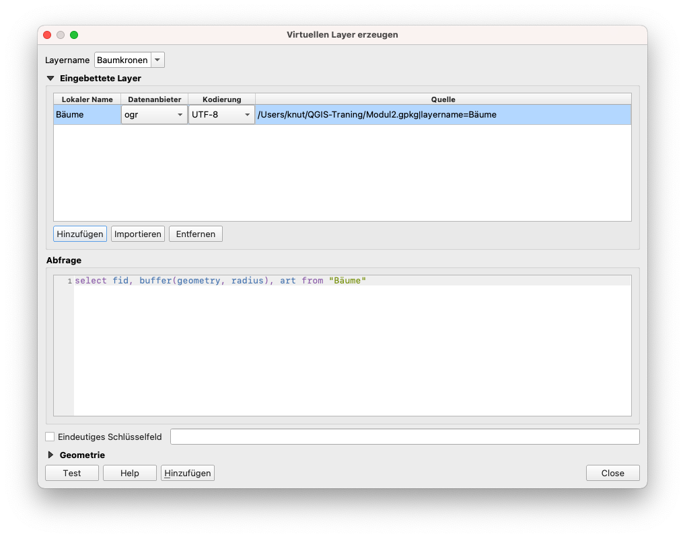


Fügen Sie einen neuen Punkt hinzu und aktualisieren Sie dann die Kartenansicht (durch Zoomen oder Schwenken der Kartenansicht), um die Aktualisierung im virtuellen Layer zu sehen. Was stellen Sie fest?


### Um Ihre neuen Fähigkeiten auszuprobieren, versuchen Sie...

#### **Das Laden von Rastern und Vektoren aus dem Internet**

Neben den lokalen Binärdateien (Vektoren, Raster) kann QGIS auch Vektoren und Raster aus dem Internet laden. Verwenden Sie den Datenquellen-Manager, um die Daten von der folgenden URL zu laden:

https://raw.githubusercontent.com/benhur07b/stomp-covid19-data/master/spatial/stompcovidph_regions.geojson


#### **Laden einer Tabellenkalkulation in QGIS mit Hilfe des Spreadsheet Layers Plugins**

Installieren Sie das Spreadsheet Layers Plugin und versuchen Sie, ein Tabellendokument in QGIS zu laden. Das Plugin akzeptiert Open Document Standard Formate (.ods) und Microsoft Excel Dateien (.xls, .xlsx).

Weitere Informationen gibt es hier (englischsprachig): [https://bnhr.xyz/2018/07/27/plugin-fridays-spreadsheet-layers-plugin.html](https://bnhr.xyz/2018/07/27/plugin-fridays-spreadsheet-layers-plugin.html)


### Tipps

1. Wenn Sie einmal einen Weltkarten-Layer benötigen, versuchen Sie, **world** in die Koordinatenleiste der Statusleiste einzugeben. Was passiert? Dies ist nur eines der Easter Eggs, die man in QGIS findet, wenn man bestimmte Wörter in die Koordinatenleiste eintippt.
