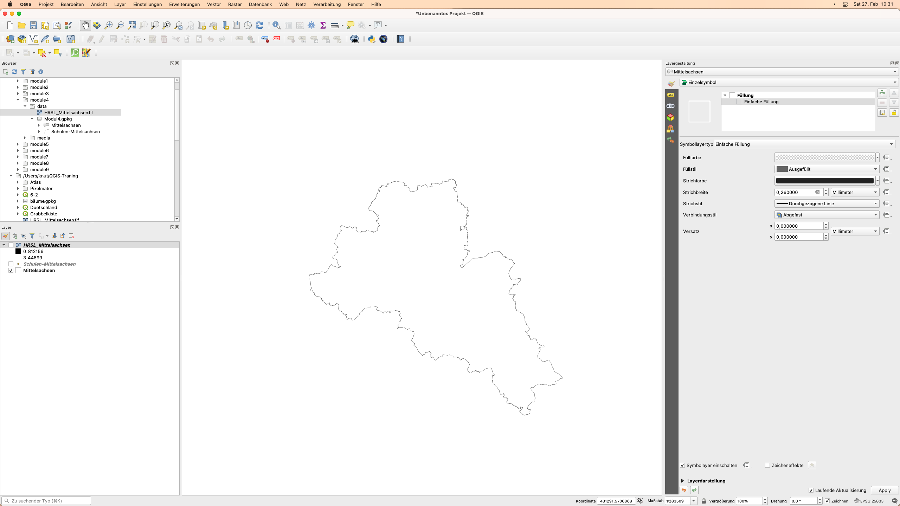
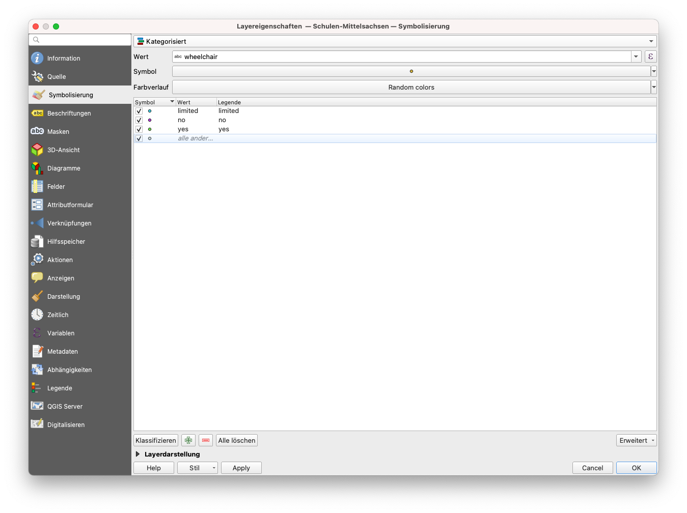
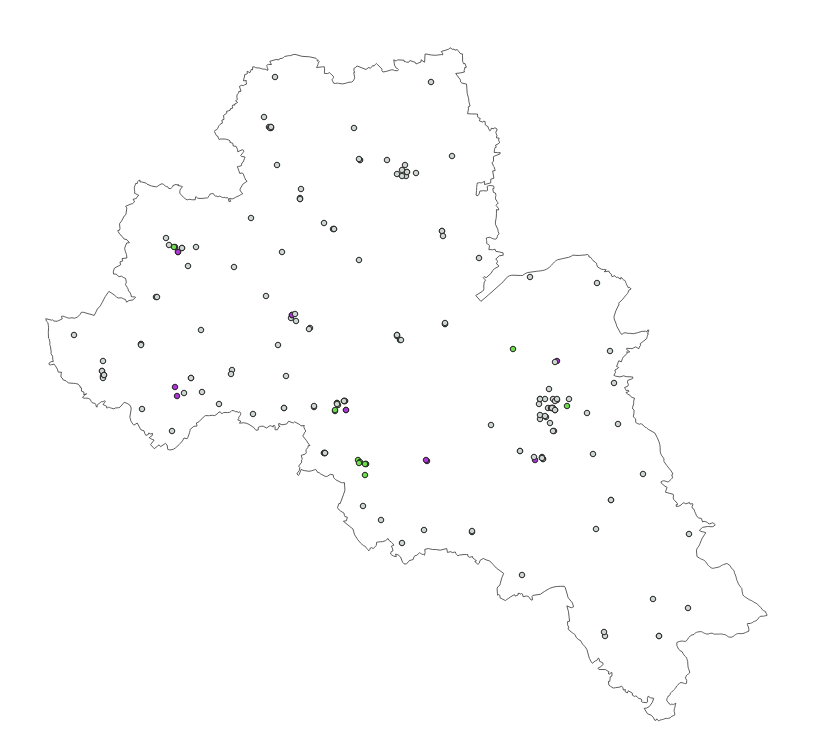
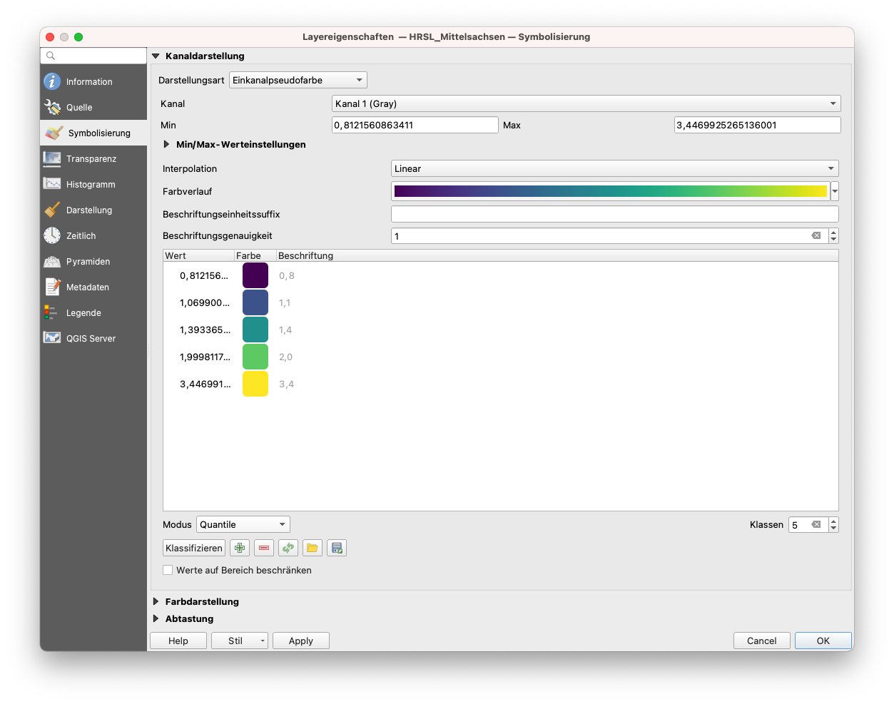
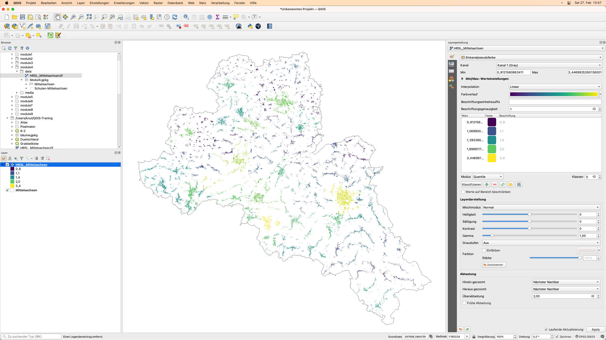
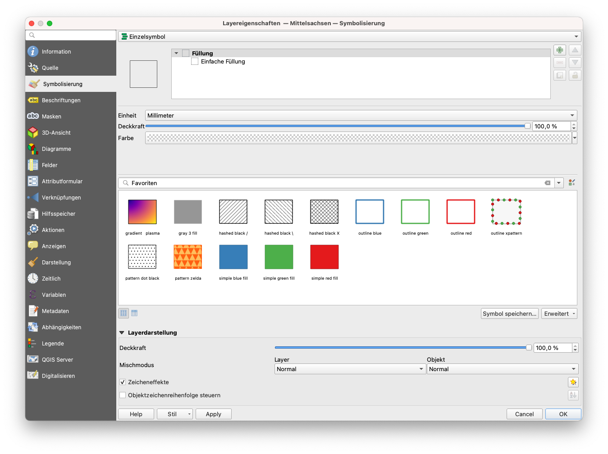
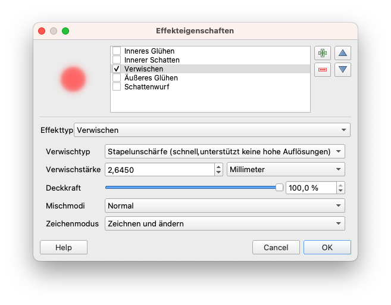
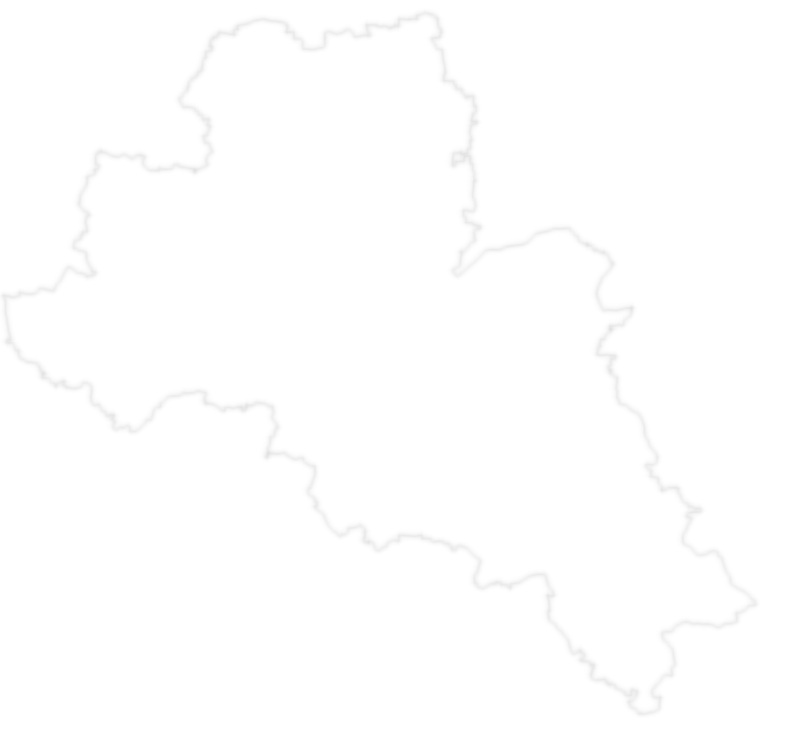
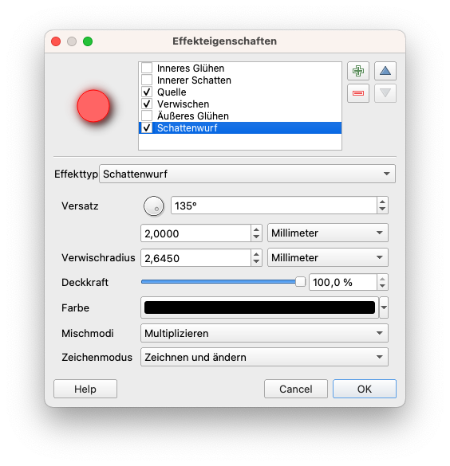
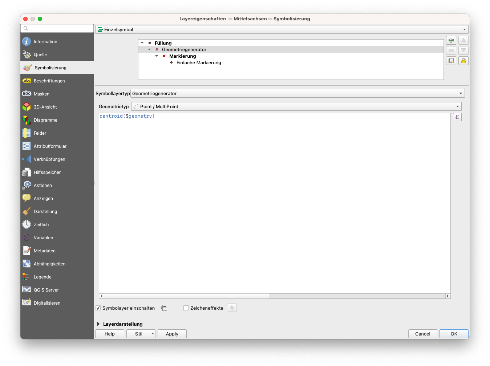

# Modul 4 - Layer-Styling

**Autor**: Ketty
**Übersetzung**: Knut Hühne

## Pädagogische Einführung

In diesem Modul lernen Sie, wie Sie das visuelle Erscheinungsbild einer Karte durch die Auswahl geeigneter Symbole und Kartenfarben verändern können. Am Ende des Moduls sollten Sie Konzepte wie Kartensymbologie und Kartenstile kennen. Außerdem erlernen Sie die folgenden Fähigkeiten:

* Styling von Layern
* grundlegende Raster- und Vektorsymbole und wie man sie auf einen Layer anwendet
* Mischmodi und Zeicheneffekte
* Verwenden von Abfragen, um räumliche Operationen auszuführen

## Technische Voraussetzungen

* Computer
* Internetverbindung
* QGIS 3.16 oder höher
[TODO]
* Pampanga administrative boundary layer (innerhalb von [module4.gpkg](data/module4.gpkg))
* Pampanga Kliniken (innerhalb von [module4.gpkg](data/module4.gpkg))
* [Pampanga High Resolution Settlement Layer](data/HRSL_Pampanga_Population.tif)
[/TODO]

## Voraussetzungen

* Grundkenntnisse in der Bedienung eines Computers
* Grundlegendes Verständnis aller vorherigen Module

## Zusätzliche Ressourcen

* QGIS-Symbologie - [https://docs.qgis.org/3.16/de/docs/training_manual/basic_map/symbology.html](https://docs.qgis.org/3.16/de/docs/training_manual/basic_map/symbology.html)
* Style Sharing Repository - [https://www.gislounge.com/qgis-style-sharing-repository/](https://www.gislounge.com/qgis-style-sharing-repository/)
* Stile - [https://plugins.qgis.org/styles/](https://plugins.qgis.org/styles/)
* Style Hub - [https://style-hub.github.io/](https://style-hub.github.io/)
* Hillshade in QGIS - [https://bnhr.xyz/2019/02/08/mapping-icebergs-in-qgis.html](https://bnhr.xyz/2019/02/08/mapping-icebergs-in-qgis.html)
* Kartierung von Eisbergen in QGIS - [https://bnhr.xyz/2019/02/08/mapping-icebergs-in-qgis.html](https://bnhr.xyz/2019/02/08/mapping-icebergs-in-qgis.html)

## Thematische Einführung

Lassen Sie uns mit einem Beispiel beginnen:

Stellen wir uns vor, Sie sind in einer neuen Stadt, vielleicht als Tourist:in, in der Freizeit oder aus geschäftlichen Gründen. In der Stadt gibt es eine Reihe von Orten, die man gesehen haben muss, wie z. B. Museen, Cafés, Strandpromenaden, Denkmäler, Kulturläden und Märkte. Sie erhalten dann einen Papier-Stadtplan, auf dem Sie die Punkte finden, die Sie unbedingt sehen müssen. Die touristischen Punkte sind alle ausschließlich als rote Punkte markiert. Würde dieser Stadtplan Ihrer Meinung nach Ihre Tour durch die neue Stadt erleichtern? Vermutlich nicht.

Deshalb lernen Sie im folgenden, eine Karte mit verschiedenen Symbolen und Farben zu erstellen. Was Sie nach der Anwendung von Styling-Konzepten in Ihrer Karte sehen, ist eine dynamische visuelle Darstellung der Daten, mit denen Sie arbeiten.

### Wichtige Bedienfelder, Registerkarten und Darstellungsarten

#### **Layergestaltung-Bedienfeld**

Dieses Bedienfeld ist gewissermaßen eine Abkürzung zu einigen Funktionen des Dialogs "Layereigenschaften". Es bietet Ihnen eine schnelle und praktische Möglichkeit, das Rendering und das Verhalten eines Layers zu definieren und seine Auswirkungen zu visualisieren, ohne den Layer-Eigenschaften-Dialog zu öffnen.

Es erspart Ihnen nicht nur den Umgang mit dem modalen und blockierenden Dialog der Layereigenschaften, sondern auch die Überfrachtung des Bildschirms mit Funktionsdialogen, da die meisten von ihnen (Farbauswahl, Effekteigenschaften, Regelbearbeitung, Beschriftungsersetzung...) eingebettet sind: Wenn Sie z. B. auf die Farbschaltflächen im Layer-Bedienfeld klicken, wird der Farbauswahldialog im Layer-Bedienfeld selbst geöffnet und nicht als separater Dialog.

Wählen Sie im Layergestaltung-Bedienfeld aus der Dropdown-Liste einen Layer aus. Sie können nun:

* seine Symbologie, Transparenz und sein Histogramm im Falle einer Rasterebene einstellen. Diese Optionen sind dieselben, die auch im Dialogfeld "Rasterlayereigenschaften" ([https://docs.qgis.org/3.16/de/docs/user_manual/working_with_raster/raster_properties.html#raster-properties-dialog](https://docs.qgis.org/3.16/de/docs/user_manual/working_with_raster/raster_properties.html#raster-properties-dialog)) verfügbar sind.
* seine Symbologie und Beschriftung einstellen. Diese Optionen sind auch im Dialogfeld "Vektoreigenschaften" ([https://docs.qgis.org/3.16/de/docs/user_manual/working_with_vector/vector_properties.html#vector-properties-dialog](https://docs.qgis.org/3.16/de/docs/user_manual/working_with_vector/vector_properties.html#vector-properties-dialog)) verfügbar.
* die gesamte Historie der Änderungen überblicken, die Sie im aktuellen Projekt auf den Layer-Stil angewendet haben. Sie können also jeden Zustand rückgängig machen oder wiederherstellen, indem Sie ihn in der Liste auswählen und auf Anwenden klicken.

Eine weitere leistungsstarke Funktion dieses Bedienfelds ist das Kontrollkästchen Live-Aktualisierung. Aktivieren Sie es und Ihre Änderungen werden automatisch in der Kartenansicht gerendert, während Sie fortfahren. Sie müssen nicht mehr auf die Schaltfläche "Anwenden" klicken.

Um das Bedienfeld zu aktivieren, klicken Sie auf Ansicht->Bediefelder und markieren Sie dann Layergestaltung.

Abbildung 4.1: Bedienfeld Layergestaltung

#### **Registerkarte "Symbolisierung" in den Layereigenschaften**

Um auf die Registerkarte "Symbolisierung" zuzugreifen, doppelklicken Sie auf den Layer, um die Layereigenschaften zu öffnen-> Klicken Sie auf Symbolisierung.

Hier können Sie die diverse Einstellungen machen um zu beeinflussen, wie Ihre Daten dargestellt werden. In den Screenshots unten sehen Sie die Symbologie-Registerkarten für Vektor- bzw. Rasterdatensätze;

Figure 4.2: Symbologie für Vektor- und Rasterlayer

#### **Raster-Rendering: Kanal-Rendering**

QGIS bietet vier verschiedene Darstellungsarten an. Die Wahl der Darstellungsart hängt vom Datentyp ab. Der voreingestellte Darstellungstyp ist Einkanalgraustufe. Sie müssen ihn je nach Datentyp auf den entsprechenden Typ umstellen.

* Multikanalfarbe ([https://docs.qgis.org/3.16/de/docs/user_manual/working_with_raster/raster_properties.html#multiband-color](https://docs.qgis.org/3.16/de/docs/user_manual/working_with_raster/raster_properties.html#multiband-color)) - wenn die Datei mehrere Bänder enthält (z. B. ein Satellitenbild mit mehreren Bändern).
* Paletten/Eindeutige Werte ([https://docs.qgis.org/3.16/de/docs/user_manual/working_with_raster/raster_properties.html#paletted]()) - für Einzelband-Dateien, die mit einer indizierten Palette geliefert werden (z. B. eine digitale topografische Karte) oder für die allgemeine Verwendung von Paletten zum Rendern von Raster-Layern.
* Einzelkanalgraustufen ([https://docs.qgis.org/3.16/de/docs/user_manual/working_with_raster/raster_properties.html#singleband-gray](https://docs.qgis.org/3.16/de/docs/user_manual/working_with_raster/raster_properties.html#singleband-gray)) - (ein Kanal des) Bildes wird als Grau gerendert. QGIS wählt diese Darstellungsart, wenn die Datei weder mehrbandig noch palettiert ist (z. B. eine schattierte Reliefkarte).
* Einkanalpseudofarbe ([https://docs.qgis.org/3.16/de/docs/user_manual/working_with_raster/raster_properties.html#label-colormaptab](https://docs.qgis.org/3.16/de/docs/user_manual/working_with_raster/raster_properties.html#label-colormaptab)) - diese Darstellungsart kann für Dateien mit einer kontinuierlichen Palette oder Farbkarte (z.B. eine Höhenkarte) verwendet werden.
* Schummerung ([(https://docs.qgis.org/3.16/de/docs/user_manual/working_with_raster/raster_properties.html#hillshade-renderer](https://docs.qgis.org/3.16/de/docs/user_manual/working_with_raster/raster_properties.html#hillshade-renderer)) - Erzeugt eine Schummerung (auch als Hilldshade bekannt) aus einem Kanal.

#### **Vektor-Rendering**

Wenn Sie Geodaten-Layer in QGIS Desktop laden, werden diese mit einem zufälligen Single-Symbol-Darstellungsart gestylt. Um dies zu ändern, klicken Sie auf Layer->Layereigenschaften->Symbolisierung.

Im Menü oben links stehen mehrere Darstellungsart-Optionen zur Verfügung:

* Einzelsymbol - dies ist die Standard-Darstellungsart, bei der ein Symbol auf alle Features in einem Layer angewendet wird.
* Kategorisiert - ermöglicht die Auswahl eines kategorischen Attributfelds, mit dem der Layer gestaltet werden soll. Wählen Sie das Feld aus und klicken Sie auf Klassifizieren und QGIS wendet ein anderes Symbol für eindeutigen Wert im Feld an. Sie können auch die Schaltfläche "Ausdrucksdialog" verwenden, um das Styling mit einem SQL-Ausdruck zu erweitern.
* Abgestuft - ermöglicht es Ihnen, die Daten nach einem numerischen Feldattribut in diskrete Kategorien zu klassifizieren. Sie können die Parameter der Klassifizierung angeben (Klassifizierungstyp und Anzahl der Klassen) und die Schaltfläche "Ausdrucksdialog" verwenden, um das Styling mit einem SQL-Ausdruck zu erweitern.
* Regelbasierend - verwenden Sie diese Darstellungsart, um ein benutzerdefiniertes regelbasiertes Styling zu erstellen. Die Regeln basieren dabei auf SQL-Ausdrücken.
* Punktversatz - wenn Sie einen Layer mit gestapelten Punkten haben, können Sie mit dieser Option die Punkte verschieben, damit sie alle sichtbar sind.
* Invertierte Polygone - dies ist ein neuer Darstellungstyp, mit dem ein Feature-Polygon in eine Maske umgewandelt werden kann. Zum Beispiel würde ein Stadtgrenzpolygon, das mit dieser Darstellungsart verwendet wird, zu einer Maske um die Stadt herum werden. Sie ermöglicht auch die Verwendung von kategorisierten, abgestuften und regelbasierten Darstellungsarten und SQL-Ausdrücken.

## Hauptinhalt

### Phase 1: Grundlegende Raster- und Vektorsymbologie

Die Symbologie von Vektordaten kann durch Transparenz, Farbe, Drehung und Größe variieren.

#### **Inhalt**

* Layer-Eigenschaften und Symbologie-Menü
* Arten der Vektordarstellung
* Arten des Rasterrenderings (Kanalrendering)

[TODO]
#### **Beispiel 1: Vektor-Rendering**

1. Zur Demonstration dieses Beispiels werden zwei Beispieldatensätze verwendet: 1. [Kliniken](https://drive.google.com/file/d/1iJQ1nP0ulA96OhyT9wakRheahYKnNmjc/view?usp=sharing) und 2. [Verwaltungsgrenze](https://drive.google.com/file/d/1GiFmr4As5e-yn-4lCqotAzUBHzXU1NS_/view?usp=sharing) der Provinz Pampanga
2. Fügen Sie die beiden Vektorlayer in qgis hinzu; Klicken Sie auf den Button Add vector layer 
 oder benutzen Sie das Bedienfeld des Browsers.
3. So werden sie standardmäßig gerendert. Sie werden feststellen, dass wir einen Polygon- und einen Punkt-Layer haben. Der nächste Schritt besteht darin, die Symbologie für jede von ihnen zu ändern. Die Füllfarben sind möglicherweise nicht die gleichen, aber das ist kein Problem, da QGIS die Farben für verschiedene Instanzen der Anwendung zufällig auswählt.

Abbildung 4.3: Standard-Render

4. Doppelklicken Sie auf den Polygon-Vektor-Layer, der gleichzeitig der administrative Boundary Layer der Provinz Pampanga auf den Philippinen ist
5. Wählen Sie im erscheinenden Menü die Registerkarte **Symbologie**.
6. Ändern Sie die **Füllfarbe** auf **Transparente Füllung**. Tipp:** Klicken Sie auf den Dropdown-Pfeil unter "Füllfarbe".**
7. Das Ergebnis sollte wie unten dargestellt sein. Sie werden feststellen, dass die Option "Keine Füllung" keine Farbe hat

Bild 4.4: Kein Füllrendering für das Polygon

8. Der nächste Schritt ist die Symbolisierung des Punkt-Layers, der gleichzeitig der Clinics Layer ist
9. Doppelklicken Sie auf den Layer **Kliniken**, um den Dialog **Eigenschaften des Layers** zu öffnen. Ändern Sie den Rendertyp von Einzelsymbol auf **Kategorisiert**, wählen Sie als Eigenschaft den **Wert**. Der Wert stellt den Bereich von Interesse dar. Legen Sie das Symbol und die Farbrampe fest. Klicken Sie dann auf Klassifizieren.

Bild 4.5: Layer-Eigenschaften-Dialog

10. Die resultierende Karte sollte wie folgt aussehen

Bild 4.6: Endgültiges Vektorrender

11.  Denken Sie daran, die Layer im **Layer-Bedienfeld** so anzuordnen, dass der Polygon-Layer unterhalb des Punkt-Layers liegt. Dadurch wird die Punktebene sichtbar.

#### **Example 2: Raster rendering**

1. Double click the raster layer which is also the population density layer. This also means it’s a normalized dataset and can therefore be visualized as a choropleth map.
2. Select the symbology tab in the menu that appears
3. Change the styling mode to ‘Singleband pseudocolor’

Figure 4.7: Symbology menu

4. Specify the interpolation, color ramp and mode. Click classify. The result is a choropleth map showing population density across Pampanga province in the Philippines.

Figure 4.8: Population density of Pampanga Province, Philippines

5.  Zoom in to see the new map in finer detail.

Figure 4.9: Zoomed-in map

6. Alternatively, use the **Layer Styling panel**.

[/TODO]

[TODO drop?]
#### **Quizfragen**

1. Was ist die Layer-Symbolik?
2. Welche der folgenden Darstellungsaten sind für Vektordaten anwendbar?
3. Welche Darstellungsaten gibt es für Rasterdaten?

#### **Quizantworten**

1. a. ein grafisches Element, das als Marker, Strich oder Füllung dargestellt wird
   b. ein Zeiger auf die Originaldaten
   c. ein Repository mit verschiedenen Farbschemata

2. a. Renderer für einzelne Symbole
   b. kein Symbol-Renderer
   c. kategorisierter Renderer
   d. abgestufter Renderer
   e. proportionales Symbol
   f. proportionales Symbol
   g. Punkt-Cluster-Renderer

3. a. Einfarbige Pseudofarbe
   b. Einfarbiges Grau
   c. palettiert
   d. Multiband-Farbe
[/TODO]

#### **Tutorial**

1. Nachdem Sie die beiden Layer in QGIS geladen haben, sieht die Kartenansicht wie unten dargestellt aus. Sie werden feststellen, dass beide Ebenen ein einfaches Styling haben. In diesem Tutorial wird erklärt, wie Sie die Zeicheneffekte und Blending-Modi für eine bessere Darstellung verändern können.

Abbildung 4.10: Der erwartete anfängliche Arbeitsbereich

2. Öffnen Sie das Fenster Layereigenschaften und klicken Sie dann auf den Menüpunkt Symbolisierung für die Ebene Verwaltungsgrenzen. Tipp: Führen Sie dazu einen Doppelklick auf die Ebene aus oder verwenden Sie das Bedienfeld für die Layergestaltung. Sie finden dieses Bedienfeld unter Ansicht -> Bedienfelder -> Layergestaltung.

Unten im Menü befindet sich ein Kontrollkästchen für Zeicheneffekte. Aktivieren Sie dieses, und klicken Sie dann auf die Schaltfläche Effekte anpassen  rechts daneben:

Bild 4.11: Fenster "Layereigenschaften" und Menü "Symbolik

3. Es öffnet sich ein neuer Effekteigenschaften-Dialog

Bild 4.12: Effekteigenschaften-Dialog

4. Sie können sehen, dass der einzige aufgelistete Effekt derzeit ein Quelleffekt ist. Quelleffekte sind nicht besonders aufregend - alles, was sie tun, ist, die ursprüngliche Ebene unverändert zu zeichnen. Ändern Sie dies in einen Weichzeichner-Effekt, indem Sie **auf das Kombinationsfeld Effekttyp klicken und Verwischen auswählen**. Sie können dann mit den Parametern herumspielen.

Bild 4.13: Effekttyp Verwischen auswählen

5. Wenden Sie nun die Einstellungen an, Sie werden sehen, dass die Polygonebene nun unscharf ist. Jetzt geht's voran!

Bild 4.14: Unscharfe Ebene

6. Erneute Verwendung des Dialogs **Effekteigenschaften**. Lassen Sie uns etwas Fortgeschritteneres ausprobieren. Anstatt nur einen einzigen Effekt zu verwenden, können Sie mehrere Effekte miteinander verknüpfen, um verschiedene Ergebnisse zu erzielen. Lassen Sie uns einen traditionellen Schlagschatten erzeugen, indem wir einen **Schattenwurf**-Effekt unter dem **Quellen**-Effekt hinzufügen.

Bild 4.15: Dialog Effekteigenschaften

7. Effekte werden von oben nach unten gezeichnet, so dass der Schlagschatten unter den Quellpolygonen erscheint

Bild 4.16: Schlagschatteneffekt

8. Sie können so viele Effekte stapeln, wie Sie möchten. Zum Beispiel ein **inneres Glühen** über einem **Quelleneffekt**, mit einem **Schattenwurf** unter allem. Probieren Sie es aus!

Insgesamt ist zu beachten, dass Effekte entweder auf eine gesamte Ebene oder auf die einzelnen Symbolebenen für Merkmale innerhalb einer Ebene angewendet werden können. Im Grunde sind die Möglichkeiten nahezu unbegrenzt! Python-Plugins können dies noch weiter ausbauen, indem sie zusätzliche Effekte implementieren.

Weitere Beispiele dafür, was Sie mit Misch- und Zeichemodi in QGIS machen können, finden Sie hier:
* Hillshade in QGIS (englischsprachig) -[https://bnhr.xyz/2019/02/08/mapping-icebergs-in-qgis.html](https://bnhr.xyz/2019/02/08/mapping-icebergs-in-qgis.html)
* Kartierung von Eisbergen in QGIS (englischsprachig) - [https://bnhr.xyz/2019/02/08/mapping-icebergs-in-qgis.html](https://bnhr.xyz/2019/02/08/mapping-icebergs-in-qgis.html)

### Phase 3: Data defined overrides and geometry generators

#### **Inhalt**

* Ausführen einer räumlichen Operation innerhalb der Layer-Symbologie

#### **Tutorial**

Ein Geometriegenerator ist ein Symbol-Layer-Typ, der es Ihnen ermöglicht, mit Hilfe von Code neue Geometrien aus bestehenden Features zu erstellen und die neuen "generierten" Geometrien als Symbole zu verwenden, auf die wiederum Stile angewendet werden können. Dies ist eine leistungsstarke Funktion, die am besten anhand eines Beispiels erklärt wird.

Sie können die Symbolik des Geometriegenerators mit allen Layer-Typen (Punkte, Linien und Polygone) verwenden. Das resultierende Symbol hängt direkt vom Layer-Typ ab.

In aller Kürze: Die Geometriegenerator-Symbologie ermöglicht es Ihnen, einige räumliche Operationen innerhalb der Symbologie selbst auszuführen. So können Sie z. B. eine echte räumliche Schwerpunktoperation auf einem Polygon-Layer ausführen, ohne einen Punkt-Layer zu erstellen.

Außerdem haben Sie alle Styling-Optionen, um das Aussehen des resultierenden Symbols zu ändern. Hier ist ein Beispiel-Tutorial:

1. Doppelklicken Sie auf den Administrative-Grenzen Layer
2. Klicken Sie auf Einfache Füllung und ändern Sie den Layer-Typ Symbol in Geometriegenerator. Bevor Sie mit dem Schreiben der räumlichen Abfrage beginnen, wählen Sie den Geometrietyp in der Ausgabe. In diesem Beispiel werden wir Zentroide für jedes Feature erstellen, also ändern Sie die Geometrieart auf Punkt / Mehrpunkt.

Bild 4.17: Zentroid-Operation auf Administrative-Grenzen-Layer

3. Wenn Sie auf OK klicken, sehen Sie, dass der administrative Layer als Punkt-Layer gerendert wird. Wir haben gerade eine räumliche Operation innerhalb der Layer-Symbologie selbst ausgeführt.

Abbildung 4.18: Punkt-Layer

4. Beachten Sie, dass eine alternative und einfachere Möglichkeit, räumliche Abfragen zu schreiben, die Verwendung des "Ausdrucksdialogs" ist. Klicken Sie auf die 
 Schaltfläche, um das Dialogfeld zu öffnen. Hier haben Sie Zugriff auf eine umfangreiche Funktionsreferenz. Sie können nach einer Funktion anhand ihres Namens suchen. Geben Sie zum Beispiel centroid in die Suchleiste ein.
5. Mit dem Geometrie-Generator Symbologie können Sie wirklich über den Rand der normalen Symbologie hinausgehen.
6. Wenn Sie noch weiter gehen wollen, schreiben Sie eine räumliche Abfrage, um eine Pufferzone um den Punkt-, Linien- oder Polygon-Layer zu berechnen.

#### **Quizfragen**

1.N/A

#### **Quizantworten**

1.N.A
