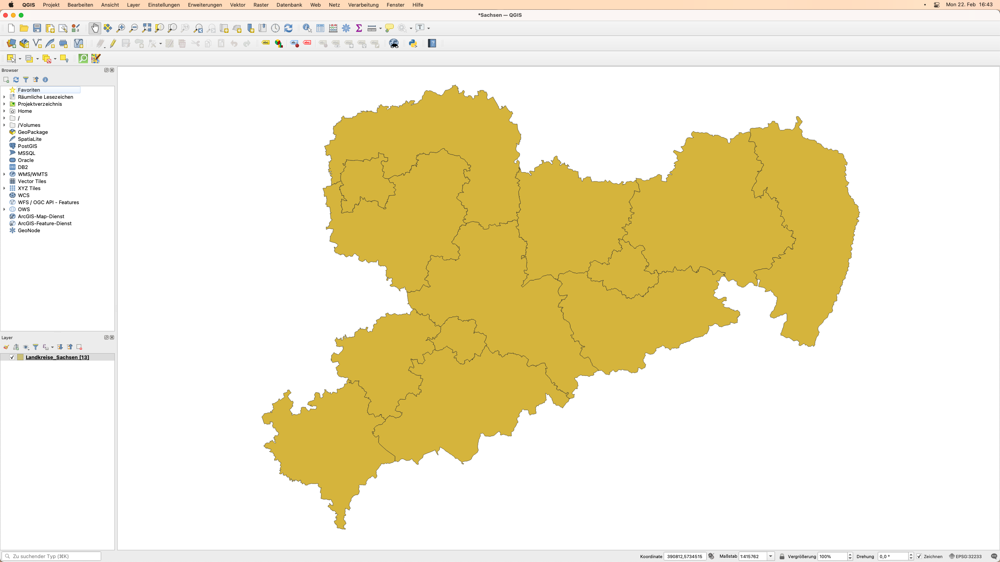
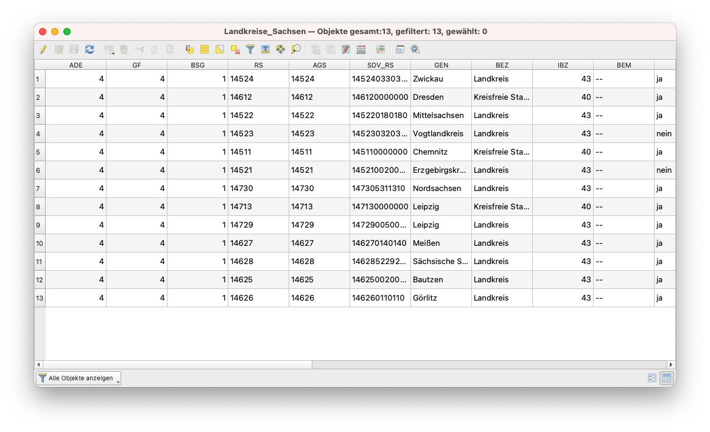
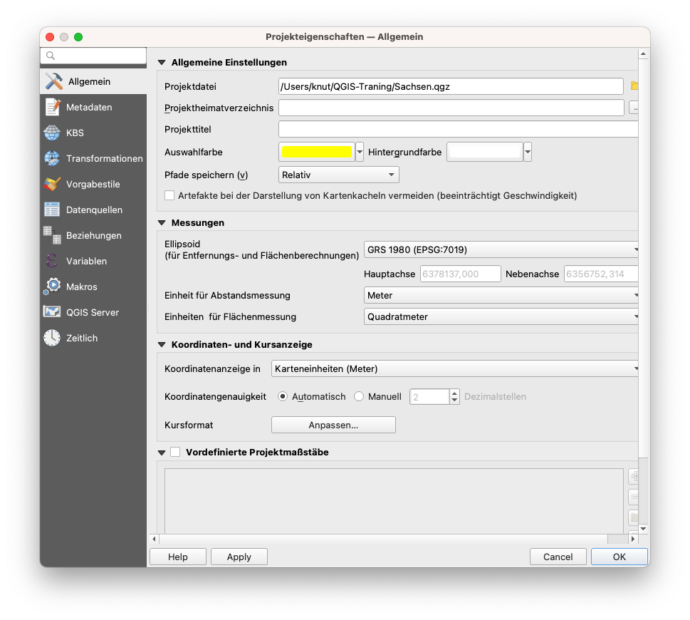
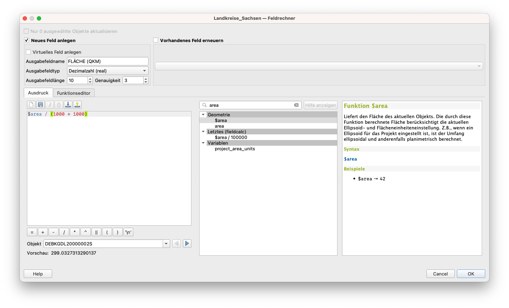
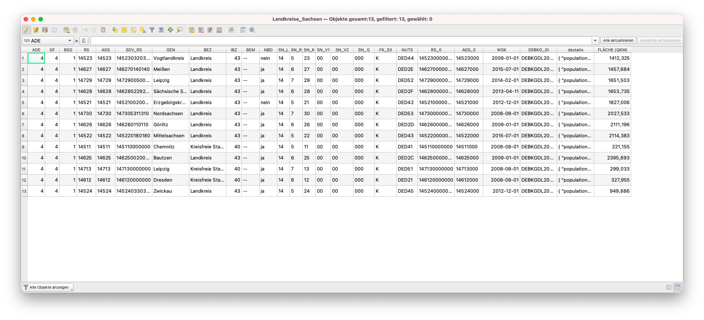
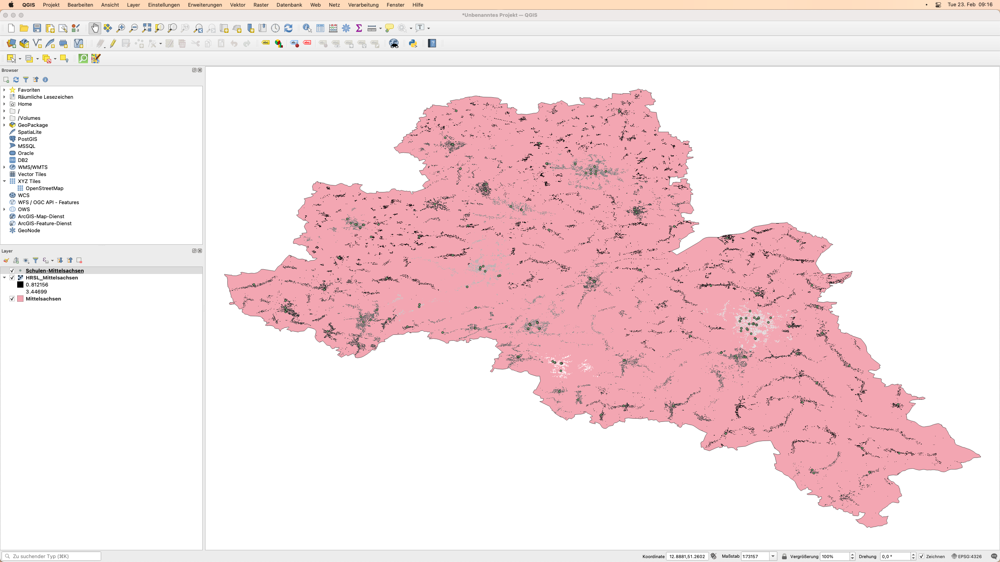
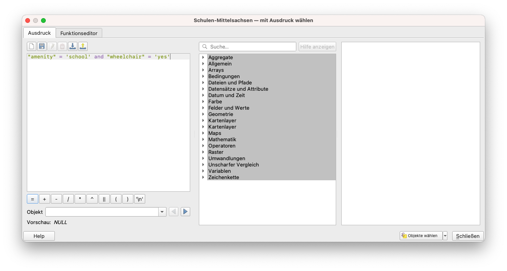
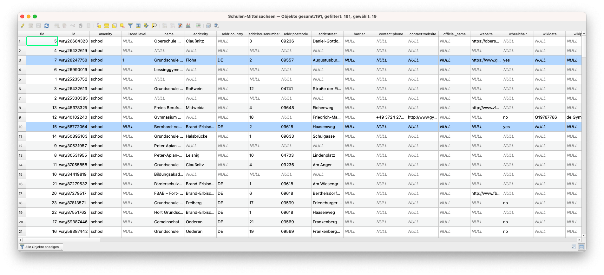

# Modul 6 - Layer-Attribute

**Autor:in**: Ketty

## Pädagogische Einführung

Dieses Modul gibt Ihnen einen Überblick über die Schritte, die für die Arbeit mit der Attributtabelle und den Layerattributen in QGIS notwendig sind. Am Ende des Moduls werden Sie in der Lage sein, die folgenden Konzepte zu verstehen:

* Arbeiten mit der Attributtabelle
* Verwendung des Feldrechners
* QGIS-Ausdrücke
* Veränderung von Feldern

Außerdem werden Sie die folgenden Fähigkeiten erlernen:

* Einführung in die Attributtabelle
* Interaktion mit Features in einer Attributtabelle
* Speichern eines ausgewählten Features als neuen Layer
* Editieren von Layer-Feldern

Sie werden den Feldrechner und die QGIS expression engine verwenden, um mathematische Operationen und Funktionen in QGIS auszuführen.


## Technische Voraussetzungen

* Computer
* Internetverbindung
* QGIS 3.16 und höher

* Schulen_Mittelsachsen (aus [Modul-6.gpkg](data/Modul-6.gpkg))
* Landkreise_Sachsen (aus [Modul-6.gpkg](data/Modul-6.gpkg))
* Mittelsachsen (aus [Modul-6.gpkg](data/Modul-6.gpkg))
* HRSL_Mittelsachsen.tif (aus [module](data/HRSL_Mittelsachsen.tif))

## Voraussetzungen

* Grundlegende Kenntnisse aller vorherigen Module
* Grundkenntnisse in der Bedienung eines Computers


## Zusätzliche Ressourcen

* Arbeiten mit der Attributtabelle - [https://docs.qgis.org/3.16/de/docs/user_manual/working_with_vector/attribute_table.html?highlight=layer%20attributes](https://docs.qgis.org/3.16/de/docs/user_manual/working_with_vector/attribute_table.html?highlight=layer%20attributes)
* QGIS-Ausdrücke - [https://docs.qgis.org/3.16/de/docs/pyqgis_developer_cookbook/expressions.html](https://docs.qgis.org/3.16/de/docs/pyqgis_developer_cookbook/expressions.html)


## Thematische Einführung

Lassen Sie uns mit einem Beispiel beginnen:

In manchen Fällen - z.B. bei der Infrastrukturplanung - möchten Sie die Fläche der Polygone in einem Layer bestimmen. Wenn Sie nur ein Polygon haben, wäre das kein Problem. Was aber, wenn Sie viele Polygone/Flächen in dem Layer haben? Es ist fast unmöglich, jede Fläche einzeln zu berechnen. Der Vektorlayer der Landkreise in Sachsen hat viele Polygone, was bedeutet, dass er ein guter Datensatz für dieses Lernprogramm ist. Wir werden die Fläche für jedes Polygon (also die 13 Landkreise) auf automatisierte Weise berechnen.

## Aufschlüsselung der Konzepte

Ein Großteil der Arbeit, die Sie bei der Erstellung einer Karte verrichten, beinhaltet die Arbeit mit Layer-Attributen. Egal, ob Sie den Layer zeichnen, ein Popup konfigurieren, eine Analyse durchführen oder visualisieren, Sie benötigen ein gewisses Maß an Wissen über die Felder des Layers und die Werte, die sie enthalten. Wenn es sich um Ihren eigenen Layer handelt, kennen und verstehen Sie seine Attribute. Aber wenn es nicht Ihr eigener Layer ist, wie erlangen Sie dieses Wissen? Wahrscheinlich inspizieren Sie die Feldnamen und untersuchen die Feldwerte auf Anhaltspunkte. Und wenn Sie Glück haben, finden Sie eine Dokumentation, die die Attribute des Layers beschreibt.

Die Attributtabelle zeigt Informationen zu den Features eines ausgewählten Layers an. Jede Zeile in der Tabelle repräsentiert ein Feature (mit oder ohne Geometrie), und jede Spalte enthält eine bestimmte Information über das Feature. Features in der Tabelle können gesucht, ausgewählt, verschoben oder sogar bearbeitet werden. Es zwei Feldeigenschaften, die die in einem Feld enthaltenen Werte beschreiben:

* **Feldbeschreibung** - ein paar Worte, ein Satz oder ein Absatz Text, der die Werte im Feld beschreibt.
* **Feldwerttyp** - ein Schlüsselwort, das die Art der im Feld enthaltenen Werte kategorisiert. Das Schlüsselwort hilft zu verstehen, wie die Werte zu verwenden sind und ermöglicht es QGIS und anderen Client-Anwendungen, intelligentere Vorschläge für die Arbeit mit den Werten zu machen, z. B. können die Wertetypen im Feld Ganzzahl, Text, Wahrheitswert, Fließommazahl sein.

Hier ein Beispiel: Angenommen, Sie haben einen Flurstücks-Layer, der diese Felder enthält:

* Parzellen-ID - Ganzzahl
* Eigentümer - Zeichenkette
* Straßenadresse - Zeichenkette
* Grundstücksbeschreibung - Zeichenkette
* Gebäudeanzahl - Ganzzahl
* Grundstücksfläche - Fließkommazahl
* Geschätzter Wert - Fließkommazahl
* Beurteilungsdatum - Datum

Wenn Sie diese Feldwerte beschreiben würden, könnten Sie etwas wie folgt schreiben:

* Parzellen-ID - der eindeutige Bezeichner des Grundstücks
* Eigentümer - der Name des Grundstückseigentümers
* Straßenadresse - die Lage des Grundstücks
* Grundstücksbeschreibung - die rechtliche Beschreibung des Grundstücks
* Gebäudezahl - die Anzahl der Gebäude auf der Parzelle
* Grundstücksfläche - die Größe des Grundstücks in Hektar
* Geschätzter Wert - der Wert des Grundstücks und der Gebäude in Euro
* Beurteilungsdatum - das Datum der letzten Veranlagung

Bei der Betrachtung dieser Beschreibungen stechen einige Wörter hervor, wie: Beizeichner, Name, Ort, Beschreibung, Anzahl, Größe, Wert und Datum. Dies sind die _Schlüsselwörter_, die beschreiben, was die Feldwerte sind. Die Schlüsselwörter des Feldwerttyps sind aus diesen Wortarten aufgebaut. Sie sind:

* Name oder Titel
* Beschreibung
* Typ oder Kategorie
* Anzahl oder Betrag
* Prozentsatz oder Verhältnis
* Messung
* Eindeutiger Bezeichner
* Geordnet oder geordnet
* Binär
* Ort oder Ortsname
* Koordinate
* Datum und Uhrzeit

Im obigen Beispiel des Parzellen-Layers ist das Feld Parzellen-ID ein Ganzzahl-Feld. Wenn der Feldwerttyp angibt, dass die Feldwerte einen eindeutigen Bezeichner und nicht eine Zählung darstellen, würde QGIS nicht empfehlen, dieses Feldattribut mit abgestuften Farben oder Symbolen zu zeichnen.

Darüber hinaus erlauben andere Konzepte wie die Feldrechnerfunktionalität in der Attributtabelle, Berechnungen auf Basis vorhandener Attributwerte oder definierter Funktionen durchzuführen, z.B. um Länge, Fläche oder Bevölkerungsdichte zu berechnen. Beachten Sie, dass die möglichen Berechnungen durch die Attribute bzw. den Aufbau Ihrer Daten bestimmt werden. So ist es z. B. nur möglich, die Bevölkerungsdichte zu berechnen, wenn es ein Feld mit Bevölkerungszahlen gibt. Mithilfe des Ausdrucksmoduls und des Feldrechners würden Sie dann einen Ausdruck oder eine Formel zur Berechnung der Bevölkerungsdichte konstruieren. In diesem Fall würde die Formel lauten: Gesamtbevölkerung als Anzahl der Menschen / Fläche, die von dieser Bevölkerung bedeckt wird. Sie werden feststellen, dass es wichtig ist, zu wissen, was jedes der Felder in der Layer-Attribut-Tabelle darstellt. Das bedeutet, dass Sie Ihre Daten genau kennen und verstehen müssen. Dies erleichtert die Anwendung von Funktionen und Ausdrücken und damit die Erstellung von aussagekräftigen Analysen und Visualisierungen/Kartenprodukten.


### Teil 1: Editieren von Layer-Attributen

#### **Inhalt/Tutorial**

Die Attributtabelle zeigt Informationen über Features eines ausgewählten Layers an. Jede Zeile in der Tabelle repräsentiert ein Feature (mit oder ohne Geometrie), und jede Spalte enthält eine bestimmte Information über das Feature. Features in der Tabelle können gesucht, ausgewählt, verschoben oder sogar bearbeitet werden.

1. Laden Sie den Landkreise_Sachsen Layer (zu finden in [Modul-6.gpkg](data/Modul-6.gpkg)) in QGIS. Sie können sich anzeigen lassen, wie viele Features in dem aktuellen Feature enthalten sind, indem Sie **mit der rechten Maustaste auf den Layer im Bedienfeld Layer ‣ Objektanzahl anzeigen** klicken. Wie Sie unten sehen können, hat der Vektor-Layer insgesamt 13 Features, die den 13 Landkreisen entsprechen.



Abbildung 6.1: Mehrere Polygone


2. Im nächsten Schritt widmen wir uns der Attributtabelle. Öffnen Sie die Attributtabelle durch **Rechtsklick auf den Layer im Bedienfeld "Layer" ‣ Attributtabelle öffnen**. Sie können auch auf die Schaltfläche **Attributtabelle öffnen**  in der Attribute-Symbolleiste klicken. Die Symbolleiste hat eine Reihe von Schaltflächen, fahren Sie mit dem Mauszeiger über jede Schaltfläche, um die eingebettete Funktionalität zu sehen.



Bild 6.2: Attributtabelle öffnen

Wenn Sie die Attributtabelle nicht als schwebendes Fenster, sondern an die QGIS-Oberfläche andocken möchten, können Sie auf die Schaltfläche **Attributtabelle andocken**  klicken. Im angedockten Zustand erscheint die Attributtabellen als Registerkarten anstelle einzelner Fenster.


Bild 6.3: Gedockte Attributtabelle


3. Für Flächenberechnungen sollte das Koordinatenreferenzsystem ein projiziertes sein. So können Sie Abstände korrekt berechnen. Denken Sie daran, dass unser Interesse darin besteht, automatisch die Fläche für jeden der 13 Landkreise zu berechnen. Überprüfen Sie das Koordinatenreferenzsystem des Vektor-Layers. Wenn es ein geographisches Koordinatenreferenzsystem ist, dann projizieren Sie den Layer auf ein projiziertes Koordinatensystem um. Überprüfen Sie die verschiedenen Projektionen auf der [EPSG](https://epsg.io/?q=Germany%20kind%3APROJCRS) Website. Da wir uns im östlichen Deutschland befinden, werden wir [ETRS89 / UTM zone 33N](https://epsg.io/25833), EPSG:25833 verwenden. Aus früheren Modulen, in denen Kartenprojektionen ausführlich besprochen wurden, wissen Sie vielleicht schon, dass Kartenprojektionen relativ zu einem bestimmten Ort auf der Erde angewendet werden.

4. Überprüfen Sie die Projekteinstellungen; gehen Sie zu: **Projekt ‣ Eigenschaften Eigenschaften ‣ Allgemein**.



Abbildung 6.4: Projekteigenschaften

5. Klicken Sie anschließend auf die Schaltfläche **Feldrechner öffnen**  in der Symbolleiste Attribute, um den Feldrechner zu öffnen. Der Dialog des Feldrechners wird geöffnet; geben Sie den Namen des Ausgabefeldes ein, in diesem Fall 'FLÄCHE (QKM)'. Wählen Sie die Dezimalzahl (real) als Ausgabefeldtyp. Ändern Sie die Genauigkeit auf 2 Dezimalstellen. Um die Fläche zu berechnen, verwenden Sie den folgenden Ausdruck:

```
$area / (1000 * 1000)
```

 Sie finden diesen Ausdruck unter **Geometrie**. Klicken Sie auf OK und es wird automatisch die Fläche für jedes Polygon berechnet. Beachten Sie, dass die Flächenberechnung vom verwendeten Koordinatenreferenzsystem abhängt, so dass Sie möglicherweise unterschiedliche Ergebnisse erhalten, je nachdem, welches CRS Sie verwendet haben. Sie können auch auf der rechten Seite des Feldrechners oder des Funktionseditors nach Informationen zu Ausdrücken suchen und diese finden.



Bild 6.5: Feldrechner

6. Öffnen Sie die Attributtabelle, um das Ergebnis zu sehen. Sie haben soeben den Inhalt der Attributtabelle bearbeitet, und zwar auf automatisierte Weise, anstatt die Werte in jede Zelle einzeln einzutippen.



Bild 6.6: Attributtabelle mit neuer Spalte


#### **Quizfragen**

1. Die Attributtabelle ist eine Datenbank oder Tabellendatei, die Informationen über eine Reihe von geografischen Merkmalen enthält
2. Geografische Merkmale sind normalerweise so angeordnet, dass jede Zeile ein Merkmal und jede Spalte ein Merkmalsattribut darstellt
3. Es ist notwendig, Layer vor der Flächenberechnung neu zu projizieren, wenn der Layer ein geografisches Koordinatenreferenzsystem hat


#### **Quizantworten**

1. Richtig
2. Richtig
3. Richtig


### Teil 2 : Verstehen und Arbeiten mit Attributdaten, Abfragen und Analysen

#### **Inhalt/Tutorial**

An dieser Stelle werden Sie vielleicht feststellen, dass die Attributtabelle sowohl räumliche als auch nicht-räumliche Daten speichert. In diesem Tutorial lernen Sie Möglichkeiten kennen, mit den Daten der Attributtabelle zu arbeiten. Sie können z. B. mit Hilfe von Ausdrücken in der Attributtabelle die Schulen in Mittelsachsen auswählen, die mit barrierefrei für Rollstühle sind.

1. Fügen Sie die folgenden Datensätze der zu einem neuen Projekt hinzu;

* Schulen_Mittelsachsen (aus [Modul-6.gpkg](data/Modul-6.gpkg))
* Mittelsachsen (aus [Modul-6.gpkg](data/Modul-6.gpkg))
* HRSL_Mittelsachsen.tif (aus [module](data/HRSL_Mittelsachsen.tif))



Abbildung 6.7: Ausgewählte Layer

2. Wir wollen und die Schulen genauer anschauen. Öffnen Sie dafür die Attributtabelle für den Layer Schulen-Mittelsachsen. Klicken Sie auf die Schaltfläche "Objekte über Ausdruck wählen"  und geben Sie im Textbereich folgenden Ausdruck ein:

```
"amenity" = 'school' and "wheelchair" = 'yes'
```

Sie werden feststellen, dass der Ausdruck eine Reihe von Prädikaten enthält, wie das Vergleichszeichen (=), das logische Prädikat `and` und eine Zeichenkette, die in einfache Anführungszeichen (' ') eingeschlossen ist. Außerdem gibt es zwei Attributnamen (amenity, wheelchar) und ihre Werte (school,yes).



Bild 6.8: Dialog "Mit Ausdruck wählen"

3. 19 Schulen sind jetzt ausgewählt. Sie sehen die Auswahl gelb hinterlegt. Die ausgewählten Schulen werden auch in der Attributtabelle hervorgehoben. Jetzt wissen wir, dass es laut den Daten, die bisher von der OpenStreetMap Community gepflegt wurden, 19 Schulen im Landkreis Mittelsachsen gibt, die rollstuhlgeeignet sind.


Abbildung 6.9: Ausgewählte Schulen werden hervorgehoben (gelb)




Bild 6.10: Ausgewählte Schulen werden hervorgehoben (blau)


Es ist auch möglich, eine Auswahl zu treffen, indem Sie auf ein Merkmal in der Kartenansicht klicken.

Das Entwickeln eines funktionalen Ausdrucks beginnt mit dem Verstehen Ihrer Daten; zum Beispiel der Attribute und der Werte, die sie enthalten. Dann stellt man die richtigen Fragen und entwickelt schließlich den passenden Ausdruck.

#### **Quizfragen**

1. Diese Operatoren werden vom Funktsionseditor bereitgestellt.  {+, -, * }
2. Eine Zeichenkette muss in einfache Anführungszeichen gefasst sein
3. Die Attributtabelle speichert nur nicht-räumliche Daten.


#### **Quizantworten**

1. Richtig
2. Richtig
3. Falsch


### Teil 3: Erweiterte QGIS-Ausdrücke

Der "Mit Ausdruck wählen" Dialog umfasst die folgenden Registerkarten:

* Registerkarte "Ausdruck" ([https://docs.qgis.org/2.18/de/docs/user_manual/working_with_vector/expression.html#functions-list](https://docs.qgis.org/2.18/de/docs/user_manual/working_with_vector/expression.html#functions-list)), die dank einer Liste vordefinierter Funktionen beim Schreiben und Überprüfen des zu verwendenden Ausdrucks hilft;
* Registerkarte "Funktionseditor" ([https://docs.qgis.org/2.18/de/docs/user_manual/working_with_vector/expression.html#function-editor](https://docs.qgis.org/2.18/de/docs/user_manual/working_with_vector/expression.html#function-editor)), die dabei hilft, die Liste der Funktionen zu erweitern, indem eigene Funktionen erstellt werden.


#### **Inhalt/Tutorial**

Es gibt viele Anwendungsfälle für Ausdrücke, hier sind einige Beispiele (die einen erdachten Datensatz zur Grundlage haben). Beachten Sie, wie die Ausdrücke aufgebaut sind und welche Operatoren oder Prädikate verwendet werden. Wichtig ist auch die Tatsache, dass alle diese Ausdrücke auf der Grundlage des Inhalts des Datensatzes entwickelt wurden. Sie können dies an den Datensatz Ihrer Wahl anpassen.

1. Berechnen Sie in der Registerkarte "Ausdruck" ein Feld "pop_density" aus den vorhandenen Feldern "total_pop" und "area_km2":

```
"total_pop" / "area_km2"
```


2. Aktualisieren Sie das Feld "density_level" mit Kategorien entsprechend den "pop_density"-Werten:

```
CASE WHEN "pop_density" < 50 THEN 'Geringe Bevölkerungsdichte'
     WHEN "pop_density" >= 50 AND "pop_density" < 150 THEN 'Mittlere Bevölkerungsdichte'
     WHEN "pop_denisty" > 150 THEN 'Hohe Bevölkerungsdichte'
END
```

3. Wenden Sie einen kategorisierten Stil auf alle Merkmale an, je nachdem, ob ihr durchschnittlicher Hauspreis kleiner oder größer als 1000 Euro pro Quadratmeter ist:
```
"preis_m2" > 1000
```

4. Wählen Sie mit dem Dialog "Nach Ausdruck wählen" alle Merkmale aus, die Gebiete mit "hoher Bevölkerungsdichte" repräsentieren und deren durchschnittlicher Hauspreis höher als 1000 Euro pro Quadratmeter ist:

```
"pop_denisty" = 'Hohe Bevölkerungsdichte' und "price_m2" > 1000
```

5. Ebenso könnte der vorherige Ausdruck verwendet werden, um zu definieren, welche Merkmale beschriftet oder in der Karte angezeigt werden sollen.


#### **Quizfragen**

1.  Sowohl der Feldrechner als auch der Dialog "Nach Ausdruck auswählen" können verwendet werden, um Ausdrücke zu entwickeln -- ***Richtig***
2.  Ausdrücke können verwendet werden, um ein neues Feld zu aktualisieren -- ***Richtig***
3.  Ausdrücke können verwendet werden, um einen Stil anzuwenden -- ***Richtig***
