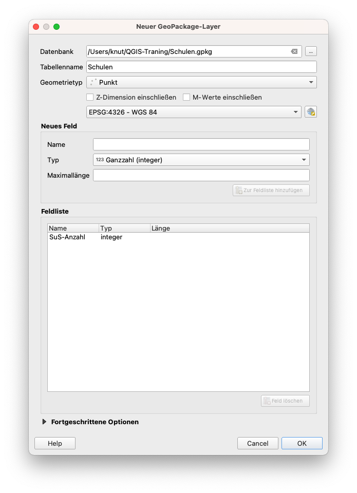
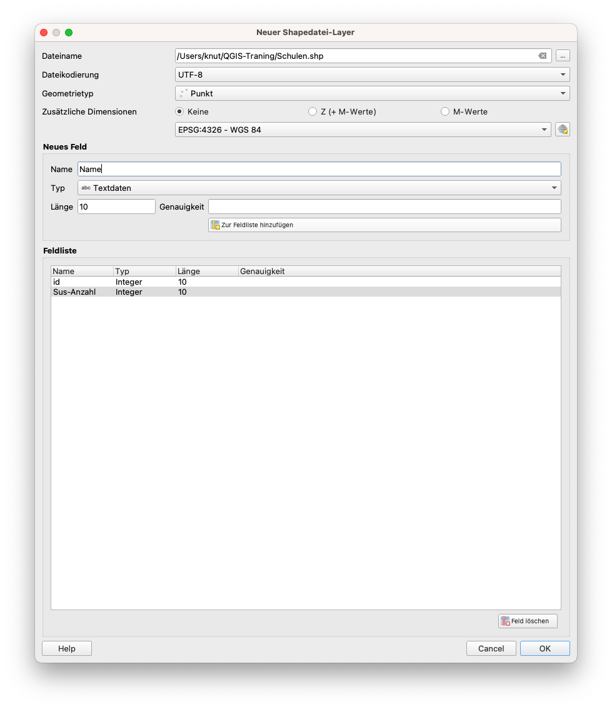
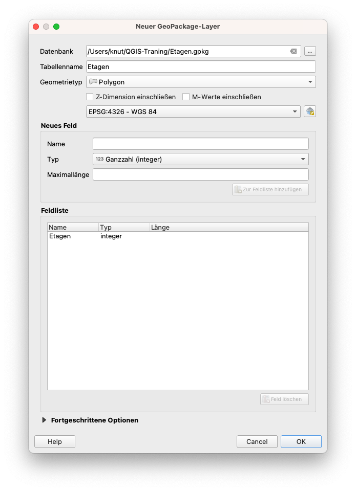
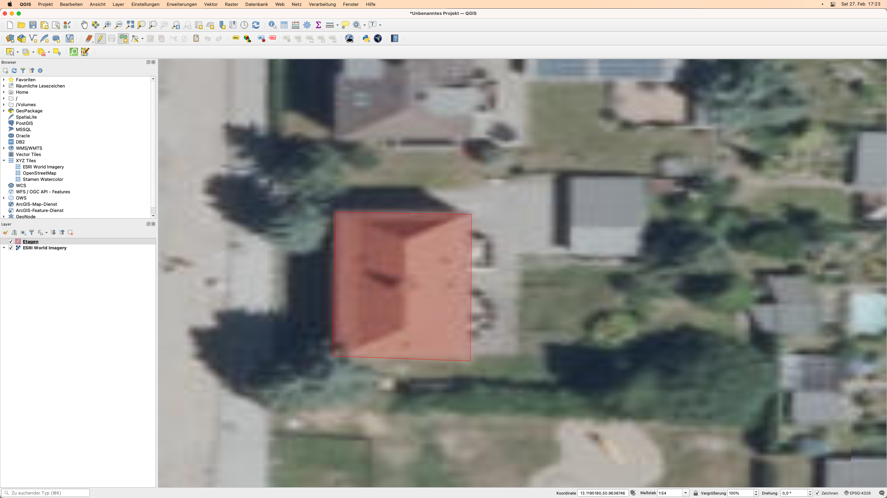
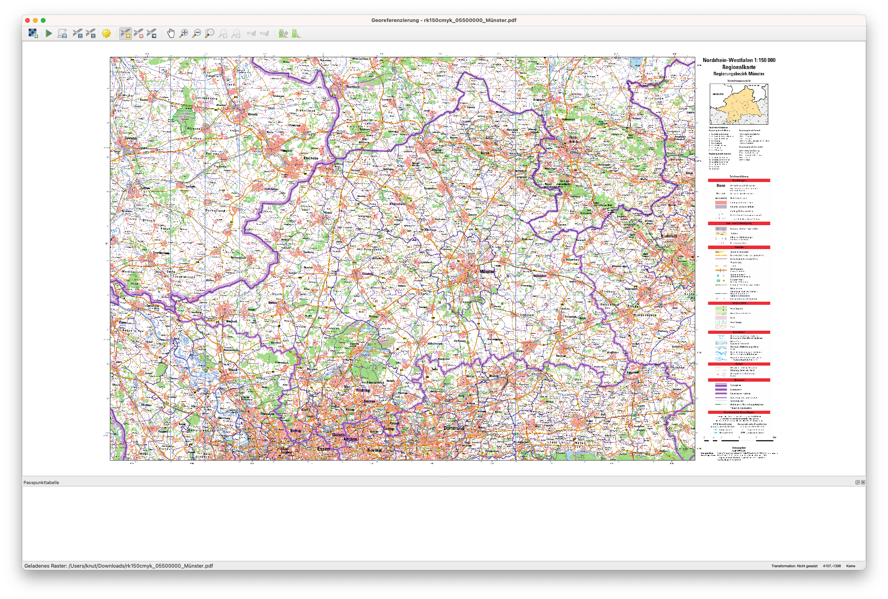
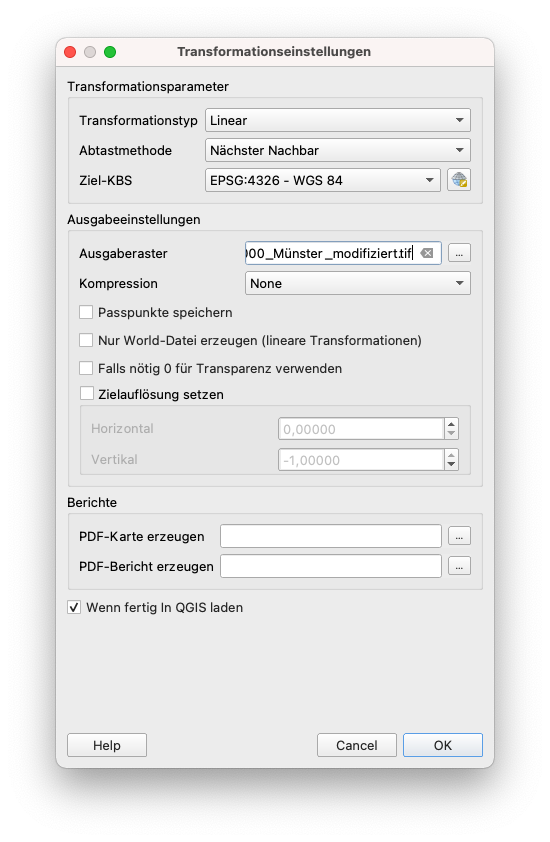
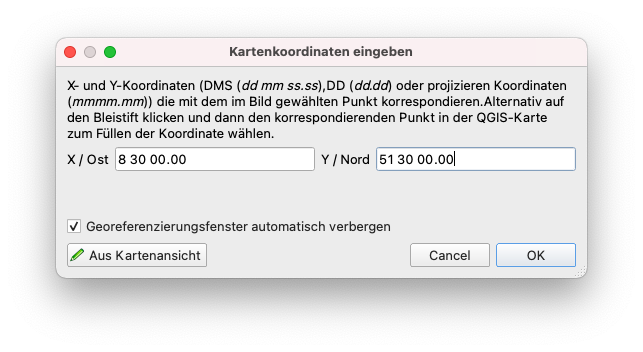
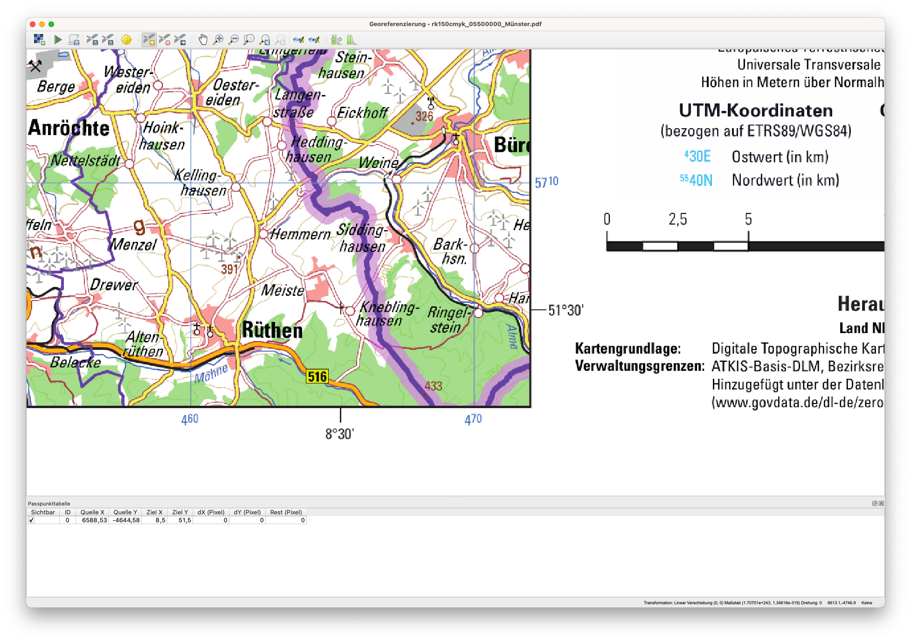
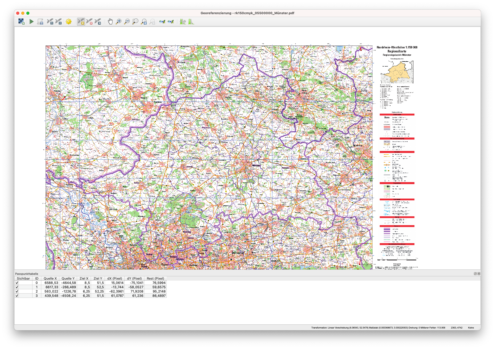

# Modul 7 - Erstellen und Bearbeiten von Layern

**Autor:**: Ketty
**Übersetzung:** Knut Hühne

## Pädagogische Einführung

In diesem Modul lernen Sie, wie Sie mit den QGIS-Werkzeugen einen neuen GIS-Layer erstellen. Sie lernen Konzepte wie Digitalisieren und Georeferenzieren kennen.

## Technische Voraussetzungen
* Computer
* Internetzugang
* QGIS 3.16 oder neuer
* [Regionalkarte Münster](https://www.govdata.de/web/guest/suchen/-/details/regionalkarte-nw-1-150-000)

## Voraussetzungen

* Grundlegende Kenntnisse aller vorherigen Module
* Grundkenntnisse in der Bedienung eines Computers

## Zusätzliche Ressourcen

* Erstellen von Layern - [https://docs.qgis.org/3.16/de/docs/user_manual/managing_data_source/create_layers.html](https://docs.qgis.org/3.16/de/docs/user_manual/managing_data_source/create_layers.html)
* Digitalisieren von Waldbeständen - [https://docs.qgis.org/3.16/de/docs/training_manual/forestry/stands_digitazing.html?highlight=digitizing](https://docs.qgis.org/3.16/de/docs/training_manual/forestry/stands_digitazing.html?highlight=digitizing)
* Weitere Lektüre: [Georeferenzierung einer Karte](https://docs.qgis.org/3.16/de/docs/training_manual/forestry/map_georeferencing.html?highlight=georeferencing)

## Thematische Einführung

Lassen Sie uns mit einem Beispiel beginnen: 

Stellen wir uns vor, Ihre Abteilung plant den Bau einer neuen Schule in Ihrem Landkreis. Sie möchten vielleicht eine Umweltvorprüfung für das geplante Infrastrukturprojekt durchführen. Die Bewertung kann eine Recherche der verfügbaren Daten beinhalten. Wie Sie sich vielleicht vorstellen können, gibt es eine große Menge an geografischen Daten in Formaten, die nicht sofort mit anderen GIS-Daten integriert werden können. Einige dieser Daten können in Form von alten Karten, hochauflösenden Satellitenbildern oder fernerkundeten Bildern vorliegen, die oft für die Erstellung digitaler Karten wie Google Maps oder OpenStreetMap verwendet werden. Hier kommt das Erstellen und Bearbeiten von Layern ins Spiel. Eine Möglichkeit, wie neue Daten in einem GIS erstellt werden können, ist die Digitalisierung. Andere Methoden sind die Georeferenzierung, das Scannen und Vektorisieren, das Ausschneiden, die Auswahl und das anschließende Speichern.

Abbildung 7.1: Fernerkundungsbilder verschiedener Küstenlinien. A. Interferometric Synthetic Aperture Radar (IFSAR)-Daten (Verwendung von Mikrowellen zur Datenerfassung für die Erstellung repräsentativer Bilder), B. topografische und bathymetrische Lidar-Daten (Höhen- und Konturdaten, die durch Farben dargestellt werden), C. hyperspektrale Bilder (Hinzufügen von Farbe zu unsichtbarer Energie) und D. digitale Fotografie (für das menschliche Auge sichtbare Farben, die als solche dargestellt werden)

## Aufschlüsselung der Begriffe

Digitalisierung im GIS ist der Prozess des "Nachzeichnens" von Informationen aus Medien/Karten auf geographisch korrekte Weise.

")

Bild 7.2: Hier wurden Gebäude auf einem Luftbild digitalisiert (nachgezeichnet)

Bei der Georeferenzierung hingegen wird ein digitales Bild (z. B. ein Luftbild, eine gescannte geologische Karte oder ein Bild einer topografischen Karte) mit geografischen Informationen versehen, so dass eine GIS- oder Kartierungssoftware das Bild an der entsprechenden Stelle in der realen Welt "platzieren" kann.

## Hauptinhalt

QGIS erlaubt es Ihnen, neue Layer in verschiedenen Formaten zu erstellen. Es bietet Werkzeuge zum Erstellen von GeoPackage-, Shapefile-, SpatiaLite-, GPX-Format- und temporären Scratch-Layern (auch Speicher-Layer genannt). Mit der Bearbeitung können Sie Features in Vektordatensätzen hinzufügen, löschen und ändern. Der erste Schritt besteht darin, den Datensatz in den Bearbeitungsmodus zu versetzen. Wählen Sie den Layer im Bedienfeld "Layer" aus und klicken Sie auf "Bearbeitungsstatus umschalten". Alternativ können Sie mit der rechten Maustaste auf einen Layer im Bedienfeld "Layer" klicken und "Bearbeitungsstatus umschalten" aus dem Kontextmenü wählen. Es können mehrere Layer gleichzeitig bearbeitet werden. Der Layer, der gerade bearbeitet wird, ist derjenige, der im Bedienfeld "Layer" ausgewählt ist. Sobald Sie sich im Bearbeitungsmodus befinden, können Sie mit der Digitalisierungs-Symbolleiste Features hinzufügen, löschen und ändern.

Wie Sie sich sicher schon denken können, ist das Digitalisieren die Kunst (oder Wissenschaft) der Erstellung digitaler Vektordaten aus einer anderen Quelle, wie z. B. einem Rasterbild. Um mit dem Digitalisieren zu beginnen, müssen wir zunächst in den Bearbeitungsmodus wechseln. GIS-Software benötigt in der Regel einen separaten Modus für die Bearbeitung, um zu verhindern, dass der/die Benutzer:in versehentlich wichtige Daten bearbeitet oder löscht. Der Bearbeitungsmodus wird für jeden Layer einzeln ein- oder ausgeschaltet.

### Teil 1: Erstellen eines neuen GeoPackage Layers oder Shapefiles

#### **Erstellen eines neuen GeoPackage Layers**

1. Um einen neuen GeoPackage Layer zu erstellen, wählen Sie die Schaltfläche Neuer Geopackage Layer 
 im Menü "Layer ‣ Layer erstellen" oder in der Symbolleiste des Datenquellen-Managers. Der Dialog Neuer Geopackage Layer wird angezeigt, wie in Abbildung 7.3 dargestellt.

Bild 7.3: Dialog Neues GeoPackage Layer

2. Der erste Schritt besteht darin, den Speicherort der Datenbankdatei anzugeben. Dazu drücken Sie den  Button rechts neben dem Feld Database und wählen eine bestehende GeoPackage Datei aus oder erstellen eine neue. QGIS fügt automatisch die richtige Erweiterung an den von Ihnen angegebenen Namen an.
3. Geben Sie einen Namen für den neuen Layer / die neue Tabelle ein (Tabellenname)
4. Definieren Sie den Geometrietyp. Wenn es sich nicht um einen geometrielosen Layer handelt, können Sie angeben, ob er die Z-Dimension und/oder die M-Werte einschließen soll.
5. Geben Sie das Koordinatenreferenzsystem über die Schaltfläche  an

6. So fügen Sie dem Layer, den Sie erstellen, Felder hinzu:

    1. Geben Sie den Namen des Feldes ein
    2. Wählen Sie den Datentyp. Unterstützte Typen sind Textdaten, Ganzzahl (sowohl Integer als auch Integer64), Dezimalzahl, Datum und Datum und Uhrzeit, Binär (Blob) und Boolean.
    4. Geben Sie je nach ausgewähltem Datenformat die maximale Länge der Werte ein.
    5. Klicken Sie auf die Schaltfläche Add to Fields List 

7. Wiederholen Sie die obigen Schritte für jedes Feld, das Sie hinzufügen möchten
8. Wenn Sie mit den Attributen zufrieden sind, klicken Sie auf OK. QGIS fügt den neuen Layer zur Legende hinzu, und Sie können ihn wie im kommenden Teil "Digitalisieren eines bestehenden Layers" dieses Moduls beschrieben bearbeiten.

#### **Erstellen eines neuen Shapefiles**

1. Um einen neuen Layer im ESRI Shapefile-Format zu erstellen, drücken Sie die Schaltfläche  "Neuer Shapedatei Layer..." im Menü "Layer ‣ Layer hinzufügen" oder in der Symbolleiste der Datenquellenverwaltung. Der Dialog Neuer Shapedatei Layer wird angezeigt, wie in Abbildung 7.4 dargestellt.

Bild 7.4: Dialog Neuer Shapedatei Layer

2. Geben Sie einen Pfad und einen Dateinamen an, indem Sie die Schaltfläche ... neben dem Feld Dateiname verwenden. QGIS fügt automatisch die richtige Erweiterung an den von Ihnen angegebenen Namen an.
3. Geben Sie als nächstes die Dateikodierung der Daten an
4. Wählen Sie den Geometrietyp des Layers: Keine Geometrie (was zu einer Datei im .DBF-Format führt), Punkt, Mehrpunkt, Linie oder Polygon
5. Geben Sie an, ob die Geometrie zusätzliche Abmessungen haben soll: Keine, Z (+ M-Werte) oder M-Werte
6. Geben Sie das Koordinatenreferenzsystem über die Schaltfläche  an, Sie können das universelle WGS 84 wählen, das sich gut für WebMapping-Projekte auf der ganzen Welt eignet

7. So fügen Sie dem Layer, den Sie gerade erstellen, Felder hinzu:
    1. Geben Sie den Namen des Feldes ein
    2. Wählen Sie den Datentyp. Es werden nur die Attribute Dezimalzahl, Ganzzahl, Textdaten und Datum unterstützt.
    3. Geben Sie je nach ausgewähltem Datenformat die Länge und die Genauigkeit ein.
    4. Klicken Sie auf die Schaltfläche Add to Fields List 

8. Wiederholen Sie die obigen Schritte für jedes Feld, das Sie hinzufügen möchten
9. Wenn Sie mit den Attributen zufrieden sind, klicken Sie auf OK. QGIS fügt den neuen Layer zur Legende hinzu, und Sie können ihn wie im nächsten Teil "Digitalisieren eines bestehenden Layers" dieses Moduls beschrieben bearbeiten.

### Phase 2 Titel: Digitalisieren eines bestehenden Layers

#### **Inhalt/Tutorial**

In diesem Tutorial wird gezeigt, wie man ein neues Shapefile mit Hilfe von Hilfsdaten wie z.B. Satellitenbildern, die von Google bereitgestellt werden, erstellt. In der Praxis werden genaue sogenannte Ground-Truth-Daten verfügbar sein. Es ist wichtig, dass Sie vorher wissen, welches Feature Sie erstellen möchten, z. B. ob es sich um einen Punkt-, Linien- oder Polygon-Vektor-Layer handelt. Wenn wir den Layer erstellen, müssen wir festlegen, welche Art von Daten er enthalten soll. Der Zweck dieses Tutorials ist es, einen Datensatz zu erstellen, der leicht mit einem GIS-System manipuliert, analysiert und gespeichert werden kann. Wir wählen daher eine Vektordatei und werden als Beispiel Polygon-Features erstellen.

1. Bevor Sie neue Vektordaten hinzufügen können, benötigen Sie einen Vektordatensatz (einen Layer), dem Sie sie hinzufügen können. In unserem Fall beginnen wir mit der Erstellung eines neuen Daten-Layers und fügen diesem dann Features hinzu. Zuerst müssen wir unseren Datensatz definieren.
2. Erstellen Sie ein neues Projekt in QGIS, indem Sie auf das Symbol _Neues Projekt_  klicken.
3. Gehen Sie zu _Layer ‣ Layer erstellen ‣ Neuer Geopackage Layer_. Sie erhalten den folgenden Dialog:

Abbildung 7.5: Dialog Neuer GeoPackage-Layer

An dieser Stelle müssen wir entscheiden, welche Art von Datensatz wir erstellen wollen. Denken Sie daran, dass ein Daten-Layer nur Features aus Punkten, Linien oder Polygonen enthalten kann - niemals eine Mischung. Wenn wir den Layer erstellen, müssen wir festlegen, welche Art von Daten er enthalten soll.

Da Polygone technisch aus Punkten und Linien bestehen, lassen Sie uns Polygone erstellen. Wenn Sie dies einmal gemeistert haben, sollte es ein Leichtes sein, einen Punkt- oder Linien-Layer zu erstellen!

Geben Sie im Dialog einen Dateinamen für die neue Datei, die Dateikodierung, den Geometrietyp und das CRS an und fügen Sie die Daten für das neue Feld hinzu. Fügen Sie weitere Feldnamen hinzu. Dies erfordert ein vorgefertigtes Datenmodell, das alle Informationen über das besagte Feature korrekt erfasst.

4. Der zweite Schritt ist das Hinzufügen des ESRI World Imagery Layers zur Kartenansicht. Diese wurde in einem früheren Modul hinzugefügt und sollte im **Browser Panel** unter **XYZ Tiles** zur Verfügung stehen.

Abbildung 7.6.1: QGIS-Canvas nach Hinzufügen des ESRI World Imagery Layers

5. Zoomen Sie in das Bild, bis Sie Merkmale wie Dächer, Straßen, Bäume usw. erkennen können. Die Dächer können als 2D-Proxy für Gebäude dienen, daher digitalisieren wir den neu erstellten Etagen-Layer.

Abbildung 7.6.2: Details im ESRI World Imagery Layer

6. Wechseln wir in den Bearbeitungsmodus für den Layer _Etagen_.
7. Wählen Sie _Etagen_ im Bedienfeld Layers
8. Klicken Sie auf die Schaltfläche _Bearbeitungsmodus umschalten_ 
9. Wenn Sie diese Schaltfläche nicht finden können, vergewissern Sie sich, dass die Symbolleiste "Digitalisieren" aktiviert ist. Neben dem Menüeintrag _Ansicht ‣ Werkzeugkästen ‣ Digitalisierungswerkzeugleiste_ sollte ein Häkchen vorhanden sein.
10. Sobald Sie sich im Bearbeitungsmodus befinden, werden die Digitalisierwerkzeuge aktiv

Bild 7.7: Digitalisierwerkzeuge

Von links nach rechts auf dem Bild oben sind dies:

* **Aktuelle Änderungen**: Erlaubt es Ihnen, die gemachten Änderungen zu speichern oder zu verwerfen
* **Bearbeitungsstatus umschalten**: aktiviert/deaktiviert den Bearbeitungsmodus.
* **Layeränderungen speichern**: speichert die Änderungen am Layer.
* **Objekt hinzufügen**: startet die Digitalisierung eines neuen Objekten.
* **Objekte verschieben**: verschiebt ein ganzes Objekt.
* **Knotenwerkzeug**: verschiebt nur einen Teil eines Objekten.
* **Ausgewähltes löschen**: das ausgewählte Objekt löschen (nur aktiv, wenn ein Objekt ausgewählt ist).
* **Ausgewählte Objekte ausschneiden**: das ausgewählte Objekt ausschneiden (nur aktiv, wenn ein Objekt ausgewählt ist).
* **Merkmale kopieren**: Kopieren des ausgewählten Merkmals (nur aktiv, wenn ein Merkmal ausgewählt ist).
* **Objekte einfügen**: ein ausgeschnittenes oder kopiertes Objekt wieder in die Map einfügen (nur aktiv, wenn ein Feature ausgeschnitten oder kopiert wurde).

Wir wollen ein neues Feature hinzufügen.

1.  Klicken Sie auf die Schaltfläche _Polygonobjekt hinzufügen_ , um mit dem Digitalisieren zu beginnen. Wir werden die Gebäude digitalisieren
2. Beginnen Sie mit einem Klick auf einen Punkt irgendwo an der Gebäudekante
3. Setzen Sie weitere Punkte, indem Sie weiter entlang der Kante klicken, bis die Form, die Sie zeichnen, das Feld vollständig abdeckt. Der Anfangs- und der Endpunkt müssen sich dabei berühren.
4. Um den letzten Punkt zu platzieren, **klicken Sie mit der rechten Maustaste auf die gewünschte Stelle**. Dadurch wird das Feature abgeschlossen und das Dialogfeld "Attribute" wird angezeigt.
5. Füllen Sie den Etagenwert aus. In unserem Fall können Sie einfach raten.

Bild 7.8.1: Neues Feature digitalisieren

Bild 7.8.2: Ausfüllen der Attributwerte

6. Klicken Sie auf _OK_. Sie haben ein neues Feature erstellt!

Bild 7.8.3: Neues Objekt

Wenn Sie beim Digitalisieren eines Objekts einen Fehler machen, können Sie es später immer noch bearbeiten. Beenden Sie einfach die Digitalisierung des Objekts und führen Sie dann die folgenden Schritte aus:

* Wählen Sie das Objekt mit dem Werkzeug _Objekt über Rechtsklick oder Einzelklick wählen_ aus

* Verwenden Sie dann eines der folgenden Werkzeuge, um das Objekt zu bearbeiten

<table>
  <tr>
   <td>

   </td>
   <td>Objekt verschieben
   </td>
   <td>Ganzes Objekt verschieben
   </td>
  </tr>
  <tr>
   <td>

   </td>
   <td>Knotenwerkzeuge
   </td>
   <td>Verschieben Sie nur einen Punkt, an dem Sie möglicherweise falsch geklickt haben
   </td>
  </tr>
  <tr>
   <td>

   </td>
   <td>Ausgewähltes löschen
   </td>
   <td>Das Feature ganz löschen, damit Sie es erneut versuchen können
   </td>
  </tr>
  <tr>
   <td>Gehen Sie zu Bearbeiten ‣ Rückgängig oder drücken Sie Strg+Z auf der Tastatur.
   </td>
   <td>Fehler rückgängig machen
   </td>
   <td>
   </td>
  </tr>
</table>

7. Probieren Sie es nun selbst aus, digitalisieren Sie weitere Gebäude im Bild.

### Phase 3 Titel: Georeferenzierung einer Printkarte

Im folgenden wollen wir eine bestehende gedruckte Karte in QGIS hinzufügen. Um mit ihr zu arbeiten, müssen wir zuerst einmal georeferenzieren. Da Sachsen leider eines der wenigen Bundesländer ohne gute Open-Data-Gesetzgebung ist wenden wir uns an dieser Stelle einemal an das in dieser hinsicht progressivere Nordrhein-Westfalen und werden eine Karte von dort digitalisieren.

#### **Inhalt/Tutorial**

So georeferenzieren Sie die Karte;

1. Öffnen Sie das Werkzeug Georeferenzierung, Raster ► Georeferenzierung 
2. Klicken Sie auf die Schaltfläche Raster hinzufügen , um die Kartenbilddatei, [rk150cmyk_05500000_Münster.pdf](https://www.opengeodata.nrw.de/produkte/geobasis/vkg/rk150_f_pdf/rk150cmyk_05500000_Münster.pdf), als das zu georeferenzierende Bild hinzuzufügen. Die topographische Karte wird der Georeferenzierungs-Arbeitsfläche hinzugefügt. Sie können nun hineinzoomen, um die Details der Karte zu lesen. Eine Möglichkeit, dies zu tun, ist, die Metadaten und Legendeninformationen am rechten Rand zu lesen und sie dann mit den Merkmalen auf der Karte in Beziehung zu setzen.

Abbildung 7.9: Karte im Georeferenzierung-Fenster

Als nächstes sollten Sie die Transformationseinstellungen für die Georeferenzierung der Karte festlegen:

3. Öffnen Sie Einstellungen ► Transformationseinstellungen oder klicken Sie auf die Schaltfläche Transformationseinstellungen .
4. Klicken Sie auf das Symbol  um auszuwählen, wo die georefenzierte Karte gespeichert werden soll.
5. Stellen Sie den Rest der Parameter wie unten gezeigt ein

Bild 7.10: Transformationsparameter

Bei der Auswahl der Transformationsparameter sind folgende Dinge zu berücksichtigen:
* die Komplexität und Verzerrung der Karte (bei regelmäßig geformten Karten sind normalerweise nur einfache Transformationsparameter erforderlich)
* die Anzahl der Passpunkte, die Sie auf der Karte erhalten können - je komplexer der Transformationstyp, desto mehr Passpunkte werden benötigt, um gute Ergebnisse zu erhalten.
* die Verteilung der Passpunkte auf der Karte -- eine schlechte Passpunkte-Verteilung führt zu mehr Verzerrungen, insbesondere bei Transformationsgleichungen höherer Ordnung.
* mehr (oder komplexer) ist nicht immer besser.

| Ordnung der Transformation | Erforderliche Mindestanzahl an Passpunkten |
|:-----------------------:|:---------------------:|
| 1 | 3 |
| 2 | 6 |
| 3 | 10 |
| 4 | 15 |
| 5 | 21 |
| 6 | 28 |
| 7 | 36 |

Zur Sicherheit sollten Sie immer mindestens einen mehr als das Minimum haben, um Redundanz zu schaffen.

6. Klicken Sie auf OK.
7. Die Originalkarte enthält mehrere Fadenkreuze, die die Koordinaten in der Karte markieren; wir werden diese verwenden, um dieses Bild zu georeferenzieren. Sie können die Werkzeuge zum Zoomen und Schwenken verwenden, wie Sie es in QGIS gewohnt sind, um das Bild im Fenster des Georeferenzierers zu inspizieren.
8. Zoomen Sie in die untere rechte Ecke der Karte und beachten Sie, dass dort ein Fadenkreuz mit einem Koordinatenpaar, zu sehen ist. Diese Koordinaten liegen laut Legende im ETRS89/WGS84 Format vor.
9. Klicken Sie auf die Schaltfläche Punkt hinzufügen  und klicken Sie in den Schnittpunkt der Fadenkreuze (Schwenken und Zoomen nach Bedarf).
10. Schreiben Sie in den Dialog "Kartenkoordinaten eingeben" die Koordinaten, die in der Karte erscheinen (Y: 8° 30' und X: 51° 30'). Achten Sie darauf, die Daten in dem Format wie vom Dialog vorgegeben (also ohne Sonderzeichen) einzugeben.

Abbildung 7.11.1: Kartenkoordinaten eingeben

Bild 7.11.2: Kartenkoordinaten eingeben

11. Klicken Sie auf OK.

Die erste Koordinate für die Georeferenzierung ist nun fertig. Nachfolgend ein Screenshot, der zeigt, was Sie an dieser Stelle erwartet

Bild 7.12: Erste Koordinate für die Georeferenzierung

12. Zoomen Sie im Bild heraus und bewegen Sie sich umher, bis Sie ein anderes Fadenkreuz finden,und fügen Sie auch für dieses einen Passpunkt hinzu. Versuchen Sie, die Passpunkte so weit wie möglich voneinander zu entfernen. Digitalisieren Sie mindestens drei weitere Passpunkte auf die gleiche Weise wie den ersten. Tipp: Achten Sie darauf, dass die Punkte einigermaßen gleichmäßig über das Bild verteilt sind, zum Beispiel in allen vier Ecken des Bildes oder in gleichen Abständen zueinander. Dies wirkt sich auf die Leistung des Transformationsalgorithmus aus.

13. Bei bereits drei digitalisierten Passpunkte  können Sie den Georeferenzierungsfehler als rote Linie sehen, die von den Punkten ausgeht. Der Fehler in Pixeln ist auch in der Passpunktabelle in den Spalten dX(Pixel) und dY(Pixel) zu sehen. Die Deltas sollten nicht höher als ein von Ihnen festgelegter Schwellenwert sein. Wenn dies der Fall ist, sollten Sie die von Ihnen digitalisierten Punkte und die eingegebenen Koordinaten überprüfen, um das Problem zu finden. Sie können das unten stehende Bild als Anhaltspunkt verwenden.

14. Fügen Sie weitere Kontrollpunkte hinzu, bis Sie mit den erwarteten Ergebnissen zufrieden sind.
14. Sie können die Passpunkte speichern **Datei ► GCP-Punkte speichern als...**.
15. Abschließend georeferenzieren Sie Ihre Karte mit **Datei ► Georeferenzierung starten** oder der Schaltfläche .

Abbildung 7.13: GCPs hinzugefügt

Abbildung 7.14: Georeferenzierte Karte in QGIS geladen

Hinweis: Um zu überprüfen, ob Ihre Daten richtig georeferenziert sind, können Sie sich den Layer anschauen. Stellen Sie die Layertransparenz auf 75% und laden Sie sich den OSM-XYZ Layer in den Hintergrund.

#### **Quizfragen**

1. Was versteht man unter Digitalisierung im GIS? (Mehrere auswählen)
2. Welche der folgenden Hilfsdatensätze unterstützen das Digitalisieren? (Mehrere auswählen)
3. Welche Faktoren können die Genauigkeit der Daten beim Digitalisieren beeinflussen? (Eine Antwort wählen)
4. Was kann getan werden, um die Genauigkeit zu verbessern? (Mehrere auswählen)
5. Warum ist ein Datenmodell bei der Erstellung neuer Daten wichtig? (Eine Antwort wählen)

#### Quizantworten

1. a. der Prozess der Umwandlung von geografischen Daten entweder aus einem gescannten Bild oder einem digitalen Bild in Vektordaten durch Nachzeichnen der Merkmale
   b. beschreibt die reine Analog-Digital-Wandlung von bestehenden Daten und Dokumenten   
   c. Prozess, bei dem Koordinaten aus einer Karte, einem Bild oder anderen Datenquellen in einem _GIS_ in ein digitales Format umgewandelt werden
   d. bezieht sich auf die Erstellung einer digitalen Darstellung von physischen Objekten oder Attributen

2. a. GPS-Datenpunkte
   b. Topografische Karten
   c. Satellitenbilder
   d. Diagramme und Tabellen

3. a. Auflösung der Daten (räumlich, zeitlich, radiometrisch)
   b. Beleuchtung
   c. Lage des Merkmals
   d. Typ des Merkmals

4. a. genaue Datenquellen nutzen
   b. Ziele für die Datenqualität festlegen
   c. die Daten überprüfen um Bearbeitungen zu überarbeiten oder rückgängig zu machen

5. a. ermöglicht die Erfassung umfassender Informationen über das Feature
   b. automatisiert den Prozess
   c. erfasst Digitalisierungsfehler

