# **Modul 8 - Vektorverarbeitung und -analyse**

**Autor**: Codrina
**Übersetzung**: Knut Hühne

## Pädagogische Einführung

Dieses Modul konzentriert sich auf einen bestimmten Typ von geographischen Daten: Vektor-Geodaten.

Am Ende dieses Moduls sollten Sie ein grundlegendes Verständnis für die folgenden Konzepte haben:

* Vektordatenmodell
* Metadaten
* Vektorverarbeitung
* Geodatenanalyse
* Geostatistik
* Topologie
* Geoverarbeitung

Außerdem erwerben Sie die folgenden Fähigkeiten:

* Qualitätskontrolle von geometrischen Vektordatensätzen mit Algorithmen zur Überprüfung der Vektordatentopologie und Durchführung grundlegender automatischer Korrekturen
* Arbeiten mit Algorithmen zur Identifizierung von Fehlern in der Attributtabelle
* Vektordatenverarbeitung - Ausführen einfacher Geoverarbeitungsalgorithmen zur Beantwortung möglicher Anforderungen, z. B. wie viele öffentliche Gebäude gibt es in meiner Verwaltungsregion?
* Vektordatenverarbeitung - Verwendung von Geostatistik-Algorithmen zum Auffüllen fehlender Daten. 


## Erforderliche Werkzeuge und Ressourcen

* Dieses Modul wurde mit [QGIS Version 3.16.1 - Hannover](https://qgis.org/de/site/forusers/download.html) erstellt.
* Die folgenden Datensätzen aus dem Geopackage Modul-8.gpkg:
    - Gebäude (Polygone) - buildings
    - Landnutzung (Polygone) - landuse
    - Administrative Grenze von Mittelsachsen (Polygone) - Mittelsachsen
    - Gotteshäuser (Punkte) - pofw
    - Points of Interest (Punkte) - pois
    - Straßen (Linien) - roads
    - Waserwege (Linien) - waterways
* Das verwendete Koordinatenreferenzsystem ist das ETRS89/UTM Zone 33N, EPSG 25833. Da es sich um ein projiziertes Koordinatensystem handelt, ermöglicht es geometrische Berechnungen. 


## Voraussetzungen

* Grundkenntnisse in der Bedienung eines Computers
* Ein solides Verständnis der Module 0, 1 und 2 und 6. Modul 0 führt in den Begriff des Vektordatenmodells ein, das im Mittelpunkt dieses aktuellen Abschnitts steht. Ein vorheriges Verständnis der Module 1, 2 und 6 ermöglicht es Ihnen, sich ausschließlich auf die neuen Begriffe und QGIS-Funktionalitäten zu konzentrieren, die in diesem neuen Abschnitt eingeführt werden, ohne dass Sie sich fragen müssen, wie Sie einen neuen Layer in Ihr Projekt laden können oder wie Sie mit der Attributtabelle Ihres Datensatzes arbeiten.  

Im Rahmen dieses Moduls lernen Sie, wie Sie effizient mit vektorgeografischen Datensätzen arbeiten können, um neue Informationen zu extrahieren. Dazu gehört ein vertieftes Verständnis dafür, was Vektordaten sind, welche Qualitätsstandards sie erfüllen müssen, damit sie wirklich brauchbar sind, was die häufigsten Operationen sind, die mit Vektordaten durchgeführt werden (Geoprocessing, Geostatistik). 


## Zusätzliche Ressourcen: 

* QGIS: Arbeiten mit Vektordaten [https://docs.qgis.org/3.16/de/docs/user_manual/working_with_vector/functions_list.html](https://docs.qgis.org/3.16/de/docs/user_manual/working_with_vector/functions_list.html) 
* [What is geoprocessing?](http://www.geo.hunter.cuny.edu/~jochen/gtech361/lectures/lecture12/concepts/01%20What%20is%20geoprocessing.htm)
* [Encyclopedia of GIS, 2017 Edition, Editors: Shashi Shekhar, Hui Xiong, Xun Zhou](https://link.springer.com/referencework/10.1007/978-3-319-17885-1)
* [Metadata And Catalogue Services](https://www.geo-train.eu/modules/metadata/pdf/Metadata.pdf), Autorin Mariana Belgiu, UNIGIS Salzburg
* [Grundlagen der Metadaten (englischsprachig)](https://www.fgdc.gov/resources/factsheets/documents/GeospatialMetadata-July2011.pdf)


## Thematische Einführung

Lassen Sie uns mit einem Beispiel beginnen: Sie sind gerade mit der Bahn in Chemnitz angekommenund wollen sich jetzt mit dem Fahrrad weiter auf den Weg nach Frankenberg machen. Sie wissen weder, wo der Bahnhof in Bezug auf die Stadt liegt, noch, wo sich ihr Ziel befindet, also öffnen Sie als erstes einen Stadtplan, um sich in dieser neuen Stadt zu orientieren. Sie nehmen Ihr Telefon heraus, öffnen eine Karten-App und wählen den Startpunkt - den Bahnhof - und den Endpunkt - Frankenberg - und fragen dann nach der Route mit dem Fahrrad. In Sekundenschnelle bietet Ihnen die Routing-App die beste Lösung an, um von Punkt A zu Punkt B zu gelangen, und zeigt Ihnen diese an, wie in Abbildung 8.1 zu sehen.


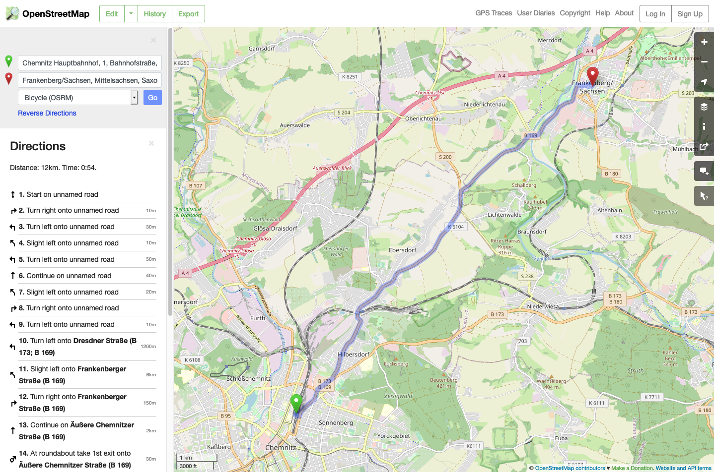

Abbildung 8.1 - Mit Openstreetmap von Punkt A nach B


## Aufschlüsselung der Konzepte

Routing ist ein klassisches Beispiel für die Verwendung von Vektordaten und lässt sich in mehrere Konzepte aufschlüsseln, die wir im Folgenden definieren werden. 

Die verwendeten Daten sind räumlich - sie haben eine definierte Position auf der Erde, ihre Attribute sind ebenfalls gut identifiziert. So repräsentiert ein Punkt mit Längen- und Breitengrad und dem Attribut "name=Chemitz Hauptbahnhof" - den Startpunkt A und ein Punkt mit einem anderen Paar von Längen- und Breitengrad und dem Attribut "name=Frankenberg/Sachsen" den Punk B. Straßen werden durch Linien repräsentiert, die aus Knoten und Verbindungen bestehen (dargestellt durch blaue kleine Kreise in Abbildung 8.2), mit Attributen wie Name, Richtung, Geschwindigkeitsbegrenzung usw. 


Abbildung 8.2 - Vektorlinien, die Straßen darstellen, und die zugehörige Attributtabelle

Straßen stellen ein Netzwerkmodell dar, das im Grunde eine Sammlung von topologisch miteinander verbundenen Punkt- und Linienmerkmalen ist. Die Ergebnisse des Algorithmus, der die Route von Punkt A zu Punkt berechnet, hängen in hohem Maße von der Qualität der Vektoren ab. Sowohl in der Geometrie als auch in den Attributen - wenn eine Straße eine Einbahnstraße ist, muss das angegeben werden, damit das Routing Sie nicht in die falsche Richtung führt. 		

### Das Vektordatenmodell

Wie in Modul 0 vorgestellt, gibt es 2 Datenmodelle, die in einem Geographischen Informationssystem - GIS - verwendet werden: Raster und Vektor. Geodaten enthalten immer eine **Raumkomponente**, die den Ort oder die räumliche Verteilung des betreffenden Phänomens angibt, und eine **Sachkomponente**, die dessen Eigenschaften beschreibt. Die Entscheidung, ob für eine bestimmte Situation das Raster- oder das Vektordatenmodell verwendet wird, hängt von der Quelle der Daten sowie vom Verwendungszweck ab. 

Das Vektordatenmodell wird zur Darstellung von Flächen, Linien und Punkten verwendet (Abbildung 8.3). 


Bild 8.3 - Vektordaten mit Attributtabelle


### Metadaten

Metadaten sind Daten über Daten. Sie charakterisieren auf verschiedenen Detailebenen den Datensatz, mit dem sie verknüpft sind, einschließlich Kategorien wie: wer ist der Anbieter/Eigentümer des Datensatzes, was ist die Lizenz, in welcher Sprache sind die Attribute geschrieben, welches Koordinatensystem wurde verwendet, welches geografische Gebiet wird beschrieben und was ist das Bezugsjahr, Schlüsselwörter, was sind die bekannten Einschränkungen, Genauigkeitsgrad, was war der ursprüngliche Umfang des Datensatzes und vieles mehr.

Metadaten sind von entscheidender Bedeutung, da ein klares Verständnis der Daten, die in einer bestimmten Analyse verwendet werden sollen, den Unterschied zwischen einer richtigen oder einer voreingenommenen Entscheidung ausmachen kann. Wenn man ermitteln muss, wo ein neues temporäres Krankenhaus platziert werden soll, die Straßendaten aber alt sind und nicht mehr die Realität vor Ort widerspiegeln, dann wird jede darauf basierende Entscheidung ungenau sein. 

Aufgrund der Bedeutung von Metadaten folgen ihre Kategorien (ihre Definitionen, Namen, welche Art von Informationen sie speichern können usw.) wohldefinierten und standardisierten Strukturen. Diese gut strukturierten Metadaten können dann in spezielle Kataloge integriert werden, die es Benutzer:innen ermöglichen, geografische Daten anhand gegebener Kriterien zu suchen. Es gibt zahlreiche Metadatenkataloge; wenn diese standardisiert sind, kann innerhalb der GIS-Software auf sie zugegriffen werden. Ein Beispiel dafür wird in Modul 9 QGIS Erweiterungen vorgestellt. 

An dieser Stelle sei noch angemerkt, dass Metadaten natürlich keine Besonderheit von Geodaten sind, sondern dass sie für jede Art von Daten zu finden sind.


### Gründe für die Vektorverarbeitung

Die Stärke von GIS liegt in seiner einzigartigen Fähigkeit, geometrische Eigenschaften, die reale Objekte und Phänomene in unserer Welt definieren, und ihre Attribute - entweder beobachtet, gemessen oder berechnet - zu verbinden und durch spezialisierte Softwareoperationen auf ihren Geometrien, auf ihren Attributen oder beidem durchzuführen, um neue Informationen abzuleiten. 

Obwohl GIS meist eng mit Karten assoziiert wird, die einfach nur geografische Informationen darstellen, gehen seine Funktionalitäten weit über die Erstellung von kartografischen Darstellungen hinaus, seien sie nun dynamisch oder statisch. 

**Raumdatenanalyse** (Synonyme: räumliche Analyse, geospatiale Analyse, geografische Analyse, räumliche Interaktion) ist ein allgemeiner Begriff, der sich auf jede Technik bezieht, die darauf abzielt, Muster zu identifizieren, Anomalien zu erkennen und Theorien zu testen, die auf räumlichen Daten basieren. Eine Analyse ist dann und nur dann räumlich, wenn die Ergebnisse sinnvoll mit der Verortung der analysierten Objekte zusammenhängen - einfach ausgedrückt: **Ort spielt eine Rolle**. Mit der Entwicklung der Informationstechnologie begannen Wissenschaftler:innen, verschiedene Methoden aus der Statistik, Geometrie, Topologie und anderen Wissenschaften auf die Analyse geografischer Daten anzuwenden, um Muster und Phänomene auf der Erdoberfläche zu untersuchen. 

**Geostatistik** ist ein Zweig der Statistik, der sich auf räumliche Daten bezieht. Die am häufigsten verwendeten Methoden beziehen sich auf die Interpolation, ein mathematischer Prozess, der die Schätzung unbekannter Werte auf der Grundlage bekannter Werte ermöglicht. 

**Topologie** ist ein Zweig der Mathematik, der es der/dem GIS-Anwender:in ermöglicht, die geometrischen Beziehungen zwischen Features zu kontrollieren und die geometrische Integrität zu erhalten. Die Topologie ist am besten als ein Satz von Regeln zu verstehen, der die Qualität räumlicher Daten sicherstellt und auf einen oder mehrere Vektor-Layer angewendet werden kann. Die Regeln sind so gestaltet, dass sie die Beziehungen in der realen Welt respektieren, die die Vektor-Layer darstellen. Zum Beispiel darf es keine Lücken zwischen den Polygonen geben, die Landkreise in einer Region darstellen, oder kein Punkt, der zum Baumlayer gehört, darf in einem Polygon des Gebäudelayers enthalten sein.

GIS-Software bietet Funktionalitäten, die es erlauben, relevante Topologieregeln zu definieren, sowie Algorithmen, um zu prüfen, ob sie zutreffen, und um den Vektor-Layer zu bereinigen, wenn Inkonsistenzen festgestellt werden. 

Geoverarbeitung ist ein allgemeiner Begriff, der alle Operationen - Prozesse - definiert, die auf einen geografischen Datensatz angewendet werden, mit dem Ziel, einen abgeleiteten Datensatz zu erhalten, der neue Erkenntnisse über die Daten ermöglicht. Übliche Geoverarbeitungsperationen sind die Überlagerung von geografischen Merkmalen, die Auswahl und Analyse von Merkmalen, die Topologieverarbeitung und die Datenkonvertierung. Geoverarbeitung ermöglicht es, geografische Informationen zu definieren, zu verwalten und zu analysieren, um die Entscheidungsfindung zu unterstützen. 


## Hauptinhalt: 

### Phase 1: Verstehen Ihrer Daten.

Es gibt viele Geoverarbeitungsoperationen, die mit Vektordaten durchgeführt werden können. Zu den gängigsten gehören die Überlagerung von geografischen Merkmalen, die Auswahl und Analyse von Merkmalen, die Topologieverarbeitung und die Datenkonvertierung. In dieser ersten Phase werden wir uns mit einigen von ihnen vertraut machen und verstehen, wie sie funktionieren und welche Ergebnisse wir erwarten können. 


#### **Schritt 1. Bereiten Sie Ihre Arbeitsumgebung vor.**

Öffnen Sie QGIS, richten Sie das Koordinatenreferenzsystem ein, in dem Sie arbeiten werden - EPSG 25833 - und fügen Sie die folgenden Datenlayer hinzu:

* Polygone - Landkreisausdehnung; Gebäude; Landnutzung;
* Linien - Straßen, Flüsse;
* Punkte - Religiöse Orte, Orte von Interesse

An dieser Stelle sollte Ihr QGIS-Kartenfenster wie in Abbildung 8.5 aussehen, natürlich, höchstwahrscheinlich, in anderen Farben. 


**TIP**: Verwenden Sie räumliche Indizes, um die Verarbeitungszeit zu beschleunigen und zu verbessern. Dies können Sie mit dem Algorithmus **Raumindex erzeugen** tun.


Abbildung 8.5 - Geladene Vektordatensätze: Punkte, Linien und Polygone


#### **Schritt 2. Verstehen Sie, was Sie da sehen.** 

Zu diesem Zeitpunkt haben wir 7 Vektor Layer in unser QGIS Projekt geladen. Die nächsten Schritte werden uns helfen, unsere Daten zu verstehen. 

* Überprüfen Sie, wie viele Features wir in einem Layer haben - es gibt mehrere Möglichkeiten, das zu tun: 

    * **Doppelklick auf den Layer ‣ Informationen ‣ Objektanzahl**.
    * **Öffnen Sie die Attributtabelle des Layers und schauen Sie ganz oben nach** 


Bevor wir eine grundlegende Statistik durchführen, wollen wir die Attributtabelle mit einigen geometrischen Attributen vervollständigen (siehe Modul 6 für Details): 

* Straßenlayer - berechnen Sie die Länge für jedes Straßensegment und speichern Sie sie in der Attributtabelle: Ausgabefeldname - Länge `round($length, 2)`
* Gebäudelayer - berechnet die Fläche für jedes Gebäude und speichert sie in der Attributtabelle; Ausgabefeldname - Fläche `round($area, 2)`

Nun sind die Attributfelder gefüllt, doch wenn Sie sich nicht sicher sind, in welcher Maßeinheit QGIS die Länge von Straßenabschnitten und Flächen von Gebäuden berechnet hat, dann hilft Ihnen die Überprüfung der Koordinatensystem-Informationen. 

Klicken Sie in der rechten unteren Ecke des QGIS-Kartenfensters auf EPSG 25833 und es erscheint ein Fenster wie in Abbildung 8.6. 


Abbildung 8.6 - Angaben zum im QGIS-Projekt verwendeten Koordinatenreferenzsystem

So finden wir heraus, dass die Maßeinheit der Meter ist, daher werden die Längen in Metern und die Flächen in Quadratmetern gemessen. 

* Führen Sie grundlegende Statistiken über die geladenen Layer aus, um einen besseren Überblick über Ihre Daten zu erhalten (Abbildung 8.7 ):

    * **Vektor ‣ Analyse ‣ Grundstatistik für Felder**


Abbildung 8.7 - Grundstatistik für Felder

Die zurückgegebene Statistik hängt vom gewählten Feldtyp ab und wird als HTML-Datei generiert.

Führen wir sie auf unserem Straßen-Layer aus und sehen wir, welche Ergebnisse wir erhalten. Füllen Sie das Fenster aus, wie in Abbildung 8.8. 


 [Vorbereiten der Grundlagenstatistik für den Layer Straßen)

Abbildung 8.8 - Vorbereiten der Grundlagenstatistik für den Layer Straßen

Die Ausgabedatei ist eine HTML-Datei, die mit jedem Browser (Firefox, Chrome, Safari usw.) geöffnet werden kann und wie folgt aussehen sollte: 


```
Analysiertes Feld: Länge
Anzahl: 76112
Eindeutige Werte: 30563
Fehlende Leerwerte (NULL): 0
Minimalwert: 0.03
Maximalwert: 4546.81
Bereich: 4546.780000000001
Summe: 11795873.809999991
Mittelwert: 154.9804736441033
Median: 62.974999999999994
Standardabweichung: 257.6998560908621
Variationskoeffizient: 1.6627891890603153
Minderheit (am seltensten vorkommender Wert): 0.03
Mehrheit (am häufigsten auftauchender Wert): 6.95
Erstes Viertel: 23.61
Drittes Viertel: 167.46
Interquartilabstand (IQR): 143.85000000000002
```


Aus diesen grundlegenden Statistiken finden wir heraus, dass es 76112 Straßensegmente im geladenen Layer gibt, wobei das kürzeste 0,03 m und das längste 4546,81 m lang ist. Wir finden heraus, dass die Summe der Straßen in Mittelsachsen etwa 12.000 km entspricht. Da der Mittelwert größer als der Median ist, sagt uns das, dass die 2. Hälfte des Datensatzes längere Straßenabschnitte enthält und die Straßenabschnitte in der 1. Hälfte überwiegen. Der Median zeigt jedoch, dass die meisten Straßensegmente eine Länge von nur 62m haben. 

Wenn wir die Basisstatistiken für die Spalte "type" im Gebäudelayer ausführen, erhalten wir folgende Ergebnisse: 

```
Analysiertes Feld: type
Anzahl: 154638
Eindeutige Werte: 113
Fehlende Leerwerte (NULL): 125119
Minimalwert: 10
Maximalwert: yard
Minimallänge: 0
Maximallänge: 20
Mittlere Länge: 1.3095875528654017
```


Die Ergebnisse sehen nicht gleich aus, wir haben weder Mittelwert, noch Median oder Standardabweichung. Das liegt daran, dass das Attributfeld, auf dem wir den Algorithmus laufen ließen, anders ist, wir haben keine Zahlen, sondern Wörter - Gebäudetypen. Wir finden heraus, dass wir von 154638 Gebäuden in Mittelsachsen für 125119 den Gebäudetyp nicht kennen. Wir finden auch heraus, dass es 113 einzigartige Kategorien gibt. 


#### **Schritt 3. Grundlegende Prüfungen, um schnell Fehler in Ihren Daten zu finden.**

Perfekte, makellose Datensätze sind das Äquivalent zum idealen Gas in der Physik. So etwas gibt es nicht, aber viele können ihm sehr nahe kommen. Bevor Sie also irgendeine Art von Analyse durchführen, um Informationen zu extrahieren, sind zumindest einige grundlegende Prüfungen notwendig, wie _sauber_ die Daten sind, die wir haben. 

Es gibt viele Arten von Fehlern, die die Qualität Ihrer Daten beeinträchtigen können, und je nach Umfang Ihrer Geodatenanalyse kann deren Einfluss auf das Endergebnis mehr oder weniger wichtig sein. Wenn Sie z. B. Geodaten verwenden, um sich mit dem Auto von Punkt A nach Punkt B zu bewegen, dann ist ein Straßen-Layer mit den Attributen, welche Straßen eine Einbahnstraße sind oder für Autos gesperrt sind, unerlässlich, um ein brauchbares Ergebnis zu erhalten.  Wenn Sie jedoch zu Fuß unterwegs sind, sind diese Informationen für Ihr Ergebnis nicht entscheidend. 

Wenn von Fehlern in Geodaten die Rede ist, gibt es 2 Hauptbegriffe, die gut verstanden werden müssen: 

**Genauigkeit** ist der Grad, in dem die Informationen auf einer Karte mit den realen Werten übereinstimmen und bezieht sich sowohl auf die Geometrie als auch auf die Attribute.

**Präzision** bezieht sich auf den Grad der Messung und Genauigkeit der Beschreibung in einem Geodatensatz.

Der Begriff **Fehler** umfasst sowohl die Ungenauigkeit von Daten als auch deren Fehlerhaftigkeit. Die **Datenqualität** bezieht sich auf den Grad der Präzision und Genauigkeit der Datensätze und wird meist in Datenqualitätsberichten dokumentiert. 

Die Analyse und _Bereinigung_ eines Geodatensatzes kann eine sehr zeitaufwendige und mühsame Aufgabe sein, ist aber - wie im obigen Beispiel gezeigt - unerlässlich. In diesem Abschnitt stellen wir einige GIS-Funktionen vor, mit denen schnelle Prüfungen von Vektordaten durchgeführt und eine Reihe von vorläufigen Schlussfolgerungen über deren Qualität gezogen werden kann. 

**Topologie-Checks**.

QGIS bietet eine Kernfunktionalität, die es ermöglicht, eine Reihe von topologischen Prüfungen an den geladenen Vektordatensätzen durchzuführen, die sogennannte Topologie-Prüfung. Die Topologie-Prüfung ist eine Kernerweiterung und kann über den Dialog **Erweiterungen verwalten und installieren** aktiviert werden. Öffnen Sie den Dialog "Erweiterungen verwalten und installieren" und stellen Sie sicher, dass das Plugin "Topologie-Prüfung" aktiviert ist (mit einem Häkchen versehen). Sie finden es unter der Registerkarte **Installiert**.


Abbildung 8.9.a - Topologie-Prüfung-Plugin

Um die Topologie-Prüfung anzuzeigen, aktivieren Sie sie als Bedienfeld unter **Vektor ‣ Topologie-Prüfung** (Abbildung 8.9.b). Sobald sie aktiviert ist, sieht ihr Fenster wie in Abbildung 8.9.c aus.  


Bild 8.9.c - Topologie-Prüfungsfenster


Um die Topologieregeln zu definieren, klicken Sie auf das dritte Symbol , wodurch sich ein Fenster wie in Abbildung 8.10 öffnet. 


Bild 8.10 - Fenster "Topologieregeleinstellungen"


Wir werden eine Reihe von Regeln für die Layer setzen, die wir in unser QGIS-Projekt geladen haben, unter Berücksichtigung der Objekte der realen Welt, die sie darstellen - Straßen, Gebäude, Wasserwege. 

Die Konfiguration der Topologie ist einfach, da die Regeln, die auf Basis des ausgewählten Layers angewendet werden können, bereits in diese Funktionalität eingebettet sind, wie Abbildung 8.11 zeigt. 


Abbildung 8.11 - Dropdown-Menü "Topologieregeln" basierend auf dem ausgewählten Layer.

Wählen Sie die Topologieregeln wie in Abbildung 8.12 dargestellt. 


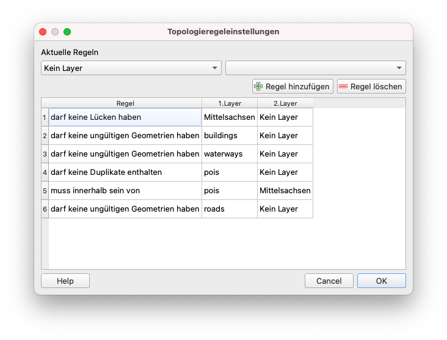

Bild 8.12 - Einzustellende Topologieregeln 

Klicken Sie auf das erste Symbol  im Fenster des Topologieprüfers, um die Prüfung auszuführen, und warten Sie auf die Ergebnisse. Nach dem Ausführen der Topologieprüfung sollte Ihr Kartenfenster wie in Abbildung 8.13 aussehen. 


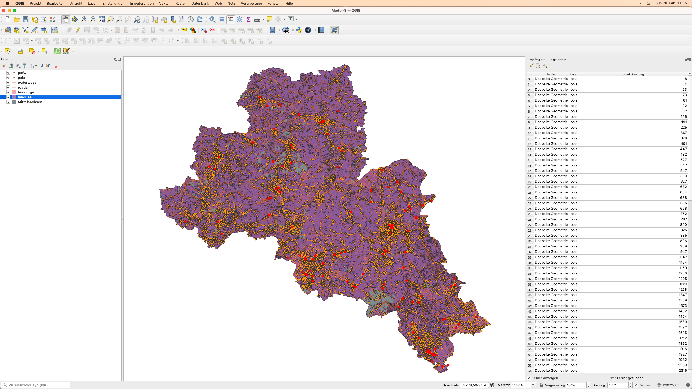

Abbildung 8.13 - Ergebnisse der Topologieprüfung

Im Topologie-Prüfungsfensters werden alle Fehler aufgelistet, die auf der Grundlage der Regeln, die wir in der vorherigen Phase definiert haben, identifiziert wurden. Wenn das Kontrollkästchen Fehler anzeigen aktiviert ist, werden die Fehler in der Karte rot hervorgehoben. Durch einen Doppelklick auf einen markierten Fehler wird die Karte an die entsprechende Stelle verschoben. 

Der Prozess der Korrektur von Fehlern in einem Datensatz, sei es in Bezug auf die Geometrie (Duplikate, Lücken etc.) oder in Bezug auf die Attribute (fehlende Werte, Rechtschreibfehler etc.), wird als Bereinigung eines Datensatzes bezeichnet und ist meist ebenso mühsam wie notwendig. Obwohl es Funktionalitäten gibt, die einen halbautomatischen Bereinigungsprozess unterstützen, ist oft eine manuelle Korrektur notwendig. In Abbildung 8.14 haben wir zum Beispiel einen Fehler in unserem Points of Interests Layer eingezoomt, einen doppelten (sogar dreifachen) Punkt. Wie man sieht, gibt es drei Punkte, die ein Café darstellen, der Unterschied liegt in der Attributtabelle, in der einer als Café, einer als Bäckerei und einer als Gaststätte aufgeführt ist.


Abbildung 8.14 - Doppelter Punk im Points Of Interests Layer

In diesem speziellen Fall wäre die Entscheidung des Anwenders höchstwahrscheinlich, den doppelten Punkt zu entfernen, da er bei der weiteren räumlichen Analyse Fehler verursachen kann. Wenn z.B. ein Stadtbeamter wissen möchte, wie viele Restaurants und Cafés sich in einem bestimmten Viertel befinden, wird der doppelte Punkt einen Fehler in die Ergebnisse einfügen, was letztendlich zu falschen Entscheidungen führen könnte.  

Deshalb werden wir mit einer automatischen Entfernung der doppelten Punkte fortfahren. Dazu verwenden wir eine Kernfunktion von QGIS - **Doppelte Geometrien löschen** - zu finden in der Verarbeitungs-Toolbox. Ihr QGIS sollte wie in Abbildung 8.15 aussehen. 


Abbildung 8.15 - Doppelte Geometrien im Layer Points of Interest löschen

Nach der Ausführung des Algorithmus präsentiert das Funktionsfenster die Ergebnisse, es hat 127 doppelte Punkte identifiziert - genau wie der Topologie-Checker - und sie gelöscht, so dass der Layer pois mit **12138 Features** übrig bleibt. Benennen Sie diesen Layer in **pois-bereinigt** um. Beachten Sie, dass die Ausgabe ein Layer im Speicher ist, den Sie dauerhaft machen können, indem Sie ihn in einer Datei speichern.


Abbildung 8.16 - Nach dem Löschen der Duplikate

Eine erneute Ausführung der Topologieprüfung führt zu einem Ergebnis von 0 Fehlern in Bezug auf die Topologieregel, dass es keine geometrischen Duplikate für den Layer "Points of Interest" gibt. 

**Achtung!** Der Algorithmus berücksichtigt **nur Geometrien** und ignoriert das Attribut. Wenn es, wie in unserem Fall, einige Unterschiede im Attribut für die Duplikate gibt, haben Sie keine Kontrolle darüber, welches beibehalten wird. Wenn also alle Informationen beibehalten werden sollen, müssen sie zuerst in alle Geometrien kopiert werden, so dass beim Löschen eines doppelten Features kein Informationsverlust entsteht. 

Lassen Sie uns eine weitere Topologieprüfung durchführen, diesmal auf unserem Gebäude-Layer. Konfigurieren Sie die folgenden Regeln: 

* darf keine ungültigen Geometrien haben
* darf keine Duplikate enthalten


Abbildung 8.17a - Topologieprüfungsregeln auf dem Gebäude-Vektor-Layer

Führen Sie den Algorithmus aus. 

Das Ergebnis sollte wie in Abbildung 8.17b aussehen. 


Abbildung 8.17b - Ergebnisse der Topologieprüfung auf dem Gebäude-Vektor-Layer

Bereinigen Sie das Duplikat-Feature mit Hilfe des oben angegebenen Verfahrens (Abbildung 8.18a)


Abbildung 8.18a - Entfernen von doppelten Geometrien auf dem Gebäude-Vektor-Layer


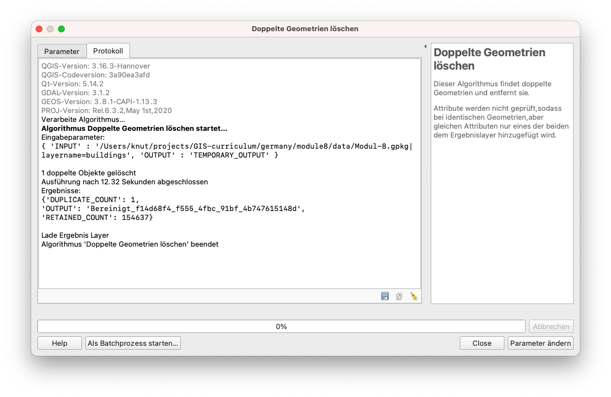


Abbildung 8.18b - Ergebnisse des Entfernens doppelter Geometrien auf dem Gebäude-Vektor-Layer


Eine vollständige Bereinigung der für dieses Modul verwendeten Vektordatensätze würde den Rahmen sprengen. Seine Komplexität macht es zu einem eigenen, fortgeschritteneren Modul.


#### **Schritt 4. Genauere Informationen zu den Punkten, Linien und Polygonen**

Führen wir einen weiteren Algorithmus durch, um ein Gefühl dafür zu bekommen, welche Attribute unsere Layer haben. Nachdem wir festgestellt haben, wie viele Features jeder Layer hat, wollen wir sehen, wie viele und welche die eindeutigen Attribute in den folgenden Fällen sind: 

* Layer buildings-bereinigt - Attribut type;
* Layer pois-bereinigt - Attribut fclass;
* Layer waterways - Attribut fclass;
* Layer pofw - Attribut fclass;
* Layer roads - Attribut fclass;
* Layer landuse - Attribut fclass;

Gehen Sie dazu auf **Vektor ‣ Analyse-Werkzeuge ‣ Eindeutige Werte auflisten** (Abbildung 8.19)


Bild 8.19a - Eindeutige Werte in einer Vektor-Layer-Funktionalität auflisten

Klicken Sie in dem sich öffnenden Fenster unten auf "Als Batchprozess starten" und geben Sie den Namen und das Attribut jedes Layers ein, das Sie interessiert, wie in der obigen Liste aufgezählt, und Sie sollten die folgenden Ergebnisse erhalten: 

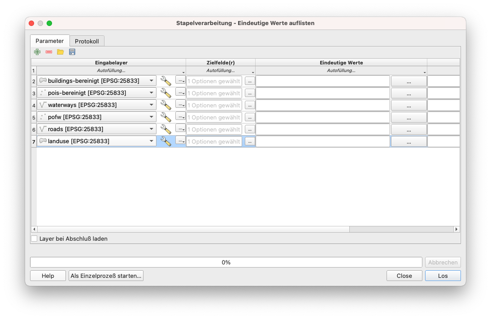

Abbildung 8.19b - Eindeutige Werte in einer Vektor-Layer-Funktionalität auflisten (Batch-Verarbeitung)

| Layername     | Anzahl eindeutiger Werte | Eindeutige Werte  |
| ------------- | ------------------------ | ----------------- |
| buildings-bereinigt | 113                      | attached;65b;government;AWO*Seniorenzentrum*;hall_of_residence;tent;henhouse;parish_hall;toilets;collapsed;college;covered;commercial;yes;grandstand;service;riding_hall;station;manufacture;storage_tank;school;sty;castle;semi_attached;flat_terrace;university;semidetached_house;residential;farm;sports_centre;civic;no;fire_station;static_caravan;winter_garden;house;kindergarten;commercial;pavilion;carport;religious;shelter;10;disused;construction;hut;abandoned;transformer_tower;retail;public;garage;shop;NULL;54;industrial;greenhouse;Pfarrei;parking;church;decaying;substation;stable;G;gym;outbuilding;water_works;allotment_house;biergarten;balcony;bridge;tipi;mill;shed;tech_cab;ruins;hotel;barn;store;roof;terraced_house;cabin;farm_auxiliary;silo;terrace;transformer_house;healthcare;supermarket;apartments;transportation;bungalow;sports_hall;temple;stadium;35;work_shop;kiosk;train_station;20d;wall;chapel;garages;factory;hospital;yard;dormitory;warehouse;office;hangar;electricity;gatehouse;different;detached;villa;cowshed |
| pois-bereinigt|119 | wayside_cross;laundry;memorial;travel_agent;garden_centre;outdoor_shop;nightclub;optician;bench;windmill;greengrocer;florist;college;jeweller;swimming_pool;vending_cigarette;veterinary;monument;hostel;camp_site;recycling_paper;arts_centre;drinking_water;fountain;picnic_site;library;clothes;school;guesthouse;castle;department_store;pitch;courthouse;sports_shop;university;furniture_shop;theme_park;telephone;sports_centre;museum;gift_shop;fire_station;atm;chemist;kindergarten;bakery;doityourself;post_office;shelter;community_centre;pub;water_mill;convenience;car_sharing;pharmacy;stationery;artwork;recycling_metal;hairdresser;fast_food;recycling_glass;bicycle_shop;tower;recycling_clothes;bookshop;vending_parking;wayside_shrine;chalet;water_well;nursing_home;butcher;toilet;recycling;archaeological;water_works;computer_shop;biergarten;cinema;vending_any;town_hall;hunting_stand;comms_tower;waste_basket;ruins;hotel;mobile_phone_shop;viewpoint;post_box;bar;playground;dentist;supermarket;shoe_shop;car_rental;newsagent;cafe;beverages;observation_tower;toy_shop;kiosk;tourist_info;wastewater_plant;attraction;hospital;theatre;doctors;public_building;police;caravan_site;ice_rink;restaurant;bank;car_wash;water_tower;battlefield;beauty_shop;car_dealership;camera_surveillance;food_court|
| waterway| 4 |drain;canal;river;stream |
| pofw          |        3                  |           christian_lutheran;christian;christian_protestant       |
| roads          |     24                     |      track_grade2;track_grade5;secondary_link;cycleway;primary;track_grade1;residential;steps;track_grade3;tertiary;living_street;track;service;motorway;track_grade4;footway;primary_link;unclassified;motorway_link;secondary;bridleway;path;tertiary_link;pedestrian |
| landuse          |       20                   |     farmyard;recreation_ground;industrial;meadow;grass;military;residential;scrub;nature_reserve;orchard;commercial;park;forest;farmland;vineyard;heath;cemetery;allotments;quarry;retail             |


Tabelle 8.1 - Tabelle der eindeutigen Werte

Für eine weitergehende Analyse der Attribute unserer Layer verwenden wir das Plugin GroupStats. Es wurde entwickelt, um die Berechnung von Statistiken für Objekt-Gruppen in einem Vektor-Layer zu unterstützen, was sehr nützlich ist, um ein besseres Verständnis für Ihre Daten zu erhalten und mögliche Fehler in den Attributen zu erkennen. 

Stellen Sie zunächst sicher, dass Sie die GroupStats-Erweiterung installiert und aktiviert haben. Um das GroupStats-Fenster zu öffnen, gehen Sie anschließend zu **Vektor ‣ GroupStats ‣ GroupStats**.


Abbildung 8.20a - GroupStats-Plugin

Es sollte sich ein neues Fenster wie das in Abbildung 8.20b öffnen. 


Abbildung 8.20b - GroupStats-Fenster

Wie aus der zuvor durchgeführten Analyse hervorgeht, haben wir für den Layer Gebäude 113 verschiedene Gebäudetypen, aber wie viele sind es jeweils und wie groß ist die gesamte bebaute Fläche, die von jeder Kategorie eingenommen wird? Wie viel Fläche für Schulen, für Märkte, für Häuser? GroupStats kann uns helfen, diese Frage zu beantworten. Auf der rechten Seite des Fensters befindet sich das Bedienfeld, in dem wir auswählen, was wir berechnen wollen und wie die Daten angeordnet werden sollen. Folgen Sie per Drag&Drop der Anordnung in Abbildung 8.21 und drücken Sie dann auf "Calculate". 

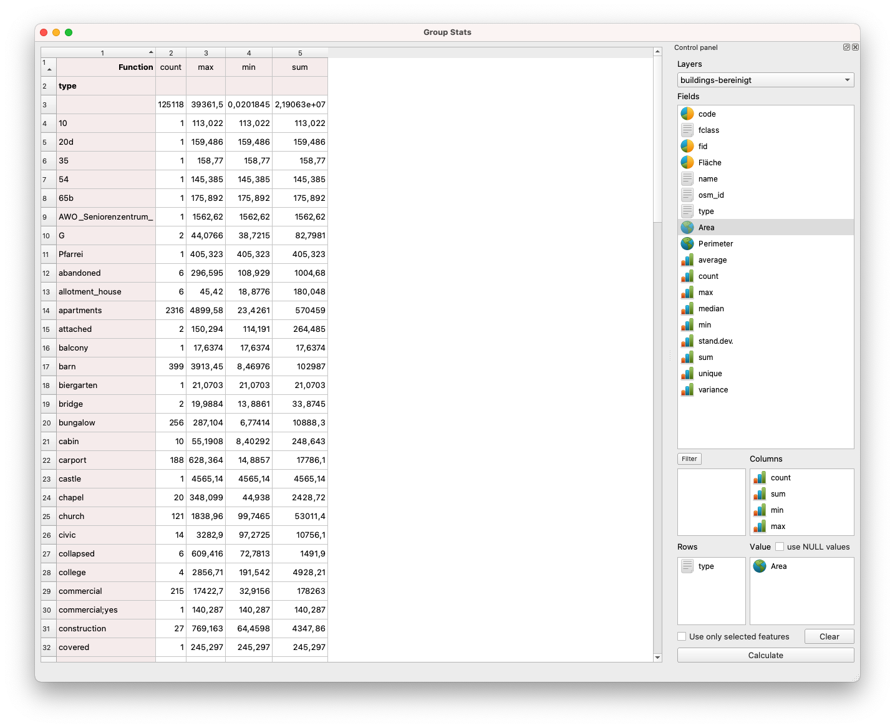

Abbildung 8.21 - GroupStats auf dem Gebäudelayer 

Wenn wir uns das Ergebnis ansehen, können wir wichtige Erkenntnisse über unsere Daten gewinnen. Zum Beispiel haben wir für Wohnzwecke (Schlüssel: apartment) 2316 Gebäude mit einer bebauten Gesamtfläche von 570459 Quadratmetern. Wir finden auch heraus, dass das größte 4900   Quadratmeter hat, während das kleinste 23 Quadratmeter hat. 

Eine weitere interessante Analyse kann auf dem Straßen-Vektor Layer durchgeführt werden. Abbildung 8.22 zeigt, wie man die Längen von Straßen, kategorisiert nach Straßentyp (Hauptstraße, Wohnstraße, Autobahn usw.) und zulässiger Höchstgeschwindigkeit, berechnen kann. 


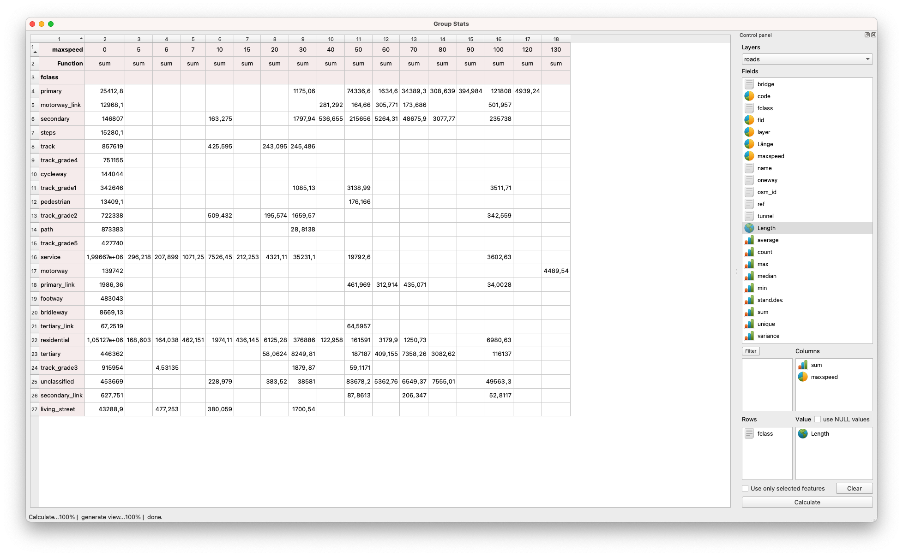

Abbildung 8.22 - GroupStats auf dem Straßenlayer 


#### **Quizfragen**

1. Sind Metadaten wichtig? 
  - <span style="text-decoration:underline;">Ja, denn sie geben einen Einblick in die geografischen Daten, den man sonst nicht erhalten könnte. </span>
  - Nein, sie sind nur erweiterter Bürokratieaufwand
2. Ist die Topologie relevant für die Geometrie oder für die Attributtabelle eines Vektorlayers?
  - für die Geometrie der Vektorebene
3. Was ist wichtiger, die Geometrie oder die Attributdaten? 
  - Geometrie
  - Attributdaten
  - <span style="text-decoration:underline;">Beides.</span>


### Teil 2: Einführung in die Vektorverarbeitung

Der erste Teil des Vektormoduls gab eine Einführung in die Schritte, die ein grundlegendes Verständnis für die vorliegenden Geodaten schaffen können. 

Dieser zweite Teil des Moduls führt Sie in eine tiefergehende Arbeit zur Verarbeitung von Vektordaten ein, um wertvolle Erkenntnisse für die Entscheidungsfindung zu gewinnen. In Anlehnung an die zu Beginn dieses Moduls beschriebenen Konzepte stellt Geoverarbeitung jeden Prozess dar, der auf einen geografischen Datensatz angewendet wird, mit dem Ziel, einen abgeleiteten Datensatz zu erhalten, der neue Erkenntnisse über die Daten eröffnet. Und genau das werden wir im Folgenden tun. 

Es gibt viele Operationen, die auf einen oder mehrere Geodatensätze angewendet werden können, und in diesem ersten Schritt werden wir einige der gängigsten ausführen, um zu verstehen, wie sie funktionieren. 

**Puffer**: Stellen Sie sich vor, Sie müssen ein neues Gesetz analysieren, das vorschreibt, dass in einem Umkreis von 500 Metern um Gotteshäuser keine weiteren Gebäude errichtet werden dürfen. Sie würden sehen wollen, wo genau diese Abgrenzungen sind und vielleicht sogar, wie viele Quadratmeter das für Ihren Bezirk sind. Der erste Schritt besteht darin, einen Puffer um die Gotteshäuser zu definieren: **Vektor ‣ Geoverarbeitsungswerkzeuge ‣ Puffer**. Wenn sich das Pufferfenster öffnet, stellen Sie die Parameter wie in Abbildung 8.23 ein: 


Abbildung 8.23 - Einstellen der Parameter für einen 500 m Puffer um Gotteshäuser

Ein Detail des Ergebnisses der Geoverarbeitung ist in Abbildung 8.24 dargestellt: 

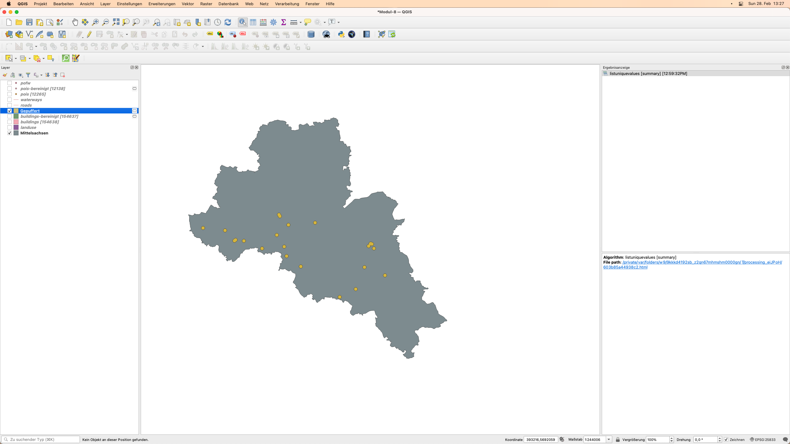

Abbildung 8.24 - Ergebnis der Pufferberechnung

Um die Ausgangsfrage vollständig zu beantworten, müssen im nächsten Schritt die Flächen für alle Puffer berechnet und aufsummiert werden (siehe Teil 1, Schritt 4) - Abbildung 8.25. 

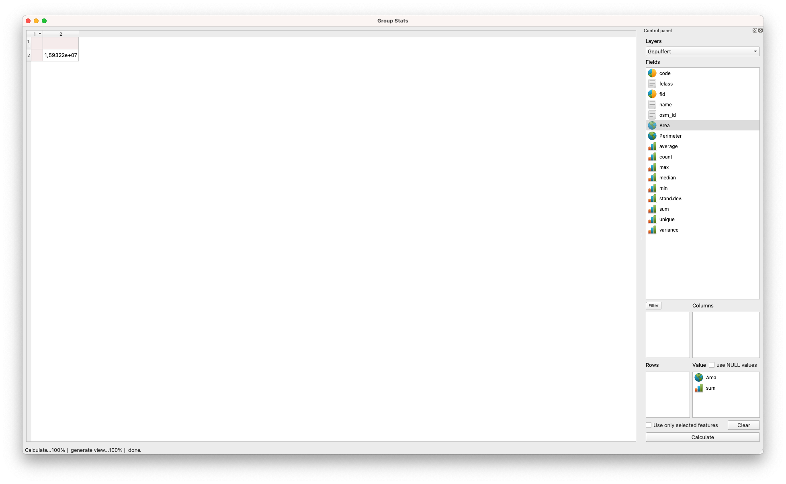

Abbildung 8.25 - Fläche für den neu erhaltenen Layer, mit GroupStats berechnet

**Zuschneiden**: Stellen Sie sich vor, Sie möchten wissen, wo sich alle abgegrenzten Industriegebiete in Ihrem Bezirk befinden und auch, wie viele Gebäude sich innerhalb dieses Gebiets befinden. Bei der visuellen Inspektion Ihrer Vektordaten stellen Sie fest, dass Sie eine Reihe von Industriegebieten haben, die mehrere Gebäude enthalten. Sie möchten diese Gebäude abgrenzen und weiter verwenden. Als ersten Schritt wählen Sie alle Features im Landnutzungs-Layer aus, die als Attribut Industrie haben (siehe Modul 6, wie das geht). Anschließend gehen Sie auf **Vektor ‣ Geoverarbeitungswerkzeuge ‣ Zuschneiden** und wählen als zu zuzuschneidenen Layer building-bereinigt. Ihr Ergebnis sollte wie in Abbildung 8.27b aussehen. 


Abbildung 8.26a - Auswahl der Flächennutzung fclass = industrial. 


Abbildung 8.26b - Ausgewählte Industrieflächen 

Führen Sie den Zuschneiden-Algorithmus aus. Stellen Sie sicher, dass das Kontrollkästchen **Nur ausgewählte Features** für den Overlay Layer (landuse) aktiviert ist. Dadurch wird sichergestellt, dass nur die aktuell ausgewählten Features für das Zuschneidenping verwendet werden und die Berechnungen beschleunigt werden.

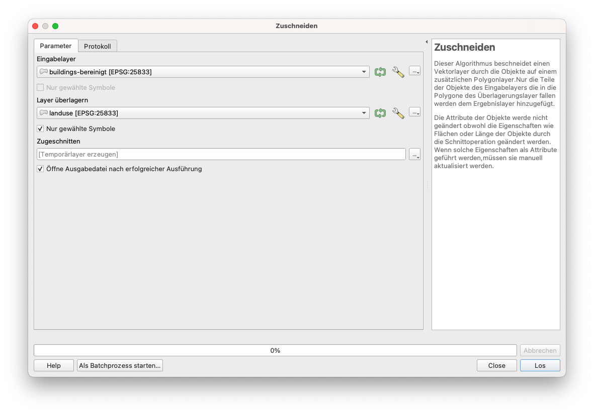

Abbildung 8.27a - Ausführen des Zuschneiden-Algorithmus

Nach der Ausführung des Algorithmus sollten Ihre Ergebnisse wie in Abbildung 8.27b aussehen. Die beschnittenen Gebäude sind grün eingefärbt (die Farbe kann bei Ihnen wie immer eine andere sein). Wie viele Industriegebäude bleiben über und wie groß ist deren Gesamtfläche? 

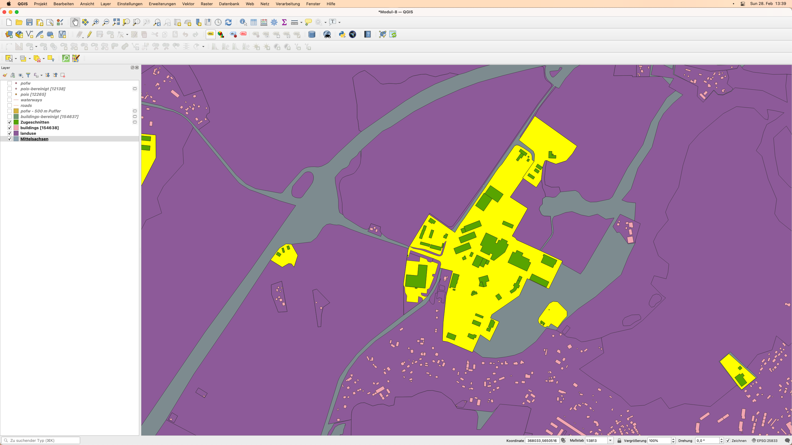

Abbildung 8.27b - Ergebnis der Zuschneiden-Funktionalität

**Thiessen (Voronoi)-Polygone**: Stellen Sie sich vor, Sie müssen eine Reihe von Verwaltungsentscheidungen in Ihrem Bezirk treffen, die darauf basieren, wie viele Schulen es gibt und welche spezifischen Bereiche sie bedienen. Eine raumbezogene Analyse kann dabei hilfreich sein. Sie können damit beginnen, die Thiessen-Polygone zu berechnen. Ausgehend von einer Fläche, die mindestens zwei Punkte enthält, ist ein Thiessen-Polygon eine 2-dimensionale Form, deren Grenzen den gesamten Raum enthalten, der näher an einem Punkt innerhalb der Fläche liegt als an jedem anderen Punkt außerhalb der Fläche. Ein gutes Anwendungsbeispiel ist die Meteorologie, wo Wetterstationen diskrete Punkte sind, die gesammelten Informationen aber als auf der Fläche gemessen gelten, basierend auf den Thiessen-Polygonen. 

Um die obige Frage zu beantworten, werden wir den Algorithmus nur für Punkte ausführen, die das Attribut Schule am Typ haben. Nehmen Sie also die Auswahl wie in Modul 6 beschrieben vor. Sie sollten 88 Features auf dem Layer pois_cleaned ausgewählt haben. Gehen Sie zu **Vektor ‣ Geometrie-Werkzeuge ‣ Voronoi-Polygone..** Nachdem Sie die Parameter eingestellt haben - wählen Sie den Punkt-Layer, für den die Voronoi-Polygone berechnet werden sollen, und eine 30-prozentige Erweiterung, so dass das gesamte Betrachtungsgebiet enthalten ist, sollten Sie ein Ergebnis wie in Abbildung 8.28d sehen. Sollten Sie dabei die Fehlermeldung bekommen, dass die Funktion nur auf Objekte des Typs "Point" und nicht "Multipoint" angewandt werden kann, wählen sie "Vektor > Gemoetrie-Werkzeuge > Mehr- zu eindeutig" und wenden sie den Voronoi-Algorithmus auf den neuen Layer an.


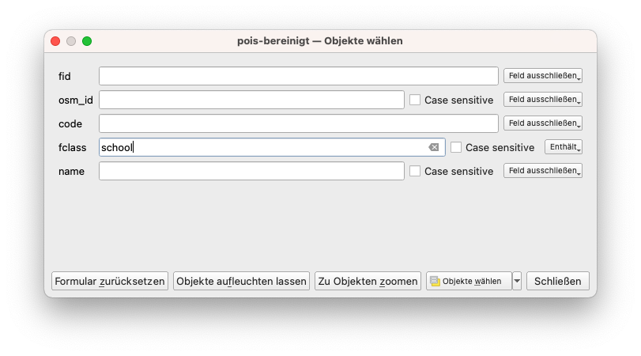

Abbildung 8.28a - Filtern des POI-Layer nach Schulen


Abbildung 8.28b - Schulen im POI-Layer


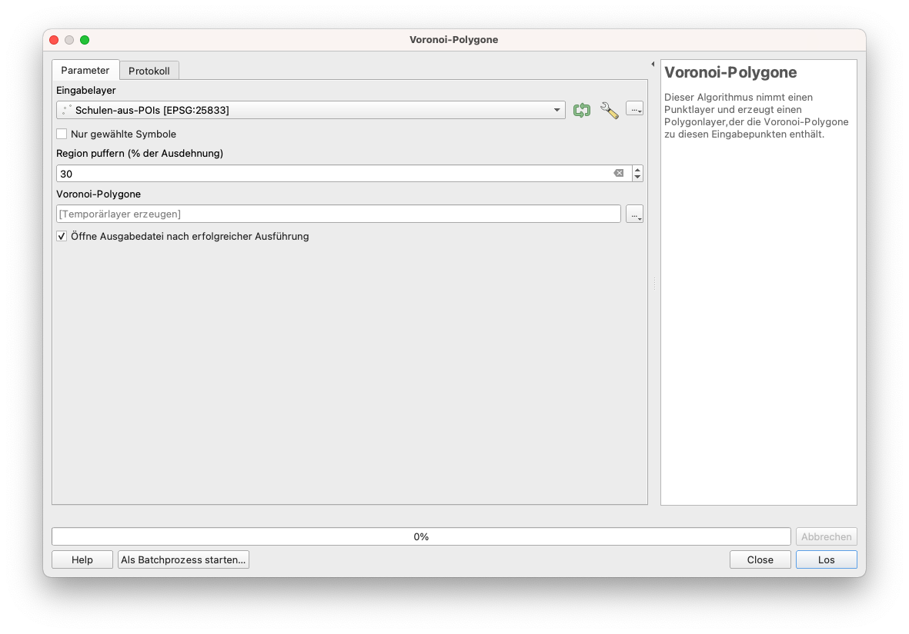

Abbildung 8.28c - Ausführen des Voronoi-Algorithmus


Abbildung 8.28d - Ergebnis des Voronoi-Algorithmus

Manchmal ergibt sich die Anforderung, Informationen in kleineren, klar definierten und gleichen Bereichen zu haben und nicht für eine ganze große Region, wie ein Land oder eine Großstadt. Daher müssen die Daten in einer kleineren, klar definierten Weise analysiert und visualisiert werden, um Vergleiche zu ermöglichen, die sich sonst ohne eine gemeinsame Basisreferenz als schwierig erweisen könnten. 

Nehmen wir an, dass Sie einen Bericht vorlegen müssen, der Vergleiche für Einheiten von 10X10 km über die Verwaltungseinheit ermöglicht, einschließlich 

1. Dichte der Grünflächen (Parks, Wälder) im Bericht zur bebauten Fläche pro Einheit
2. Gesamtlänge der Straßen für jede Einheit
3. Gesamtlänge der Wasserwege für jede Einheit
4. Gesamtzahl der öffentlichen Gebäude für jede Einheit (Schulen, Kindergärten, Krankenhäuser, Rathäuser usw.).

Wir haben gesehen, dass es Werkzeuge gibt, die uns bei der Berechnung der Gesamtfläche, die von einer bestimmten Art von Merkmalen eingenommen wird, helfen können, aber der erste Schritt ist die Erstellung unserer 10X10-Einheiten - Zellgitter. Um das zu tun, gehen Sie zu: **Vektor ‣ Forschungswerkzeuge ‣ Gitter erstellen..** Stellen Sie die Parameter auf: 
- Gittertyp - Rechteck (Polygon)
- Rasterausdehnung - "... > aus Layer berechnen > Mittelsachsen"
- Horizontaler Abstand - 10 km
- Vertikaler Abstand - 10 km 


Abbildung 8.29a - Erstellen eines 10kmx10km-Vektorgitters

Sie sollten ein Ergebnis wie in Abbildung 8.29b erhalten. 


Abbildung 8.29b - 10X10km-Vektorgitter

Zur weiteren Beantwortung der Fragen in unserer Übung müssen wir Folgendes tun:

1. Verhältnis von Grünflächen (Parks, Wälder) und bebauter Fläche pro Einheit:

Grünflächen und bebaute Flächen sind Daten, die im Landnutzungs-Layer enthalten sind. Um genau zu wissen, was die "Grünflächen" sind, müssen wir sehen, welche Kategorien im Datensatz enthalten sind. Dazu führen wir den Algorithmus **Eindeutige Werte auflisten** auf das Attribut "fclass" aus und finden heraus, dass wir die folgenden Grünflächen vorfinden: 'recreation_ground', 'meadow', 'grass', 'nature_reserve', 'orchard', 'park', 'forest', 'farmland', 'vineyard', 'cemetery', 'scrub', 'heath'. Außerdem finden wir die folgenden bebauten Flächen: 'farmyard', 'residential', 'industrial', 'commercial', 'allotments', 'retail'.
Abbildung 8.30b zeigt eine Visualisierung unserer Selektionen: 


Abbildung 8.30b - Räumliche Verteilung der Grünflächen und bebauten Flächen (zufällige Farben)

Der zweite Schritt zur Beantwortung der Anforderung besteht darin, zu ermitteln, wie viel Grünfläche und wie viel bebaute Fläche es in jedem 10X10 km gibt. Dazu werden die beiden überlagerten Polygon-Vektor-Layer **vereinigt**. Der Algorithmus extrahiert die überlappenden Teile der Features im Input - dem Landuse Layer und dem Overlay Layer - dem Grid Layer. Gehen Sie zu **Vektor - Geoverarbeitungswerkzeuge - Vereinugngen**. Stellen Sie die Algorithmusparameter wie in Abbildung 8.31 ein. Stellen Sie im anschluss die Symbolisierung für den neuen Layer wie im Screenshot weiter unten zu sehen ein.


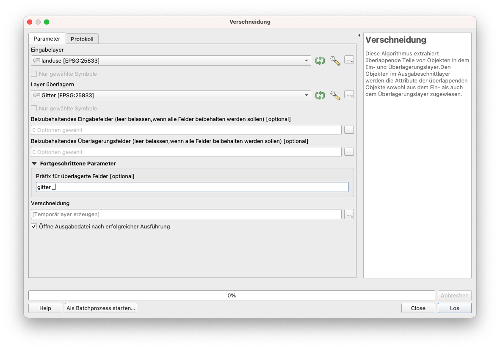

Abbildung 8.31 -  Parameter für den Vereinugngen-Algorithmus

Das Ergebnis sollte wie in Abbildung 8.32 aussehen.


Abbildung 8.32 - Ergebnis der Ausführung des Vereinigungen-Algorithmus

Jetzt haben wir für jede 10X10 km Einheit die Landnutzungsmerkmale, mit denen wir arbeiten können. Die Attributtabelle speichert auch diese Informationen, da jede Gitterzelle eine eindeutige ID hat, siehe Abbildung 8.33. 


Abbildung 8.33 - Landnutzungsmerkmale, die für jede Rasterzelle ausgeschnitten wurden, und die zugehörige Attributtabelle. 

Nachdem wir nun alle Landnutzungsmerkmale pro 10X10 km Einheit haben, fahren wir damit fort, die Geometrien derjenigen zu trennen, die die Grünfläche und die bebaute Fläche ausmachen, wie zuvor definiert - für jede Rasterzelle.  So werden wir für die Grünfläche alle Features auswählen, die folgende Attributwert für "fclass" haben: 'recreation_ground', 'meadow', 'grass', 'nature_reserve', 'orchard', 'park', 'forest', 'farmland', 'vineyard', 'cemetery', 'scrub', 'heath'. Erstellen Sie dafür folgenden Ausdruck in der Attributstabelle eingeben: `"fclass" in ('recreation_ground', 'meadow', 'grass', 'nature_reserve', 'orchard', 'park', 'forest', 'farmland', 'vineyard', 'cemetery', 'scrub', 'heath')`. Exportieren Sie die ausgewählten Features als grünflächen-gitter (siehe Modul 6 für weitere Details). Vergessen Sie nicht, das Häkchen bei **Nur ausgewählte Merkmale speichern** zu setzen. Die neue Ausgabe sollte 25871 Objekte enthalten. Machen Sie dasselbe für die bebaute Fläche. Wählen Sie die Features in landuse aus, die den Attributwert für `fclass` wie folgt haben: 'farmyard', 'residential', 'industrial', 'commercial', 'allotments', 'retail'. Ihre neue Ausgabe sollte 5570 Features enthalten. 

Alternativ können Sie auch einen Filter anstelle einer Auswahl verwenden.


Bild 8.34a - Auswählen der Grünflächen.


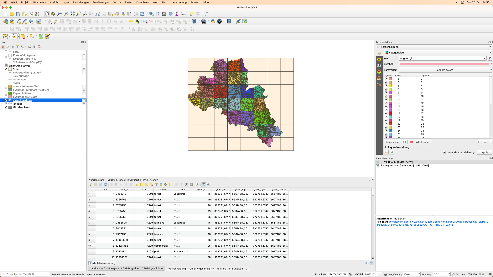

Abbildung 8.34b - Ausgewählte Grünflächen.


Abbildung 8.34c - Grünflächen und bebaute Flächen.

Berechnen Sie als nächstes die Fläche, die von jedem Merkmal der 2 Layer eingenommen wird. Gehen Sie in die Attributtabelle jedes Layers und fügen Sie dann die geometrische Spalte Fläche hinzu, indem Sie den Ausdruck `round($area,2) ` in den Feldrechner einfügen.  (siehe Modul 6 für Details, falls erforderlich). Das 10X10km-Gitter hat jedoch eine bekannte Anzahl von Gitterzellen, und zwar 56. Daher müssen wir die Flächen für alle Arten von Grünflächen (Wälder, Parks etc.) und bebauten Flächen (Gewerbe, Wohnen etc.) zusammenfassen und entsprechend zu allen 56 Gitterzellen verbinden. Dazu werden wir das Plugin **GroupStats** verwenden, um für jede grid_id alle Grünkategorien bzw. alle bebauten Kategorien zusammenzufassen. Für den Layer grünflächen-gitter stellen Sie die Parameter wie in Abbildung 8.34e ein. 

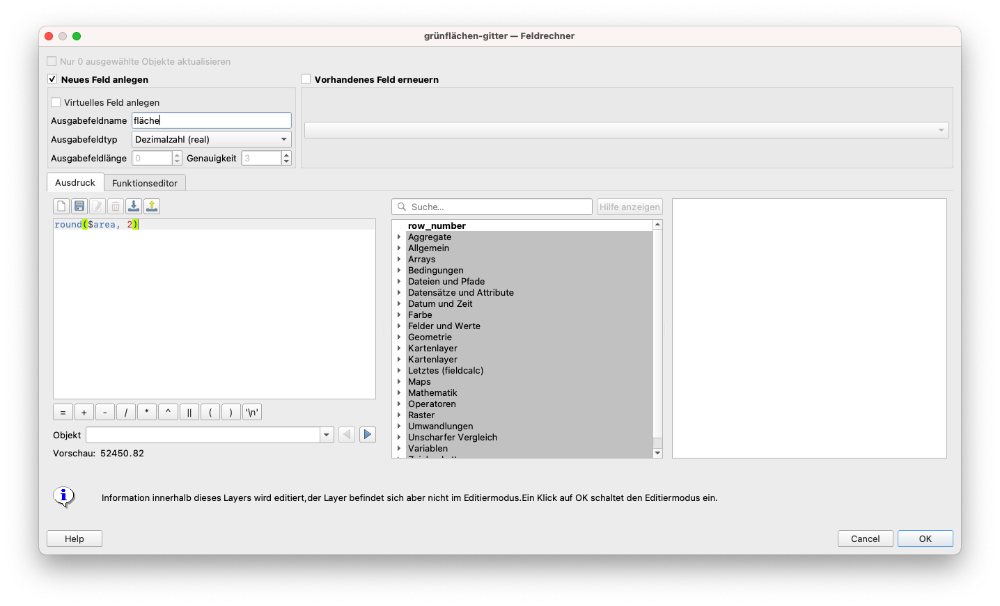

Abbildung 8.34d - Berechnung der Fläche jedes Objekts.

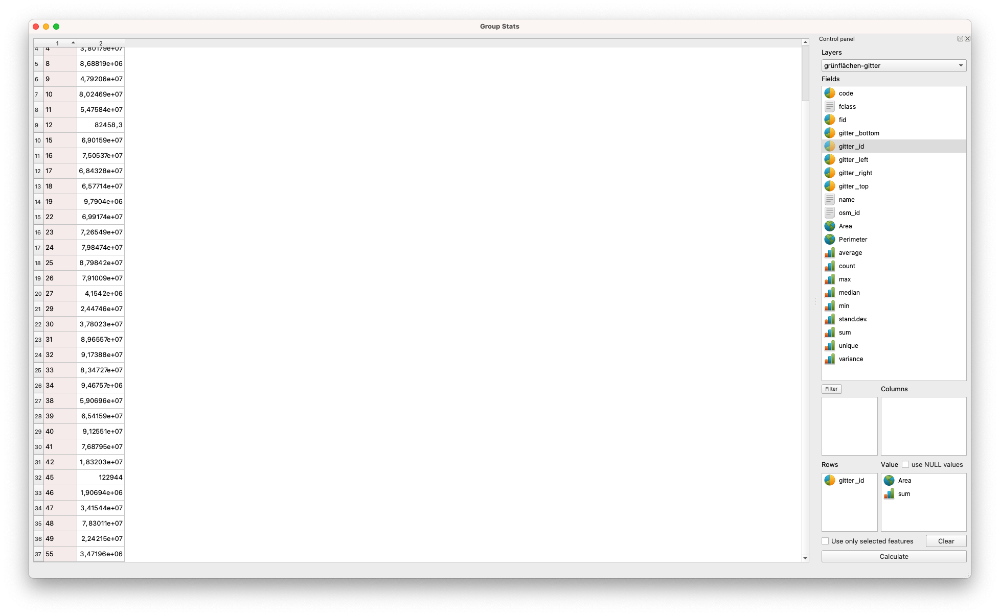

Abbildung 8.34e - GroupStat-Parameter zum Aufsummieren der Grünflächen pro jede 10X10km-Zelle

Speichern Sie anschließend die Ergebnisse als .csv-Datei mit dem Namen "grünflächen-gitter". Gehen Sie zu **Data ‣ Save all to CSV file.**

Führen Sie GroupStats für die bebaute Fläche auf die gleiche Weise aus und speichern Sie die Ergebnisse als CSV-Datei unter dem Namen "bebaute-flächen-gitter".

Als nächstes bringen wir die 2 mit GroupStat berechneten csv-Dateien in QGIS (**Layer ‣ Layer hinzufügen ‣ Getrennte Textdatei als Layer hinzufügen** - siehe mehr Details in Modul 2). 


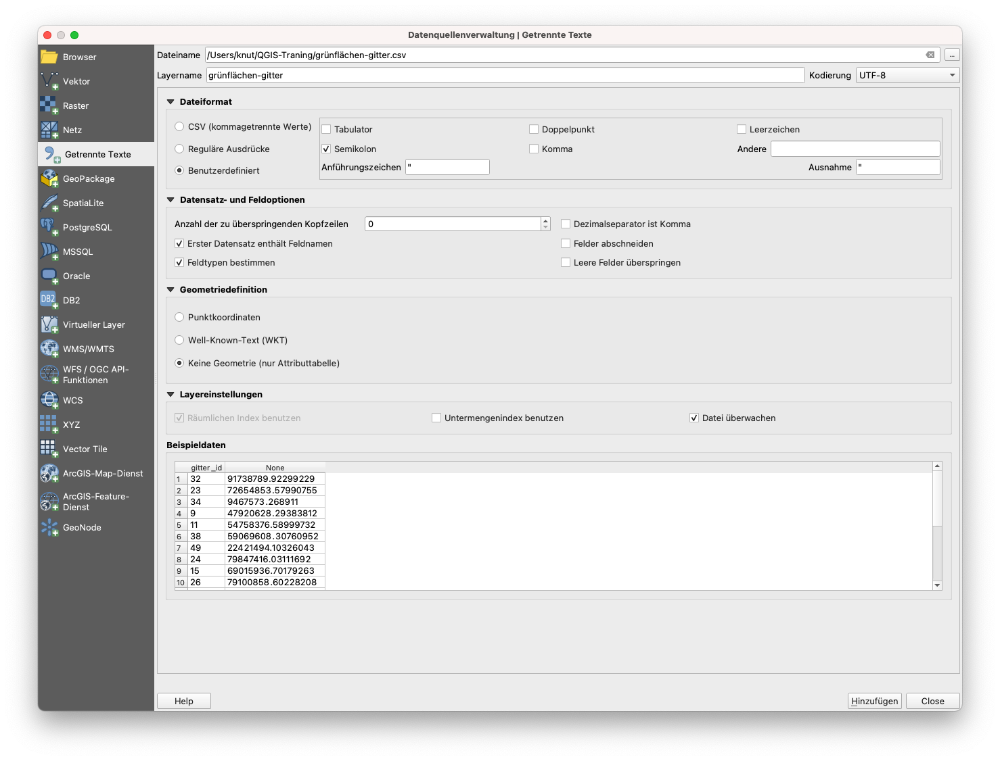

Abbildung 8.35a - Laden von grünflächen-gitter.csv


Abbildung 8.35b - Die grünflächen-gitter CSV Attributtabelle

Als nächstes müssen wir die berechneten Flächen - grün und bebaut - mit jedem 10X10 km-Zellenraster verbinden. Wählen Sie dazu den Gitter -Layer, öffnen Sie das Eigenschaftsfenster und gehen Sie auf **Verbindungen**. Diese Funktionalität erlaubt es Ihnen, über ein gemeinsames Attributfeld, andere zu verbinden. In unserem Fall werden wir über den gemeinsamen grid_id-Wert die Summe der bebauten Flächen und der Grünflächen aus den 2 csv-Dateien verbinden, die wir im vorherigen Schritt erhalten haben.

Klicken Sie im Fenster **Verknüpfungen** auf die grüne Plus-Schaltfläche  und stellen Sie die Parameter wie in Abbildung 8.35, für Grünflächen, ein.


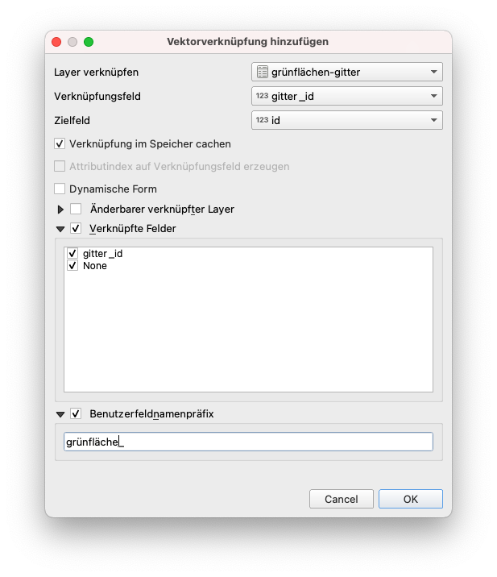

Abbildung 8.35c - Einstellungen um über eine Verkünpfung der Felder grid_id und id die Grünflächngröße zu den Gitterzellen hinzuzufügen

Wiederholen Sie den Vorgang für bebaute Flächen. 

Die Ergebnisse der beiden Verknüpfungen sind in der Attributtabelle sichtbar, wie in Abbildung 8.36_b zu sehen ist. Wir haben die grid_id in beiden Joins beibehalten, um sicherzugehen, dass keine Fehler aufgetreten sind. Wir können visuell schnell überprüfen, ob die 3 Attributfelder: id, grünflächen_id und bebaute-flächen_id genau gleich sind. 


Abbildung 8.36a - Verknüpfungseinstellungen


Abbildung 8.36b - Flächen in der Gitter-Attributtabelle 


Da wir alle benötigten Informationen für Grün- und bebaute Flächen in der Attributtabelle des Gitter-Layers gesammelt haben, müssen wir nur noch den prozentualen Anteil dieser Flächen innerhalb der 10X10 km Rasterzelle berechnen. Wir berechnen ihn mit Hilfe des Feldrechners, indem wir folgenden Ausdruck verwenden: `round("grünfläche_None" / (10 * 1000 * 10 * 1000), 2)` und `round("bebaute-fläche_None" / (10 * 1000 * 10 * 1000), 2)` Als nächstes fügen wir ein neues Feld hinzu, in dem wir den Bericht der Grünfläche/Bebauungsfläche berechnen und so die Antwort auf unsere Anfrage erreichen: Grünflächen (Parks, Wälder) bebaute Fläche pro Einheitsverhältnis. An sich könnten wir das erreichen mit `round("grünfläche_prozent" / "bebaute-fläche_prozent" , 5). Um einen klaren Überblick über unseren Datensatz zu haben, fügen wir in den Fällen, in denen es keine bebaute Fläche in der Gitterzelle gibt, den Wert 1000 in die Attributtabelle ein, in den Fällen, in denen es keine Grünfläche gibt, fügen wir den Wert 999 ein, während wir im Falle, dass beide Werte NULL sind, 1001 einfügen.  Hierfür können wir den Ausdruck verwenden:

```
CASE 
WHEN ("grünflächen_prozent" is NULL) and ("bebaute-fläche_prozent" is not NULL) then 999
WHEN ("bebaute-fläche_prozent" is NULL) and ("grünflächen_prozent" is not NULL) then 1000
WHEN ("grünflächen_prozent" is NULL) and ("bebaute-fläche_prozent" is NULL) then 1001
ELSE round("grünflächen_prozent" / "bebaute-fläche_prozent", 5)
END
```

Das Endergebnis würde wie in Abbildung 8.37e aussehen. 


Abbildung 8.37a - Prozentualer Anteil der Grünfläche im 10km x 10km-Raster


Abbildung 8.37c - Berechnung für das Verhältnis von Grün- und bebauter Fläche


Abbildung 8.37d - Berechnetes Verhältnis von Grün- und bebauter Fläche


Abbildung 8.37e - Verhältnis von Grünflächen und bebauten Flächen im 10km x 10km-Raster


#### 2. Gesamtlänge der Straßen und Wasserwege für jede Einheit;

Um diese Aufgabe zu erfüllen, bietet QGIS einen Algorithmus, der einen Polygon-Layer und einen Linien-Layer nimmt und die Gesamtlänge der Linien und die Gesamtzahl der Linien, die jedes Polygon durchqueren, misst. Der resultierende Layer hat die gleichen Eigenschaften wie der Eingabe-Polygon-Layer, aber mit zwei zusätzlichen Attributen, die die Länge und Anzahl der Linien über jedes Polygon enthalten. Gehen Sie zu **Vektor - Analyse-Werkzeuge - Linienlängen summieren** und stellen Sie die Parameter wie folgt ein: 
- Polygone - Gitter
- Linien - roads
- Linienlänge Feldname - roads_laenge
- Linienanzahl Feldname - roads_anzahl

Sie können einen temporären Layer erstellen oder ihn als Datei auf Ihrem Computer speichern. Sie können außerdem die Stilisierungsparameter aus Abbildung 8.38c übernehmen, um die gleiche Kartenansicht zu erhalten. 


Abbildung 8.38a - Parameter für "Linienlängen summieren"


Abbildung 8.38b - Straßenlänge- und anzahl pro Gitterzelle


Abbildung 8.38c - Räumliche Verteilung der Straßenkilometer

Dieses Vorgehen können Sie nun analog für die Wasserwege wiederholen.

#### 3. Gesamtzahl der öffentlichen Gebäude (Schulen, Kindergärten, Krankenhäuser, Rathäuser usw.) für jede Gitterzelle

Um die Gesamtzahl der öffentlichen Gebäude in der 10X10-Einheit zu zählen, verwenden wir pois-bereinigt. Zuerst führen wir **Vektor ‣ Analyse-Werkzeuge ‣ Eindeutige Werte auflisten..** aus und entscheiden, welche Gebäude wir als öffentlich betrachten. Wir wählen aus unserem Vektorpunkt-Daten-Layer (pois) die folgenden Merkmale aus: `"fclass" in ('optician','college','swimming_pool','arts_centre','library','school','courthouse','university','sports_centre','museum','fire_station','kindergarten','post_office','community_centre','nursing_home','biergarten','town_hall','dentist','observation_tower','tourist_info','hospital','theatre','doctors','public_building','police')`. Wenn Sie möchten, können Sie natürlich auch eine andere Auswahl wählen. Wählen sie die gezeigt Auswahl sollten, insgesamt 3442 markiert werden. 


Abbildung 8.40a - Auswählen von öffentlichen POIs


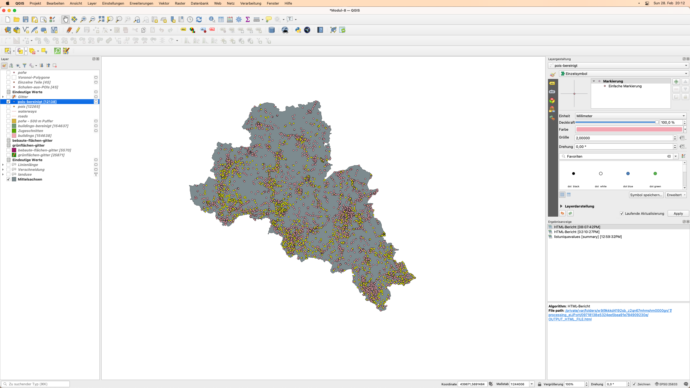

Abbildung 8.40b - Ausgewählte öffentliche POIS

Um unsere Anfrage zu beantworten, verwenden wir den Algorithmus **Vektor ‣ Analyse-Werkzeuge ‣ Punkte in Polygon zählen**. Dieser Algorithmus nimmt einen Punkte-Layer und einen Polygon-Layer und zählt die Anzahl der Punkte aus dem ersten Layer in jedem Polygon des zweiten Layers. Es wird ein neuer Layer "Polygone" erzeugt, der genau den gleichen Inhalt hat wie der eingegebene Layer "Polygone", aber ein zusätzliches Feld mit der Anzahl der Punkte für jedes Polygon enthält. Setzen Sie den Layer für die Punkte auf pois-bereinigt und den Layer für das Gitter auf den dafür erzeugten Layer. Aktivieren Sie für die Punkte das Kontrollkästchen **Nur gewählte Symbole**, damit der Algorithmus nur die ausgewählten Punkte - die öffentlichen POIs - berechnet. Speichern Sie die Ausgabedatei als grid_info. 


Abbildung 8.40c - Anzahl öffentlicher POIS in jeder 10kmx10km Zelle


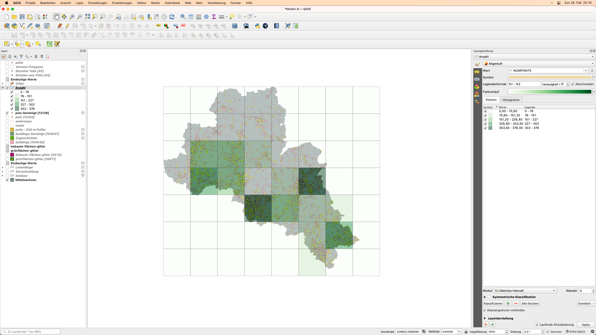


Abbildung 8.40d - Räumliche Verteilung öffentlicher POIs pro 10X10km Zelle


#### **Quizfragen**

F: Wenn ich 2 Vektor-Layer habe - einer repräsentiert die Ausdehnung der Stadt, in der ich arbeite, und der zweite die bebauten Straßen im gesamten Land - welches Verarbeitungswerkzeug würde ich verwenden, um nur die Straßen in meiner Stadt zu extrahieren: Puffer oder Zuschneiden? 

A: Zuschneiden

Q. Ist das Puffer-Werkzeug in folgendem Fall nützlich: Ich habe einen Polygon-Vektor-Layer mit historischen Denkmälern in meiner Region und möchte einen 50m-Schutzbereich um sie herum ziehen? 

A: Ja

F: Welches der drei Geoprozessierungswerkzeuge würden Sie verwenden, um zwei ähnliche Vektor-Layer zu verschmelzen? Voronoi-Polygone, Auflösen, Zuschneiden? 

A: Auflösen


### Teil 3: Geostatistik. Interpolation - Schätzung fehlender Daten

Der letzte Teil des Moduls Vektordaten führt in das Konzept der Datenschätzung ein. Wir sind es gewohnt, fast täglich Schätzungen zu verschiedenen Themen vorzunehmen, z. B. wie viel Zeit wir unter bestimmten Bedingungen für den Weg von zu Hause zur Arbeit benötigen. Wir sind es gewohnt, unsere beste Schätzung abzugeben, basierend auf früheren Erfahrungen und Vermutungen. Bei der Schätzung fehlender Daten wird die beste Schätzung jedoch durch sehr gut definierte mathematische Gleichungen mit bekannten Einschränkungen ersetzt. 

Das Thema erfordert erhebliche Kenntnisse in Statistik und die Ergebnisse sollten immer im Lichte ihrer Einschränkungen betrachtet werden. 

In diesem Sinne stellen wir ein kurzes Beispiel für die Datenschätzung vor, das den Übergang zum nächsten Modul - der Rasterdatenverarbeitung - bildet. 

**Interpolation** ist ein mathematischer Prozess, durch den man die fehlenden Werte auf der Grundlage einer begrenzten Anzahl von vorhandenen Werten schätzen kann. Und solche Situationen sind häufig - stellen Sie sich meteorologische Daten vor. Daten über Oberflächentemperaturen und darüber, wie viel Regen gefallen ist, können nur an bestimmten Punkten an kalibrierten Meteostationen gemessen werden, und nicht auf der gesamten Fläche. Auf den Karten, die wir im Wetterbericht sehen, gibt es jedoch keine "blinden Flecken" ohne Temperaturen. Daher werden die restlichen Werte durch Interpolation gewonnen. 
Die Annahme, auf der die Interpolation basiert, ist, dass räumlich verteilte Objekte räumlich korreliert sind; mit anderen Worten, Dinge, die nahe beieinander liegen, neigen dazu, ähnliche Eigenschaften zu haben. 

Es gibt viele Interpolationsmethoden, die in GIS-Software implementiert sind. Die Entscheidung, welche in jedem einzelnen Fall die beste ist, hängt von der Spezifität der Daten ab, was sie repräsentieren und vom geostatistischen Verständnis der Person, die Interpolation durchführt. 

Um schnell zu prüfen, welche Interpolationsmethoden in QGIS zur Verfügung stehen, gehen Sie in die Verarbeitungswerkzeuge und geben Sie in die Suchleiste das Stichwort Interpolation ein. Das Ergebnis sollte wie in Abbildung 8.41 aussehen. 


Abbildung 8.41 - In QGIS verfügbare Interpolationsmethoden


Wie zu sehen ist, biete QGIS auch Zugang zu anderen Algorithmen, die in GRASS oder SAGA implementiert sind.

Es würde den Rahmen dieses Moduls sprengen, auf die mathematischen Grundlagen der einzelnen Interpolationsalgorithmen einzugehen. Zu Demonstrationszwecken werden wir jedoch die Interpolation von Niederschlagsdaten simulieren, um einen nahtlosen Datensatz über die Menge der gefallenen Niederschläge in unserem Betrachtungsgebiet zu erhalten. 

Da die Übung nur zu Demonstrationszwecken dient, werden wir unseren eigenen Satz von Punktdaten erstellen - um die Meteostationen darzustellen, an denen Niederschlagswerte im Laufe einer Woche registriert wurden. 

Der erste Schritt ist also die Erstellung eines neuen Punk-Vektor Layers mit zufällig zugewiesenen Punkten innerhalb Mittelsachsen. Dazu gibt es mehrere Möglichkeiten, entweder mit dem Algorithmus **Zufällige Punkte in Polygonen..** oder mit dem Algorithmus **Zufällige Punkte in den Layergrenzen..**. Gehen Sie zu **Vektor ‣ Forschungswerkzeuge ‣ Zufällige Punkte in Polygonen...**. Sie können den Algorithmus auch in der Symbolleiste Verarbeitung oder in der Suchleiste suchen. Wählen Sie als Parameter: 
* 93 Punkte
* mindestens 5 km.

Die Einstellungen sollte wie in Abbildung 8.42 aussehen. 


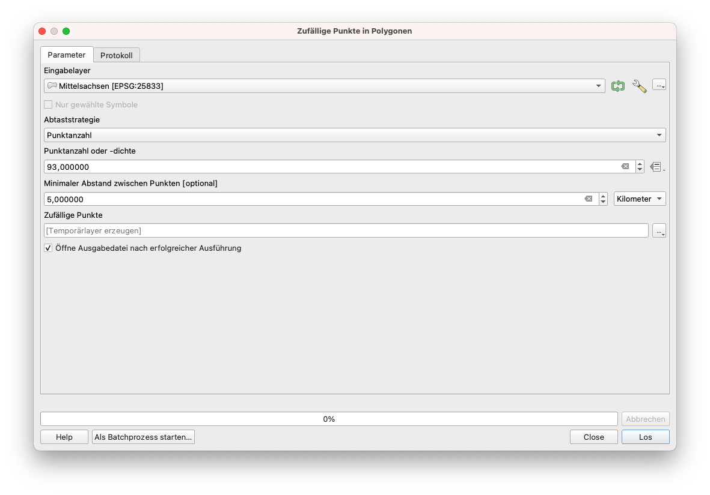

Abbildung 8.42 - Erzeugen von Zufallspunkten innerhalb eines Polygon-Layers


Der resultierende Punkt-Layer sieht ungefähr so aus wie in Abbildung 8.43.


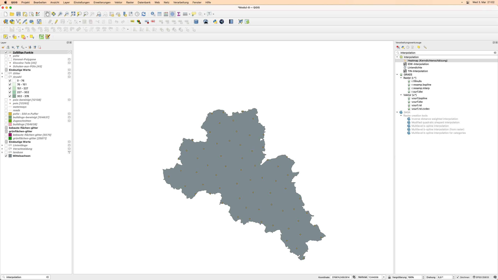

Abbildung 8.43 - Punktdaten-Layer - zufällig innerhalb der angegebenen Polygone erzeugt

Da wir nun unsere imaginären Wetterstationen haben, werden wir fiktive Messungen in einem Zeitrahmen von 7 Tagen hinzufügen. 

Dazu können wir die von QGIS bereitgestellte Zufallsfunktion verwenden. Öffnen Sie die Attributtabelle des erstellten Punktdaten-Layers und öffnen Sie den Feldrechner. Fügen Sie in ein neu angelegtes Feld (Ganze Zahl) die folgende Formel rand(min, max) ein, wobei min und max durch das folgende Zahlenpaar für die entsprechenden 7 Tage ersetzt werden (siehe Abbildung 8.44):

1. 0 - 59;
2. 2 - 35;
3. 10 - 45;
4. 0 - 21;
5. 5 - 63;
6. 0 - 10;
7. 0 - 21. 


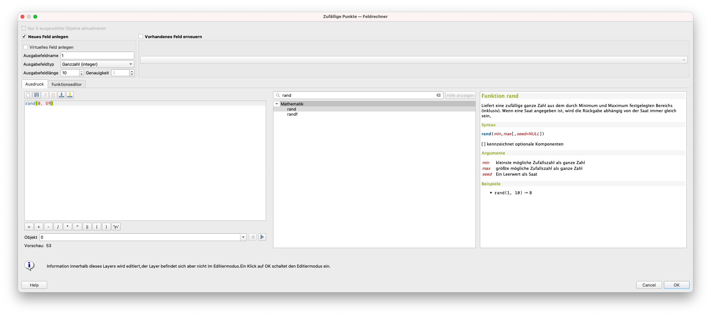

Abbildung 8.44 - Erzeugen von Zufallswerten innerhalb vorgegebener Grenzen

Nachdem Sie alle 7 Spalten hinzugefügt haben, sollte Ihre Attributtabelle wie in Abbildung 8.45 aussehen. 


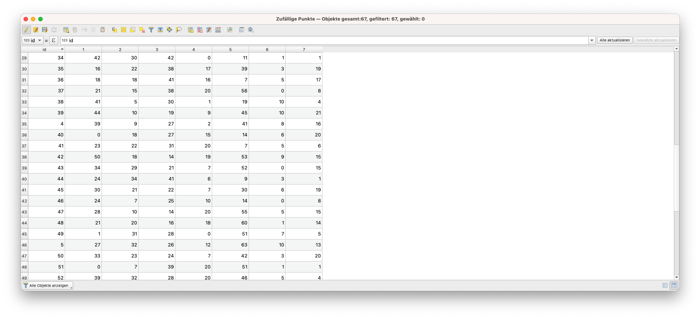

Abbildung 8.45 - Fiktive Nierderschlagsmengen in der Attributtabelle

Als nächstes werden wir diese Werte für jeden der 7 Tage interpolieren, um einen nahtlosen Layer zu erhalten, der das gesamte Gebiet abdeckt. Da es sich um einen sich wiederholenden Vorgang handelt, werden wir eine Stapelverabeitung verwenden. Die gewählte Interpolationsmethode, die - rein zu Demonstrationszwecken! - ist IDW - invers abstandsgewichtet. Sie finden diese, indem Sie in den Verarbeitungswerkzeugen nach IDW suchen und dann per Rechtsklick den Stapelprozess auswählen

Stellen Sie die folgenden Parameter ein: 
* Abstandskoeffizient: 2
* Ausdehnung: Mittelsachsen
* Größe des Ausgaberasters: 50. 

Ihre Parameter sollten wie in der folgenden Abbildung 8.46 aussehen.


Abbildung 8.46 - Einstellungen im Stapelverarbeitungsfensters zur Interpolation der Niederschlagswerte für alle 7 Tage

Das Interpolationsergebnis sieht ungefähr so aus wie in Abbildung 8.47. 


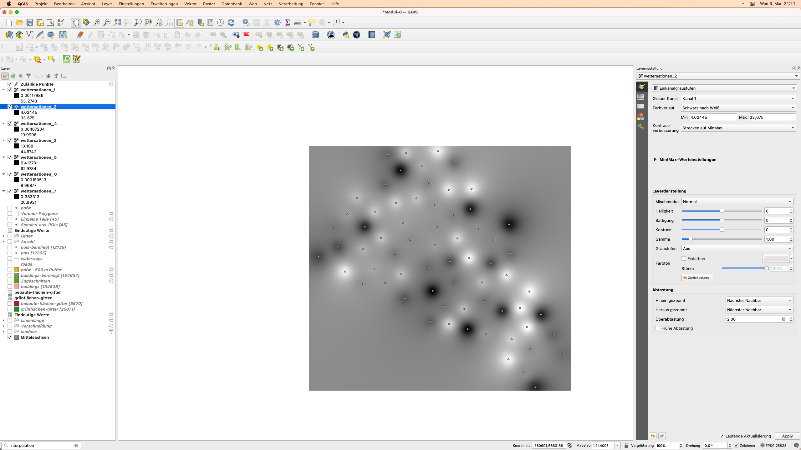

Abbildung 8.47 - Interpolierte Datensätze

Die Wetterstationen sind in der Kartenansicht sichtbar und in der Layerliste sehen Sie alle 7 neu erstellten Rasterdatensätze, die die Niederschlagswerte für jeden Tag darstellen. Sollten die Daten nicht automatisch geladen worden sein, könenn Sie diese wie gewohnt als Layer hinzufügen.

Als nächstes ändern wir die Symbologie der 7 Layer auf eine buntere (**Eigenschaften ‣ Symbolisierung ‣ Einkanalpseudofarbe ‣ Magma**). 

Betrachtet man die Punktdaten und die daraus erstellten Rasterdatensätze, so stellt man fest, dass man nun Werte für die gesamte Region hat und nicht nur am gemessenen Ort. Es gibt viele Verarbeitungsalgorithmen, die auf diese Raster angewendet werden können, um Informationen zu extrahieren, aber dazu mehr im nächsten Modul - Verarbeitung und Visualisierung von Rasterdaten.  

Da wir jedoch Werte für 7 Tage interpoliert haben, wollen wir eine kurze Animation vorbereiten, wie sich die Niederschlagswerte entwickelt haben. 

Öffnen Sie dazu die **Eigenschaften des Rasters wetterstationen_1 ‣ klicken Sie auf die Registerkarte Zeitlich ‣ markieren Sie die Option Zeitlich ‣ wählen Sie Start- und Enddatum**, wie in Abbildung 8.48. Führen Sie das gleiche für alle 7 Raterlayer - jeweils um einen Tag verschoben - durch.

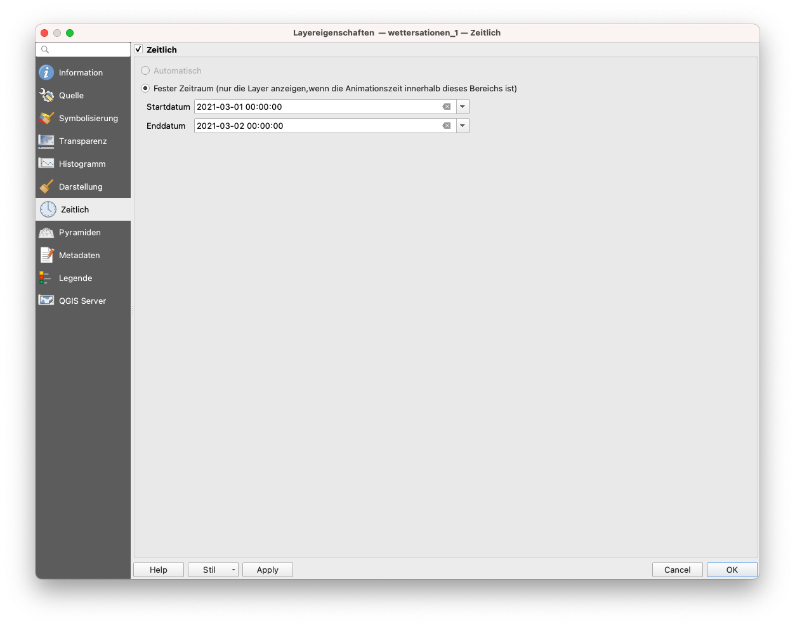

Abbildung 8.48 - Einstellen der zeitlichen Informationen zum Rasterdatensatz


Öffnen Sie das Bedienfeld "Zeitsteuerung" (zu finden in **Ansicht ‣ Bedienfelder ‣ Zeitsteuerung**) und stellen Sie die Parameter wie in Abbildung 8.49 ein. 


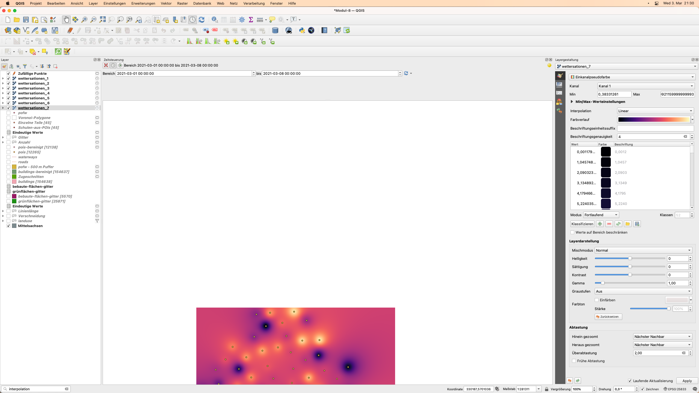

Abbildung 8.49 - Einstellen der Parameter des Zeitsteuerungsfeldes. 

Klicken Sie auf den Play-Button  und schauen Sie sich an, wie sich die Werte ändern. Sie können auswählen, welche anderen Layer sichtbar sein sollen. In Abbildung 8.50 haben wir den Gebäude-Vektor-Layer hinzugefügt. 

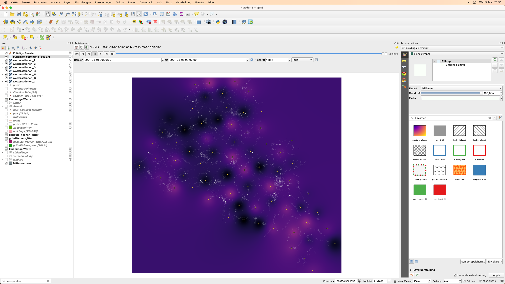

Abbildung 8.50 - Auswählen von anderen Layern, die in der zeitlichen Animation sichtbar sein sollen.


##### Quizfragen

1. Gibt es nur einen Algorithmus zur Interpolation von Daten in QGIS oder mehrere?

  * Es sind mehrere Algorithmen implementiert.

2. Wozu ist die Interpolation nützlich?

  * Interpolation ist nützlich, um Daten auf der Grundlage bekannter Daten zu schätzen.
