# **Modul 9 - Rasterverarbeitung und -analyse**

**Autor**: Codrina
**Übersetzung**: Knut Hühne

## Pädagogische Einführung

Dieses Modul konzentriert sich auf einen bestimmten Typ von geographischen Datenmodellen: Raster-Geodaten.

Am Ende dieses Moduls werden die Lernenden ein grundlegendes Verständnis für die folgenden Konzepte haben:

* Rasterdatenmodell
* Rasterpunkt vs. Rasterzelle
* Bänder eines Rasterdatensatzes
* Kartenalgebra 
* die vier Auflösungen eines Rasters (räumlich, zeitlich, spektral und radiometrisch)
* Resampling
* Stapelverarbeitung
* Änderungserkennung


## Erforderliche Werkzeuge und Ressourcen

* Dieses Modul wurde mit [QGIS Version 3.16 - Hannover](https://qgis.org/en/site/forusers/download.html) erstellt.
* [Modul-9.gpkg](data/Modul-9.gpkg)
    * Mittelsachsen
* [High Resolution Settlement Layer](data/HRSL_Mittelsachsen.tif)
* [SRTM Digital Elevation Model](data/SRTM_DEM)
* [Globale Landbedeckungskarte 2015-2019](data/Global_Land_Cover_Map)
* Das verwendete Koordinatenreferenzsystem ist das WGS84 / UTM33 EPSG 25833. 

## Voraussetzungen: 

* Grundkenntnisse in der Bedienung eines Computers
* Ein solides Verständnis der Module 0, 1, 2, 6 und 8 dieses Lehrplans. 


## Thematische Einführung

## Gliederung der Konzepte

### Das Rasterdatenmodell

Ein Raster ist eine regelmäßige Matrix von Werten, wie in Abbildung 9.1.


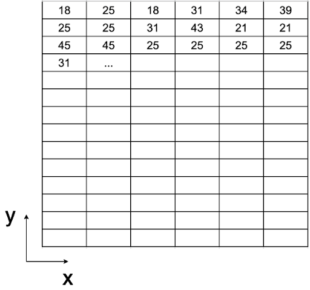

Abbildung 9.1 - Eine Matrix von Werten

Die Werte können **Rasterpunkten**, meist den Zentroiden, zugeordnet werden, in diesem Fall kann das Raster als Gitter bezeichnet werden. Die zweite Möglichkeit ist, dass die Werte der gesamten **Rasterzelle** - genannt Pixel - zugeordnet werden (siehe Abbildung 9.2). Für den ersten Fall stellt das Raster normalerweise ein kontinuierliches Feld dar, wie z. B. Höhe, Temperatur, Niederschläge, chemische Konzentrationen usw. Für den zweiten Fall, wenn die Werte dem gesamten Bereich des Pixels zugeordnet sind, repräsentiert das Raster normalerweise ein Bild - ein Satellitenbild, eine gescannte Karte, konvertierte Vektorkarten (siehe Teil 2). Es ist zu beachten, dass dieses Datenmodell für Netzwerke und andere stark linienabhängige Datentypen, wie z. B. Grundstücksgrenzen, nicht besonders effizient ist. 


Abbildung 9.2 - Auf der linken Seite werden die Werte Zentroiden zugewiesen. Auf der rechten Seite werden die Werte dem Bereich der Gitterzelle - dem Pixel - zugewiesen.			


### Funktionsweise der Rasterverarbeitung

Wie im Fall der Vektordatenverarbeitung basiert die Rasterdatenverarbeitung auf der gleichen Fähigkeit der geografischen Informationssysteme, Informationen der realen Weltphänomene zu speichern, zu verarbeiten und darzustellen, nur dass die Art und Weise, wie dies geschieht, unterschiedlich ist. Anstatt eindeutige Punkte, Linien und Polygone als Sammlungen von x- und y-Koordinaten zu speichern, haben wir eine Matrix von Werten, die sich wie ein Netz über ein bestimmtes Gebiet zieht. Um ein deutlicheres Bild vor Augen zu haben, stellen Sie sich die Temperaturkarten vor, die im Fernsehen gezeigt werden. Die Temperatur ist ein kontinuierliches Feld, es gibt keinen Ort auf der Erdoberfläche ohne Temperatur, sei sie positiv, negativ oder 0.

Auf Rasterdatensätzen können viele Operationen durchgeführt werden, das in Modul 8 erläuterte Konzept des Geoverarbeitung gilt auch hier. Der Begriff für die Operationen, die auf Rastern durchgeführt werden können, lautet _Kartenalgebra_. 

**Kartenalgebra** stellt eine Reihe von primitiven Operationen[^1] in einem GIS dar, die es ermöglichen, aus zwei oder mehr Raster-Layern mit _ähnlichen Abmessungen_ einen neuen Raster-Layer (Karte) zu erzeugen, indem verschiedene Operationen wie Addition, Subtraktion, Vergleich usw. durchgeführt werden.  

Es gibt vier Kategorien von Operationen, die auf Rastern durchgeführt werden können, wie folgt: 

* Arithmetische Operationen: Addition, Subtraktion, Multiplikation, Division.
* Statistische Operationen: Minimum, Maximum, Durchschnitt, Median.
* Relationale Operationen: Vergleiche zwischen Zellen mit Funktionen wie größer als, kleiner als oder gleich.
* Trigonometrische Operationen: Sinus, Kosinus, Tangens, Arcussinus zwischen zwei oder mehreren Rasterdatensätzen.
* Exponentielle und logarithmische Operationen verwenden Exponent- und Logarithmusfunktionen.

Für jede dieser Operationen gibt es Algorithmen, die in den meisten GIS-Umgebungen implementiert sind und auf Daten im GIS angewandt werden können. Im Folgenden werden wir einige der gebräuchlichsten Operationen nutzen, um ein Gefühl dafür zu bekommen, wie man damit arbeitet und was man von dieser Art der Datenverarbeitung erwarten sollte. 

Das Konzept der _ähnlichen Dimensionen_ bezieht sich auf die Eigenschaften der Rasterdatensätze. Das heißt, die oben beschriebenen Operationen können nicht mit sinnvollen Ergebnissen auf 2 Rasterdatensätzen mit unterschiedlicher räumlicher, zeitlicher oder spektraler Auflösung durchgeführt werden. Im Folgenden werden wir alle vier Auflösungen, die für Rasterbilder relevant sind, sehr kurz vorstellen.

Zur Erinnerung: Es gibt 4 Arten von Auflösungen eines Satellitenbildes (Raster mit Werten, die einer Zellfläche - Pixeln - zugeordnet sind): 

1. **Die räumliche Auflösung** entspricht der elementaren Größe der gemessenen Bodenoberfläche, sie wird in Längeneinheiten ausgedrückt und stellt die Länge einer Pixelseite dar (siehe Abbildung 9.3). Wie Sie zum Beispiel in Modul 3 gesehen haben, haben die High Resolution Settlement Layer Daten eine räumliche Auflösung von 30 Metern, d.h. jeder Pixel des Datensatzes schätzt die Anzahl der Menschen, die innerhalb eines 30x30-Meter-Bereichs leben. 

2. **Die zeitliche Auflösung** steht in Verbindung mit Ortophotos (Bilder, die von Satelliten, Flugzeugen, Hubschraubern oder Drohnen aufgenommen wurden) und entspricht dem Zeitraum zwischen zwei aufeinanderfolgenden Bildern des exakt gleichen Punktes auf der Erde, die unter den gleichen Bedingungen (so weit wie möglich) aufgenommen wurden, wie z. B. dem gleichen Flugzeug, der gleichen Höhe usw. Zum Beispiel hat Landsat 8 eine zeitliche Auflösung von 16 Tagen, d.h. jeder Punkt auf der Erde wird alle 16 Tage vom Landsat 8-Satelliten überflogen[^2]. 

3. **Die spektrale Auflösung** - die Sensoren an Bord von Satelliten oder Flugzeugen erfassen die elektromagnetische Strahlung, die von allen Objekten auf der Erde ausgeht - Wasser, Siedlungen, Wälder, Straßen, Gebäude, freies Land usw. Die Sensoren sind dabei speziell dafür gebaut, sie in einem bestimmten bekannten Spektralband (einer Wellenlänge) zu erfassen. Das menschliche Auge kann einen sehr kleinen Teil des elektromagnetischen Spektrums sehen - das sichtbare Licht (rot, grün und blau), aber Sensoren können viel mehr "sehen". (siehe Abbildung 9.4)


)](media/fig94.png)

Abbildung 9.4 - Elektromagnetisches Spektrum (Bildnachweis NASA Science - [https://science.nasa.gov/ems/01_intro](https://science.nasa.gov/ems/01_intro))

4. **Die radiometrische Auflösung** wird durch die Anzahl der Bits bestimmt, in die die aufgenommene Strahlung unterteilt wird. Bei 8-Bit-Daten können die digitalen Zahlen für jedes Pixel von 0 bis 255 reichen. Dabei bedeuten mehr Bits, dass der Sensor feinere Veränderungen in der erfassten Energie erkennen kann, was zu einem "klareren" Bild und einer höheren radiometrischen Genauigkeit des Sensors führt - aber auch mehr Platz zum Speichern der Daten benötigt. 

**Spektralbänder**

Ein Rasterdatensatz enthält einen oder mehrere Layer, die Bänder genannt werden. Jedes Band speichert einen anderen Satz von Informationen über den Bereich, den das Raster abdeckt. Jedes Band hat die exakt gleiche Ausdehnung und die gleichen Koordinaten, aber nicht unbedingt die gleiche räumliche Auflösung. Außerdem sind neben den gespeicherten Werten weitere Schlüsseleigenschaften enthalten, wie z. B.: maximale, minimale und mittlere Zellenwerte und _Histogramm_ der Zellenwerte. 

Ein **Histogramm** ist eine ungefähre Darstellung der Verteilung von numerischen Daten (siehe Abbildung 9.5), also eine Art und Weise, wie man sich ein Bild von den vorliegenden Daten machen kann.


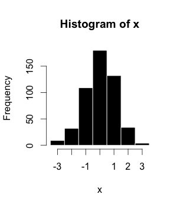

Abbildung 9.5 - Beispiel für ein Histogramm, bei dem x ein Raster Layer ist

Warum ist dies in unserem Zusammenhang wichtig? Weil, wie eingangs erwähnt, ein Raster eine Matrix aus kontinuierlichen numerischen Werten ist (erinnern Sie sich an das Temperaturbeispiel) und ein Histogramm dem/der Anwender:in hilft zu verstehen, wie die Werte des Rasters verteilt sind. Jeder Balken gruppiert die Zellenwerte, die in einen bestimmten Bereich fallen, je höher der Balken, desto mehr Zellen haben Werte in diesem bestimmten Bereich. Falls das Raster mehr als einen Bereich hat, wird das Histogramm für jeden Bereich berechnet. Es gibt keine Lücken zwischen den in einem Histogramm dargestellten Bereichen, das Histogramm wird nur für kontinuierliche Daten verwendet.  


## Hauptinhalt 

### Teil 1: Verstehen Ihrer Rasterdaten.

In den letzten zwei Jahrzehnten ist die Anzahl der Satelliten, die Daten von der Erde erfassen, exponentiell gewachsen. Darüber hinaus hat die Politik des Offenen Daten, die von verschiedenen Weltraumbehörden wie der NASA für das [Landsat-Programm] (https://www.usgs.gov/core-science-systems/nli/landsat/landsat-data-access?qt-science_support_page_related_con=0#qt-science_support_page_related_con) oder der Europäischen Weltraumorganisation für das [Copernicus-Programm] (https://www.copernicus.eu/de/datenzugriff) eingeführt wurde, die Tür für einen überwältigenden Strom von Erdbeobachtungsdaten geöffnet. Davon motiviert ist der wissenschaftliche Fortschritt bei Algorithmen, Methoden und der Entwicklung leistungsfähigerer Werkzeuge zur Verarbeitung von Rasterdaten - insbesondere von Satellitenbildern - beeindruckend und weitreichend. Diese Fortschritte zeigen sich in Bereichen wie Land- und Forstwirtschaft, Stadtentwicklung, humanitäre Aktivitäten, Überwachung von Ozeanen und Meerwasser, Sicherheit und vielen weiteren. In den folgenden 3 Teilen stellen wir einige der gängigsten Verarbeitungstechniken vor und zeigen, welche Ergebnisse man von ihnen erwarten kann. 


#### **Schritt 1. Bereiten Sie Ihre Arbeitsumgebung vor.** 

Wir beginnen damit, dass wir alle Rasterdatensätze, mit denen wir arbeiten werden, zu Ihrem QGIS-Projekt hinzufügen, und zwar wie folgt: 

* High Resolution Settlement Layer Daten 
* Shuttle Radar Topography Mission (SRTM) Digitales Höhenmodell (DHM)
* Moderate Dynamic Land Cover: die 5 verfügbaren Epochen 2015, 2016, 2017, 2018 und 2019. 

Da die High Resolution Settlement Layer Daten in einem früheren Modul vorgestellt wurden, werden hier noch die Informationen für die zwei weiteren Datensätze ergänzen:

1. Shuttle Radar Topography Mission (SRTM) Digitales Höhenmodell (DHM) ist ein globales digitales Oberflächenmodell (DOM) mit einer horizontalen Auflösung von etwa 30 Metern (1 Bogensekunde). Ein DHM umfasst die Bodenoberfläche, die Vegetation und vom Menschen geschaffene Objekte wie Gebäude, Brücken usw. im Gegensatz zum digitalen Geländemodell (DGM), das ausschließlich das Gelände berücksichtigt. 

2. Dynamic Land Cover Map ist ein Copernicus Global Land Service (CGLS) Produkt, das aus der PROBA-V 100 m Zeitreihe und verschiedenen anderen Landbedeckungsdatensätzen abgeleitet wurde.  Das Produkt bietet primäre diskrete Landbedeckungsklassen sowie kontinuierliche Feld-Layer für alle grundlegenden Landbedeckungsklassen, die anteilige Schätzungen für die Vegetation/Bodenbedeckung für die Landbedeckungsarten liefern. Das Produkt hat 3 Bänder: discrete_classification, forest_type und urban_coverfraction. Die folgenden 2 Tabellen zeigen die Orginalbeschreibungen der Werte für jede diskrete Klasse: 

Tabelle 1 Discrete_classification Wertetabelle

<table>
  <tr>
   <td><strong>Value</strong>
   </td>
   <td><strong>Color</strong>
   </td>
   <td><strong>Description</strong>
   </td>
  </tr>
  <tr>
   <td>0
   </td>
   <td>282828
   </td>
   <td>Unknown. No or not enough satellite data available.
   </td>
  </tr>
  <tr>
   <td>20
   </td>
   <td>FFBB22
   </td>
   <td>Shrubs. Woody perennial plants with persistent and woody stems and without any defined main stem being less than 5 m tall. The shrub foliage can be either evergreen or deciduous.
   </td>
  </tr>
  <tr>
   <td>30
   </td>
   <td>FFFF4C
   </td>
   <td>Herbaceous vegetation. Plants without persistent stem or shoots above ground and lacking definite firm structure. Tree and shrub cover is less than 10 %.
   </td>
  </tr>
  <tr>
   <td>40
   </td>
   <td>F096FF
   </td>
   <td>Cultivated and managed vegetation / agriculture. Lands covered with temporary crops followed by harvest and a bare soil period (e.g., single and multiple cropping systems). Note that perennial woody crops will be classified as the appropriate forest or shrub land cover type.
   </td>
  </tr>
  <tr>
   <td>50
   </td>
   <td>FA0000
   </td>
   <td>Urban / built up. Land covered by buildings and other man-made structures.
   </td>
  </tr>
  <tr>
   <td>60
   </td>
   <td>B4B4B4
   </td>
   <td>Bare / sparse vegetation. Lands with exposed soil, sand, or rocks and never has more than 10 % vegetated cover during any time of the year.
   </td>
  </tr>
  <tr>
   <td>70
   </td>
   <td>F0F0F0
   </td>
   <td>Snow and ice. Lands under snow or ice cover throughout the year.
   </td>
  </tr>
  <tr>
   <td>80
   </td>
   <td>0032C8
   </td>
   <td>Permanent water bodies. Lakes, reservoirs, and rivers. Can be either fresh or salt-water bodies.
   </td>
  </tr>
  <tr>
   <td>90
   </td>
   <td>0096A0
   </td>
   <td>Herbaceous wetland. Lands with a permanent mixture of water and herbaceous or woody vegetation. The vegetation can be present in either salt, brackish, or fresh water.
   </td>
  </tr>
  <tr>
   <td>100
   </td>
   <td>FAE6A0
   </td>
   <td>Moss and lichen.
   </td>
  </tr>
  <tr>
   <td>111
   </td>
   <td>58481F
   </td>
   <td>Closed forest, evergreen needle leaf. Tree canopy >70 %, almost all needle leaf trees remain green all year. Canopy is never without green foliage.
   </td>
  </tr>
  <tr>
   <td>112
   </td>
   <td>9900
   </td>
   <td>Closed forest, evergreen broad leaf. Tree canopy >70 %, almost all broadleaf trees remain green year round. Canopy is never without green foliage.
   </td>
  </tr>
  <tr>
   <td>113
   </td>
   <td>70663E
   </td>
   <td>Closed forest, deciduous needle leaf. Tree canopy >70 %, consists of seasonal needle leaf tree communities with an annual cycle of leaf-on and leaf-off periods.
   </td>
  </tr>
  <tr>
   <td>114
   </td>
   <td>00CC00
   </td>
   <td>Closed forest, deciduous broad leaf. Tree canopy >70 %, consists of seasonal broadleaf tree communities with an annual cycle of leaf-on and leaf-off periods.
   </td>
  </tr>
  <tr>
   <td>115
   </td>
   <td>4E751F
   </td>
   <td>Closed forest, mixed.
   </td>
  </tr>
  <tr>
   <td>116
   </td>
   <td>7800
   </td>
   <td>Closed forest, not matching any of the other definitions.
   </td>
  </tr>
  <tr>
   <td>121
   </td>
   <td>666000
   </td>
   <td>Open forest, evergreen needle leaf. Top layer- trees 15-70 % and second layer- mixed of shrubs and grassland, almost all needle leaf trees remain green all year. Canopy is never without green foliage.
   </td>
  </tr>
  <tr>
   <td>122
   </td>
   <td>8DB400
   </td>
   <td>Open forest, evergreen broad leaf. Top layer- trees 15-70 % and second layer- mixed of shrubs and grassland, almost all broadleaf trees remain green year round. Canopy is never without green foliage.
   </td>
  </tr>
  <tr>
   <td>123
   </td>
   <td>8D7400
   </td>
   <td>Open forest, deciduous needle leaf. Top layer- trees 15-70 % and second layer- mixed of shrubs and grassland, consists of seasonal needle leaf tree communities with an annual cycle of leaf-on and leaf-off periods.
   </td>
  </tr>
  <tr>
   <td>124
   </td>
   <td>A0DC00
   </td>
   <td>Open forest, deciduous broad leaf. Top layer- trees 15-70 % and second layer- mixed of shrubs and grassland, consists of seasonal broadleaf tree communities with an annual cycle of leaf-on and leaf-off periods.
   </td>
  </tr>
  <tr>
   <td>125
   </td>
   <td>929900
   </td>
   <td>Open forest, mixed.
   </td>
  </tr>
  <tr>
   <td>126
   </td>
   <td>648C00
   </td>
   <td>Open forest, not matching any of the other definitions.
   </td>
  </tr>
  <tr>
   <td>200
   </td>
   <td>80
   </td>
   <td>Oceans, seas. Can be either fresh or salt-water bodies.
   </td>
  </tr>
</table>


Tabelle 2: forest_type Wertetabelle

<table>
  <tr>
   <td>Value
   </td>
   <td>Color
   </td>
   <td>Description
   </td>
  </tr>
  <tr>
   <td>0
   </td>
   <td>282828
   </td>
   <td>Unknown
   </td>
  </tr>
  <tr>
   <td>1
   </td>
   <td>666000
   </td>
   <td>Evergreen needle leaf
   </td>
  </tr>
  <tr>
   <td>2
   </td>
   <td>9900
   </td>
   <td>Evergreen broad leaf
   </td>
  </tr>
  <tr>
   <td>3
   </td>
   <td>70663E
   </td>
   <td>Deciduous needle leaf
   </td>
  </tr>
  <tr>
   <td>4
   </td>
   <td>A0DC00
   </td>
   <td>Deciduous broad leaf
   </td>
  </tr>
  <tr>
   <td>5
   </td>
   <td>929900
   </td>
   <td>Mix of forest types
   </td>
  </tr>
</table>


Um Ihre Layer besser zu organisieren, gruppieren Sie sie nach Kategorien, wie folgt: für die 5 Raster-Layer der Landbedeckung bilden Sie eine Gruppe mit dem Namen Landbedeckung (klicken Sie im Bedienfeld Layers auf die Schaltfläche Gruppe hinzufügen ). Für das digitale Oberflächenmodell erstellen Sie eine Gruppe mit dem Namen SRTM. 

Vergessen Sie nicht, auch die Grenze unseres Arbeitsbereichs, den Vektorlayer _Mittelsachsen_, hinzuzufügen.

Ihr QGIS-Kartenfenster sollte wie in Abbildung 9.6 aussehen. Die Farben können sich dabei wie immer unterscheiden. 


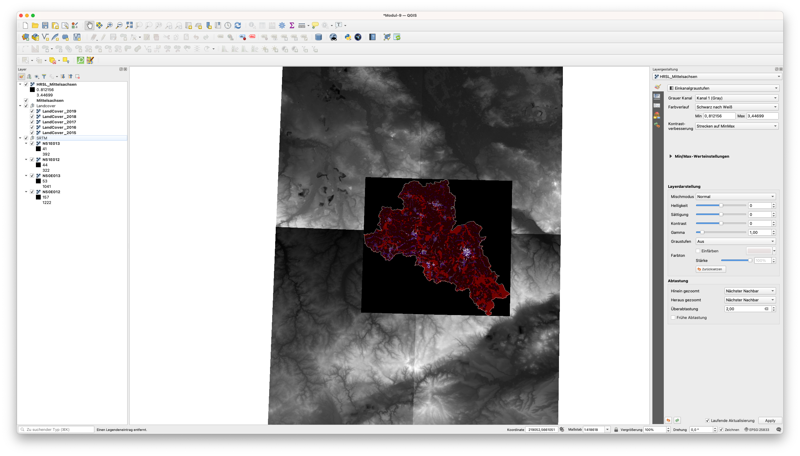

Abbildung 9.6 - Geladene Rasterdatensätze


#### **Schritt 2. Verstehen Sie, was Sie da sehen.** 

Als nächstes werden wir eine Reihe von Werkzeugen verwenden, die es uns ermöglichen, ein Gefühl für die Daten zu bekommen, mit denen wir arbeiten. 

Nachdem wir alle Datensätze geladen haben, werden wir das Koordinatenreferenzsystem überprüfen, in dem sich alle unsere Datensätze befinden.  Wie wir aus den vorangegangenen Modulen wissen, bietet QGIS die Möglichkeit, alle in das Projekt geladenen Datensätze "on the fly" umzuprojizieren, was jedoch zu Problemen bei der Geoverarbeitung führen kann. Selbst wenn also alle Layer korrekt überlagert sind, wie man durch visuelle Inspektion feststellen kann, werden wir damit fortfahren, sie alle in das Koordinatensystem unserer Interessenregion - EPSG: 25833 - zu reprojizieren. 

Es gibt mehrere Möglichkeiten, Informationen über die geladenen Layer in QGIS zu erhalten, wobei einige mehr Details bieten als andere. Für einen schnellen Überblick über die Metadaten eines Datensatzes, **doppelklicken Sie auf den Layer und öffnen Sie Eigenschaften ‣ Information**.

Für den Layer HRSL_Mittelsachsen würde das Informationsfenster wie in Abbildung 9.7 aussehen. 


Abbildung 9.7 - Grundlegende Metadaten eines Raster-Layers

Im Hinblick auf unsere erste Frage, welches KRS für die geladenen Datensätze verwendet wird, können wir feststellen, dass die Projektion des Datensatzes EPSG 4326 - WGS 84 - mit Einheiten in Grad ist, auch wenn die HRSL korrekt überlagert ist. Wir stellen auch fest, dass dieser spezielle Raster Layer nur ein Band hat, aber die Pixelgröße ist schwer zu lesen, da die Messung in Grad und nicht in Metern erfolgt, was es einfacher machen würde, sie zu verstehen. 

Als erstes müssen wir also alle Datensätze, mit denen wir arbeiten werden, in das gleiche Koordinatensystem - EPSG 3123 - umprojizieren.

Beginnend mit den HRSL-Datensätzen gehen wir auf **Raster ‣ Projektionen ‣ Transformieren (Reprojizieren)** (siehe Abbildung 9.8).


Abbildung 9.8 - Reprojizierungs-Funktionalität in QGIS

Nach Auswahl der Warp-Funktionalität erscheint ein neues Fenster, in dem der Benutzer die richtigen Parameter einstellen kann (siehe Abbildung 9.9a). 


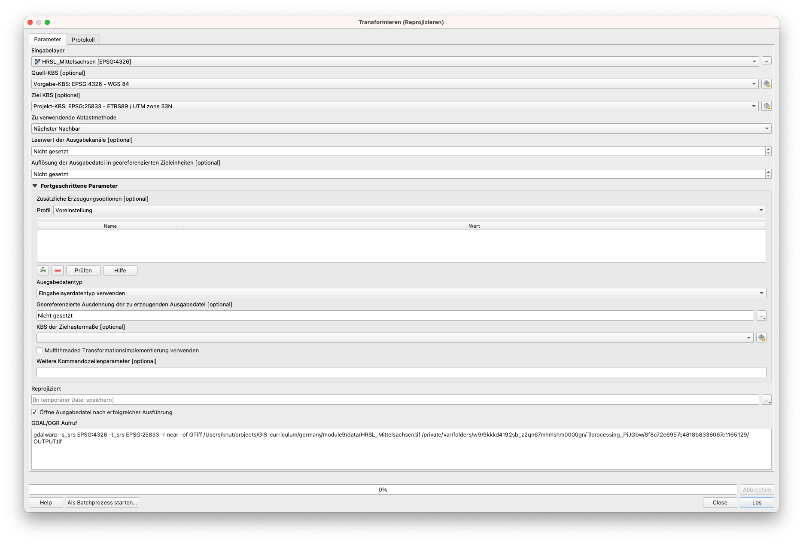

Abbildung 9.9a - Transformieren (Reprojizieren) Fenster

Wenn Sie als Ausgabe **[In temporärer Datei speichern]** gewählt haben, wird im Bedienfeld "Layer" ein Raster-Layer mit dem Namen "Reprojiziert" angezeigt. Dies ist ein Speicherlayer und Sie können diesen Layer in HRSL_Mittelschsen_reporojiziert umbenennen und speichern, um ihn persistent zu machen.


Abbildung 9.9b - Reprojizierter HRSL

Sie werden feststellen, dass es im Gegensatz zur Reprojektion von Vektordatensätzen einen neuen Parameter gibt, den Sie unter "Zu verwendende Abtastmethode" einstellen können. 

**Resampling** stellt die Interpolation der Zellwerte dar, so dass das Raster wie gewünscht transformiert wird. Es gibt mehrere Resampling-Methoden innerhalb der Transformieren-Funktionalität, die jeweils eine eigene mathematische Grundlage haben. Detaillierte Erklärungen zu jeder einzelnen Methode sind jedoch nicht Gegenstand dieser Übung. Weitere Lektüre finden Sie in den Referenzen. 

In diesem speziellen Fall wollen wir Bevölkerungsdaten - numerische Werte - neu projizieren und basierend auf der gewählten Resampling-Methode (nächster Nachbar) wird die Koordinate jedes Ausgabepixels verwendet, um einen neuen Wert aus nahegelegenen Pixelwerten im Eingabelayer zu berechnen (siehe Abbildung 9.10). 

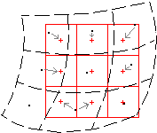

Abbildung 9.10 - Resampling-Methode Nächster Nachbar (Bildnachweis: ILWIS-Dokumentation - [(http://spatial-analyst.net/ILWIS/htm/ilwisapp/resample_functionality.htm](http://spatial-analyst.net/ILWIS/htm/ilwisapp/resample_functionality.htm))

Eingangspixel werden durch gestrichelte schwarze Linien dargestellt, Koordinaten von Eingangspixeln durch schwarze Punkte; Ausgangspixel werden durch rote durchgezogene Linien dargestellt, Koordinaten von Ausgangspixeln durch rote Pluszeichen. Die grauen Pfeile zeigen an, wie die Ausgangswerte ermittelt werden. Wie in Abbildung 9.10 zu sehen ist, können einige Werte der Eingangskarte zweimal in der Ergenniskarte verwendet werden, während andere Eingangswerte überhaupt nicht verwendet werden. Das ist der Grund, warum diese Methode, obwohl sie eine der schnellsten Methoden zum Resampling ist, in unserem Fall nicht geeignet ist, da wir mit numerischen Daten - Bevölkerungsdaten - arbeiten. Diese Resampling-Methode eignet sich für kategoriale Daten - wie z. B. Landbedeckungswerte. 

Um unseren Bevölkerungsrasterdatensatz neu zu projizieren, werden wir die bilineare Interpolationsmethode verwenden, um die Pixelwerte neu abzutasten (siehe Abbildung 9.11).


Abbildung 9.11 - Resampling-Methode - bilinear (Bildnachweis: ILWIS-Dokumentation - [(http://spatial-analyst.net/ILWIS/htm/ilwisapp/resample_functionality.htm](http://spatial-analyst.net/ILWIS/htm/ilwisapp/resample_functionality.htm))

Die bilineare Methode bestimmt den neuen Wert einer Zelle basierend auf einem gewichteten Abstandsmittel der vier nächstgelegenen Eingabezellenzentren. Sie ist nützlich für kontinuierliche Daten und bewirkt eine gewisse Glättung der Daten. 

Wir fahren fort mit der Überprüfung des CRS der 5 Landbedeckungsdatensätze, die wir in unser QGIS-Projekt geladen haben. Unter **Layereigenschaften ‣ Informationen** können wir sehen, dass alle 5 Landbedeckungslayer in EPSG:3857 - WGS 84 / Pseudo-Mercator projiziert sind. Eine Lösung wäre, das Werkzeug Transformieren zu verwenden und für jeden Layer einzeln zu konfigurieren. Ein schnellerer Weg ist jedoch die Verwendung der Transformieren-Funktionalität, die als **Stapelverarbeitung** läuft.

**Stapelverarbeitung** ist die Fähigkeit, mit minimaler Benutzer:inenninteraktion wiederholende Prozesse auf Daten auszuführen. Die meisten QGIS-Funktionalitäten verfügen über diese Option und sie kann im Prozessfenster aktiviert werden, indem man auf die Schaltfläche **Als Batchprozess starten**  klickt und zum Reiter "Stapelverarbeitung" wechselt (siehe Abbildung 9.12). 


Figure 9.12 - Stapelverarbeitung in einem QGIS-Fenster


Abbildung 9.12 - Stapelverarbeitung in einem QGIS-Fenster


Für die 5 Landbedeckungsraster-Layer werden wir die Stapelverarbeitung und als Resample-Methode den nächsten Nachbarn verwenden. Um einen neuen Layer hinzuzufügen, klicken Sie auf das Piktogramm +. Um die KRS- und Resampling-Methoden-Parameter automatisch auszufüllen, klicken Sie auf die Schaltfläche "Autofüllung" oberhalb der entsprechenden Spalten und wählen Sie "Nach unten füllen". Benennen Sie die neu projizierten Raster um, indem Sie den EPSG-Code am Ende des Namens hinzufügen, (LandCover2015 wird zB. zu LandCover2015_25833). Stellen Sie die Parameter wie in Abbildung 9.13 ein: Quell-CRS: EPSG: 3857, Ziel-CRS EPSG 25833, zu verwendende Abtastmethode: Nächster Nachbar, Leerwert für Ausgabekanäle: 255 (im Informationsfenster sehen wir den Datentyp - byte - 8bit unsigned integer - was bedeutet, dass der maximale Wert 255 sein kann), Auflösung der Ausgabedatei in georeferenzierten Zieleinheiten: 100 m (wie die ursprünglichen Landbedeckungsraster). Nachdem Sie alle Parameter eingestellt haben, aktivieren Sie das Kästchen in der linken Ecke des Fensters - **Layer bei Abschluß laden** und klicken Sie auf **Los**. 


Abbildung 9.13a - Stapelverarbeitung zum Repojizieren der Landbedeckungslayers


Abbildung 9.13b - Autofülleinstellungen


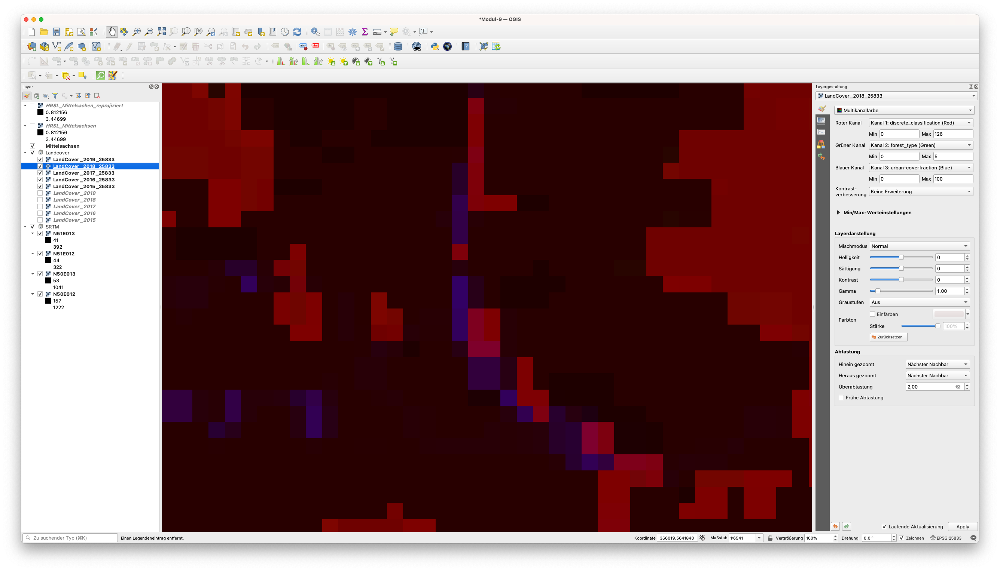

Abbildung 9.13c - Reprojizierte Landbedeckungsraster

Als nächstes kommen die digitalen Oberflächenmodell-Raster. Wie man sehen kann, brauchten wir mehrere _Rasterkacheln_, um unser Interessengebiet abzudecken. Wenn Rasterdateien zu groß werden - stellen Sie sich eine einzige DSM-Datei mit 30 m für Europa vor, das über 10 Millionen Quadratkilometer umfasst - werden sie in **Kacheln** aufgeteilt, weil sie in kleineren Gebieten leichter zu handhaben sind. 

Obwohl wir das Transformieren-Tool im Stapelmodus verwenden könnten, um alle DSM-Rasterdateien neu zu projizieren, kann man bei einer visuellen Inspektion auch feststellen, dass die Abgrenzungen zwischen den einzelnen Kacheln ziemlich sichtbar sind, was es zumindest visuell unattraktiv macht. Was nützlich wäre, ist ein kompletter Überblick über das Gelände, als ein kontinuierliches Phänomen - wie es in der Tat ist - ohne künstliche Unterbrechungen. Um das zu erreichen, werden wir das GDAL-Merge-Tool verwenden, das in der Symbolleiste Verarbeitungswerkzeuge verfügbar ist, um alle DSM-Raster zusammenzufügen. Um es zu öffnen, öffene Sie die Vearebeitungswerkzeuge und Suchen sie nach **Verschmelzen** (siehe Abbildung 9.14). Alternativ können Sie auch in der globalen Suchleiste nach "Verschmelzen" suchen.


Abbildung 9.14 - Finden des GDAL-Verschmelz-Werkzeugs in den Verarbeitungswerkzeugen 

Wählen Sie im sich öffnenden Merge-Fenster die DSM-Rasterdateien aus, die wir mosaizieren wollen, und klicken Sie auf "Run". Das Ergebnis sollte wie in Abbildung 9.15c aussehen. 


Abbildung 9.15a - Auswahl der zusammenzuführenden SRTM-Layer


Bild 9.15b - Parameter des Merge-Verarbeitungsalgorithmus


Abbildung 9.15c - Zusammengeführte DSM-Daten


Nun können wir mit der Reprojektion des Layers fortfahren. Gehen Sie zu **Raster ‣ Projektion ‣ Transformieren (reporjizieren))** und stellen Sie die bekannten Parameter ein: 

   * Quell-CRS: EPSG:4326
   * Ziel-CRS: EPSG:25833 
   * Abtast-Methode: Nächster Nachbar
   * Auflösung der Ausgabedatei - 30 m. 

An diesem Punkt sollten wir alle Ebenen im gleichen CRS haben - EPSG 25833. 


Figure 9.15d - Transformieren-Parameter


Wir können eine weitere Prüfung durchführen, um sicherzustellen, dass alle Raster, mit denen wir arbeiten, projiziert werden, und um zusätzliche Informationen zu den Daten zu erhalten, indem wir einen Stapelprozess von Rasterinformationen für alle ausführen. Um das Funktionsfenster zu öffnen, gehen Sie zu **Raster ‣ Sonstiges ‣ Rasterinformationen**. Ihr Fenster für die Stapelverarbeitung von Rasterinformationen sollte wie in Abbildung 9.16 aussehen. 


Abbildung 9.16 - Stapelverarbeitung zum Extrahieren von Informationen in eine separate HTML-Datei für mehrere Raster-Layer

Eine HTML-Datei mit Rasterinformationen sollte wie unten dargestellt aussehen. Eine HTML-Datei kann mit einem beliebigen Texteditor oder Webbrowser Ihrer Wahl geöffnet werden. 


```
Driver: GTiff/GeoTIFF
Files: /Users/knut/QGIS-Traning/Land-Cover/LandCover_2019_25833.tif
Size is 744, 687
Coordinate System is:
PROJCRS["ETRS89 / UTM zone 33N",
    BASEGEOGCRS["ETRS89",
        DATUM["European Terrestrial Reference System 1989",
            ELLIPSOID["GRS 1980",6378137,298.257222101,
                LENGTHUNIT["metre",1]]],
        PRIMEM["Greenwich",0,
            ANGLEUNIT["degree",0.0174532925199433]],
        ID["EPSG",4258]],
    CONVERSION["UTM zone 33N",
        METHOD["Transverse Mercator",
            ID["EPSG",9807]],
        PARAMETER["Latitude of natural origin",0,
            ANGLEUNIT["degree",0.0174532925199433],
            ID["EPSG",8801]],
        PARAMETER["Longitude of natural origin",15,
            ANGLEUNIT["degree",0.0174532925199433],
            ID["EPSG",8802]],
        PARAMETER["Scale factor at natural origin",0.9996,
            SCALEUNIT["unity",1],
            ID["EPSG",8805]],
        PARAMETER["False easting",500000,
            LENGTHUNIT["metre",1],
            ID["EPSG",8806]],
        PARAMETER["False northing",0,
            LENGTHUNIT["metre",1],
            ID["EPSG",8807]]],
    CS[Cartesian,2],
        AXIS["(E)",east,
            ORDER[1],
            LENGTHUNIT["metre",1]],
        AXIS["(N)",north,
            ORDER[2],
            LENGTHUNIT["metre",1]],
    USAGE[
        SCOPE["unknown"],
        AREA["Europe - 12°E to 18°E and ETRS89 by country"],
        BBOX[46.4,12,84.01,18.01]],
    ID["EPSG",25833]]
Data axis to CRS axis mapping: 1,2
Origin = (331489.476338801323436,5678619.779446345753968)
Pixel Size = (100.000000000000000,-100.000000000000000)
Metadata:
  AREA_OR_POINT=Area
Image Structure Metadata:
  INTERLEAVE=PIXEL
Corner Coordinates:
Upper Left  (  331489.476, 5678619.779) ( 12d35'10.35"E, 51d14' 2.54"N)
Lower Left  (  331489.476, 5609919.779) ( 12d37' 4.65"E, 50d37' 0.44"N)
Upper Right (  405889.476, 5678619.779) ( 13d39' 5.38"E, 51d15' 4.19"N)
Lower Right (  405889.476, 5609919.779) ( 13d40' 9.28"E, 50d38' 0.75"N)
Center      (  368689.476, 5644269.779) ( 13d 7'52.35"E, 50d56' 6.33"N)
Band 1 Block=744x3 Type=Byte, ColorInterp=Red
  Description = discrete_classification
    Computed Min/Max=0.000,126.000
  Minimum=0.000, Maximum=126.000, Mean=25.108, StdDev=35.539
  NoData Value=255
  Metadata:
    STATISTICS_MAXIMUM=126
    STATISTICS_MEAN=25.107998305844
    STATISTICS_MINIMUM=0
    STATISTICS_STDDEV=35.538513461505
    STATISTICS_VALID_PERCENT=95.16
Band 2 Block=744x3 Type=Byte, ColorInterp=Green
  Description = forest_type
    Computed Min/Max=0.000,5.000
  Minimum=0.000, Maximum=5.000, Mean=0.178, StdDev=0.830
  NoData Value=255
  Metadata:
    STATISTICS_MAXIMUM=5
    STATISTICS_MEAN=0.17849080344917
    STATISTICS_MINIMUM=0
    STATISTICS_STDDEV=0.82977789003485
    STATISTICS_VALID_PERCENT=95.16
Band 3 Block=744x3 Type=Byte, ColorInterp=Blue
  Description = urban-coverfraction
    Computed Min/Max=0.000,100.000
  Minimum=0.000, Maximum=100.000, Mean=4.146, StdDev=16.816
  NoData Value=255
  Metadata:
    STATISTICS_MAXIMUM=100
    STATISTICS_MEAN=4.1456192508707
    STATISTICS_MINIMUM=0
    STATISTICS_STDDEV=16.816497877006
    STATISTICS_VALID_PERCENT=95.16
```


Nachdem wir die Raster vorbereitet haben, indem wir sie in das KRS, mit dem wir arbeiten, reprojiziert und ihre Metadaten gelesen haben, um die Dateien besser zu verstehen, ist es an der Zeit, sich mit den eigentlichen Daten zu beschäftigen. Um das zu erreichen, werden wir die Histogramme (siehe Abschnitt _Gliederung der Konzepte_ für Details) unserer Raster berechnen und interpretieren. 

Um ein Histogramm zu berechnen, wählen Sie den gewünschten Raster-Layer aus, öffnen mit einem Doppelklick das Dialogfenster `Eigenschaften` und gehen auf `Histogramm` (siehe Abbildung 9.17). 


Bild 9.17 - Histogramm-Fenster

Klicken Sie auf die Schaltfläche `Histogramm berechnen` und QQGIS berechnet es automatisch. 

Nach der Berechnung des Histogramms können wir sehen, dass sich die Maus in eine Lupe verwandelt. Zoomen Sie hinein indem Sie einen Kasten mit der Maus aufziehen und Sie sehen etwas wie in Abbildung 9.18. 

Um zur Vollansicht zurückzukehren, klicken Sie mit der rechten Maustaste. 


Abbildung 9.18 - Ausschnitt des Histograms für den SRTM-Layer

Das Histogramm zeigt nicht nur die Verteilung der numerischen Werte der Pixel an, sondern ermöglicht es auch, die Werte zur Visualisierung des Rasterlayers neu zu setzen. Verwenden Sie dazu die beiden Werkzeuge, um im Histogramm die neuen Min- und Max-Werte zu markieren (siehe Abbildung 9.19). 


Abbildung 9.19 - Auswahl der Min- und Max-Werte für die Neuklassifizierung des Rasters

Nach dem Klicken auf Apply wird das Raster mit dem neu gewählten Min-Max-Bereich dargestellt. Diese Funktionalität ermöglicht es Ihnen, Extremwerte zu ignorieren, die das Raster unnormal dehnen können. 

Auch wenn das nächste Werkzeug, das wir verwenden, eine Erweiterung ist (siehe Modul 1 für Details zu den Erweiterungen), halten wir es für sehr nützlich, um mit der Arbeit mit Rastern zu beginnen. Wir beziehen uns auf das **Value Tool**, das die sofortige Identifizierung von Zellwerten durch Überfahren von Raster-Layern ermöglicht. 

Gehen Sie zu **Erweiterungen ‣ Erweiterungen verwalten und installieren** und suchen Sie nach dem **Value Tool**-Plugin und klicken Sie auf installieren. Öffenen Sie anschließend das neue **Value Tool Bedienfeld**. Überprüfen Sie Ihre QGIS-Oberfläche, um zu sehen, wo es geöffnet wurde.


Abbildung 9.20 - Das Value-Tool Bedienfeld

Der Nutzen dieses Werkzeugs liegt in seiner einfachen Handhabung, mit wenigen Klicks kann man sehr leicht Wertezellen in genau den Bereichen extrahieren, die von Interesse sind. Außerdem ermöglicht es dies für alle geladenen Raster-Layer. 

Das Value Tool hat 3 Registerkarten: Table, Graph, Options (siehe Abbildung 9.21).


Bild 9.21 - Aktiviertes Value Tool - Hervorhebung im ersten Reiter - Tabelle

Die erste Registerkarte - Tabelle - zeigt eine Liste aller geladenen Raster-Layer und die Werte der Zellen, über denne sich der Mauszeiger befindet. Es besteht auch die Möglichkeit zu wählen, mit wie vielen Nachkommastellen die Werte angezeigt werden sollen. Wenn der Mauszeiger außerhalb des Bereichs eines Raster-Layers bewegt wird, wird anstelle eines Wertes eine Meldung angezeigt: "out of extent". 

Die zweite Registerkarte - Graph - zeigt in einem vereinigten Graphen alle Werte an, die er an der Position der Maus liest. Sie ermöglicht es, Werte für min und max auf der Y-Achse - das ist die Achse der Zellenwerte - einzufügen. Die X-Achse listet alle Bänder des Rasters auf, die es in der Tabelle anzeigt, mit den entsprechenden Ordnungsnummern: das Band, das die Nummer 1 in der ersten Registerkarte hat, wird auch die Nummer 1 in der Grafik sein. 

Auf der dritten Registerkarte können Sie einstellen, was das "Value Tool" anzeigt: welche Layer (alle, nur die sichtbaren oder nur die ausgewählten) und welche Bänder angezeigt werden sollen. 


#### **Quizfragen**

1. Können Raster-Layer in andere Koordinatensysteme umprojiziert werden?
* _Ja_
* Nein
2. Können zwischen den Wertebereichen eines für einen Raster-Layer berechneten Histogramms Lücken entstehen?
* Ja. 
* _Nein_
3. Können verschiedene Bänder desselben Rasterdatensatzes unterschiedliche Auflösungen haben? 
* _Ja_
* Nein. 


### Phase 2: Working Intro to working with raster data

Now that we’ve learned how to extract basic information on the loaded raster datasets, we will continue with a more in-depth raster data processing in order to obtain new derived rasters and, in consequence, more information.

As you may have noticed, due to the raster data model structure, the layers we have loaded are expanding over our region of interest - Pampanga province. That is undesirable due to several reasons but mainly because you end up processing more data than you actually need, which translates in bigger storage and computer processing needs. That is why, before moving forward to any other steps, we will make sure that we process exactly as much data as we need. **Be aware **as you will start working on your own datasets, that the size of your files is an important factor when it comes to processing times. The bigger the files, more time will be required. Because of the model data structure - raster vs vector - raster files are usually much larger. 

As you have noticed by now, the datasets we load into a GIS - in our case into QGIS - can be processed together even if they are of different nature, such as joining csv tables to vector layers to add information to geometries. The same applies to raster and vector data, as we will see. 

To work only with raster layers that are relevant to our Pampanga province, we will use the vector extent layer (Pampanga_admin_boundary) to cut/clip all relevant raster layers. Go to **Raster ‣ Extraction ‣ Clip Raster by Mask Layer** (see figure 9.22). Similarly, you can search for Clip in the Processing Toolbar or the Locator bar.


Figure 9.22 - Using a vector mask to extract the raster data on a specific region

Given that we will work with 7 raster layers - the 5 Land Cover layers - the digital surface model and the HRSLl, we will use Batch processing to clip all layers at once. **Be aware,** if you have skipped the reprojecting step you have layers in different projections and the algorithm will either not work or produce unexpected results. 

Your batch processing window setup should look like in figure 9.23. 


Figure 9.23 - Batch process cliping all required raster layers by Pampanga Province geometry

The parameters setup are the following:
* mask layer: Pampanga_admin_boundary
* both source and target CRS is EPSG 3123
* select yes to: `match the extent of the clipped raster to the mask layer` and `keep resolution of input layer`. 
* Be aware, for the DSM_mosaic we will also select yes` to create an output alpha band`. Load layers at completion. 

If everything went smoothly, your QGIS main window should look like in figure 9.24. 


Figure 9.24 - Raster layers clipped by Pampanga province contour.  

Now, imagine that you have to present a report on where most people are living but with consideration to the altitude[^4]. You must know how many people live between 0 and 200 m altitude in the Pampanga province. There are a few elements to consider. Firstly, what is the data we will use and what are its characteristics. For population, we have the High Resolution Settlement Layer Data and for relief, we have the ALOS World 3D - 30m (AW3D30). Both raster layers have a spatial resolution of 30m, which allows us to proceed to other considerations. Relief is a continuous phenomena, the spread of the population is not, yet the report would make no sense to be done by the 30m pixel. We need to identify all the pixels with cell values from 0 to 200. Considering the histogram of the DSM_mosaic for our region of interest, we’ve seen that most cell values are between 0 and 200m. We can proceed to making a basic relief map based on the following divisions: 

1. 0 - 50m
2. 51 - 100m
3. 101 - 150m
4. 151 - 200m
5. 250 - 600m
6. 600 - 1300m

Using your knowledge acquired in module 4, you can style the DSM layer by these categories. Your map should look like in figure 9.25.


Figure 9.25 - DSM_mosaic_clipped representation

In order to calculate the number of people based on the raster data HRSL that live up to 200 meters in Pampanga province, we must see which pixels fall in each of those categories. To do that, we will use **Raster Calculator**. This is a functionality allowing the user to perform calculations on the basis of existing raster pixel values. The results are written to a new raster layer in a GDAL[^5]-supported format.

There are several ways to open the raster calclulator in QGIS. You can do so from the Menu bar **Raster ‣ Raster Calculator** or by searching raster calculator on the Processing Toolbox or Locator bar. If we run the Raster Calculator under Raster analysis in the Processing Toolbox, the window in Figure 9.26b should appear. 


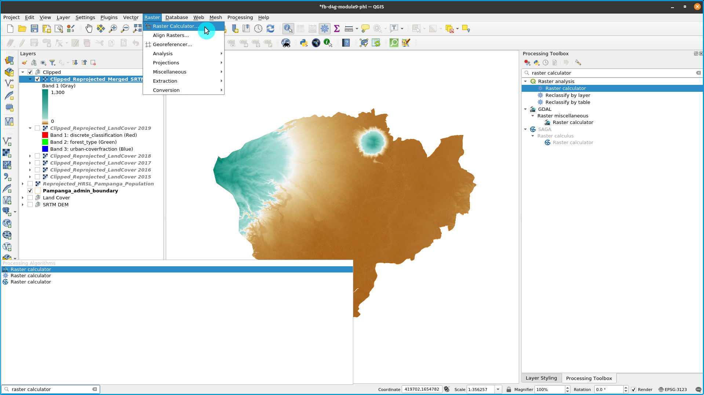

Figure 9.26a - Opening the Raster calculator


Figure 9.26b - Raster calculator

In this window, we can recognize the operations detailed in the Concepts section, substractions, additions, comparisons and all the others (see page 3). **Clipped_Reprojected_Merged_SRTM@1** The naming convention for the rasters can be observed: what comes before the @ is the name of the raster layer, what comes after the @ is the number of the band.


Next, we will ‘slice’ our DSM_mosaic_clipped raster layer to extract only the pixels with values up to 200 meters. We know that the value cells of the DSM-mosaic_clipped represent a continuous numerical data (not discrete values, such as LandCover). Therefore, the operation we need to employ in this case is a comparison one - cell values <= 200 meters. To obtain this, we will write the following the Raster Calculator: 

```
"Clipped_Reprojected_Merged_SRTM@1" <= 200
``` 

Set the **Reference layer** as **Clipped_Reprojected_Merged_SRTM@1**. Your Raster Calculator should look like in figure 9.27.


Figure 9.27 - Inserting a formula into the Raster Calculator. 

Your result should look like in figure 9.28. 


Figure 9.28 - Result of identify all pixel values that are below 200 meters using the Raster Calculator

The result will be named `Output`. You can rename this to `< 200`. As we can see in the Layers Panel, the raster layer we have obtained has only 2 values 0 and 1. That is because we have used a rational operation, a comparison, therefore every pixel that is below 200 meters received value = 1 and all above, value = 0. We can test this by using the `Value Tool`. Figure 9.29 presents only pixels of value 1, in other words the pixels we are interested in for our exercise. 


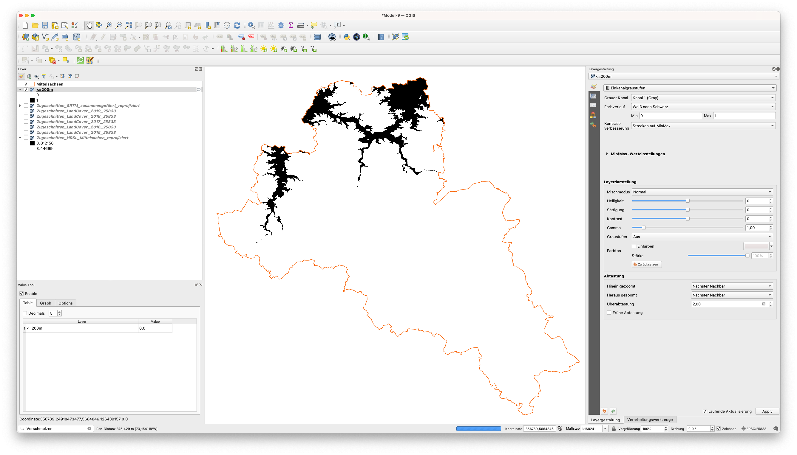

Figure 9.29 - Spatial distribution of all pixels of value 1, meaning with altitude lower than 200 meters 

Going further, we can show the spatial distribution of population at the 30 m spatial resolution only in this specific geographical region, we’ve selected - Pampanga province, below 200m. To do that, we again employ Raster Calculator. 

The formula is fairly simple, given that all DSM cell values we are interested in have value 1. 

Open the Calculator and insert the following formula: 

```
"< 200@1"*"Reprojected_HRSL_Pampanga_Population@1"
```


Figure 9.30 - Using raster calculator to identify population distribution classes based on altitude of up to 200m

As opposed to previous raster calculator use, we have used 2 different raster datasets to obtain the desired result, yet you will observe that even if there are pixels that fall outside the DMS_clipped200.tif in the result, their value is 0. Use Value Tool to check (see figure 9.31). 


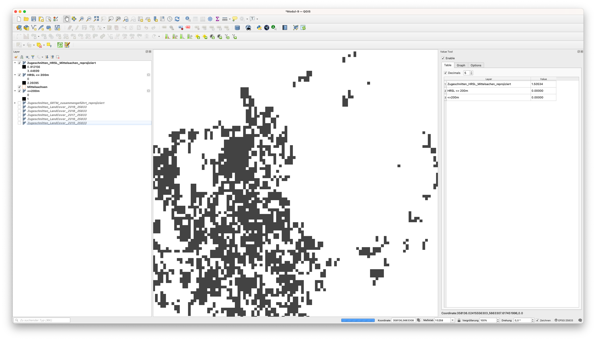

Figure 9.31 - Using Value Tool to check results of Raster Calculator

You can see that even if Reprojected_HRSL_Pampanga_Population has values in this specific mouse location, the raster obtained with Raster Calculator HRSL_DSM has value 0. 

Next, we present the spatial distribution of the population that lives below 200m in Pampanga province. To choose an appropriate classification, we calculate the histogram. We can notice that most values are between 0.1 and 200 people per 30m. The classification we’ve chosen is visible in figure 9.32. 


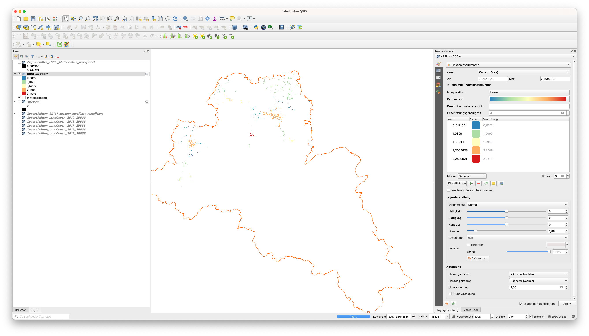

Figure 9.32 - Distribution of population that lives below 200m in Pampanga province, represented at a 30m resolution. 

If we are interested in the total number of people living below 200m in Pampanga province and not the geographical distribution per 30 m spatial resolution, then we need to sum up all pixel values of the raster layer HRSL_DSM. One way to obtain this number is to transform the DSM_clipped200 from raster to vector and them [....]

To do that go to **Raster ‣ Conversion ‣ Polygonize (Raster to Vector)** (see figure 9.33). 


Figure 9.33a - Raster to vector conversion

Remember that this raster layer had only 2 values - 0 and 1, so choose as the parameter by which to construct the vector the DN (digital number). 


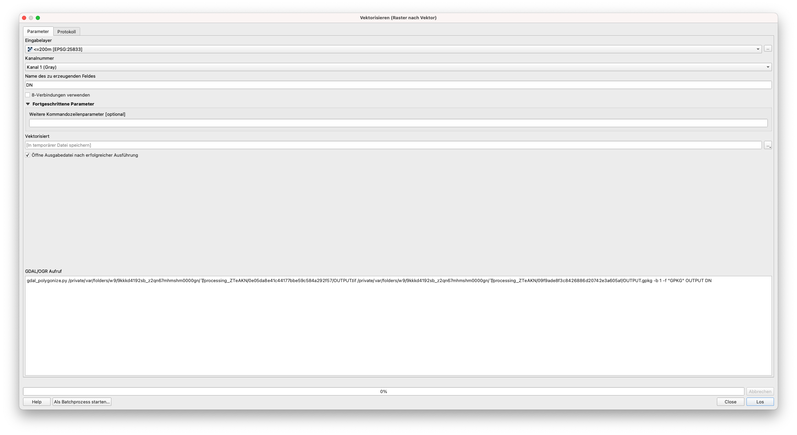

Figure 9.33a - Raster to vector conversion parameters

Your result should look like in figure 9.34. 


Figure 9.34 -  Result of converting a raster dataset to a vector dataset. 

Delete the geometry of value 0. 

To find our answer we will use **Zonal Statistics**. To quickly find this functionality, open the Processing Toolbox and type in the search box “zonal” (see figure 9.35).


Figure 9.35 - Identifying Zonal Statistics in the Processing Toolbox

In the window that has opened, select the parameters like in figure 9.36. As statistics calculated, select: count, sum, min and max. 


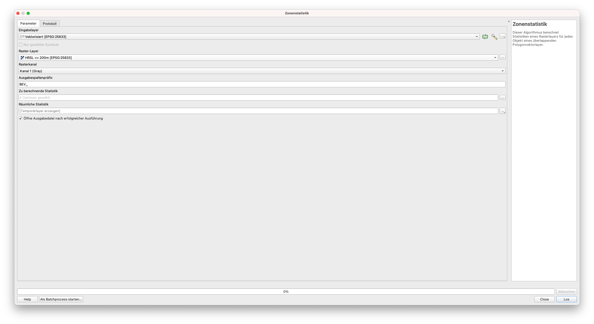

Figure 9.36 - Setting the parameters for Zonal Statistics

The resulting layer is a vector layer that has as attributes the statistics that we have selected (see figure 9.37). 


Figure 9.37 - Resulting vector layer of Zonal Statistics

And with this final step, we answered our exercise, how many people (and where) are living below 200m in Pampanga province. 


#### **Quiz questions**

1. Can raster data be clipped? 
*   _<span style="text-decoration:underline;">Yes</span>._
*   _No._
2. Can one use vector datasets loaded in the QGIS project in Raster Calculator?
*   _Yes._
*   _<span style="text-decoration:underline;">No.</span>_
3. Can raster datasets be converted to vector datasets?
*   _<span style="text-decoration:underline;">Yes</span>._
*   _No._


### **Phase 3: Working with raster and vector data.**

In the previous phase, we have seen how we can process 2 raster datasets in order to derive new information. We have used the digital surface model and the High Resolution Settlement Layer to find out how many people live below 200m in Pampanga province. Before doing any analysis, we made sure that the datasets were in the same projection and, furthermore if the rasters have the same spatial resolution so that the results we obtained are viable. When referring to the coordinate reference system, the reasoning is clear, but why the same spatial resolution? 

Remembering spatial resolution, it is the size of the ground surface measured in units of length, in other words, the size of the pixel measured on ground. If a raster has a 30m resolution, that means that the smallest linear object we could detect on that image is of 30 m, any smaller and we could not detect it. Continuing the analogy, we can compare it with the scale of a map. If a map has a scale of 1:25000, that means that 1 unit of length on the map represents 25000 units on the ground, that is 1 cm is 25000cm, 1 cm on the map equals 250m on the ground. For example, a 2km road would have 8 cm on the map.

Why is that important when working with raster datasets? Figure 9.38 might offer an explanation.


Figure 9.38 - Example of different resolutions specific to different satellite imagery - Landsat and SPOT -  for the same area 

_(Photo credit: Congedo,  L.  and  Munafò,  M, (2013) Assessment  of  Land  Cover  Change  Using Remote  Sensing:  Objectives,  Methods  and  Results, Rome:  Sapienza  University.  Available  at:
http://www.planning4adaptation.eu/_

Figure 9.38 details the relation between the resolution of the satellite imagery and the land cover information extracted from these images captured. Remember as we detailed at the beginning that the value of the pixel cell is attributed to the entire area it covers, yet that does not mean that is the reality on the ground. These represent decisions made by the EO experts that derive various products based on Earth Observation imagery - all documented in peer-reviewed papers and algorithm descriptions. Further explanations are beyond the scope of this module, but it is important to keep in mind the relation between what a sensor onboard a satellite captures and the products we use. 

Coming back to our region of interest - Pampanga province - we can test these differences with the data that we have at hand. We have loaded into our QGIS project the 5 raster layers of LandCover for 5 years: 2015, 2016, 2017, 2018 and 2019. Next, we will load a mosaic of Sentinel-2[^6] imagery. We will load the WMS layer EOX Sentinel-2 cloudless, available [here](https://s2maps.eu/). Remembering from module 2, to add a WMS layer, go to **Layer ‣ Add layer ‣ Add WM/WMTS Layer..**

When the add window opens, use the following parameters:
```
Name: EOX Sentinel-2
URL: https://tiles.maps.eox.at/wms?service=wms&request=getcapabilities
```


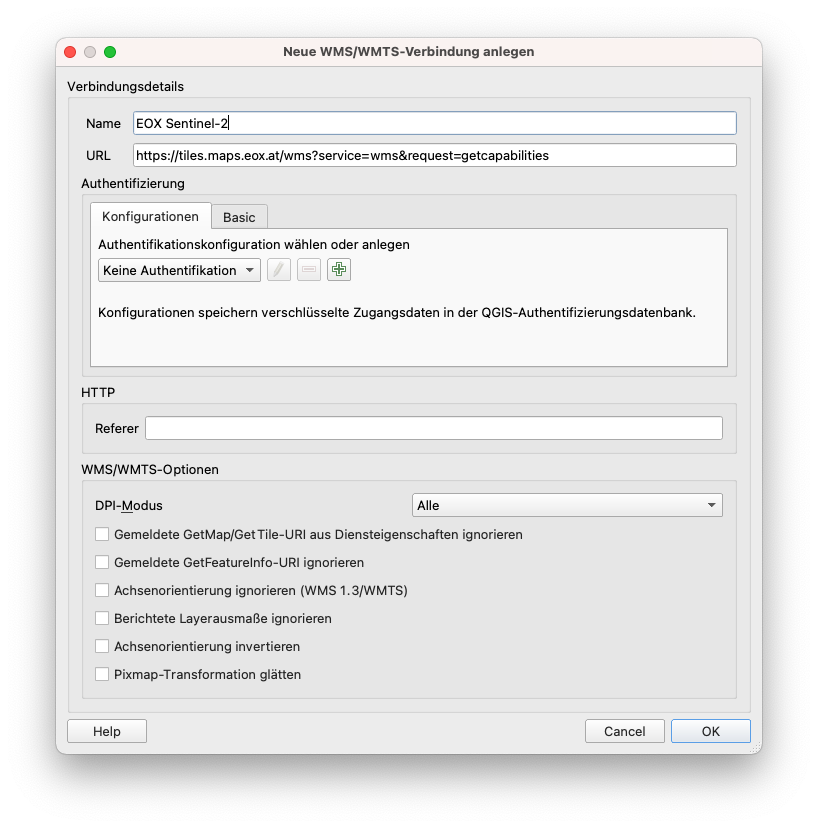

Figure 9.39 - Adding a WMS layer to QGIS 

After connecting to the newly WMS layer added, we will load the layer named Sentinel-2 cloudless layer for 2019 by EOX - 4326 into QGIS. After zooming to the region of interest extent, your map window should look like in figure 9.40. 


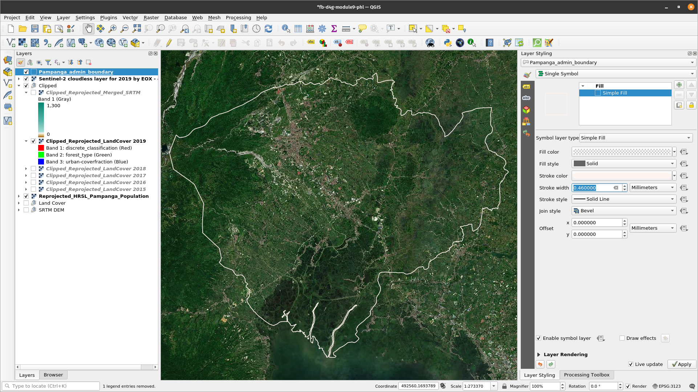

Figure 9.40  - Sentinel-2 cloudless layer for 2019 by EOX - 4326 for Pampanga province

Although the LandCover products have been obtained using other satellite data (Proba-V), let us compare the 2 layers so we can get a sense of what different resolutions mean. Remember that the LandCover product is at 100m and Sentinel 2 imagery is at 10m. To accomplish that, we will open the Clipped_Reprojected_LandCover 2019 and the WMS layer. To make comparisons between 2 layers, we will use a new plugin that you must install. Therefore, go to **Plugins ‣ manage and install plugins** and write in the search box `MapSwipe Tool`. Once you install it, it should appear as a new pictogram in your toolbar (). 


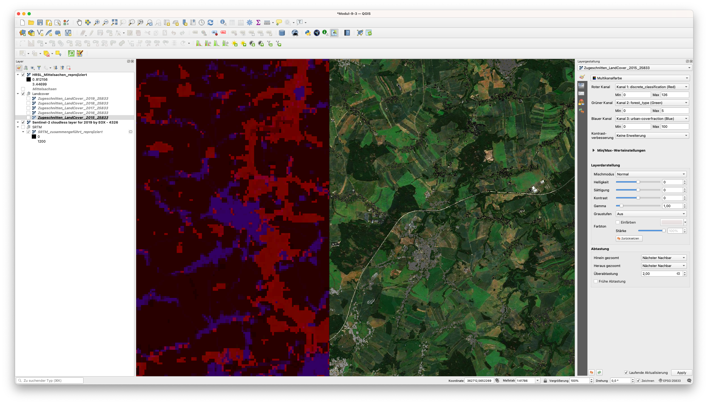

Figure 9.41 - Comparing 2 raster layers using MapSwipe Tool plugin 

To activate the MapSwipe tool, click on it while the raster layer you want to drape is selected in the Layers Panel. The resolution differences are obvious, as well as the fact that the satellite product (Land Cover) has been developed using a satellite image (PROBA-V) of a coarser resolution. However, the general larger classes are well identified, as can be seen in figure 9.42. 


Figure 9.42 - LandCover2019 obtained from PROBA-V(100m) on top of Sentinel 2 mosaic (30m)

Adding the HRSL to the map, will show a good match between HRSL and the LandCover. The urban space is depicted in red and, as you can see in figure 9.43, it is almost completely covered by the HRSL layer. 


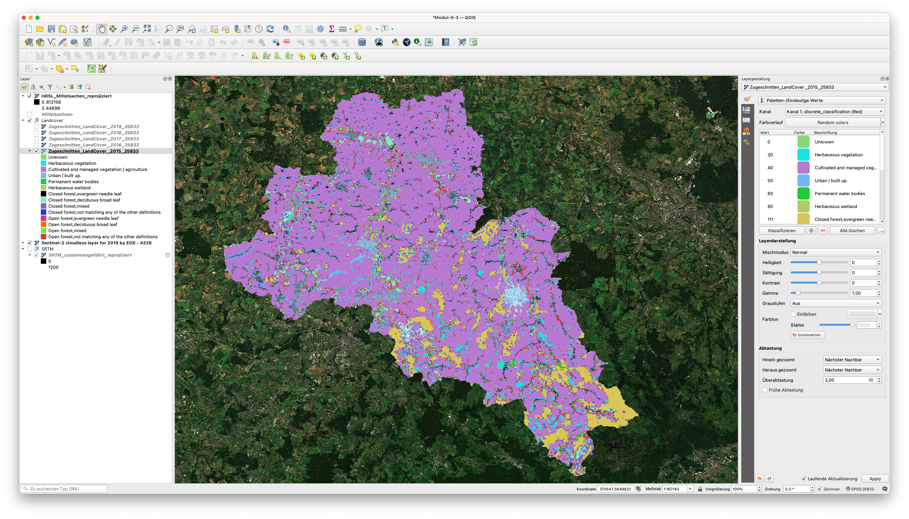

Figure 9.43 - HRSL added on top of the Clipped_Reprojected_LandCover 2019.

However, zooming in you can see the difference in resolution between the 2 raster products, as in figure 9.44. 


Figure 9.44 - Difference in spatial resolution between HRSL (30m - pinkish) and the Clipped_Reprojected_LandCover 2019 (100m - red and magenta colours)

Now, if any analysis would be made using these rasters, these results would not be viable, because we would be comparing values that apply to different resolutions. As a preprocessing phase, the user must _resample_ one of the 2 to match. 

**Resampling** refers to changing the cell values due to changes in the raster cell grid and there are only 2 options: (1) **upsampling** refers to cases where we are converting to higher resolution/smaller cells and (2) **downsampling** is resampling to lower resolution/larger cell sizes. 

Let us imagine the following exercise. We need to identify the population numbers for each category of land cover we have defined in the Pampanga province. As explained above, we need to _pre-process_ the data we have in order to get viable results from our analysis, i.e. in our case, we need to bring both our raster datasets to the same spatial resolution. As detailed above, we can either increase or decrease the pixels’ dimensions. It must be highlighted that resample, with up or downscale, will involve an interpolation process (see page 12 for more details) - so the result introduces a statistical error. The usual practice is to resample all rasters to correspond to the raster with the lower resolution, but again this decision must be taken with consideration to all factors. Detailing the decision making process for resampling raster layers far exceeds the scope of this curriculum. 

A difference between the 2 products must be highlighted: the LandCover product covers the **entire area** of the considered extent, as opposed to the HSRL product, where the raster layer contains strictly the cell where values above 0 exist. This situation poses issues when interpolation cell values to resample, because no matter the interpolation method chosen, that would take into consideration the surrounding pixels, following a specific well-defined algorithm and in this particular situation, the edge pixels are not at the edge of the study region, but within it. Therefore, in our demonstrative case, we will consider upsampling the Land Cover product from 100m to 30m resolution to match the LandCover product resolution. The resampling method we choose is crucial, as results can vary significantly. For the purpose of demonstration, we will resample the LandCover product using 2 different methods - Nearest Neighbour and Mode. 

To resample, go to **Raster ‣ Projections ‣ Wrap (reproject).** In the functionality window set the following parameters: 
* input layer: Clipped_Reprojected_LandCover 2019, 
* Source CRS and Target CRS: EPSG: 3123, 
* Resampling method: Nearest Neighbour, 
* No data: 255, output file resolution: 30, 
* Output data type: use input layer data type, 
* georeference extent: select the Clipped_Reprojected_LandCover 2019 layer. 

Save the output layer as LC2019_NearestNeighbour. 


Figure 9.45 - Resampling the Land Cover layer


Follow the exact steps, except that for resample method parameter choose Mode. Save the output layer as LC2019_Mode.  

Now, let’s compare results - see figure 9.45 and 9.46. 


Figure 9.46a - Resampling Land Cover product using the Nearest Neighbour resampling method


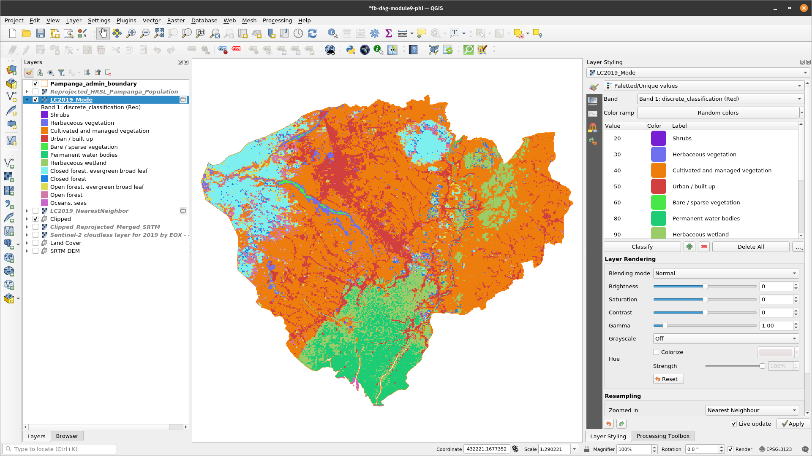

Figure 9.46b - Resampling Land Cover product using the Mode resampling method

Both rasters have the same symbology applied and we can observe that in figure 9.45 there are values that don’t fall in either category - pixels are not showing. However, we know that the Land Cover product is a seamless layer - it has no gaps between the same categories defined. Let us dig deeper and look at the histograms for all three layers. For that go to **Properties ‣ Histogram** and choose from Prefs/Actions to show only Band 1. Save the histogram by clicking on the save icon on the right side of the window (see figure 9.47).


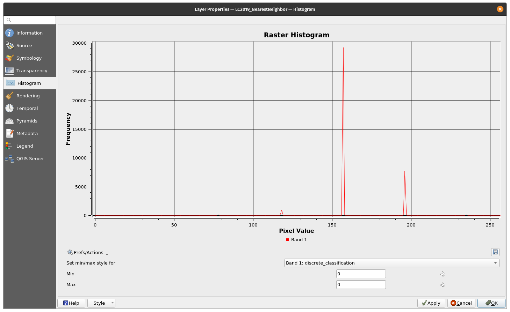

Figure 9.47 - Show values only for one selected band in the histogram.

Figure 9.48 (a), (b) and (c) present the 3 histograms of interest. 


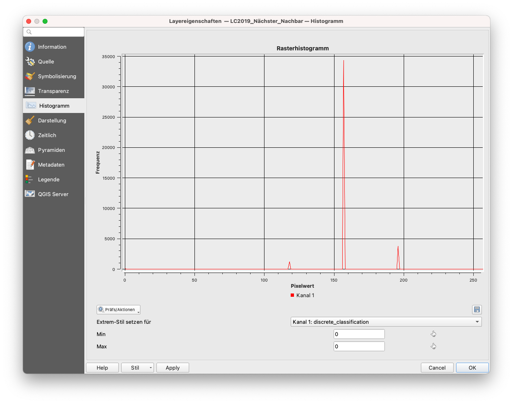


Figure 9.48 - Histograms of (a) Clipped_Reprojected_LandCover 2019 (100m), (b) LC2019_NearestNeighbour and (c) LC2019_Mode

We can observe the differences in the distribution of values for the 3 datasets, emphasis on (b), where we used the nearest neighbour resampling method, resulting - as expecting - in a calculated pixel values and thus resulting in values that do not correspond with any values in the Land Cover product (see table 1, page 7). Hence, the white spaces - pixels with no color assigned in figure 9.45. As inferred, the mode resampling method - or majority resampling method -  selects the value which appears most often.

At this point, your map windows should look like in figure 9.49. 


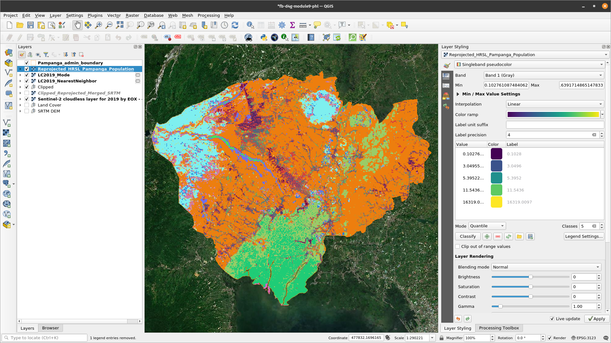

Figure 9.49 - The 2 raster products: Land Cover 2019 and HRSL overlaid. 

Going back to our exercise, the requirements was to identify the population numbers for each category of land cover we have defined in the Pampanga province. At this point, we have pre-processed our raster data, as to have it in the same coordinate system, with the same spatial resolution. We will continue with a conversion algorithm, we will transform the raster dataset Land Cover into a vector dataset - polygon type. This will allow us to more easily identify the population count for each land cover category. 

For conversions, from raster to polygon, as well as from vector to polygon, go to **Raster ‣ Conversion** and here we have more options. We will choose **Polygonize (Raster to vector)..** We will convert to vector the latest raster dataset that we have obtained: LC2019_Mode. Your result should look like in figure 9.50b. 


Figure 9.50a - Polygonizing the LC2019_Mode (30m) raster layer


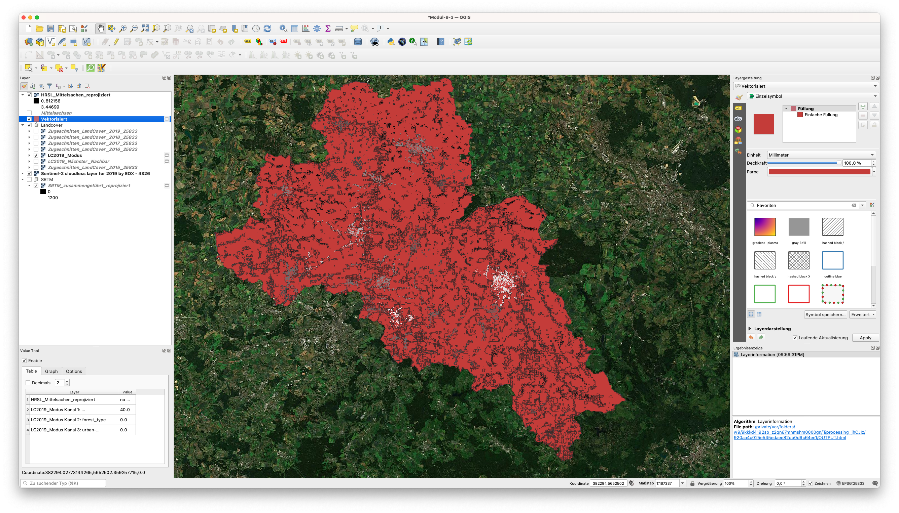

Figure 9.50b - Result of polygonizing the LC2019_Mode (30m) raster layer

As we can observe, each pixel - each group of adjacent pixels with the same category code (see table 1, page 7) was converted into one polygon. However, we are not interested in each distinct region, but in the entire category. Thus, we will dissolve the vector layer we have obtained using the class identification as the common attribute (**Vector ‣ Geoprocessing tools ‣ Dissolve** - for more details, check module 8).

Attaching the same styling as for the raster and we will notice the same vector classes correspond to the raster ones (see figure 9.51). 


Figure 9.51 - LC2019_Mode polygonez 

As we can observe, the HRSL’s pixels are, as expected, not perfectly contained in a polygon of the land cover product (see picture 9.52).


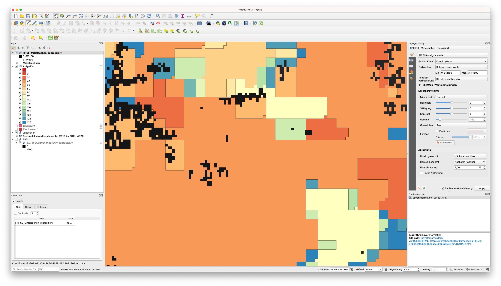

Figure 9.52 - Mismatch of HRSl pixels and the land cover vector dataset  

To eliminate this inconvenience, we will vectorize the HRSL layer as well, just that this time we will transfer the pixel cell value to a point - the geometric center of each pixel.

Go to **Processing ‣ Toolbox**. In the search bar write the keywords `raster point` and choose the `Raster pixels to points` algorithm (see figure 9.53a). Save the output as HRSL_points. 


Figure 9.53a - Raster pixels to points


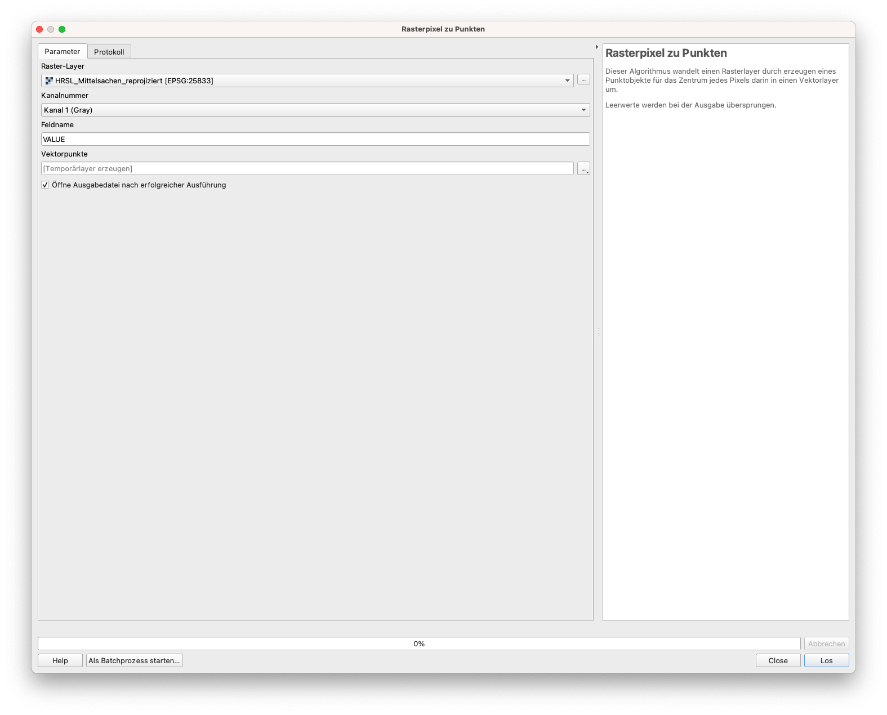

Figure 9.53b - Running Raster pixels to points algorithm

Considering the extent of your study area, this operation can be significantly lengthy in time. Figure 9.54 shows how many points we have obtained for Pampanga province.


Figure 9.54 - Loading point vector data obtained

The number of features is considerably high and without importing it into a database, any kind of processing or visualisation would require too much time. In these types of situations, the reasonable solution is to divide the datasets we have to process into manageable chunks. Therefore, we will consider processing the necessary calculations on smaller well-defined areas. To split the HRSL layer we will use the option to create a VRT. Select the HRSl layer and choose **Export as..** In the new window, tick on the **Create VRT** option and set the following parameters: browse to a folder where the splitted raster will be exported to, CRS: EPSG:3123, VRT tiles: max columns 1000, max rows: 1000 (see figure 9.55).


Figure 9.55 - Creating a VRT file with specific raster tiles

After exporting, load all the raster tiles into your QGIS project. The result should look like in figure 9.56. 


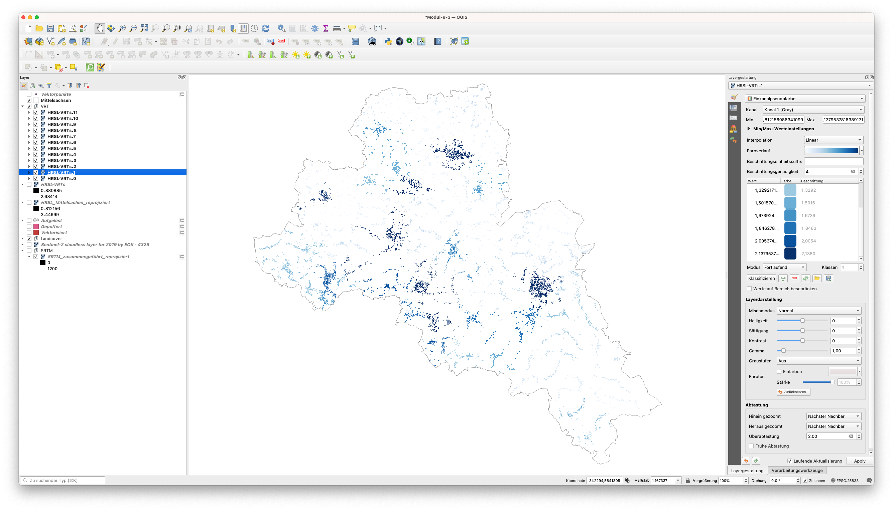

Figure 9.56 - Raster tiles for the Pampanga province HRSL 

Next, we will re-run the **Raster pixels to points** algorithm for each of the raster tiles. Because we have several tiles, we will use the batch processing function (see figure 9.57).


Figure 9.57 - Running raster to points for all raster tiles 

The resultant vector points should look like in figure 9.58. 


Figure 9.58 - Point vector dataset for the HRSL layer with pixel values stored in the VALUE column

Taking a closer look at the results of the algorithm, we can see that the vector points fall exactly in the center of the pixel they extract the value from (see figure 9.59.).


Figure 9.59 - Verifying the values of the point vector data vs. raster pixel values

To resolve the exercise, the sum of the values of points extracted from the HRSL product that fall within each polygon of the land cover product must be calculated. To do that, we will use a function that is available in Field Calculator - `aggregation()`. This function is quite powerful as it does spatial joins on the fly allowing various calculations. In our case, the function must identify the points that fall into each polygon and then sum up the values of those points. To do that, go the attribute table of the LC2019_Mode vector dataset and open the field calculator. Creating a new field, introduce the following expression:


```
aggregate(
    layer:= 'HRSL_vectors1',
    aggregate:='sum',
    expression:=VALUE,
    filter:=intersects($geometry, geometry(@parent))
)
```


Where, <code>layer<em> </em></code>is the name of the dataset from which we want to extract information (in our case, the point dataset that holds the pixel values of the HRSL raster layer), <code>aggregate</code> - indicates the action to be performed once the spatial join is confirmed (sum, count, mean, median, concatenate etc.), <code>expression - </code>indicates the what column we want to extract data from, <code>filter - </code>indicates<code> </code>the geometry function (intersect, within etc.) (see figure 9.60).


Figure 9.60 - Using built-in functions with field calculator

The results are, as expected, saved in the attribute table of the LC2019_Mode. And thus, the exercise has been completed. 

**Please, be aware! This last step can be excessively lengthy depending on the volume of your data! Test to find your best tiling dimensions.**

If using the Field Calculator and the aggregate function doesn't work, we can also use the **Join attributes by location (summary)** algorithm to compute for the sum of the values of the points inside the LC_Mode_vector features.


Figure 9.61 - Parameters of the Join attributes by location (summary) algorithm


Figure 9.62 - Output of the Join attributes by location (summary) algorithm

In this third phase of our module 9, we have worked with raster, as well as with vector data. We have taken a closer look at what resampling means and what are the implications of the rasters characteristics, such as coordinate reference system, spatial resolution etc. Most often, one must work with both raster and vector datasets and thus, it is important to know that it is possible in a number of ways. We’ve also tested a number of conversions, from raster to vector and vice-versa. However, in our processing we must not lose sight of the phenomena we are studying, as well as the initial scale at which the data has been collected, be it vector or raster. When performing conversions, it is important to know the correspondence between a map scale and raster resolution. According to cartographer Waldo Tobler “the rule is divide the denominator of the map scale by 1000 to get the detectable size in meters. The resolution is one half of this amount.” In other words, the formula would be:  `map scale = raster resolution (in m) X 2 X 1000. `

The solutions given to our exercises in this module, as in module 8 as well, are just one way to solve the requirements. As one advances the study of the open source tools for geospatial, one finds out that there are several possibilities to get to the same outcome - some better than others. 


#### Quiz questions 

1. What is the name of the process through which the resolution of a raster datasets can be made higher or lower?
*   _<span style="text-decoration:underline;">Resampling.</span>_ 
2. What does a histogram show us? 
*   <span style="text-decoration:underline;">The frequency of pixel values, arranged in adjacent value ranges.</span>
3. Can a raster dataset be converted to a polygon? What about the other way around?
*   <span style="text-decoration:underline;">Yes and yes. </span>


## References:

Center for International Earth Science Information Network - CIESIN - Columbia University. 2018. Gridded Population of the World, Version 4 (GPWv4): Population Density, Revision 11. Palisades, NY: NASA Socioeconomic Data and Applications Center (SEDAC). [https://doi.org/10.7927/H49C6VHW](https://doi.org/10.7927/H49C6VHW). Accessed DAY MONTH YEAR.

Resampling methods: [https://gisgeography.com/raster-resampling/](https://gisgeography.com/raster-resampling/)


<!-- Footnotes themselves at the bottom. -->
## Notes

[^1]:
     A primitive operation is a basic computation performed by an algorithm.  
[^2]:
     The temporal resolution depends on latitude. 
[^3]:
     JAXA is the Japan Aerospace Exploration Agency 
[^4]:
     For the sake of this exercise we will consider the DSM as a digital elevation model. For more details on the differences please see the Breakdown of concepts section
[^5]:
     The Geospatial Data Abstraction Library (GDAL) is a computer software library for reading and writing raster and vector geospatial data formats. 
[^6]:
     Sentinel-2 is an Earth observation mission from the Copernicus Programme that systematically acquires optical imagery at high spatial resolution (10 m to 60 m) over land and coastal waters. For more details go [here](https://sentinel.esa.int/web/sentinel/missions/sentinel-2). 