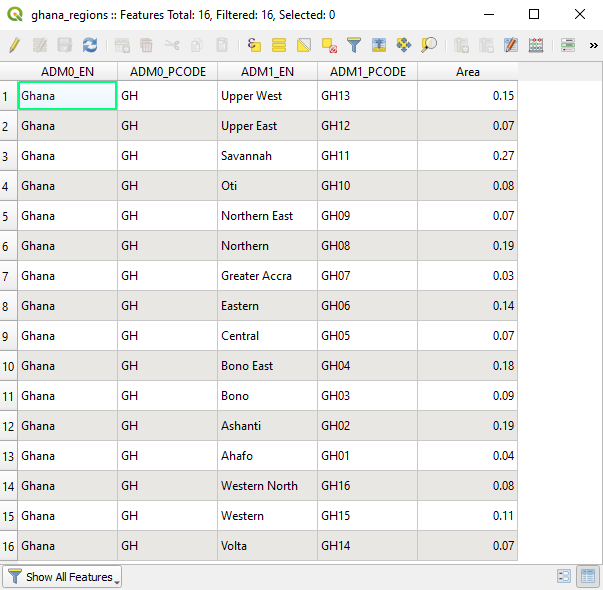
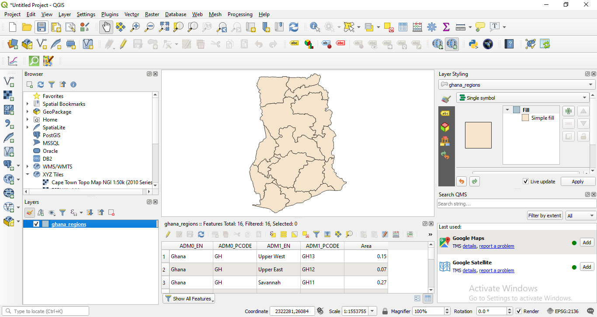
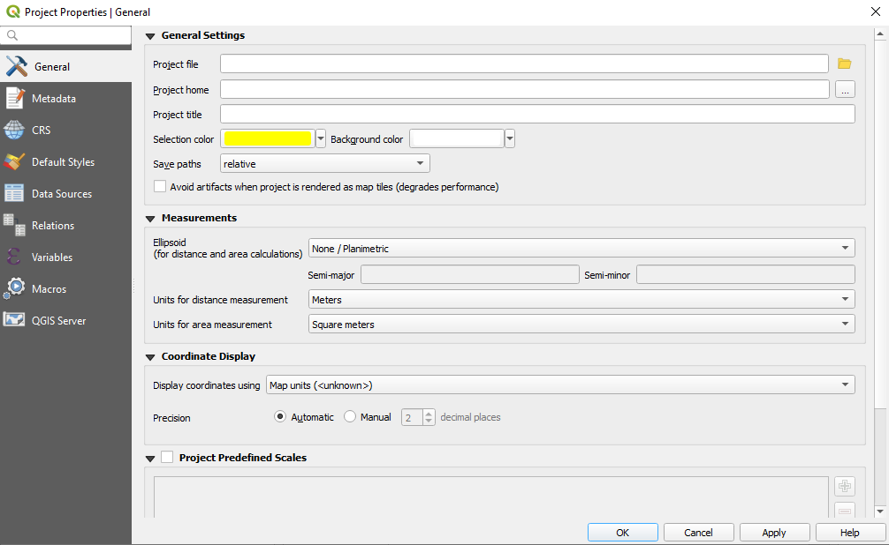
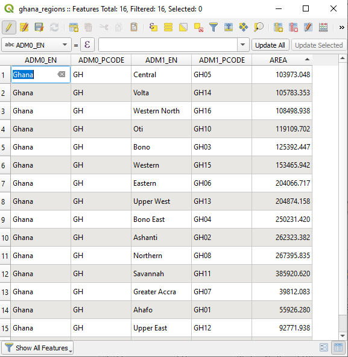
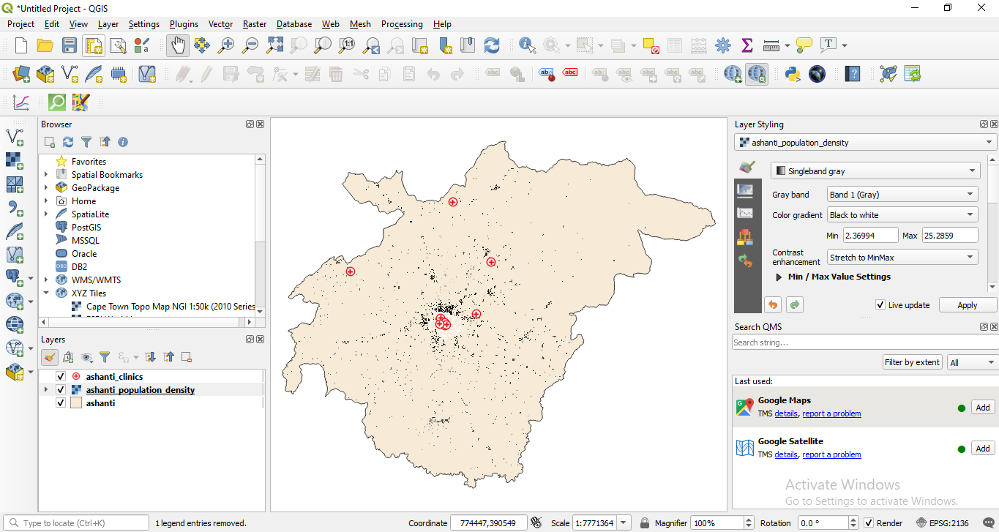
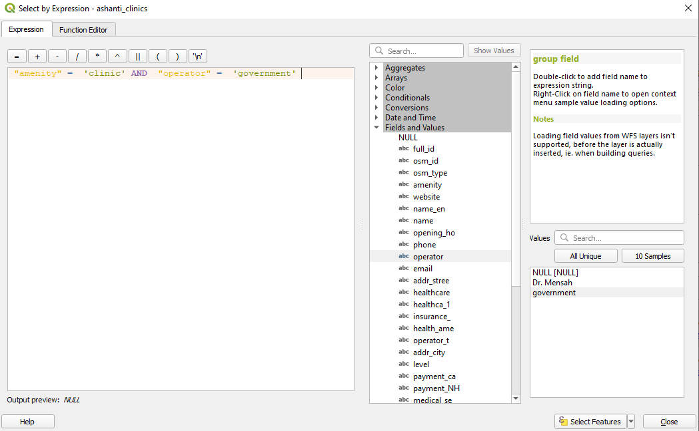
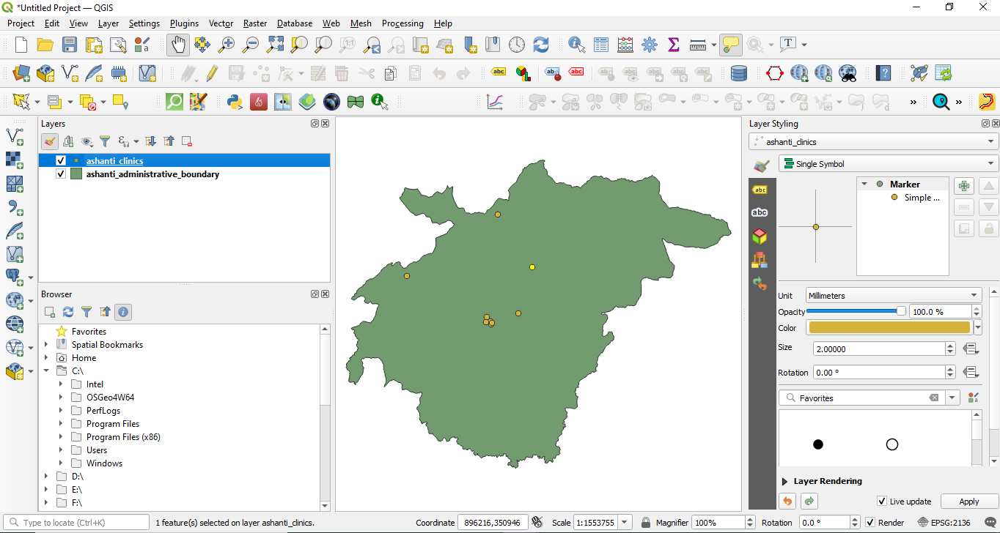
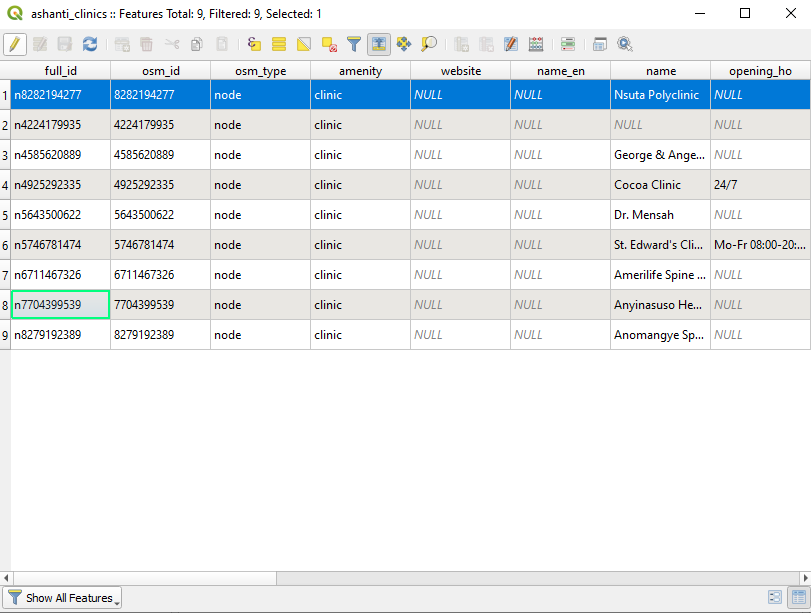

# Module 6 - Layer attributes

**Author**: Ketty

## Pedagogical Introduction

This module will provide you with an overview of the common steps needed to work with the attribute table and layer attributes in QGIS. At the end of the module you’ll be able to understand the following concepts;

*   Working with the attribute table
*   Using the field calculator
*   QGIS expression engine
*   Refactoring fields

Additionally, you will learn the following skills;

*   Introducing the attribute table interface
*   Interacting with features in an attribute table
*   Saving selected feature as new layer
*   Editing layer fields

You’ll use the field calculator and qgis expression engine to run mathematical operations and functions in QGIS. 


## Required tools and resources

*   Working computer
*   Internet connection
*   QGIS 3.16 and above
*   Ashanti administrative boundary layer (inside [module6.gpkg](https://drive.google.com/drive/folders/1WzEj7aTbUyJMn9BPz896B_XfKTEp2Qmm?usp=sharing))
*   Ashanti clinics (inside [module6.gpkg](https://drive.google.com/drive/folders/1WzEj7aTbUyJMn9BPz896B_XfKTEp2Qmm?usp=sharing))
*   Ghana regions (inside [module6.gpkg](https://drive.google.com/drive/folders/1WzEj7aTbUyJMn9BPz896B_XfKTEp2Qmm?usp=sharing))
*   [Ashanti High Resolution Settlement Layer](https://drive.google.com/drive/folders/1WzEj7aTbUyJMn9BPz896B_XfKTEp2Qmm?usp=sharing)


## Prerequisites

*   A fair knowledge of all previous modules
*   Basic knowledge of operating a computer


## Additional resources

*   Working with the Attribute Table - [https://docs.qgis.org/3.16/en/docs/user_manual/working_with_vector/attribute_table.html?highlight=layer%20attributes](https://docs.qgis.org/3.16/en/docs/user_manual/working_with_vector/attribute_table.html?highlight=layer%20attributes)
*   QGIS Expressions - [https://docs.qgis.org/3.16/en/docs/pyqgis_developer_cookbook/expressions.html](https://docs.qgis.org/3.16/en/docs/pyqgis_developer_cookbook/expressions.html)


## Thematic introduction

Let’s start with an example: 

In some cases, for instance for infrastructure planning purposes, you may want to know the area of the polygons in a layer. If you have one polygon, this would not be a problem. But what if you have many polygons/areas in the layer? To calculate each area one by one is almost impossible. The Philippines administrative boundary vector layer has many polygons which means it would be a good dataset for this tutorial. We are going to calculate the area for each polygon using an automated way. In total, the area of 81 provinces will be calculated. 


## Breakdown of the concepts

Much of the work you do when making a map involves working with layer attributes. Whether you’re drawing the layer, configuring a popup, performing analysis or visualising you need some level of knowledge of the layer’s fields and the values they contain. If it’s your own layer, you know and understand its attributes. But if it isn’t, how do you gain that knowledge? Likely, you inspect the field names and examine field values for some clues. And if you’re lucky, you’ll find some documentation that describes the layer’s attributes.

The attribute table displays information on features of a selected layer. Each row in the table represents a feature (with or without geometry), and each column contains a particular piece of information about the feature. Features in the table can be searched, selected, moved or even edited.Specifically, there are two new field properties that describe the values contained in a field;


*   **Field description** –  a few words, a sentence, or a paragraph of text that describes the values in the field. 
*   **Field value type** – a keyword that categorizes the type of values contained in the field. The keyword helps people understand how to use the values and allows QGIS and other client applications to make smarter suggestions for working with them, for example, the values types in the field may be integer, string, boolean, double or floating point

Here’s an example; Suppose you have a land parcel layer that has these fields:

*   Parcel ID – Integer
*   Owner – String
*   Street Address – String
*   Property Description – String
*   Buildings – Integer
*   Land Area – Double
*   Assessed Value – Double
*   Assessment Date – Date

If you were to describe these field values, you might write something like this:

*   Parcel ID – the unique identifier of the parcel
*   Owner – the name of the property owner
*   Street Address – the location of the parcel
*   Property Description – the legal description of the property
*   Buildings – the number of buildings on the parcel
*   Land Area – the size of the parcel in acres
*   Assessed value – the value of the parcel and buildings in dollars
*   Assessment Date – the date of the last assessment

In looking at these descriptions, some words stand out, like: identifier, name, location, description, number of, size, value, and date. These are the _keywords_ that describe what the field values are. The field value type keywords are constructed from these types of words. They are:

*   Name or Title
*   Description
*   Type or Category
*   Count or Amount
*   Percentage or Ratio
*   Measurement
*   Unique Identifier
*   Ordered or Ranked
*   Binary
*   Location or Place Name
*   Coordinate
*   Date and Time

In the parcel layer example above, the Parcel ID field is an integer field. If the field value type indicates the field values represent a unique identifier rather than a count, QGIS would not suggest drawing this field attribute using graduated colors or symbols.

In addition, other concepts like the field calculator functionality in the attribute table allows one to perform calculations on basis of existing attribute values or defined functions, e.g to calculate length, area or population density. Note that the possible calculations are determined by the attributes or make up of your data. For example, it’s only possible to calculate population density if there’s a field with population counts. Using the expression engine and field calculator, you would then go on to construct an expression or formula to calculate population density. In this case the formula would be; total population as a number of people/the land area covered by that population. You’ll notice that it’s important to know what each of the fields in the layer attribute table represents. This means you need to know and understand your data thoroughly. This makes it easier to apply functions and expressions and therefore come up with meaningful analyses and visualizations/map products. 


### Phase 1 title: Editing layer attributes

#### **Content/Tutorial**

The attribute table displays information on features of a selected layer. Each row in the table represents a feature (with or without geometry), and each column contains a particular piece of information about the feature. Features in the table can be searched, selected, moved or even edited.


1. Load the Ghana regions vector layer (found inside [module6.gpkg](https://drive.google.com/drive/folders/1WzEj7aTbUyJMn9BPz896B_XfKTEp2Qmm?usp=sharing)) in QGIS. You can know how many features are in the current feature by **Right-clicking on the layer on the Layers Panel ‣ Show Feature Count**. As you can see below, the vector layer has many features. In total, there are 16 features corresponding to 16 regions.


Figure 6.1: Several polygons


2. The next step is to explore the attribute table interface. Open the attribute table by **Right-clicking on the layer on the Layers Panel ‣ Open Attribute Table**. You can also click the **Open Attribute Table button**  from the Attributes Toolbar. This is what the attribute table looks like. The tool bar has a range of buttons, hover over each button to see the embedded functionality.



Figure 6.2: Open attribute table

If you don't want the attribute table to be a floating window but rather dock it on the QGIS interface, you can click the **Dock attribute table button** . When docked, attribute tables will appear as tabs instead of individual windows.



Figure 6.3: Docked attribute table


3. For area calculations, the Coordinate Reference System should be a projected one. This allows you to calculate distances correctly. Remember, our interest is to automatically calculate the area for each of the 81 provinces. Check the Coordinate Reference System of the vector layer. If it’s a geographic coordinate reference system, then reproject the layer to a projected coordinate system. Check for different projections on the [EPSG](https://epsg.io/?q=Philippines%20kind%3APROJCRS) website. This is Ghana, we’ll use [Accra/Ghana National Grid] (https://epsg.io/2136), EPSG:2136. From previous modules where map projections are extensively discussed, you may already know that map projections are applied relative to a given location on earth. 

4. Check the project Settings; Go to: **Project ‣ Properties Properties ‣ General**.



Figure 6.4: General settings

5. Next, Click the **Open field calculator**  button on the Attributes Toolbar to open the field calculator. The field calculator dialogue will open; fill in the output field name, in this case it will be ‘AREA (SQ KM)’. Choose the Decimal number (double) on the output field type. Change the precision to 2 decimal places. To calculate the area, use the following expression:

```
$area / 1000000
```

 You can find this expression under **Geometry**. Click OK and it will automatically calculate the area for each polygon. Take note that the area computation is dependent on the coordinate reference system used so you may have different results depending on what CRS you used. You can also search and find information about expressions on the right side of the Field Calculator or Expression Builder.


Figure 6.5: Field calculator dialogue

6. Open the attribute table to see the result. You just edited the contents of the attribute table, in an automated way as opposed to typing the values in each cell one by one. 



Figure 6.6: New attribute table with new field and attributes


#### **Quiz questions**

1. An attribute table is a database or tabular file containing information about a set of geographic features

2.  Geographic features are usually arranged so that each row represents a feature and each column represents one feature attribute

3. It is necessary to reproject layers prior to area calculations when the layer has a geographic coordinate reference system


#### **Quiz answers**

1. True
2. True
3. True


### Phase 2 : Understanding and working with attribute data, queries and analysis

#### **Content/Tutorial**

At this point, you might notice that the attribute table stores both spatial and non-spatial data. In this tutorial you’ll discover ways of working with attribute table data. For example, Using expressions, select Clinics in Pampanga with an emergency facility, all using data from the attribute table. 

1. Add the following datasets of the Philippines to the QGIS map canvas; 

*   Ashanti administrative boundary layer (inside [module6.gpkg](data/module6.gpkg))
*   Ashanti clinics (inside [module6.gpkg](data/module6.gpkg))
*   Ghana regions (inside [module6.gpkg](data/module6.gpkg))
*   [Ashanti High Resolution Settlement Layer](data/ashanti_population_density.tif)



Figure 6.7: Add different layers

2. The selection will be applied to the Clinics layer, therefore Open the attribute table for the Clinic layer. Click the select features using expression  button and type the following expression in the expression builder;

```
"amenity" = 'clinic' AND "emergency" = 'yes'
```

You’ll notice that the expression has a number of predicates like the comparison sign (=), the logical predicate (AND) and a string which is enclosed in single quotes (‘ ‘). There are also two attribute names(amenity, emergency) and their values (clinic,yes). 



Figure 6.8: Select by Expression builder dialogue

3. One Clinic is selected. You can see the selection highlighted in yellow. The selected clinic is also highlighted in the attribute table. Now we know there’s only one clinic with an emergency facility in Pampanga province.



Figure 6.9: Selected clinic/feature is highlighted (yellow)




Figure 6.10: Selected clinic/feature is highlighted (blue)


It’s also possible to make selections by clicking a feature  within the map canvas. 

Developing a functional expression starts with understanding your data; for example the attributes and   the values they hold. Then asking the right questions and finally, developing the correct expression, putting into consideration all mathematical rules that make an error free expression.


#### **Quiz questions**

1.  These operators are provided by the expression builder.  {+, -, *}
2.  Single quotes must enclose a string.
3. The attribute table stores only non spatial data.


#### **Quiz answers**

1. True
2. True
3. False


### Phase 3 title : Advanced QGIS expressions 

The Expression builder dialog offers access to the:

* Expression tab ([https://docs.qgis.org/2.18/en/docs/user_manual/working_with_vector/expression.html#functions-list](https://docs.qgis.org/2.18/en/docs/user_manual/working_with_vector/expression.html#functions-list)) which, thanks to a list of predefined functions, helps to write and check the expression to use;
* Function Editor tab ([https://docs.qgis.org/2.18/en/docs/user_manual/working_with_vector/expression.html#function-editor](https://docs.qgis.org/2.18/en/docs/user_manual/working_with_vector/expression.html#function-editor)) which helps to extend the list of functions by creating custom ones.


#### **Content/Tutorial**

There are many use cases for expressions, here are some examples. Notice how the expressions are developed and what operators or predicates are used. Also important is the fact that all these expressions are developed based on the content of the dataset. You may adapt this to your dataset of choice.

1. From Field Calculator, calculate a “pop_density” field using existing “total_pop” and “area_km2” fields:
    
```
"total_pop" / "area_km2"
```

2. Update the field “density_level” with categories according to the “pop_density” values:
    
```
CASE WHEN "pop_density" < 50 THEN 'Low population density'
     WHEN "pop_density" >= 50 AND  "pop_density" < 150 THEN 'Medium population density'
     WHEN "pop_density" > 150 THEN 'High population density'
END
```

3. Apply a categorized style to all the features according to whether their average house price is smaller or higher than 10000 shillings per square metre: 
```
"price_m2" > 10000
```

4. Using the “Select By Expression...” tool, select all the features representing areas of “High population density” and whose average house price is higher than 10000 pesos per square metre:
    
```
"density level" = 'High population density' and "price_m2" > 10000
```

5. Likewise, the previous expression could also be used to define which features should be labeled or shown in the map. 


#### **Quiz questions**

1.  Both Field calculator and Select by Expression dialogue can be used to develop expressions -- ***True***
2.  Expressions can be used to update a new field -- ***True***
3.  Expressions can be used to apply a style  -- ***True***
