# Module 5 - Making Maps

**Author**: Ketty 

## Pedagogical Introduction

This module will provide you with an overview of the common steps needed to complete a map in QGIS. At the end of the module, participants will know the following concepts;

*   Map canvas and related layers 
*   The print layout and print layout 
*   Map elements and properties

In addition you’ll have learned the following skills;

*   Using the print layout to make a map
*   Adding map elements to the map
*   Managing different print layouts

## Required tools and resources

*   Working computer
*   Internet access
*   QGIS 3.16 or later
*   Kiambu administrative boundary layer (inside [module5.gpkg](data/module5.gpkg))
*   Kiambu clinics (inside [module5.gpkg](data/module5.gpkg))
*   Kiambu counties (inside [module5.gpkg](data/module5.gpkg))
*   [Kiambu High Resolution Settlement Layer](data/kiambu_population_density.tif)

## Prerequisites

*   Basic knowledge of operating a computer
*   An understanding of all previous modules

## Additional resources

*   QGIS Map LayOut - [https://docs.qgis.org/3.16/en/docs/training_manual/map_layout/map_layout.html](https://docs.qgis.org/3.16/en/docs/training_manual/map_layout/map_layout.html )
*   Layout Templates - [https://layout-hub.github.io/](https://layout-hub.github.io/)
*   Style Manager - [https://docs.qgis.org/3.16/en/docs/user_manual/style_library/style_manager.html](https://docs.qgis.org/3.16/en/docs/user_manual/style_library/style_manager.html)
*   Style Library - [https://docs.qgis.org/3.16/en/docs/user_manual/style_library/index.html](https://docs.qgis.org/3.16/en/docs/user_manual/style_library/index.html)

## Thematic introduction

Let’s start with an example: 

To make a map, you’ll need a topic you may want to understand better, for example ‘Spatial distribution of clinics across Kiambu county' in Kenya. You'll notice the topic provides both a theme to explore and the geographic location. Armed with this information and the relevant data that allows you explore the question further, you may proceed to make a map.

Breakdown of the concepts

This module will focus on the following key map making concepts; map canvas and related layers, the print layout and map elements and properties. First, here are short definitions on each; 

*   the **map canvas and related layers**: is probably the most important widget within QGIS because it shows the map composed from overlaid map layers and allows interaction with the map and layers. This is covered in the Module 0: Introduction to QGIS
*   the **print layout and print layout** : The print layout provides growing layout and printing capabilities. It allows you to add elements such as the QGIS map canvas, text labels, images, legends, scale bars, basic shapes, arrows, attribute tables and HTML frames. With the Print layout you can create nice maps and atlases that can be printed or saved as PDF-file, an image or an SVG-file. This is a powerful way to share geographical information produced with QGIS that can be included in reports or published. You can save the layout as a template and load it again in another session. Finally, generating several maps based on a template can be done through the atlas generator. The image below shows the print layout and print layout interface. This interface opens when you open a new print layout.

Figure 5.1: Print layout

*   **map elements and properties**: Maps contain lots of information. Most maps will have the five following things: a Title, a Legend, a Grid, a Compass Rose to indicate direction, and a Scale. The Title tells you what is being represented on the map

## Main content

### Phase 1 title: Exporting the map canvas

In this tutorial, we’ll show two ways to ‘Export the map canvas’ to the QGIS print layout. The first method is straightforward while the second method explores the more advanced capabilities provided by the print layout.

#### **First method: Export the map canvas without the print layout**

1. The data layers should already be added to the QGIS canvas. The layers can then be styled to communicate information in your data. Add map decorations by clicking **View ‣ Decorations**. Select your preferred map decoration. For example you may add the Title label, Scale bar and Copyright Label. For each decoration you’ll have to specify settings in a dialogue box.
2. The final step is to export the map to either image or pdf format. To do this, Click **Project ‣ Import/Export** and then select your prefered export format. The export dialogue below should appear.

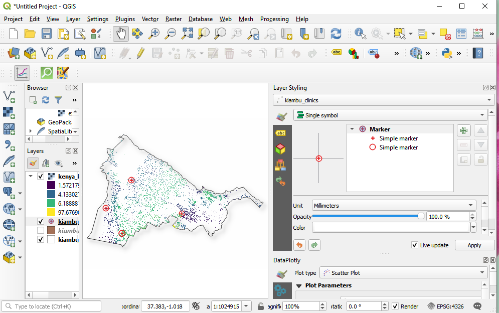

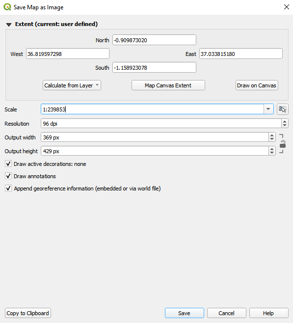

Figure 5.2: Exporting the map

3. Click **Save**. The map in the qgis canvas will be saved as a pdf or image document. Browse to the location where the file is saved and you’re now able to print or share the map.

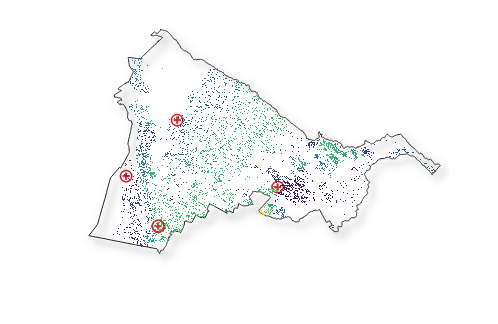

Figure 5.3: Map canvas exported as image

#### **Second method: Export the map canvas to the print layout**

1. In this tutorial, we’ll make a map showing the 1.) location of health centres and 2.) population density of Kiambu County in Kenya. The data layers should already be added to the QGIS canvas. The layers can then be styled to communicate information in your data.

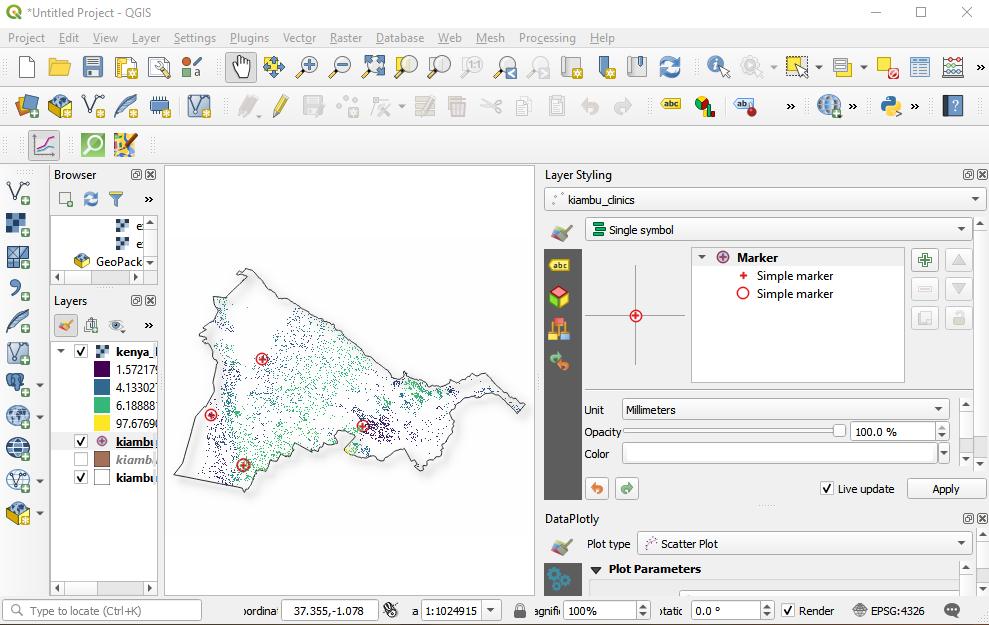

Figure 5.4: Creating new Print Layout

2. The map canvas can now be exported to the print Layout. Click the ‘new print layout layout button’ . This can be accessed via the tool bar. Alternatively, access using the ‘Projects’ menu bar. A title dialogue will open, prompting you to type the title of the Print Layout. Type ‘Kiambu’ and Click OK.

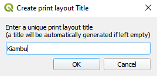

Figure 5.5: Naming the Print Layout

3. The print layout will open

Figure 5.6: The Print Layout window

4. You’ll notice the print layout canvas is empty. To add the styled map from the QGIS canvas, Click the ‘Add new map to layout button’ , left click your mouse and draw a rectangle in the white space at the center of the print layout. The map should be added. You’ve just exported a map to the print layout. It’s now possible to add all other map elements like the title, legend, grids etc. 

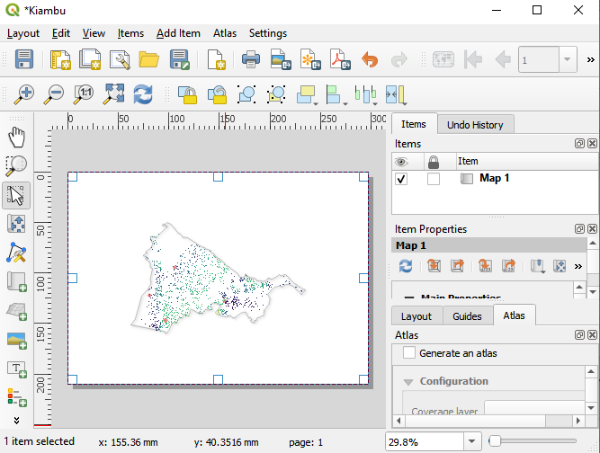

Figure 5.7: Add map to Print Layout

#### **Quiz questions**

1. What is the qgis map canvas? (check boxes)
2. What is the use of the print layout? (check boxes)
3. Which of the following is not a map element? (radio button)
    
#### **Quiz answers**

1. a. shows the map composed from overlaid map layers
   b. allows interaction with the map and layers
   c. a widget for making maps

2. a. provides growing layout and printing capabilities
   b. allows you to add map elements
   c. handle both exporting and printing of maps

3. a. Title
   b. Scale
   c. Legend
   d. Colors and designs

### Phase 2 title: Adding and editing map elements to the print layout 

#### **Content/Tutorial**

Now that the styled map has been added to print layout, it’s now time to add the relevant map elements like the title, scale, legend, grid, metadata etc to the print layout. Most of the buttons are located to the left of the print layout.

1. Click the ‘Add label’ 
button, hold down the left mouse button and draw a rectangle where you’d like to place the title of the map. Type the title under the ‘Main properties’ menu on the right side of the print layout. The font properties can be changed under the ‘Appearance’ menu item.

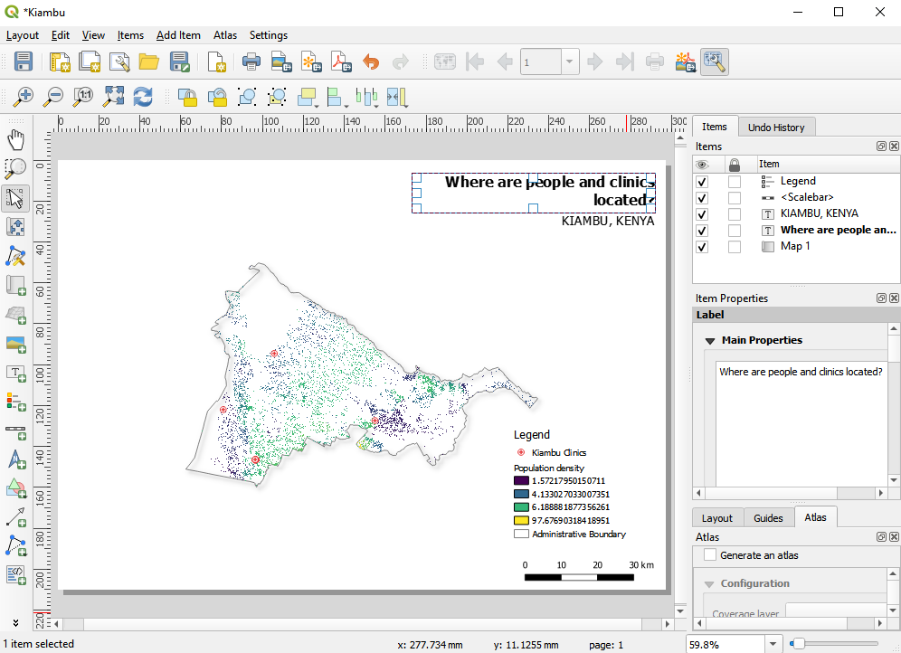

Figure 5.8: Add title of the map

2. Next, we’ll add the legend and scale. A data attribution statement can be added using the ‘Add label’ button Hover over the button on the left of the print layout and click the preferred button. Follow the same steps as in 1. Above to add the map element to the print layout. You can add other map elements but be careful that the map doesn’t get too cluttered. 

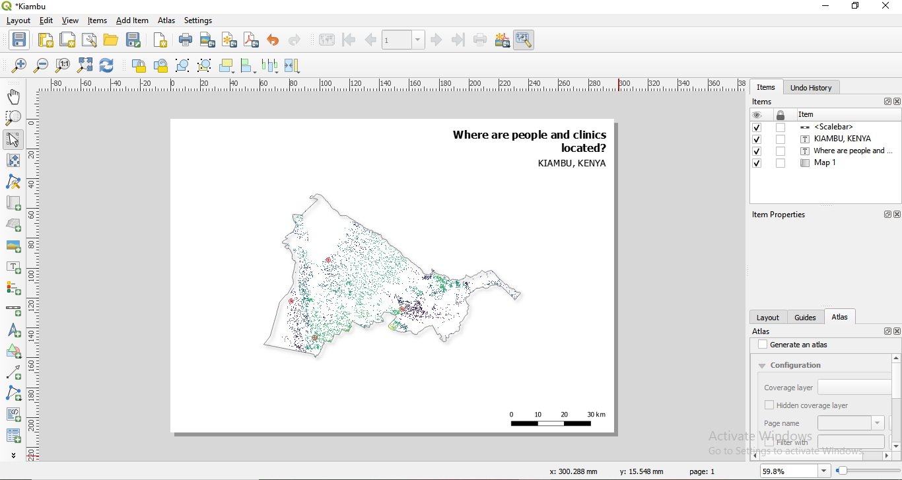

Figure 5.9: Add scale bar to the map

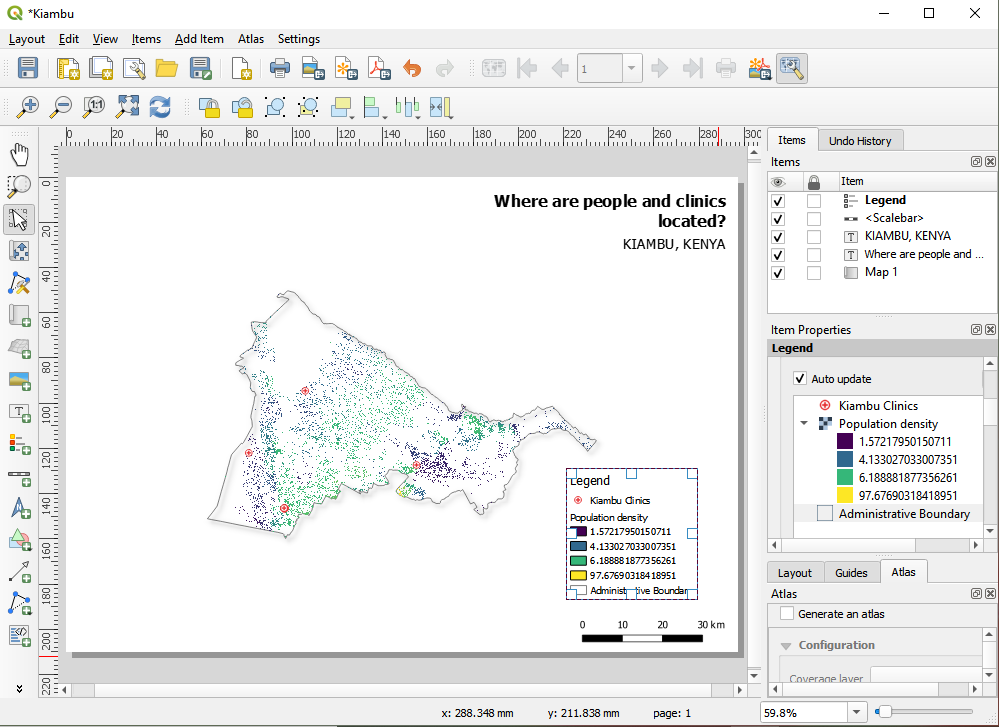

Figure 5.9: Add legend to the map

Figure 5.10: Add attribution to the map

3. If the map layout is satisfactory, the map can be exported as a pdf, png, jpeg or svg, ready for printing otherwise save the layout. All saving functionality can be accessed via the ‘layout’ menu.

4. Save the map as an image using via **Layout ‣ Export as Image...** or by clicking the **Export as Image** button . QGIS will ask you what file to save the map to as well as the image parameters.

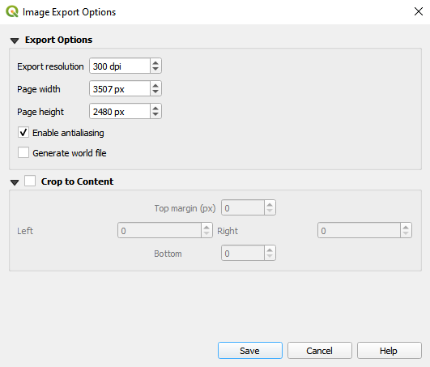

Figure 5.10: Add attribution to the map

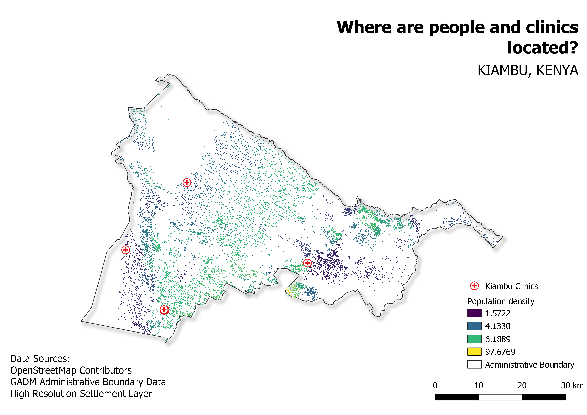

Figure 5.11: Exported map as imgage

#### **Quiz questions**

1.  Under which of the following tabs can you change the properties of map elements? (radio button)
2. What’s the difference between the print layout and print layout
3. How can you add attribution text to the map layout

#### **Quiz answers**

1. a. Composition
   b. Item properties
   c. Atlas generation
2. Print layout allows you to add maps from the map canvas while the print layout allows you to compose your map
3. Add a title box, then type the attribution text. Note that the title box allows you to add all forms of text to your map.

### Phase 3 title : Automating map creation using Atlas capabilities

#### **Content/Tutorial**

If your organization publishes printed or online maps, you often would need to create many maps with the same template - usually one for each administrative unit or a region of interest. Creating these maps manually can take a long time and if you want to update these on a regular basis, it can turn into a chore. QGIS has a tool called Atlas that can help you create a map template and easily publish a large number of maps for different geographic regions. We’ll take the different counties of Kenya as an example, here’s Administrative Boundaries for the 81 provinces;

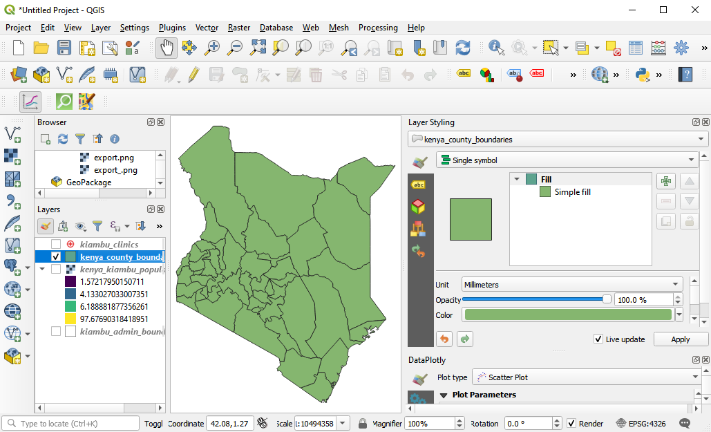

Figure 5.12: Coverage layer

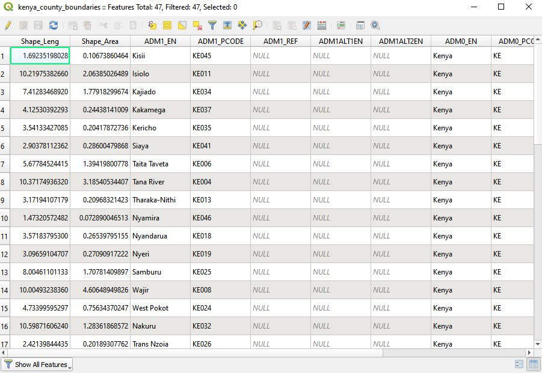

Figure 5.13: Attribute table

1. This layer will serve as out coverage layer which means that the QGIS Atlas will 1 map for each of the features in this coverage layer. All in all, 81 maps will be generated.

2. Open or create a new Print Layout and add a map.

Figure 5.14: Atlas Print Layout

3. In the right pane of the Print Layout, make sure to select the **Atlas** menu and check the **Generate an atlas** box. You can also open the Atlas Settings using the Atlas Settings button  on the Atlas toolbar.

Figure 5.15: Atlas Generation

3. The next step is to choose the coverage layer; The coverage layer is the index layer used to create each page. One map/page for the Atlas will be generated for each feature in the coverage layer. In our case, using the PHL_provinces coverage layer will create a map for each of the 81 provinces. QGIS Atlas dynamically changes the view-extent to each feature in the coverage layer. You can opt to make the coverage layer hidden in the maps that you create (i.e. the coverage layer will not be visible in the Print Layout) and select what to name each page of your Atlas. You can also perform some filtering and sorting of the coverage layer if you need to. For the **Output**, you can opt to have a single file as an output by checking the **Singe file export when possible** checkbox. If unchecked, you will generate 1 file per map.

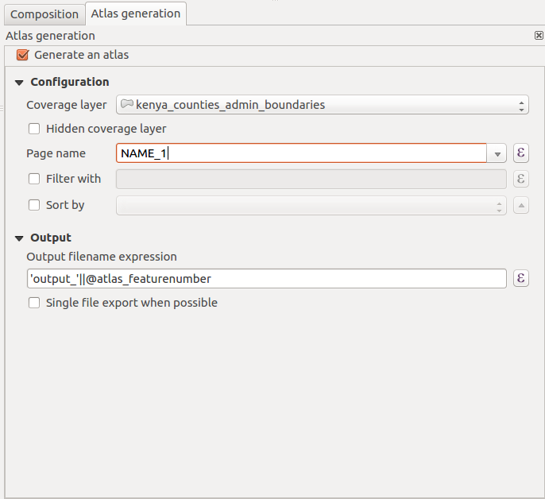

Figure 5.16: Select Coverage Layer

4. Now that we've set the coverage layer, we should tell the Print Layout to use the atlas to control the extent of the maps (area visible on the printable map) that we will generate. In the **Item Properties** tab, check the box for **Controlled By Atlas**

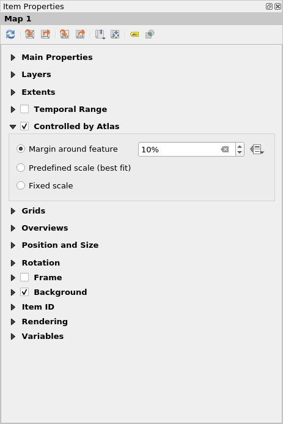

Figure 5.17: Make sure that the map extent is controlled by the Atlas

5. To preview your Atlas, click on the Preview Atlas button  on the Atlas Toolbar. This will show you the 81 maps that you generated. Use the Atlas toolbar  to navigate the Atlas maps. 

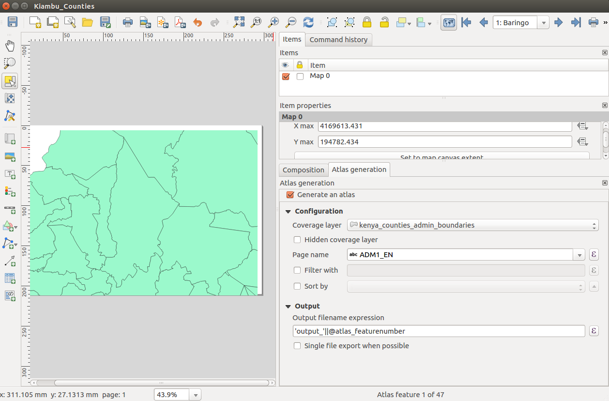

Figure 5.18: Atlas Preview

6. You can export the Atlas maps via the **Export Atlas** button  either as images or PDFs. Select **Export Atlas as Image**. You should have 81 maps generated wher each map shows the extent of the province.

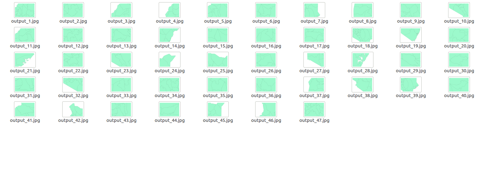

Figure 5.18: Atlas Outputs

7. **TIP**: For this example we only mapped the coverage layer. The power of the Atlas is when we map several layers. For example, we have the clinics, road network, and population density data for the entire country loaded as layers in QGIS. We would then want to create one map for each of the provinces showing these same layers. Using the Atlas would require us to only create one layout template and let the Atlas handle the generation of the other maps based on the coverage layer that we use.

8. **TIP**: You can use QGIS Expressions and Data Defined overrides for setting the other map elements in your Atlas so that they also dynamically change depending on the coverage layer feature being mapped. For example, you can use a QGIS expression calling the value of the NAME_1 field on your label so that it dynamically changes into the value of NAME_1 for the current feature being mapped.

For more information about the QGIS Atlas, see: [https://www.youtube.com/watch?v=tOnMJBUvEjY](https://www.youtube.com/watch?v=tOnMJBUvEjY).

#### **Quiz questions**

n/a

#### **Quiz answers**

n/a
