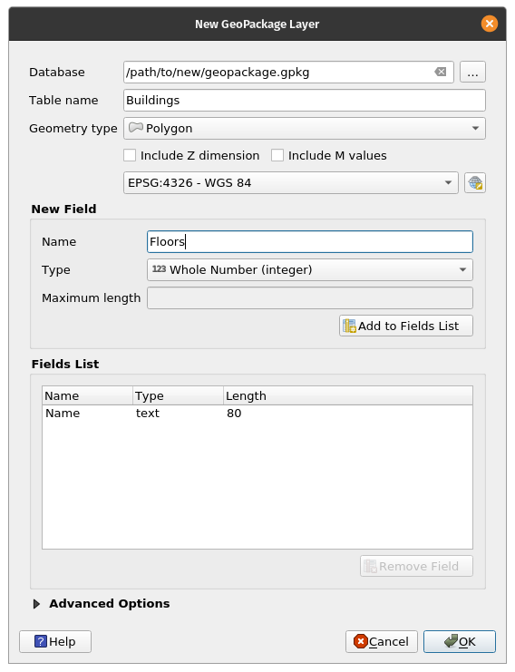
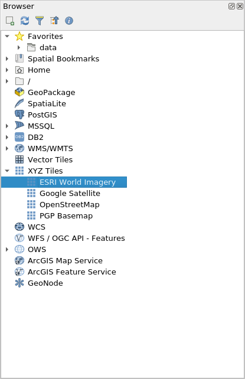
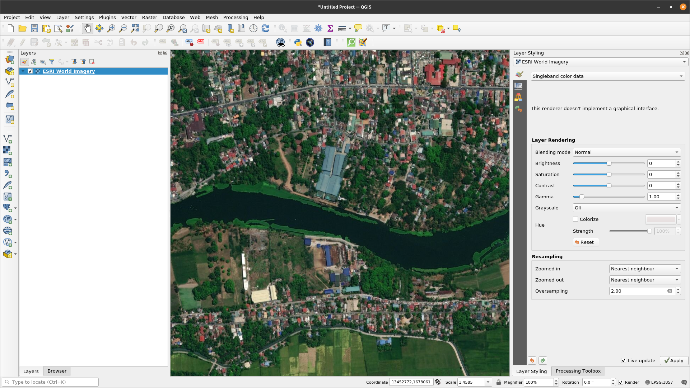
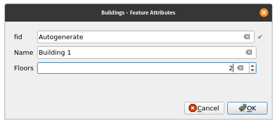
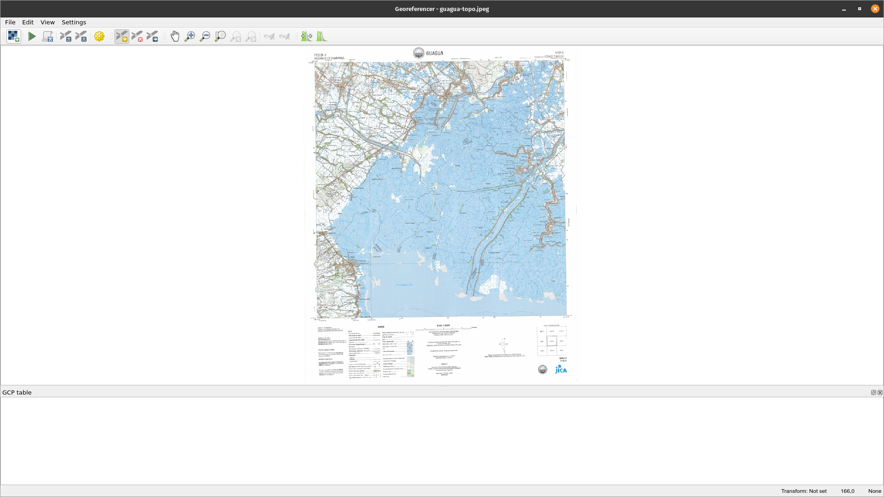
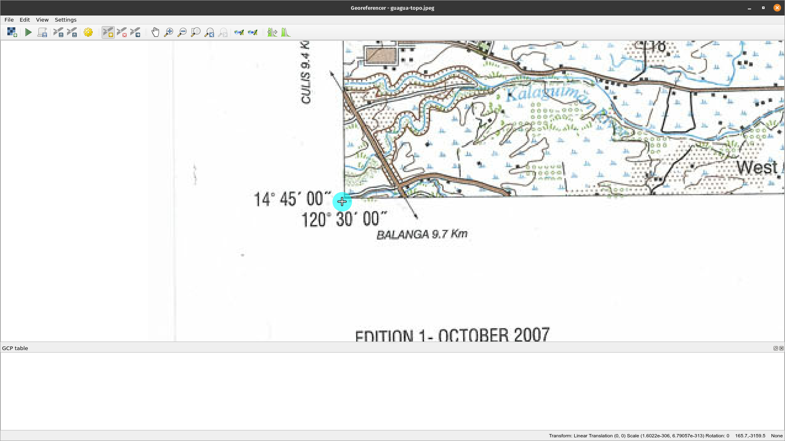
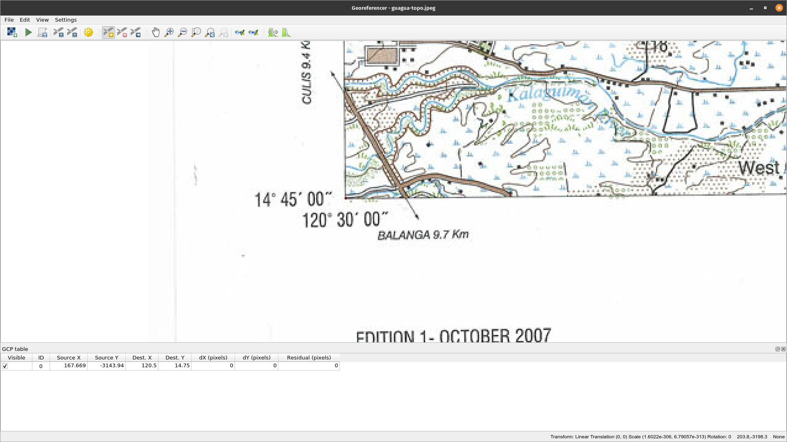
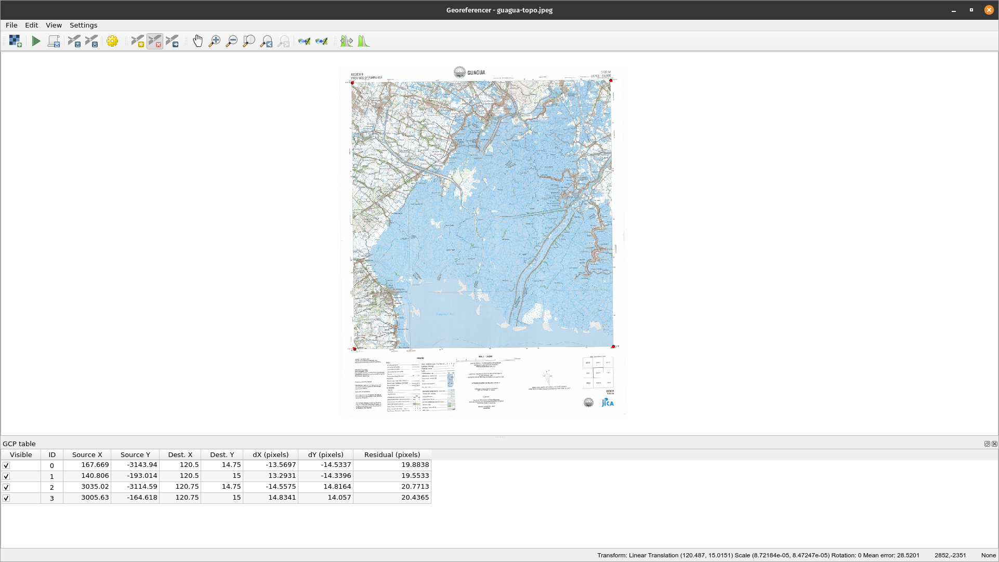
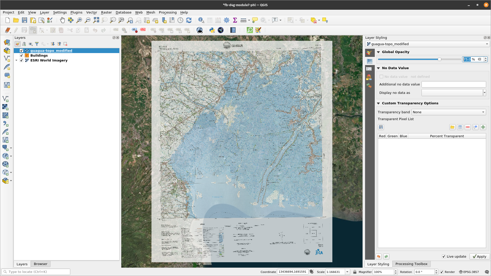

# Module 7 - Creating and Editing Layers

**Author**: Ketty

## Pedagogical Introduction

This module is designed to teach you how to use QGIS tools to create a new GIS layer. You'll learn concepts like digitizing and georeferencing. In addition, you’ll learn  the following concepts;

*   Digitizing 
*   Georeferencing
*   Working computer
*   Internet access
*   QGIS 3.16 or later
*   [Topo Map of Guagua, Pampanga](data/guagua-topo.jpeg)

## Prerequisites

*   A fair knowledge of all previous modules
*   Basic knowledge of operating a computer

## Additional resources

*   Creating Layers - [https://docs.qgis.org/3.16/en/docs/user_manual/managing_data_source/create_layers.html](https://docs.qgis.org/3.16/en/docs/user_manual/managing_data_source/create_layers.html)
*   Digitizing Forest Stands - [https://docs.qgis.org/3.16/en/docs/training_manual/forestry/stands_digitazing.html?highlight=digitizing](https://docs.qgis.org/3.16/en/docs/training_manual/forestry/stands_digitazing.html?highlight=digitizing)
*   Further reading: [Georeferencing a Map](https://docs.qgis.org/3.16/en/docs/training_manual/forestry/map_georeferencing.html?highlight=georeferencing)

## Thematic introduction

Let’s start with an example: 

Let’s imagine that your department is planning to build new hospitals for the province. They may want to conduct an environmental pre-assessment for the planned infrastructure project. The assessment may involve conducting research on available data. As you might imagine, there is a great deal of geographic data available in formats that can not be immediately integrated with other GIS data. Some of this data may be in the form of old maps, high resolution satellite imagery or remotely sensed imagery which is often used for making digital maps like Google Maps or OpenStreetMap. Creating and Editing is good for updating changes to your layers or database. This is where Creation and Editing of layers comes in. One way in which new data can be created in a GIS is through digitizing. Other methods include georeferencing, scanning and vectorization, clipping, selecting and then saving. It’s important to remember that the created data is dependent on the uniqueness of the original source. For example the image below shows that each image product will produce a unique dataset.

Figure 7.1: Remotely sensed images of different coastlines. A. Interferometric Synthetic Aperture Radar (IFSAR) data (using microwaves to collect data for creating representative images), B. topographic and bathymetric lidar data (height and elevation data represented by colors), C. hyperspectral imagery (adding color to invisible energy), and D. digital photography (human eye visible colors represented as themselves)

## Breakdown of the concepts

Digitizing in GIS is the process of “tracing”, in a geographically correct way, information from media/maps. The process of georeferencing relies on the coordination of points on the scanned image (data to be georeferenced) with points on a geographically referenced data (data to which the image will be georeferenced). By “linking” points on the image with those same locations in the geographically referenced data you will create a transformation that converts the location of the entire image to the correct geographic location.

 on top of an aerial photo")

Figure 7.2: Here, buildings have been digitized (traced) on top of an aerial photo

Georeferencing, on the other hand is the process of taking a digital image, it could be an airphoto, a scanned geologic map, or a picture of a topographic map, and adding geographic information to the image so that GIS or mapping software can 'place' the image in its appropriate real world location.

## Main content

QGIS allows you to create new layers in different formats. It provides tools for creating GeoPackage, Shapefile, SpatiaLite, GPX format and Temporary Scratch layers (aka memory layers). Editing allows you to add, delete and modify features in vector data sets. The first step is to put the data set into edit mode. Select the layer in the Layers panel and click Layer | Toggle Editing. Alternatively you can right click on a layer in the Layers panel and choose Toggle Editing from the context menu. Multiple layers can be edited at a time. The layer currently being edited is the one selected in the Layers panel. Once in edit mode the Digitizing Toolbar can be used to add, delete and modify features.

Digitising, as you might have guessed, is the art (or science) of creating digital vector data from another source, such as a raster image. In order to begin digitising, we must first enter edit mode. GIS software commonly requires a separate mode for editing, to prevent users from accidentally editing or deleting important data. Edit mode is switched on or off individually for each layer.

### Phase 1 title: Creating a new GeoPackage layer or Shapefile

#### **Creating a new GeoPackage layer**

1. To create a new GeoPackage layer, press the New GeoPackage Layer button 
 in the Layer ‣ Create Layer menu or from the Datasource Manager toolbar. The New GeoPackage Layer dialog will be displayed as shown in Figure 7.3.

Figure 7.3: New GeoPackage Layer dialogue

2. The first step is to indicate the database file location. This can be done by pressing the  button to the right of the Database field and select an existing GeoPackage file or create a new one. QGIS will automatically add the right extension to the name you provide.
3. Type a name for the new layer / table a name (Table name)
4. Define the Geometry type. If not a geometryless layer, you can specify whether it should Include Z dimension and/or Include M values.
5. Specify the coordinate reference system using the  button

6. To add fields to the layer you are creating:

    1. Enter the Name of the field
    2. Select the data Type. Supported types are Text data, Whole number (both integer and integer64), Decimal number, Date and Date and time, Binary (BLOB) and Boolean.
    4. Depending on the selected data format, enter the Maximum length of values.
    5. Click on the Add to Fields List  button

7. Reproduce the steps above for each field you need to add
8. Once you are happy with the attributes, click OK. QGIS will add the new layer to the legend, and you can edit it as described in section

#### **Creating a new Shapefile**

1. To create a new ESRI Shapefile format layer, press the  New Shapefile Layer… button in the Layer ‣ Create Layer ‣ menu or from the Data Source Manager toolbar. The New Shapefile Layer dialog will be displayed as shown in Figure 7.4.

Figure 7.4: New shapefile layer dialogue

2. Provide a path and file name using the … button next to the File name field. QGIS will automatically add the right extension to the name you provide.
3. Next, indicate the File encoding of the data
4. Choose the Geometry type of the layer: No Geometry (resulting in a .DBF format file), point, multipoint, line or polygon
5. Specify whether the geometry should have additional dimensions: None, Z (+ M values) or M values
6. Specify the coordinate reference system using the   button, you may select the universal WGS 84 which is well suited for web mapping projects across the globe

7. To add fields to the layer you are creating:
    1. Enter the Name of the field
    2. Select the data Type. Only Decimal number, Whole number, Text data and Date attributes are supported.
    3. Depending on the selected data format, enter the Length and Precision.
    4. Click on the Add to Fields List  button

8. Reproduce the steps above for each field you need to add
9. Once you are happy with the attributes, click OK. QGIS will add the new layer to the legend, and you can edit it as described in the next Phase, ‘Digitizing an existing layer of this module.

### Phase 2 title: Digitizing an existing layer

#### **Content/Tutorial**

This tutorial will show how to create a new shapefile using auxiliary data like satellite imagery provided by Google. In practice accurate ground truth data will be available. This would be accurate qualitative data about the topological feature. It’s important to know what feature you’d like to create beforehand, for example is it a point, line or polygon vector layer. When we create the layer, we must define what type of data it will contain. The purpose of this tutorial is to create a data type that can easily be manipulated, analysed and stored using a GIS system, hence the need to create vector files. We’ll create polygon features as an example;

1. Before you can add new vector data, you need a vector dataset (a layer) to add it to. In our case, we’ll begin by creating a new data layer, and then we’ll add features to it. First, we must define our dataset.
2. Create a new project in QGIS by clicking on the _New Project_  icon.
3. Go to _Layer ‣ Create Layer ‣ New GeoPackage Layer_. You’ll be presented with the following dialog:

Figure 7.5: New GeoPackage dialogue

At this point we must decide what kind of dataset we want to create. Remember that a data layer can only contain features of points, lines or polygons - never a mix. When we create the layer, we must define what type of data it will contain.

Since polygons are made up of points and lines, let’s create polygons. Once you’ve mastered this, creating a point or a line layer should be easy!

Within the dialogue, specify a file name for the new file, file encoding, geometry type, the CRS and add specify data for the New Field. Add other field names. This requires a predesigned data model that properly captures all information about the said feature.

4. The second step is to add the ESRI World Imagery satellite layer to QGIS map canvas. We added this in a previous module and should be available to use in the **Browser Panel** under **XYZ Tiles**.

Figure 7.6.1: QGIS canvas after adding ESRI World Imagery layer

5. Zoom in the image until you can see features such as rooftops, roads, trees, etc. The rooftops can act as a 2D proxy for buildings, thus we’ll digitize the newly created building layer.

Figure 7.6.2: ESRI World Imagery layer zoomed in

6. Let’s enter edit mode for the _buildings_ layer
7. Select _buildings_ in the Layers panel
8. Click on the _Toggle Editing_  button
9. If you can’t find this button, ensure that the Digitising toolbar is enabled. There should be a check mark next to the _View ‣ Toolbars ‣ Digitizing_ menu entry
10. Once you are in edit mode, the digitising tools will become active

Figure 7.7: Digitizing tools

From left to right on the image above, they are:

*   **Toggle Editing**: activates / deactivates edit mode.
*   **Save Layer Edits**: saves changes made to the layer.
*   **Add Feature**: start digitising a new feature.
*   **Move Feature(s)**: move an entire feature around.
*   **Node Tool**: move only one part of a feature.
*   **Delete Selected**: delete the selected feature (only active if a feature is selected).
*   **Cut Features**: cut the selected feature (only active if a feature is selected).
*   **Copy Features**: copy the selected feature (only active if a feature is selected).
*   **Paste Features**: paste a cut or copied feature back into the map (only active if a feature has been cut or copied).

We want to add a new feature.

11.  Click on the _Add Feature_   button to start digitizing. We’ll digitize the buildings
12. Start by clicking on a point somewhere along the edge of the building
13. Place more points by clicking further along the edge, until the shape you’re drawing completely covers the field. This is very similar to drawing a polygon. The beginning vertex and end vertex must touch, otherwise it remains a line.
14. To place the last point, **right-click where you want it to be**. This will finalise the feature and bring up the Attributes dialog.
15. Fill in the values as shown here

Figure 7.8.1: Digitizing new feature

Figure 7.8.2: Adding the attributes

16. Click _OK_. You’ve created a new feature!

Figure 7.8.3: New feature created

If you make a mistake while digitising a feature, you can always edit it later. Simply finish     digitising the feature and then follow these steps:

* Select the feature with the _Select Feature_ tool

*   Then use one of these tools to edit the feature

<table>
  <tr>
   <td>

   </td>
   <td>Move feature(s) tools
   </td>
   <td>Move the entire feature(s)
   </td>
  </tr>
  <tr>
   <td>

   </td>
   <td>Node tools
   </td>
   <td>move only one point where you may have misclicked
   </td>
  </tr>
  <tr>
   <td>

   </td>
   <td>Delete selected
   </td>
   <td>get rid of the feature entirely so you can try again
   </td>
  </tr>
  <tr>
   <td>Go to Edit ‣ Undo or press Ctrl+Z on keyboard
   </td>
   <td>Undo mistakes
   </td>
   <td>
   </td>
  </tr>
</table>

17. Now try it on your own, digitize all the buildings in the image.

### Phase 3 title: Georeferencing a Topo map

#### **Content/Tutorial**

To georeference the map;

1. Open the Georeferencer tool, Raster ► Georeferencer 
2. Click the Add raster button  to add the map image file, [Topo Map of Pampanga ](data/guagua-topo.jpeg), as the image to georeference. The topographic map will be added to the georeferencer canvas. You may now zoom in to read the details of the map. One way to do this is by reading the metadata and legend information at the bottom and then relating it to the features on the map.

Figure 7.9: Map in Georeferencer canvas

Next you should define the transformation settings for georeferencing the map:

3. Open Settings ► Transformation settings or click the Transformation Settings button .
4. Click the  icon next to the Output raster box, go to the folder and create the folder 'pampanga data’ and name the file as pampanga_georef.tif.
5. Set the rest of parameters as shown below

Figure 7.10: Transformation parameters

When selecting the transformation parameters, the things to consider are:
* the map’s complexity and distortion (regular-shaped maps normally only need to use simple transformation parameters)
* the number of GCPs that you can get on the map -- the more complex the transformation type, the more GCPs are needed to get good results.
* the distribution of GCPs on the map -- poor GCP distribution results in more distortion especially in higher order transformation equations.
* more (or more complex) is not always better.

| Order of Transformation | Minimum GCPs Required |
|:-----------------------:|:---------------------:|
|            1            |           3           |
|            2            |           6           |
|            3            |           10          |
|            4            |           15          |
|            5            |           21          |
|            6            |           28          |
|            7            |           36          |

Just to be safe, always have at least one more than the minimum to add redundancy.

6. Click OK.
7. The map contains several cross-hairs marking the coordinates in the map, we will use those to georeference this image. You can use the zooming and panning tools as you usually do in QGIS to inspect the image in the Georeferencer’s window.
8. Zoom in to the left lower corner of the map and note that there is a cross-hair with a coordinate pair, X and Y, that as mentioned before are in the CRS, PRS 1992 also written as PRS 92, as referenced in the legend of the topo map.
9. Click the Add point button   and click in the intersection of the cross-hairs (pan and zoom as needed).
10. In the Enter map coordinates dialogue write the coordinates that appear in the map (Y: 14° 45’ 00’’ and X: 120° 30’ 00’’).

Figure 7.11.1: Enter map coordinates

Figure 7.11.2: Enter map coordinates

11. Click OK.

The first coordinate for the georeferencing is now ready. Below is a screenshot of what to expect  at this point

Figure 7.12: First coordinate for the georeferencing

12. Zoom out in the image and move to the right until you find other crosshair, and estimate how many kilometres you have moved. Try to get ground control points as far from each other as possible. Digitize at least three more ground control points in the same way you did the first one. Tip: Make sure the points are fairly equally distributed across the image for example in all four corners of the image or at equal distances to each other. This affects the performance of the transformation algorithm. Which in turn results in higher error rates.

13. With already three digitized ground control points you will be able to see the georeferencing error as a red line coming out of the points. The error in pixels can be seen also in the GCP table in the dX[pixels] and dY[pixels] columns. The residuals should not be higher than a threshold that you set, if it is you should review the points you have digitized and the coordinates you have entered to find what the problem is. You can use the image above as a guide.

14. Add more control points until you are happy with the expected results.
14. You can save the GCPs vial **File ► Save GCP points as…**.
15. Finally, georeference your map with **File ► Start georeferencing** or the Start Georeferencing button .

Figure 7.13: GCPs added

Figure 7.14: Georeferenced map loaded in QGIS

Note: To check that your data is properly georeferenced you can open the topo map. Your map and this image should match quite well. Set the map transparency to 75% and compare it to the aerial image.

#### **Quiz questions**

1.  What is digitizing in GIS? (check-boxes)
2.  Which of the following auxiliary datasets will support digitizing? (check boxes)
3.  What factors may affect accuracy of data during digitizing?(radio button)
4. What may be done to improve accuracy? (check boxes)
5. Why is a data model important when creating new data? (radio button)

#### Quiz answers

1. a. the process of converting geographic data either from a scanned image or digital image into vector data by tracing the features
   
   b. describes the pure analog-to-digital conversion of existing data and documents
   
   c. process by which coordinates from a map, image, or other sources of data are converted into a digital format in a _GIS_
   
   d. refers to creating a digital representation of physical objects or attributes

2. a. GPS data points
   
   b. Topographic maps
   
   c. Satellite imagery
   
   d. Graphs and Tables

3. a.  Resolution of the data (Spatial, Temporal, Radiometric)
   
   b. Lighting
   
   c. Location of the feature
   
   d. Type of feature

4. a. get accurate data sources
   
   b. set data quality goals
   
   c. review the data and re-edit or revert edits

5. a. allows capture comprehensive information about the feature
   
   b. automates the process
   
   c. captures digitizing errors
