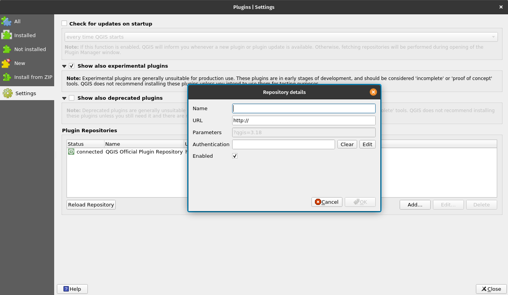
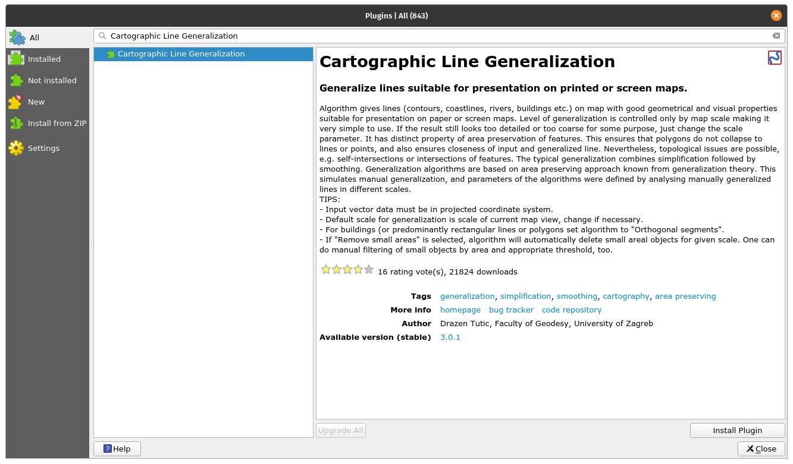
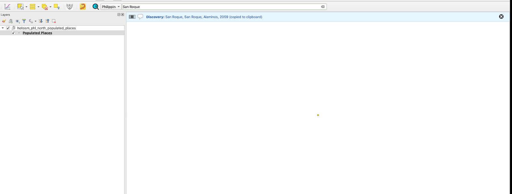
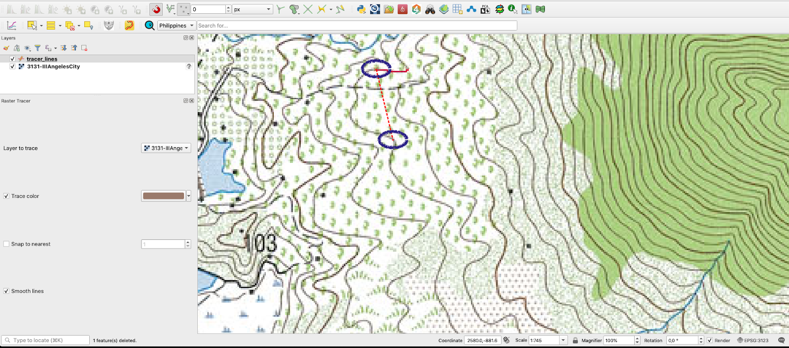
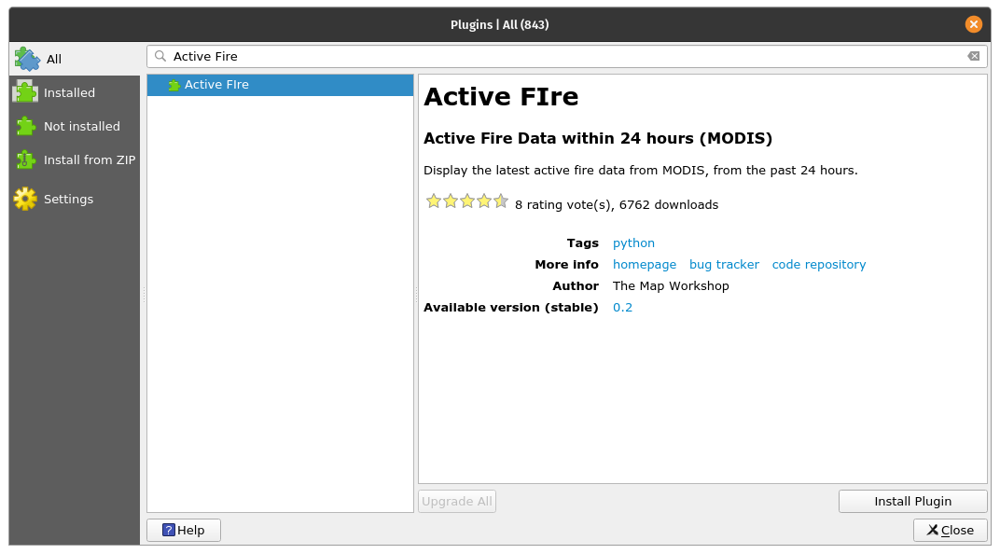
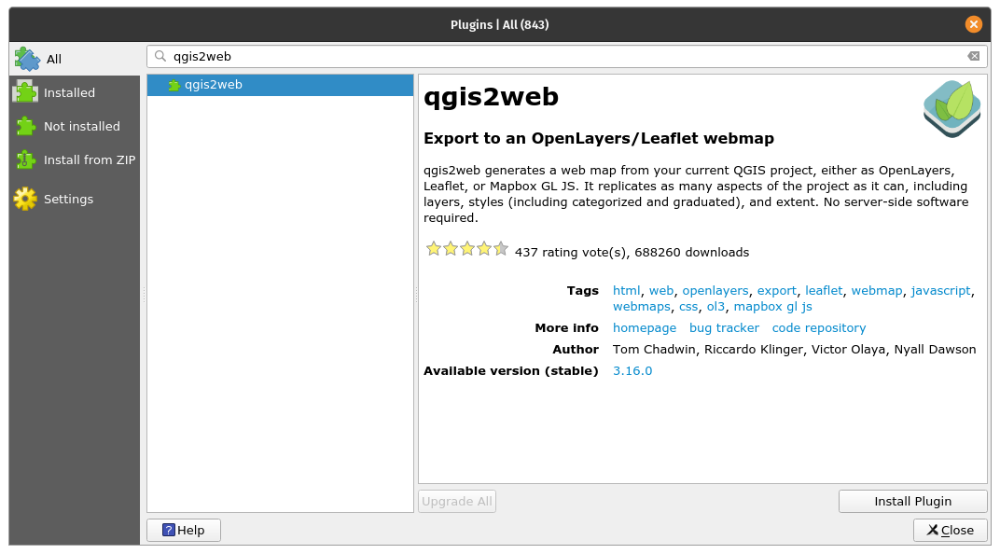
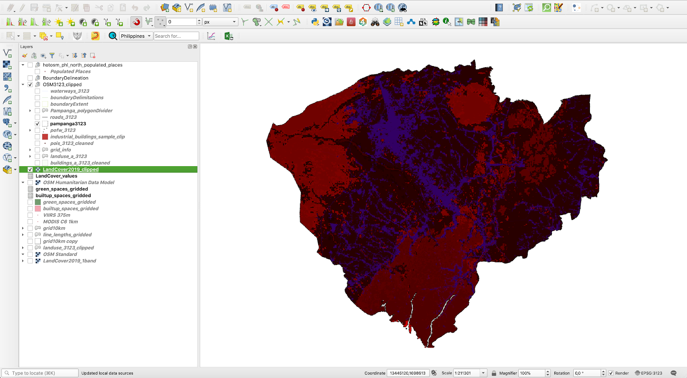
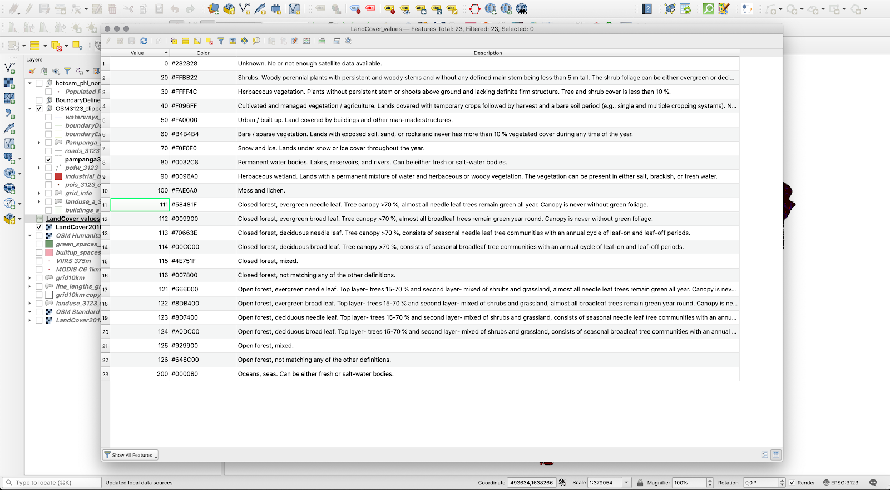
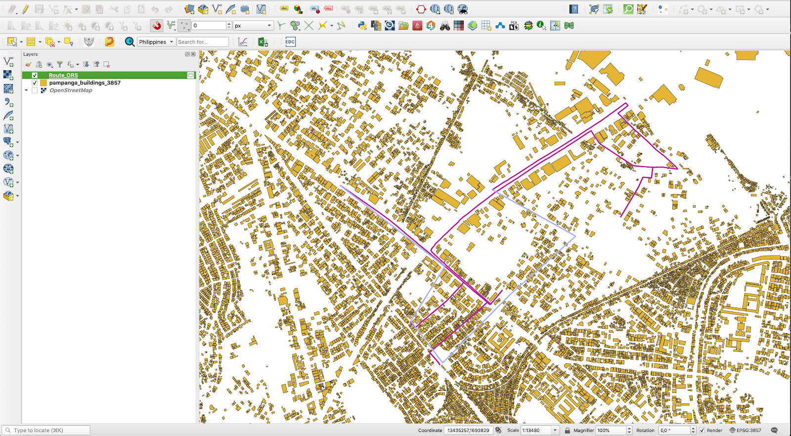

# Module 10 - QGIS plugins

**Tác giả**: Codrina

**Biên dịch và bản địa hoá**: Quách Đồng Thắng

## Giới thiệu chung

Module này sẽ giới thiệu một số plugin thú vị và hữu dụng nhất mà cộng đồng QGIS đã phát triển và sẵn dùng cho mọi người.

## và học được các kỹ năng sau:**

*   Cách tìm kiếm và cài đặt plugin mới
*   Cách chuyển giữa các plugin repository khác nhau.
*   Các đọc tài liệu plugin và những gì cần tìm.
*   Chi tiết một số chức năng của các plugin thông dụng nhất.

## Các công cụ và tài nguyên cần thiết**

*   [QGIS version 3.16.1 - Hannover](https://qgis.org/en/site/forusers/download.html)

## Yêu cầu về kỹ năng: 

*   Kiến thức cơ bản về vận hành máy tính
*   Nắm vững tất cả các module, vì các plugin được giới thiệu sẽ áp dụng cho nhiều khái niệm/ yếu tố mà bạn đã học trong giáo trình này, như vector, raster, attribute table, các quy tắc bản đồ và nhiều thứ khác.  

## Nội dung chính 

### Phase 1: Giới thiệu plugin**

Một trong nhiều lợi thế của cộng đồng mã nguồn mở - nhà phát triển phần mềm cũng như người dùng - là tốc độ đáng kinh ngạc của sự phát triển và cải tiến, cách mà các ý tưởng mới phát xuất và đưa vào thực tế. 

Như bạn đã thấy trong Module 1, QGIS được thiết kế với kiến trúc 'plugin', cho phép dễ dàng tuỳ chỉnh theo nhu cầu của người dùng bằng cách thêm vào các plugin. Thực tế, QGIS là sự kết hợp của các **core** và **external plugins**. Các core plugins tạo thành cấu trúc chính, được bảo trì bởi QGIS Development Team và luôn được bao gồm trong bản cài đặt, như Processing core plugin, Zonal Statistics hoặc Plugin Manager. Theo thời gian, các external plugin khác nhau có thể biến thành core plugin.  

Tất nhiên, với các nguyên tắc mã nguồn mở, cùng với các tài liệu tuyệt với và chi tiết sẵn dùng và nhiều kênh giao tiếp và các sự kiện chuyên đề, người dùng có thể học cách xây dựng mô5t plugin đế đáp ứng nhu cầu sử dụng. Và đó là một **external plugin**. Trên [trang web](https://plugins.qgis.org/), bạn có thể tìm tất cả các tài liệu cần thiết. Hầu hết các external plugin được viết bằng Python, nhưng cũng có thể viết bằng C++.

Trong phase 1 này, chúng ta sẽ khám phá cách cài đặt QGIS plugin - cách tìm một plugin để giải quyết một yêu cầu cụ thể, cách đọc hiểu các tài liệu và cách báo cho nhà phát triển nếu có lỗi xảy ra trong quá trình sử dụng plugin.

### Plugin manager**

QGIS cung cấp một core plugin cho phép người dùng quản lý, cài đặt, cập nhật và gỡ cài đặt các external plugin. Chức năng này khá trực quan, cung cấp truy cập đầy đủ đến các kho plugin công khai chính thức.

Cần nhấn mạnh rằng các external plugin - chính thức hoặc thử nghiệm - đều là sản phẩm của các nhà phát triển các nhân hoặc tổ chức, và tổ chức QGIS không chịu bất cứ trách nhiệm nào. Tuy nhiên, có một số quy t9a1c mà nhà phát triển phải tuân thủ nếu muốn chia sẻ plugin của họ trên kho lưu trữ chính thức, cũng như các khuyến nghị để được chấp nhận nhanh chóng. Các yêu cầu bao gồm các yếu tố như giấy phép tương thích, tài liệu tối thiểu, xác định rõ ràng các yếu tố phụ thuộc và các yếu tố khác. Các khuyến nghị bao gồm việc kiểm tra xem plugin có trùng lặp với các plugin đã có hay không, lưu trữ mã nguồn rõ ràng, tương thích với tất cả hệ điều hành như Windows, Linux, macOS, và nhiều thứ khác.

Experimental plugins - như được gắn nhãn trong plugin manager - là các plugin đang trong giai đoạn phát triển bản đầu, không bảo đảm sử dụng trơn tru. Chúng được xem là kiểm tra "bằng chứng về khái niệm" và người dùng không được khuyến cáo cài đặt trừ khi có ý định sử dụng cho mục đích thử nghiệm.

Tất nhiên, để xem các experimental plugin, trong Plugin manager settings, chọn  `Show also experimental plugins` (Hình 10.2a). Cũng có thể liệt kê các deprecated plugin, nhưng không được khuyến khích vì các plugin này không còn được bảo trì nữa.

Hai loại plugin đưỢc phân biệt rõ ràng trong Plugin Manager (xem Hình 10.1 và 10.2b)

Hình 10.1 - Official plugins trong Manager plugin

Hình 10.2a - Tuỳ chọn hiển thị experimental plugins

Hình 10.2b - Experimental plugins trong Plugin Manager

Một khía cạnh khác đáng nói là Plugin Manager khá linh hoạt, cho phép các nhà phát triển thêm vào private repository - kho lưu trữ riêng của họ (xem Hình 10.3)

Hình 10.3 - Thêm private plugin repository vào QGIS

Điều này là hữu ích, nếu ví dụ, bên trong tổ chức của bạn có nhu cầu nhiều plugin hơn, nhưng không thuân thủ các yêu cầu để có thể đưa lên kho lưu trữ chính thức của QGIS. Bạn có thể tham khảo cách thiết lập plugin repository của riêng bạn trên [GIS OPS](https://gis-ops.com/qgis-3-plugin-tutorial-set-up-a-plugin-repository-explained/). 

Một cách đơn giản hản là zip plugin lại và chia sẻ file zip này để cài đặt plugin. Tuy nhiên, cách này không được khuyến khích.

Ngoài mục Settings, người dùng có thể chú ý là có một số tab khác ở bên trái như `All, Installed, Not installed, New, Invalid, Install from ZIP` 

Sau khi quyết định loại plugin nào sẽ được liệt kê trong Plugin Manager, người dùng có thể chọn `All` để xem tất các các plugin xuất hiện như thế nào trong Plugin Manager. Để minh hoạ, hãy thử tìm `Cartographic Line Generalization` plugin

Như bạn thấy, Plugin Manager có một thanh tìm kiếm để người dùng có thể gõ các tứ khoá tìm kiếm phù hợp với yêu cầu cụ thể. Trong trường hợp của chúng ta, từ khoá là ‘cartographic/cartography’

Hình 10.4 - Tìm kiếm một plugin cụ thể trong Plugin Manager

Có thể thấy, phía bên phải là các thông tin mô tả plugin. Cấu trúc các thông tin này được chuẩn hoá và bắt buộc phải có cho từng plugin.

Các metadata cho mỗi plugin bao gồm:

1. Tên gọi plugin và phụ đề mô tả chức năng
2. Mô tả - chi tiết mô tả tuỳ thuộc vào nhà phát triển
4. Số lượt download, số sao bình chọn mà plugin nhận được từ cộng đồng;
5. Các từ khoá được chọn bởi nhà phát triển (mà người dùng có thể tìm kiếm bằng các từ khoá này)
7. Một loạt các link quan trọng: trang web, **bug tracker** và code repository
9. Tên của nhà phà triển, cũng như tổ chức liên kết. Đôi khi, tên gọi của dự án mà plugin được phát triển cũng được liệt kê;
10. Phiên bản của plugin với chú thích _stable_ or _experimental_;
11. Hình ảnh đại diện cho plugin

Trong Hình 10.5, các thành phần metadata như trên đều được xác định

Hình 10.5 - Tài liệu mô tả plugin

Ở góc phải dưới cửa sổ, chọn ` Install plugin` để cài đặt, và một biểu tượng hoặc menu của Plugin sẽ được thêm vào giao diện QGIS.

Điều quan trọng đề cập ở đây là, thông thường, vì hạn chế về không gian, phần mô tả trong Plugin Manager không bao quát hết. Do đó, để hiểu rõ nhất liệu plugin có đáp ứng nhu cầu hay không, người dùng phải tham khảo tại trang web của plugin. Trong trường hợp của chúng ta, thấy rằng trang chủ của plugin cũng chính là trang code repository - trên Gitlab, nhưng không phải trường hợp nào cũng vậy (xem Hình 10.6)

Hình 10.6a - Trang chủ của plugin

Figure 10.6b - Metadata chi tiết trên trang chủ của plugin

Một khía cạnh rất quan trọng khác cần nhấn mạnh về thông tin của plugin là trang **bug tracker**. Một hệ thống bug tracker là một ứng dụng phần mềm lưu vết tất cả các sự cố của phần mềm (issues/ bugs). Trong trưỜng hợp này bug tracker được hỗ trợ bởi code repository Github (Hình 10.7)

Figure 10.7 - Bug tracking system trong Github cho một QGIS plugin

Chi tiết cách báo cáo một sự cố phần mềm trên Github nằm ngoài phạm vi của Module này, tuy nhiên cần điểm qua một số điều quan trọng. Đầu tiên, hệ sinh thái mã nguồn mở nói chung và GIS nói riêng hoạt động tốt nhất khi tất cả các bên tham gia đều hoạt động tích cực theo vai trò của học, nghĩa là nhà phát triển sẽ viết code và người dùng kiểm tra và phản hồi các vấn đề/ lỗi nếu có. Nếu tìm kiếm nhanh các bug trackers của [QGIS](https://github.com/qgis/QGIS/issues) hoặc [GRASS](https://github.com/OSGeo/grass/issues), hoặc các phần mềm mã nguồn mở khác, bạn sẻ thấy hoạt động rất mạnh mẽ. Điều này là tốt vì nó cho thấy cộng đồng năng động, và sự tương tác giữa nhà phát triển và người dùng hoạt động bình thường. Thứ hai, trước khi báo cáo một lỗi nào đó, hảy chắn rằng bạn đã tìm kiếm kỹ trên mạng về giải pháp cho vấn đề của bạn, nếu không bạn sẽ bị chê cười vì không dành thời gian làm bài tập!

#### **Câu hỏi**

1. Bạn có cần nhập hoàn chỉnh tên của plugin để tìm trên Plugin Manager?
*   Không, chỉ cần nhập keyword. 
*   Có. 
2. Các official và experimental plugin có trong cùng một repository?
*    Đúng, miễn là bật tuỳ chọn ‘Show the experimental plugins’ trong Plugin Manager. 
*   Sai, các experimental plugin nằm ở repository khác
3. Kể 2 hoặc 3 thông tin mà người dùng có thể tìm thấy trong tài liệu mô tả plugin:
*   Tên và mô tả, số lượt download, trang chủ, code repository, tên của nhà phát triển, tóm tắt mô tả.

### Phase 2:  Một số Plugin thú vị của QGIS **

Plugin có thể được chia thành nhiều loại khác nhau, tuỳ thuộc vào những gì được coi là quan trọng. Sau đây, chúng tôi xác định 02 cách phân loại:

*   Mức độ phát triển
    *   Official - plugin hoạt động ổn định, tài liệu đầy đủ và có thể sử dụng thực sự; 
    *   Experimental - plugin đang ở giai đoạn phát triển ban đầu, phù hợp cho mục đích thử nghiệm;
    *   Deprecated - plugin không được tiếp tục bảo trì, nghĩa là nó không được cập nhật phiên bản mới, nhà phát triển có thể không phản hồi các báo cáo lỗi, chỉ được sử dụng nếu không có cách nào khác để giải quyết vấn đề.
*   Thể loại: 
    *   Vector; 
    *   Raster;
    *   Web;
    *   Database;
    *   Cartography. 

Cần chú ý rằng một số plugin hoạt động như cầu nối cho phép QGIS truy cập đến các CSDL bên ngoài, cliud, dịch vụ, trong trường hợp đó, các yếu tố bổ sung có thể được yêu cầu - như một tài khoản tả tiền cho các dịch vụ, cloud hoặc API key. Một ví dụ minh hoạ là Planet Explorer Plugin từ Planet Inc (Hình 10.8)

Hình 10.8 - Ví dụ về plugin yêu cầu đăng ký để sử dụng đầy đủ chức năng trong QGIS 

Mặc dù phần mô tả không đề cập đến vấn đề này, trang chủ của plugin sẽ tiết lộ các yêu cầu để plugin hoạt động: “Planet subscription or trial for accessing and downloading Planet imagery. Don't have a subscription? Contact our [team](https://www.planet.com/contact/) to learn more.”

Trong phần tiếp theo, chúng tôi sẽ xác định và cung cấp các ví dụ ngắn cho một số plugin mà chúng tôi cho là hữu dụng. Hãy nhớ rằng đây là một danh sách ngắn trong rất nhiều plugin, vì vậy hãy khám phá thêm nếu muốn.

#### **Discovery**

Figure 10.9a - Discovery plugin

Discovery là một plugin rất hữu ích, cho phép người dùng tìm kiếm văn bản chứa trong thuộc tính của dữ liệu vector. Plugin hỗ trợ kết nối đến PostgreSQL/PostGIS database, MS SQL Server hoặc geopackage file và tìm văn bản trọng một column xác định. Nó cho phép auto-complete và hỗ trợ các biểu thức truy vấn linh động.

Để thử nghiệm, chúng ta sẽ sử dụng một geopackage file từ Humanitarian Data Exchange có sẵn cho [download](https://data.humdata.org/dataset/hotosm_phl_north_populated_places). Đây là một vector file chứa các địa điểm đông dân cư của Philippines, cùng với tên và dân số. Dữ liệu thô được tải xuống từ OpenStreetMap.

Trong Plugin Manager, cài đặt Discovery plugin, một toolbar mới sẽ hiển thị trong giao diện QGIS. Hãy nhập các tham số: Data source type: Geopackage, name: Philippines, chọn file vừa download và Populated Places layer, search column: name. Chúng ta cũng sẽ yêu cầu các thông tin bổ sung được hiển thị: is_in và population. Trong trường hợp này, nếu có nhiều làng cùng tên nhưng thuộc các tỉnh khác nhau, chúng ta sẽ có thể phân biệt chúng. Các tham số được nhập như hình 10.9b

Hình 10.9b - Thiết lập Discovery plugin

Chọn OK và hãy thử tìm “San Roque” trên thanh tìm kiếm (Hình 10.9c)

Hình 10.9c - Sử dụng Discovery để tìm nhanh các thuộc tính của vector layer

Trong ví dụ này, chúng ta có thể thấy có rất nhiều San Roque populated places ở Philippines, chọn một mục trong danh sách và QGIS sẽ phóng to đến (Hình 10.9d)

Hình 10.9d - Zoom đến đối tượng được chọn trong thanh tìm kiếm

Plugin cung cấp khả năng tìm kiếm vector bằng cách tìm kiếm văn bản cùng với nhiều bộ lọc, ví dụ như bounding box hoặc truy vấn SQL

Để có thông tin chi tiết về các khả năng của plugin, cùng với một hướng dẫn toàn diện hơn, truy cập Discover plugin [webpage](https://www.lutraconsulting.co.uk/projects/discovery/). 

#### **Polygon Divider**

Hình 10.10a - Polygon Divider plugin

Polygon DivIder là một plugin hữu ích khác hỗ trợ người dùng chia polygon thành một số polygon 'vuông vắn' theo kích thước xác định. 

Công cụ này có thể hữu ích cho nhiều ứng dụng như tách thửa đất, lấy mẫu môi trường,... 

Chúng ta hãy sử dụng công cụ này cho các lớp Tp.HCM và xem kết quả.

Sử dụng Plugin Manager, cài đặt Polygon Divider. Sau khi hoàn thành, một biểu tượng mới sẽ xuất hiện trên QGIS toolbar và một một cửa sổ được mở (Hình 10.10b)

Hình 10.10b - Polygon Divider plugin window

Chọn input layer là ranh giới hành chính Tp.HCM, lưu kết quả với tên HCMC_PolygonDivider, chọn 1000000 (nghĩa là kích thước các ô chia là 100 ha), chọn left hoặc right để chọn hướng cắt và tolerance = 1. Kết quả như hình 10.10c

Hình 10.10c - Kết quả chạy Polygon Divider Plugin trên lớp ranh giới hành chính Tp.HCM

Để tìm hiểu kỹ hơn về các chức năng của plugin, cùng với hướng dẫn toàn diện hơn, truy cập Polygon Divider [webpage](https://github.com/jonnyhuck/RFCL-PolygonDivider). 

#### **Load Them All**

Figure 10.11a - Load Them All plugin

Đây là một plugin hữu ích khi bạn có nhiều layer (vector và raster) mà bạn cần tải vào QGIS. Plugin cho phép tự động tải tất cả trong một lần, nhưng ưu điểm lớn là nó cung cấp vô số bộ lọc, ví dụ như theo tên, ngày chỉnh sửa, bounding box (nhập toạ độ thủ công), kiểu hình học và nhiều thứ khác.

Để thử nghiệm, chúng ta sẽ tải tất các file trong Module 8 đã học. Đối với vector, chúng ta sẽ chọn các shapefile được chỉnh sửa trước một ngày nào đó, đối với raster chúng ta sẽ chọn bộ lọc theo tên của raster bắt đầu bằng chữu LandCover (Hình 10.11_b)

")

Hình 10.11b - Thiết lập tham số cho Load them All plugin (vector và raster)

Các tham số xác định như trên đại diện cho mô5t ví dụ dựa trên cấu trúc có sẵn. Bạn có thể thay đổi cho phù hợp với các file trên máy tính của bạn.

Kết quả sau khi chạy Loda them All plugin với các tham số trên được thể hiện trong hình 10.11c (vector) và 10.11d (raster)

Hình 10.11c - Sử dụng Load them All plugin để load nhiều lớp vector

Hình 10.11d - Sử dụng Load them All plugin để load nhiều lớp vector

Để tìm hiểu kỹ hơn về các chức năng của plugin, cùng với hướng dẫn toàn diện hơn, truy cập Load the All [webpage](https://github.com/gacarrillor/loadthemall). 

#### **Raster tracer**

Hình 10.12a - Raster tracer plugin

Raster Tracer có thể là plugin rất hữu khi người dùng số hoá trên bản đồ, hay nói cách khác là trích lọc dữ liệu dưới định dạng vector. Hoạt động này thường được thực hiện trên các bản đồ địa hình cũ được scan, tứ đó chúng ta muốn trích lọc các thông tin để lưu trữ, xử lý và trực quan hoá trong các hệ thống thông tin. Một ví dụ điển hình là số hoá bản đồ địa hình để trích lọc các đường đồng mức, tư2 đó xây dựng mô hình 3D

Mặc dù ngày nay, với sự xuất hiện của các mô hình số địa hình thu được từ ảnh vệ tinh, điều này có thể không là vấn đề nữa, nhưng số hoá vẫn được sử dụng rộng rãi. Công dụng nổi bật nhất là trích lọc thông tin từ các bản đồ cũ. Các bản đồ lịch sử cho chúng ta một cửa sổ về quá khức, trước khi chúng ta có vệ tinh để theo dõi biến động rừng và lớp phủ mặt đất. Bởi vì các tài liệu bản đồ này ban đầu ở trên giới, nên để có thể sử dụng các thông tin này với công nghệ hiện đại, chúng ta phải số hoá.   

Sử dụng Plugins Manager, tìm và cài đặt Raster tracer. Plugin bổ sung vào QIGS khả năng bán tự động trong việc theo vết các đối tưỢng tuyến tính của bản đồ raster bên dưới, bằng cách kích chuột vào các điểm uốn của nó trên bản đồ raster. Khi được cài đặt, một biểu tượng mới sẽ xuất hiện trên toolbar. 

Để sử dụng, chúng ta cần ít nhất 2 layer - một raster layer và một là vector layer mà chúng ta sẽ lưu dữ liệu số hoá. Chúng ta đã xác định cho Pampanga một bản đồ địa hình tỉ lệ 1:50k trên trang web chính thư1c của National Mapping and Resources Information Authority. Không may là, mặc dù chúng cho phép truy cập đến [map](http://www.namria.gov.ph/3131-IIIAngelesCity.html), bản đồ này chưa được đăng ký toạ độ. Để phục vục mục đích trình diễn, chúng ta sẽ sử dụng bản đồ này luôn, tuy nhiên, chú ý là trước khi số hoá vector từ bản đồ raster, việc đăng ký toạ độ cho ảnh raster là rất cần thiết. Nếu không, việc số hoá vốn tốn nhiều thời gian sẽ trở nên vô ích.

Đầu tiên, tải lớp Angeles City topographic map vào QGIS (`Layer - Add layer - Add raster layer..`)

Tiếp theo, chúng ta sẽ tạo một vector layer có kiểu là Multistring để lưu trữ các đối tượng tuyến tính được trích lọc từ bản đồ địa hình (Layer - Create Layer - New GeoPackage layer..). Tạo MultiLine vector và lưu với tên là tracer_lines. Chọn EPSG: 3123. Bật chết độ Editing (`Kích chuột phải - Toggle editing`)

Chọn biểu tượng RasterTracer và nhập các tham số như hình 10.12b. Chọn màu của đường đồng mức sử dụng công cụ chọn màu xuất hiện khi kích chuột vào Trace color.

Hình 10.12b - Nhập các tham số cho RasterTracer

Bây giờ, tất cả những gì còn lại là bắt đầu số hoá. Sau khi đảm bảo vector đang ở chế độ edit và plugin được kích hoạt, kích vào các điểm uốn của đường đồng mức mà chúng ta muốn trích lọc (Hình 10.12c)

Hình 10.12c -  Kích chuột vào các điểm uốn để vẽ đường sử dụng Raster Tracer

Hình 10.12d thể hiện kết quả. 

Hình 10.12d - Vẽ đường bán tự động theo màu được chỉ định

#### **Active Fire**

Hình 10.13a - Active Fire plugin

Tuy nhiên, các plugin không chỉ được thiết kế để làm việc với các dữ liệu mà chúng ta có mà có thể mang đến các dữ liệu được xây dựng bởi các cơ quan, tổ chức hoặc bất cứ người nào chia sẻ chúng thông qua các dịch vụ web chuẩn hoá. 

Một ví dụ điển hình là Active Fire plugin. Nó được phát triển cho phép người dùng QGIS hiển thị một cách nhanh chóng, trực quan và không mất nhiều công sức các đám cháy trong vòng 24h ở bất cứ khu vực nào. Dư4 liệu này được xây dựng bởi NASA và được cung cấp miễn phí cho người dùng. Dữ liệu thô được thu thập từ 2 vệ tinh:  Moderate Resolution Imaging Spectroradiometer ([MODIS](https://modis.gsfc.nasa.gov/)) ([MCD14DL](https://earthdata.nasa.gov/earth-observation-data/near-real-time/firms/c6-mcd14dl)) và Visible Infrared Imaging Radiometer Suite ([VIIRS](https://www.jpss.noaa.gov/viirs.html)) 375 m ([VNP14IMGTDL_NRT](https://earthdata.nasa.gov/earth-observation-data/near-real-time/firms/v1-vnp14imgt) và [VJ114IMGTDL_NRT](https://earthdata.nasa.gov/earth-observation-data/near-real-time/firms/vj114imgtdl-nrt)) trong vòng 24h qua.

Để cài đặt, mở Plugin Manager và tìm kiếm từ khoá fire. Sau khi cài đặt, một biểu tưỢng màu đỏ sẽ xuất hiện trên QGIS toolbar. Khi kích chuột vào, một cửa sổ xuất hiện để cho bạn tuỳ chọn vệ tinh mà bạn muốn xem các pixel xuất hiện đám cháy được xác định trong vòng 24h qua(hình 10.13b)

Hình 10.13b - Sử dụng Active Fire plugin để tải dữ liệu đám cháy từ NASA trong QGIS

Plugin cũng tính toán số lượng các pixel có xuất hiện cháy.

#### **[Qgis2web](https://github.com/tomchadwin/qgis2web)**

Hình 10.14a - Qgis2web plugin

Plugin này cho phép người dùng kết xuất nhanh chóng QGIS porkect thành một **web map**.

Web map là một hiển thị tương tác của thông tin địa lý có thể mở trong trình duyệt web, trên các thiết bị hoặc trong các desktop map viewer. Chúng ta tương tác với các ứng dụng bản đồ dạng này hàng ngày, như OpenStreetMap, Google Maps, Waze, Pokemon Go.

Plugin này cung cấp cho người dùng khả năng chuẩn bị và kết xuất bản đồ một cách nhanh chóng thông qua sử dụng các thư viện như [OpenLayer3](https://openlayers.org/) hoặc [Leaflet](https://leafletjs.com/). Qgis2web cố gắng để chuyển một QGIS project và kết xuất hành HTML, Javascript và CSS để tạo một web map gần giống với QGIS project nhất có thể.

Sau khi cài đặt qgis2web plugin, một biểu tượng mới xuất hiện trên QGIS toolbar. Kích chuột vào biểu tượng để mở ra một cửa os61 mới như hình 10.14b

Hình 10.14b - Chọn những gì bản đồ sẽ hiện thị trong trình duyệt. 

Giao diện rất trực qua, nhưng cần lưu ý rằng nếu dữ liệu càng nặng, thì thời gian chuẩn bị và kết xuất càng lâu. Sau khi chọn nơi kết xuất, kích chọn export để thư5c hiện (Hình 10.14c)

Hình 10.14c - QGIS2web chuẩn bị các file và thư mục cần thiết cho sư3 dụng thư viện OpenLayer 3
QGIS2web preparing the necessary files and folders for the OpenLayer 3 web technology

Thư mục được kết xuất chứa nhiều file, tuỳ thuộc vào thư viện bản đồ được chọn - Leaflet hoặc OpenLayer 3. Trong trường hợp OpenLayer3, thư mục được chọn kết xuất chứa các file và thư mục con sau  `images, index.html, layers, resources, styles, webfonts.` Kích đúp vào file index.html để mở trang web map trong trình duyệt, và bạn có thể tuỳ chọn hiển thị các layer trên đó (Hình 10.14d). 

Hình 10.14d - Mở file index.html trong trình duyệt

Bạn có thể thấy rằng, trình duyệt mở web map này từ thư mục trên máy tính (thư mục được chọn để kết xuất từ qgis2web )

Plugin này là một công cụ tuyệt vời để giúp bạn chuẩn bị bản đồ trên web

Để tìm hiểu kỹ hơn về các chức năng của plugin, cùng với hướng dẫn toàn diện hơn, truy cập qgis2web [webpage](https://github.com/tomchadwin/qgis2web). 

#### **DataPlotly**

Hình 10.14a - DataPlotly plugin

DataPlotly plugin được phát triển đặc biệt để hỗ trợ các hiển thị các biểu đồ/ đồ thị tương tác của các lớp vector trong QGIS. Plugin được phát triển dựa trên thư viện Python Plotly, đây là thư viện khá mạnh trong việc tạo các biểu đồ tương tác và chất lượng: ine plots, scatter plots, area charts, bar charts, error bars, box plots, histograms, heatmaps, subplots, multiple-axes, polar charts và bubble charts. Để biết thêm thông tin, vui lòng truy cập [website](https://plotly.com/python/)

Cài đặt plugin sử dụng Plugin Manager và tải một số lớp vector để hiển thị:

*   Waterways_3123 (line type);
*   Populated places (point type);

Chúng ta hãy chuẩn bị một biểu đồ cho thấy có bao nhiêu con sông so với kênh, suối và cống thoát nước có trong dữ liệu của chúng ta.

Kích chọn vào biểu tượng DataPlotly để mở một cửa sổ mới như Hình 10.24
By clicking on the specific pictogram a new window will open, see figure 10.24. 

Hình 10.15b - DataPlotly window/panel.

Tiếp theo, nhập các tham số như hình 10.15c.

Hình 10.15c - Nhập các tham số cho pie chart biểu diễn các loại sông suối 

Chọn waterways_3123 là vector layer để từ đó trích lọc dữ liệu để vẽ, grouping field - fclasss, Y field - length. Nếu length cần được tính toán, vào attribute table của vector layer và sư3 dụng field calculator với công thức `round($length)`. Để biết thêm chi tiết, xem Module 8. Sau đó, chọn ploty type là ‘single plot’ và kích chọn Cretat plot ở phía góc dưới bên phải. Kết quả như hình 10.15d

Hình 10.15d - Pie chart các loại sông suối theo chiều dài 

Khi di chuột trên mỗi phần của pie chart, một pop-up xuất hiện hiển thị tên (từ cột fclass), tổng chiều dài và tỉ lệ của từng loại sông suối trên tổng số.

Một chức năng quan trọng của DataPlotly là sự kết nối với QGIS map canvas. ích chuột vào một trong những phần trên pie chart, bạn sẽ thấy một số đối tượng **tự động** được chọn (Hình 10.15e)

Hình 10.15e - Kết nối tương tác giữa DataPlotly và QGIS map canvas 

Điều này cũng có nghĩa là bạn có thể cập nhật biểu đồ một cách tương tác, ví dụ, để chỉ hiển thị các đối tượng được chọn. Để thử nghiệm, chỉ chọn một số đối tượng sông suối trên map canvas, và tại plot parameters trong DataPlotly, trong tab đầu tiên, chọn ‘only selected features’ (Hình 10.15f). 

Hình 10.15f - Tự động cập nhật biểu đồ chỉ hiển thị các đối tượng được chọn

Sau đó, chọn Update plot, kết quả sẽ gần giống như hình 10.29

Hình 10.15g - Update plot để chỉ hiển thị các đối tượng được chọn trên map canvas

Hơn nữa, DataPlotly cung cấp cho người dùng chức năng kết xuất biểu đồ sang file pdf hoặc html (các nút ở góc dưới bên phải), xem Hình 10.15h

Hình 10.15h - Export biểu đồ trong DataPlotly

HTML file cho phép người dùng xuất biểu đồ dạng web

Hình 10.15i - Mở file HTML kết xuất từ DataPlotly trong trình duyệt

Plugin được tổ chức tài liệu rất tốt với nội dung trợ giúp cho từng loại biểu đồ. Người dùng có thể truy cập bằng cách kích chuột vào tab thứ 4 của DataPlotly (Hình 10.15j)

Hình 10.15j - Nội dung trợ giúp cho từng loạt biểu đồ 

Do kết nối trực tiếp và tương tác với các lớp dữ liệu trong QGIS, các biểu thức tính toán cũng có thể được dùng khi chuẩn bị vẽ biểu đồ. Để kiểm tra khả năng này, chúng ta sẽ tạo một điểu đồ dựa trên lớp Populated places. Nhập các tham số sau: type: bar plot, layer: populated places, X_field: is_in, Y_field - mở field calculator và nhập  `"population" is not null ` (Hình 10.15k và Hình 10.15l)

Hình 10.15k - Mở field calculator trong DataPlotly cho thuộc tính của layer được chọn trong QGIS để nhập biểu thức lọc các đối tượng hiển thị trong biểu đồ

Hình 10.15l - Nhập biểu thức lọc vào field calculator

Kết quả như hình 10.15m

Hình 10.15m - Biểu đồ sau khi lọc đối tượng

DataPlotly cũng cung cấp cho người dùng khả năng tạo các biểu đồ phụ subplot, nghĩa là có thể có nhiều biểu đồ cùng hiển thị trong một hình duy nhất.

Để kiểm tra chức năng này, chúng ta sẽ sử dụng lớp poplulated places. Chúng ta có các thuộc tính quan tâm sau: `place` = loại (city, town, village,...),` is_in `=  tên tỉnh (nếu có), `population` = (dân số) và `name `= tên (nếu có). Chúng ta sẽ tích hợp 2 biểu đồ trong cùng một hình: một biểu đồ thể hiện số lượng các địa điểm đông dân cư theo từng loại `place `, và biểu đồ thứ hai hiển thị sự phân bố dân số của 4 loại ` places. ` 

Hình 10.15n - Nhập các tham số cho biểu đồ thứ nhất - số lượng các loại place 

 

Hình 10.15o - Nhập các tham số cho biểu đồ thứ nhất - dân số theo từng loại place.

Figure 10.15p - Kết quả 

Để tìm hiểu kỹ hơn về các chức năng của plugin, cùng với hướng dẫn toàn diện hơn, truy cập Potly [webpage](https://github.com/ghtmtt/DataPlotly). 

#### **QuickMapServices / OpenLayers plugin**

Hình 10.16a - QuickMapServices plugin; 10.16b - OpenLayers plugin

Cả 02 plugin này cự kì hữu ích khi người dùng cần thêm bản đồ nền - basemap vào QGIS project. Ví dụ, người dùng muốn xem vị trí của một lớp vector mới nhận được, hoặc có thể là chỉ chuẩn bị một biểu diễn bản đồ hấp dẫn hơn cho báo cáo. Dù trường hợp nào, QuickMapServices cho phép người dùng chỉ với 2 thao tác kích chuột, có thể thêm basemap vào QGIS từ nhiều dịch vụ khác nhau như OpenStreetMap, NASA, Bing hoặc Google Maps.

Cài đặt cả hai plugin trên sử dụng Plugin Manager. Trong trường hợp này, chúng sẽ xuất hiện ở menu Web (Hình 10.16b) 

Hình 10.16b - QuickMapServices và OpenLayers plugins.

Việc sử dụng chúng khá đơn giản, chỉ cần kích vào layer muốn thêm vào map canvas và plugin sẽ làm tất cả mọi thứ. Tất nhiên, sử dụng plugin này yêu cầu phải có kết nối Internet tốt, vì chúng sử dụng dữ liệu từ các nhà cung cấp thông qua các dịch vụ web chuẩn hoá.

Hình 10.16c cho thấy lớp basemap OSM Humanitarian Data Model ở khu vực quan tâm được sử dụng trong Module 9 và 9 - Tp.HCM

Hình 10.16c - Sử dụng OpenLayers plugin. 

Hình 10.16d minh hoạ sự chồng khớp hoàn hảo giữa basemap được tải vào QGIS map canvas sử dụng OpenLayers Plugin. Mặc dù 2 layer không cùng hệ toạ độ, QGIS cho phép chuyển đổi hệ toạ độ ngay khi tải (on-the-fly projection) để chồng khớp các layer. 

 chồng khớp với OSM Humanitarian Data model ")

Hình 10.16d - Lớp vector (roads) chồng khớp với OSM Humanitarian Data model  
Loaded vector data (roads) overlaid on to the OSM Humanitarian Data model 

Để tìm hiểu kỹ hơn về các chức năng của plugin, cùng với hướng dẫn toàn diện hơn, truy cập  [QuickMapServices](https://nextgis.com/blog/quickmapservices/) và [OpenLayer Plugin](https://github.com/sourcepole/qgis-openlayers-plugin). 

#### **Table2Style**

Hình 10.17a - Table to Style plugin

Plugin này hữu ích trong các tình huống có các giá trị pixel trong một raster layer hoàn toàn tương ứng với một màu cụ thể. Trong giáo trình này, chúng ta đã gặp một ví dụ như vậy khi làm việc với lớp dữ liệu lớp phủ mặt đất (Hình 10.17b)

Figure 10.17b - Các tình huống ví dụ khi các giá trị pixel tương ứng với một màu chính xác

Từ nhà cung cấp dữ liệu này dựa trên ảnh vệ tinh, các giá trị pixel và các màu tương ứng được mô tả trong bảng sau:

<table>
  <tr>
   <td><strong>Value</strong>
   </td>
   <td><strong>Color</strong>
   </td>
   <td><strong>Description</strong>
   </td>
  </tr>
  <tr>
   <td>0
   </td>
   <td>#282828
   </td>
   <td>Unknown. No or not enough satellite data available.
   </td>
  </tr>
  <tr>
   <td>20
   </td>
   <td>#FFBB22
   </td>
   <td>Shrubs. Woody perennial plants with persistent and woody stems and without any defined main stem being less than 5 m tall. The shrub foliage can be either evergreen or deciduous.
   </td>
  </tr>
  <tr>
   <td>30
   </td>
   <td>#FFFF4C
   </td>
   <td>Herbaceous vegetation. Plants without persistent stem or shoots above ground and lacking definite firm structure. Tree and shrub cover is less than 10 %.
   </td>
  </tr>
  <tr>
   <td>40
   </td>
   <td>#F096FF
   </td>
   <td>Cultivated and managed vegetation / agriculture. Lands covered with temporary crops followed by harvest and a bare soil period (e.g., single and multiple cropping systems). Note that perennial woody crops will be classified as the appropriate forest or shrub land cover type.
   </td>
  </tr>
  <tr>
   <td>50
   </td>
   <td>#FA0000
   </td>
   <td>Urban / built up. Land covered by buildings and other man-made structures.
   </td>
  </tr>
  <tr>
   <td>60
   </td>
   <td>#B4B4B4
   </td>
   <td>Bare / sparse vegetation. Lands with exposed soil, sand, or rocks and never has more than 10 % vegetated cover during any time of the year.
   </td>
  </tr>
  <tr>
   <td>70
   </td>
   <td>#F0F0F0
   </td>
   <td>Snow and ice. Lands under snow or ice cover throughout the year.
   </td>
  </tr>
  <tr>
   <td>80
   </td>
   <td>#0032C8
   </td>
   <td>Permanent water bodies. Lakes, reservoirs, and rivers. Can be either fresh or salt-water bodies.
   </td>
  </tr>
  <tr>
   <td>90
   </td>
   <td>#0096A0
   </td>
   <td>Herbaceous wetland. Lands with a permanent mixture of water and herbaceous or woody vegetation. The vegetation can be present in either salt, brackish, or fresh water.
   </td>
  </tr>
  <tr>
   <td>100
   </td>
   <td>#FAE6A0
   </td>
   <td>Moss and lichen.
   </td>
  </tr>
  <tr>
   <td>111
   </td>
   <td>#58481F
   </td>
   <td>Closed forest, evergreen needle leaf. Tree canopy >70 %, almost all needle leaf trees remain green all year. Canopy is never without green foliage.
   </td>
  </tr>
  <tr>
   <td>112
   </td>
   <td>#009900
   </td>
   <td>Closed forest, evergreen broad leaf. Tree canopy >70 %, almost all broadleaf trees remain green year round. Canopy is never without green foliage.
   </td>
  </tr>
  <tr>
   <td>113
   </td>
   <td>#70663E
   </td>
   <td>Closed forest, deciduous needle leaf. Tree canopy >70 %, consists of seasonal needle leaf tree communities with an annual cycle of leaf-on and leaf-off periods.
   </td>
  </tr>
  <tr>
   <td>114
   </td>
   <td>#00CC00
   </td>
   <td>Closed forest, deciduous broad leaf. Tree canopy >70 %, consists of seasonal broadleaf tree communities with an annual cycle of leaf-on and leaf-off periods.
   </td>
  </tr>
  <tr>
   <td>115
   </td>
   <td>#4E751F
   </td>
   <td>Closed forest, mixed.
   </td>
  </tr>
  <tr>
   <td>116
   </td>
   <td>#007800
   </td>
   <td>Closed forest, not matching any of the other definitions.
   </td>
  </tr>
  <tr>
   <td>121
   </td>
   <td>#666000
   </td>
   <td>Open forest, evergreen needle leaf. Top layer- trees 15-70 % and second layer- mixed of shrubs and grassland, almost all needle leaf trees remain green all year. Canopy is never without green foliage.
   </td>
  </tr>
  <tr>
   <td>122
   </td>
   <td>#8DB400
   </td>
   <td>Open forest, evergreen broad leaf. Top layer- trees 15-70 % and second layer- mixed of shrubs and grassland, almost all broadleaf trees remain green year round. Canopy is never without green foliage.
   </td>
  </tr>
  <tr>
   <td>123
   </td>
   <td>#8D7400
   </td>
   <td>Open forest, deciduous needle leaf. Top layer- trees 15-70 % and second layer- mixed of shrubs and grassland, consists of seasonal needle leaf tree communities with an annual cycle of leaf-on and leaf-off periods.
   </td>
  </tr>
  <tr>
   <td>124
   </td>
   <td>#A0DC00
   </td>
   <td>Open forest, deciduous broadleaf. Top layer- trees 15-70 % and second layer- mixed of shrubs and grassland, consists of seasonal broadleaf tree communities with an annual cycle of leaf-on and leaf-off periods.
   </td>
  </tr>
  <tr>
   <td>125
   </td>
   <td>#929900
   </td>
   <td>Open forest, mixed.
   </td>
  </tr>
  <tr>
   <td>126
   </td>
   <td>#648C00
   </td>
   <td>Open forest, not matching any of the other definitions.
   </td>
  </tr>
  <tr>
   <td>200
   </td>
   <td>#000080
   </td>
   <td>Oceans, seas. Can be either fresh or salt-water bodies.
   </td>
  </tr>
</table>

Khi một tập dữ liệu mới - raster hoặc vector - được tải, QGIS sẽ gán ngẫu nhiên style hiển thị. Người dùng phải tự định nghĩa style để biên tập hiển thị nếu muốn (xem lại Module 4)

Để thử nghiệm table2style plugin, chúng ta sẽ sử dụng dữ liệu raster LandCover2019, cũng được sử dụng trong Module 9 (Hình 10.17c)

Hình 10.17c - QGIS gán màu ngẫu nhiên cho các giá trị pixel

Theo mỗi nhà cung cấp dữ liệu, chúng ta biết rằng mỗi giá trị pixel có một màu được gán rõ ràng và trong lĩnh vực lớp phủ mặt đất, các màu này mang tính quy ước, nhưu trong các bản đồ cổ điểm. Rừng được thể hiện với một màu xanh cụ thể, đồng cỏ có màu khác, đại dương được mô tả bởi một màu xanh lam khác so với nước mặt trong đất liền,... Trường hợp tệ nhất là chúng ta phải gán tất cả các màu này vào các giá trị tương ứng. Tuy nhiên, table2style plugin giải quyết vấn đề này một cách tự động, chỉ trong vài giây. 

Cài đặt table2style plugin trong Plugin Manager. Một biểu tượng mới sẽ xuất hiện trên QGIS toolbar. Kích đúp chuột để mở cửa sổ như hình 10.17d

Hình 10.17d - Table2style window

Plugin yêu cầu 2 tham số - một raster layer với thuộc tính thể hiện giá trị pixel, mô tả và mã màu thuộc một trong các hệ màu RGB, HSV hoặc Hex. Theo bảng bên trên, chúng ta có màu theo hệ màu Hex. Do đó, tải table và QGIS (`Layer - Add layer - Add delimited text layer… `). Tất nhiên, nó không chứa yếu tố hình học. Các giá trị của table LandCover như hình 10.17e

Figure 10.17e - Bảng thuộc tính với giá trị pixel, mã màu và mô tả của lớp Land Cover

Bây giờ, chúng ta hãy xem xét lớp raster. Tablestyle chỉ hỗ trợ raster có 1 kênh ảnh, vì nó là kết nối 1 - 1: giá trị pixel - mã màu. Nếu raster có nhiều kênh ảnh, plugin sẽ không biết chọn kênh ảnh nào. Tuy nhiên, kiểm tra LandCover2019 layer properties, chúng ta thấy rằng có 3 kênh ảnh (`Properties - Information -  Bands`). Vì chúng ta chỉ cần Band 1, chúng ta sẽ sử dụng raster calculator để trích lọc nó (`Raster - Raster calculator`, nhập biểu thức tính toán "LandCover2019_1band@1" và lưu lại kết quả. Tham khảo chi tiết cách làm việc với raster ở Module 9.

Bây giờ, chúng ta đã có tất cả những thứ cần thiết để thử nghiệm plugin. Nhập các tham số như hinh 10.17f
Now, we have all we need to test the plugin. Set up the parameters as in figure 10.17f. 

Hình 10.17f - Nhập các tham số cho table2style plugin 

Kết quả như hình 10.17g

Hình 10.17g - Tự động tạo style cho raster sử dụng table2style plugin

Để tìm hiểu kỹ hơn về các chức năng của plugin, cùng với hướng dẫn toàn diện hơn, truy cập [webpage](https://github.com/ptarroso/table2style). 

#### **ORS Tools**

Hình 10.48a - ORS Tools plugin

Đối với plugin được giới thiệu cuối cùng, chúng tôi đã chuẩn bị để cho bạn thấy những khả năng tuyệt với của thế giới kết nối dữ liê5u, công cụ và dịch vụ GIS. Trước đây chúng ta đã thấy có nhiều plugin có thể hỗ trợ chúng ta trong việc tải dữ liệu vào QGIS từ các nhà cung cấp dịch vụ dữ liệu mà không gặp bất kỳ rắc rối nào liên quan đến việc tải xuống, lưu trữ và biết cách mở nó (OpenLayers Plugin, Active Fire). Tuy nhiên ORS Tools plugin được xây dựng để cung cấp truy cập đến một dịch vụ tìm đường bên ngoài -  openrouteservice.org, dựa trên OpenStreetMap.

**Routing** là quá trình chọn một đường cho giao thông trong một mạng giữa hoặc qua nhiều điểm đã chọn.

Công cụ bao gồm routing (định tuyến), isochrone (đường đẳng thời) và ma trận, có thể tương tác trong map canvas hoặc từ file điểm trong một processing framework.

Sử dụng Plugin Manager, cài đặt ORS Tools plugin. Một biểu tượng mới sẽ xuất hiện trên toolbar. Kích đúp chuột để mở (Hình 10.18b)

Hình 10.18b - ORS Tools window. 

Như đã đề cập, plugin này sử dụng CSDL bên ngoài - OpenStreetMap - và các thuật toán được đóng gói trong một dịch vụ - openrouteservice. Để có thể kết nối đến các dịch vụ bên ngoài, chúng ta sẽ cần tạo một tài khoản trên trang web và một **API key.**

Một API key là một mã định danh duy nhất được sử dụng để xác thực người dùng, nhà phát triển hặc chương trình gọi đến API. API giống như một cổng để vào bên trong của một phần mềm, một truy cập lập trình vào các process và thuật toán của nó. Do đó, để sử dụng openrouteservice trong QGIS, chúng ta sẽ yêu cầu một _key_.

Tiến hành các bước sau: 

1. Chọn chức năng Sign Up trên cửa sổ ORS Tools (Hình 10.49)

Hình 10.18c - Chức năng Sign in

2. Tạo một tài khoản miễn phí trên trang web openrouteservice

Hình 10.18d - Tạo tài khoản trên Openrouteservice

3. Sau khi tạo tài khoản, bạn sẽ nhận một email thông báo xác nhận đăng ký

Hình 10.18e - Email xác nhận tài khoản từ openrouteservice

4. Đăng nhập bằng tài khoản mới đăng ký và yêu cầu một token.

Hình 10.18f - Yêu cầu openrouteservice token

5. Sau khi token được tạo, kích chọn API key là chuỗi bao gồm chữ và số. Một thông báo hiện ra cho biết chuỗi API đã được sao chép.
6. Trở lại QGIS và thêm vào API key vừa sao chép

Figure 10.18g - Thêm openrouteservice API key vào QGIS

Lúc này, QGIS đã sẵn sàng  tính toán đường đi sử dụng openrouteservice và OpenStreetMap. Để kiểm tra các chức năng cơ bản, tải lớp building vào QGIS. Đảm bảo rằng bạn đang làm việc với EPSG:3857 hoặc EPSG:4326. Sau khi tải layer, bắt đầu thêm các điểm để tìm đường đi. Mở ORS Tools, chọn nút thêm điểm (Hình 10.18h)

Hình 10.18h - Thêm các điểm trong lộ trình sử dụng ORS Tools

Chọn thuật toán Traveling Salesman (bài toán người bán hàng) và chọn Apply. Sau đó, một vector layer mới được tạo ra: Routes_ORS.

Hình 10.18i - Kết quả sau khi chạy ORS Tools

Mở OpenStreetMap, chúng ta sẽ thấy rằng ORS Tools đã cố gắng xây dựng một lộ trình đi qua tất cả các điểm. **Cần chú ý!**  QGIS chỉ có một layer được tải là lớp buiding và sau khi chạy, một layer mới đã được tính toán và tự động thêm vào map canvas!

Hình 10.18j - Lộ trình được tính toán nằm trên OpenStreetMap

Các kết quả của ORS Tools phụ thuộc phần lớn và chất lượng của dữ liệu được sử dụng, trong trường hợp này là OpenStreetMap.

Các plugin này, bao gồm openroutingservice cung cấp cho bạn nhiều thứ hơn nữa nhưng chúng tôi để bạn tự khám phá trong hành trình GIS của mình. 

***Philippine-specific***

#### **Azimuth and Distance Plugin**

#### **SRTM Downloader Plugin**

#### **OpenHazardsPH Plugin**

#### **Quiz questions**

1. Các QGIS Plugin có thể chạy bên ngoài QGIS platform?
*   _No. _
*   _Yes. _
2. Để sử dụng một QGIS plugin, người dùng cần học lập trình?
*   _No._
*   _Yes. _
3. Bạn nên cài đặt tất cả các plugin quan Plugin Manager, thậm chí nếu chúng có thể được cài đặt bằng cách download zip file và bỏ vào đúng thư mục QGIS
*   _No._
*   _Yes. _