# Module 1 - Giới thiệu QGIS
 
**Tác giả**: Ben Hur

**Biên dịch và bản địa hoá**: Quách Đồng Thắng


## Giới thiệu chung

This module will teach you the basic concepts of layers in QGIS and how to load them. At the end of this module, learners should be familiar with:
Modulue này sẽ hướng dẫn các khái niệm cơ bản của các lớp dữ liệu trong QGIS và cách tải các lớp dữ liệu này. Kết thúc Module này, người học sẽ làm quen với:

*   Các nguồn dữ liệu và định dạng dữ liệu khác nhau có thể tải trong QGIS.
*   Các cách khác nhau để tải dữ liệu trong QGIS.
*	Một số định dạng dữ liệu thông dụng.


Người học cũng có thể:

*   Tải các lớp dữ liệu (cả vector và raster) sử dụng Browser Panel và Data Source Manager.
*   connect QGIS to remote services
*   Làm việc với lớp dữ liệu tạm (temporary layer) và lớp dữ liệu ảo (virtual layer).
*   Cài đặt một số plugin để tải các tập dữ liệu khác trong QGIS.
*   Hiển thị các thuộc tính của lớp như thông tin siêu dữ liệu (metadata).
*   Lưu và kết xuất các lớp dữ liệu.


## Các công cụ và tài nguyên cần thiết

Các công cụ và tài nguyên cần thiết cho module này gồm:
*	Máy tính
*	Kết nối Internet
*	QGIS 3.16 được cài đặt trên máy tính ([https://qgis.org/en/site/forusers/download.html](https://qgis.org/en/site/forusers/download.html)).


## Yêu cầu về kỹ năng

*   Kiến thức cơ bản về vận hành máy tính.
*   Quen thuộc với các khuôn dạng dữ liệu không gian và giao diện QGIS (hoàn thành Module 0 và 1).*   


## Tài liệu tham khảo

* QGIS User Guide - [https://docs.qgis.org/3.16/en/docs/user_manual/](https://docs.qgis.org/3.16/en/docs/user_manual/)
* QGIS Training Manual - [https://docs.qgis.org/3.16/en/docs/training_manual/index.html](https://docs.qgis.org/3.16/en/docs/training_manual/index.html)
* Basemaps in QGIS  -  [https://bnhr.xyz/2018/10/07/basemaps-in-qgis.html](https://bnhr.xyz/2018/10/07/basemaps-in-qgis.html)
* Connecting QGIS to Remote Services -[https://bnhr.xyz/2018/10/12/connecting-qgis-to-remote-services.html](https://bnhr.xyz/2018/10/12/connecting-qgis-to-remote-services.html)
* Spreadsheet Layers Plugin -  [https://bnhr.xyz/2018/07/27/plugin-fridays-spreadsheet-layers-plugin.html](https://bnhr.xyz/2018/07/27/plugin-fridays-spreadsheet-layers-plugin.html)


## Giới thiệu chuyên đề


Hình 2.1. Bản đồ chồng lớp nhiều layer và kiểu dữ liệu khác nhau ([https://saylordotorg.github.io/text_essentials-of-geographic-information-systems/s11-02-multiple-layer-analysis.html](https://saylordotorg.github.io/text_essentials-of-geographic-information-systems/s11-02-multiple-layer-analysis.html))

Chúng ta đã học từ các Module trước, các mô hình dữ liệu không gian như vector và raster là các mô hình của các sự vật và hiện tượng của thế giới thực và trong khi hoàn toàn không vấn đề gì nếu chỉ có một lớp dữ liệu mô hình cho một sự vật hiện tượng (ví dụ như độ cao, nhiệt độ, vị trí hộ gia đình, phân vùng,…), trong thực tế nếu chúng ta muốn thực hiện các phép phân tích hữu ích hoặc tạo một mô hình phản ánh thế giới thực tốt hơn thì chúng ta cần phải sử dụng nhiều dữ liệu và lớp dữ liệu với nhau. Chồng lớp nhiều bản đồ chuyên đề trong cùng một khu vực bằng cách xếp chồng lên nhau là một trong các kỹ thuật phân tích địa lý phổ biến và lâu đời nhất.

## Phân tích các khái niệm

Hình trên cho chúng ta một ví dụ đơn giản và chi tiết về vấn đề này. Hãy tưởng tượng bạn là một nhà tư vấn GIS với nhiệm vụ tìm vị trí tốt nhất cho một nhà hàng nhượng quyền mới (ví dụ Jolibee hoặc McDonalds). Để làm điều này, bạn cần thu thập thông tin liên quan để hỗ trợ ra quyết định. Dữ liệu này có thể bao gồm thông tin về đường phố, thửa đất, vị trí và phân bố của các khách hàng tiềm năng, địa hình của khu vực, sử dụng đất,…

Các tập dữ liệu này có thể ở nhiều loại và định dạng khác nhau. Một số có thể là vector hoặc raster. Một số có thể cùng hoặc khác hệ quy chiếu tọa độ. Một số có thể nằm trên máy tính của bạn hoặc được tải từ Internet. Do có nhiều khả năng về loại dữ liệu mà bạn cần cho phân tích không gian, một hệ GIS tốt phải có khả năng xử lý và quản lý nhiều nguồn dữ liệu khác nhau. 


## Nội dung chính

### Phase 1: Data Types, File Formats, Browser Panel và Layers Panel

#### **Các loại dữ liệu (data type) và định dạng dữ liệu (file format) thông dụng**

Ngoài các mô hình dữ liệu không gian (raster và vector) đã được thảo luận trong Module 1, làm quen với các định dạng dữ liệu không gian, ưu nhược điểm của chúng cũng rất quan trọng đối với công việc phân tích không gian.

Hầu hết những người mới tiếp cận GIS thường được giới thiệu về dữ liệu không gian thông qua shapefile. Hầu hết mọi người không bao giờ vượt quá điều này và sử dụng shapefile cho tất cả các loại và dạng của dữ liệu vector. Điều này tương tự như cách một thương hiệu như Coca Cola dần dần được sử dụng làm thuật ngữ chung cho nước ngọt. Điều này không hẳn là sai nhưng hơi đáng tiếc vì shapefile chỉ là một trong nhiều loại định dạng dữ liệu vector. Thực tế, trong một số trường hợp, có nhiều định dạng vector khác như geopackage, geojson, topojson và flatgeobuf. Định dạng shapefile, mặc dù phổ biến, nhưng có một số hạn chế đáng kể như:

*   Nó không chỉ là 1 file. Một shapefile thực tế bao gồm một số file, trong đó có 3 file bắt buộc: .shp, .shx, .dbf. Các file khác là các file phụ.
*   Giới hạn lưu trữ 2GB.
*   Tên trường (cột) giới hạn trong 10 ký tự
*   Số trường (cột) giới hạn trong 255 cột.
*   Không hỗ trợ cho một số kiểu dữ liệu như thời gian.
*   Không lưu trữ topology một cách rõ ràng.


Các định dạng dữ liệu khác như GeoPackage, GeoJSON, TopoJSON và flatgeobuff khắc phục các hạn chế này của shapefile. Thực tế, QGIS và GRASS GIS đã chuyển sang sử dụng GeoPackage là kiểu dữ liệu mặc định khi nhập hoặc kết xuất các lớp dữ liệu, và mặc dù GeoPackage cũng có một số hạn chế nhưng nó là một định dạng mở, cho phép cộng đồng  đóng góp, phát triển để định hình tương lai cho định dạng này.

Vì vậy, nếu không phải là shapefile, chúng ta nên sử dụng định dạng nào?

Không có gì sai khi sử dụng shapefile, đặc biệt nếu nó phù hợp với trường hợp sử dụng của bạn. Nếu bạn không cần một tập dữ liệu lớn hơn 2GB; nếu bạn chấp nhận giới hạn 10 ký tự cho tên trường; hoặc nếu bạn đang làm việc với một số ít các file cục bộ, thì shapefile hoàn toàn là một lựa chọn tốt.

Tuy nhiên, nếu bạn muốn đóng gói QGIS project cùng với tất các các lớp dữ liệu (vector, raster), styling và model; hoặc bạn muốn chia sẻ nhiều loại layer và dữ liệu không gian trong một file duy nhất, thì GeoPackage rất đáng xem xét. GeoPackage và GeoJSON cũng thân thiện với web và có thể được sử dụng trực tiếp trong các thư viện bản đồ như Mapbox và Leaflet. 

Bạn có thể tham khảo thêm tại đây [https://bnhr.xyz/2018/12/12/i-choose-geopackage.html](https://bnhr.xyz/2018/12/12/i-choose-geopackage.html)

Trong khi đó, bất kì định dạng nào có thể biểu diễn như là một lưới các pixel hoặc cell có thể được đọc trong QGIS dưới dạng dữ liệu raster, bao gồm các định dạng ảnh như PNG (.png) và JPEG (.jpg). Cần lưu ý rằng mặc dù tất cả các định dạng file ảnh có thể được đọc dưới dạng raster, không phải tất cả đều được tham chiếu địa lý hoặc chứa thông tin không gian cho phép chúng ta định vị chính xác trên mặt đất. Trong trường hợp này, chúng ta có thể sử dụng world file ([https://en.wikipedia.org/wiki/World_file](https://en.wikipedia.org/wiki/World_file)). Một world file là một file dữ liệu văn bản riêng biệt, có tên trùng với tên của file raster tương ứng và có ký tự w được thêm vào phần mở rộng của tên file. Ví dụ, world file của **world.png** sẽ có tên là **world.pngw** hoặc **world.pgw**.

Một số định dạng file ảnh chứa thông tin và tham chiếu địa lý tường minh, và không cần một world file đi kèm. Một số ví dụ như GeoTIFFs (.tif hoặc tiff) và ERDAS Imagine file format (.img).

Để biết thêm thông tin về các định dạng file, tham khảo tại đây: [https://saylordotorg.github.io/text_essentials-of-geographic-information-systems/s09-03-file-formats.html](https://saylordotorg.github.io/text_essentials-of-geographic-information-systems/s09-03-file-formats.html)

Dữ liệu không gian cũng có thể ở định dạng cơ sở dữ liệu (CSDL) không gian (geospatial databases). Chúng có thể là CSDL cấp doanh nghiệp như CSDL mã nguồn mở tự do Postgres với phần mở rộng (extension) Postgis ([https://postgis.net/](https://postgis.net/)) hoặc ArcSDE (sản phẩm thương mại của ESRI). Chúng cũng có thể là CSDL không gian dạng file (file geodatabase) có khả năng chứa nhiều loại dữ liệu (vector, raster). Một số ví dụ như định dạng mở OGC GeoPackage (.gpkg) ([https://www.geopackage.org/](https://www.geopackage.org/)) và định dạng thương mại File GeoDatabase (.gdb) của ESRI.


#### **Các nguồn dữ liệu**

Một trong những tính năng mạnh mẽ nhất của QGIS là khả năng kết nối, tải và sử dụng dữ liệu không gian và phi không gian từ nhiều nguồn khác nhau. QGIS hỗ trợ:

*   Raster và vector cục bộ (trên chính máy tính cài QGIS)
*	CSDL cục bộ 
*	Các file và CSDL trên Internet thông qua uniform resource identifier (URI) hoặc uniform resource locator (URL)
*	Các dịch vụ web (OSGeo web services và ArcGIS web services), tile service và data portal như GeoNode
*	Và nhiều nguồn dữ liệu khác…

QGIS cũng có thể kết nối và tải dữ liệu từ các dịch vụ như SRTM của NASA, Planet imagery, SentinelHub, Google Earth Engine và OpenStreetMap thông qua các plugin. 

Điều này làm cho QGIS trở thành một thành phần không thể thiếu trong bất kì hạ tầng dữ liệu không gian hay quy trình làm việc nào.


#### **Tải các lớp dữ liệu (layer) trong QGIS**

Có nhiều các để tải layer trong QGIS:

1. **Kéo – thả (Drag-and-drop)** layer vào Map Canvas của QGIS hoặc Layer Panel. Đây có thể là cách dễ nhất để tải layer trong QGIS, nhưng không phải là cách được khuyến nghị đối với dữ liệu phi không gian như CSV, vì có thể có một số lỗi không mong muốn.
2.	Sử dụng **Browser Panel**.
3.	Sử dụng **Data Source Manager**.
4.	Sử dụng **Data Source Manager toolbar** và **Manage Layers toolbar**.


**LƯU Ý**: _Khi tải các layer, màu sắc mặc định của layer có thể khác so với hình minh họa trong Module này._ 


#### ** Browser Panel**

**Browser Panel** hiển thị các thư mục và file trong máy tính dưới dạng cây, cũng như các kết nối đến các CSDL và web server. Mặc định, nó được gắn vào bên trái của giao diện người dùng QGIS, cùng với Layers Panel.

Browser Panel có nhiều chức năng để kết nối, tải và hiển thị thông tin của các layer. Bạn cũng có thể tạo các kết nối đến các thư mục yêu thích và các Spatial Bookmark trong Browser Panel. 

Để tìm hiểu thêm về Browser Panel, truy cập: [https://docs.qgis.org/3.16/en/docs/user_manual/introduction/browser.html](https://docs.qgis.org/3.16/en/docs/user_manual/introduction/browser.html)


#### **Bài tập 01.1: The Browser Panel**

1. Mở QGIS.
2. Kiểm tra Browser Pane (Hình 2). Nếu không thấy Browser Panel, bạn có thể hiển thị bằng cách vào **View ‣ Panels ‣ Browser Panel** trên Menu bar.


Hình 2.2. Browser Panel

3. Chú ý cách các ổ đĩa và thư mục có thể được mở rộng để hiển thị các thư mục con bên trong.
4. Di chuyển đến thư mục **Module 2 - Layers in QGIS** (Hình 2.3) trong cây thư mục (chú ý nơi lưu trữ các file đã được download). Bạn có thể thấy các dữ liệu cần thiết cho bài tập này. Trong ví dụ này, tôi đã kết nối thư mục trên vào mục Favourites nên có thể dễ dàng truy cập trong Browser Panel. Bạn có thể thêm thư mục yêu thích của mình vào Browser Panel bằng cách kích chuột phải vào mục Favourites để thêm thư mục. 
5.	Kiểm tra các file trong thư mục (Hình 2.3). Từ cây thư mục, chúng ta có thể đã có được ý tưởng về các file và layer có thể tải trong QGIS. Các biểu tượng bên trái tên file cho biết dữ liệu là vector , raster , CSDL , hoặc bảng thuộc tính .

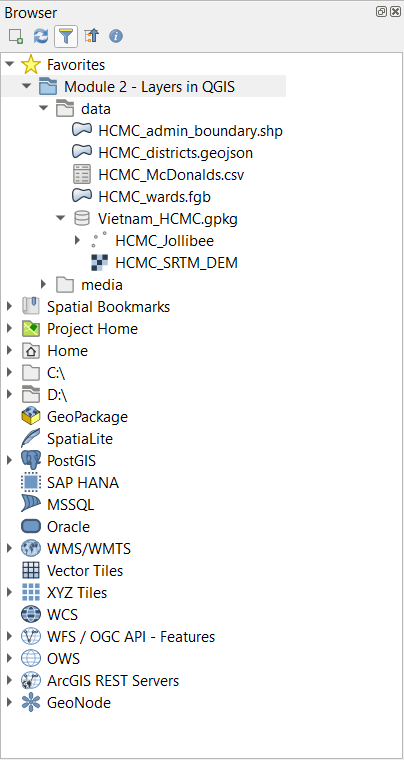

Hình 2.3. Các files của Module 2 trong Browser Panel

6. Có 5 file trong thư mục data: 

    1. GeoPackage (Vietnam_HCMC.gpkg) chứa một file vector (HCMC_Jollibee) và một file raster (HCMC_SRTM_DEM); 
    2. GeoJSON (HCMC_districts.geojson); 
    3. flatgeobuf (HCMC_municities.fgb);
    4. shapefile (HCMC_admin_boundary.shp); và
    5. Comma-Separated Value - CSV (HCMC_McDonalds.csv).

7. Kích chuột phải HCMC_admin_boundary.shp và chọn Layer Properties (Hình 2.4) để mở ra cửa sổ layer properties (Hình 2.5). Chú ý các thông tin có trong cửa sổ này: Loại đối tượng (geometry) là gì? Hệ quy chiếu tọa độ (CRS) đưỢc sử dụng? Số lượng đối tượng có trong layer?


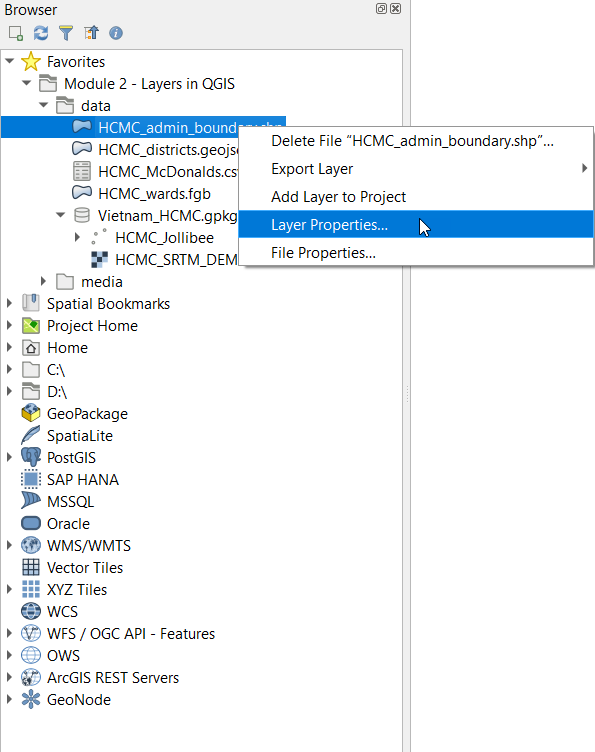

Hình 2.4. Xem Layer Properties

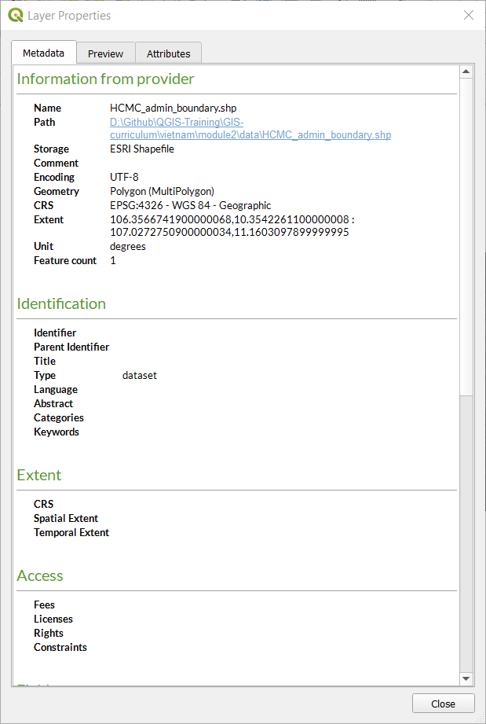

Hình 2.5. Layer Properties từ Browser Panel


8. Bên cạnh thông tin metadata, bạn cũng có thể xem trước hình học và thuộc tính của layer trong cửa sổ layer properties.
   
9.  Bạn có thể tải layer từ Browser Panel bằng cách:

    1. **Kích đúp chuột vào layer**
    2. **Kích chuột phải vào layer ‣ Add Layer to Project**
    3. **Kéo thả layer vào Map Canvas** 

10.	Thử tải các lớp **NCR_admin_boundary**, **NCR_districts**, and **NCR_municities** sử dụng bất cứ cách nào ở trên

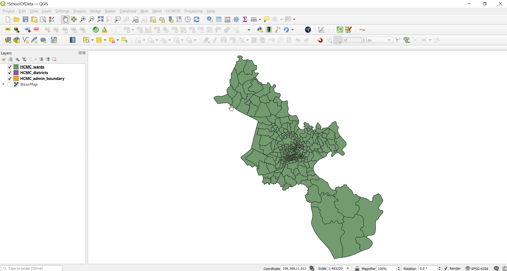

Hình 2.6. Các vector layer được tải trong QGIS


#### **Layers Panel**

Layers Panel liệt kê tất cả các layer hiện hữu trong project. Nó giúp quản lý hiển thị, thứ tự và xem Layer Properties. Layers Panel có thể được kích hoạt từ **View ‣ Panels ‣ Layers Panel** hoặc sử dụng tổ hợp phím tắt **CTRL+1**. Nó cũng được gọi là Map Legend. Nếu bạn tải tất các các lớp vector từ bài tập trước, Layers Panel sẽ hiển thị như sau:


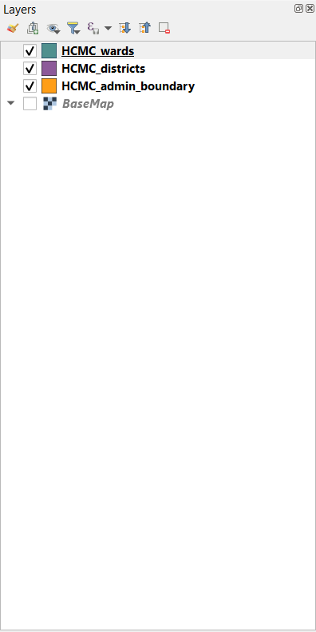

Hình 2.7. Layers Panel

Khả năng hiển thị (visibility) của layer có thể được điều khiển bằng cách chọn hoặc bỏ chọn vào ô bên trái của tên lớp. Bằng cách kéo – thả các lớp lên hoặc xuống trong Layers Panel, thứ tự hiển thị (Z-odering) của các layer được thay đổi. Tương tự như các phần mềm thao tác hình ảnh như GIMP hoặc Photoshop, các layer phía trên được vẽ đè lên các layer ở phía dưới. Vì vậy, nếu có 2 layer trong cùng một khu vực, layer cao hơn trong Layers Panel sẽ được vẽ đè trên layer thấp hơn và có thể che khuất layer thấp hơn trong Map Canvas. Điều này đáng để lưu ý vì có thể có những trường hợp chúng ta nghĩ rằng một layer không xuất hiện trong QGIS nhưng thực tế là nó đang bị che khuất hoặc bị ẩn bở một layer bên trên nó.

**LƯU Ý:** Z-ordering của các layer trong Layers panel có thể được ghi đè bởi **Layer Order Panel**.

Layers Panel cũng cho phép người dùng đổi tên và xóa, lọc hiển thị, tạo và quản lý các nhóm lớp (layer group) và map view.

Bảng thuộc tính của vector layer cũng có thể được mở từ Layers Panel bằng cách **kích chuột phải và layer -> Open attribute table**.

Tìm hiểu thêm về Layers Panel tại đây [https://docs.qgis.org/3.16/en/docs/user_manual/introduction/general_tools.html#layers-panel](https://docs.qgis.org/3.16/en/docs/user_manual/introduction/general_tools.html#layers-panel)


#### **Layer Properties**

Kích chuột phải vào layer trong Layers Panel và chọn Layer Properties sẽ mở ra hộp thoại Layer Properties. 


Figure 2.8. Hộp thoại Layer Properties

Có mộ số tab trong hộp thoại Layer Properies cho phép người dùng xem thông tin và thậm chí chỉnh sửa các properties của layer. 

Tab Information hiển thị các thông tin tóm tắt (chỉ đọc) và metadata của layer, bao gồm:

*	Nhà cung cấp dữ liệu
*	Metadata
*	Thông tin hình học và thuộc tính

Tab Source hiển thị các thiết lập chung cho vector layer. 

Các tab như Symbology, Labels, Masks và 3D View cho phép người dùng điều chỉnh symbology và style của layer.

Các tab khác cho phép người dùng thực hiện các phép nối layer (join), xem cấu trúc thông tin thuộc tính, thêm các Form tùy biến và thêm dữ liệu mới (Attribute Form), và nhiều thứ khác.

Một tab khác đáng đề cập là Metadata, cho phép người dùng tạo và chỉnh sửa metadata cho layer. Các thông tin metadata gồm:

*   Data identification: basic attribution of the dataset (parent, identifier, title, abstract, language…);
*   Categories the data belongs to such as ISO categories and custom ones;
*   Keywords to retrieve the data and associated concepts following a standard based vocabulary;
*   Access to the dataset (licenses, rights, fees, and constraints);
*   Extent of the dataset, either spatial one (CRS, map extent, altitudes) or temporal;
*   Contact of the owner(s) of the dataset;
*   Links to ancillary resources and related information; and
*   History of the dataset.

Một bản tóm tắt các thông tin đã điền được cung cấp trong tab Validation và giúp xác định các vấn đề tiềm ẩn liên quan đến metadata form. Hiện tại, metadata được lưu trong file project, nhưng cũng có thể được lưu riêng trong một file riêng .qmd đối với các layer dạng file hoặc trong một CSDL .sqlite đối với các layer từ xa.

Tìm hiểu thêm về vector layer properties tại đây: [https://docs.qgis.org/3.16/en/docs/user_manual/working_with_vector/vector_properties.html](https://docs.qgis.org/3.16/en/docs/user_manual/working_with_vector/vector_properties.html)

Tìm hiểu thêm về raster layer properties tại đây: [https://docs.qgis.org/3.16/en/docs/user_manual/working_with_raster/raster_properties.html](https://docs.qgis.org/3.16/en/docs/user_manual/working_with_raster/raster_properties.html)


#### **Siêu dữ liệu không gian địa lý - Geospatial Metadata**

Metadata chỉ đơn giản là dữ liệu về dữ liệu. Nó trả lời cho câu hỏi: ai, cái gì, khi nào, ở đâu và như thế nào về tập dữ liệu với đủ hình dạng và kích thước. Đối với GIS, chúng ta thường quan tâm đến geospatial metadata (siêu dữ liệu không gian địa lý). Geospatial metadata được mô tả bởi U.S. Federal Geographic Data Committee (FGDC) như sau:

_“ Một file thông tin, thường ở dạng tài liệu XML, chứa các đặc điểm cơ bản của dữ liệu hoặc tài nguyên thông tin. Nó mô tả ai, cái gì, khi nào, ở đâu, tại sao và như thế nào của dữ liệu. Geospatial metadata thường ghi lại dữ liệu địa lý số như file GIS, geospatial database và hình ảnh của trái đất nhưng cũng có thể được dùng để ghi lại các tài nguyên không gian địa lý, bao gồm danh mục dữ liệu, ứng dụng bản đồ, mô hình dữ liệu và các trang web liên quan. Bản ghi metadata bao gồm các phần tử danh mục thư viện cốt lõi như tiêu đề, tóm tắt và xuất bản; các phần tử địa lý như phạm vi không gian và thông tin về hệ quy chiếu tọa độ; và các phần tử CSDL như định nghĩa nhãn thuộc tính (Attribute Label Definitions) và miền giá trị thuộc tính (Attribute Domain Values).”_

Tầm quan trọng của metadata là nó không chỉ thúc đẩy tính minh bạch mà còn tạo điều kiện cho việc chia sẻ thông tin và dữ liệu. Đây là lý do tại sao điều quan trọng là phải luôn nhập metadata cho các tập dữ liệu. Khi thêm metadata, điều quan trọng không kém là tuân thủ các tiêu chuẩn - các quy tắc và thông lệ được quảng bá rộng rãi, được chấp nhận và tuân theo – do đó metadata mà chúng ta tạo ra có thể tương tác với nhau. Một trong những tiêu chuẩn đó là ISO 19115:2014 “Geographic Information -- Metadata” from ISO/TC 211 ([https://www.iso.org/obp/ui/#iso:std:iso:19115:-1:ed-1:v1:en](https://www.iso.org/obp/ui/#iso:std:iso:19115:-1:ed-1:v1:en))


#### **Bài tập 01.2: Thêm Metadata**

1. Mở Layer Properties của lớp NCR_admin_boundary.
2. Kiểm tra thông tin trong tab Information và xem thông tin được hiển thị. Thông tin đã đầy đủ chưa? Chúng ta có thể bổ sung thêm thông tin không? 

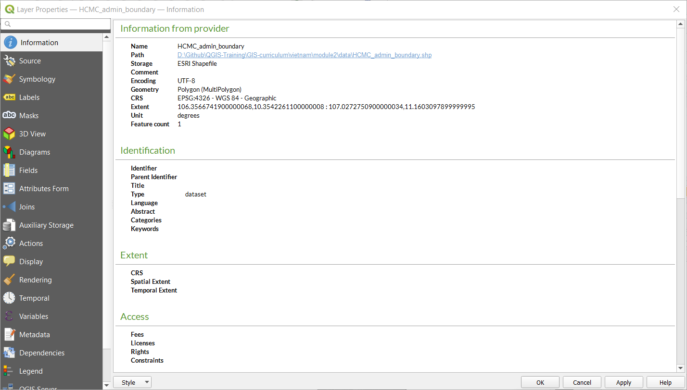

Hình 2.9. Information properties của the NCR_admin_boundary layer

3. Di chuyển đến tab Metadata và bổ sung thêm thông tin về layer như extent (phạm vi), danh mục dữ liệu (data category), giấy phép (license). Kích chọn OK khi hoàn thành.

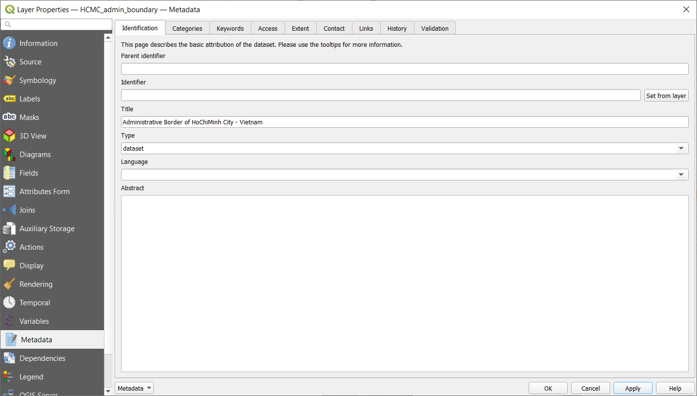

Hình 2.10. Chỉnh sửa một số metadata

4. Trở lại tab Information để xem có gì thay đổi không.


Hình 2.11. Tab Information sau khi chỉnh sửa một số metadata


#### Câu hỏi

1. True or False:

    1. Tất cả các vector file là shapefile. -- ***False (shapefile chỉ là một trong những định dạng của vector bên cạnh các định dạng khác như geopackage, geojson và flatgeobuf)**
    2. Khi được hiển thị trên Map Canvas, một layer ở vị trí cao hơn trong Layers Panel sẽ luôn luôn che khuất hoặc hiển thị bên trên một layer thấp hơn trong Layers Panel. -- ***False (Khi được kích hoạt, thức tự hiển thị được thiết lập trong Layer Order Panel sẽ ghi đè lên thứ tự trong Layers Panel)***
    3. Bạn có thể xem thông tin metadata của một layer từ Layers Panel và Browser Panel. -- ***True***


### Phase 2 : Data Source Manager và kết nối đến các Dịch vụ từ xa

#### ** Data Source Manager**

Nếu bạn không muốn sử dụng Browser Panel để tải các layer, bạn luôn có thể sử dụng **Data Source Manager**.

**Data Source Manager** được giới thiệu từ phiên bản QGIS 3. Đây là “cửa hàng một điểm đến”/ một cửa (“one-stop-shop”) cho việc thêm và tải các layer từ nhiều nguồn dữ liệu khác nhau trong QGIS. Trước kia, có nhiều cửa sổ riêng lẻ để tải các nguồn dữ liệu khác nhau (nghĩa là: một cửa sổ cho raster, một cho vector,…). Có thể truy cập bằng cách vào **Layers ‣ Data Source Manager** hoặc nhấn tổ hợp phím  **CTRL + L**.


Hình 2.12. Data Source Manager


#### **Bài tập 02.1: Data Source Manager**

1. Mở **Data Source Manager**. Nó chứa các tab ở bên trái tương ứng với các loại nguồn dữ liệu mà bạn muốn tải hoặc kết nối. Tương tự như Browser, bạn có thể tải và kết nối đến nhiều loại dữ liệu từ Data Source Manager
2. **Tải dữ liệu Vector**

    1. Để tải dữ liệu vector, di chuyển đến tab Vector. Các file, file trong một thư mục, CSDL và ngay cả các file từ xa thông qua các giao thức như HTTP, cloud,… có thể được tải vào QGIS
    2. Hãy tải vector file (HCMC_Jollibee) có trong Vietnam_HCMC geopackage. Đây là lớp dữ liệu dạng điểm về vị trí của các nhà hàng thức ăn nhanh Jollibee trong HCMC.

        1. Source Type: File
        2. Source: Chọn Vietnam_HCMC geopackage sử dụng nút bấm 
        3. Chọn Add
        4. Nếu có nhiều hơn 1 vector file trong geopackage, QGIS sẽ yêu cầu bạn chọn file nào để tải.

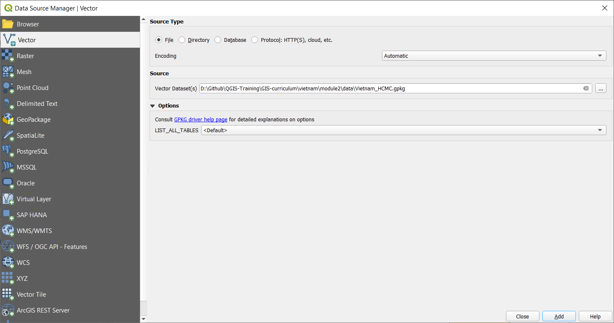

Hình 2.13. Tải một vector layer trong GeoPackage

3. **Tải dữ liệu Raster**

    1. Để tải một raster, di chuyển đến tab Raster. Các file, file từ xa thông qua giao thức như HTTP, cloud,… có thể được tải trong QGIS. Có một raster (HCMC_SRTM_DEM) trong Vietnam_HCMC geopackage. Raster này là mô hình số độ cao (Digital Elevation Model - DEM) của khu vực HCMC. Cách tải:

        1. Source Type: File
        2. Source: Chọn Vietnam_HCMC geopackage sử dụng nút bấm .
        3. Chọn Add
        4. Nếu có nhiều hơn 1 raster file trong geopackage, QGIS sẽ yêu cầu bạn chọn file nào để tải.

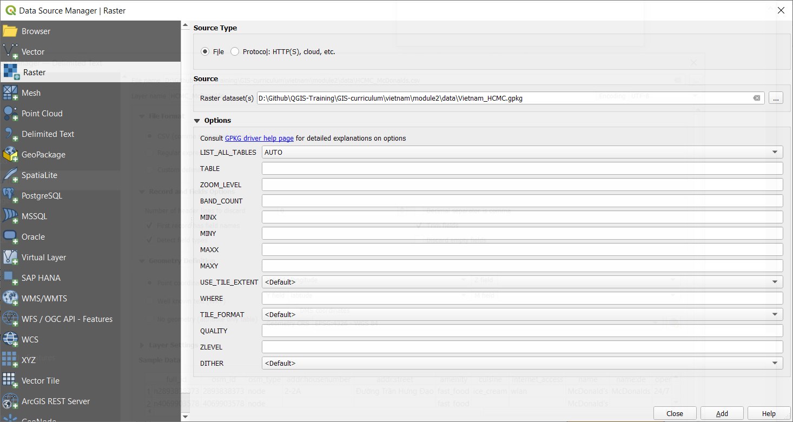

Hình 2.14. Tải một raster layer trong GeoPackage

4. **Tải CSV và các Delimited Text File khác**  

    1. Ngoài dữ liệu vector và raster, định dạng file thông dụng khác trong GIS là CSV và spreasheet (Excel), và việc tải các file này vào trong QGIS khá dễ dàng.
    2. CSV và các delimited text file khác có thể được tải thông qua tab Delimited Text trong Data Source Manager, từ Browser Panel hoặc chỉ cần kéo – thả trực tiếp vào Map Canvas. Tuy nhiên, có một số vấn đề cần xem xét nếu file CSV có chứa thông tin hình học (ví dụ như tọa độ của điểm). Quy tắc kinh nghiệm là:

        1. Sử dụng Data Source Manager để tải các CSV cho dù có chứa thông tin hình học hay không.
        2. Nếu CSV được tải từ Browser Panel bằng cách kéo thả, hãy đảm bảo rằng có file CSVT tương ứng để lưu giữ các kiểu dữ liệu của từng trường dữ liệu.
        3. Nếu bạn gặp vấn đề với việc bảo toàn kiểu dữ liệu cho file Delimited Text File (cụ thể là CSV), bạn có thể sử dụng CSVT file. Có thể tham khảo thêm cách tải CSV trong QGIS tại đây [https://bnhr.xyz/2018/08/07/specifying-csv-data-types-using-a-csvt-file.html ](https://bnhr.xyz/2018/08/07/specifying-csv-data-types-using-a-csvt-file.html).

    3. CSV và spreadsheet có thể được tải trong QGIS cùng với thông tin không gian (hình học) hoặc không. Nếu được tải với thông tin không gian, chúng được xem như dữ liệu vector. Nếu không, chúng được xem như dữ liệu dạng bảng bình thường.
    4. Có 1 file CSV trong thư mục data có tên HCMC_McDonalds.csv, chứa thông tin vị trí của các cửa hàng McDonald ở HCMC. Cách tải:

        1. Đến tab  Delimited Text
        2. File name: chọn HCMC_McDonalds CSV sử dụng nút bấm .
        3. File Format: CSV
        4. Record and Fields Options: để mặc định
        5. Geometry definition: 

            * Point coordinates
            * X field: longitude
            * Y field: latitude
            * Geometry CRS: EPSG: 4326 - WGS 84

        6. Layer settings: Chọn Watch file và Use spatial index

            * Khi Watch file được chọn, các thay đổi trên file CSV ở bên ngoài QGIS sẽ được tự động cập nhật trên layer đã được tải trong QGIS.
            * Use spatial index để thêm chỉ mục không gian vào layer, giúp xử lý vector nhanh hơn.


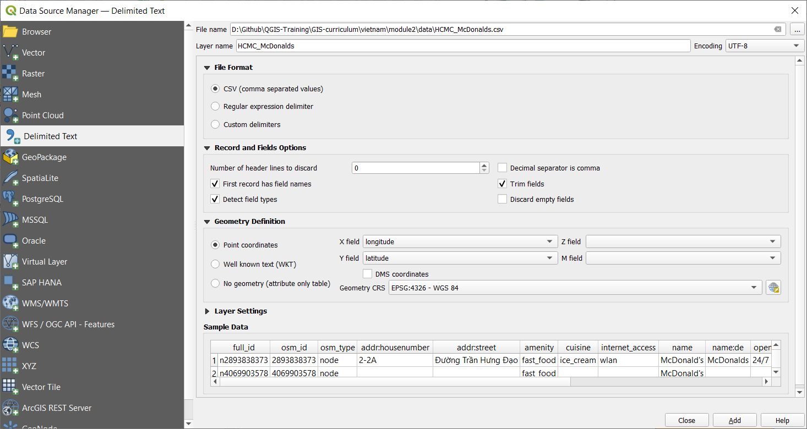

Hình 2.15. Tải CSV file

Khi tất các các layer trong các bài tập trước được tải, Layers Panel sẽ như hình sau:


Hình 2.16. Layers Panel với tất cả các layer đã được tải


Map Canvas sẽ như sau:

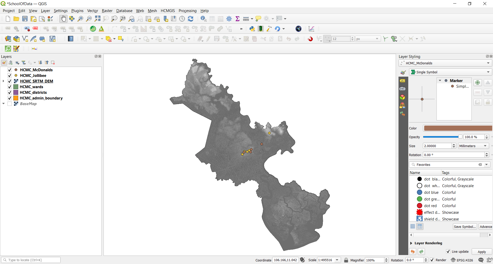

Hình 2.17. Giao diện QGIS với tất cả các layer đã được tải


Bạn có thể tùy ý sắp xếp thứ tự hiển thị của các layer trong Layer Panel.


#### **Kết nối QGIS đến các dịch vụ từ xa**

Ngoài các file vector và raster, QGIS có thể kết nối đến các dịch vụ từ xa như tile service, OGC Web Service (WMS, WFS) và cả ESRI ArcGIS Web Service. Các kết nối này có thể được tạo trong Browser Panel hoặc Data Source Manager.


#### **Bài tập 02.2: Kết nối đến dịch vụ XYZ tiles**

XYZ tile thưỜng được dùng như là bản đồ nền (basemap) cho không chỉ các ứng dụng để bàn mà phổ biến hơn là trong các ứng dụng web.

Các kết nối đến một tile server::

1. Di chuyển đến **Browser Panel**
2. **Kích chuột phải XYZ Tiles ‣ New Connection** 
3. Nhập các tham số kết nối:

```
    Name: PGP Basemap
    URL: https://basemapserver.geoportal.gov.ph/tiles/v2/PGP/{z}/{x}/{y}.png
```
4. Chọn OK.

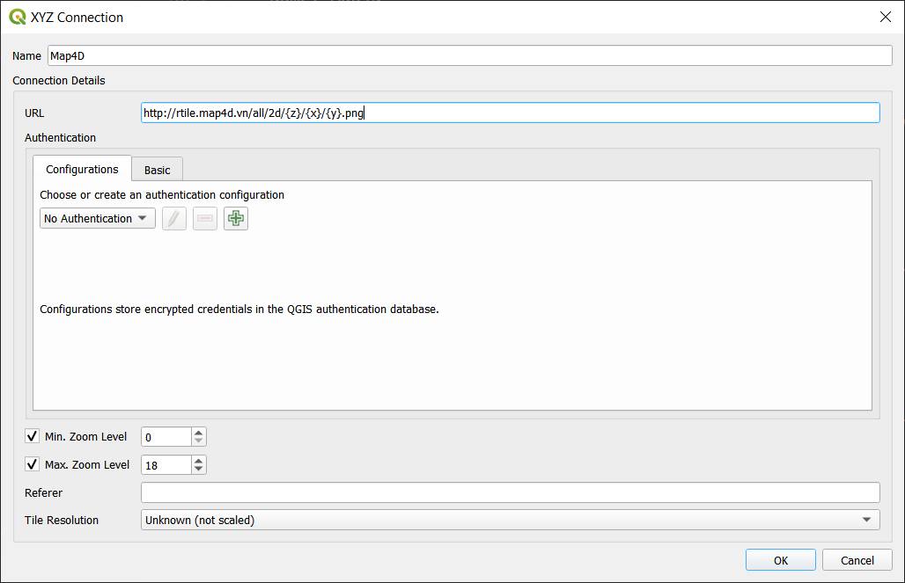

Hình 2.18. Thêm kết nối XYZ tile trong QGIS

5. Kết quả sau khi PGP Basemap đã được thêm vào dưới mục XYZ Tiles trong Browser Panel.

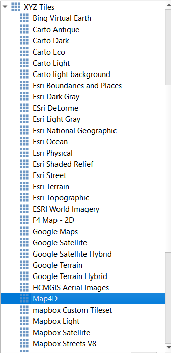

Hình 2.19. PGP Basemap Tile server được thêm vào Browser Panel

6. Bạn có thể tải XYZ tile layer theo cách tương tự các layer khác từ Browser Panel.

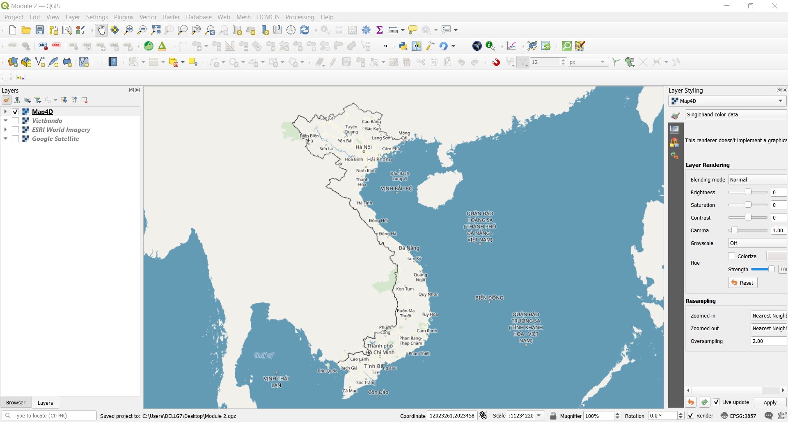

Hình 2.20. PGP Basemap layer được tải trong QGIS

1. Thử tải thêm ESRI World Imagery layer.

```
    Name: ESRI World Imagery
    URL: https://server.arcgisonline.com/ArcGIS/rest/services/World_Imagery/MapServer/tile/{z}/{y}/{x}
```


**BONUS:**  Nếu bạn muốn thêm một số basemap vào XYZ Tiles trong Browser Panel, bạn có thể làm theo hướng dẫn tại đây: [https://bnhr.xyz/2018/10/07/basemaps-in-qgis.html](https://bnhr.xyz/2018/10/07/basemaps-in-qgis.html)


**BONUS #2:** Bạn có xem thêm các địa chỉ URL của các tile sever trên website Leaflet Providers tại đây ([https://leaflet-extras.github.io/leaflet-providers/preview/](https://leaflet-extras.github.io/leaflet-providers/preview/)) để thêm vào XYZ Tiles trong Browser Panel. 


#### **Bài tập 02.3: : Kết nối dịch vụ WMS/WMTS và WFS**

WMS (Web Map Service) là một tiêu chuẩn dịch vụ web của tổ chức Open Geospatial Consortium (OGC)  ([https://www.ogc.org/](https://www.ogc.org/)) cung cấp các ảnh (raster tiles) qua Internet. Khi dữ liệu được cung cấp dưới dạng WMS, người dùng không thể chỉnh sửa trực tiếp dữ liệu cũng như style hiển thị.  

Trong khi đó, WFS (Web Feature Services) là một dịch vụ web khác của OGC cung cấp các đối tượng (vector) qua Internet. Khi dữ liệu được cung cấp dưới dạng WFS, người dùng có thể truy cập các thuộc tính và hình học của đối tượng, cho phép chỉnh sửa dữ liệu, style hiển thị và thực hiện các phép phân tích không gian.

Cách kết nối đến dịch vụ WMS:

1. Di chuyển đến  **Browser Panel**
2. **Kích chuột phải WMS/WMTS ‣ New Connection** 
3. Nhập các tham số:
```
Name: LiPAD 100-year Flood Hazard
URL: https://api.mapbox.com/styles/v1/osmph/cjqrynb300m522sper0emmgs6/wmts?access_token=sk.eyJ1Ijoib3NtcGgiLCJhIjoiY2pxbjF6czN2MGllbTQ4bXVuOW44ZDlpbSJ9.pUqHal3xOR1yZUaM6LbLkg
```
4. Chọn Add

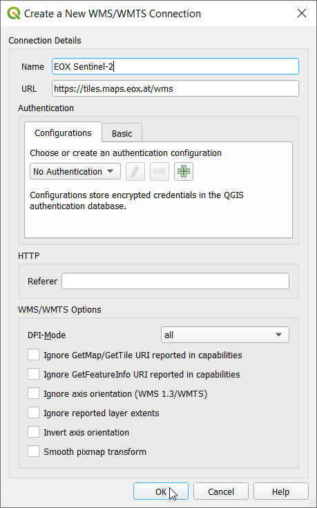

Hình 2.21. Tạo mới một kết nối WMS/WMTS

5. Kết quả sẽ thêm lớp LiPAD 100-year Flood Hazard bên dưới mục WMS/WMTS và OWS trong Browser Panel

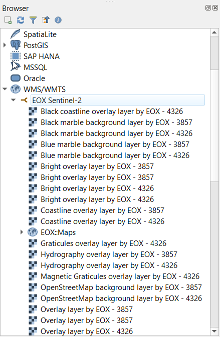

Hình 2.22. Lớp LiPAD 100-year Flood Hazard WMS được thêm vào Browser Panel

6. Bạn có thể tải các lớp WMS theo cách tương tự như các layer khác trong Browser Panel.

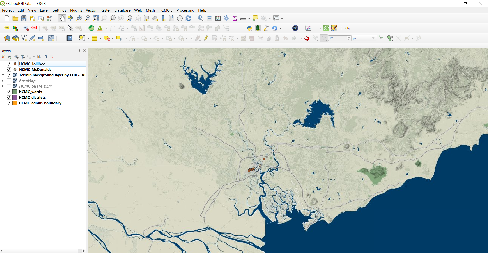

Hình 2.23. Bản đồ Flood hazard WMS được tải trong QGIS

7. Kết nối đến WFS theo các bước tương tự như trên.


#### **Câu hỏi**

1. True or False:

    1. Bạn chỉ có thể tải các file cục bộ trong QGIS -- ***False (Bạn cũng có thể tải các file từ xa như các file được lưu trữ trực tuyến hoặc thông qua các dịch vụ web)***


### Phase 3: Kết xuất Layer, Layer trong bộ nhớ (tạm thời) và Layer ảo (Virtual Layer)

#### **Kết xuất layer trong QGIS**

Kết xuất layer (hoặc lưu layer thành file) trong QGIS rất đơn giản. Chỉ cần **Kích chuột phải vào layer ‣ Export** và nhập các tùy chọn xuất cho layer.


Hình 2.24. Kết xuất layer trong QGIS

*   **Save Features As…** cho phép lưu raster hoặc vector layer.

    *  Khi **bộ lọc (filter)** được kích hoạt trên vector layer, chỉ các đối tượng thỏa điều kiện lọc (các đối tượng đang hiển thị trên map canvas) được kết xuất.

*   **Save Selected Features As...** là một tùy chọn cho vector layer, cho phép chỉ lưu các đối tượng đang được chọn.
*   **Save as Layer Definition File…** tạo một QLR file (xem Module 1, Định dạng file trong QGIS) cho layer

*   **Save as QGIS Layer Style File…** tạo một QML file (see Module 1, Định dạng file trong QGIS) cho layer

Khi kết xuất layer, QGIS cho tùy chọn định dạng file xuất, các trường dữ liệu xuất (đối với vector file), hệ quy chiếu tọa độ và các tùy chọn khác. Điều này có nghĩa là bạn có thể thực hiện chuyển đổi hệ tọa độ ngay trong quá trình kết xuất layer.


Hình 2.25. Hộp thoại Save Vector Layer

Tham khảo thêm cách lưu layer tại đây: [https://docs.qgis.org/3.16/en/docs/user_manual/managing_data_source/create_layers.html#save-layer-from-an-existing-file](https://docs.qgis.org/3.16/en/docs/user_manual/managing_data_source/create_layers.html#save-layer-from-an-existing-file)


#### **Layers in Memory**

Đôi khi, chúng ta không cần hoặc không muốn lưu trữ vật lý các layer chúng ta sử dụng trong các phép phân tích vào máy tính, đặc biệt nếu chúng chỉ là các layer tạm thời.

QGIS hiểu nhu cầu này và cho phép người dùng tạo các **temporary / scratch** layer. Các layer này có thể được dùng tương tự như các vector layer thông thường nhưng không cần phải lưu thành file trong ổ đĩa vì QGIS lưu trữ chúng trong bộ nhớ RAM. Các lớp tạm này được hiển thị trên Layer Panel với biểu tượng .

Mặc định, kết quả của các thuật toán xửa lý được lưu trữ dưới dạng layer tạm.

Nhược điểm của các layer tạm này là QGIS sẽ **“quên”** các **“layers in memory”** khi đóng QGIS. Để khắc phục điều này, chúng ta có thể dùng **Memory Layer Saver plugin** để lưu lại các layer tạm này. Khi lưu QGIS project với các layer tạm, đầu tiên cần chạy/ kích hoạt Memory Layer Saver plugin bằng cách vào **Plugins ‣ Memory Layer Saver**. Khi mở QGIS project ở lần tiếp theo, các layer tạm này sẽ vẫn còn.

Tất nhiên bạn cũng có thể kết xuất các layer tạm này thành dạng file. Kích chọn biểu tượng  sẽ tự động mở hộp thoại kết xuất layer.


#### **Layer ảo (Virtual Layers)**

Một virtual layer là một loại đặc biệt của vector layer được tạo “on the fly” từ kết quả truy vấn hoặc từ một layer khác.

Ví dụ, chúng ta có thể tạo một virtual layer để tạo một vùng đệm (buffer) xung quanh một đối tượng của layer khác. Bất cứ khi nào một đối tượng mới được thêm vào layer nguồn đó, virtual layer này sẽ được cập nhật tương ứng.

Hiện tại, virtual layers dường như không hỗ trợ các layer nguồn là layers in memory.

Virtual layer là động, có nghĩa là khi layer nguồn được cập nhật thì virtual layer cũng được cập nhật. Điều này giúp tiết kiệm không gian lưu trữ và trùng lắp dữ liệu, vì virtual layer chỉ lấy dữ liệu từ layer nguồn mà không cần lưu trữ bất cứ thứ gì xuống đĩa, mặc dù có thể ảnh hưởng đến tốc độ thực thi nếu các truy vấn hoặc phép toán phức tạp được thực hiện trên virtual layer. 

Cấu trúc tựa SQL được dùng để định nghĩa các virtual layer.

Các virtual layer phụ thuộc vào các layer khác, nên điều quan trọng là các layer nguồn không bị di chuyển hoặc đổi tên.

Khi layer nguồn được cập nhật, bạn cần refresh bản đồ bằng cách di chuyển hoặc phóng to/ thu nhỏ bản đồ để thấy virtual layer cập nhật.


#### **Câu hỏi**

1. True or False:
    
    1. Khi kết xuất một vector layer, bạn có thể chọn định dạng lưu trữ. -- ***True***
    2. Các layer tạm (temporary/ scratch) luôn bị “quên” khi đóng QGIS. -- ***False (chúng có thể được giữ lại bằng cách sư3 dụng Memory Layer Saver plugin)***
    3. Khi lớp nguồn của virtual layer được cập nhật, virutal layer tương ứng sẽ cập nhật tự động trên map canvas mà không cần sự tương tác của người dùng. -- ***False (Người dùng cần cập nhật map canvas bằng cách di chuyển hoặc phóng to, thu nhỏ để để thấy virtual layer cập nhật trên map canvas)***


### Nếu bạn muốn tìm hiểu thêm:  


#### **Cài đặt một số plugin đóng vai trò là nguồn dữ liệu**

Một số plugin cung cấp chức năng tải dữ liệu vào QGIS, bao gồm dữ liệu vector, ảnh vệ tinh, raster, bản đồ nền,… Thử cài đặt các plugin sau và tìm hiểu loại dữ liệu nào được tải trong QGIS.

*   QuickOSM ([https://plugins.qgis.org/plugins/QuickOSM/](https://plugins.qgis.org/plugins/QuickOSM/))
*   SRTM-Downloader ([https://plugins.qgis.org/plugins/SRTM-Downloader/](https://plugins.qgis.org/plugins/SRTM-Downloader/))
*   QuickMapServices ([https://plugins.qgis.org/plugins/quick_map_services/](https://plugins.qgis.org/plugins/quick_map_services/))

Lưu ý: Một số plugin yêu cần đăng ký tài khoản với nhà cung cấp dữ liệu.


#### **Kết nối dịch vụ GeoNode**

GeoNode ([https://geonode.org/](https://geonode.org/)) là một hệ quản trị nội dung không gian địa lý mã nguồn mở được xây dựng dựa trên các phần mềm FOSS4G hoàn thiện gồm PostGIS, GeoServer, MapStore,… Bạn có thể nghĩ GeoNode như là một cổng thông tin dữ liệu không gian. Bạn có thể dễ dàng kết nối QGIS đến GeoNode thông qua GeoNode Connector trong Browser Panel hoặc Data Source Manager

1. Di chuyển đến **Browser Panel**
2. Kích chuột phải **GeoNode ‣ New Connection**
3. Nhập các tham số:
```
Name: UNESCO IHP-WINS
URL: [http://ihp-wins.unesco.org/](http://ihp-wins.unesco.org/) 
```


Bạn có thể tham khảo thêm cách kết nối QGIS đến các dịch vụ từ xa tại đây: [https://bnhr.xyz/2018/10/12/connecting-qgis-to-remote-services.html](https://bnhr.xyz/2018/10/12/connecting-qgis-to-remote-services.html)


#### **Bài tập/ hướng dẫn về Virtual Layer**

1. Mở QGIS.
2. Tải ảnh vệ tinh hoặc bản đồ nền vệ tinh thông qua XYZ tiles hoặc QuickMapServices plugin (ví dụ Google Satellite).
3.	Tạo một geopackage layer mới với biểu tượng  trong Data Source Manager toolbar, đặt tên là Trees, thêm trường dữ liệu radius (integer) và species (text), và sử dụng một projected CRS (ví dụ EPSG:3857)


Nếu xuất hiện hộp thoại báo file này đã tồn tại, chọn “Add New Layer”


1. Toggle editing layer Trees bằng cách kích chuột phải ‣ Toggle editing or clicking  trong Digitizing Toolbar.
2. Chọn một khu vực có cây xanh trên ảnh vệ tinh.
3. Ở chế độ Editing, kích hoạt chức năng thêm điểm vào layer Trees bằng cách kích chuột vào biểu tượng  (CTRL + .).   
4. Số hóa từng cây xanh bằng cách kích vào vị trí trên ảnh và nhập các thông tin thuộc tính. Nhập vào 4 đối tượng cây xanh, thông tin thuộc tính có thể nhập tùy ý.


5. Sau khi thêm điểm, đừng quên lưu các thay đổi bằng cách kích chuột vào biểu tượng  trong Digitizing toolbar trước khi tắt chế độ chỉnh sửa.

 added]")

6. Thêm một virtual layer bằng cách click vào biểu tượng  trong Data Source Manager toolbar.

7.	Đặt tên layer là Tree Canopy. Import Trees. Thêm vào câu truy vấn sau:
```
select fid, buffer(geometry, radius), species from Trees
```


Thêm một điểm mới và resfresh map canvas (phóng to/ thu nhỏ hoặc di chuyển map canvas) để thấy virtual layer được cập nhật.


### Thực hành các kỹ năng mới

#### **Tải các raster và vector có trên Internet**

Ngoài các file cục bộ (vector, raster), QGIS cũng có thể tải các vector và raster có trên Internet. Sử dụng Data Source Manager để tải dữ liệu theo đường dẫn URL sau:

https://raw.githubusercontent.com/benhur07b/stomp-covid19-data/master/spatial/stompcovidph_regions.geojson


#### **Tải file Excel vào QGIS sử dụng Spreadsheet Layers plugin**

Cài đặt Spreadsheet Layers plugin và thử tải một bảng tính (spreadsheet) vào QGIS. Plugin hỗ trợ định dạng Open Document Standard formats (.ods) và Microsoft Excel files (.xls, .xlsx).

Tham khảo tại đây: [https://bnhr.xyz/2018/07/27/plugin-fridays-spreadsheet-layers-plugin.html](https://bnhr.xyz/2018/07/27/plugin-fridays-spreadsheet-layers-plugin.html)


### Mẹo 

1.	Nếu bạn cần một bản đồ thế giới, thử gõ **world** trong Coordinate bar trên Status bar và xem điều gì xảy ra? Đây chỉ là một món quà bất ngờ trong QGIS khi bạn gõ một số từ khóa nhất định vào Coordinate bar.
