# Module 4 - Styling Layers

**Author**: Quách Đồng Thắng

## Giới thiệu chung

Module này sẽ hướng dẫn bạn cách thay đổi hiển thị trực quan bản đồ bằng cách lựa chọn các biểu tưỢng (symbol), màu sắc thích hợp và sử dụng các hiệu ứng thích hợp. Kết thúc module, bạn sẽ nắm được các khái niệm niệm như symbology và style của bản đồ. Ngoài ra, bạn sẽ học các kỹ năng sau; 

*   styling layers 
*   symbology cơ bản cho vector/ raster và cách áp dụng cho một layer.
*   blending mode và draw effect
*   sử dụng các công thức để chạy một chức năng xử lý không gian 

## Các công cụ và tài nguyên cần thiết

*   Máy tính
*   Kết nối Internet
*   QGIS 3.16 hoặc mới hơn
*   Ranh giới hành chính của Tp.HCM (trong  [module4.gpkg](data/module4.gpkg)))
*   Các cơ sở y tế Tp.HCM (trong [module4.gpkg](data/module4.gpkg))
*   [Tp.HCM High Resolution Settlement Layer](data/HRSL_HCMC_Population.tif)

## Kỹ năng cần có

*   Kiến thức cơ bản về vận hành máy tính
*   Nắm vững tất cả các Module đã học
  

## Tham khảo thêm

*   QGIS Symbology - [https://docs.qgis.org/3.16/en/docs/training_manual/basic_map/symbology.html](https://docs.qgis.org/3.16/en/docs/training_manual/basic_map/symbology.html)
*   Style Sharing Repository - [https://www.gislounge.com/qgis-style-sharing-repository/](https://www.gislounge.com/qgis-style-sharing-repository/)
*   Styles - [https://plugins.qgis.org/styles/](https://plugins.qgis.org/styles/)
*   Style Hub - [https://style-hub.github.io/](https://style-hub.github.io/)
*   Hillshade in QGIS -[https://bnhr.xyz/2019/02/08/mapping-icebergs-in-qgis.html](https://bnhr.xyz/2019/02/08/mapping-icebergs-in-qgis.html)
*   Mapping Icebergs in QGIS - [https://bnhr.xyz/2019/02/08/mapping-icebergs-in-qgis.html](https://bnhr.xyz/2019/02/08/mapping-icebergs-in-qgis.html)

## Giới thiệu chuyên đề

Hãy bắt đầu bằng một ví dụ: 

Tưởng tượng bạn đến một thành phố mới, với vai trò là một khách du lịch, đi chơi hoặc đi công việc. Thành phố có một loạt các địa điểm mà bạn nhất định phải đến hoặc tham quan, bao gồm các bảo tàng, quán cá phê, bãi biển, đài tưởng niệm, cửa hàng bán đồ lưu niệm địa phương và chợ. Bạn cầm một bản đồ giấy thể hiện vị trí của các địa điểm này. Các địa điểm này đểu được đánh dấu chấm đỏ. Theo bạn, bản đồ này có dễ cho chuyến du lịch của bạn ở thành phố này không? Tôi e là không

Đó là lý do vì sao việc tạo "bản đồ với các ký hiệu và màu sắc khác nhau" luôn luôn quan trọng. Những gì bạn thấy trong bản đồ của mình sau khi áp dụng các khái niệm tạo kiểu (styling) là một thể hiện trực quan, sinh động về dữ liệu mà bạn đang làm việc.

### Các Panels, Tabs và Render types quan trọng

#### **Layer Styling Panel** 

Panel này có thể xem là một shortcut đến một số chức năng của layer properties. Nó giúp bạn thiết lập hiển thị cho layer nhanh chóng và thuận tiện, và hiển thị trực quan các hiệu ứng tức thì mà không cần truy cập vào layer properties.

Ngoài việc tránh phải mở cửa sở layer properties, nó cũng tránh tình trạng lộn xộn trong việc hiển thị từng cửa sổ ứng với từng thao tác chọn màu, chỉnh sửa hiệu ứng, hiển thị nhãn,... Ví dụ, khi bạn nhấn nút chọn màu trong Layer Styling Panel, bảng chọn màu được hiển thị ngay bên trong panel thay vì hiện thêm một cửa sổ mới

Trong Layer Styling Panel, chọn một layer cần thiết lập hiển thị:

*   Thiết lập symbology, transparency (độ trong suốt) và histogram cho raster layer. Các tuỳ chọn này cũng có trong cửa sổ Raster Properties
*   ([https://docs.qgis.org/3.16/en/docs/user_manual/working_with_raster/raster_properties.html#raster-properties-dialog](https://docs.qgis.org/3.16/en/docs/user_manual/working_with_raster/raster_properties.html#raster-properties-dialog)). 
    * Truy cập Raster Properties bằng cách kích đúp chuột vào Raster Layer -> General
*   Thiết lập symbology và label. Các tuỳ chọn này cũng có trong Vector Properties Dialog ([https://docs.qgis.org/3.16/en/docs/user_manual/working_with_vector/vector_properties.html#vector-properties-dialog](https://docs.qgis.org/3.16/en/docs/user_manual/working_with_vector/vector_properties.html#vector-properties-dialog)). 
    * Truy cập Vector Properties Dialog bằng cách kích đúp chuột vào Vector Layer -> General
*   Bạn có thể undo, redo các style đã áp dụng cho layer
  
Mộ chức năng mạnh mẽ khác của panel này là tuỳ chọn Live update. Nếu được chọn, các thay đổi sẽ được hiển thị ngay tức thì trên map canvas mà không cần nhấn nút Apply

Để kích hoạt panel này, vào View->Panels, chọn Layer Styling

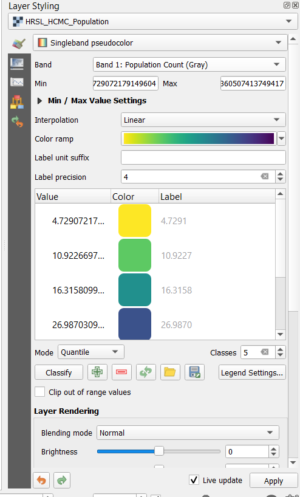

Figure 4.1: Layer Styling Panel

#### **Symbology Tab trong Layers Properties**

Để truy cập Symbology Tab, kích đúp chuột vào Layer để mở cửa sổ Layer Properties-> Chọn Symbology

Tại đây, bạn có thể thiết lập hiển thị cho các kênh ảnh (đối với dữ liệu raster) như render type, band, mix/max values, color rendering và resampling. Hình bên dưới lần lượt thể hiện các symbology tabs cho dữ liệu vector và dữ liệu raster;

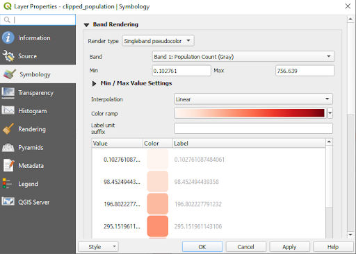

Figure 4.2: Symbology cho dữ liệu vector và raster

#### **Raster rendering: Band rendering**

QGIS cung cấp 04 kiểu hiển thị (render) dữ liệu raster. Lựa chọn cách hiển thị nào tuỳ thuộc vào loại dữ liệu. Loại render mặc định là đơn kênh (màu xám). Bạn sẽ phải thay đổi kiểu hiển thị thích hợp tuỳ vào loại dữ liệu.

*   Multiband color - Màu đa kênh ([https://docs.qgis.org/3.16/en/docs/user_manual/working_with_raster/raster_properties.html#multiband-color](https://docs.qgis.org/3.16/en/docs/user_manual/working_with_raster/raster_properties.html#multiband-color)) - nếu raster có nhiểu kênh ảnh (ví dụ như ảnh vệ tinh được chụp ở nhiều kênh phổ khác nhau).
*   Paletted/Unique values ([https://docs.qgis.org/3.16/en/docs/user_manual/working_with_raster/raster_properties.html#paletted]()) - đối với ảnh đơn kênh (đơn phổ) với một bảng màu được đánh chỉ mục - indexed palette (ví dụ bản đồ địa hình số) hoặc cho các trường hợp chung sử dụng palette để hiển thị raster.
*   Singleband gray - xám đơn kênh ([https://docs.qgis.org/3.16/en/docs/user_manual/working_with_raster/raster_properties.html#singleband-gray](https://docs.qgis.org/3.16/en/docs/user_manual/working_with_raster/raster_properties.html#singleband-gray)) - (một kênh của) ảnh sẽ được hiển thị dưới dạng màu xám. QGIS sẽ chọn kiểu hiển thị này nếu raster không phải là ảnh đa kênh hoặc palette (ví dụ như bản đồ dạng shaded relief)
*   Singleband pseudocolor -  màu giả đơn kênh([https://docs.qgis.org/3.16/en/docs/user_manual/working_with_raster/raster_properties.html#label-colormaptab](https://docs.qgis.org/3.16/en/docs/user-_manual/working_with_raster/raster_properties.html#label-colormaptab)) - cách hiển thị này có thể được dùng cho các raster với raster có bảng màu liên tục hoặc các bản đồ màu (ví dụ như bản đồ độ cao)
*   Hillshade ([(https://docs.qgis.org/3.16/en/docs/user_manual/working_with_raster/raster_properties.html#hillshade-renderer](https://docs.qgis.org/3.16/en/docs/user_manual/working_with_raster/raster_properties.html#hillshade-renderer)) - Tạo hillshade từ một kênh ảnh.

#### **Vector rendering**

Khi bạn tải các lớp dữ liệu không gian trong QGIS Desktop, chúng được gán style Single Symbol với màu ngẫu nhiên. Để thay đổi, kích vào Layer->Properties->Style 

Có nhiều tuỳ chọn hiển thị:

*   Single Symbol – Đây là kiểu hiển thị mặc định với một symbol (kiểu đường, màu sắc) áp dụng cho tất cả các đối tượng của layer.
*   Categorized – cho phép chọn một thuộc tính phân loại để tạo stlye cho layer. Sau khi chọn thuộc tính phân loại, chọn Classify để QGIS áp dụng các symbol khác nhau tương ứng với từng giá trị khác nhau của thuộc tính được chọn. Bạn cũng có thể chọn chức năng tính toán giá trị thuộc tính thông qua các biểu thức SQL. 
*   Graduated – cho phép phân lớp dữ liệu bởi một trường thuộc tính dạng số thành các nhóm riêng biệt. Bạn có thể chọn các tham số choa việc phân lớp (cách phân lớp và số lớp) và có thể chọn chức năng tính toán giá trị thuộc tính thông qua các biểu thức SQL. 
*   Rule-based – dùng để tạo một style dựa trên luật do người dùng định nghĩa. Các luật này có cấu trúc dựa trên biểu thức SQL.
*   Point displacement – nếu bạn có một lớp điểm với các điểm xếp chồng lên nhau, tuỳ chọn này có thể được sử dụng để dời vị trí các điểm sao cho tất cả điểm đều được hiển thị.
*   Inverted polygons – Đây là một cách hiển thị mới, cho phép một đối tượng polygon được chuyển đổi thành một mặt nạ. Ví dụ, một polygon thể hiện ranh giới thành phố sử dụng cách hiển thị này sẽ trở thành một mặt nạ xung quanh thành phố. Nó cũng cho phép sử dụng thêm các cách hiển thị khác như Categorized, Graduated và Rule-based, cũng như sử dụng các biểu thức SQL.  

## Nội dung chính 

### Phase 1: Symbology cơ bản cho raster và vector

Symbology cho dữ liệu vector có thể thay đổi dựa vào độ trong suốt, màu sắc, góc quay và kích thước.

#### **Nội dung**

*   Layer properties và symbology menu
*   Các loại hiển thị Vector
*   Các loại hiển thị raster(band rendering)

#### **Ví dụ 1: Hiển thị Vector**

1. Để minh hoạ cho ví dụ này, chúng ta sẽ sử dụng 02 tập dữ liệu mẫu;1. [Clinics](https://drive.google.com/file/d/1iJQ1nP0ulA96OhyT9wakRheahYKnNmjc/view?usp=sharing) và 2. [Administrative boundary](https://drive.google.com/file/d/1GiFmr4As5e-yn-4lCqotAzUBHzXU1NS_/view?usp=sharing) của Tp.HCM 
2. Thêm 02 lớp vector này vào QGIS; Kích chọn nút Add vector layer  hoặc sử dụng Browser Panel. 
3. Đây là cách chúng hiển thị theo mặc định. Bạn chú ý là chúng ta có một lớp dạng vùng (polygon) và một lóp dạng điểm (point). Bước tiếp theo là thay đổi symbology cho từng lớp này. Fill color có thể không trùng nhau, nhưng không vấn đề gì bởi vì QGIS chọn màu ngẫu nhiên cho các lớp dữ liệu.

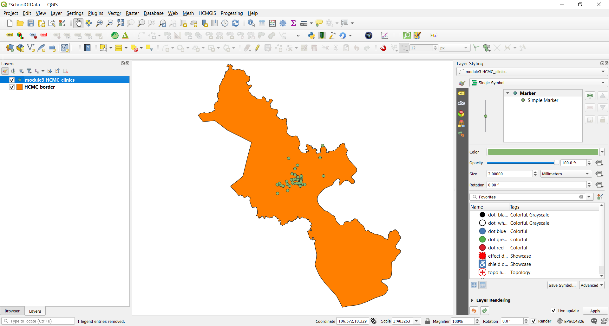

Hình 4.3: Hiển thị mặc định

4. Kích đúp chuột vào lớp polygon, chính là ranh giới hành chính của Tp.HCM. 
5. Chọn **Symbology Tab** 
6. Thay đổi **Fill color** thành **Transparent fill. Mẹo:** Kích vào mũi tên chỉ xuống, phía dưới Fill color
7. Kết quả như hình bên dưới. Bạn có thể thấy là không có màu nền.

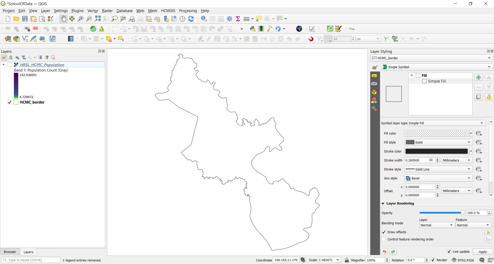

Hình 4.4: Polygon không có màu nền

8. Bước tiếp theo là định nghĩa symbology cho point layer (lớp cơ sở y tế)
9. Kích đúp chuột vào lớp **Cơ sở y tế** để mở cửa sổ **Layer Properties** . Đổi kiểu hiển thị Single Symbol thành **Categorized**, chọn  **Value** là amenity. Chọn Symbol và Color ramp, sau đó chọn Classify 

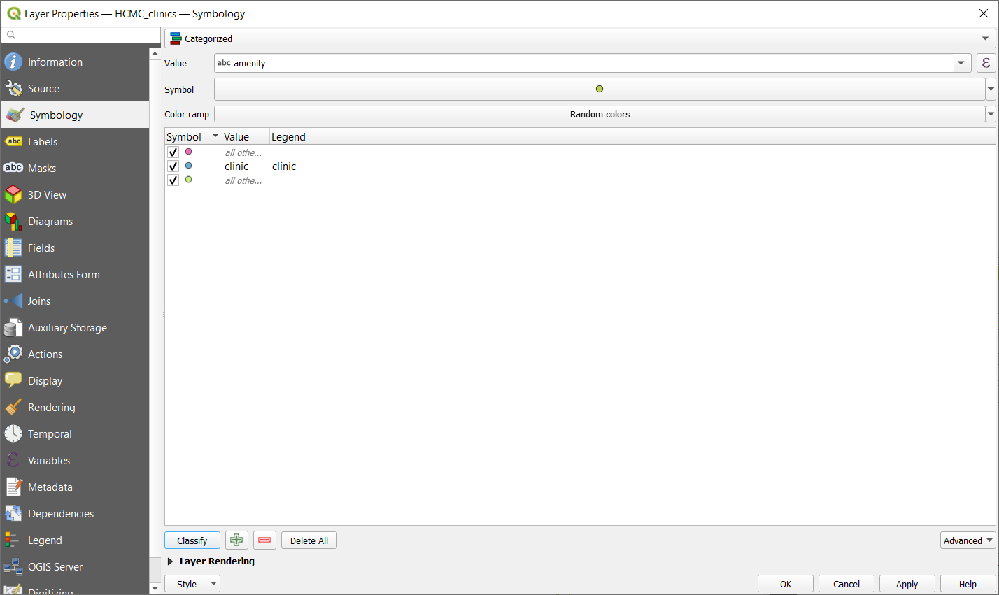

Hình 4.5: Layer Properties dialogue

10. Kết quả như hình bên dưới

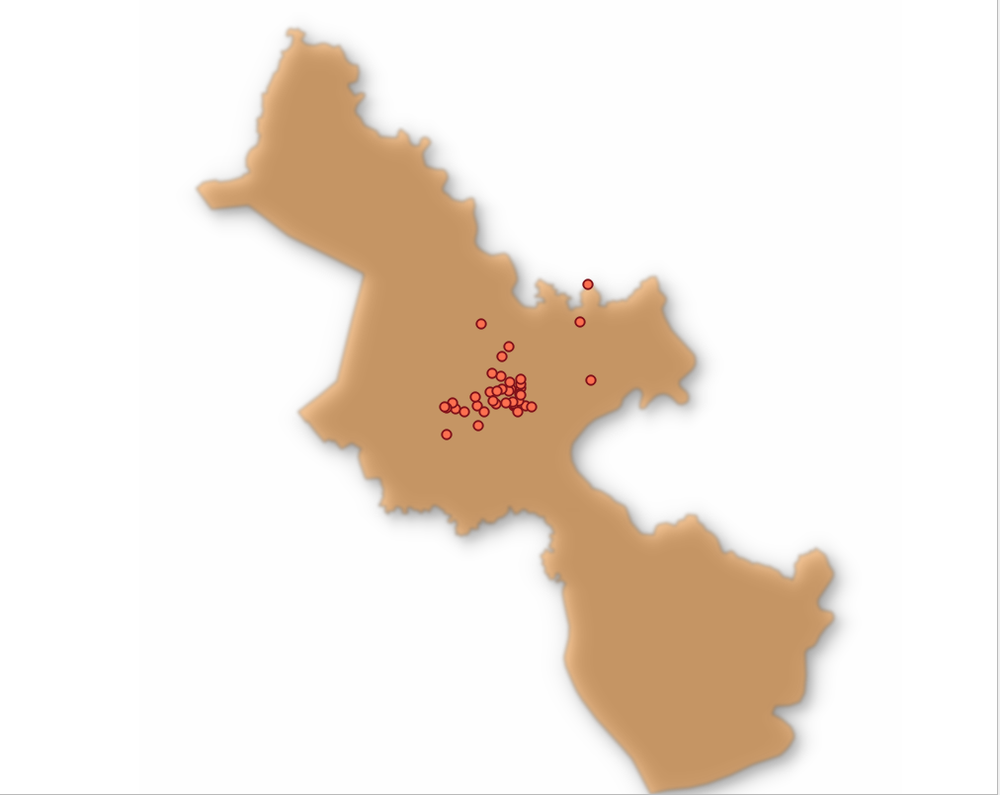

Hình 4.6: Kết quả hiển thị vector

11.  Cần nhớ sắp xếp các layer trong **Layer Panel** sao cho polygon layer nằm bên dưới point layer để point layer không bị che khuất.

#### **Ví dụ 2: Raster rendering**

1. Kích đúp chuột vào raster layer, chính là lớp mật độ dân số (population density). Đây cũng dữ liệu được chuẩn hoá để có thể hiển thị dưới dạng một choropleth map.
2. Chọn tab Symbology
3. Chọn kiểu styling là ‘Singleband pseudocolor’

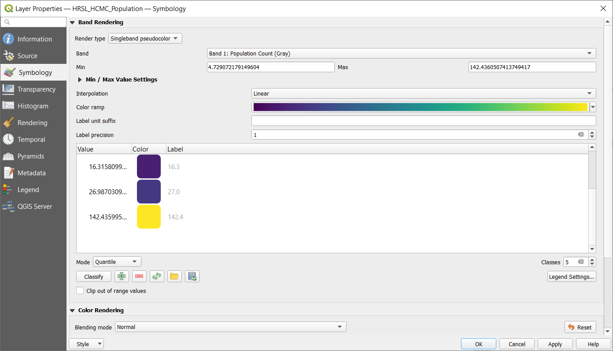

Hình 4.7: Symbology menu

4. Chọn phương pháp nội suy (interpolation), color ramp và mode. Chọn classify. Kết quả l2 một choropleth map hiển thị mật độ dân số của Tp.HCM

Hình 4.8: Mật độ dân số Tp.HCM

5.  Phóng to bản đồ để hiển thị chi tiết hơn.

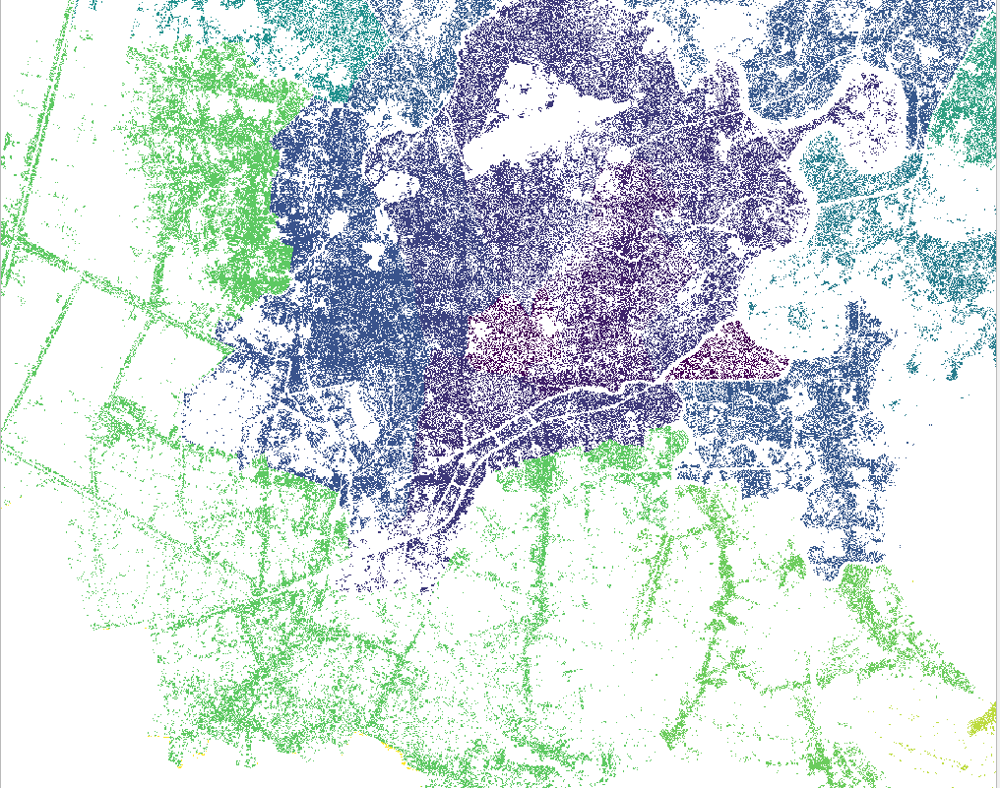

Hình 4.9: Bản đồ phóng to

6. Ngoài ra, có thể sử dụng **Layer Styling panel** để thiết lập hiển thị cho raster. 

#### **Câu hỏi**

1. Layer symbology là gì ?
2. Phương pháp hiển thị nào là thích hợp cho dữ liệu vector?
3. Các loại hiển thị dữ liệu raster?

#### **Các phương án trả lời**

1. a. graphical element represented as a marker, stroke or fill 
   b. a pointer to the original data
   c. a repository of different color schemes

2. a. single symbol renderer
   b. no symbols renderer
   c. categorized renderer
   d. graduated renderer
   e. proportional symbol 
   f. proportional symbol
   g. point cluster renderer 

3. a. singleband pseudocolor
   b. singleband gray
   c. paletted
   d. multiband color

### Phase 2: Blending modes và draw effects

#### **Nội dung**

*   Thay đổi cấu trúc symbol
*   Thay đổi draw effects and blending modes
*   Trực quan hoá dữ liệu

#### **Hướng dẫn**

1. Sau khi tải 02 layer vào QgiS, map canvas sẽ như hình bên dưới. Bạn có thể thấy là cả 02 layer đều có style đơn giản. Hướng dẫn này sẽ giải thích cách thay đổi draw effects và blending modes để trực quan hoá tốt hơn 
   
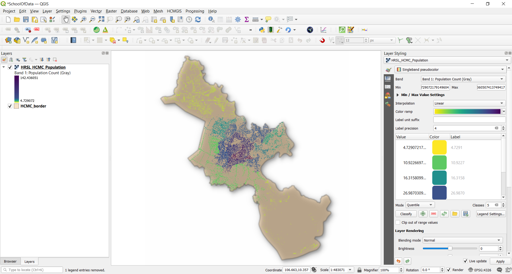

Hình 4.10: Workspace ban đầu

2. Mở cửa sổ Layer Properties, chọn Symbology cho lớp ranh giới hành chính. Mẹo: kích đúp chuột vào layer hoặc sử dụng Layer Styling Panel. Kích hoạt Layer Styling Panel bằng cách: View -> Panels -> Layer Styling.

Ở dưới Symbology menu, có một checkbox Draw Effects. Kích chọn checkbox này và kích chọn nút tuỳ chỉnh hiệu ứng  ở bên phải:

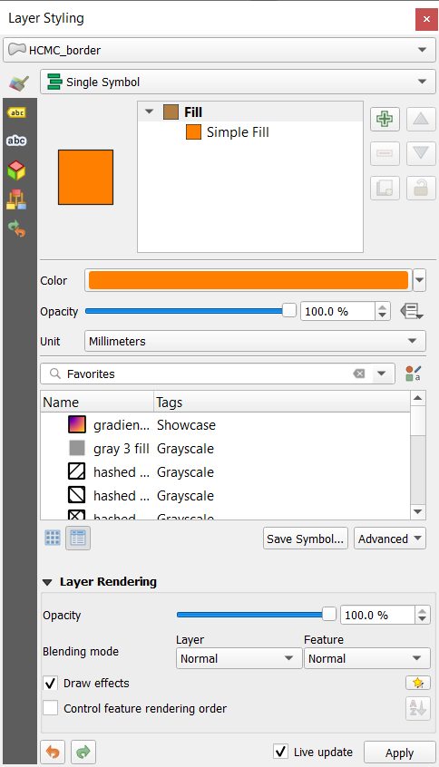

Hình 4.11: Layer Properties window và Symbology menu

3. Cửa sổ Effects Properties xuất hiện

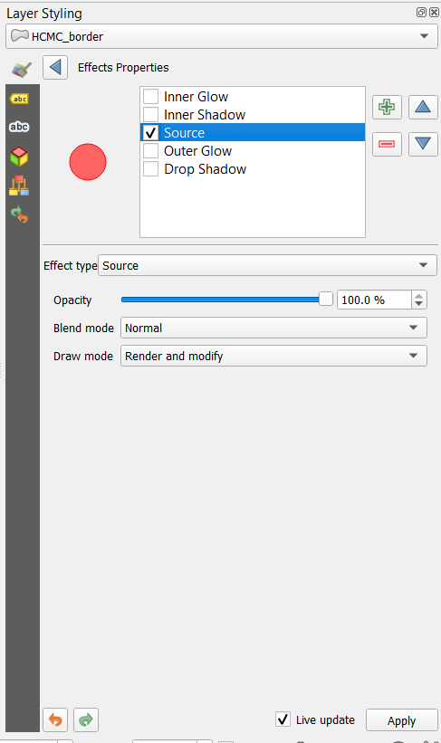

Hình 4.12: Effects properties dialogue
   
4. Bạn có thể thấy chỗ Effect type Source effect được chọn mặc định. Source effect không thú vị lắm - nó chỉ đơn giản là vẽ lại layer mà không thay đổi gì cả. Hãy chọn Blur effect bằng cách **kích vào combobox Effec type và chọn Blur**. Bạn có thể thử thiết lập các tham số cho tuỳ chọn Blur
   
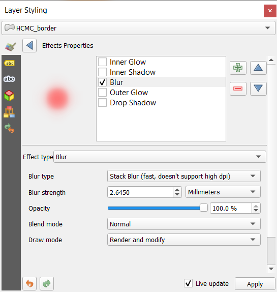

Hình 4.13: Chọn Effect Type la Blur

1. Chọn Apply, bạn có thể thấy polygon layer lúc này bị mờ.

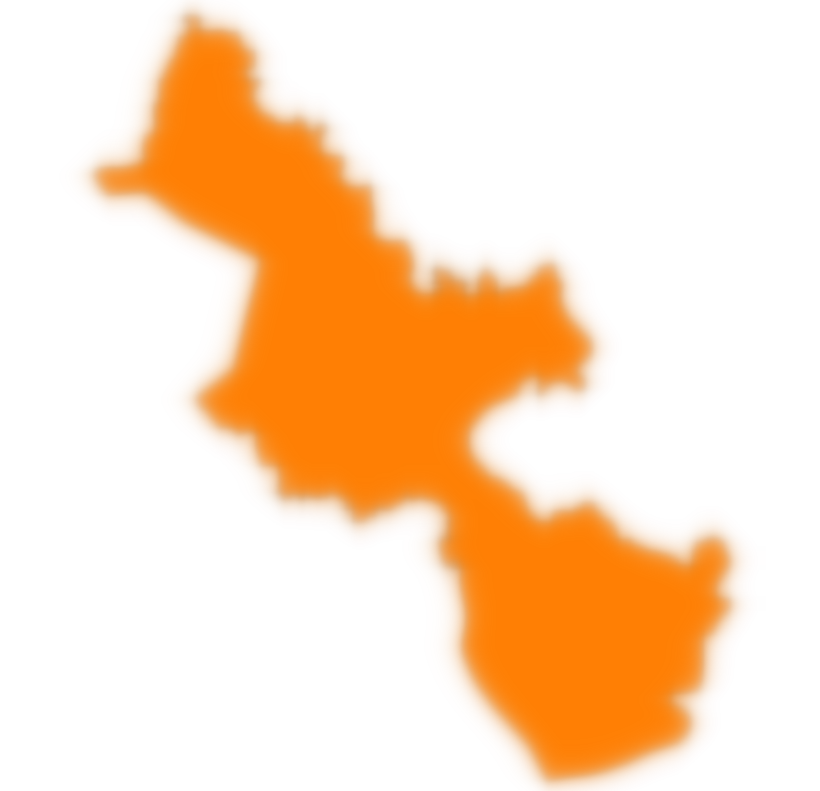

Hình 4.14: Layer với hiệu ứng mờ

6. Trở lại  **Effects Properties**. Hãy thử nâng cao hơn một chút. Thay vì chỉ chọn một hiệu ứng, có thể chọn cùng lúc nhiều hiệu ứng khác nhau. Hãy chọn thêm hiệu ứng **Drop shadow**

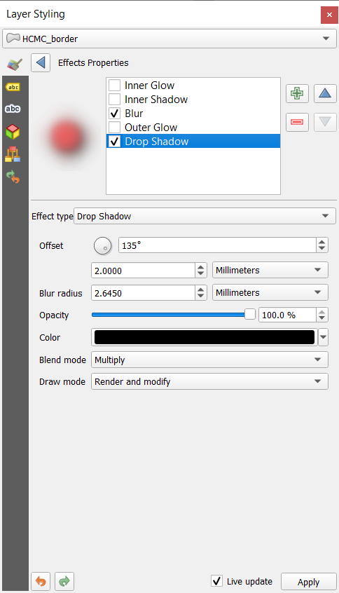

Hình 4.15: Effects properties dialogue

7. Các hiệu ứng sẽ được vẽ từ trên xuống, do đó Drop shadow sẽ hiển thị bên dưới source polygon

Hình 4.16: Hiệu ứng Drop shadow

8. Bạn có thể thêm bao nhiêu hiệu ứng tuỳ ý. Ví dụ một **inner glow** trên  **source effect**, với **drop shadow** ở dưới cùng. Hãy làm thử để xem kết quả thế nào!

Overall, remember that effects can either be applied to an entire layer, or to the individual symbol layers for features within a layer. Basically, the possibilities are almost endless! Python plugins can also extend this further by implementing additional effects.

For more examples about what you can do with Blending Modes and Draw Effects in QGIS, you can check out:
*   Hillshade in QGIS -[https://bnhr.xyz/2019/02/08/mapping-icebergs-in-qgis.html](https://bnhr.xyz/2019/02/08/mapping-icebergs-in-qgis.html)
*   Mapping Icebergs in QGIS - [https://bnhr.xyz/2019/02/08/mapping-icebergs-in-qgis.html](https://bnhr.xyz/2019/02/08/mapping-icebergs-in-qgis.html)

### Phase 3: Data defined overrides and geometry generators

#### **Content**

*   Run a spatial operation within the layer symbology

#### **Tutorial**

A geometry generator is a symbol layer type that lets you use code to create new geometries from existing features, and use the new 'generated' geometries as symbols that can, in turn, have styles applied. This is a powerful feature best explained with an example.

You can use the geometry generator symbology with all layer types (points, lines and polygons). The resulting symbol depends directly on the layer type.

Very briefly, the geometry generator symbology allows you to run some spatial operations within the symbology itself. For example you can run a real centroid spatial operation on a polygon layer without creating a point layer.

Moreover, you have all the styling options to change the appearance of the resulting symbol. Here’s an example tutorial;

1. Double click the administrative boundary layer
2. Click on Simple fill and change the Symbol layer type to Geometry generator. Before you start writing the spatial query, choose the Geometry Type in output. In this example we are going to create centroids for each feature, so change the Geometry Type to Point / Multipoint.

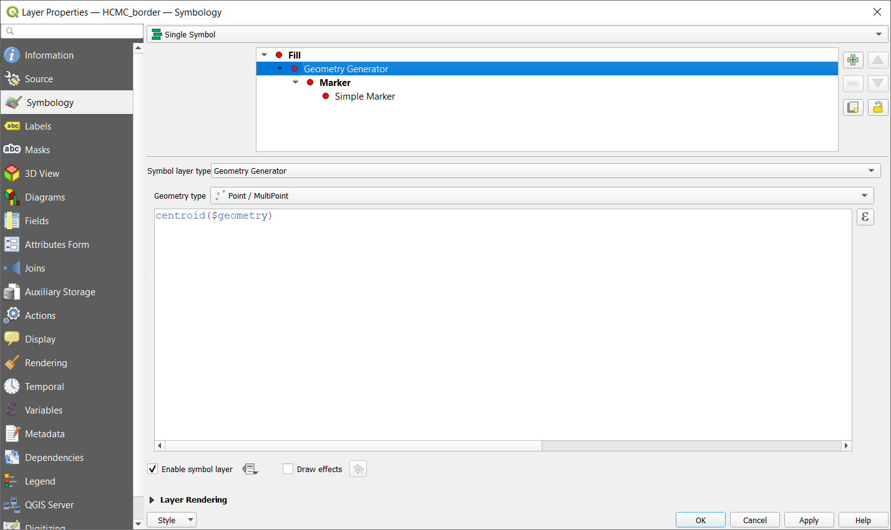

Figure 4.17: Centroid operation on administrative boundary layer

3. When you click on OK you will see that the administrative layer boundary is rendered as a point layer. We have just run a spatial operation within the layer symbology itself.

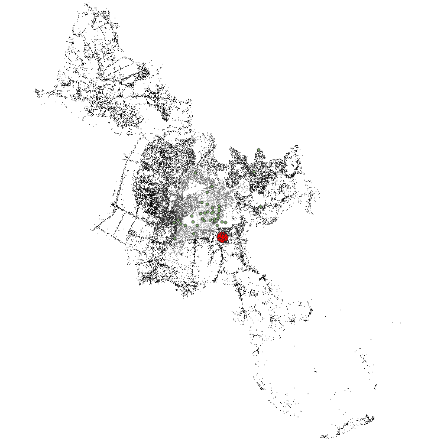

Figure 4.18: Point layer

4. Note that an alternative and easier way of writing spatial queries is using the ‘Expressions dialogue’. Click the 
 expressions  button to open the 'Expression string builder' dialogue box. Here you’ll have access to an extensive function reference. You can search for a function by name. For example, type centroid in the search bar.
5. With the Geometry generator symbology you can really go over the edge of normal symbology.
6. If you want to go further, write a spatial query to calculate a buffer zone around the point, line or polygon layer. 

#### **Quiz questions**

1.N/A

#### **Quiz answers**

1.N.A

   